# Create an example serverless app with Azure Logic Apps and Azure Functions in Visual Studio

[!INCLUDE [logic-apps-sku-consumption](../../includes/logic-apps-sku-consumption.md)]

You can quickly create, build, and deploy cloud-based "serverless" apps by using the services and capabilities in Azure, such as Azure Logic Apps and Azure Functions. When you use Azure Logic Apps, you can quickly and easily build workflows using low-code or no-code approaches to simplify orchestrating combined tasks. You can integrate different services, cloud, on-premises, or hybrid, without coding those interactions, having to maintain glue code, or learn new APIs or specifications. When you use Azure Functions, you can speed up development by using an event-driven model. You can use triggers that respond to events by automatically running your own code. You can use bindings to seamlessly integrate other services.

This article shows how to create an example serverless app that runs in multi-tenant Azure by using an Azure Quickstart Template. The template creates an Azure resource group project that includes an Azure Resource Manager deployment template. This template defines a basic logic app resource where a predefined a workflow includes a call to an Azure function that you define. The workflow definition includes the following components:

* A Request trigger that receives HTTP requests. To start this trigger, you send a request to the trigger's URL.
* An Azure Functions action that calls an Azure function that you can later define.
* A Response action that returns an HTTP response containing the result from the function.

For more information, review the following articles:

* [Serverless computing: An introduction to serverless technologies](https://azure.microsoft.com/overview/serverless-computing/)
* [About Azure Logic Apps](logic-apps-overview.md)
* [About Azure Functions](../azure-functions/functions-overview.md)
* [Azure Serverless: Overview for building cloud-based apps and solutions with Azure Logic Apps and Azure Functions](logic-apps-serverless-overview.md)

## Prerequisites

* An Azure account and subscription. If you don't have an Azure subscription, [sign up for a free Azure account](https://azure.microsoft.com/free/?WT.mc_id=A261C142F).

* Download and install the following tools, if you don't already have them:

  * [Visual Studio 2019, 2017, or 2015 (Community or other edition)](https://aka.ms/download-visual-studio). The Azure Logic Apps extension is currently unavailable for Visual Studio 2022. This quickstart uses Visual Studio Community 2019, which is free.

    > [!IMPORTANT]
    > When you install Visual Studio 2019 or 2017, make sure to select the **Azure development** workload.

  * [Microsoft Azure SDK for .NET (version 2.9.1 or later)](https://azure.microsoft.com/downloads/). Learn more about [Azure SDK for .NET](/dotnet/azure/intro).

  * [Azure PowerShell](https://github.com/Azure/azure-powershell#installation).

  * The latest Azure Logic Apps Tools extension for the Visual Studio version that you want. You can either [learn how install this extension from inside Visual Studio](/visualstudio/ide/finding-and-using-visual-studio-extensions), or you can download the respective versions of the Azure Logic Apps Tools from the Visual Studio Marketplace:

    * [Visual Studio 2019](https://aka.ms/download-azure-logic-apps-tools-visual-studio-2019)

    * [Visual Studio 2017](https://aka.ms/download-azure-logic-apps-tools-visual-studio-2017)

    * [Visual Studio 2015](https://aka.ms/download-azure-logic-apps-tools-visual-studio-2015)

    > [!IMPORTANT]
    > Make sure that you restart Visual Studio after you finish installing.

  * [Azure Functions Core Tools](https://www.npmjs.com/package/azure-functions-core-tools) so that you can locally debug your Azure function. For more information, review [Work with Azure Functions Core Tools](../azure-functions/functions-run-local.md).

* Access to the internet while using the embedded workflow designer.

  The designer requires an internet connection to create resources in Azure and to read the properties and data from [managed connectors](../connectors/managed.md) in your workflow. For example, if you use the SQL connector, the designer checks your server instance for available default and custom properties.

## Create a resource group project

To get started, create an Azure resource group project as a container for your serverless app. In Azure, a *resource group* is a logical collection that you use to organize the resources for an entire app. You can then manage and deploy these resources as a single asset. For a serverless app in Azure, a resource group includes the resources from Azure Logic Apps *and* Azure Functions. For more information, review [Resource Manager terminology](../azure-resource-manager/management/overview.md#terminology).

1. Open Visual Studio, and sign in with your Azure account, if prompted.

1. If the start window opens, select **Create a new project**.

   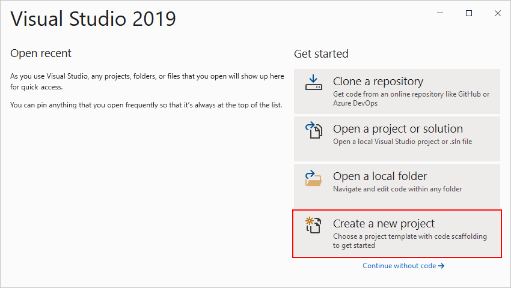

1. If the start window doesn't open, from the **File** menu, select **New** > **Project**.

   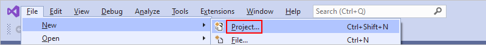

1. After the **Create a new project** window opens, in the search box, select the **Azure Resource Group** project template for either C# or Visual Basic. When you're ready, select **Next**. This example continues with C#.

   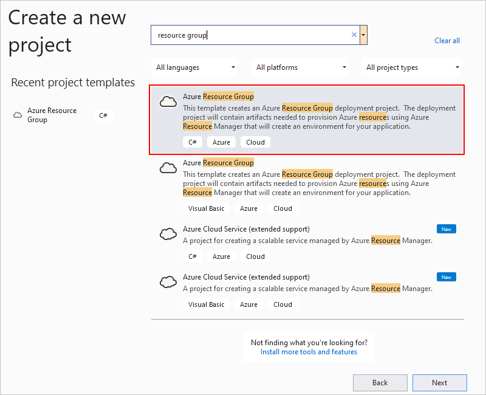

1. After the **Configure your new project** window opens, provide information about your project, such as the name. When you're done, select **Create**.

   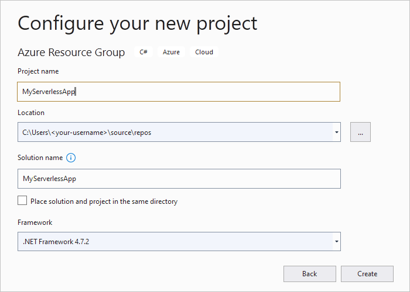

1. When the **Select Azure Template** window opens, from the **Show templates from this location** list, select **Azure QuickStart (github.com/Azure/azure-quickstart-templates)** as the templates location.

1. In the search box, enter `logic-app-and-function-app`. From the results, select the template named **quickstarts\microsoft.logic\logic-app-and-function-app**. When you're done, select **OK**.

   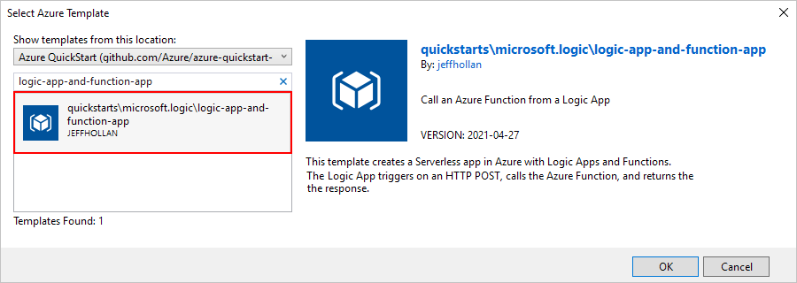

   Visual Studio creates your resource group project, including the solution container for your project.

   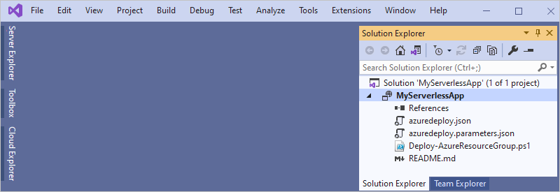

1. Next, deploy your solution to Azure.

   > [!IMPORTANT]
   > Make sure that you complete the deployment step. Otherwise, you can't open, review, and edit your logic app's workflow using the designer in Visual Studio.

## Deploy your solution

Before you can open your logic app using the designer in Visual Studio, you have to deploy your app to Azure. The designer can then create connections to the services and resources used in your logic app's workflow.

1. In Solution Explorer, from your resource project's shortcut menu, select **Deploy** > **New**.

   

1. After the **Deploy to Resource Group** window opens, follow these steps to provide the deployment information:

   1. After the window detects your current subscription, confirm your Azure subscription, or select a different subscription if you want.

   1. Create a new resource group in Azure. From the **Resource group** list, select **Create New**.

      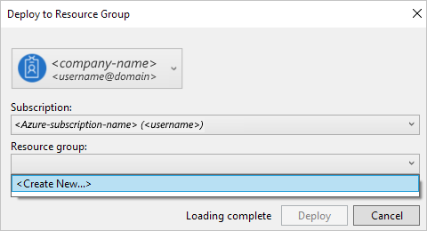

   1. After the **Create Resource Group** window opens, provide the following information:

      | Property | Description |
      |----------|-------------|
      | Resource group name | The name to give your resource group |
      | Resource group location | The Azure datacenter region to host your logic app resource |
      |||

      This example continues by creating a resource group in the West US region.

      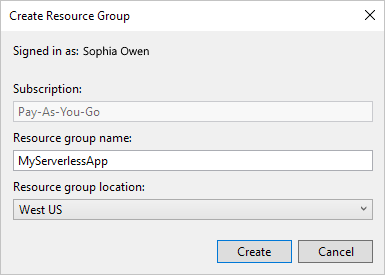

   1. Finish creating and deploying your solution, for example:

      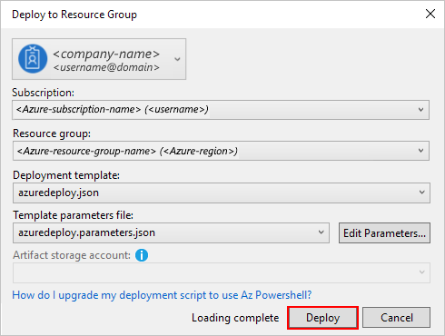

1. If the **Edit Parameters** window appears, provide the resource names to use for your deployed logic app resource and function app resource, and then save your changes.

   > [!IMPORTANT]
   > Make sure to use globally unique names for your logic app and function app.

   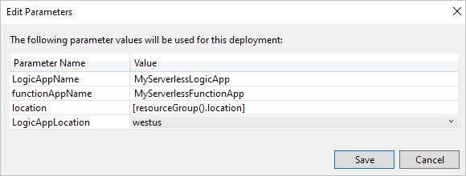

   When Visual Studio starts deployment to your resource group, your solution's deployment status appears in the Visual Studio **Output** window. After deployment finishes, your logic app is live in the Azure portal.

## Open and edit your deployed logic app

1. In Solution Explorer, from the **azuredeploy.json** file's shortcut menu, select **Open With Logic App Designer**.

   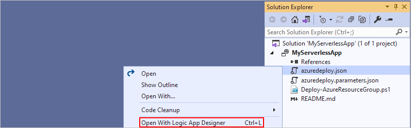

   > [!TIP]
   > If you don't have this command in Visual Studio 2019, confirm that Visual Studio has the latest updates.

1. After the workflow designer opens, you can continue by editing the workflow or adding steps. When you're done, remember to save your changes to the **azuredeploy.json** file.

   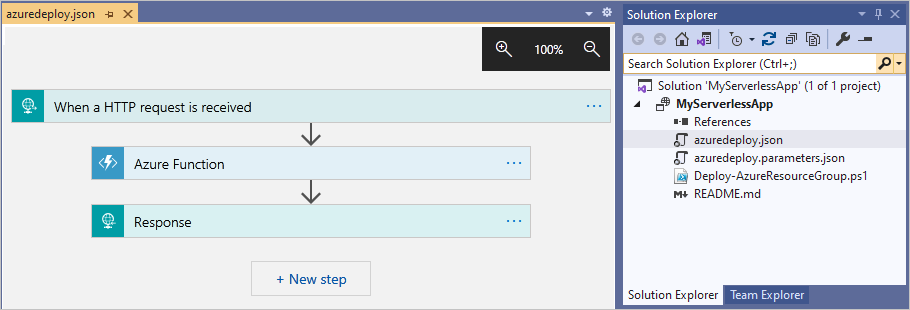

## Create an Azure Functions project

To create a C#-based Azure function from within your solution, create a C# class library project by following the [Quickstart: Create your first C# function in Azure using Visual Studio](../azure-functions/functions-create-your-first-function-visual-studio.md). Otherwise, to create an Azure Functions project and function using other languages, follow the following quickstarts:

* [Quickstart: Create a Java function in Azure using Visual Studio Code](../azure-functions/create-first-function-vs-code-java.md)
* [Quickstart: Create a JavaScript function in Azure using Visual Studio Code](../azure-functions/create-first-function-vs-code-node.md)
* [Quickstart: Create a PowerShell function in Azure using Visual Studio Code](../azure-functions/create-first-function-vs-code-powershell.md)
* [Quickstart: Create a Python function in Azure using Visual Studio Code](../azure-functions/create-first-function-vs-code-python.md)
* [Quickstart: Create a TypeScript function in Azure using Visual Studio Code](../azure-functions/create-first-function-vs-code-typescript.md)

## Deploy functions from Visual Studio

The deployment template in your solution can deploy any Azure functions that exist in your solution from the Git repo that's specified by variables in the **azuredeploy.json** file. If you create and author your Functions project in your solution, you can check the project into Git source control, such as GitHub or Azure DevOps, and then update the `repo` variable in the **azuredeploy.json** file so that the template deploys your Azure function.

## Manage logic apps and view run history

If you have logic app resources already deployed in Azure, you can edit, manage, view run history, and disable those apps from Visual Studio. For more information, review [Manage logic apps with Visual Studio](manage-logic-apps-with-visual-studio.md).

## Next steps

* For another example using Azure Logic Apps and Azure Functions, try [Tutorial: Automate tasks to process emails by using Azure Logic Apps, Azure Functions, and Azure Storage](tutorial-process-email-attachments-workflow.md)
