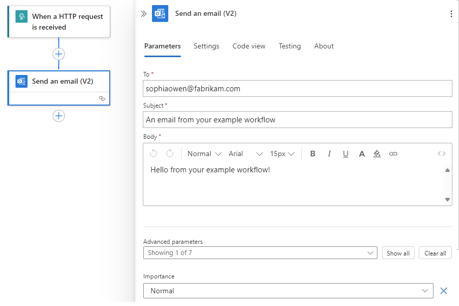

# Create an example Standard logic app workflow using the Azure portal

[!INCLUDE [logic-apps-sku-standard](../../includes/logic-apps-sku-standard.md)]

This how-to guide shows how to create an example automated workflow that waits for an inbound web request and then sends a message to an email account. More specifically, you create a [Standard logic app resource](logic-apps-overview.md#resource-environment-differences), which can include multiple [stateful and stateless workflows](single-tenant-overview-compare.md#stateful-stateless) that run in single-tenant Azure Logic Apps. 

- The **Request** trigger, which creates a callable endpoint that can handle inbound requests from any caller.
- The **Office 365 Outlook** connector, which provides an action to send email.

When you finish, your workflow looks like the following high level example:

:::image type="content" source="media/create-single-tenant-workflows-azure-portal/overview.png" alt-text="Screenshot shows Azure portal, example Consumption workflow with Request trigger and Office 365 Outlook action." lightbox="media/create-single-tenant-workflows-azure-portal/overview.png":::

You can have multiple workflows in a Standard logic app. Workflows in the same logic app and the tenant run in the same process as the Azure Logic Apps runtime, so they share the same resources and provide better performance.

> [!TIP]
>
> To learn more, you can ask Azure Copilot these questions:
>
> - *What's Azure Logic Apps?*
> - *What's a Standard logic app workflow?*
> - *What's the Request trigger?*
> - *What's the Office 365 Outlook connector?*
>
> To find Azure Copilot, on the [Azure portal](https://portal.azure.com) toolbar, select **Copilot**.

The operations in this example are from two connectors among [1000+ connectors](/connectors/connector-reference/connector-reference-logicapps-connectors) that you can use in a workflow. While this example is cloud-based, you can create workflows that integrate a vast range of apps, data, services, and systems across cloud, on-premises, and hybrid environments.

As you progress, you complete these high-level tasks:

To create a Standard logic app workflow from a prebuilt template that follows a commonly used pattern, see [Create a Standard logic app workflow from a prebuilt template](create-single-tenant-workflows-templates.md).

To create and manage a Standard logic app workflow using other tools, see [Create Standard workflows with Visual Studio Code](create-single-tenant-workflows-visual-studio-code.md). With Visual Studio Code, you can develop, test, and run workflows in your *local* development environment.

For more information, see the following documentation:

- [Single-tenant versus multitenant](single-tenant-overview-compare.md)
- [Create and deploy to different environments](logic-apps-overview.md#resource-environment-differences)

## Prerequisites

* An Azure account and subscription. If you don't have a subscription, [sign up for a free Azure account](https://azure.microsoft.com/free/?WT.mc_id=A261C142F).

* An [Azure Storage account](../storage/common/storage-account-overview.md). If you don't have one, you can either create a storage account in advance or during logic app creation.

  > [!NOTE]
  > 
  > The Standard logic app resource type is powered by Azure Functions and has [storage requirements similar to function apps](../azure-functions/storage-considerations.md). 
  > [Stateful workflows](single-tenant-overview-compare.md#stateful-stateless) perform storage transactions, such as 
  > using queues for scheduling and storing workflow states in tables and blobs. These transactions incur 
  > [storage charges](https://azure.microsoft.com/pricing/details/storage/). For more information about 
  > how stateful workflows store data in external storage, see [Stateful and stateless workflows](single-tenant-overview-compare.md#stateful-stateless).

* An email account from an email provider supported by Azure Logic Apps, such as Office 365 Outlook, Outlook.com, or Gmail. For other supported email providers, see [Connectors for Azure Logic Apps](/connectors/connector-reference/connector-reference-logicapps-connectors).

  This example uses Office 365 Outlook with a work or school account. If you use a different email account, the general steps stay the same, but the user experience might slightly differ. If you use Outlook.com, use your personal Microsoft account instead to sign in.

  > [!NOTE]
  >
  > If you want to use the Gmail connector, only G-Suite business accounts can use this connector without restriction in logic app workflows. 
  > If you have a Gmail consumer account, you can use this connector with only specific Google-approved services, or you can 
  > [create a Google client app to use for authentication with your Gmail connector](/connectors/gmail/#authentication-and-bring-your-own-application). 
  > For more information, see [Data security and privacy policies for Google connectors in Azure Logic Apps](../connectors/connectors-google-data-security-privacy-policy.md).

[!INCLUDE [api-test-http-request-tools-bullet](../../includes/api-test-http-request-tools-bullet.md)]

* To deploy your Standard logic app resource to an [App Service Environment v3 (ASEv3) - Windows plan only](../app-service/environment/overview.md), you have to create this environment resource first. You can then select this environment as the deployment location when you create your logic app. For more information, see [Resources types and environments](single-tenant-overview-compare.md#resource-environment-differences) and [Create an App Service Environment](../app-service/environment/creation.md).

* To enable communication from your Standard logic app workflows to a private endpoint on a Premium integration account, you must have an existing Azure virtual network. Both your logic app, virtual network, and integration account must use the same Azure region. Both your logic app and integration account must exist inside the same virtual network. For more information, see [Create a virtual network](../virtual-network/quick-create-portal.md).

* If you enable [Application Insights](/azure/azure-monitor/app/app-insights-overview) on your logic app, you can optionally enable diagnostics logging and tracing. You can do so either when you create your logic app or after deployment. You need to have an Application Insights instance, but you can [create this resource in advance](/azure/azure-monitor/app/create-workspace-resource), when you create your logic app, or after deployment.

## Best practices and recommendations

For optimal designer responsiveness and performance, review and follow these guidelines:

- Use no more than 50 actions per workflow. Exceeding this number of actions raises the possibility for slower designer performance.

- Consider splitting business logic into multiple workflows where necessary.

- When you add more workflows to your logic app resource, you increase cold start times and the risk for longer load times, which negatively affect performance. To reduce these risks or if you have mission-critical logic apps that require zero downtime deployments, [set up deployment slots](set-up-deployment-slots.md).

## Create a Standard logic app resource

1. In the [Azure portal](https://portal.azure.com), sign in with your Azure account.

1. In the Azure portal search box, enter **logic app**, and select **Logic apps**.

   :::image type="content" source="media/create-single-tenant-workflows-azure-portal/find-select-logic-apps.png" alt-text="Screenshot shows Azure portal search box with the words, logic app, and shows the selection, Logic apps." lightbox="media/create-single-tenant-workflows-azure-portal/find-select-logic-apps.png":::

1. On the **Logic apps** page toolbar, select **Add**.

   The **Create Logic App** page appears and shows the following options:

   [!INCLUDE [logic-apps-host-plans](includes/logic-apps-host-plans.md)]

1. On the **Create Logic App** page, select **Standard (Workflow Service Plan)**.

   | Plan type | Description |
   |-----------|-------------|
   | **Standard** | This logic app type is the default selection. Workflows run in single-tenant Azure Logic Apps and use the [Standard pricing model](logic-apps-pricing.md#standard-pricing). |
   | **Consumption** | This logic app type and workflow runs in global, multitenant Azure Logic Apps and uses the [Consumption pricing model](logic-apps-pricing.md#consumption-pricing). |

1. On the **Create Logic App** page, on the **Basics** tab, provide the following basic information about your logic app:

   | Property | Required | Value | Description |
   |----------|----------|-------|-------------|
   | **Subscription** | Yes | <*Azure-subscription-name*> | Your Azure subscription name.   This example uses **Pay-As-You-Go**. |
   | **Resource Group** | Yes | <*Azure-resource-group-name*> | The [Azure resource group](../azure-resource-manager/management/overview.md#terminology) where you create your logic app and related resources. This name must be unique across regions and can contain only letters, numbers, hyphens (**-**), underscores (**_**), parentheses (**()**), and periods (**.**).   This example creates a resource group named **Fabrikam-Workflows-RG**. |
   | **Logic App name** | Yes | <*logic-app-name*> | Your logic app resource name, which must be unique across regions and can contain only letters, numbers, hyphens (**-**), underscores (**_**), parentheses (**()**), and periods (**.**).   **Note**: Your logic app's name automatically gets the suffix, **.azurewebsites.net**, because the Standard logic app resource is powered by the single-tenant Azure Logic Apps runtime, which uses the Azure Functions extensibility model and is hosted as an extension on the Azure Functions runtime. Azure Functions uses the same app naming convention.   This example creates a logic app resource named **Fabrikam-Workflows**. |
   | **Region** | Yes | <*Azure-region*> | The Azure datacenter region for your logic app.   This example uses **West US**. |
   | **Windows Plan** | Yes | <*plan-name*> | The plan name to use. Either select an existing plan name or provide a name for a new plan.   This example uses the name **My-App-Service-Plan**.   **Note**: Don't use a Linux-based App Service plan. Only the Windows-based App Service plan is supported. |
   | **Pricing plan** | Yes | <*pricing-tier*> | The [pricing tier](../app-service/overview-hosting-plans.md) to use for your logic app and workflows. Your selection affects the pricing, compute, memory, and storage that your logic app and workflows use.   For more information, review [Hosting plans and pricing tiers](logic-apps-pricing.md#standard-pricing). |

   > [!NOTE]
   >
   > If you select an Azure region that supports availability zone redundancy, the **Zone redundancy** 
   > section is enabled. This section offers the choice to enable availability zone redundancy 
   > for your logic app. However, currently supported Azure regions don't include **West US**, 
   > so you can ignore this section for this example. For more information, see 
   > [Protect logic apps from region failures with zone redundancy and availability zones](set-up-zone-redundancy-availability-zones.md).

   When you finish, your settings look similar to the following example:

   :::image type="content" source="media/create-single-tenant-workflows-azure-portal/create-logic-app-basics.png" alt-text="Screenshot shows Azure portal and page named Create Logic App Workflow Service Plan." lightbox="media/create-single-tenant-workflows-azure-portal/create-logic-app-basics.png":::

   > [!NOTE]
   > 
   > The **FUNCTIONS_WORKER_RUNTIME** app setting is required for your Standard logic app, and the
   > value was previously set to **node**. However, the required value is now **dotnet** for all new
   > and existing deployed Standard logic apps. This change in value shouldn't affect your workflow's
   > runtime, so everything should work the same way as before. For more information, see the
   > [**FUNCTIONS_WORKER_RUNTIME** app setting](edit-app-settings-host-settings.md#reference-local-settings-json).
   > 
   > The **APP_KIND** app setting value is required for your Standard logic app, and the value must
   > be **workflowApp**. However, in some scenarios, this app setting might be missing, for example,
   > due to automation using Azure Resource Manager templates or other scenarios where the setting
   > isn't included. If certain actions don't work, such as the **Execute JavaScript Code** action,
   > or if the workflow stops working, check that the **APP_KIND** app setting exists and is set to **workflowApp**.
   > For more information, see the [**APP_KIND** app setting](edit-app-settings-host-settings.md#reference-local-settings-json).

1. When you finish, select **Next: Storage**.

1. On the **Storage** tab, provide the following information about the storage solution and hosting plan to use for your logic app.

   | Property | Required | Value | Description |
   |----------|----------|-------|-------------|
   | **Storage type** | Yes | - **Azure Storage**  - **SQL and Azure Storage** | The storage type that you want to use for workflow-related artifacts and data.   - To deploy only to Azure, select **Azure Storage**.   - To use SQL as primary storage and Azure Storage as secondary storage, select **SQL and Azure Storage**, and review [Set up SQL database storage for Standard logic apps in single-tenant Azure Logic Apps](set-up-sql-db-storage-single-tenant-standard-workflows.md).   **Note**: If you're deploying to an Azure region, you still need an Azure storage account, which is used to complete the one-time hosting of the logic app's configuration on the Azure Logic Apps platform. The workflow's state, run history, and other runtime artifacts are stored in your SQL database.   For deployments to a custom location that is hosted on an Azure Arc cluster, you only need SQL as your storage provider. |
   | **Storage account** | Yes | <*Azure-storage-account-name*> | The [Azure Storage account](../storage/common/storage-account-overview.md) to use for storage transactions.   This resource name must be unique across regions and have 3-24 characters with only numbers and lowercase letters. Either select an existing account or create a new account.   This example creates a storage account named **mystorageacct**.    **Note**: Make sure that **Maximum Compatibility** is the default security setting for the storage account file share. Otherwise, your logic app and workflows might fail to start, and you get the following error: **The user name or password is incorrect: 'C:\home\data\Functions\secrets\Sentinels'**. |

1. On the **Networking** tab, you can leave the default options to follow the example. However, for specific, real-world scenarios, make sure to review and select the following appropriate options. You can also change this configuration after you deploy your logic app resource. For more information, see [Secure traffic between Standard logic apps and Azure virtual networks using private endpoints](secure-single-tenant-workflow-virtual-network-private-endpoint.md).

   The following **Enable public access** setting applies to endpoints on your logic app and doesn't affect whether your logic app can communicate with Azure resources in the same virtual network, for example, a Premium integration account with a private endpoint. To access such Azure resources, your logic app must exist in the same virtual network as these resources.

   | Enable public access | Behavior |
   |----------------------|----------|
   | **On** | Your logic app has a public endpoint with an inbound address that's open to the internet. For clients that are outside an Azure virtual network, they can use this endpoint to access your logic app, but not the virtual network. |
   | **Off** | Your logic app has no public endpoint, but has a private endpoint instead for communication within an Azure virtual network, and is isolated within that virtual network. The private endpoint can communicate with endpoints in the virtual network, but only from clients within that network. This configuration also means that logic app traffic can be governed by network security groups or affected by virtual network routes. |

   The following settings control Standard logic app access to endpoints in a virtual network:

   | Enable network injection | Behavior |
   |--------------------------|----------|
   | **On** | Your logic app workflows can privately and securely communicate with endpoints in the virtual network.   To enable communication between your logic app and a private endpoint on a Premium integration account, select this option, which also makes the **Virtual Network** section available. For **Virtual Network**, select the Azure virtual network to use. This choice makes the **Inbound access** and **Outbound access** sections available. |
   | **Off** | Your logic app workflows can't communicate with endpoints in the virtual network. |

   The following sections appear after you select a virtual network when **Enable network injection** is set to **On**.

   **Inbound access**

   - **Enable private endpoints**: Applies to private endpoints on your Standard logic app and is available only when **Enable public access** is set to **Off**.

   **Outbound access**

   - **Enable VNet integration**: To enable communication between a Standard logic app and a private endpoint on a Premium integration account, select **On** and the subnet to use.

1. If your creation and deployment settings support using [Application Insights](/azure/azure-monitor/app/app-insights-overview), you can optionally enable diagnostics logging and tracing for your logic app workflows by following these steps:

   1. On the **Monitoring** tab, under **Application Insights**, set **Enable Application Insights** to **Yes**.

   1. For the **Application Insights** setting, either select an existing Application Insights instance, or if you want to create a new instance, select **Create new** and provide the name that you want to use.

1. After Azure validates your logic app settings, on the **Review + create** tab, select **Create**, for example:

   :::image type="content" source="media/create-single-tenant-workflows-azure-portal/check-logic-app-settings.png" alt-text="Screenshot shows Azure portal and new logic app resource settings." lightbox="media/create-single-tenant-workflows-azure-portal/check-logic-app-settings.png":::

   > [!NOTE]
   >
   > If you get a validation error during this step, open and review the error details. 
   > For example, if your selected region reaches a quota for resources that you're 
   > trying to create, you might have to try a different region.

   After Azure finishes deployment, your logic app resource is automatically live but doesn't do anything yet because the resource is empty, and you haven't added any workflows yet.

1. On the deployment completion page, select **Go to resource** so that you can add a blank workflow.

   :::image type="content" source="media/create-single-tenant-workflows-azure-portal/logic-app-completed-deployment.png" alt-text="Screenshot showing Azure portal and finished deployment." lightbox="media/create-single-tenant-workflows-azure-portal/logic-app-completed-deployment.png":::

## Add a blank workflow

After you create your empty logic app resource, you have to add your first workflow.

1. After Azure opens the resource, on your logic app menu, under **Workflows**, select **Workflows**. On the **Workflows** toolbar, select **Add**.

   :::image type="content" source="media/create-single-tenant-workflows-azure-portal/logic-app-add-blank-workflow.png" alt-text="Screenshot shows logic app menu with Workflows selected. The toolbar shows selected option for Add." lightbox="media/create-single-tenant-workflows-azure-portal/logic-app-add-blank-workflow.png":::

1. After the **New workflow** pane opens, provide a name for your workflow, and select the state type, either [**Stateful** or **Stateless**](single-tenant-overview-compare.md#stateful-stateless). When you finish, select **Create**.

   This example adds a blank stateful workflow named **Stateful-Workflow**. By default, the workflow is enabled but doesn't do anything until you add a trigger and actions.

   

1. From the workflow list, select the blank stateful workflow.

1. On the workflow menu, under **Developer**, select **Designer**.

   The designer surface shows a prompt to select a trigger operation. By default, the prompt is already selected so that a pane with available triggers already appears open.

Now, add a trigger that starts your workflow.

## Add a trigger

This example workflow starts with the [built-in **Request** trigger](../connectors/connectors-native-reqres.md) named **When a HTTP request is received**. This trigger creates an endpoint that other services or logic app workflows can call and waits for those inbound calls or requests to arrive. Built-in operations run natively and directly within the Azure Logic Apps runtime.

1. On the workflow designer, make sure that your blank workflow is open and that the **Add a trigger** prompt is selected on the designer surface.

1. By using **request** as the search term, [follow these steps to add the built-in **Request** trigger named **When a HTTP request is received**](create-workflow-with-trigger-or-action.md?tabs=standard#add-trigger) to your workflow.

   When the trigger appears on the designer, the trigger's information pane opens to show the trigger's properties, settings, and other actions.

   

1. Save your workflow. On the designer toolbar, select **Save**.

   When you save a workflow for the first time, and that workflow starts with a **Request** trigger, Azure Logic Apps automatically generates a URL for an endpoint that's created by the **Request** trigger. Later, when you test your workflow, you send a request to this URL, which fires the trigger and starts the workflow run.

## Add an action

This example workflow continues with the [Office 365 Outlook managed connector action](../connectors/connectors-create-api-office365-outlook.md) named **Send an email**. Managed connector operations run in Azure versus natively and directly on the Azure Logic Apps runtime.

1. On the designer, under the trigger that you added, select the plus sign (**+**) > **Add an action**.

   The **Add an action** pane opens so that you can select the next action.

1. By using **office send an email** as the search term, [follow these steps to add the Office 365 Outlook action that's named **Send an email (V2)**](create-workflow-with-trigger-or-action.md?tabs=standard#add-action) to your workflow.

1. In the action's information pane, on the **Create Connection** tab, select **Sign in** so that you can create a connection to your email account.

   

1. When you're prompted for access to your email account, sign in with your account credentials.

   > [!NOTE]
   > If you get the error message, **"Failed with error: 'The browser is closed.'. Please sign in again"**, 
   > check whether your browser blocks third-party cookies. If these cookies are blocked, 
   > try adding **https://portal.azure.com** to the list of sites that can use cookies. 
   > If you're using incognito mode, make sure that third-party cookies aren't blocked while working in that mode.
   > 
   > If necessary, reload the page, open your workflow, add the email action again, and try creating the connection.

   After Azure creates the connection, the **Send an email** action appears on the designer and is selected by default. If the action isn't selected, select the action so that its information pane is also open.

1. In the action information pane, on the **Parameters** tab, provide the required information for the action, for example:

   

   | Property | Required | Value | Description |
   |----------|----------|-------|-------------|
   | **To** | Yes | <*your-email-address*> | The email recipient, which can be your email address for test purposes. This example uses the fictitious email, **sophiaowen@fabrikam.com**. |
   | **Subject** | Yes | **An email from your example workflow** | The email subject |
   | **Body** | Yes | **Hello from your example workflow!** | The email body content |

   > [!NOTE]
   > When making any changes in the information pane on the **Settings**, **Static Result**, or **Run After** tabs, 
   > make sure that you select **Done** to commit those changes before you switch tabs or change focus to the designer. 
   > Otherwise, the designer won't keep your changes.

1. Save your workflow. On the designer toolbar, select **Save**.

1. If your environment has strict network requirements or firewalls that limit traffic, you have to set up permissions for any trigger or action connections that exist in your workflow. To find the fully qualified domain names, review [Find domain names for firewall access](#firewall-setup).

   Otherwise, to test your workflow, [manually trigger a run](#trigger-workflow).

## Delete items from the designer

To delete an item in your workflow from the designer, follow any of these steps:

* Select the item, open the item's shortcut menu (Shift+F10), and select **Delete**. To confirm, select **OK**.

* Select the item, and press the delete key. To confirm, select **OK**.

* Select the item so that information pane opens for that item. In the pane's upper right corner, open the ellipses (**...**) menu, and select **Delete**. To confirm, select **OK**.

  

  > [!TIP]
  >
  > If the ellipses menu isn't visible, expand your browser window wide enough so that 
  > the information pane shows the ellipses (**...**) button in the upper right corner.

## Find domain names for firewall access

Before you deploy your logic app and run your workflow in the Azure portal, if your environment has strict network requirements or firewalls that limit traffic, you have to set up network or firewall permissions for any trigger or action connections in the workflows that exist in your logic app.

To find the inbound and outbound IP addresses used by your logic app and workflows, follow these steps:

1. On your logic app menu, under **Settings**, select **Networking**.

1. On the networking page, find and review the **Inbound Traffic** and **Outbound Traffic** sections.

To find the fully qualified domain names (FQDNs) for connections, follow these steps:

1. On your logic app menu, under **Workflows**, select **Connections**. On the **API Connections** tab, select the connection's resource name, for example:

   

1. Expand your browser wide enough so that when **JSON View** appears in the browser's upper right corner, select **JSON View**.

   

1. Copy and save the **connectionRuntimeUrl** property value somewhere safe so that you can set up your firewall with this information.

   

1. For each connection, repeat the relevant steps.

## Trigger the workflow

In this example, the workflow runs when the **Request** trigger receives an inbound request, which is sent to the URL for the endpoint that's created by the trigger. When you saved the workflow for the first time, Azure Logic Apps automatically generated this URL. So, before you can send this request to trigger the workflow, you need to find this URL.

1. On the workflow designer, select the **Request** trigger that's named **When a HTTP request is received**.

1. After the information pane opens, on the **Parameters** tab, find the **HTTP POST URL** property. To copy the generated URL, select the **Copy Url** (copy file icon), and save the URL somewhere else for now. The URL follows this format:

   **`https://<*logic-app-name*>.azurewebsites.net:443/api/<*workflow-name*>/triggers/manual/invoke?api-version=2020-05-01&sp=%2Ftriggers%2Fmanual%2Frun&sv=1.0&sig=<*shared-access-signature*>`**

   

   For this example, the URL looks like this:

   **`https://fabrikam-workflows.azurewebsites.net:443/api/Fabrikam-Stateful-Workflow/triggers/manual/invoke?api-version=2020-05-01&sp=%2Ftriggers%2Fmanual%2Frun&sv=1.0&sig=xxxxxXXXXxxxxxXXXXxxxXXXXxxxxXXXX`**

   > [!TIP]
   >
   > You can also find the endpoint URL on your logic app **Overview** page in the **Workflow URL** property.
   >
   > 1. On the resource menu, select **Overview**.
   > 1. On the **Overview** pane, find the **Workflow URL** property.
   > 1. To copy the endpoint URL, move your pointer over the end of the endpoint URL text, 
   >    and select **Copy to clipboard** (copy file icon).

1. To test the endpoint URL and trigger the workflow, send an HTTP request to the URL, including the method that the **Request** trigger expects, by using your HTTP request tool and its instructions.

   This example uses the **GET** method with the copied URL, which looks like the following sample:

   **`GET https://fabrikam-workflows.azurewebsites.net:443/api/Fabrikam-Stateful-Workflow/triggers/manual/invoke?api-version=2020-05-01&sp=%2Ftriggers%2Fmanual%2Frun&sv=1.0&sig=xxxxxXXXXxxxxxXXXXxxxXXXXxxxxXXXX`**

   When the trigger fires, the example workflow runs and sends an email that appears similar to this example:

   

## Review workflow run history

After a stateful workflow finishes running, you can view the workflow's run history, including the status for the overall run, for the trigger, and for each action along with their inputs and outputs. In the Azure portal, workflow run history and trigger history appear at the workflow level, not at the logic app resource level. For more information, see [Review workflow run history](monitor-logic-apps.md?tabs=standard#review-runs-history) and [Review trigger history](monitor-logic-apps.md?tabs=standard#review-trigger-history).

For this example workflow, the workflow run history looks similar to the following sample:

## Review trigger history

For a stateful workflow, you can review the trigger history for each run, including the trigger status along with inputs and outputs, separately from the [workflow run history](#review-run-history). In the Azure portal, trigger history and run history appear at the workflow level, not the logic app level. For more information, see [Review trigger history](monitor-logic-apps.md?tabs=standard#review-trigger-history).

## Resubmit workflow run with same inputs

For an existing stateful workflow run, you can rerun the entire workflow with the same inputs that were previously used for that run. For more information, see [Rerun a workflow with same inputs](monitor-logic-apps.md?tabs=standard#resubmit-workflow-run).

## Set up managed identity access to your storage account

By default, your Standard logic app authenticates access to your Azure Storage account by using a connection string. However, you can set up a user-assigned managed identity to authenticate access instead.

> [!NOTE]
>
> Currently, you can't disable storage account key access for Standard logic apps that use the 
> Workflow Service Plan hosting option. However, if your logic app uses the App Service Environment 
> v3 hosting option, you can disable storage account key access after you finish the steps 
> to set up managed identity authentication.

1. In the [Azure portal](https://portal.azure.com), [follow these steps to create a user-assigned managed identity](/entra/identity/managed-identities-azure-resources/how-manage-user-assigned-managed-identities?pivots=identity-mi-methods-azp#create-a-user-assigned-managed-identity).

1. From your user-assigned identity, get the resource ID:

   1. On the user-assigned managed identity menu, under **Settings**, select **Properties**.

   1. From the **Id** property, copy and save the resource ID.

1. From your storage account, get the URIs for the Blob, Queue, and Table services:

   1. On the storage account menu, under **Settings**, select **Endpoints**.

   1. Copy and save the URIs for **Blob service**, **Queue service**, and **Table service**.

1. On your storage account, add the necessary role assignments for your user-assigned identity:

   1. On the storage account menu, select **Access control (IAM)**.

   1. On the **Access control (IAM)** page toolbar, from the **Add** menu, select **Add role assignment**.

   1. On the **Job function roles** tab, add each of the following roles to the user-assigned identity:

      - **Storage Account Contributor**
      - **Storage Blob Data Owner**
      - **Storage Queue Data Contributor**
      - **Storage Table Data Contributor**

   For more information, see [Assign Azure roles using the Azure portal](../role-based-access-control/role-assignments-portal.yml) and [Understand role assignments](../role-based-access-control/role-assignments.md).

1. [Follow these steps to add the user-assigned managed identity to your Standard logic app resource](authenticate-with-managed-identity.md?tabs=standard#add-user-assigned-identity-to-logic-app-in-the-azure-portal).

1. If your Standard logic app uses the hosting option named **Workflow Service Plan**, enable runtime scale monitoring:

   > [!NOTE]
   >
   > If your logic app uses the App Service Environment (ASE) v3 hosting option, skip 
   > the steps for runtime scale monitoring because ASE doesn't support this capability.

   1. On the logic app menu, under **Settings**, select **Configuration**.

   1. On the **Workflow runtime settings** tab, for **Runtime Scale Monitoring**, select **On**.

   1. On the **Configuration** toolbar, select **Save**.

1. On your Standard logic app, set up the resource ID and service URIs:

   1. On the logic app menu, select **Overview**.

   1. On the **Overview** page toolbar, select **Stop**.

   1. On the logic app menu, under **Settings**, select **Environment variables**.

   1. On the **App settings** tab, select **Add** to add the following app settings and values:

      | App setting | Value |
      |-------------|-------|
      | **AzureWebJobsStorage__managedIdentityResourceId** | The resource ID for your user-assigned managed identity |
      | **AzureWebJobsStorage__blobServiceUri** | The Blob service URI for your storage account |
      | **AzureWebJobsStorage__queueServiceUri** | The Queue service URI for your storage account |
      | **AzureWebJobsStorage__tableServiceUri** | The Table service URI for your storage account |
      | **AzureWebJobsStorage__credential** | **managedIdentity** |

   1. On the **App settings** tab, delete the app setting named **AzureWebJobsStorage**, which is set to the connection string associated with your storage account.

   1. When you finish, select **Apply**, which saves your changes and restarts your logic app.

      Your changes might take several moments to take effect. If necessary, on your logic app menu, select **Overview**, and on the toolbar, select **Refresh**.

      The following message might appear, but it isn't an error and doesn't affect your logic app:

      **"AzureWebjobsStorage" app setting is not present.**

## Enable run history for stateless workflows

To debug a stateless workflow more easily, you can enable the run history for that workflow, and then disable the run history when you're done. Follow these steps for the Azure portal, or if you're working in Visual Studio Code, see [Create stateful and stateless workflows in Visual Studio Code](create-single-tenant-workflows-visual-studio-code.md#enable-run-history-stateless).

1. In the [Azure portal](https://portal.azure.com), open your Standard logic app resource.

1. On the logic app menu, under **Settings**, select **Configuration**.

1. On the **Application settings** tab, select **New application setting**.

1. On the **Add/Edit application setting** pane, in the **Name** box, enter this operation option name: 

   **Workflows.{*yourWorkflowName*}.OperationOptions**

1. In the **Value** box, enter the following value: **WithStatelessRunHistory**

   

1. To finish this task, select **OK**. On the **Configuration** pane toolbar, select **Save**.

1. To disable the run history when you're done, either set the property named **Workflows.{*your-workflow-name*}.OperationOptions** to **None**, or delete the property and its value.

## Enable or open Application Insights after deployment

During workflow run, your logic app emits telemetry along with other events. You can use this telemetry to get better visibility into how well your workflow runs and how the Logic Apps runtime works in various ways. You can monitor your workflow by using [Application Insights](/azure/azure-monitor/app/app-insights-overview), which provides near real-time telemetry (live metrics). This capability can help you investigate failures and performance problems more easily when you use this data to diagnose issues, set up alerts, and build charts.

If your logic app's creation and deployment settings support using [Application Insights](/azure/azure-monitor/app/app-insights-overview), you can optionally enable diagnostics logging and tracing for your logic app workflow. You can do so either when you create your logic app resource in the Azure portal or after deployment. You need to have an Application Insights instance, but you can create this resource either [in advance](/azure/azure-monitor/app/create-workspace-resource), when you create your logic app, or after deployment. You can also optionally [enable enhanced telemetry in Application Insights for Standard workflows](enable-enhanced-telemetry-standard-workflows.md).

### Enable Application Insights on a deployed logic app

1. In the Azure portal, find your deployed logic app.

1. On the logic app menu, under **Settings**, select **Application Insights**.

1. On the **Application Insights** pane, select **Turn on Application Insights**.

1. After the pane updates, at the bottom, select **Apply** > **Yes**.

1. On the **Application Insights** pane, select **View Application Insights data**.

   After the Application Insights dashboard opens, you can review metrics or logs for your logic app workflow. For example, to chart or query for data, on the Application Insights resource menu, under **Monitoring**, select **Metrics** or **Logs**.

### Open Application Insights

1. In the Azure portal, find your deployed logic app.

1. On the logic app menu, under **Settings**, select **Application Insights**.

1. On the **Application Insights** pane, select **View Application Insights data**.

   After the Application Insights dashboard opens, you can review metrics or logs for your logic app workflow. For example, to chart or query for data, on the Application Insights resource menu, under **Monitoring**, select **Metrics** or **Logs**.

## View connections

When you create connections in a workflow using [connectors managed by Microsoft](../connectors/managed.md), these connections are separate Azure resources with their own resource definitions and are hosted in global, multitenant Azure. Standard logic app workflows can also use [built-in service provider connectors](/azure/logic-apps/connectors/built-in/reference/) that natively run and are powered by the single-tenant Azure Logic Apps runtime. To view and manage these connections, see [View connections](manage-logic-apps-with-azure-portal.md?tabs=standard#view-connections).

## Stop or start logic app resources

Follow the steps in [Disable or enable logic apps](manage-logic-apps-with-azure-portal.md?tabs=standard#disable-enable-logic-apps).

## Troubleshoot problems and errors

### New triggers and actions are missing from the designer picker for previously created workflows

Single-tenant Azure Logic Apps supports built-in actions for Azure Function Operations, Liquid Operations, and XML Operations, such as **XML Validation** and **Transform XML**. However, for previously created logic apps, these actions might not appear in the designer for you to select if your logic app uses an outdated version of the extension bundle, **Microsoft.Azure.Functions.ExtensionBundle.Workflows**.

To fix this problem, follow these steps to delete the outdated version so that the extension bundle can automatically update to the latest version.

> [!NOTE]
>
> This specific solution applies only to Standard logic app resources that you create using 
> the Azure portal, not the logic apps that you create and deploy using Visual Studio Code and the 
> Azure Logic Apps (Standard) extension. See [Supported triggers and actions are missing from the designer in Visual Studio Code](create-single-tenant-workflows-visual-studio-code.md#missing-triggers-actions).

1. In the Azure portal, stop your logic app.

   1. On your logic app menu, select **Overview**.

   1. On the **Overview** pane's toolbar, select **Stop**.

1. On your logic app menu, under **Development Tools**, select **Advanced Tools**.

1. On the **Advanced Tools** pane, select **Go**, which opens the Kudu environment for your logic app.

1. On the Kudu toolbar, open the **Debug console** menu, and select **CMD**.

   A console window opens so that you can browse to the bundle folder using the command prompt. Or, you can browse the directory structure that appears above the console window.

1. Browse to the following folder, which contains versioned folders for the existing bundle:

   **...\home\data\Functions\ExtensionBundles\Microsoft.Azure.Functions.ExtensionBundle.Workflows**

1. Delete the version folder for the existing bundle. In the console window, you can run this command where you replace **{*bundle-version*}** with the existing version:

   `rm -rf {bundle-version}`

   For example: `rm -rf 1.1.3`

   > [!TIP]
   >
   > If you get an error such as **"permission denied"** or **"file in use"**, refresh the 
   > page in your browser, and try the previous steps again until the folder is deleted.

1. In the Azure portal, return to your logic app and its **Overview** page, and select **Restart**.

   The portal automatically gets and uses the latest bundle.

## Next steps

* [Monitor workflow run status, review trigger and workflow run history, and set up alerts in Azure Logic Apps](monitor-logic-apps.md?tabs=standard)
