# Create a Standard logic app workflow in single-tenant Azure Logic Apps using Visual Studio Code

[!INCLUDE [logic-apps-sku-standard](../../includes/logic-apps-sku-standard.md)]

This how-to guide shows how to create an example integration workflow that runs in single-tenant Azure Logic Apps by using Visual Studio Code with the **Azure Logic Apps (Standard)** extension. Before you create this workflow, you'll create a Standard logic app resource, which provides the following capabilities:

* Your logic app can include multiple [stateful and stateless workflows](single-tenant-overview-compare.md#stateful-stateless).

* Workflows in the same logic app and tenant run in the same process as the Azure Logic Apps runtime, so they share the same resources and provide better performance.

* You can locally create, run, and test workflows using the Visual Studio Code development environment.

  When you're ready, you can deploy your logic app to Azure where your workflow can run in the single-tenant Azure Logic Apps environment or in an App Service Environment v3 (Windows-based App Service plans only). You can also deploy and run your workflow anywhere that Kubernetes can run, including Azure, Azure Kubernetes Service, on premises, or even other cloud providers, due to the Azure Logic Apps containerized runtime. For more information about single-tenant Azure Logic Apps, review [Single-tenant versus multi-tenant and integration service environment](single-tenant-overview-compare.md#resource-environment-differences).

While the example workflow is cloud-based and has only two steps, you can create workflows from hundreds of operations that can connect a wide range of apps, data, services, and systems across cloud, on premises, and hybrid environments. The example workflow starts with the built-in Request trigger and follows with an Office 365 Outlook action. The trigger creates a callable endpoint for the workflow and waits for an inbound HTTPS request from any caller. When the trigger receives a request and fires, the next action runs by sending email to the specified email address along with selected outputs from the trigger.

> [!TIP]
> If you don't have an Office 365 account, you can use any other available action 
> that can send messages from your email account, for example, Outlook.com.
>
> To create this example workflow using the Azure portal instead, follow the steps in 
> [Create integration workflows using single tenant Azure Logic Apps and the Azure portal](create-single-tenant-workflows-azure-portal.md). 
> Both options provide the capability to develop, run, and deploy logic app workflows in the same kinds of environments. 
> However, with Visual Studio Code, you can *locally* develop, test, and run workflows in your development environment.

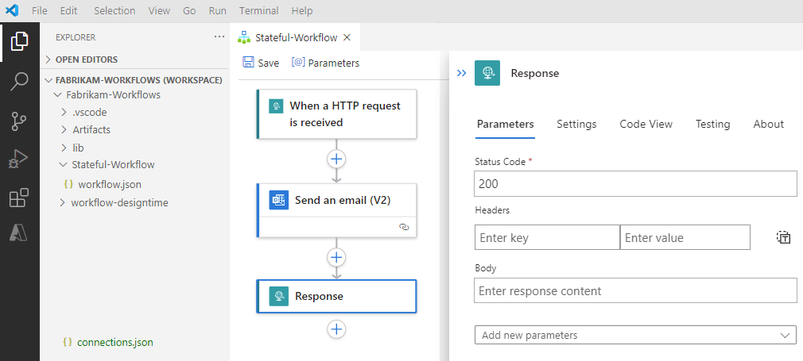

As you progress, you'll complete these high-level tasks:

* Create a project for your logic app and a blank [*stateful* workflow](single-tenant-overview-compare.md#stateful-stateless).
* Add a trigger and an action.
* Run, test, debug, and review run history locally.
* Find domain name details for firewall access.
* Deploy to Azure, which includes optionally enabling Application Insights.
* Manage your deployed logic app in Visual Studio Code and the Azure portal.
* Enable run history for stateless workflows.
* Enable or open the Application Insights after deployment.

## Prerequisites

### Access and connectivity

* If you plan to locally build Standard logic app projects and run workflows using only the [built-in connectors](../connectors/built-in.md) that run natively on the Azure Logic Apps runtime, you don't need the following requirements. However, to publish or deploy your from Visual Studio Code to Azure, use the [managed connectors](../connectors/managed.md) that run in global Azure, or access Standard logic app resources and workflows already deployed in Azure, make sure that you have connectivity and Azure account credentials:

  * Access to the internet so that you can download the requirements, connect from Visual Studio Code to your Azure account, and publish from Visual Studio Code to Azure.

  * An Azure account and subscription. If you don't have a subscription, [sign up for a free Azure account](https://azure.microsoft.com/free/?WT.mc_id=A261C142F).

* To create the same example workflow in this article, you need an Office 365 Outlook email account that uses a Microsoft work or school account to sign in.

  If you choose a [different email connector](/connectors/connector-reference/connector-reference-logicapps-connectors), such as Outlook.com, you can still follow the example, and the general overall steps are the same. However, your options might differ in some ways. For example, if you use the Outlook.com connector, use your personal Microsoft account instead to sign in.

### Tools

1. Download and install [Visual Studio Code](https://code.visualstudio.com/), which is free.

1. Download and install the [Azure Account extension for Visual Studio Code](https://marketplace.visualstudio.com/items?itemName=ms-vscode.azure-account) so that you have a single common experience for Azure sign-in and subscription filtering across all Azure extensions in Visual Studio Code. This how-to guide includes steps that use this experience.

1. Download and install the following Visual Studio Code dependencies for your specific operating system using either method:

   - [Install all dependencies automatically (preview)](#dependency-installer).
   - [Download and install each dependency separately](#install-dependencies-individually).

   <a name="dependency-installer"></a>

   **Install all dependencies automatically (preview)**

   > [!IMPORTANT]
   > This capability is in preview and is subject to the 
   > [Supplemental Terms of Use for Microsoft Azure Previews](https://azure.microsoft.com/support/legal/preview-supplemental-terms/).

   Starting with version **2.81.5**, the Azure Logic Apps (Standard) extension for Visual Studio Code includes a dependency installer that automatically installs all the required dependencies in a new binary folder and leaves any existing dependencies unchanged. For more information, see [Get started more easily with the Azure Logic Apps (Standard) extension for Visual Studio Code](https://techcommunity.microsoft.com/t5/azure-integration-services-blog/making-it-easy-to-get-started-with-the-azure-logic-apps-standard/ba-p/3979643).

   This extension includes the following dependencies:

   | Dependency | Description |
   |------------|-------------|
   | [C# for Visual Studio Code](https://marketplace.visualstudio.com/items?itemName=ms-vscode.csharp) | Enables F5 functionality to run your workflow. |
   | [Azurite for Visual Studio Code](https://github.com/Azure/Azurite#visual-studio-code-extension) | Provides a local data store and emulator to use with Visual Studio Code so that you can work on your logic app project and run your workflows in your local development environment. If you don't want Azurite to automatically start, you can disable this option: <br><br>1. On the **File** menu, select **Preferences** > **Settings**. <br><br>2. On the **User** tab, select **Extensions** > **Azure Logic Apps (Standard)**. <br><br>3. Find the setting named **Azure Logic Apps Standard: Auto Start Azurite**, and clear the selected checkbox. |
   | [.NET SDK 6.x.x](https://dotnet.microsoft.com/download/dotnet/6.0) | Includes the .NET Runtime 6.x.x, a prerequisite for the Azure Logic Apps (Standard) runtime. |
   | Azure Functions Core Tools - 4.x version | Installs the version based on your operating system ([Windows](https://github.com/Azure/azure-functions-core-tools/releases), [macOS](../azure-functions/functions-run-local.md?tabs=macos#install-the-azure-functions-core-tools), or [Linux](../azure-functions/functions-run-local.md?tabs=linux#install-the-azure-functions-core-tools)). <br><br>These tools include a version of the same runtime that powers the Azure Functions runtime, which the Azure Logic Apps (Standard) extension uses in Visual Studio Code. |
   | [Node.js version 16.x.x unless a newer version is already installed](https://nodejs.org/en/download/releases/) | Required to enable the [Inline Code Operations action](../logic-apps/logic-apps-add-run-inline-code.md) that runs JavaScript. |

   The installer doesn't perform the following tasks:

   - Check whether the required dependencies already exist.
   - Install only the missing dependencies.
   - Update older versions of existing dependencies.

   1. [Download and install the Azure Logic Apps (Standard) extension for Visual Studio Code, starting with version 2.81.5)](https://marketplace.visualstudio.com/items?itemName=ms-azuretools.vscode-azurelogicapps).

   1. In Visual Studio Code, on the Activity bar, select **Extensions**. (Keyboard: Press Ctrl+Shift+X)

   1. On the **Extensions** pane, open the ellipses (**...**) menu, and select **Install from VSIX**.

   1. Find and select the downloaded VSIX file.

      After setup completes, the extension automatically activates and runs the **Validate and install dependency binaries** command. To view the process logs, open the **Output** window.

   1. When the following prompt appears, select **Yes (Recommended)** to confirm that you want to automatically install the required dependencies:

      :::image type="content" source="media/create-single-tenant-workflows-visual-studio-code/dependency-installer-prompt.png" alt-text="Screenshot shows prompt to automatically install dependencies." lightbox="media/create-single-tenant-workflows-visual-studio-code/dependency-installer-prompt.png":::

   1. Reload Visual Studio Code, if necessary.

   1. Confirm that the dependencies correctly appear in the following folder:

      **C:\Users\\<your-user-name\>\\.azurelogicapps\dependencies\\<dependency-name\>**

   1. Confirm the following extension settings in Visual Studio Code:

      1. On the **File** menu, select **Preferences** > **Settings**.

      1. On the **User** tab, select **Extensions** > **Azure Logic Apps (Standard)**.

      1. Review the following settings:

         | Extension setting | Value |
         |-------------------|-------|
         | **Dependencies Path** | C:\Users\\<your-user-name\>\\.azurelogicapps\dependencies |
         | **Dependency Timeout** | 60 seconds |
         | **Dotnet Binary Path** | C:\Users\\<your-user-name\>\\.azurelogicapps\dependencies\DotNetSDK\dotnet.exe |
         | **Func Core Tools Binary Path** | C:\Users\\<your-user-name\>\\.azurelogicapps\dependencies\FuncCoreTools\func |
         | **Node JS Binary Path** | C:\Users\\<your-user-name\>\\.azurelogicapps\dependencies\NodeJs\node |
         | **Auto Start Azurite** | Enabled |
         | **Auto Start Design Time** | Enabled |

   1. If you have an existing logic app project with custom-defined tasks stored in the **.vscode/tasks.json** file, make sure that you save the **tasks.json** file elsewhere before you open your project.
   
      When you open your project, you're prompted to update **tasks.json** file to use the required dependencies. If you choose to continue, the extension overwrites the **tasks.json** file.

   1. When you open your logic app project, the following notifications appear:

      | Notification | Action |
      |--------------|--------| 
      | **Always start the background design-time process at launch?** | To open the workflow designer faster, select **Yes (Recommended)**. |
      | **Configure Azurite to autostart on project launch?** | To have Azurite storage automatically start when the project opens, select **Enable AutoStart**. At the top of Visual Studio Code, in the command window that appears, press enter to accept the default path: <br><br>**C\Users\\<your-user-name\>\\.azurelogicapps\\.azurite** |

   <a name="known-issues-preview"></a>

   **Known issues with preview**

   - If you opted in to automatically install all dependencies on a computer that doesn't have any version of the .NET Core SDK, the following message appears:

     **"The .NET Core SDK cannot be located: Error running dotnet -- info: Error: Command failed: dotnet --info 'dotnet is not recognized as an internal or external command, operable program, or batch file. 'dotnet' is not recognized as an internal or external command, operable program, or batch file. . .NET Core debugging will not be enabled. Make sure the .NET Core SDK is installed and is on the path."**

     You get this message because the .NET Core framework is still installing when the extension activates. You can safely choose to disable this message.

     If you have trouble with opening an existing logic app project or starting the debugging task (tasks.json) for **func host start**, and this message appears, follow these steps to resolve the problem:

     1. Add the dotnet binary path to your environment PATH variable.

        1. On the Windows taskbar, in the search box, enter **environment variables**, and select **Edit the system environment variables**.

        1. In the **System Properties** box, on the **Advanced** tab, select **Environment Variables**.

        1. In the **Environment Variables** box, from the **User variables for \<your-user-name\>** list, select **PATH**, and then select **Edit**.

        1. If the following value doesn't appear in the list, select **New** to add the following value:
        
           **C:\Users\\<your-user-name\>\\.azurelogicapps\dependencies\DotNetSDK**

        1. When you're done, select **OK**.

     1. Close all Visual Studio Code windows, and reopen your project.

   - If you have problems installing and validating binary dependencies, for example:

     - Linux permissions issues
     - You get the following error: **\<File or path> does not exist**
     - Validation gets stuck on **\<dependency-name>**.
     
     Follow these steps to run the **Validate and install binary dependencies** command again:

     1. From the **View** menu, select **Command Palette**.

     1. When the command window appears, enter and run the **Validate and install binary dependencies** command.

   - If you don't have .NET Core 7 or a later version installed, and you open an Azure Logic Apps workspace that contains an Azure Functions project, you get the following message:

     **There were problems loading project [function-name].csproj. See log for details.**

     This missing component doesn't affect the Azure Functions project, so you can safely ignore this message.

   <a name="install-dependencies-individually"></a>

   **Install each dependency separately**

   | Dependency | Description |
   |------------|-------------|
   | [.NET SDK 6.x.x](https://dotnet.microsoft.com/download/dotnet/6.0) | Includes the .NET Runtime 6.x.x, a prerequisite for the Azure Logic Apps (Standard) runtime. |
   | Azure Functions Core Tools - 4.x version | - [Windows](https://github.com/Azure/azure-functions-core-tools/releases): Use the Microsoft Installer (MSI) version, which is `func-cli-X.X.XXXX-x*.msi`. <br>- [macOS](../azure-functions/functions-run-local.md?tabs=macos#install-the-azure-functions-core-tools) <br>- [Linux](../azure-functions/functions-run-local.md?tabs=linux#install-the-azure-functions-core-tools) <br><br>These tools include a version of the same runtime that powers the Azure Functions runtime, which the Azure Logic Apps (Standard) extension uses in Visual Studio Code. <br><br>If you have an installation that's earlier than these versions, uninstall that version first, or make sure that the PATH environment variable points at the version that you download and install. |
   | [Node.js version 16.x.x unless a newer version is already installed](https://nodejs.org/en/download/releases/) | Required to enable the [Inline Code Operations action](../logic-apps/logic-apps-add-run-inline-code.md) that runs JavaScript. <br><br>**Note**: For Windows, download the MSI version. If you use the ZIP version instead, you have to manually make Node.js available by using a PATH environment variable for your operating system. |

1. If you already installed the version of the Azure Logic Apps (Standard) extension that automatically installs all the dependencies (preview), skip this step. Otherwise, [download and install the Azure Logic Apps (Standard) extension for Visual Studio Code](https://go.microsoft.com/fwlink/p/?linkid=2143167).

   1. In Visual Studio Code, on the left toolbar, select **Extensions**.

   1. In the extensions search box, enter **azure logic apps standard**. From the results list, select **Azure Logic Apps (Standard)** **>** **Install**.

      After the installation completes, the extension appears in the **Extensions: Installed** list.

      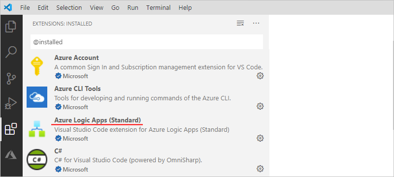

      > [!TIP]
      >
      > If the extension doesn't appear in the installed list, try restarting Visual Studio Code.

   Currently, you can have both Consumption (multi-tenant) and Standard (single-tenant) extensions installed at the same time. The development experiences differ from each other in some ways, but your Azure subscription can include both Standard and Consumption logic app types. In Visual Studio Code, the Azure window shows all the Azure-deployed and hosted logic apps in your Azure subscription, but organizes your apps in the following ways:

   * **Logic Apps (Consumption)** section: All the Consumption logic apps in your subscription

   * **Resources** section: All the Standard logic apps in your subscription. Previously, these logic apps appeared in the **Logic Apps (Standard)** section, which has now moved into the **Resources** section.

1. To locally run webhook-based triggers and actions, such as the [built-in HTTP Webhook trigger](../connectors/connectors-native-webhook.md), in Visual Studio Code, you need to [set up forwarding for the callback URL](#webhook-setup).

1. To test the example workflow in this article, you need a tool that can send calls to the endpoint created by the Request trigger. If you don't have such a tool, you can download, install, and use the [Postman](https://www.postman.com/downloads/) app.

1. If you create your logic app resources with settings that support using [Application Insights](../azure-monitor/app/app-insights-overview.md), you can optionally enable diagnostics logging and tracing for your logic app resource. You can do so either when you create your logic app or after deployment. You need to have an Application Insights instance, but you can create this resource either [in advance](../azure-monitor/app/create-workspace-resource.md), when you create your logic app, or after deployment.

<a name="set-up"></a>

## Set up Visual Studio Code

1. To make sure that all the extensions are correctly installed, reload or restart Visual Studio Code.

1. Confirm that Visual Studio Code automatically finds and installs extension updates so that all your extensions get the latest updates. Otherwise, you have to manually uninstall the outdated version and install the latest version.

   1. On the **File** menu, go to **Preferences** **>** **Settings**.

   1. On the **User** tab, go to **Features** **>** **Extensions**.

   1. Confirm that **Auto Check Updates** is selected, and that **Auto Update** is set to **All Extensions**.

1. Confirm that the **Azure Logic Apps Standard: Project Runtime** setting for the Azure Logic Apps (Standard) extension is set to version **~4**:

   > [!NOTE]
   > This version is required to use the [Inline Code Operations actions](../logic-apps/logic-apps-add-run-inline-code.md).

   1. On the **File** menu, go to **Preferences** **>** **Settings**.

   1. On the **User** tab, go to **>** **Extensions** **>** **Azure Logic Apps (Standard)**.

      For example, you can find the **Azure Logic Apps Standard: Project Runtime** setting here or use the search box to find other settings:

      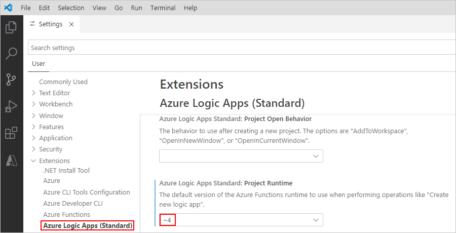

<a name="connect-azure-account"></a>

## Connect to your Azure account

1. On the Visual Studio Code Activity Bar, select the Azure icon.

   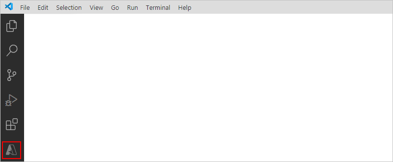

1. In the Azure window, under **Resources**, select **Sign in to Azure**. When the Visual Studio Code authentication page appears, sign in with your Azure account.

   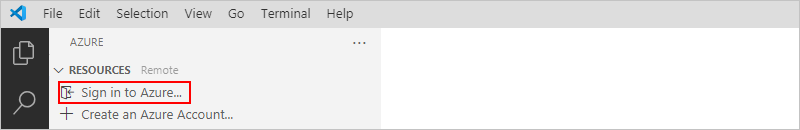

   After you sign in, the Azure window shows the Azure subscriptions associated with your Azure account. If the expected subscriptions don't appear, or you want the pane to show only specific subscriptions, follow these steps:

   1. In the subscriptions list, move your pointer next to the first subscription until the **Select Subscriptions** button (filter icon) appears. Select the filter icon.

      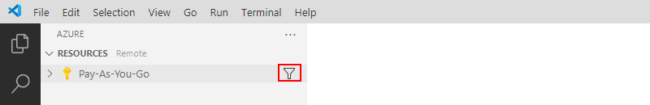

      Or, in the Visual Studio Code status bar, select your Azure account.

   1. When another subscriptions list appears, select the subscriptions that you want, and then make sure that you select **OK**.

<a name="create-project"></a>

## Create a local project

Before you can create your logic app, create a local project so that you can manage, run, and deploy your logic app from Visual Studio Code. The underlying project is similar to an Azure Functions project, also known as a function app project. However, these project types are separate from each other, so logic apps and function apps can't exist in the same project.

1. On your computer, create an *empty* local folder to use for the project that you'll later create in Visual Studio Code.

1. In Visual Studio Code, close all open folders.

1. In the **Azure** window, on the **Workspace** section toolbar, from the **Azure Logic Apps** menu, select **Create New Project**.

   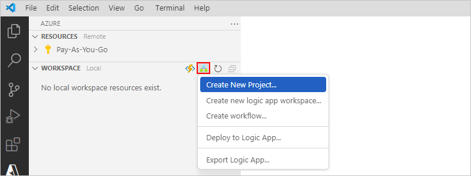

1. If Windows Defender Firewall prompts you to grant network access for `Code.exe`, which is Visual Studio Code, and for `func.exe`, which is the Azure Functions Core Tools, select **Private networks, such as my home or work network** **>** **Allow access**.

1. Browse to the location where you created your project folder, select that folder and continue.

   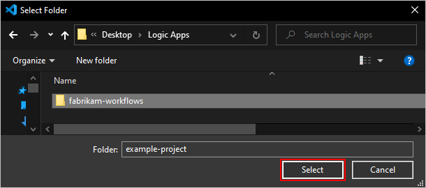

1. From the templates list that appears, select either **Stateful Workflow** or **Stateless Workflow**. This example selects **Stateful Workflow**.

   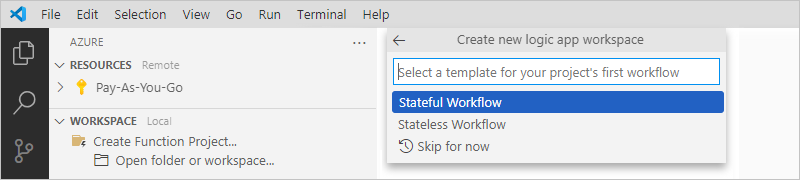

1. Provide a name for your workflow and press Enter. This example uses **Stateful-Workflow** as the name.

   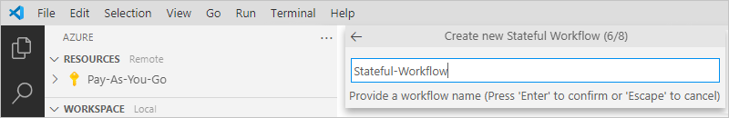

   > [!NOTE]
   > You might get an error named **azureLogicAppsStandard.createNewProject** with the error message, 
   > **Unable to write to Workspace Settings because azureFunctions.suppressProject is not a registered configuration**. 
   > If you do, try installing the [Azure Functions extension for Visual Studio Code](https://marketplace.visualstudio.com/items?itemName=ms-azuretools.vscode-azurefunctions), either directly from the Visual Studio Marketplace or from inside Visual Studio Code.

1. If Visual Studio Code prompts you to open your project in the current Visual Studio Code or in a new Visual Studio Code window, select **Open in current window**. Otherwise, select **Open in new window**.

   Visual Studio Code finishes creating your project.

1. From the Visual Studio Activity Bar, open the Explorer pane, if not already open.

   The Explorer pane shows your project, which now includes automatically generated project files. For example, the project has a folder that shows your workflow's name. Inside this folder, the **workflow.json** file contains your workflow's underlying JSON definition.

   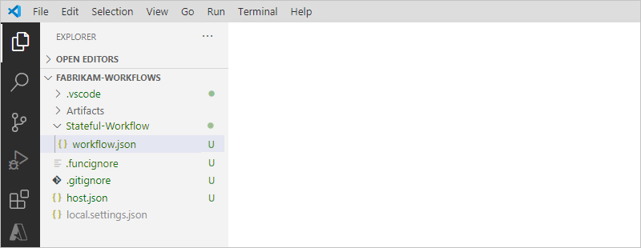

   [!INCLUDE [Visual Studio Code - logic app project structure](../../includes/logic-apps-single-tenant-project-structure-visual-studio-code.md)]

<a name="convert-project-nuget"></a>

## Convert your project to NuGet package-based (.NET)

By default, Visual Studio Code creates a logic app project that is extension bundle-based (Node.js), not NuGet package-based (.NET). If you require a logic app project that is NuGet package-based (.NET), for example, to enable built-in connector authoring, you must convert your project from extension bundle-based (Node.js) to NuGet package-based (.NET).

> [!IMPORTANT]
>
> This action is a one-way operation that you can't undo.

1. In the Explorer pane, at your project's root, move your mouse pointer over any blank area below all the other files and folders, open the shortcut menu, and select **Convert to NuGet-based Logic App project**.

   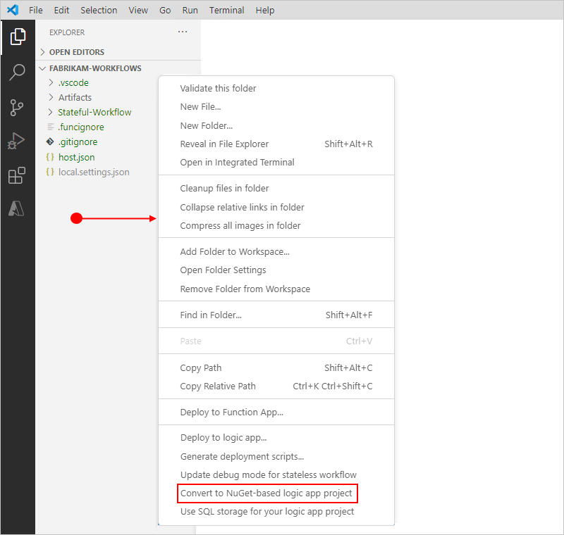

1. When the prompt appears, confirm the project conversion.

<a name="enable-built-in-connector-authoring"></a>

## Enable built-in connector authoring

You can create your own built-in connectors for any service you need by using the [single-tenant Azure Logic Apps extensibility framework](https://techcommunity.microsoft.com/t5/integrations-on-azure/azure-logic-apps-running-anywhere-built-in-connector/ba-p/1921272). Similar to built-in connectors such as Azure Service Bus and SQL Server, these connectors provide higher throughput, low latency, local connectivity, and run natively in the same process as the single-tenant Azure Logic Apps runtime.

The authoring capability is currently available only in Visual Studio Code, but isn't enabled by default. To create these connectors, follow these steps:

1. If you haven't already, [convert your project from extension bundle-based (Node.js) to NuGet package-based (.NET)](#convert-project-nuget).

1. Review and follow the steps in the article, [Azure Logic Apps Running Anywhere - Built-in connector extensibility](https://techcommunity.microsoft.com/t5/integrations-on-azure/azure-logic-apps-running-anywhere-built-in-connector/ba-p/1921272).

<a name="add-custom-artifacts"></a>

## Add custom artifacts to your project

In a logic app workflow, some connectors have dependencies on artifacts such as maps, schemas, or assemblies. In Visual Studio Code, you can upload these artifacts to your logic app project, similar to how you can upload these artifacts in the Azure portal through the logic app resource menu under **Artifacts**, for example:

:::image type="content" source="media/create-single-tenant-workflows-visual-studio-code/show-artifacts-portal.png" alt-text="Screenshot shows Azure portal and Standard logic app resource menu with Artifacts section highlighted." lightbox="media/create-single-tenant-workflows-visual-studio-code/show-artifacts-portal.png":::

### Add maps to your project

To add maps to your project, in your project hierarchy, expand **Artifacts** > **Maps**, which is the folder where you can put your maps.

:::image type="content" source="media/create-single-tenant-workflows-visual-studio-code/map-upload-visual-studio-code.png" alt-text="Screenshot shows Visual Studio Code project hierarchy with Artifacts and Maps folders expanded." lightbox="media/create-single-tenant-workflows-visual-studio-code/map-upload-visual-studio-code.png":::

### Add schemas to your project

To add schemas to your project, in your project hierarchy, expand **Artifacts** > **Schemas**, which is the folder where you can put your schemas.

:::image type="content" source="media/create-single-tenant-workflows-visual-studio-code/schema-upload-visual-studio-code.png" alt-text="Screenshot shows Visual Studio Code project hierarchy with Artifacts and Schemas folders expanded." lightbox="media/create-single-tenant-workflows-visual-studio-code/schema-upload-visual-studio-code.png":::

<a name="add-assembly"></a>

### Add assemblies to your project

A Standard logic app can use or reference specific kinds of assemblies, which you can upload to your project in Visual Studio Code. However, you must add them to specific folders in your project. The following table provides more information about each assembly type and where exactly to put them in your project.

| Assembly type | Description |
|---------------|-------------|
| **Client/SDK Assembly (.NET Framework)** | This assembly type provides storage and deployment of client and custom SDK for the .NET Framework. For example, the SAP built-in connector uses these assemblies to load the SAP NCo non-redistributable DLL files. <br><br>Make sure that you add these assemblies to the following folder: **\lib\builtinOperationSdks\net472** |
| **Client/SDK Assembly (Java)** | This assembly type provides storage and deployment of custom SDK for Java. For example, the [JDBC built-in connector](/azure/logic-apps/connectors/built-in/reference/jdbc/) uses these JAR files to find JDBC drivers for custom relational databases (RDBs). <br><br>Make sure to add these assemblies to the following folder: **\lib\builtinOperationSdks\JAR** |
| **Custom Assembly (.NET Framework)** | This assembly type provides storage and deployment of custom DLLs. For example, the [**Transform XML** operation](logic-apps-enterprise-integration-transform.md) uses these assemblies for the custom transformation functions that are required during XML transformation. <br><br>Make sure to add these assemblies to the following folder: **\lib\custom\net472** |

The following image shows where to put each assembly type in your project:

:::image type="content" source="media/create-single-tenant-workflows-visual-studio-code/assembly-upload-visual-studio-code.png" alt-text="Screenshot shows Visual Studio Code, logic app project, and where to upload assemblies." lightbox="media/create-single-tenant-workflows-visual-studio-code/assembly-upload-visual-studio-code.png":::

For more information about uploading assemblies to your logic app resource in the Azure portal, see [Add referenced assemblies](logic-apps-enterprise-integration-maps.md?tabs=standard#add-assembly).

### Migrate NuGet-based projects to use "lib\\*" assemblies

> [!IMPORTANT]
> This task is required only for NuGet-based logic app projects.

If you created your logic app project when assemblies support wasn't available for Standard logic app workflows, you can add the following lines to your **<*project-name*>.csproj** file to work with projects that use assemblies:
 
```xml
  <ItemGroup>
    <LibDirectory Include="$(MSBuildProjectDirectory)\lib\**\*"/>
  </ItemGroup>
  <Target Name="CopyDynamicLibraries" AfterTargets="_GenerateFunctionsExtensionsMetadataPostPublish">
    <Copy SourceFiles="@(LibDirectory)" DestinationFiles="@(LibDirectory->'$(MSBuildProjectDirectory)\$(PublishUrl)\lib\%(RecursiveDir)%(Filename)%(Extension)')"/>
  </Target>
```

> [!IMPORTANT]
>
> For a project that runs on Linux or MacOS, make sure to update the directory separator. For example, 
> review the following image that shows the previous code added to the **<*project-name*>.csproj** file.
>
> :::image type="content" source="media/create-single-tenant-workflows-visual-studio-code/migrate-projects-assemblies-visual-studio-code.png" alt-text="Screenshot shows migrated assemblies and added code in the CSPROJ file." lightbox="media/create-single-tenant-workflows-visual-studio-code/migrate-projects-assemblies-visual-studio-code.png":::

<a name="open-workflow-definition-designer"></a>

## Open the workflow definition file in the designer

1. Expand your workflow's project folder, which is named **Stateful-Workflow** in this example, and open the **workflow.json** file.

1. Open the **workflow.json** file's shortcut menu, and select **Open Designer**.

   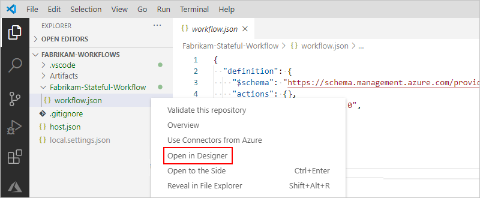

1. After the **Enable connectors in Azure** list opens, select **Use connectors from Azure**, which applies to all the managed or "shared" connectors, which are hosted and run in Azure versus the built-in, native, or "in-app" connectors, which run directly with the Azure Logic Apps runtime.

   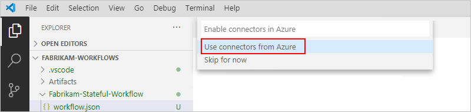

   > [!NOTE]
   > Stateless workflows currently support only *actions* from [managed connectors](../connectors/managed.md), not triggers. 
   > Although you have the option to enable connectors in Azure for your stateless workflow, 
   > the designer doesn't show any managed connector triggers for you to select.

1. After the **Select subscription** list opens, select the Azure subscription to use for your logic app project.

   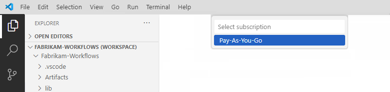

1. After the resource groups list opens, select **Create new resource group**.

   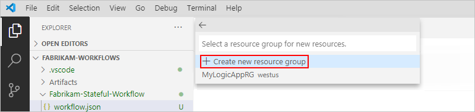

1. Provide a name for the resource group, and press Enter. This example uses **Fabrikam-Workflows-RG**.

   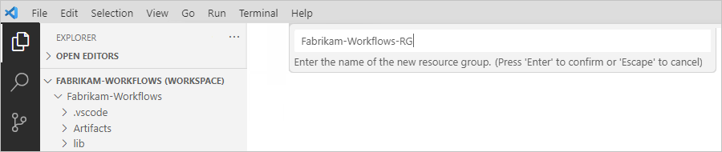

1. From the locations list, select the Azure region to use when creating your resource group and resources. This example uses **West Central US**.

   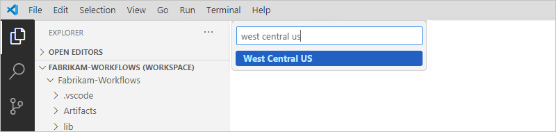

   After you perform this step, Visual Studio Code opens the workflow designer.

   > [!NOTE]
   > When Visual Studio Code starts the workflow design-time API, you might get a message 
   > that startup might take a few seconds. You can ignore this message or select **OK**.
   >
   > If the designer won't open, review the troubleshooting section, [Designer fails to open](#designer-fails-to-open).

   After the designer appears, the **Add a trigger** prompt appears on the designer.

1. On the designer, select **Add a trigger**, which opens the **Add a trigger** pane and a gallery showing all the connectors that have triggers for you to select.

   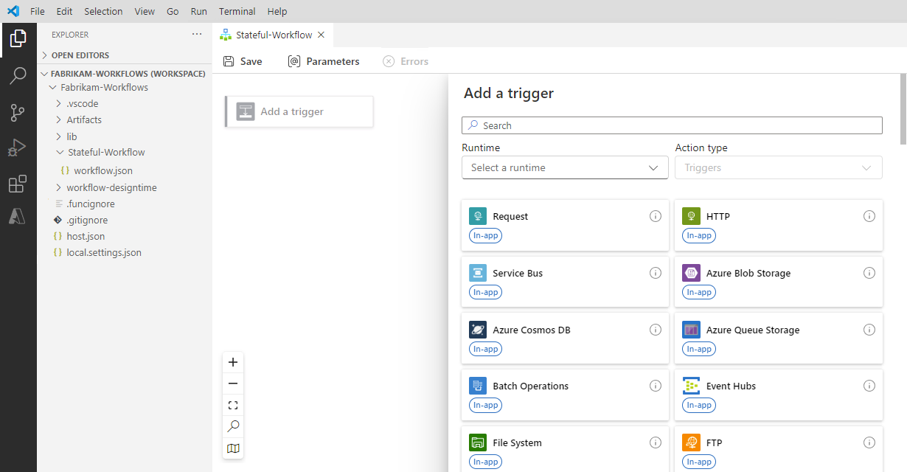

1. Next, [add a trigger and actions](#add-trigger-actions) to your workflow.

<a name="add-trigger-actions"></a>

## Add a trigger and actions

After you open a blank workflow in the designer, the **Add a trigger** prompt appears on the designer. You can now start creating your workflow by adding a trigger and actions.

> [!IMPORTANT]
> To locally run a workflow that uses a webhook-based trigger or actions, such as the 
> [built-in HTTP Webhook trigger or action](../connectors/connectors-native-webhook.md), 
> you must enable this capability by [setting up forwarding for the webhook's callback URL](#webhook-setup).

The workflow in this example uses the following trigger and actions:

* The [Request built-in connector trigger named **When an HTTP request is received**](../connectors/connectors-native-reqres.md), which can receive inbound calls or requests and creates an endpoint that other services or logic app workflows can call.

* The [Office 365 Outlook managed connector action named **Send an email**](../connectors/connectors-create-api-office365-outlook.md). To follow this how-to guide, you need an Office 365 Outlook email account. If you have an email account that's supported by a different connector, you can use that connector, but that connector's user experience will differ from the steps in this example.

* The [Request built-in connector action named **Response**](../connectors/connectors-native-reqres.md), which you use to send a reply and return data back to the caller.

### Add the Request trigger

1. On the workflow designer, in the **Add a trigger** pane, open the **Runtime** list, and select **In-App** so that you view only the available built-in connector triggers.

1. Find the Request trigger named **When an HTTP request is received** by using the search box, and add that trigger to your workflow. For more information, see [Build a workflow with a trigger and actions](create-workflow-with-trigger-or-action.md?tabs=standard#add-trigger).

   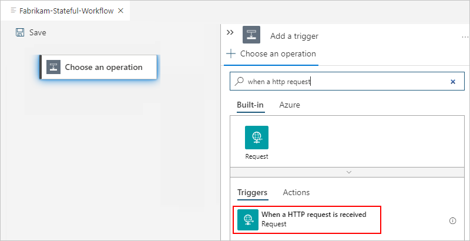

   When the trigger appears on the designer, the trigger's information pane opens and shows the trigger's parameters, settings, and other related tasks.

   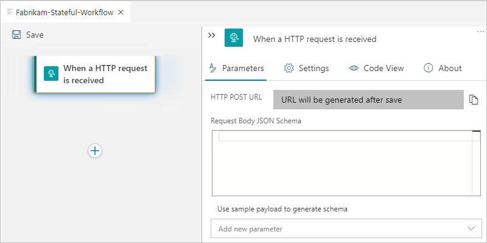

   > [!TIP]
   > If the information pane doesn't appear, makes sure that the trigger is selected on the designer.

1. Save your workflow. On the designer toolbar, select **Save**.

If you need to delete an item from the designer, [follow these steps for deleting items from the designer](#delete-from-designer).

### Add the Office 365 Outlook action

1. On the designer, under the Request trigger, select the plus sign (**+**) > **Add an action**.

1. In the **Add an action** pane that opens, from the **Runtime** list, select **Shared** so that you view only the available managed connector actions.

1. Find the Office 365 Outlook managed connector action named **Send an email (V2)** by using the search box, and add that action to your workflow. For more information, see [Build a workflow with a trigger and actions](create-workflow-with-trigger-or-action.md?tabs=standard#add-action).

   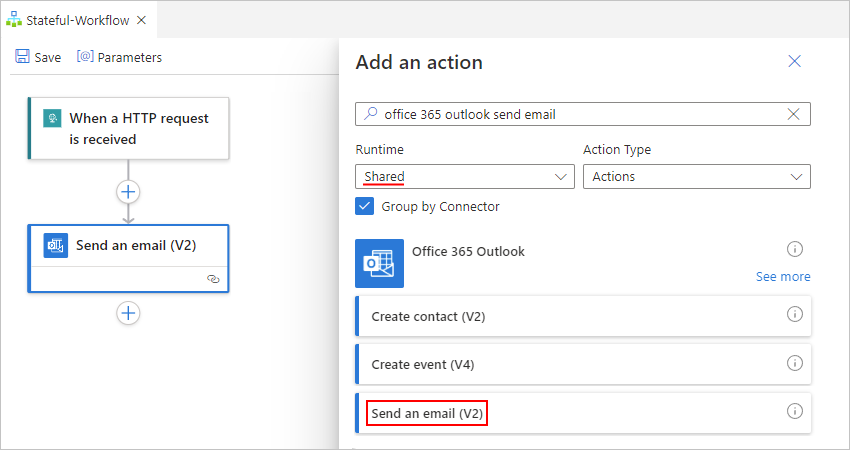

1. When the action's authentication pane opens, select **Sign in** to create a connection to your email account.

   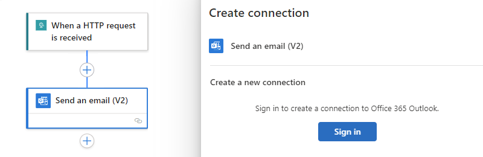

1. Follow the subsequent prompts to select your account, allow access, and allow returning to Visual Studio Code.

   > [!NOTE]
   > If too much time passes before you complete the prompts, the authentication process times out 
   > and fails. In this case, return to the designer and retry signing in to create the connection.

   1. When the Microsoft prompt appears, select the user account for Office 365 Outlook, and then select **Allow access**.

   1. When Azure Logic Apps prompts to open a Visual Studio Code link, select **Open**.

      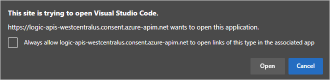

   1. When Visual Studio Code prompts to open the Microsoft Azure Tools, select **Open**.

      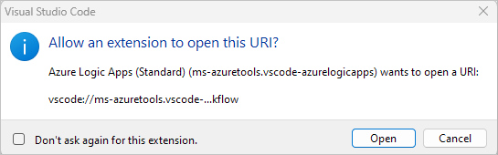

   > [!TIP]
   > To skip such future prompts, select the following options when the associated prompts appear:
   >
   > - Permission to open link for Visual Studio Code: Select **Always allow logic-apis-westcentralus.consent.azure-apim.net to open links of this type in the associated app**. This domain changes based on the Azure region that you selected for your logic app resource.
   >
   > - Permission to open Microsoft Azure Tools: Select **Don't ask again for this extension**.

   After Visual Studio Code creates your connection, some connectors show the message that **The connection will be valid for {n} days only**. This time limit applies only to the duration while you author your logic app workflow in Visual Studio Code. After deployment, this limit no longer applies because your workflow can authenticate at runtime by using its automatically enabled [system-assigned managed identity](create-managed-service-identity.md). This managed identity differs from the authentication credentials or connection string that you use when you create a connection. If you disable this system-assigned managed identity, connections won't work at runtime.

1. On the designer, if the **Send an email** action doesn't appear selected, select that action.

1. On the action information pane, on the **Parameters** tab, provide the required information for the action, for example:

   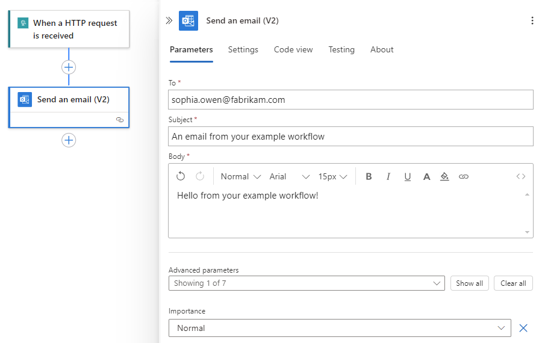

   | Property | Required | Value | Description |
   |----------|----------|-------|-------------|
   | **To** | Yes | <*your-email-address*> | The email recipient, which can be your email address for test purposes. This example uses the fictitious email, **sophia.owen@fabrikam.com**. |
   | **Subject** | Yes | **An email from your example workflow** | The email subject |
   | **Body** | Yes | **Hello from your example workflow!** | The email body content |

   > [!NOTE]
   > If you make any changes on the **Testing** tab, make sure that you select **Save** 
   > to commit those changes before you switch tabs or change focus to the designer. 
   > Otherwise, Visual Studio Code won't keep your changes.

1. Save your workflow. On the designer, select **Save**.

<a name="webhook-setup"></a>

## Enable locally running webhooks

When you use a webhook-based trigger or action, such as **HTTP Webhook**, with a logic app workflow running in Azure, the Azure Logic Apps runtime subscribes to the service endpoint by generating and registering a callback URL with that endpoint. The trigger or action then waits for the service endpoint to call the URL. However, when you're working in Visual Studio Code, the generated callback URL starts with `http://localhost:7071/...`. This URL is for your localhost server, which is private so the service endpoint can't call this URL.

To locally run webhook-based triggers and actions in Visual Studio Code, you need to set up a public URL that exposes your localhost server and securely forwards calls from the service endpoint to the webhook callback URL. You can use a forwarding service and tool such as [**ngrok**](https://ngrok.com/), which opens an HTTP tunnel to your localhost port, or you can use your own equivalent tool.

#### Set up call forwarding using **ngrok**

1. [Go to the **ngrok** website](https://dashboard.ngrok.com). Either sign up for a new account or sign in to your account, if you have one already.

1. Get your personal authentication token, which your **ngrok** client needs to connect and authenticate access to your account.

   1. To find your authentication token page, on your account dashboard menu, expand **Authentication**, and select **Your Authtoken**.

   1. From the **Your Authtoken** box, copy the token to a safe location.

1. From the [**ngrok** download page](https://ngrok.com/download) or [your account dashboard](https://dashboard.ngrok.com/get-started/setup), download the **ngrok** version that you want, and extract the .zip file. For more information, see [Step 1: Unzip to install](https://ngrok.com/download).

1. On your computer, open your command prompt tool. Browse to the location where you have the **ngrok.exe** file.

1. Connect the **ngrok** client to your **ngrok** account by running the following command. For more information, see [Step 2: Connect your account](https://ngrok.com/download).

   `ngrok authtoken <your_auth_token>`

1. Open the HTTP tunnel to localhost port 7071 by running the following command. For more information, see [Step 3: Fire it up](https://ngrok.com/download).

   `ngrok http 7071`

1. From the output, find the following line:

   `http://<domain>.ngrok.io -> http://localhost:7071`

1. Copy and save the URL that has this format: `http://<domain>.ngrok.io`

#### Set up the forwarding URL in your app settings

1. In Visual Studio Code, on the designer, add the webhook-based trigger or action that you want to use.

   This example continues with the **HTTP + Webhook** trigger.

1. When the prompt appears for the host endpoint location, enter the forwarding (redirection) URL that you previously created.

   > [!NOTE]
   > Ignoring the prompt causes a warning to appear that you must provide the forwarding URL, 
   > so select **Configure**, and enter the URL. After you finish this step, the prompt won't 
   > appear for subsequent webhook triggers or actions that you might add.
   >
   > To make the prompt appear, at your project's root level, open the **local.settings.json** 
   > file's shortcut menu, and select **Configure Webhook Redirect Endpoint**. The prompt now 
   > appears so you can provide the forwarding URL.

   Visual Studio Code adds the forwarding URL to the **local.settings.json** file in your project's root folder. In the `Values` object, the property that's named `Workflows.WebhookRedirectHostUri` now appears and is set to the forwarding URL, for example:

   ```json
   {
      "IsEncrypted": false,
      "Values": {
         "AzureWebJobsStorage": "UseDevelopmentStorage=true",
         "FUNCTIONS_WORKER_RUNTIME": "node",
         "FUNCTIONS_V2_COMPATIBILITY_MODE": "true",
         <...>
         "Workflows.WebhookRedirectHostUri": "http://xxxXXXXxxxXXX.ngrok.io",
         <...>
      }
   }
   ```

The first time when you start a local debugging session or run the workflow without debugging, the Azure Logic Apps runtime registers the workflow with the service endpoint and subscribes to that endpoint for notifying the webhook operations. The next time that your workflow runs, the runtime won't register or resubscribe because the subscription registration already exists in local storage.

When you stop the debugging session for a workflow run that uses locally run webhook-based triggers or actions, the existing subscription registrations aren't deleted. To unregister, you have to manually remove or delete the subscription registrations.

> [!NOTE]
> After your workflow starts running, the terminal window might show errors like this example:
>
> `message='Http request failed with unhandled exception of type 'InvalidOperationException' and message: 'System.InvalidOperationException: Synchronous operations are disallowed. Call ReadAsync or set AllowSynchronousIO to true instead.'`
>
> In this case, open the **local.settings.json** file in your project's root folder, and make sure that the property is set to `true`:
>
> `"FUNCTIONS_V2_COMPATIBILITY_MODE": "true"`

<a name="manage-breakpoints"></a>

## Manage breakpoints for debugging

Before you run and test your logic app workflow by starting a debugging session, you can set [breakpoints](https://code.visualstudio.com/docs/editor/debugging#_breakpoints) inside the **workflow.json** file for each workflow. No other setup is required.

At this time, breakpoints are supported only for actions, not triggers. Each action definition has these breakpoint locations:

* Set the starting breakpoint on the line that shows the action's name. When this breakpoint hits during the debugging session, you can review the action's inputs before they're evaluated.

* Set the ending breakpoint on the line that shows the action's closing curly brace (**}**). When this breakpoint hits during the debugging session, you can review the action's results before the action finishes running.

To add a breakpoint, follow these steps:

1. Open the **workflow.json** file for the workflow that you want to debug.

1. On the line where you want to set the breakpoint, in the left column, select inside that column. To remove the breakpoint, select that breakpoint.

   When you start your debugging session, the Run view appears on the left side of the code window, while the Debug toolbar appears near the top.

   > [!NOTE]
   > If the Run view doesn't automatically appear, press Ctrl+Shift+D.

1. To review the available information when a breakpoint hits, in the Run view, examine the **Variables** pane.

1. To continue workflow execution, on the Debug toolbar, select **Continue** (play button).

You can add and remove breakpoints at any time during the workflow run. However, if you update the **workflow.json** file after the run starts, breakpoints don't automatically update. To update the breakpoints, restart the logic app.

For general information, see [Breakpoints - Visual Studio Code](https://code.visualstudio.com/docs/editor/debugging#_breakpoints).

<a name="run-test-debug-locally"></a>

## Run, test, and debug locally

To test your logic app workflow, follow these steps to start a debugging session, and find the URL for the endpoint that's created by the Request trigger. You need this URL so that you can later send a request to that endpoint.

1. To debug a stateless workflow more easily, you can [enable the run history for that workflow](#enable-run-history-stateless).

1. If your Azurite emulator is already running, continue to the next step. Otherwise, make sure to start the emulator before you run your workflow:

   1. In Visual Studio Code, from the **View** menu, select **Command Palette**.

   1. After the command palette appears, enter **Azurite: Start**.

   For more information about Azurite commands, see the [documenation for the Azurite extension in Visual Studio Code](https://github.com/Azure/Azurite#visual-studio-code-extension).

1. On the Visual Studio Code Activity Bar, open the **Run** menu, and select **Start Debugging** (F5).

   The **Terminal** window opens so that you can review the debugging session.

   > [!NOTE]
   >
   > If you get the error, **"Error exists after running preLaunchTask 'generateDebugSymbols'"**, 
   > see the troubleshooting section, [Debugging session fails to start](#debugging-fails-to-start).

1. Now, find the callback URL for the endpoint on the Request trigger.

   1. Reopen the Explorer pane so that you can view your project.

   1. From the **workflow.json** file's shortcut menu, select **Overview**.

      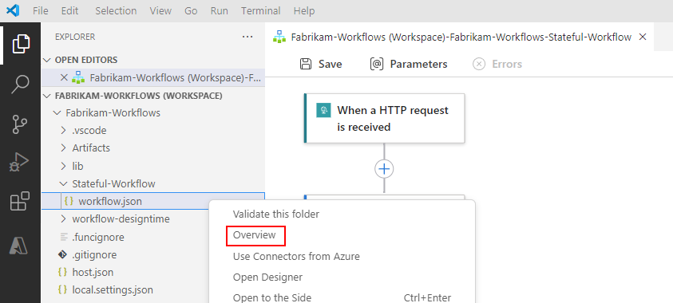

   1. Find the **Callback URL** value, which looks similar to this URL for the example Request trigger:

      `http://localhost:7071/api/<workflow-name>/triggers/manual/invoke?api-version=2020-05-01&sp=%2Ftriggers%2Fmanual%2Frun&sv=1.0&sig=<shared-access-signature>`

      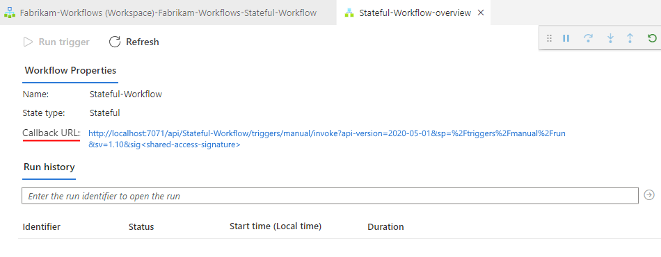

1. To test the callback URL by triggering the logic app workflow, open [Postman](https://www.postman.com/downloads/) or your preferred tool for creating and sending requests.

   This example continues by using Postman. For more information, see [Postman Getting Started](https://learning.postman.com/docs/getting-started/introduction/).

   1. On the Postman toolbar, select **New**.

      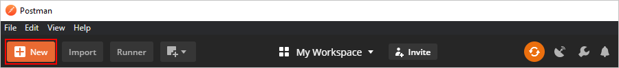

   1. On the **Create New** pane, under **Building Blocks**, select **Request**.

   1. In the **Save Request** window, under **Request name**, provide a name for the request, for example, **Test workflow trigger**.

   1. Under **Select a collection or folder to save to**, select **Create Collection**.

   1. Under **All Collections**, provide a name for the collection to create for organizing your requests, press Enter, and select **Save to <*collection-name*>**. This example uses **Logic Apps requests** as the collection name.

      In Postman, the request pane opens so that you can send a request to the callback URL for the Request trigger.

      

   1. Return to Visual Studio Code. From the workflow's overview page, copy the **Callback URL** property value.

   1. Return to Postman. On the request pane, next the method list, which currently shows **GET** as the default request method, paste the callback URL that you previously copied in the address box, and select **Send**.

      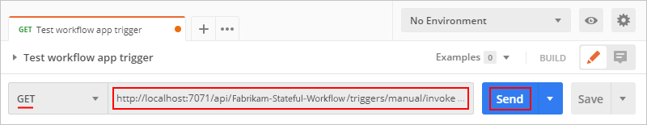

      The example logic app workflow sends an email that appears similar to this example:

      

1. In Visual Studio Code, return to your workflow's overview page.

   If you created a stateful workflow, after the request that you sent triggers the workflow, the overview page shows the workflow's run status and history.

   > [!TIP]
   > If the run status doesn't appear, try refreshing the overview page by selecting **Refresh**. 
   > No run happens for a trigger that's skipped due to unmet criteria or finding no data.

   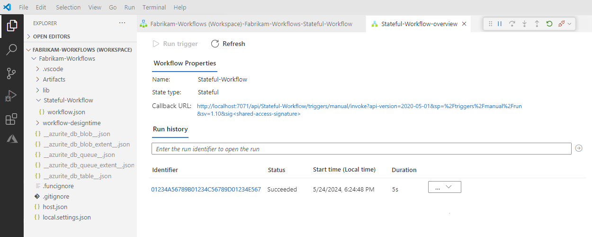

   The following table shows the possible final statuses that each workflow run can have and show in Visual Studio Code:

   | Run status | Description |
   |------------|-------------|
   | **Aborted** | The run stopped or didn't finish due to external problems, for example, a system outage or lapsed Azure subscription. |
   | **Cancelled** | The run was triggered and started but received a cancellation request. |
   | **Failed** | At least one action in the run failed. No subsequent actions in the workflow were set up to handle the failure. |
   | **Running** | The run was triggered and is in progress, but this status can also appear for a run that is throttled due to [action limits](logic-apps-limits-and-config.md) or the [current pricing plan](https://azure.microsoft.com/pricing/details/logic-apps/). <p><p>**Tip**: If you set up [diagnostics logging](monitor-workflows-collect-diagnostic-data.md), you can get information about any throttle events that happen. |
   | **Succeeded** | The run succeeded. If any action failed, a subsequent action in the workflow handled that failure. |
   | **Timed out** | The run timed out because the current duration exceeded the run duration limit, which is controlled by the [**Run history retention in days** setting](logic-apps-limits-and-config.md#run-duration-retention-limits). A run's duration is calculated by using the run's start time and run duration limit at that start time. <p><p>**Note**: If the run's duration also exceeds the current *run history retention limit*, which is also controlled by the [**Run history retention in days** setting](logic-apps-limits-and-config.md#run-duration-retention-limits), the run is cleared from the runs history by a daily cleanup job. Whether the run times out or completes, the retention period is always calculated by using the run's start time and *current* retention limit. So, if you reduce the duration limit for an in-flight run, the run times out. However, the run either stays or is cleared from the runs history based on whether the run's duration exceeded the retention limit. |
   | **Waiting** | The run hasn't started or is paused, for example, due to an earlier workflow instance that's still running. |

1. To review the statuses for each step in a specific run and the step's inputs and outputs, select the ellipses (**...**) button for that run, and select **Show run**.

   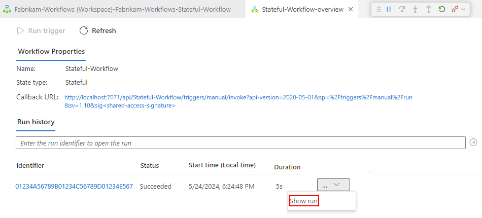

   Visual Studio Code opens the monitoring view and shows the status for each step in the run.

   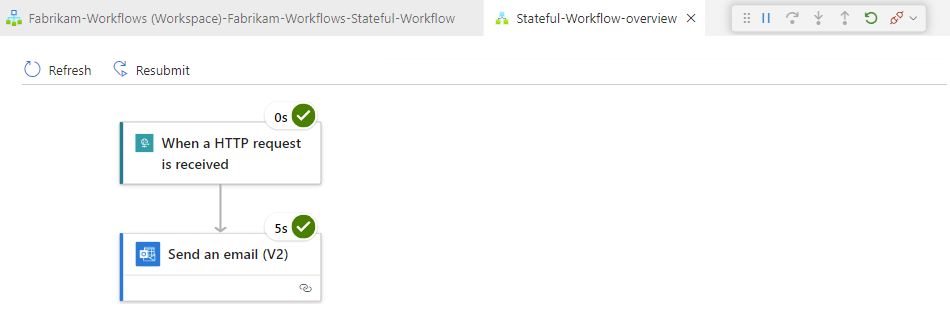

   > [!NOTE]
   > If a run failed and a step in monitoring view shows the **400 Bad Request** error, this problem might result 
   > from a longer trigger name or action name that causes the underlying Uniform Resource Identifier (URI) to exceed 
   > the default character limit. For more information, see ["400 Bad Request"](#400-bad-request).

   The following table shows the possible statuses that each workflow action can have and show in Visual Studio Code:

   | Action status | Description |
   |---------------|-------------|
   | **Aborted** | The action stopped or didn't finish due to external problems, for example, a system outage or lapsed Azure subscription. |
   | **Cancelled** | The action was running but received a request to cancel. |
   | **Failed** | The action failed. |
   | **Running** | The action is currently running. |
   | **Skipped** | The action was skipped because the immediately preceding action failed. An action has a `runAfter` condition that requires that the preceding action finishes successfully before the current action can run. |
   | **Succeeded** | The action succeeded. |
   | **Succeeded with retries** | The action succeeded but only after one or more retries. To review the retry history, in the run history details view, select that action so that you can view the inputs and outputs. |
   | **Timed out** | The action stopped due to the timeout limit specified by that action's settings. |
   | **Waiting** | Applies to a webhook action that's waiting for an inbound request from a caller. |

   [aborted-icon]: ./media/create-single-tenant-workflows-visual-studio-code/aborted.png
   [cancelled-icon]: ./media/create-single-tenant-workflows-visual-studio-code/cancelled.png
   [failed-icon]: ./media/create-single-tenant-workflows-visual-studio-code/failed.png
   [running-icon]: ./media/create-single-tenant-workflows-visual-studio-code/running.png
   [skipped-icon]: ./media/create-single-tenant-workflows-visual-studio-code/skipped.png
   [succeeded-icon]: ./media/create-single-tenant-workflows-visual-studio-code/succeeded.png
   [succeeded-with-retries-icon]: ./media/create-single-tenant-workflows-visual-studio-code/succeeded-with-retries.png
   [timed-out-icon]: ./media/create-single-tenant-workflows-visual-studio-code/timed-out.png
   [waiting-icon]: ./media/create-single-tenant-workflows-visual-studio-code/waiting.png

1. To review the inputs and outputs for each step, select the step that you want to inspect. To further review the raw inputs and outputs for that step, select **Show raw inputs** or **Show raw outputs**.

   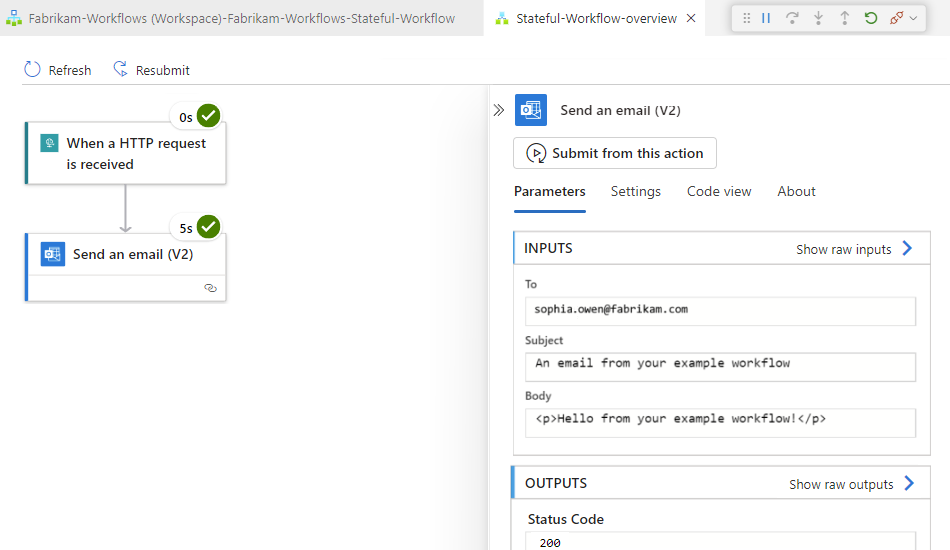

1. To stop the debugging session, on the **Run** menu, select **Stop Debugging** (Shift + F5).

<a name="return-response"></a>

## Return a response

When you have a workflow that starts with the Request trigger, you can return a response to the caller that sent a request to your workflow by using the [Request built-in action named **Response**](../connectors/connectors-native-reqres.md).

1. In the workflow designer, under the **Send an email** action, select the plus sign (**+**) > **Add an action**.

   The **Add an action** pane opens so that you can select the next action.

1. In the **Add an action** pane, from the **Runtime** list, select **In-App**. Find and add the **Response** action.

   After the **Response** action appears on the designer, the action's details pane automatically opens.

   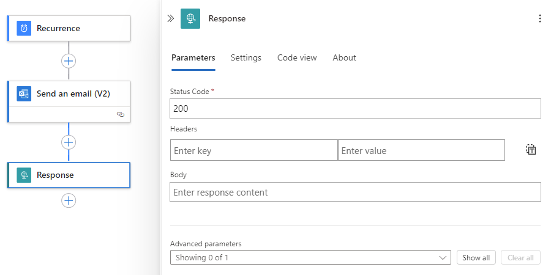

1. On the **Parameters** tab, provide the required information for the function that you want to call.

   This example returns the **Body** parameter value, which is the output from the **Send an email** action.

   1. For the **Body** parameter, select inside the edit box, and select the lightning icon, which opens the dynamic content list. This list shows the available output values from the preceding trigger and actions in the workflow.

   1. In the dynamic content list, under **Send an email**, select **Body**.

      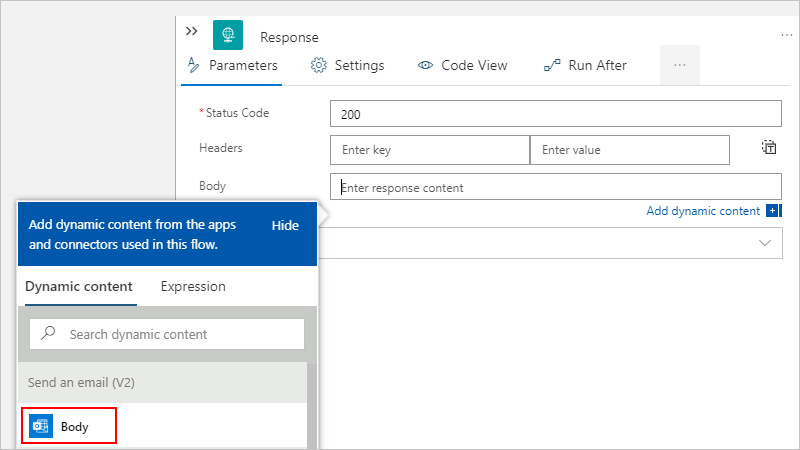

      When you're done, the Response action's **Body** property is now set to the **Send an email** action's **Body** output value.

      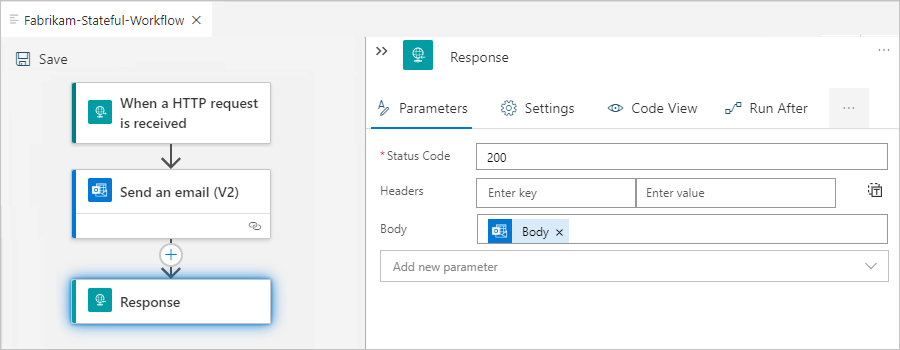

1. On the designer, select **Save**.

<a name="retest-workflow"></a>

## Retest your logic app

After you make updates to your logic app, you can run another test by rerunning the debugger in Visual Studio and sending another request to trigger your updated logic app, similar to the steps in [Run, test, and debug locally](#run-test-debug-locally).

1. On the Visual Studio Code Activity Bar, open the **Run** menu, and select **Start Debugging** (F5).

1. In Postman or your tool for creating and sending requests, send another request to trigger your workflow.

1. If you created a stateful workflow, on the workflow's overview page, check the status for the most recent run. To view the status, inputs, and outputs for each step in that run, select the ellipses (**...**) button for that run, and select **Show run**.

   For example, here's the step-by-step status for a run after the sample workflow was updated with the Response action.

   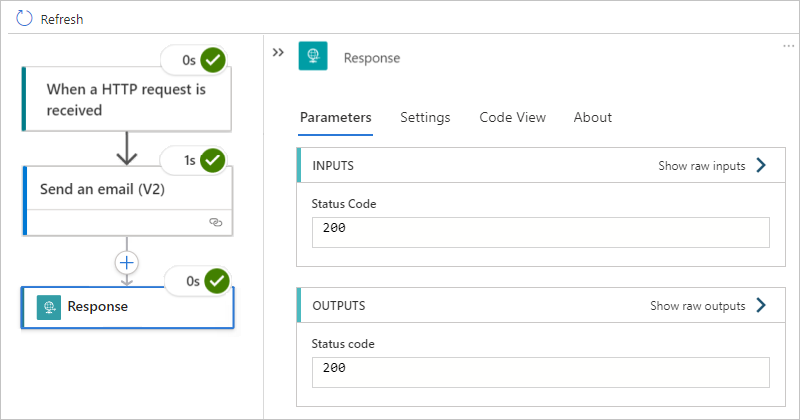

1. To stop the debugging session, on the **Run** menu, select **Stop Debugging** (Shift + F5).

<a name="firewall-setup"></a>

## Find domain names for firewall access

Before you deploy and run your logic app workflow in the Azure portal, if your environment has strict network requirements or firewalls that limit traffic, you have to set up permissions for any trigger or action connections that exist in your workflow.

To find the fully qualified domain names (FQDNs) for these connections, follow these steps:

1. In your logic app project, open the **connections.json** file, which is created after you add the first connection-based trigger or action to your workflow, and find the `managedApiConnections` object.

1. For each connection that you created, copy and save the `connectionRuntimeUrl` property value somewhere safe so that you can set up your firewall with this information.

   This example **connections.json** file contains two connections, an AS2 connection and an Office 365 connection with these `connectionRuntimeUrl` values:

   * AS2: `"connectionRuntimeUrl": https://9d51d1ffc9f77572.00.common.logic-{Azure-region}.azure-apihub.net/apim/as2/11d3fec26c87435a80737460c85f42ba`

   * Office 365: `"connectionRuntimeUrl": https://9d51d1ffc9f77572.00.common.logic-{Azure-region}.azure-apihub.net/apim/office365/668073340efe481192096ac27e7d467f`

   ```json
   {
      "managedApiConnections": {
         "as2": {
            "api": {
               "id": "/subscriptions/{Azure-subscription-ID}/providers/Microsoft.Web/locations/{Azure-region}/managedApis/as2"
            },
            "connection": {
               "id": "/subscriptions/{Azure-subscription-ID}/resourceGroups/{Azure-resource-group}/providers/Microsoft.Web/connections/{connection-resource-name}"
            },
            "connectionRuntimeUrl": https://9d51d1ffc9f77572.00.common.logic-{Azure-region}.azure-apihub.net/apim/as2/11d3fec26c87435a80737460c85f42ba,
            "authentication": {
               "type":"ManagedServiceIdentity"
            }
         },
         "office365": {
            "api": {
               "id": "/subscriptions/{Azure-subscription-ID}/providers/Microsoft.Web/locations/{Azure-region}/managedApis/office365"
            },
            "connection": {
               "id": "/subscriptions/{Azure-subscription-ID}/resourceGroups/{Azure-resource-group}/providers/Microsoft.Web/connections/{connection-resource-name}"
            },
            "connectionRuntimeUrl": https://9d51d1ffc9f77572.00.common.logic-{Azure-region}.azure-apihub.net/apim/office365/668073340efe481192096ac27e7d467f,
            "authentication": {
               "type":"ManagedServiceIdentity"
            }
         }
      }
   }
   ```

<a name="deploy-azure"></a>

## Deploy to Azure

From Visual Studio Code, you can directly publish your project to Azure to deploy your Standard logic app resource. You can publish your logic app as a new resource, which automatically creates any necessary resources, such as an [Azure Storage account, similar to function app requirements](../azure-functions/storage-considerations.md). Or, you can publish your logic app to a previously deployed Standard logic app resource, which overwrites that logic app.

Deployment for the Standard logic app resource requires a hosting plan and pricing tier, which you select during deployment. For more information, review [Hosting plans and pricing tiers](logic-apps-pricing.md#standard-pricing).

<a name="publish-new-logic-app"></a>

### Publish to a new Standard logic app resource

1. On the Visual Studio Code Activity Bar, select the Azure icon to open the Azure window.

1. In the **Azure** window, on the **Workspace** section toolbar, from the **Azure Logic Apps** menu, select **Deploy to Logic App**.

   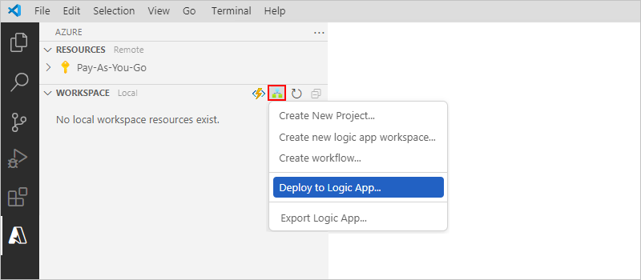

1. If prompted, select the Azure subscription to use for your logic app deployment.

1. From the list that Visual Studio Code opens, select from these options:

   * **Create new Logic App (Standard) in Azure** (quick)
   * **Create new Logic App (Standard) in Azure Advanced**
   * A previously deployed **Logic App (Standard)** resource, if any exist

   This example continues with **Create new Logic App (Standard) in Azure Advanced**.

   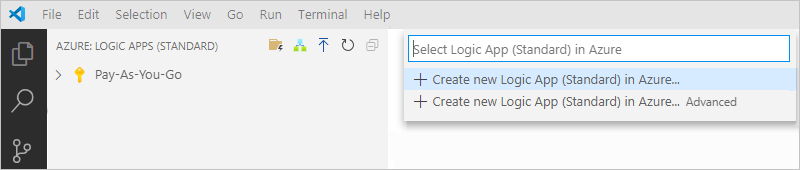

1. To create your new Standard logic app resource, follow these steps:

   1. Provide a globally unique name for your new logic app, which is the name to use for the **Logic App (Standard)** resource. This example uses **Fabrikam-Workflows-App**.

      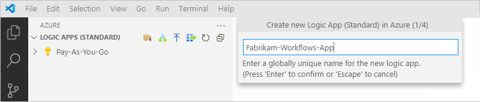

   1. Select a hosting plan for your new logic app. Either create a name for your plan, or select an existing plan (Windows-based App Service plans only). This example selects **Create new App Service Plan**.

      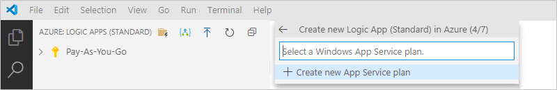

   1. Provide a name for your hosting plan, and then select a pricing tier for your selected plan.

      For more information, review [Hosting plans and pricing tiers](logic-apps-pricing.md#standard-pricing).

   1. For optimal performance, select the same resource group as your project for the deployment.

      > [!NOTE]
      >
      > Although you can create or use a different resource group, doing so might affect performance. 
      > If you create or choose a different resource group, but cancel after the confirmation prompt appears, 
      > your deployment is also canceled.

   1. For stateful workflows, select **Create new storage account** or an existing storage account.

      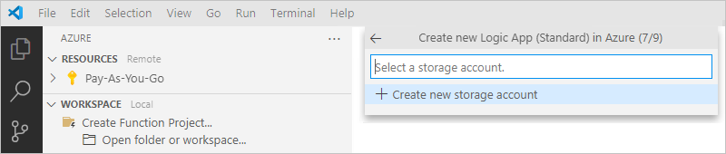

   1. If your logic app's creation and deployment settings support using [Application Insights](../azure-monitor/app/app-insights-overview.md), you can optionally enable diagnostics logging and tracing for your logic app. You can do so either when you deploy your logic app from Visual Studio Code or after deployment. You need to have an Application Insights instance, but you can create this resource either [in advance](../azure-monitor/app/create-workspace-resource.md), when you deploy your logic app, or after deployment.

      To enable logging and tracing now, follow these steps:

      1. Select either an existing Application Insights resource or **Create new Application Insights resource**.

      1. In the [Azure portal](https://portal.azure.com), go to your Application Insights resource.

      1. On the resource menu, select **Overview**. Find and copy the **Instrumentation Key** value.

      1. In Visual Studio Code, in your project's root folder, open the **local.settings.json** file.

      1. In the `Values` object, add the `APPINSIGHTS_INSTRUMENTATIONKEY` property, and set the value to the instrumentation key, for example:

         ```json
         {
            "IsEncrypted": false,
            "Values": {
               "AzureWebJobsStorage": "UseDevelopmentStorage=true",
               "FUNCTIONS_WORKER_RUNTIME": "node",
               "APPINSIGHTS_INSTRUMENTATIONKEY": <instrumentation-key>
            }
         }
         ```

         > [!TIP]
         >
         > You can check whether the trigger and action names correctly appear in your Application Insights instance.
         >
         > 1. In the Azure portal, go to your Application Insights resource.
         >
         > 2. On the resource menu, under **Investigate**, select **Application map**.
         >
         > 3. Review the operation names that appear in the map.
         >
         > Some inbound requests from built-in triggers might appear as duplicates in the Application Map. 
         > Rather than use the `WorkflowName.ActionName` format, these duplicates use the workflow name as 
         > the operation name and originate from the Azure Functions host.

      1. Next, you can optionally adjust the severity level for the tracing data that your logic app collects and sends to your Application Insights instance.

         Each time that a workflow-related event happens, such as when a workflow is triggered or when an action runs, the runtime emits various traces. These traces cover the workflow's lifetime and include, but aren't limited to, the following event types:

         * Service activity, such as start, stop, and errors.
         * Jobs and dispatcher activity.
         * Workflow activity, such as trigger, action, and run.
         * Storage request activity, such as success or failure.
         * HTTP request activity, such as inbound, outbound, success, and failure.
         * Any development traces, such as debug messages.

         Each event type is assigned to a severity level. For example, the `Trace` level captures the most detailed messages, while the `Information` level captures general activity in your workflow, such as when your logic app, workflow, trigger, and actions start and stop. This table describes the severity levels and their trace types:

         | Severity level | Trace type |
         |----------------|------------|
         | Critical | Logs that describe an unrecoverable failure in your logic app. |
         | Debug | Logs that you can use for investigation during development, for example, inbound and outbound HTTP calls. |
         | Error | Logs that indicate a failure in workflow execution, but not a general failure in your logic app. |
         | Information | Logs that track the general activity in your logic app or workflow, for example: <p><p>- When a trigger, action, or run starts and ends. <br>- When your logic app starts or ends. |
         | Trace | Logs that contain the most detailed messages, for example, storage requests or dispatcher activity, plus all the messages that are related to workflow execution activity. |
         | Warning | Logs that highlight an abnormal state in your logic app but doesn't prevent its running. |

         To set the severity level, at your project's root level, open the **host.json** file, and find the `logging` object. This object controls the log filtering for all the workflows in your logic app and follows the [ASP.NET Core layout for log type filtering](/aspnet/core/fundamentals/logging/?view=aspnetcore-2.1&preserve-view=true#log-filtering).

         ```json
         {
            "version": "2.0",
            "logging": {
               "applicationInsights": {
                  "samplingExcludedTypes": "Request",
                  "samplingSettings": {
                     "isEnabled": true
                  }
               }
            }
         }
         ```

         If the `logging` object doesn't contain a `logLevel` object that includes the `Host.Triggers.Workflow` property, add those items. Set the property to the severity level for the trace type that you want, for example:

         ```json
         {
            "version": "2.0",
            "logging": {
               "applicationInsights": {
                  "samplingExcludedTypes": "Request",
                  "samplingSettings": {
                     "isEnabled": true
                  }
               },
               "logLevel": {
                  "Host.Triggers.Workflow": "Information"
               }
            }
         }
         ```

   When you're done with the deployment steps, Visual Studio Code starts creating and deploying the resources necessary for publishing your logic app.

1. To review and monitor the deployment process, on the **View** menu, select **Output**. From the Output window toolbar list, select **Azure Logic Apps**.

   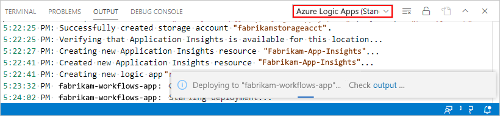

   When Visual Studio Code finishes deploying your logic app to Azure, the following message appears:

   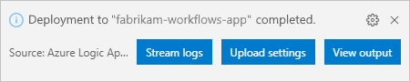

   Congratulations, your logic app is now live in Azure and enabled by default.

Next, you can learn how to perform these tasks:

* [Add a blank workflow to your project](#add-workflow-existing-project).

* [Manage deployed logic apps in Visual Studio Code](#manage-deployed-apps-vs-code) or by using the [Azure portal](#manage-deployed-apps-portal).

* [Enable run history on stateless workflows](#enable-run-history-stateless).

* [Enable monitoring view in the Azure portal for a deployed logic app](#enable-monitoring).

<a name="add-workflow-existing-project"></a>

## Add blank workflow to project

You can have multiple workflows in your logic app project. To add a blank workflow to your project, follow these steps:

1. On the Visual Studio Code Activity Bar, select the Azure icon.

1. In the **Azure** window, on the **Workspace** section toolbar, from the **Azure Logic Apps** menu, select **Create workflow**.

1. Select the workflow type that you want to add: **Stateful** or **Stateless**

1. Provide a name for your workflow.

When you're done, a new workflow folder appears in your project along with a **workflow.json** file for the workflow definition.

<a name="manage-deployed-apps-vs-code"></a>

## Manage deployed logic apps in Visual Studio Code

In Visual Studio Code, you can view all the deployed logic apps in your Azure subscription, whether they're Consumption or Standard logic app resources, and select tasks that help you manage those logic apps. However, to access both resource types, you need both the **Azure Logic Apps (Consumption)** and the **Azure Logic Apps (Standard)** extensions for Visual Studio Code.

1. On the Visual Studio Code Activity Bar, select the Azure icon. In the **Resources**, expand your subscription, and then expand **Logic App**, which shows all the logic apps deployed in Azure for that subscription.

1. Open the logic app that you want to manage. From the logic app's shortcut menu, select the task that you want to perform.

   For example, you can select tasks such as stopping, starting, restarting, or deleting your deployed logic app. You can [disable or enable a workflow by using the Azure portal](create-single-tenant-workflows-azure-portal.md#disable-enable-workflows).

   > [!NOTE]
   > The stop logic app and delete logic app operations affect workflow instances in different ways. 
   > For more information, review [Considerations for stopping logic apps](#considerations-stop-logic-apps) and 
   > [Considerations for deleting logic apps](#considerations-delete-logic-apps).

   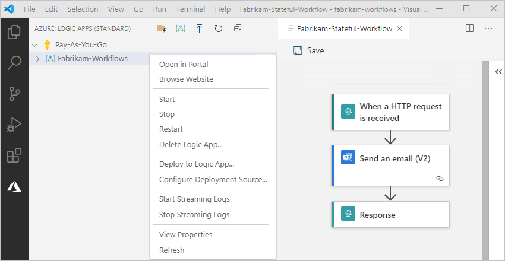

1. To view all the workflows in the logic app, expand your logic app, and then expand the **Workflows** node.

1. To view a specific workflow, open the workflow's shortcut menu, and select **Open in Designer**, which opens the workflow in read-only mode.

   To edit the workflow, you have these options:

   * In Visual Studio Code, open your project's **workflow.json** file in the workflow designer, make your edits, and redeploy your logic app to Azure.

   * In the Azure portal, [open your logic app](#manage-deployed-apps-portal). You can then open, edit, and save your workflow.

1. To open the deployed logic app in the Azure portal, open the logic app's shortcut menu, and select **Open in Portal**.

   The Azure portal opens in your browser, signs you in to the portal automatically if you're signed in to Visual Studio Code, and shows your logic app.

   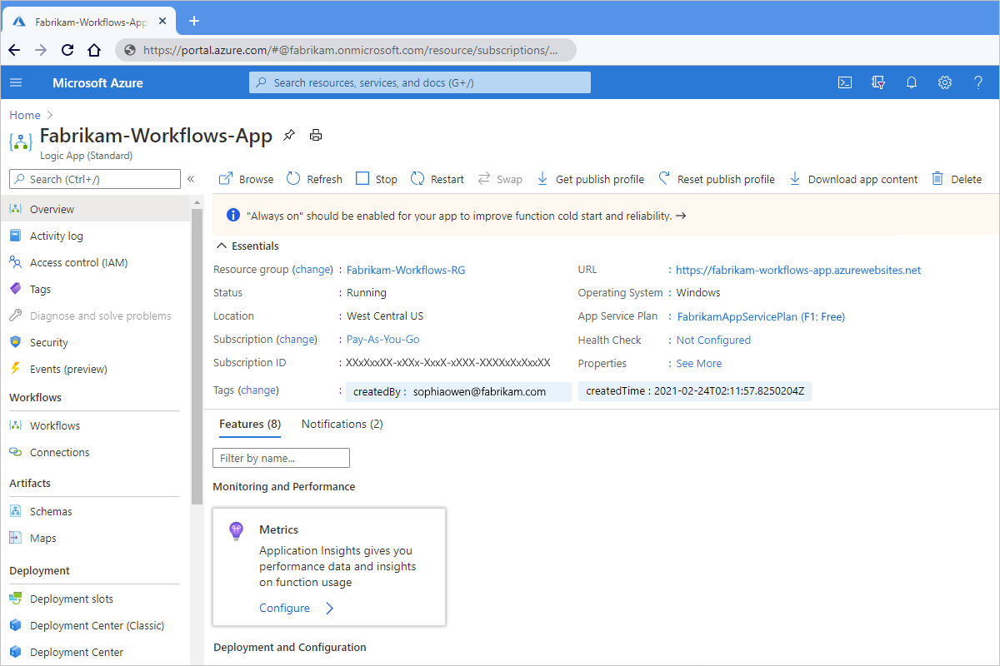

   You can also sign in separately to the Azure portal, use the portal search box to find your logic app, and then select your logic app from the results list.

   

<a name="considerations-stop-logic-apps"></a>

### Considerations for stopping logic apps

Stopping a logic app affects workflow instances in the following ways:

* Azure Logic Apps cancels all in-progress and pending runs immediately.

* Azure Logic Apps doesn't create or run new workflow instances.

* Triggers won't fire the next time that their conditions are met. However, trigger states remember the points where the logic app was stopped. So, if you restart the logic app, the triggers fire for all unprocessed items since the last run.

  To stop a trigger from firing on unprocessed items since the last run, clear the trigger state before you restart the logic app:

  1. On the Visual Studio Code Activity Bar, select the Azure icon to open the Azure window.

  1. In the **Resources** section, expand your subscription, which shows all the deployed logic apps for that subscription.

  1. Expand your logic app, and then expand the node that's named **Workflows**.

  1. Open a workflow, and edit any part of that workflow's trigger.

  1. Save your changes. This step resets the trigger's current state.

  1. Repeat for each workflow.

  1. When you're done, restart your logic app.

<a name="considerations-delete-logic-apps"></a>

### Considerations for deleting logic apps

Deleting a logic app affects workflow instances in the following ways:

* Azure Logic Apps cancels in-progress and pending runs immediately, but doesn't run cleanup tasks on the storage used by the app.

* Azure Logic Apps doesn't create or run new workflow instances.

* If you delete a workflow and then recreate the same workflow, the recreated workflow won't have the same metadata as the deleted workflow. To refresh the metadata, you have to resave any workflow that called the deleted workflow. That way, the caller gets the correct information for the recreated workflow. Otherwise, calls to the recreated workflow fail with an `Unauthorized` error. This behavior also applies to workflows that use artifacts in integration accounts and workflows that call Azure functions.

<a name="manage-deployed-apps-portal"></a>

## Manage deployed logic apps in the portal

After you deploy a logic app to the Azure portal from Visual Studio Code, you can view all the deployed logic apps that are in your Azure subscription, whether they're Consumption or Standard logic app resources. Currently, each resource type is organized and managed as separate categories in Azure. To find Standard logic apps, follow these steps:

1. In the Azure portal search box, enter **logic apps**. When the results list appears, under **Services**, select **Logic apps**.

   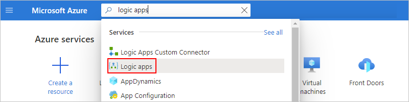

1. On the **Logic apps** pane, select the logic app that you deployed from Visual Studio Code.

   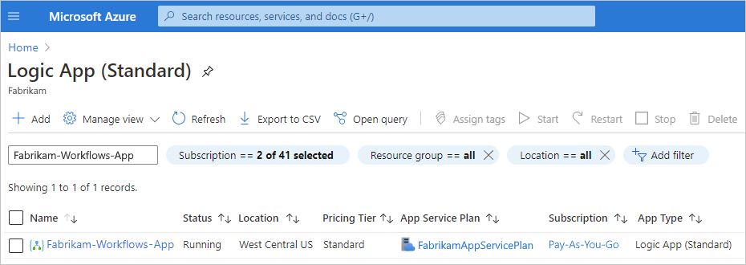

   The Azure portal opens the individual resource page for the selected logic app.

   

1. To view the workflows in this logic app, on the logic app's menu, select **Workflows**.

   The **Workflows** pane shows all the workflows in the current logic app. This example shows the workflow that you created in Visual Studio Code.

   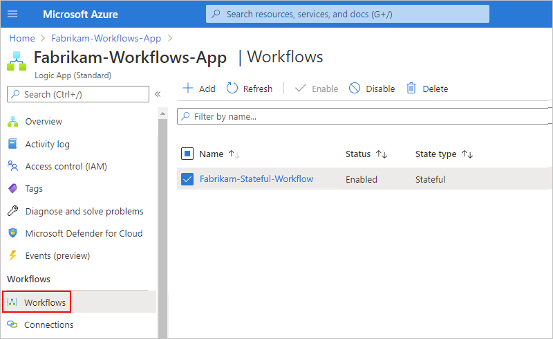

1. To view a workflow, on the **Workflows** pane, select that workflow.

   The workflow pane opens and shows more information and tasks that you can perform on that workflow.

   For example, to view the steps in the workflow, select **Designer**.

   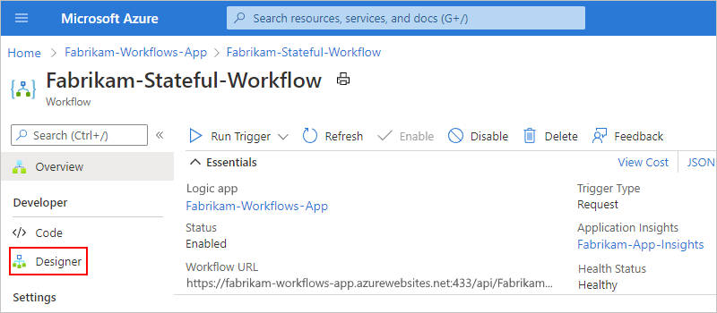

   The workflow designer opens and shows the workflow that you built in Visual Studio Code. You can now make changes to this workflow in the Azure portal.

   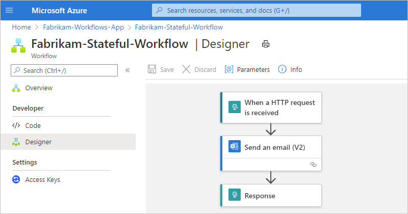

<a name="add-workflow-portal"></a>

## Add another workflow in the portal

Through the Azure portal, you can add blank workflows to a Standard logic app resource that you deployed from Visual Studio Code and build those workflows in the Azure portal.

1. In the [Azure portal](https://portal.azure.com), select your deployed Standard logic app resource.

1. On the logic app resource menu, select **Workflows**. On the **Workflows** pane, select **Add**.

   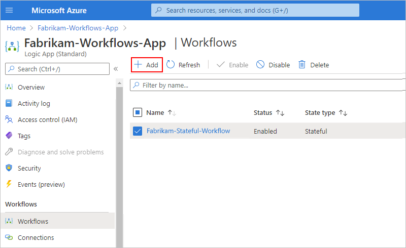

1. In the **New workflow** pane, provide name for the workflow. Select either **Stateful** or **Stateless** **>** **Create**.

   After Azure deploys your new workflow, which appears on the **Workflows** pane, select that workflow so that you can manage and perform other tasks, such as opening the designer or code view.

   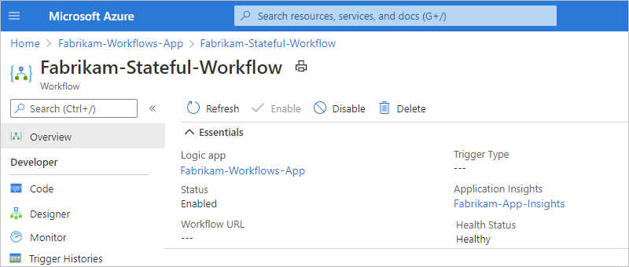

   For example, opening the designer for a new workflow shows a blank canvas. You can now build this workflow in the Azure portal.

   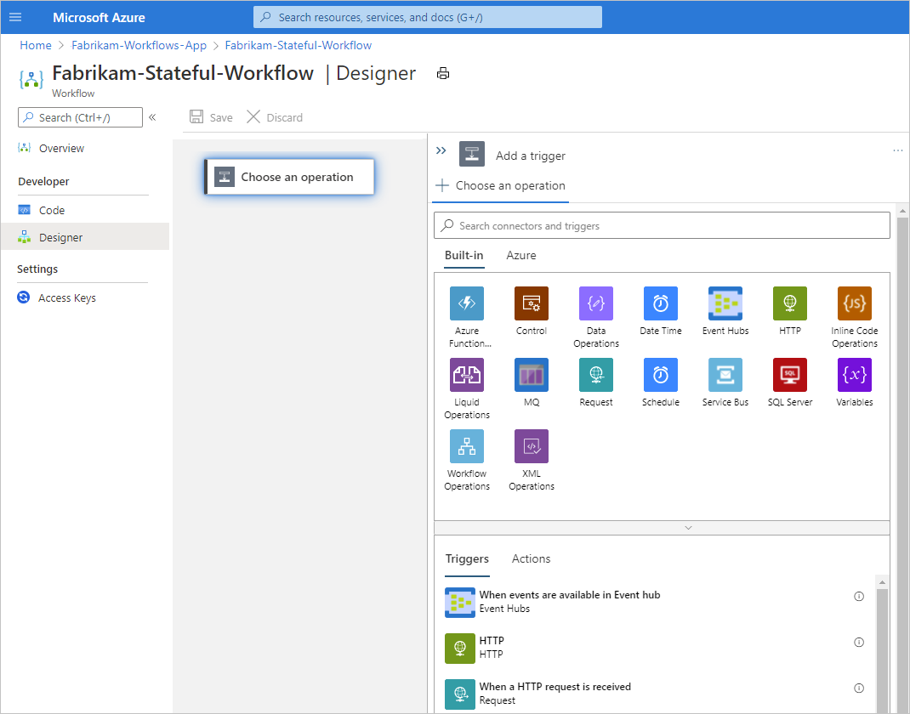

<a name="enable-run-history-stateless"></a>

## Enable run history for stateless workflows

To debug a stateless workflow more easily, you can enable the run history for that workflow, and then disable the run history when you're done. Follow these steps for Visual Studio Code, or if you're working in the Azure portal, see [Create single-tenant based workflows in the Azure portal](create-single-tenant-workflows-azure-portal.md#enable-run-history-stateless).

1. In your Visual Studio Code project, expand the folder that's named **workflow-designtime**. Open the **local.settings.json** file.

1. Add the `Workflows.{yourWorkflowName}.operationOptions` property and set the value to `WithStatelessRunHistory`, for example:

   **Windows**

   ```json
   {
      "IsEncrypted": false,
      "Values": {
         "AzureWebJobsStorage": "UseDevelopmentStorage=true",
         "FUNCTIONS_WORKER_RUNTIME": "node",
         "Workflows.{yourWorkflowName}.OperationOptions": "WithStatelessRunHistory"
      }
   }
   ```

   **macOS or Linux**

   ```json
   {
      "IsEncrypted": false,
      "Values": {
         "AzureWebJobsStorage": "DefaultEndpointsProtocol=https;AccountName=fabrikamstorageacct; \
             AccountKey=<access-key>;EndpointSuffix=core.windows.net",
         "FUNCTIONS_WORKER_RUNTIME": "node",
         "Workflows.{yourWorkflowName}.OperationOptions": "WithStatelessRunHistory"
      }
   }
   ```

1. To disable the run history when you're done, either set the `Workflows.{yourWorkflowName}.OperationOptions`property to `None`, or delete the property and its value.

<a name="enable-monitoring"></a>

## Enable monitoring view in the Azure portal

After you deploy a **Logic App (Standard)** resource from Visual Studio Code to Azure, you can review any available run history and details for a workflow in that resource by using the Azure portal and the **Monitor** experience for that workflow. However, you first have to enable the **Monitor** view capability on that logic app resource.

1. In the [Azure portal](https://portal.azure.com), open the Standard logic app resource.

1. On the logic app resource menu, under **API**, select **CORS**.

1. On the **CORS** pane, under **Allowed Origins**, add the wildcard character (*).

1. When you're done, on the **CORS** toolbar, select **Save**.

   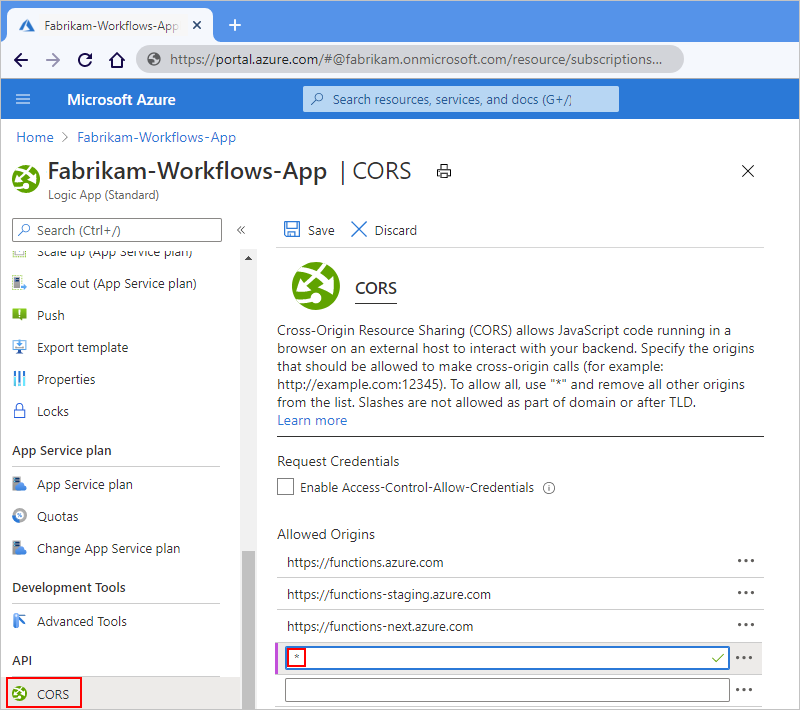

<a name="enable-open-application-insights"></a>

## Enable or open Application Insights after deployment

During workflow execution, your logic app emits telemetry along with other events. You can use this telemetry to get better visibility into how well your workflow runs and how the Logic Apps runtime works in various ways. You can monitor your workflow by using [Application Insights](../azure-monitor/app/app-insights-overview.md), which provides near real-time telemetry (live metrics). This capability can help you investigate failures and performance problems more easily when you use this data to diagnose issues, set up alerts, and build charts.

If your logic app's creation and deployment settings support using [Application Insights](../azure-monitor/app/app-insights-overview.md), you can optionally enable diagnostics logging and tracing for your logic app. You can do so either when you deploy your logic app from Visual Studio Code or after deployment. You need to have an Application Insights instance, but you can create this resource either [in advance](../azure-monitor/app/create-workspace-resource.md), when you deploy your logic app, or after deployment.

To enable Application Insights on a deployed logic app or to review Application Insights data when already enabled, follow these steps:

1. In the Azure portal, find your deployed logic app.

1. On the logic app menu, under **Settings**, select **Application Insights**.

1. If Application Insights isn't enabled, on the **Application Insights** pane, select **Turn on Application Insights**. After the pane updates, at the bottom, select **Apply**.

   If Application Insights is enabled, on the **Application Insights** pane, select **View Application Insights data**.

After Application Insights opens, you can review various metrics for your logic app. For more information, review these topics:

* [Azure Logic Apps Running Anywhere - Monitor with Application Insights - part 1](https://techcommunity.microsoft.com/t5/integrations-on-azure/azure-logic-apps-running-anywhere-monitor-with-application/ba-p/1877849)
* [Azure Logic Apps Running Anywhere - Monitor with Application Insights - part 2](https://techcommunity.microsoft.com/t5/integrations-on-azure/azure-logic-apps-running-anywhere-monitor-with-application/ba-p/2003332)

<a name="delete-from-designer"></a>

## Delete items from the designer

To delete an item in your workflow from the designer, follow any of these steps:

* Select the item, open the item's shortcut menu (Shift+F10), and select **Delete**. To confirm, select **OK**.

* Select the item, and press the delete key. To confirm, select **OK**.

* Select the item so that details pane opens for that item. In the pane's upper right corner, open the ellipses (**...**) menu, and select **Delete**. To confirm, select **OK**.

  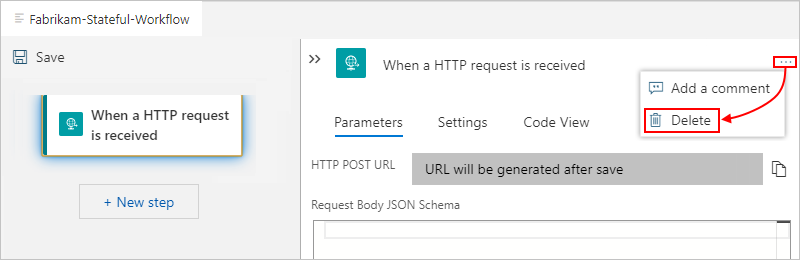

  > [!TIP]
  > If the ellipses menu isn't visible, expand Visual Studio Code window wide enough so that 
  > the details pane shows the ellipses (**...**) button in the upper right corner.

<a name="troubleshooting"></a>

## Troubleshoot errors and problems

<a name="designer-fails-to-open"></a>

### Designer fails to open

When you try to open the designer, you get this error, **"Workflow design time could not be started"**. If you previously tried to open the designer, and then discontinued or deleted your project, the extension bundle might not be downloading correctly. To check whether this cause is the problem, follow these steps:

  1. In Visual Studio Code, open the Output window. From the **View** menu, select **Output**.

  1. From the list in the Output window's title bar, select **Azure Logic Apps (Standard)** so that you can review output from the extension, for example:

     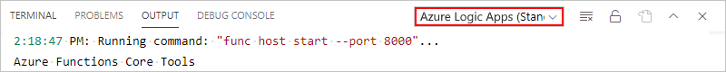

  1. Review the output and check whether this error message appears:

     ```text
     A host error has occurred during startup operation '{operationID}'.
     System.Private.CoreLib: The file 'C:\Users\{userName}\AppData\Local\Temp\Functions\
     ExtensionBundles\Microsoft.Azure.Functions.ExtensionBundle.Workflows\1.1.7\bin\
     DurableTask.AzureStorage.dll' already exists.
     Value cannot be null. (Parameter 'provider')
     Application is shutting down...
     Initialization cancellation requested by runtime.
     Stopping host...
     Host shutdown completed.
     ```

   To resolve this error, delete the **ExtensionBundles** folder at this location **...\Users\{your-username}\AppData\Local\Temp\Functions\ExtensionBundles**, and retry opening the **workflow.json** file in the designer.

<a name="missing-triggers-actions"></a>

### New triggers and actions are missing from the designer picker for previously created workflows

Single-tenant Azure Logic Apps supports built-in actions for Azure Function Operations, Liquid Operations, and XML Operations, such as **XML Validation** and **Transform XML**. However, for previously created logic apps, these actions might not appear in the designer picker for you to select if Visual Studio Code uses an outdated version of the extension bundle, `Microsoft.Azure.Functions.ExtensionBundle.Workflows`.

Also, the **Azure Function Operations** connector and actions don't appear in the designer picker unless you enabled or selected **Use connectors from Azure** when you created your logic app. If you didn't enable the Azure-deployed connectors at app creation time, you can enable them from your project in Visual Studio Code. Open the **workflow.json** shortcut menu, and select **Use Connectors from Azure**.

To fix the outdated bundle, follow these steps to delete the outdated bundle, which makes Visual Studio Code automatically update the extension bundle to the latest version.

> [!NOTE]
> This solution applies only to logic apps that you create and deploy using Visual Studio Code with 
> the Azure Logic Apps (Standard) extension, not the logic apps that you created using the Azure portal. 
> See [Supported triggers and actions are missing from the designer in the Azure portal](create-single-tenant-workflows-azure-portal.md#missing-triggers-actions).

1. Save any work that you don't want to lose, and close Visual Studio.

1. On your computer, browse to the following folder, which contains versioned folders for the existing bundle:

   `...\Users\{your-username}\.azure-functions-core-tools\Functions\ExtensionBundles\Microsoft.Azure.Functions.ExtensionBundle.Workflows`

1. Delete the version folder for the earlier bundle, for example, if you have a folder for version 1.1.3, delete that folder.

1. Now, browse to the following folder, which contains versioned folders for required NuGet package:

   `...\Users\{your-username}\.nuget\packages\microsoft.azure.workflows.webjobs.extension`

1. Delete the version folder for the earlier package.

1. Reopen Visual Studio Code, your project, and the **workflow.json** file in the designer.

The missing triggers and actions now appear in the designer.

<a name="400-bad-request"></a>

### "400 Bad Request" appears on a trigger or action

When a run fails, and you inspect the run in monitoring view, this error might appear on a trigger or action that has a longer name, which causes the underlying Uniform Resource Identifier (URI) to exceed the default character limit.

To resolve this problem and adjust for the longer URI, edit the `UrlSegmentMaxCount` and `UrlSegmentMaxLength` registry keys on your computer by following the steps below. These key's default values are described in this topic, [Http.sys registry settings for Windows](/troubleshoot/iis/httpsys-registry-windows).

> [!IMPORTANT]
> Before you start, make sure that you save your work. This solution requires you 
> to restart your computer after you're done so that the changes can take effect.

1. On your computer, open the **Run** window, and run the `regedit` command, which opens the registry editor.

1. In the **User Account Control** box, select **Yes** to permit your changes to your computer.

1. In the left pane, under **Computer**, expand the nodes along the path, **HKEY_LOCAL_MACHINE\SYSTEM\CurrentControlSet\Services\HTTP\Parameters**, and then select **Parameters**.

1. In the right pane, find the `UrlSegmentMaxCount` and `UrlSegmentMaxLength` registry keys.

1. Increase these key values enough so that the URIs can accommodate the names that you want to use. If these keys don't exist, add them to the **Parameters** folder by following these steps:

   1. From the **Parameters** shortcut menu, select **New** > **DWORD (32-bit) Value**.

   1. In the edit box that appears, enter `UrlSegmentMaxCount` as the new key name.

   1. Open the new key's shortcut menu, and select **Modify**.

   1. In the **Edit String** box that appears, enter the **Value data** key value that you want in hexadecimal or decimal format. For example, `400` in hexadecimal is equivalent to `1024` in decimal.

   1. To add the `UrlSegmentMaxLength` key value, repeat these steps.

   After you increase or add these key values, the registry editor looks like this example:

   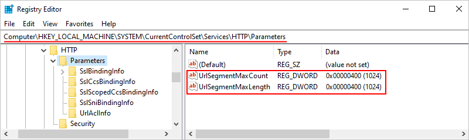

1. When you're ready, restart your computer so that the changes can take effect.

<a name="debugging-fails-to-start"></a>

### Debugging session fails to start

When you try to start a debugging session, you get the error, **"Error exists after running preLaunchTask 'generateDebugSymbols'"**. To resolve this problem, edit the **tasks.json** file in your project to skip symbol generation.

1. In your project, expand the folder that's named **.vscode**, and open the **tasks.json** file.

1. In the following task, delete the line, `"dependsOn: "generateDebugSymbols"`, along with the comma that ends the preceding line, for example:

   Before:

   ```json
    {
      "type": "func",
      "command": "host start",
      "problemMatcher": "$func-watch",
      "isBackground": true,
      "dependsOn": "generateDebugSymbols"
    }
   ```

   After:

   ```json
    {
      "type": "func",
      "command": "host start",
      "problemMatcher": "$func-watch",
      "isBackground": true
    }
   ```

## Next steps

We'd like to hear from you about your experiences with the Azure Logic Apps (Standard) extension!

* For bugs or problems, [create your issues in GitHub](https://github.com/Azure/logicapps/issues).
* For questions, requests, comments, and other feedback, [use this feedback form](https://aka.ms/lafeedback).
