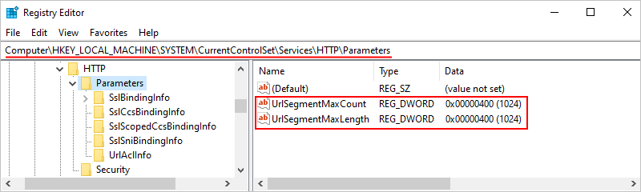

# Create Standard logic app workflows with Visual Studio Code

[!INCLUDE [logic-apps-sku-standard](../../includes/logic-apps-sku-standard.md)]

This guide shows how to locally create an example Standard logic app workflow that you can run in single-tenant Azure Logic Apps when you use Visual Studio Code with the **Azure Logic Apps (Standard)** extension.

In this guide, you create a Standard logic app workspace and project, build your workflow, and deploy your project as a Standard logic app resource in Azure where your workflow can run in single-tenant Azure Logic Apps or in App Service Environment v3 (Windows-based App Service plans only). You can also deploy and run your workflow anywhere that Kubernetes can run, such as Azure, Azure Kubernetes Service, on premises, or even other cloud providers, due to the containerized runtime for Azure Logic Apps (Standard).

Here are just some benefits that Standard logic apps provide:

- You can locally create, debug, run, and test workflows in the local Visual Studio Code development environment. Both the Azure portal and Visual Studio Code provide the capability to build, run, and deploy Standard logic app resources and workflows. However, with Visual Studio Code, you can perform these tasks locally.

- Your Standard logic app project can include both [stateful and stateless workflows](single-tenant-overview-compare.md#stateful-stateless).

- Workflows in the same Standard logic app resource and tenant run in the same process as the Azure Logic Apps (Standard) runtime, so they share the same resources and provide better performance.

This guide's example workflow initially starts with a **Request** trigger followed by an **Office 365 Outlook** action. The **Request** trigger creates a callable endpoint for the workflow and waits for an inbound HTTPS request from any caller. When the trigger receives a request and fires, the next action runs by sending email to the specified recipient along with any trigger outputs that you select. Later, you can add a **Response** action that returns a reply and processed data to the caller.

:::image type="content" source="media/create-standard-workflows-visual-studio-code/visual-studio-code-logic-apps-overview.png" alt-text="Screenshot that shows Visual Studio Code, logic app workspace, project, and workflow.":::

While this guide's example is cloud-based and only has a few steps, you can create workflows using operations from [1,400+ connectors](/azure/connectors/introduction) that help you integrate a vast range of services, systems, apps, and data across cloud, on premises, and hybrid environments.

As you progress through the guide, you complete the following high-level tasks:

* Create a Standard logic app workspace and project with a blank stateful workflow.
* Add a trigger and actions to your workflow.
* Run, debug, and test locally.
* Review workflow run history.
* Find domain name details for firewall access.
* Enable run history for stateless workflows.
* Deploy to Azure, which includes optionally enabling Application Insights.
* Enable or open the Application Insights after deployment.
* Manage your deployed logic app resource in Visual Studio Code and the Azure portal.

## Prerequisites

### Access and connectivity requirements

If you plan to locally create and run workflows using only [built-in operations](/azure/connectors/built-in), which run natively on the Azure Logic Apps (Standard) runtime, you don't need the access and connectivity requirements in this section. However, for the following scenarios, you need to meet these requirements:

- Deploy your logic app to Azure from Visual Studio Code.
- Build a workflow that uses [managed connector operations](/azure/connectors/managed) that run in global Azure.
- Access existing Standard logic app resources and workflows in Azure or other deployed Azure resources.

These requirements include the following items:

- An Azure account and subscription. If you don't have a subscription, [sign up for a free Azure account](https://azure.microsoft.com/free/?WT.mc_id=A261C142F).

- Access to the internet so that you can download the required extension, connect from Visual Studio Code to your Azure account, test workflows that include managed connector operations, and deploy to Azure from Visual Studio Code.

- To create the same example workflow in this guide, you need an Office 365 Outlook email account that uses a Microsoft work or school account to sign in.

  If you don't have an Office 365 account, you can use any other available action that can send messages from your email account, for example, Outlook.com. If you choose a [different email connector](/connectors/connector-reference/connector-reference-logicapps-connectors), such as Outlook.com, you can still follow the example, and the general overall steps are the same. However, your experience and options might differ in some ways. For example, with the Outlook.com connector, use your personal Microsoft account to sign in.

### Tools

1. Download and install [**Visual Studio Code**](https://code.visualstudio.com/), which is free.

1. Download and install the **Azure Logic Apps (Standard) extension for Visual Studio Code** by following these steps:

   1. In Visual Studio Code, on the Activity bar, select **Extensions**. (Keyboard: Press Ctrl+Shift+X)

   1. In the extensions search box, enter **azure logic apps standard**. From the results list, select **Azure Logic Apps (Standard)** **>** **Install**.

      The extension downloads and installs all required dependencies and the correct versions for the following frameworks:

      - Azure Functions Core Tools
      - .NET SDK
      - Node.js

      After the installation completes, the extension appears in the **Extensions: Installed** list.

      :::image type="content" source="media/create-standard-workflows-visual-studio-code/azure-logic-apps-extension-installed.png" alt-text="Screenshot shows Visual Studio Code with Azure Logic Apps (Standard) extension installed.":::

   1. Reload or restart Visual Studio Code to make sure the extension and all dependencies correctly install.

   1. To confirm that the extension and all dependencies correctly installed, see [Check extension installation](#check-extensions).

   Currently, you can have both Consumption (multitenant) and Standard (single-tenant) extensions installed at the same time. The development experiences differ from each other in some ways, but your Azure subscription can include both Standard and Consumption logic app resource types. In Visual Studio Code, the Azure pane shows all the Azure-deployed and hosted logic apps in your Azure subscription, but organizes your apps in the following ways:

   - **Resources** section: All the Standard logic apps in your subscription.
   - **Logic Apps (Consumption)** section: All the Consumption logic apps in your subscription.

1. To locally run webhook-based triggers and actions, such as the [built-in **HTTP Webhook** trigger](/azure/connectors/connectors-native-webhook), you need to [set up forwarding for the callback URL](#webhook-setup) in Visual Studio Code.

1. To enable diagnostics logging and tracing with [Application Insights](/azure/azure-monitor/app/app-insights-overview) for your Standard logic app, you can complete this task either during logic app deployment or after deployment. You need to have an Application Insights resource, but you can [create this resource in advance](/azure/azure-monitor/app/create-workspace-resource), during deployment, or after deployment.

1. Install or use a tool that can send HTTP requests to test the sample workflow, for example:

   [!INCLUDE [api-test-http-request-tools](../../includes/api-test-http-request-tools.md)]

<a name="check-extensions"></a>

#### Check extension installation

1. To make sure that the extension and all dependencies are correctly installed, reload or restart Visual Studio Code.

1. Confirm that Visual Studio Code automatically finds and installs extension updates so that all your extensions get the latest updates. Otherwise, you have to manually uninstall the outdated version and install the latest version.

   1. On the **File** menu, go to **Preferences** **>** **Settings**.

   1. On the **User** tab, go to **Features** **>** **Extensions**.

   1. Make sure **Auto Check Updates** is selected, and that **Auto Update** is set to **All Extensions**.

1. Confirm that the **Azure Logic Apps Standard: Project Runtime** setting is set to the correct version:

   1. On the **User** tab, go to **>** **Extensions** **>** **Azure Logic Apps (Standard)**.

   1. Make sure **Project Runtime** is set to version **~4**, for example:

      :::image type="content" source="media/create-standard-workflows-visual-studio-code/azure-logic-apps-settings.png" alt-text="Screenshot shows Visual Studio Code settings for Azure Logic Apps (Standard) extension.":::

      > [!NOTE]
      >
      > This version is required to use the [Inline Code Operations actions](/azure/logic-apps/logic-apps-add-run-inline-code).

<a name="connect-azure-account"></a>

## Connect to your Azure account

If you aren't already connected to your Azure account, follow these steps to connect:

1. In Visual Studio Code, on the Activity Bar, select the Azure icon to open the **Azure** pane.

   :::image type="content" source="media/create-standard-workflows-visual-studio-code/visual-studio-code-azure-icon.png" alt-text="Screenshot shows Visual Studio Code Activity Bar and selected Azure icon.":::

1. In the Azure pane, under **Resources**, select **Sign in to Azure**. When the Visual Studio Code authentication page appears, sign in with your Azure account.

   :::image type="content" source="media/create-standard-workflows-visual-studio-code/sign-in-azure-subscription.png" alt-text="Screenshot shows Azure pane with selected link for Azure sign in.":::

   After you sign in, the Azure pane shows the Azure subscriptions associated with your Azure account. If the expected subscriptions don't appear, or you want the pane to show only specific subscriptions, follow these steps:

   1. In the subscriptions list, move your pointer next to the first subscription until the **Select Subscriptions** button (filter icon) appears. Select the filter icon.

      :::image type="content" source="media/create-standard-workflows-visual-studio-code/filter-subscription-list.png" alt-text="Screenshot shows Azure pane with subscriptions and selected filter icon.":::

      Or, in the Visual Studio Code status bar, select your Azure account.

   1. When the updated subscriptions list appears, select the subscriptions that you want, and make sure that you select **OK**.

<a name="create-workspace"></a>

## Create a local workspace

A logic app project always requires a workspace. So, before you can create your logic app, you have to create a [workspace](https://code.visualstudio.com/docs/editor/workspaces/workspaces) where you keep your logic app project. You later use this workspace and project to manage, run, and deploy your logic app from Visual Studio Code to your deployment environment. The underlying project is similar to an Azure Functions project, also known as a function app project.

1. On your computer, create an *empty* local folder to use later for the workspace and project.

   This example creates a folder named **fabrikam-workflows**.

1. In Visual Studio Code, close all open folders.

1. In the **Azure** window, on the **Workspace** section toolbar, from the **Azure Logic Apps** menu, select **Create new logic app workspace**.

   :::image type="content" source="media/create-standard-workflows-visual-studio-code/create-new-workspace.png" alt-text="Screenshot shows Azure pane, Workspace toolbar, Azure Logic Apps menu, and selected item, Create new logic app workspace.":::

   If Windows Defender Firewall prompts you to grant network access for **Code.exe**, which is Visual Studio Code, and for **func.exe**, which is the Azure Functions Core Tools, select **Private networks, such as my home or work network** **>** **Allow access**.

1. In the **Select Folder** window, go to the location where you created your folder, select the folder, and choose **Select** (don't double-select the folder).

   :::image type="content" source="media/create-standard-workflows-visual-studio-code/select-project-folder.png" alt-text="Screenshot shows Select Folder box and new workspace and project folder with Select button selected.":::

   On the Visual Studio Code toolbar, a prompt appears for you to name your workspace.

1. For **Provide a workspace name**, enter the workspace name to use.

   This example uses **Fabrikam-Workflows**.

   :::image type="content" source="media/create-standard-workflows-visual-studio-code/workspace-name.png" alt-text="Screenshot shows prompt to provide a workspace name.":::

Next, create your logic app project.

<a name="create-project"></a>

## Create your logic app project

After you create the required workspace, follow the prompts to create your project.

1. For your project template, select **Logic app**. Enter a project name to use.

   This example uses **Fabrikam-Workflows**.

   :::image type="content" source="media/create-standard-workflows-visual-studio-code/project-template.png" alt-text="Screenshot shows prompt to select a project template with selected option for logic app.":::

1. For your workflow template, select either **Stateful Workflow** or **Stateless Workflow**, based on your scenario. Enter a workflow name to use.

   This example selects **Stateful Workflow**, which stores workflow history, inputs, and outputs, and uses **Stateful-Workflow** as the name.

   Stateless workflows don't store this data and currently support only [managed connector *actions*](/azure/connectors/managed), not triggers. Although you have the option to enable connectors in Azure for your stateless workflow, the designer doesn't show any managed connector triggers for you to select.

   > [!NOTE]
   >
   > If you get an error named **azureLogicAppsStandard.createNewProject** with the error message, 
   > **Unable to write to Workspace Settings because azureFunctions.suppressProject is not a registered configuration**, 
   > try reinstalling the [Azure Functions extension for Visual Studio Code](https://marketplace.visualstudio.com/items?itemName=ms-azuretools.vscode-azurefunctions), 
   > either directly from the Visual Studio Marketplace or from inside Visual Studio Code.

1. Now, choose whether you want to open your project in the current Visual Studio Code window or a new window. Select **Open in current window** or **Open in new window**, based on your preference.

   The Explorer pane opens to show your workspace, project, and the automatically opened **workflow.json** file. This file exists in the folder named **Stateful-Workflow** and stores the underlying JSON definition for the workflow that you build in the designer. For information about your project structure, see [Standard logic app project structure](#project-structure).

   You also get a prompt to enable multitenant Azure-hosted "shared" connectors, for example:

   :::image type="content" source="media/create-standard-workflows-visual-studio-code/local-workspace-project-created.png" alt-text="Screenshot shows opened logic app project with prompt to enable Azure-hosted connectors.":::

1. To enable all the managed "shared" connectors that run in multitenant Azure so you can view and choose to use them in your workflow, select **Use connectors from Azure**.

   > [!NOTE]
   >
   > If you don't select this option, and you later try to add a managed connector 
   > operation when you build your workflow, you can't continue because the operation 
   > information pane shows a spinning circle that doesn't stop.

1. For the Azure resource group, select **Create new resource group**. Enter the resource group name to use.

   This example uses **Fabrikam-Workflows-RG**.

1. For the subscription, select the Azure subscription to use with your logic app project.

1. For the location where to create your group and resources, select the Azure region.

   This example uses **West Central US**.

1. If your project needs other setup for development or needs supporting artifacts to build your workflow, see the following scenarios and related tasks:

   | Scenario | Task |
   |----------|------|
   | Locally run webhook-based triggers or actions. | [Set up forwarding for webhook callback URLs](#webhook-setup). |
   | Set up stateless workflow run history. | [Enable run history for stateless workflows](#enable-run-history-stateless). |
   | Add artifacts and dependencies, such as maps, schemas, and assemblies. | [Add artifacts and dependencies](#add-artifacts-dependencies). |
   | Work with a NuGet-based (.NET) project | [Convert an extension-based bundle (Node.js) project to a NuGet package-based (.NET) project](#convert-project-nuget). <br><br>**Note**: To convert an extension bundle-based (Node.js) project that you created before assemblies support existed, see also [Migrate NuGet package-based projects to use assemblies in the **lib** folder](#migrate-nuget-assemblies). |
   | Create your own built-in connectors. | 1. [Convert an extension bundle-based (Node.js) project to a NuGet package-based (.NET) project ](#convert-project-nuget). <br><br>2. [Enable-built-in-connector-authoring](#enable-built-in-connector-authoring). |

Now, open the workflow designer.

<a name="open-workflow-designer"></a>

## Open the workflow designer

After your project opens in the Explorer pane, open the designer so you can build your workflow.

From the **workflow.json** file shortcut menu, select **Open Designer**.

:::image type="content" source="media/create-standard-workflows-visual-studio-code/open-workflow-designer.png" alt-text="Screenshot shows Explorer pane, workflow.json file shortcut menu, and Open Designer selected.":::

> [!NOTE]
>
> After you select this option, you might get the message that startup might take a few seconds 
> due to "starting the workflow design-time API". You can ignore this message or select **OK**.

Visual Studio Code opens the workflow designer and shows the **Add a trigger** prompt, for example:

:::image type="content" source="media/create-standard-workflows-visual-studio-code/designer-opened.png" alt-text="Screenshot shows designer with blank workflow.":::

> [!NOTE]
>
> If the designer won't open, see the troubleshooting section, [Designer fails to open](#designer-fails-to-open).

Next, add a trigger and actions to create your workflow.

<a name="add-trigger-actions"></a>

## Add a trigger and an action

To create your workflow, start your workflow with a trigger, and then initially add a single action. That way, you can test your workflow before you add the next action. The example workflow uses the following trigger and actions, collectively known as *operations*:

| Connector or operation group | Operation name | Operation type | Description |
|------------------------------|----------------|----------------|-------------|
| **Request** | **When an HTTP request is received** | Trigger (built-in) | Creates an endpoint URL on the workflow to receive inbound calls or requests from other services or logic app workflows. <br><br>For more information, see [Receive and respond to inbound HTTPs calls to workflows](/azure/connectors/connectors-native-reqres?tabs=standard#add-a-request-trigger). |
| **Office 365 Outlook** | **Send an email** | Action (managed) | Send an email using an Office 365 Outlook account. To follow the steps in this guide, you need an Office 365 Outlook email account. For more information, see [Connect to Office 365 Outlook from Azure Logic Apps](/azure/connectors/connectors-create-api-office365-outlook). <br><br>**Note**: If you have an email account that's supported by a different connector, you can use that connector, but that connector's user experience differs from the steps in this example. |
| **Request** | **Response** | Action (built-in) | Send a reply and return data back to the caller. <br><br>For more information, see [Add a **Response** action](/azure/connectors/connectors-native-reqres#tabs=standard#add-a-response-action). |

### Add the Request trigger

1. On the workflow designer, select **Add a trigger**, if not already selected.

   The **Add a trigger** pane opens and shows a gallery where you can select from available connectors and operation groups, for example:

   :::image type="content" source="media/create-standard-workflows-visual-studio-code/workflow-designer-triggers-gallery.png" alt-text="Screenshot shows workflow designer, the selected prompt named Add a trigger, and the gallery for connectors and operation groups with triggers.":::

1. In the **Add a trigger** pane, [follow these general steps to add the **Request** trigger named **When an HTTP request is received**](/azure/logic-apps/create-workflow-with-trigger-or-action?tabs=standard#add-trigger).

   The following example selects the **Built-in** option so that only the built-in triggers appear:

   :::image type="content" source="media/create-standard-workflows-visual-studio-code/add-request-trigger.png" alt-text="Screenshot shows workflow designer, Add a trigger pane, and selected trigger named When an HTTP request is received.":::

   When the trigger appears on the designer, the trigger information pane opens and shows the trigger's parameters, settings, and other related tasks.

   :::image type="content" source="media/create-standard-workflows-visual-studio-code/request-trigger-added-to-designer.png" alt-text="Screenshot shows information pane for the trigger named When an HTTP request is received.":::

   > [!NOTE]
   >
   > If the trigger information pane doesn't appear, makes sure that the trigger is selected on the designer.

1. Save your workflow. On the designer toolbar, select **Save**.

### Add the Office 365 Outlook action

1. On the designer, under the **Request** trigger, [follow these general steps to add the **Office 365 Outlook** action named **Send an email (V2)**](/azure/logic-apps/create-workflow-with-trigger-or-action?tabs=standard#add-action).

   If the action doesn't appear in the initial results, next to the connector name, select **See more**, for example:

   :::image type="content" source="media/create-standard-workflows-visual-studio-code/add-send-email-action.png" alt-text="Screenshot shows workflow designer and Add an action pane with action search results, and selected See more options.":::

1. When the action's authentication pane appears, select **Sign in** to create a connection to your email account.

   :::image type="content" source="media/create-standard-workflows-visual-studio-code/send-email-action-sign-in.png" alt-text="Screenshot shows actions named Send an email (V2) with selected sign in button.":::

1. Follow the subsequent prompts to authenticate your credentials, allow access, and allow returning to Visual Studio Code.

   > [!NOTE]
   >
   > If too much time passes before you complete the prompts, the authentication process times out 
   > and fails. In this case, return to the designer and retry signing in to create the connection.

   1. When the Microsoft authentication prompt appears, select your user account for Office 365 Outlook. On the confirmation required page that opens, select **Allow access**.

   1. When Azure Logic Apps prompts to open a Visual Studio Code link, select **Open**.

      :::image type="content" source="media/create-standard-workflows-visual-studio-code/visual-studio-code-open-link-type.png" alt-text="Screenshot shows prompt to open link for Visual Studio Code.":::

   1. When Visual Studio Code prompts you to have the extension open the Microsoft Azure Tools, select **Open**.

      :::image type="content" source="media/create-standard-workflows-visual-studio-code/visual-studio-code-open-external-website.png" alt-text="Screenshot shows prompt for extension to open Microsoft Azure tools.":::

   After Visual Studio Code creates your connection, some connectors show the message that **The connection will be valid for \<n\> days only**. This time limit applies only to the duration while you author your logic app workflow in Visual Studio Code. After deployment, this limit no longer applies because your workflow can authenticate at runtime by using its automatically enabled [system-assigned managed identity](/azure/logic-apps/create-managed-service-identity). This managed identity differs from the authentication credentials or connection string that you use when you create a connection. If you disable this system-assigned managed identity, connections won't work at runtime.

1. In the **Send an email** information pane that opens, on the **Parameters** tab, provide the required information for the action.

   > [!NOTE]
   >
   > If the action information pane didn't automatically open, 
   > select the **Send an email** action on the designer.

   | Property | Required | Value | Description |
   |----------|----------|-------|-------------|
   | **To** | Yes | <*your-email-address*> | The email recipient, which can be your email address for test purposes. This example uses the fictitious email, **sophia.owen@fabrikam.com**. |
   | **Subject** | Yes | **An email from your example workflow** | The email subject |
   | **Body** | Yes | **Hello from your example workflow!** | The email body content |

   For example:

   :::image type="content" source="media/create-standard-workflows-visual-studio-code/send-email-action-details.png" alt-text="Screenshot shows information for the Office 365 Outlook action named Send an email.":::

1. Save your workflow. On the designer, select **Save**.

<a name="project-structure"></a>

## Standard logic app project structure

[!INCLUDE [Visual Studio Code - logic app project structure](includes/logic-apps-single-tenant-project-structure-visual-studio-code.md)]

<a name="other-development-setup-tasks"></a>

## Other development setup tasks

After you create your project, you might still have other setup tasks to support specific local development scenarios around building, running, and deploying Standard logic apps using Visual Studio Code. The following sections describe the tasks for these scenarios.

<a name="webhook-setup"></a>

### Enable locally running webhooks

A *webhook* operation is a workflow trigger or action that waits for an event to happen before the operation can execute. Specifically, the webhook operation waits for an HTTPS request to arrive from a caller service or workflow before the operation can continue. For example, webhooks include operations such as the **Request** trigger and the **HTTP + Webhook** trigger.

In the Azure portal, the Azure Logic Apps runtime automatically subscribes the webhook to the caller service or workflow. The runtime registers a callback URL for the webhook with the caller service or workflow. The webhook then waits for the caller to send the request using the callback URL.

However, in Visual Studio Code, you have to complete some setup tasks for webhook operations to work correctly. In this scenario, the callback URL uses your **localhost** server (**`http://localhost:7071/...`**), which is private, so the caller can't directly send a request over the internet to this URL.

For webhook operations in locally running workflows, you need to set up a public URL that exposes your **localhost** server and securely forwards calls from the caller to the callback URL. You can use a forwarding service and tool such as [**ngrok**](https://ngrok.com/), which opens an HTTP tunnel to your localhost port, or you can use your own equivalent tool.

###### Set up call forwarding using ngrok

1. [Go to the **ngrok** website](https://dashboard.ngrok.com). Sign up for a new account or sign in to your account, if you have one already.

1. Get your personal authentication token, which your **ngrok** client needs to connect and authenticate access to your account.

   1. To find your authentication token page, on your account dashboard menu, expand **Authentication**, and select **Your Authtoken**.

   1. From the **Your Authtoken** box, copy the token to a safe location.

1. From the [**ngrok** download page](https://ngrok.com/download) or [your account dashboard](https://dashboard.ngrok.com/get-started/setup), download the **ngrok** version that you want, and extract the .zip file.

   For more information, see [Step 1: Unzip to install](https://ngrok.com/download).

1. On your computer, open your command prompt tool. Browse to the location where you have the **ngrok.exe** file.

1. Connect the **ngrok** client to your **ngrok** account by running the following command:

   **`ngrok authtoken <your-authentication-token>`**

   For more information, see [Step 2: Connect your account](https://ngrok.com/download).

1. Open the HTTP tunnel to localhost port 7071 by running the following command:

   **`ngrok http 7071`**

   For more information, see [Step 3: Fire it up](https://ngrok.com/download).

1. From the output, find the following line:

   **`http://<domain>.ngrok.io -> http://localhost:7071`**

1. Copy and save the URL that has this format: **`http://<domain>.ngrok.io`**

###### Set up the forwarding URL in your app settings

1. In Visual Studio Code, on the designer, add the webhook operation that you want to use in your workflow.

   This example continues with the **HTTP + Webhook** trigger.

1. When the prompt appears for the host endpoint location, enter the forwarding (redirection) URL that you previously created.

   > [!NOTE]
   >
   > Ignoring the prompt causes a warning to appear that you must provide the forwarding URL, 
   > so select **Configure**, and enter the URL. After you finish this step, the prompt won't 
   > appear for subsequent webhook operations that you might add.
   >
   > To make the prompt appear, at your project's root level, open the **local.settings.json** 
   > file's shortcut menu, and select **Configure Webhook Redirect Endpoint**. The prompt now 
   > appears so you can provide the forwarding URL.

   Visual Studio Code adds the forwarding URL to the **local.settings.json** file in your project's root folder. In the **`Values`** object, the property named **`Workflows.WebhookRedirectHostUri`** now appears and is set to the forwarding URL, for example:

   ```json
   {
      "IsEncrypted": false,
      "Values": {
         "AzureWebJobsStorage": "UseDevelopmentStorage=true",
         "FUNCTIONS_WORKER_RUNTIME": "dotnet",
         "FUNCTIONS_V2_COMPATIBILITY_MODE": "true",
         <...>
         "Workflows.WebhookRedirectHostUri": "http://xxxXXXXxxxXXX.ngrok.io",
         <...>
      }
   }
   ```

   For more information about these app settings, see [Edit app settings and host settings for Standard logic apps](/azure/logic-apps/edit-app-settings-host-settings#reference-local-settings-json).

The first time when you start a local debugging session or run the workflow without debugging, the Azure Logic Apps runtime registers the workflow with the caller and subscribes to the caller endpoint that notifies webhook operations. The next time that your workflow runs, the runtime won't register or resubscribe because the subscription registration already exists in local storage.

When you stop the debugging session for a workflow that uses locally run webhook operations, the existing subscription registrations aren't deleted. To unregister, you have to manually remove or delete the subscription registrations.

> [!NOTE]
>
> After your workflow starts running, the terminal window might show errors like this example:
>
> **`message='Http request failed with unhandled exception of type 'InvalidOperationException' and message: 'System.InvalidOperationException: Synchronous operations are disallowed. Call ReadAsync or set AllowSynchronousIO to true instead.'`**
>
> In this case, open the **local.settings.json** file in your project's root folder, and make sure that the property is set to **`true`**:
>
> **`"FUNCTIONS_V2_COMPATIBILITY_MODE": "true"`**

<a name="enable-run-history-stateless"></a>

### Enable run history for stateless workflows

To debug a stateless workflow more easily, you can enable the run history for that workflow, and then disable the run history when you're done. Follow these steps for Visual Studio Code, or if you're working in the Azure portal, see [Create single-tenant based workflows in the Azure portal](/azure/logic-apps/create-single-tenant-workflows-azure-portal#enable-run-history-stateless).

1. In your Visual Studio Code project, at the root folder level, open the **local.settings.json** file.

1. Add the **`Workflows.<workflow-name>.operationOptions`** property, and set the value to **`WithStatelessRunHistory`**, for example:

   **Windows**

   ```json
   {
      "IsEncrypted": false,
      "Values": {
         "AzureWebJobsStorage": "UseDevelopmentStorage=true",
         "FUNCTIONS_WORKER_RUNTIME": "dotnet",
         "Workflows.<workflow-name>.OperationOptions": "WithStatelessRunHistory"
      }
   }
   ```

   **macOS or Linux**

   ```json
   {
      "IsEncrypted": false,
      "Values": {
         "AzureWebJobsStorage": "DefaultEndpointsProtocol=https;AccountName=fabrikamstorageacct; \
             AccountKey=<access-key>;EndpointSuffix=core.windows.net",
         "FUNCTIONS_WORKER_RUNTIME": "dotnet",
         "Workflows.<workflow-name>.OperationOptions": "WithStatelessRunHistory"
      }
   }
   ```

1. In the project folder named **workflow-designtime**, open the **local.settings.json** file, and make the same change.

1. To disable the run history when you're done, either set the **`Workflows.<workflow-name>.OperationOptions`** property to **`None`**, or delete the property and its value.

<a name="add-artifacts-dependencies"></a>

### Add artifacts and dependencies to your project

In specific scenarios, your workflow might include operations that require dependencies such as assemblies, or artifacts such as maps, schemas, or rules. In Visual Studio Code, you can add these items to the corresponding folders in your project, for example:

| Item | File type | Description |
|------|-----------|-------------|
| Maps | **.xslt** | For more information, see [Add maps for transformations in workflows](/azure/logic-apps/logic-apps-enterprise-integration-maps?tabs=standard#visual-studio-code-1). |
| Schemas | **.xsd** | For more information, see [Add schemas for validation](/azure/logic-apps/logic-apps-enterprise-integration-schemas?tabs=standard#visual-studio-code). |
| Rules | **.xml** | For more information, see [Create an Azure Logic Apps Rules Engine project](/azure/logic-apps/rules-engine/create-rules-engine-project#create-an-azure-logic-apps-rules-engine-project). |
| Assemblies | - **.dll** (.NET Framework or .NET 8) <br><br>- **.jar** (Java) | A Standard logic app resource can use or reference specific kinds of assemblies, which you can upload to your project in Visual Studio Code. However, you must add them to specific project folders. For more information, see [Add referenced assemblies](/azure/logic-apps/logic-apps-enterprise-integration-maps?tabs=standard#visual-studio-code-1). <br><br>**Note**: If you have a NuGet package-based (.NET) logic app project before assemblies support became available, see [Migrate NuGet package-based projects to use assemblies in the **lib** folder](#migrate-nuget-assemblies). |

<a name="convert-project-nuget"></a>

### Convert your project to NuGet package-based (.NET)

By default, Visual Studio Code creates your logic app project as an extension bundle-based (Node.js) project. If you need a project that is NuGet package-based (.NET), for example, to create your own built-in connectors, you must convert your default project to a NuGet package-based (.NET) project.

> [!IMPORTANT]
>
> This action is a one-way operation that you can't undo.

1. In the Explorer pane, move your mouse pointer over any blank area below your project's folders and files, open the shortcut menu, and select **Convert to NuGet-based logic app project**.

   :::image type="content" source="media/create-standard-workflows-visual-studio-code/convert-logic-app-project.png" alt-text="Screenshot shows Explorer pane with project shortcut menu opened from blank area under project.":::

1. When the prompt appears, confirm the project conversion.

<a name="migrate-nuget-assemblies"></a>

##### Migrate NuGet package-based projects to use assemblies in the "lib" folder

> [!IMPORTANT]
>
> This task is required only for NuGet package-based (.NET) logic 
> app projects created before assemblies support became available.

If you created your logic app project when assemblies support wasn't available for Standard logic app workflows, you can add the following lines to your **\<*project-name*>.csproj** file to work with projects that use assemblies:
 
```xml
  <ItemGroup>
    <LibDirectory Include="$(MSBuildProjectDirectory)\lib\**\*"/>
  </ItemGroup>
  <Target Name="CopyDynamicLibraries" AfterTargets="_GenerateFunctionsExtensionsMetadataPostPublish">
    <Copy SourceFiles="@(LibDirectory)" DestinationFiles="@(LibDirectory->'$(MSBuildProjectDirectory)\$(PublishUrl)\lib\%(RecursiveDir)%(Filename)%(Extension)')"/>
  </Target>
```

> [!IMPORTANT]
>
> For a project that runs on Linux or macOS, make sure to update the 
> directory separator. For example, review the following image that 
> shows the previous code added to the **<*project-name*>.csproj** file:
>
> :::image type="content" source="media/create-standard-workflows-visual-studio-code/migrate-projects-assemblies-visual-studio-code.png" alt-text="Screenshot shows migrated assemblies and added code in the CSPROJ file.":::

<a name="enable-built-in-connector-authoring"></a>

### Enable built-in connector authoring

You can create your own built-in connectors for any service you need by using the [single-tenant Azure Logic Apps extensibility framework](https://techcommunity.microsoft.com/t5/integrations-on-azure/azure-logic-apps-running-anywhere-built-in-connector/ba-p/1921272). Similar to built-in connectors such as Azure Service Bus and SQL Server, these connectors provide higher throughput, low latency, local connectivity, and run natively in the same process as the single-tenant Azure Logic Apps runtime.

The authoring capability is currently available only in Visual Studio Code, but isn't enabled by default. To create these connectors, follow these steps:

1. If you haven't already, [convert your extension bundle-based (Node.js) project to a NuGet package-based (.NET) project](#convert-project-nuget).

1. Review and follow the steps in the article, [Azure Logic Apps Running Anywhere - Built-in connector extensibility](https://techcommunity.microsoft.com/t5/integrations-on-azure/azure-logic-apps-running-anywhere-built-in-connector/ba-p/1921272).

<a name="run-debug-test-locally"></a>

## Run, debug, and test workflows locally

The following sections show how you can set breakpoints and start a debugging session to run and test your workflow locally.

<a name="set-breakpoints"></a>

### Set breakpoints for debugging

Before you run and test your logic app workflow by starting a debugging session, you can set [breakpoints](https://code.visualstudio.com/docs/editor/debugging#_breakpoints) inside the **workflow.json** file for each workflow. No other setup is required.

Breakpoints are currently supported only for actions, not triggers. Each action definition has these breakpoint locations:

- Set the starting breakpoint on the line that shows the action's name. When this breakpoint hits during the debugging session, you can review the action's inputs before they're evaluated.

- Set the ending breakpoint on the line that shows the action's closing curly brace (**}**). When this breakpoint hits during the debugging session, you can review the action's results before the action finishes running.

To add a breakpoint, follow these steps:

1. Open the **workflow.json** file for the workflow that you want to debug.

1. On the line where you want to set the breakpoint, in the left column, select inside that column. To remove the breakpoint, select that breakpoint.

   When you start your debugging session, the Run view appears on the left side of the code window, while the Debug toolbar appears near the top.

   > [!NOTE]
   >
   > If the Run view doesn't automatically appear, press Ctrl+Shift+D.

1. To review the available information when a breakpoint hits, in the Run view, examine the **Variables** pane.

1. To continue workflow execution, on the Debug toolbar, select **Continue** (play button).

You can add and remove breakpoints at any time during the workflow run. However, if you update the **workflow.json** file after the run starts, breakpoints don't automatically update. To update the breakpoints, restart the logic app.

For general information, see [Breakpoints - Visual Studio Code](https://code.visualstudio.com/docs/editor/debugging#_breakpoints).

<a name="debug-workflow"></a>

### Debug and test your workflow

To test your workflow, follow these steps to run a debugging session and find the URL for the endpoint that's created by the **Request** trigger. You need this URL so that you can later send a request to that endpoint.

1. If you have a stateless workflow, [enable run history for the workflow](#enable-run-history-stateless) to make debugging easier.

1. From the **Run** menu, select **Start Debugging** (F5).

   The **Terminal** window opens so that you can review the debugging session.

   > [!NOTE]
   >
   > If you get the error, **"Error exists after running preLaunchTask 'generateDebugSymbols'"**, 
   > see the troubleshooting section, [Debugging session fails to start](#debugging-fails-to-start).

1. Now, find the callback URL for the endpoint created by the **Request** trigger.

   1. Reopen the Explorer pane to view your project.

   1. From the **workflow.json** file shortcut menu, select **Overview**.

      :::image type="content" source="media/create-standard-workflows-visual-studio-code/open-workflow-overview.png" alt-text="Screenshot shows Explorer pane, workflow.json file's shortcut menu with selected option, Overview.":::

   1. Copy and save the **Callback URL**, which looks similar to the following URL for the **When an HTTP request is received** trigger in this example:

      **`http://localhost:7071/api/<workflow-name>/triggers/manual/invoke?api-version=2020-05-01&sp=%2Ftriggers%2Fmanual%2Frun&sv=1.0&sig=<shared-access-signature>`**

      :::image type="content" source="media/create-standard-workflows-visual-studio-code/find-callback-url.png" alt-text="Screenshot shows workflow overview page with callback URL.":::

1. To test the callback URL and trigger the workflow, send an HTTP request to the URL, including the method that the trigger expects, by using your HTTP request tool and its instructions.

   This example uses the **GET** method with the copied URL, which looks like the following sample:

   **`GET http://localhost:7071/api/Stateful-Workflow/triggers/manual/invoke?api-version=2020-05-01&sp=%2Ftriggers%2Fmanual%2Frun&sv=1.0&sig=<shared-access-signature>`**

   When the trigger fires, the example workflow runs and sends an email that appears similar to this example:

   :::image type="content" source="media/create-standard-workflows-visual-studio-code/workflow-app-result-email.png" alt-text="Screenshot shows Outlook email as described in the example.":::

1. In Visual Studio Code, return to your workflow's overview page. Under **Run history**, check the status for the workflow run.

   > [!TIP]
   >
   > If the run status doesn't appear, try refreshing the overview page by selecting **Refresh**. 
   > A run doesn't happen for a trigger that's skipped due to unmet criteria or finding no data.

   :::image type="content" source="media/create-standard-workflows-visual-studio-code/post-trigger-call.png" alt-text="Screenshot that shows the workflow's overview page with run status and history.":::

   The following table shows the possible final statuses that each workflow run can have and show in Visual Studio Code:

   | Run status | Description |
   |------------|-------------|
   | **Aborted** | The run stopped or didn't finish due to external problems, for example, a system outage or lapsed Azure subscription. |
   | **Cancelled** | The run was triggered and started but received a cancellation request. |
   | **Failed** | At least one action in the run failed. No subsequent actions in the workflow were set up to handle the failure. |
   | **Running** | The run was triggered and is in progress, but this status can also appear for a run that is throttled due to [action limits](/azure/logic-apps/logic-apps-limits-and-config?tabs=standard) or the [current pricing plan](https://azure.microsoft.com/pricing/details/logic-apps/). <br><br>**Tip**: If you set up [diagnostics logging](/azure/logic-apps/monitor-workflows-collect-diagnostic-data), you can get information about any throttle events that happen. |
   | **Succeeded** | The run succeeded. If any action failed, a subsequent action in the workflow handled that failure. |
   | **Timed out** | The run timed out because the current duration exceeded the run duration limit, which is controlled by the setting named [**Run history retention in days**](/azure/logic-apps/logic-apps-limits-and-config?tabs=standard#run-duration-retention-limits). A run's duration is calculated by using the run's start time and run duration limit at that start time. <p><p>**Note**: If the run's duration also exceeds the current *run history retention limit*, which is also controlled by the [**Run history retention in days** setting](/azure/logic-apps/logic-apps-limits-and-config?tabs=standard#run-duration-retention-limits), the run is cleared from the run history by a daily cleanup job. Whether the run times out or completes, the retention period is always calculated by using the run's start time and *current* retention limit. So, if you reduce the duration limit for an in-flight run, the run times out. However, the run either stays or is cleared from the run history based on whether the run's duration exceeded the retention limit. |
   | **Waiting** | The run hasn't started or is paused, for example, due to an earlier workflow instance that's still running. |

1. To view each step's status, inputs, and outputs for a specific workflow run, choose either step:

   - In the **Identifier** column, select the workflow run ID.

   - Next to the **Duration** column, open the ellipses (**...**) menu for a workflow run, and select **Show run**, for example:

     :::image type="content" source="media/create-standard-workflows-visual-studio-code/show-run-history.png" alt-text="Screenshot shows workflow's run history row with selected ellipses button and Show Run.":::

   Visual Studio Code opens the run details view and shows the status for each step in the workflow run.

   :::image type="content" source="media/create-standard-workflows-visual-studio-code/run-history-action-status.png" alt-text="Screenshot shows each step in workflow run and their status.":::

   > [!NOTE]
   >
   > If a run failed and a step in run details view shows the **400 Bad Request** error, this problem might 
   > result from a longer trigger name or action name that causes the underlying Uniform Resource Identifier (URI) 
   > to exceed the default character limit. For more information, see ["400 Bad Request"](#400-bad-request).

   The following table shows the possible statuses that each workflow action can have and show in Visual Studio Code:

   | Action status | Description |
   |---------------|-------------|
   | **Aborted** | The action stopped or didn't finish due to external problems, for example, a system outage or lapsed Azure subscription. |
   | **Cancelled** | The action was running but received a request to cancel. |
   | **Failed** | The action failed. |
   | **Running** | The action is currently running. |
   | **Skipped** | The action was skipped because the immediately preceding action failed. An action has a **`runAfter`** condition that requires that the preceding action finishes successfully before the current action can run. |
   | **Succeeded** | The action succeeded. |
   | **Succeeded with retries** | The action succeeded but only after one or more retries. To review the retry history, in the run history details view, select that action so that you can view the inputs and outputs. |
   | **Timed out** | The action stopped due to the time-out limit specified by that action's settings. |
   | **Waiting** | Applies to a webhook action that's waiting for an inbound request from a caller. |

1. To view the inputs and outputs for each step, select the step that you want, for example:

   :::image type="content" source="media/create-standard-workflows-visual-studio-code/run-history-details.png" alt-text="Screenshot shows status for each step in workflow plus inputs and outputs in expanded action named Send an email.":::

   To view the raw inputs and outputs, select **Show raw inputs** or **Show raw outputs**.

1. To stop the debugging session, on the **Run** menu, select **Stop Debugging** (Shift + F5).

<a name="return-response"></a>

## Return a response

When you have a workflow that starts with the **When an HTTP request is received** trigger, your workflow can return a response to the caller that sent the initial request by using the [**Request** action named **Response**](/azure/connectors/connectors-native-reqres).

1. In the workflow designer, under the **Send an email** action, [follow these general steps to add the **Request** action named **Response**](/azure/logic-apps/create-workflow-with-trigger-or-action?tabs=standard#add-action).

   :::image type="content" source="media/create-standard-workflows-visual-studio-code/response-action-details.png" alt-text="Screenshot shows workflow designer and Response information pane.":::

1. In the **Response** action's information pane, on the **Parameters** tab, provide the required information for response to the caller.

   This example returns the **Body** parameter value, which is the output from the **Send an email** action.

   1. For the **Body** parameter, select inside the edit box, and select the lightning icon, which opens the dynamic content list. This list shows the available output values from the preceding trigger and actions in the workflow.

   1. In the dynamic content list, under **Send an email**, select **Body**.

      :::image type="content" source="media/create-standard-workflows-visual-studio-code/send-email-body-output.png" alt-text="Screenshot shows open dynamic content list where under Send an email header, the Body output value is selected.":::

      When you're done, the **Response** action's **Body** property is now set to the **Send an email** action's **Body** output value, for example:

      :::image type="content" source="media/create-standard-workflows-visual-studio-code/response-action-details-complete.png" alt-text="Screenshot shows workflow designer, Response information pane, and Body parameter set to Body output from the action named Send an email.":::

1. Save your workflow.

<a name="retest-workflow"></a>

## Retest your workflow

To test your updates, you can rerun the debugger and send another request that triggers your workflow, similar to the steps in [Run, debug, and test workflows locally](#run-debug-test-locally).

1. On the Visual Studio Code toolbar, from the **Run** menu, and select **Start Debugging** (F5).

1. In your tool for creating and sending requests, send another request to trigger your workflow.

1. On the workflow's overview page, under **Run history**, check the status for the most recent run, and open the run details view.

   For example, here's the step-by-step status for a run after the example workflow was updated with the **Response** action.

   :::image type="content" source="media/create-standard-workflows-visual-studio-code/run-history-details-rerun.png" alt-text="Screenshot shows status for each step in updated workflow plus inputs and outputs in expanded Response action.":::

1. To stop the debugging session, on the **Run** menu, select **Stop Debugging** (Shift + F5).

<a name="prepare-deployment"></a>

## Prepare for deployment

Before you deploy your Standard logic app to the Azure portal, review this section for any preparation that you might need to make.

<a name="firewall-setup"></a>

### Set up firewall access

If your environment has strict network requirements or firewalls that limit traffic, you have to set up permissions for any connections created by [Azure managed, hosted, and shared connectors](/azure/connectors/managed) and used in your workflow.

To find the fully qualified domain names (FQDNs) for these connections, follow these steps:

1. In your logic app project, open the **local.settings.json** file.

1. For each connection that you created, find the property named **`<connection-name>-ConnectionRuntimeUrl`**, which uses the following syntax:

   **`"<connection-name>-ConnectionRuntimeUrl": <connection-runtime-URL>`**

   For example, suppose you have a sample **local.settings.json** file that contains these connections: an Office 365 connection and an AS2 connection. These connections use the following respective sample values for the **`<connection-name>-ConnectionRuntimeUrl`** properties:

   - Office 365: **`"office365-ConnectionRuntimeUrl": https://A1bC2dE3fH4iJ5kL6mN7oP8qR9sT0u.00.common.logic-<Azure-region>.azure-apihub.net/apim/office365/a0a0a0a0-bbbb-cccc-dddd-e1e1e1e1e1e1"`**

   - AS2: **`"as2-ConnectionRuntimeUrl": https://A1bC2dE3fH4iJ5kL6mN7oP8qR9sT0u.00.common.logic-<Azure-region>.azure-apihub.net/apim/as2/b1b1b1b1-cccc-dddd-eeee-f2f2f2f2f2f2`**

   The sample **local.settings.json** file looks similar to the following version:

   ```json
   {
      "IsEncrypted": false,
      "Values": {
         "AzureWebJobsStorage": "UseDevelopmentStorage=true",
         "FUNCTIONS_WORKER_RUNTIME": "node",
         "APP_KIND": "workflowapp",
         "ProjectDirectoryPath": "c:\\Users\\<local-username>\\Desktop\\Visual Studio Code projects\\Azure Logic Apps\fabrikam-workflows\\Fabrikam-Workflows\\Fabrikam-Workflows",
         "WORKFLOWS_TENANT_ID": "<Microsoft-Entra-tenant-ID>",
         "WORKFLOWS_SUBSCRIPTION_ID": "<Azure-subscription-ID>",
         "WORKFLOWS_RESOURCE_GROUP_NAME": "Fabrikam-Workflows-RG",
         "WORKFLOWS_LOCATION_NAME": "westcentralus",
         "WORKFLOWS_MANAGEMENT_BASE_URI": "https://management.azure.com/",
         "as2-connectionKey": "<connection-key>",
         "as2-ConnectionRuntimeUrl": "https://A1bC2dE3fH4iJ5kL6mN7oP8qR9sT0u.00.common.logic-<Azure-region>.azure-apihub.net/apim/as2/b1b1b1b1-cccc-dddd-eeee-f2f2f2f2f2f2",
         "office365-connectionKey": "<connection-key>",
         "office365-ConnectionRuntimeUrl": "https://A1bC2dE3fH4iJ5kL6mN7oP8qR9sT0u.00.common.logic-<Azure-region>.azure-apihub.net/apim/office365/a0a0a0a0-bbbb-cccc-dddd-e1e1e1e1e1e1",
      }
   }
   ```

1. Copy and save these connection runtime URLs somewhere safe so that you can set up your firewall with this information.

1. When you're ready, set up your firewall using the saved URLs. For more information, see the following documentation:

   - [Azure Firewall Manager Policy overview](/azure/firewall-manager/policy-overview)
   - [Deploy and configure Azure Firewall using the Azure portal - classic](/azure/firewall/tutorial-firewall-deploy-portal).

<a name="deploy-azure"></a>

## Deploy to Azure

To deploy your Standard logic app from Visual Studio Code, you can directly publish your project to Azure. You can publish your logic app as a new resource, which automatically creates any required resources, such as an [Azure storage account, similar to the function app requirements](/azure/azure-functions/storage-considerations). Or, you can publish your logic app to a previously deployed Standard logic app resource, which overwrites the deployed version.

Deployment for the Standard logic app resource requires a hosting plan and pricing tier, which you select during deployment. For more information, see [Hosting plans and pricing tiers](/azure/logic-apps/logic-apps-pricing#standard-pricing).

<a name="publish-new-logic-app"></a>

### Publish to a new Standard logic app resource

1. In the Explorer pane, move your mouse pointer over any blank area below your project's folders and files, open the shortcut menu, and select **Deploy to logic app**.

   Although you don't need to have any files open to deploy, make sure that you saved everything that you plan to deploy.

   :::image type="content" source="media/create-standard-workflows-visual-studio-code/deploy-logic-app.png" alt-text="Screenshot shows Explorer pane, shortcut menu opened from blank area under project, and selected option for Deploy to logic app.":::

   You are prompted with the following options for the destination Standard logic app resource. You can create a new Standard logic app or select an existing deployed Standard logic app in Azure:

   * **Create new Logic App (Standard) in Azure** (quick)
   * **Create new Logic App (Standard) in Azure Advanced**
   * Select from previously deployed Standard logic app resources, if any exist.

1. For the deployment options, select whether to create or use an existing destination logic app resource.

   This example continues with **Create new Logic App (Standard) in Azure Advanced**.

   :::image type="content" source="media/create-standard-workflows-visual-studio-code/select-create-logic-app-options.png" alt-text="Screenshot shows deployment options list and selected option to create a new standard logic app resource with custom steps.":::

1. Follow these steps to create the new destination logic app resource:

   1. Enter a globally unique name for the destination logic app.

      This example uses **Fabrikam-Workflows-App**.

      :::image type="content" source="media/create-standard-workflows-visual-studio-code/deploy-logic-app-name.png" alt-text="Screenshot shows prompt to enter a unique name for destination logic app.":::

   1. For the location where to deploy, select the Azure region.

      This example uses **West Central US**.

   1. For the hosting plan, choose from the following options:

      | Hosting plan | Description |
      |--------------|-------------|
      | **Workflow Standard** | Deploy as a new Standard logic app resource hosted in single-tenant Azure Logic Apps. |
      | **Hybrid** | Deploy as a Standard logic app hosted on your own infrastructure. <br><br>**Note**: Before you select this option, make sure that you have set up the necessary infrastructure. For more information, see [Set up your own infrastructure for Standard logic apps using hybrid deployment](/azure/logic-apps/set-up-standard-workflows-hybrid-deployment-requirements). |

   1. For the Windows App Service plan, choose one of the following options:

      - **Create new App Service plan**
      - Select from existing App Service plans in the selected Azure region (Windows-based plans only), if any exist.

      This example selects **Create new App Service plan**.

   1. For the new plan, provide a globally unique name, and select a pricing tier.

      This example uses **Fabrikam-Workflows-App-Service-Plan**, and selects the **WS1 Workflow Standard** tier.

      For more information, see [Hosting plans and pricing tiers](/azure/logic-apps/logic-apps-pricing#standard-pricing).

   1. For the destination Azure resource group, select the same resource group as your project for optimal performance.

      This example uses the same previously created group named **Fabrikam-Workflows-RG**.

      > [!NOTE]
      >
      > Although you can create or use a different resource group, doing so might 
      > affect performance. If you create or choose a different resource group, 
      > but cancel after the confirmation prompt appears, your deployment is also canceled.

   1. For the Azure storage account to use with workflows that enable saving run history information, choose from the following options:
   
      - **Create new storage account**
      - Select from existing Azure storage accounts, if any.

      This example selects **Create new storage account**.

   1. Enter a globally unique name for the storage account. You can use only lowercase letters and numbers.

      This example uses **fabrikamstorageaccount\<number\>**.

   1. For the option to use SQL storage in this example, select **No**.

      If you already set up an SQL database to use for storage by following [Set up SQL database storage for Standard logic app workflows](/azure/logic-apps/set-up-sql-db-storage-single-tenant-standard-workflows), you can select **Yes**.

   1. For the Application Insights resource, which enables diagnostic logging and tracing for your logic app, choose from the following options:

      - **Create new Application Insights resource**
      - **Skip for now**. You can set up Application Insights after deployment.
      - Select an existing Application Insights resource, if any exist.

      This example selects **Skip for now**.

      > [!NOTE]
      >
      > - If you have an Application Insights resource that you want to use, you can select that resource.
      >
      > - To create a new Application Insights resource at this time so you can enable diagnostics logging 
      > and tracing, see [Enable Application Insights during deployment](#enable-application-insights-deployment).
      >
      > For more information about Application Insights, see the following documentation:
      >
      > - [Application Insights overview](/azure/azure-monitor/app/app-insights-overview)
      > - [Create and configure Application Insights resources](/azure/azure-monitor/app/create-workspace-resource)

      After you select **Skip for now** or an existing Application Insights resource, Visual Studio Code shows a confirmation message to start deployment. The message also recommends that for the best performance, put connection resources for managed operations in the same resource group as your logic app resource and workflows. In Azure Logic Apps, managed operation connections exist as individual Azure resources.

      :::image type="content" source="media/create-standard-workflows-visual-studio-code/confirm-deploy.png" alt-text="Screenshot shows confirmation message with Deploy and Cancel options.":::

1. When you're ready to deploy, in the confirmation message, select **Deploy**.

   Visual Studio Code starts to create and deploy the necessary resources to publish your logic app to Azure.

1. To view and monitor the deployment process, on the **View** menu, select **Output**.

1. In the **Output** window toolbar, from the scope list, select **Azure Logic Apps (Standard)**.

   :::image type="content" source="media/create-standard-workflows-visual-studio-code/logic-app-deployment-output-window.png" alt-text="Screenshot shows Output window and scope list with Azure Logic Apps Standard selected along with deployment progress and statuses.":::

   When Visual Studio Code finishes deploying your logic app to Azure, a message appears that logic app creation successfully completed, for example:

   :::image type="content" source="media/create-standard-workflows-visual-studio-code/logic-app-creation-completed.png" alt-text="Screenshot shows a message that logic app creation successfully completed.":::

   Your logic app resource and workflow are now live, enabled, and running in Azure.

<a name="enable-application-insights-deployment"></a>

### Enable Application Insights during deployment

To enable diagnostics logging and tracing with Application Insights during deployment for your logic app, follow these steps:

1. Select either an existing Application Insights resource or **Create new Application Insights resource**.

1. In the [Azure portal](https://portal.azure.com), go to your Application Insights resource.

1. On the resource menu, select **Overview**. Find and copy the **Instrumentation Key** value.

1. In Visual Studio Code, in your project's root folder, open the **local.settings.json** file.

   1. In the **`Values`** object, add the **`APPINSIGHTS_INSTRUMENTATIONKEY`** property, and set the value to the instrumentation key, for example:

      ```json
      {
         "IsEncrypted": false,
         "Values": {
            "AzureWebJobsStorage": "UseDevelopmentStorage=true",
            "FUNCTIONS_WORKER_RUNTIME": "dotnet",
            "APPINSIGHTS_INSTRUMENTATIONKEY": <instrumentation-key>
         }
      }
      ```

   1. Check whether the workflow trigger and action names correctly appear in your Application Insights instance.

      1. In the Azure portal, go to your Application Insights resource.

      1. On the resource menu, under **Investigate**, select **Application map**.

      1. Review the operation names that appear in the map.

         Some inbound requests from built-in triggers might appear as duplicates in the Application Map. Rather than use the **`WorkflowName.ActionName`** format, these duplicates use the workflow name as the operation name and originate from the Azure Functions host.

   1. Optionally adjust the severity level for the tracing data that your logic app collects and sends to your Application Insights instance.

      Each time that a workflow-related event happens, such as when a workflow is triggered or when an action runs, the runtime emits various traces. These traces cover the workflow's lifetime and include, but aren't limited to, the following event types:

      * Service activity, such as start, stop, and errors.
      * Jobs and dispatcher activity.
      * Workflow activity, such as trigger, action, and run.
      * Storage request activity, such as success or failure.
      * HTTP request activity, such as inbound, outbound, success, and failure.
      * Any development traces, such as debug messages.

      Each event type is assigned to a severity level. For example, the **`Trace`** level captures the most detailed messages, while the **`Information`** level captures general activity in your workflow, such as when your logic app, workflow, trigger, and actions start and stop.

      The following table describes the severity levels and their trace types:

      | Severity level | Trace type |
      |----------------|------------|
      | **Critical** | Logs that describe an unrecoverable failure in your logic app workflow. |
      | **Debug** | Logs that you can use for investigation during development, for example, inbound and outbound HTTP calls. |
      | **Error** | Logs that indicate a failure in workflow execution, but not a general failure in your logic app. |
      | **Information** | Logs that track the general activity in your logic app or workflow, for example: <br><br>- When a trigger, action, or run starts and ends. <br>- When your logic app starts or ends. |
      | **Trace** | Logs that contain the most detailed messages, for example, storage requests or dispatcher activity, plus all the messages that are related to workflow execution activity. |
      | **Warning** | Logs that highlight an abnormal state in your logic app but doesn't prevent its running. |

      To set the severity level, at your project's root level, open the **host.json** file, and find the **`logging`** object. This object controls the log filtering for all the workflows in your logic app and follows the [ASP.NET Core layout for log type filtering](/aspnet/core/fundamentals/logging/?view=aspnetcore-2.1&preserve-view=true#log-filtering).

      ```json
      {
         "version": "2.0",
         "logging": {
            "applicationInsights": {
               "samplingExcludedTypes": "Request",
               "samplingSettings": {
                  "isEnabled": true
               }
            }
         }
      }
      ```

      If the **`logging`** object doesn't contain a **`logLevel`** object that includes the **`Host.Triggers.Workflow`** property, add those items. Set the property to the severity level for the trace type that you want, for example:

      ```json
      {
         "version": "2.0",
         "logging": {
            "applicationInsights": {
               "samplingExcludedTypes": "Request",
               "samplingSettings": {
                  "isEnabled": true
               }
            },
            "logLevel": {
               "Host.Triggers.Workflow": "Information"
            }
         }
      }
      ```

## Post deployment tasks

The following sections describe tasks to perform after your logic app completes deployment.

<a name="confirm-deployment-portal"></a>

### Confirm deployment in Azure portal

After you deploy your logic app from Visual Studio Code to the Azure portal, confirm that your logic app appears in the portal. Azure resources are organized and grouped in the portal based on their resource type. To find Standard logic apps, follow these steps:

1. Sign in to the [Azure portal](https://portal.azure.com) with your Azure account.

1. In the Azure title search box, enter your logic app name, which should appear as a result in the **Resources** section. Select your logic app to open the resource.

   :::image type="content" source="media/create-standard-workflows-visual-studio-code/find-deployed-workflow-azure-portal.png" alt-text="Screenshot shows Azure search box with logic app name entered.":::

1. On the logic app menu, under **Workflows**, select **Workflows**.

1. On the **Workflows** page, select your workflow.

1. On the workflow menu, under **Tools**, select **Designer**. Confirm that the workflow appears as expected.

   :::image type="content" source="media/create-standard-workflows-visual-studio-code/opened-workflow-designer.png" alt-text="Screenshot shows logic app deployed from Visual Studio Code and designer with previously created workflow.":::

   You can now make changes to this workflow in the Azure portal.

1. Make sure to [enable the monitoring experience for your deployed logic app](#enable-monitoring) so you can view workflow run history, inputs, outputs, and other related information.

<a name="enable-monitoring"></a>

### Enable monitoring experience for deployed logic app

Before you can review any workflow run history, inputs, outputs, and related information for a deployed Standard logic app resource with the monitoring experience in the Azure portal, you must first enable that experience on the logic app resource.

1. In the [Azure portal](https://portal.azure.com), open the deployed Standard logic app resource.

1. On the resource menu, under **API**, select **CORS**.

1. On the **CORS** pane, under **Allowed Origins**, add the wildcard character (*).

1. When you're done, on the **CORS** toolbar, select **Save**.

   :::image type="content" source="media/create-standard-workflows-visual-studio-code/enable-run-history-deployed-logic-app.png" alt-text="Screenshot shows Azure portal with deployed Standard logic app resource. On the resource menu, CORS is selected with a new entry for Allowed Origins set to the wildcard * character.":::

<a name="enable-open-application-insights-after-deployment"></a>

## Enable or open Application Insights after deployment

During workflow execution, your logic app workflow emits telemetry along with other events. You can use this telemetry to get better visibility into how well your workflow runs and how the Azure Logic Apps runtime works. [Application Insights](/azure/azure-monitor/app/app-insights-overview) provides the capability for you to enable diagnostics logging, tracing, and monitoring for your logic app using near real-time telemetry (live metrics). This capability helps you investigate failures and performance problems more easily when you use the telemetry data to diagnose issues, set up alerts, and build charts.

- If you didn't previously set up Application Insights, you can enable this capability in the Azure portal after logic app deployment from Visual Studio Code. You need to have an Application Insights resource in Azure, but you can create this resource [separately in advance](/azure/azure-monitor/app/create-workspace-resource) or when you enable this capability after deployment.

- If you previously set up Application Insights during deployment from Visual Studio Code, you can just open your Application Insights resource from your logic app in the Azure portal.

#### Enable Application Insights for a deployed logic app

1. In the [Azure portal](https://portal.azure.com), find and open your deployed logic app.

1. On the logic app menu, under **Monitoring**, select **Application Insights**.

1. On the **Application Insights** page, select **Turn on Application Insights**.

1. After the **Application Insights** page updates, in the **Change your resource** section, select from the following options: 

   - **Create new resource**

     Azure creates resources for Application Insights and a Log Analytics workspace using the current subscription and resource group. If you want to use a different subscription and resource group, see [Create a new Application Insights resource](/azure/azure-monitor/app/create-workspace-resource?tabs=portal), and then return to this page.

     | Property | Description |
     |----------|-------------|
     | **New resource name** | Either accept the generated name or provide another name. |
     | **Location** | Select an Azure region. |
     | **Log Analytics workspace** | Select an existing workspace, if any. Otherwise, a default workspace is created for you. For more information, see [Log Analytics workspace overview](/azure/azure-monitor/logs/log-analytics-workspace-overview). |

   - **Select existing resource**:

     1. Select the Azure subscription for your Application Insights resource.

     1. Select your Application Insights resource.

1. When you're done, at the page bottom, select **Apply**.

#### Open Application Insights from your logic app

1. In the [Azure portal](https://portal.azure.com), find and open your deployed logic app.

1. On the logic app menu, under **Monitoring**, select **Application Insights**.

1. On the **Application Insights** page, select the link for your Application Insights resource.

After Application Insights opens, you can review various metrics for your logic app. For more information, see these articles:

* [Azure Logic Apps Running Anywhere - Monitor with Application Insights - part 1](https://techcommunity.microsoft.com/t5/integrations-on-azure/azure-logic-apps-running-anywhere-monitor-with-application/ba-p/1877849)
* [Azure Logic Apps Running Anywhere - Monitor with Application Insights - part 2](https://techcommunity.microsoft.com/t5/integrations-on-azure/azure-logic-apps-running-anywhere-monitor-with-application/ba-p/2003332)

<a name="troubleshooting"></a>

## Troubleshoot errors and problems

<a name="designer-fails-to-open"></a>

### Designer fails to open

When you try to open the designer, you get this error, **"Workflow design time could not be started"**. If you previously tried to open the designer, but you discontinued or deleted your project, the extension bundle might not correctly download. To check whether this reason is the cause, follow these steps:

  1. In Visual Studio Code, open the Output window. From the **View** menu, select **Output**.

  1. From the list in the Output window's title bar, select **Azure Logic Apps (Standard)** so that you can review output from the extension, for example:

     :::image type="content" source="media/create-standard-workflows-visual-studio-code/check-output-window-azure-logic-apps.png" alt-text="Screenshot shows Output window with scope list and Azure Logic Apps (Standard) selected.":::

  1. Review the output and check whether this error message appears:

     ```text
     A host error has occurred during startup operation '<operation-ID>'.
     System.Private.CoreLib: The file 'C:\Users\<user-name>\AppData\Local\Temp\Functions\
     ExtensionBundles\Microsoft.Azure.Functions.ExtensionBundle.Workflows\1.1.7\bin\
     DurableTask.AzureStorage.dll' already exists.
     Value cannot be null. (Parameter 'provider')
     Application is shutting down...
     Initialization cancellation requested by runtime.
     Stopping host...
     Host shutdown completed.
     ```

   To resolve this error, delete the **ExtensionBundles** folder at this location **...\Users\\<user-name\>\AppData\Local\Temp\Functions\ExtensionBundles**, and retry opening the **workflow.json** file in the designer.

<a name="missing-triggers-actions"></a>

### New triggers and actions are missing from the designer picker for previously created workflows

Single-tenant Azure Logic Apps supports built-in actions for Azure Function Operations, Liquid Operations, and XML Operations, such as **XML Validation** and **Transform XML**. However, for previously created logic apps, these actions might not appear in the designer picker for you to select if Visual Studio Code uses an outdated version of the extension bundle, **`Microsoft.Azure.Functions.ExtensionBundle.Workflows`**.

Also, the **Azure Function Operations** connector and actions don't appear in the designer picker unless you enabled or selected **Use connectors from Azure** when you created your logic app. If you didn't enable the Azure-deployed connectors at app creation time, you can enable them from your project in Visual Studio Code. Open the **workflow.json** shortcut menu, and select **Use Connectors from Azure**.

To fix the outdated bundle, follow these steps to delete the outdated bundle, which makes Visual Studio Code automatically update the extension bundle to the latest version.

> [!NOTE]
>
> This solution applies only to logic apps that you create and deploy using Visual Studio Code with 
> the Azure Logic Apps (Standard) extension, not the logic apps that you create using the Azure portal. 
> See [Supported triggers and actions are missing from the designer in the Azure portal](/azure/logic-apps/create-single-tenant-workflows-azure-portal#missing-triggers-actions).

1. Save any work that you don't want to lose, and close Visual Studio Code.

1. On your computer, browse to the following folder, which contains versioned folders for the existing bundle:

   **`...\Users\<user-name>\.azure-functions-core-tools\Functions\ExtensionBundles\Microsoft.Azure.Functions.ExtensionBundle.Workflows`**

1. Delete the version folder for the earlier bundle, for example, if you have a folder for version 1.1.3, delete that folder.

1. Now, browse to the following folder, which contains versioned folders for required NuGet package:

   **`...\Users\<user-name>\.nuget\packages\microsoft.azure.workflows.webjobs.extension`**

1. Delete the version folder for the earlier package.

1. Reopen Visual Studio Code, your project, and the **workflow.json** file in the designer.

The missing triggers and actions now appear in the designer.

<a name="400-bad-request"></a>

### "400 Bad Request" appears on a trigger or action

When a run fails, and you inspect the run in monitoring view, this error might appear on a trigger or action that has a longer name, which causes the underlying Uniform Resource Identifier (URI) to exceed the default character limit.

To resolve this problem and adjust for the longer URI, edit the **`UrlSegmentMaxCount`** and **`UrlSegmentMaxLength`** registry keys on your computer by following these steps. These key's default values are described in this article, [Http.sys registry settings for Windows](/troubleshoot/iis/httpsys-registry-windows).

> [!IMPORTANT]
>
> Before you start, make sure that you save your work. This solution requires you 
> to restart your computer after you're done so that the changes can take effect.

1. On your computer, open the **Run** window, and run the **`regedit`** command, which opens the registry editor.

1. In the **User Account Control** box, select **Yes** to permit your changes to your computer.

1. In the left pane, under **Computer**, expand the nodes along the path, **HKEY_LOCAL_MACHINE\SYSTEM\CurrentControlSet\Services\HTTP\Parameters**, and then select **Parameters**.

1. In the right pane, find the **`UrlSegmentMaxCount`** and **`UrlSegmentMaxLength`** registry keys.

1. Increase these key values enough so that the URIs can accommodate the names that you want to use. If these keys don't exist, add them to the **Parameters** folder by following these steps:

   1. From the **Parameters** shortcut menu, select **New** > **DWORD (32-bit) Value**.

   1. In the edit box that appears, enter **`UrlSegmentMaxCount`** as the new key name.

   1. Open the new key's shortcut menu, and select **Modify**.

   1. In the **Edit String** box that appears, enter the **Value data** key value that you want in hexadecimal or decimal format. For example, **`400`** in hexadecimal is equivalent to **`1024`** in decimal.

   1. To add the **`UrlSegmentMaxLength`** key value, repeat these steps.

   After you increase or add these key values, the registry editor looks like this example:

   

1. When you're ready, restart your computer so that the changes can take effect.

<a name="debugging-fails-to-start"></a>

### Debugging session fails to start

When you try to start a debugging session, you get the error, **"Error exists after running preLaunchTask 'generateDebugSymbols'"**. To resolve this problem, edit the **tasks.json** file in your project to skip symbol generation.

1. In your project, expand the.vscode** folder, and open the **tasks.json** file.

1. In the following task, delete the line, **`"dependsOn: "generateDebugSymbols"`**, along with the comma that ends the preceding line, for example:

   Before:

   ```json
    {
      "type": "func",
      "command": "host start",
      "problemMatcher": "$func-watch",
      "isBackground": true,
      "dependsOn": "generateDebugSymbols"
    }
   ```

   After:

   ```json
    {
      "type": "func",
      "command": "host start",
      "problemMatcher": "$func-watch",
      "isBackground": true
    }
   ```

## Related content

- [Single-tenant versus multitenant in Azure Logic Apps](/azure/logic-apps/single-tenant-overview-compare#resource-environment-differences)
- [Manage logic apps in Visual Studio Code](/azure/logic-apps/manage-logic-apps-visual-studio-code)
