# Create stateful and stateless workflows in Visual Studio Code with the Azure Logic Apps (Preview) extension

> [!IMPORTANT]
> This capability is in public preview, is provided without a service level agreement, and is not recommended for production workloads. 
> Certain features might not be supported or might have constrained capabilities. For more information, see 
> [Supplemental Terms of Use for Microsoft Azure Previews](https://azure.microsoft.com/support/legal/preview-supplemental-terms/).

With [Azure Logic Apps Preview](logic-apps-overview-preview.md), you can build automation and integration solutions across apps, data, cloud services, and systems by creating and running logic apps that include [*stateful* and *stateless* workflows](logic-apps-overview-preview.md#stateful-stateless) in Visual Studio Code by using the Azure Logic Apps (Preview) extension. By using this new logic app type, you can build multiple workflows that are powered by the redesigned Azure Logic Apps Preview runtime, which provides portability, better performance, and flexibility for deploying and running in various hosting environments, not only Azure, but also Docker containers. To learn more about the new logic app type, see [Overview for Azure Logic Apps Preview](logic-apps-overview-preview.md).

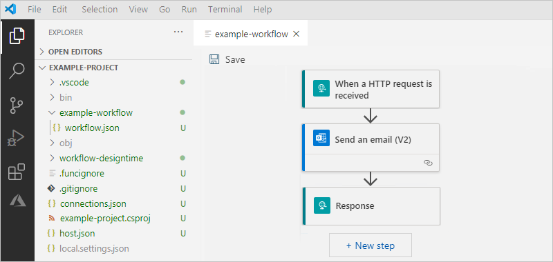

In Visual Studio Code, you can start by creating a project where you can *locally* build and run your logic app's workflows in your development environment by using the Azure Logic Apps (Preview) extension. While you can also start by [creating a new **Logic App (Preview)** resource in the Azure portal](create-stateful-stateless-workflows-azure-portal.md), both approaches provide the capability for you to deploy and run your logic app in the same kinds of hosting environments.

Meanwhile, you can still create the original logic app type. Although the development experiences in Visual Studio Code differ between the original and new logic app types, your Azure subscription can include both types. You can view and access all the deployed logic apps in your Azure subscription, but the apps are organized into their own categories and sections.

This article shows how to create your logic app and a workflow in Visual Studio Code by using the Azure Logic Apps (Preview) extension and performing these high-level tasks:

* Create a project for your logic app and workflow.

* Add a trigger and an action.

* Run, test, debug, and review run history locally.

* Find domain name details for firewall access.

* Deploy to Azure, which includes optionally enabling Application Insights.

* Manage your deployed logic app in Visual Studio Code and the Azure portal.

* Enable run history for stateless workflows.

* Enable or open the Application Insights after deployment.

* Deploy to a Docker container that you can run anywhere.

> [!NOTE]
> For information about current known issues, review the [Logic Apps Public Preview Known Issues page in GitHub](https://github.com/Azure/logicapps/blob/master/articles/logic-apps-public-preview-known-issues.md).

## Prerequisites

### Access and connectivity

* Access to the internet so that you can download the requirements, connect from Visual Studio Code to your Azure account, and publish from Visual Studio Code to Azure, a Docker container, or other environment.

* An Azure account and subscription. If you don't have a subscription, [sign up for a free Azure account](https://azure.microsoft.com/free/?WT.mc_id=A261C142F).

* To build the same example logic app in this article, you need an Office 365 Outlook email account that uses a Microsoft work or school account to sign in.

  If you choose to use a different [email connector that's supported by Azure Logic Apps](/connectors/), such as Outlook.com or [Gmail](../connectors/connectors-google-data-security-privacy-policy.md), you can still follow the example, and the general overall steps are the same, but your user interface and options might differ in some ways. For example, if you use the Outlook.com connector, use your personal Microsoft account instead to sign in.

<a name="storage-requirements"></a>

### Storage requirements

#### Windows

To locally build and run your logic app project in Visual Studio Code when using Windows, follow these steps to set up the Azure Storage Emulator:

1. Download and install [Azure Storage Emulator 5.10](https://go.microsoft.com/fwlink/p/?linkid=717179).

1. If you don't have one already, you need to have a local SQL DB installation, such as the free [SQL Server 2019 Express Edition](https://go.microsoft.com/fwlink/p/?linkid=866658), so that the emulator can run.

   For more information, see [Use the Azure Storage emulator for development and testing](../storage/common/storage-use-emulator.md).

1. Before you can run your project, make sure that you start the emulator.

   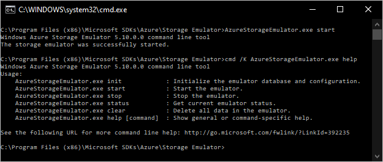

#### macOS and Linux

To locally build and run your logic app project in Visual Studio Code when using macOS or Linux, follow these steps to create and set up an Azure Storage account.

> [!NOTE]
> Currently, the designer in Visual Studio Code doesn't work on Linux OS, but you can still run build, run, and deploy 
> logic apps that use the Logic Apps Preview runtime to Linux-based virtual machines. For now, you can build your logic 
> apps in Visual Studio Code on Windows or macOS and then deploy to a Linux-based virtual machine.

1. Sign in to the [Azure portal](https://portal.azure.com), and [create an Azure Storage account](../storage/common/storage-account-create.md?tabs=azure-portal), which is a [prerequisite for Azure Functions](../azure-functions/storage-considerations.md).

1. On the storage account menu, under **Settings**, select **Access keys**.

1. On the **Access keys** pane, find and copy the storage account's connection string, which looks similar to this example:

   `DefaultEndpointsProtocol=https;AccountName=fabrikamstorageacct;AccountKey=<access-key>;EndpointSuffix=core.windows.net`

   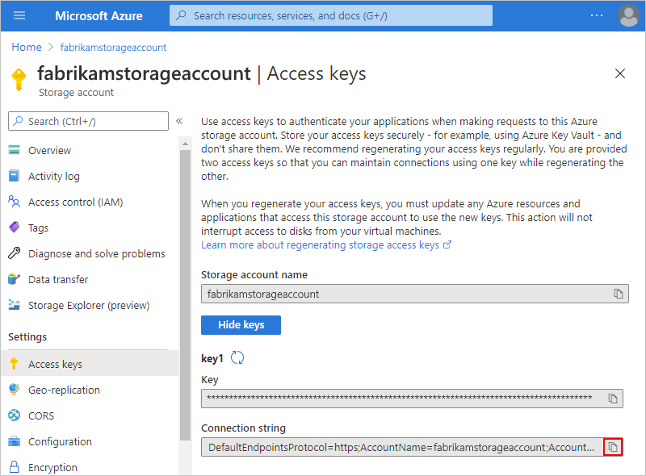

   For more information, review [Manage storage account keys](../storage/common/storage-account-keys-manage.md?tabs=azure-portal#view-account-access-keys).

1. Save the connection string somewhere safe. After you create your logic app project in Visual Studio Code, you have to add the string to the **local.settings.json** file in your project's root level folder.

   > [!IMPORTANT]
   > If you plan to deploy to a Docker container, you also need to use this connection string with the Docker file that you use for deployment. 
   > For production scenarios, make sure that you protect and secure such secrets and sensitive information, for example, by using a key vault.
  
### Tools

* [Visual Studio Code 1.30.1 (January 2019) or higher](https://code.visualstudio.com/), which is free. Also, download and install these tools for Visual Studio Code, if you don't have them already:

  * [Azure Account extension](https://marketplace.visualstudio.com/items?itemName=ms-vscode.azure-account), which provides a single common Azure sign-in and subscription filtering experience for all other Azure extensions in Visual Studio Code.

  * [C# for Visual Studio Code extension](https://marketplace.visualstudio.com/items?itemName=ms-vscode.csharp), which enables F5 functionality to run your logic app.

  * [Azure Functions Core Tools 3.0.3245 or later](https://github.com/Azure/azure-functions-core-tools/releases/tag/3.0.3245) by using the Microsoft Installer (MSI) version, which is `func-cli-3.0.3245-x*.msi`.

    These tools include a version of the same runtime that powers the Azure Functions runtime, which the Preview extension uses in Visual Studio Code.

    > [!IMPORTANT]
    > If you have an installation that's earlier than these versions, uninstall that version first, 
    > or make sure that the PATH environment variable points at the version that you download and install.

  * [Azure Logic Apps (Preview) extension for Visual Studio Code](https://go.microsoft.com/fwlink/p/?linkid=2143167). This extension provides the capability for you to create logic apps where you can build stateful and stateless workflows that locally run in Visual Studio Code and then deploy those logic apps directly to Azure or to Docker containers.

    Currently, you can have both the original Azure Logic Apps extension and the Public Preview extension installed in Visual Studio Code. Although the development experiences differ in some ways between the extensions, your Azure subscription can include both logic app types that you create with the extensions. Visual Studio Code shows all the deployed logic apps in your Azure subscription, but organizes them into different sections by extension names, **Logic Apps** and **Azure Logic Apps (Preview)**.

    > [!IMPORTANT]
    > If you created logic app projects with the earlier private preview extension, these projects won't work with the Public 
    > Preview extension. However, you can migrate these projects after you uninstall the private preview extension, delete the 
    > associated files, and install the public preview extension. You then create a new project in Visual Studio Code, and copy 
    > your previously created logic app's **workflow.definition** file into your new project. For more information, see 
    > [Migrate from the private preview extension](#migrate-private-preview).
    > 
    > If you created logic app projects with the earlier public preview extension, you can continue using those projects 
    > without any migration steps.

    **To install the **Azure Logic Apps (Preview)** extension, follow these steps:**

    1. In Visual Studio Code, on the left toolbar, select **Extensions**.

    1. In the extensions search box, enter `azure logic apps preview`. From the results list, select **Azure Logic Apps (Preview)** **>** **Install**.

       After the installation completes, the Preview extension appears in the **Extensions: Installed** list.

       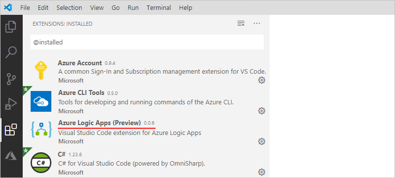

       > [!TIP]
       > If the extension doesn't appear in the installed list, try restarting Visual Studio Code.

* To use the [Inline Code Operations action](../logic-apps/logic-apps-add-run-inline-code.md) that runs JavaScript, install [Node.js versions 10.x.x, 11.x.x, or 12.x.x](https://nodejs.org/en/download/releases/).

  > [!TIP] 
  > For Windows, download the MSI version. If you use the ZIP version instead, you have to 
  > manually make Node.js available by using a PATH environment variable for your operating system.

* To locally run webhook-based triggers and actions, such as the [built-in HTTP Webhook trigger](../connectors/connectors-native-webhook.md), in Visual Studio Code, you need to [set up forwarding for the callback URL](#webhook-setup).

* To test the example logic app that you create in this article, you need a tool that can send calls to the Request trigger, which is the first step in example logic app. If you don't have such a tool, you can download, install, and use [Postman](https://www.postman.com/downloads/).

* If you create your logic app and deploy with settings that support using [Application Insights](../azure-monitor/app/app-insights-overview.md), you can optionally enable diagnostics logging and tracing for your logic app. You can do so either when you deploy your logic app from Visual Studio Code or after deployment. You need to have an Application Insights instance, but you can create this resource either [in advance](../azure-monitor/app/create-workspace-resource.md), when you deploy your logic app, or after deployment.

<a name="migrate-private-preview"></a>

## Migrate from private preview extension

Any logic app projects that you created with the **Azure Logic Apps (Private Preview)** extension won't work with the Public Preview extension. However, you can migrate these projects to new projects by following these steps:

1. Uninstall the private preview extension.

1. Delete any associated extension bundle and NuGet package folders in these locations:

   * The **Microsoft.Azure.Functions.ExtensionBundle.Workflows** folder, which contains previous extension bundles and is located along either path here:

     * `C:\Users\{userName}\AppData\Local\Temp\Functions\ExtensionBundles`

     * `C:\Users\{userName}\.azure-functions-core-tools\Functions\ExtensionBundles`

   * The **microsoft.azure.workflows.webjobs.extension** folder, which is the [NuGet](/nuget/what-is-nuget) cache for the private preview extension and is located along this path:

     `C:\Users\{userName}\.nuget\packages`

1. Install the **Azure Logic Apps (Preview)** extension.

1. Create a new project in Visual Studio Code.

1. Copy your previously created logic app's **workflow.definition** file to your new project.

<a name="set-up"></a>

## Set up Visual Studio Code

1. To make sure that all the extensions are correctly installed, reload or restart Visual Studio Code.

1. Confirm that Visual Studio Code automatically finds and installs extension updates so that your Preview extension gets the latest updates. Otherwise, you have to manually uninstall the outdated version and install the latest version.

   1. On the **File** menu, go to **Preferences** **>** **Settings**.

   1. On the **User** tab, go to **Features** **>** **Extensions**.

   1. Confirm that **Auto Check Updates** and **Auto Update** are selected.

Also, by default, the following settings are enabled and set for the Logic Apps preview extension:

* **Azure Logic Apps V2: Project Runtime**, which is set to version **~3**

  > [!NOTE]
  > This version is required to use the [Inline Code Operations actions](../logic-apps/logic-apps-add-run-inline-code.md).

* **Azure Logic Apps V2: Experimental View Manager**, which enables the latest designer in Visual Studio Code. If you experience problems on the designer, such as dragging and dropping items, turn off this setting.

To find and confirm these settings, follow these steps:

1. On the **File** menu, go to **Preferences** **>** **Settings**.

1. On the **User** tab, go to **>** **Extensions** **>** **Azure Logic Apps (Preview)**.

   For example, you can find the **Azure Logic Apps V2: Project Runtime** setting here or use the search box to find other settings:

   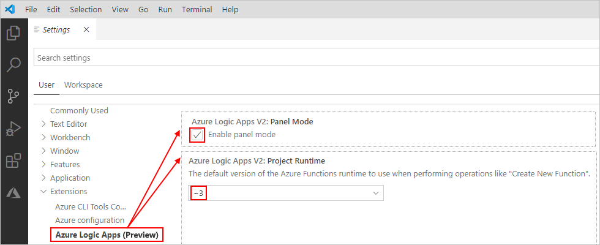

<a name="connect-azure-account"></a>

## Connect to your Azure account

1. On the Visual Studio Code Activity Bar, select the Azure icon.

   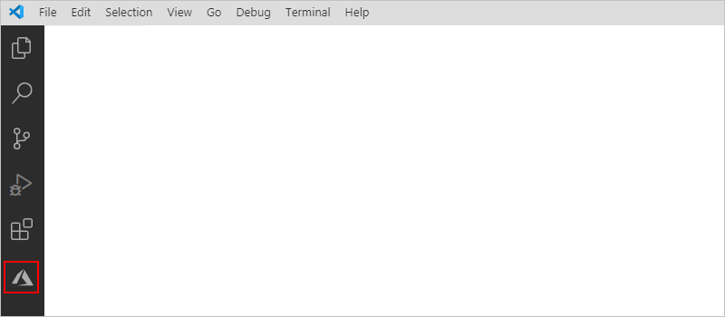

1. In the Azure pane, under **Azure: Logic Apps (Preview)**, select **Sign in to Azure**. When the Visual Studio Code authentication page appears, sign in with your Azure account.

   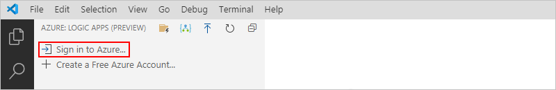

   After you sign in, the Azure pane shows the subscriptions in your Azure account. If you also have the publicly released extension, you can find any logic apps that you created with that extension in the **Logic Apps** section, not the **Logic Apps (Preview)** section.
   
   If the expected subscriptions don't appear, or you want the pane to show only specific subscriptions, follow these steps:

   1. In the subscriptions list, move your pointer next to the first subscription until the **Select Subscriptions** button (filter icon) appears. Select the filter icon.

      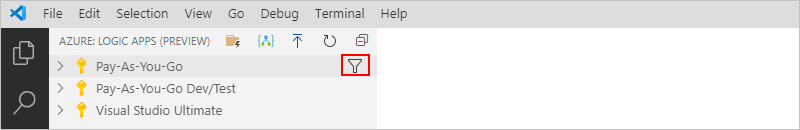

      Or, in the Visual Studio Code status bar, select your Azure account. 

   1. When another subscriptions list appears, select the subscriptions that you want, and then make sure that you select **OK**.

<a name="create-project"></a>

## Create a local project

Before you can create your logic app, create a local project so that you can manage, run, and deploy your logic app from Visual Studio Code. The underlying project is similar to an Azure Functions project, also known as a function app project. However, these project types are separate from each other, so logic apps and function apps can't exist in the same project.

1. On your computer, create an *empty* local folder to use for the project that you'll later create in Visual Studio Code.

1. In Visual Studio Code, close any and all open folders.

1. In the Azure pane, next to **Azure: Logic Apps (Preview)**, select **Create New Project** (icon that shows a folder and lightning bolt).

   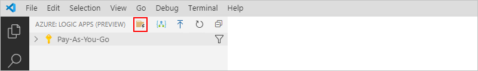

1. If Windows Defender Firewall prompts you to grant network access for `Code.exe`, which is Visual Studio Code, and for `func.exe`, which is the Azure Functions Core Tools, select **Private networks, such as my home or work network** **>** **Allow access**.

1. Browse to the location where you created your project folder, select that folder and continue.

   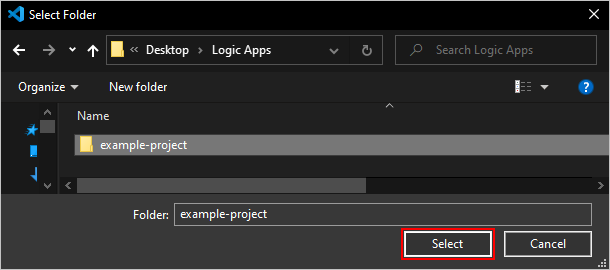

1. From the templates list that appears, select either **Stateful Workflow** or **Stateless Workflow**. This example selects **Stateful Workflow**.

   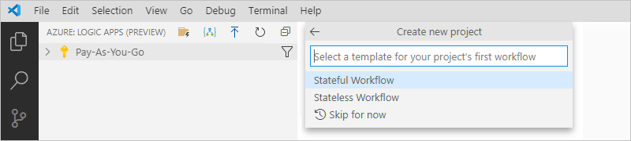

1. Provide a name for your workflow and press Enter. This example uses `Fabrikam-Stateful-Workflow` as the name.

   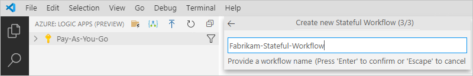

   Visual Studio Code finishes creating your project, and opens the **workflow.json** file for your workflow in the code editor.

   > [!NOTE]
   > If you're prompted to select how to open your project, select **Open in current window** 
   > if you want to open your project in the current Visual Studio Code window. To open a new 
   > instance for Visual Studio Code, select **Open in new window**.

1. From the Visual Studio toolbar, open the Explorer pane, if not already open.

   The Explorer pane shows your project, which now includes automatically generated project files. For example, the project has a folder that shows your workflow's name. Inside this folder, the **workflow.json** file contains your workflow's underlying JSON definition.

   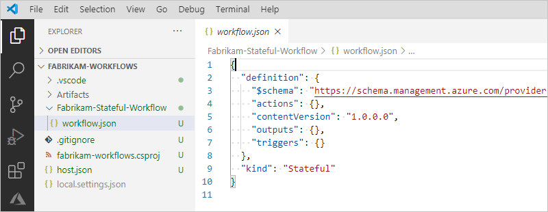

1. If you're using macOS or Linux, set up access to your storage account by following these steps, which are required for locally running your project:

   1. In your project's root folder, open the **local.settings.json** file.

      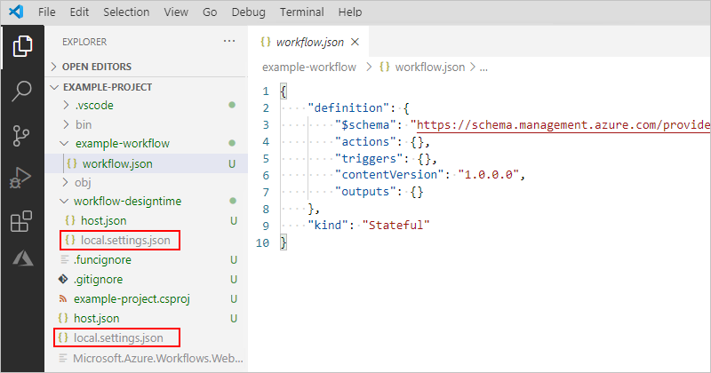

   1. Replace the `AzureWebJobsStorage` property value with the storage account's connection string that you saved earlier, for example:

      Before:

      ```json
      {
         "IsEncrypted": false,
         "Values": {
            "AzureWebJobsStorage": "UseDevelopmentStorage=true",
            "FUNCTIONS_WORKER_RUNTIME": "dotnet"
          }
      }
      ```

      After:

      ```json
      {
         "IsEncrypted": false,
         "Values": {
            "AzureWebJobsStorage": "DefaultEndpointsProtocol=https;AccountName=fabrikamstorageacct;AccountKey=<access-key>;EndpointSuffix=core.windows.net",
           "FUNCTIONS_WORKER_RUNTIME": "dotnet"
         }
      }
      ```

      > [!IMPORTANT]
      > For production scenarios, make sure that you protect and secure such secrets and sensitive information, for example, by using a key vault.

   1. When you're done, make sure that you save your changes.

<a name="enable-built-in-connector-authoring"></a>

## Enable built-in connector authoring

You can create your own built-in connectors for any service you need by using the [preview release's extensibility framework](https://techcommunity.microsoft.com/t5/integrations-on-azure/azure-logic-apps-running-anywhere-built-in-connector/ba-p/1921272). Similar to built-in connectors such as Azure Service Bus and SQL Server, these connectors provide higher throughput, low latency, local connectivity, and run natively in the same process as the preview runtime.

The authoring capability is currently available only in Visual Studio Code, but isn't enabled by default. To create these connectors, you need to first convert your project from extension bundle-based (Node.js) to NuGet package-based (.NET).

> [!IMPORTANT]
> This action is a one-way operation that you can't undo.

1. In the Explorer pane, at your project's root, move your mouse pointer over any blank area below all the other files and folders, open the shortcut menu, and select **Convert to Nuget-based Logic App project**.

   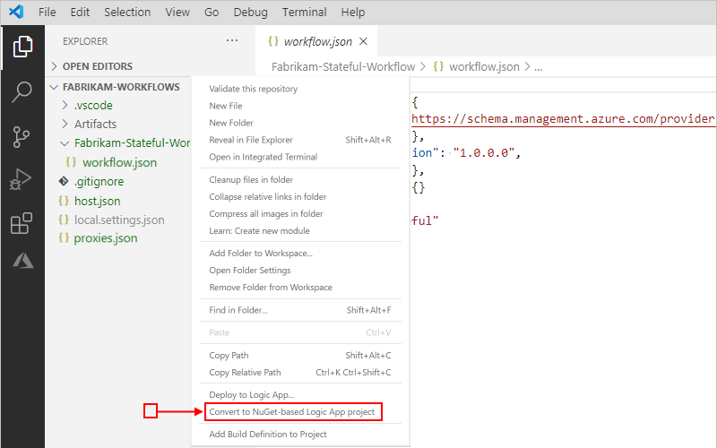

1. When the prompt appears, confirm the project conversion.

1. To continue, review and follow the steps in the article, [Azure Logic Apps Running Anywhere - Built-in connector extensibility](https://techcommunity.microsoft.com/t5/integrations-on-azure/azure-logic-apps-running-anywhere-built-in-connector/ba-p/1921272).

<a name="open-workflow-definition-designer"></a>

## Open the workflow definition file in the designer

1. Check the versions that are installed on your computer by running this command:

   `..\Users\{yourUserName}\dotnet --list-sdks`

   If you have .NET Core SDK 5.x, this version might prevent you from opening the logic app's underlying workflow definition in the designer. Rather than uninstall this version, at your project's root folder, create a **global.json** file that references the .NET Core runtime 3.x version that you have that's later than 3.1.201, for example:

   ```json
   {
      "sdk": {
         "version": "3.1.8",
         "rollForward": "disable"
      }
   }
   ```

   > [!IMPORTANT]
   > Make sure that you explicitly add the **global.json** file in your project's 
   > root folder from inside Visual Studio Code. Otherwise, the designer won't open.

1. Expand the project folder for your workflow. Open the **workflow.json** file's shortcut menu, and select **Open in Designer**.

   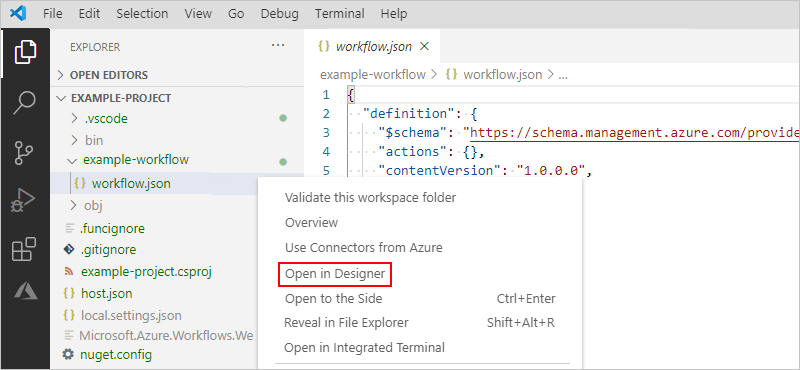

1. From the **Enable connectors in Azure** list, select **Use connectors from Azure**, which applies to all managed connectors that are available and deployed in Azure, not just connectors for Azure services.

   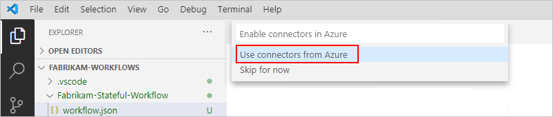

   > [!NOTE]
   > Stateless workflows currently support only *actions* for [managed connectors](../connectors/managed.md), 
   > which are deployed in Azure, and not triggers. Although you have the option to enable connectors in Azure for your stateless workflow, 
   > the designer doesn't show any managed connector triggers for you to select.

1. From the **Select subscription** list, select the Azure subscription to use for your logic app project.

   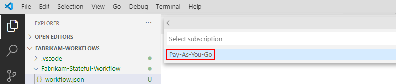

1. From the resource groups list, select **Create new resource group**.

   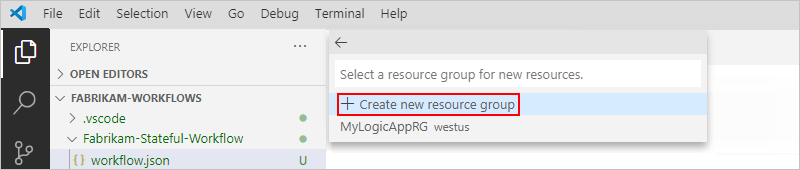

1. Provide a name for the resource group, and press Enter. This example uses `Fabrikam-Workflows-RG`.

   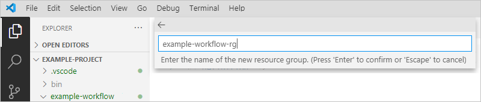

1. From the locations list, find and select the Azure region to use when creating your resource group and resources. This example uses **West Central US**.

   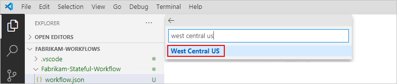

   After you perform this step, Visual Studio Code opens the workflow designer.

   > [!NOTE]
   > When Visual Studio Code starts the workflow design-time API, you might get a message 
   > that startup might take a few seconds. You can ignore this message or select **OK**.
   >
   > If the designer won't open, review the troubleshooting section, [Designer fails to open](#designer-fails-to-open).

   After the designer appears, the **Choose an operation** prompt appears on the designer and is selected by default, which shows the **Add an action** pane.

   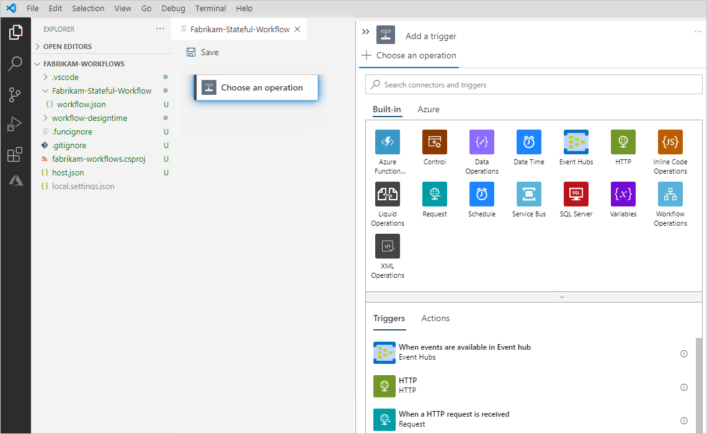

1. Next, [add a trigger and actions](#add-trigger-actions) to your workflow.

<a name="add-trigger-actions"></a>

## Add a trigger and actions

After you open the designer, the **Choose an operation** prompt appears on the designer and is selected by default. You can now start creating your workflow by adding a trigger and actions.

The workflow in this example uses this trigger and these actions:

* The built-in [Request trigger](../connectors/connectors-native-reqres.md), **When a HTTP request is received**, which receives inbound calls or requests and creates an endpoint that other services or logic apps can call.

* The [Office 365 Outlook action](../connectors/connectors-create-api-office365-outlook.md), **Send an email**.

* The built-in [Response action](../connectors/connectors-native-reqres.md), which you use to send a reply and return data back to the caller.

### Add the Request trigger

1. Next to the designer, in the **Add a trigger** pane, under the **Choose an operation** search box, make sure that **Built-in** is selected so that you can select a trigger that runs natively.

1. In the **Choose an operation** search box, enter `when a http request`, and select the built-in Request trigger that's named **When a HTTP request is received**.

   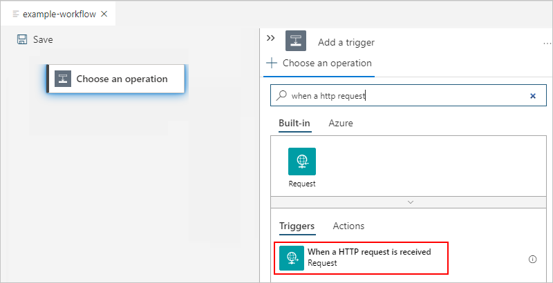

   When the trigger appears on the designer, the trigger's details pane opens to show the trigger's properties, settings, and other actions.

   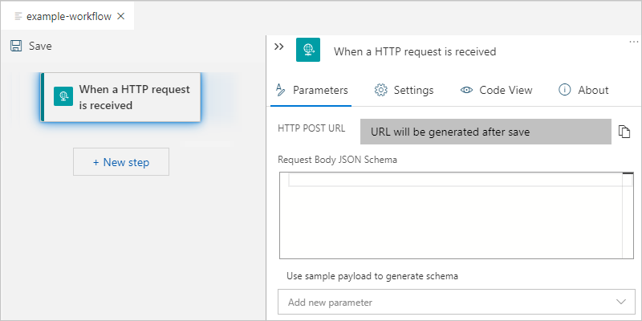

   > [!TIP]
   > If the details pane doesn't appear, makes sure that the trigger is selected on the designer.

1. If you need to delete an item from the designer, [follow these steps for deleting items from the designer](#delete-from-designer).

### Add the Office 365 Outlook action

1. On the designer, under the trigger that you added, select **New step**.

   The **Choose an operation** prompt appears on the designer, and the **Add an action** pane reopens so that you can select the next action.

1. On the **Add an action** pane, under the **Choose an operation** search box, select **Azure** so that you can find and select an action for a managed connector that's deployed in Azure.

   This example selects and uses the Office 365 Outlook action, **Send an email (V2)**.

   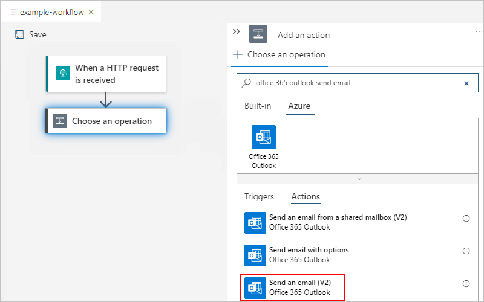

1. In the action's details pane, select **Sign in** so that you can create a connection to your email account.

   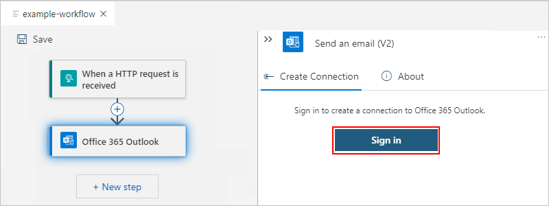

1. When Visual Studio Code prompts you for consent to access your email account, select **Open**.

   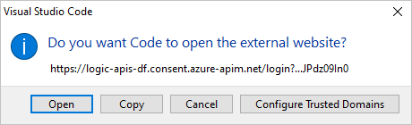

   > [!TIP]
   > To prevent future prompts, select **Configure Trusted Domains** 
   > so that you can add the authentication page as a trusted domain.

1. Follow the subsequent prompts to sign in, allow access, and allow returning to Visual Studio Code.

   > [!NOTE]
   > If too much time passes before you complete the prompts, the authentication process times out and fails. 
   > In this case, return to the designer and retry signing in to create the connection.

1. When the Azure Logic Apps (Preview) extension prompts you for consent to access your email account, select **Open**. Follow the subsequent prompt to allow access.

   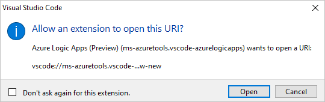

   > [!TIP]
   > To prevent future prompts, select **Don't ask again for this extension**.

   After Visual Studio Code creates your connection, some connectors show the message that `The connection will be valid for {n} days only`. This time limit applies only to the duration while you author your logic app in Visual Studio Code. After deployment, this limit no longer applies because your logic app can authenticate at runtime by using its automatically enabled [system-assigned managed identity](../logic-apps/create-managed-service-identity.md). This managed identity differs from the authentication credentials or connection string that you use when you create a connection. If you disable this system-assigned managed identity, connections won't work at runtime.

1. On the designer, if the **Send an email** action doesn't appear selected, select that action.

1. On the action's details pane, on the **Parameters** tab, provide the required information for the action, for example:

   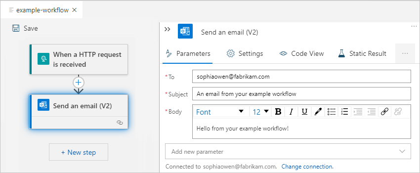

   | Property | Required | Value | Description |
   |----------|----------|-------|-------------|
   | **To** | Yes | <*your-email-address*> | The email recipient, which can be your email address for test purposes. This example uses the fictitious email, `sophiaowen@fabrikam.com`. |
   | **Subject** | Yes | `An email from your example workflow` | The email subject |
   | **Body** | Yes | `Hello from your example workflow!` | The email body content |
   ||||

   > [!NOTE]
   > If you want to make any changes in the details pane on the **Settings**, **Static Result**, or **Run After** tab, 
   > make sure that you select **Done** to commit those changes before you switch tabs or change focus to the designer. 
   > Otherwise, Visual Studio Code won't keep your changes. For more information, review the 
   > [Logic Apps Public Preview Known Issues page in GitHub](https://github.com/Azure/logicapps/blob/master/articles/logic-apps-public-preview-known-issues.md).

1. On the designer, select **Save**.

> [!IMPORTANT]
> To locally run a workflow that uses a webhook-based trigger or actions, such as the 
> [built-in HTTP Webhook trigger or action](../connectors/connectors-native-webhook.md), 
> you must enable this capability by [setting up forwarding for the webhook's callback URL](#webhook-setup).

<a name="webhook-setup"></a>

## Enable locally running webhooks

When you use a webhook-based trigger or action, such as **HTTP Webhook**, with a logic app running in Azure, the Logic Apps runtime subscribes to the service endpoint by generating and registering a callback URL with that endpoint. The trigger or action then waits for the service endpoint to call the URL. However, when you're working in Visual Studio Code, the generated callback URL starts with `http://localhost:7071/...`. This URL is for your localhost server, which is private so the service endpoint can't call this URL.

To locally run webhook-based triggers and actions in Visual Studio Code, you need to set up a public URL that exposes your localhost server and securely forwards calls from the service endpoint to the webhook callback URL. You can use a forwarding service and tool such as [**ngrok**](https://ngrok.com/), which opens an HTTP tunnel to your localhost port, or you can use your own tool.

#### Set up call forwarding using **ngrok**

1. [Sign up for an **ngrok** account](https://dashboard.ngrok.com/signup) if you don't have one. Otherwise, [sign in to your account](https://dashboard.ngrok.com/login).

1. Get your personal authentication token, which your **ngrok** client needs to connect and authenticate access to your account.

   1. To find your [authentication token page](https://dashboard.ngrok.com/auth/your-authtoken), on your account dashboard menu, expand **Authentication**, and select **Your Authtoken**.

   1. From the **Your Authtoken** box, copy the token to a safe location.

1. From the [**ngrok** download page](https://ngrok.com/download) or [your account dashboard](https://dashboard.ngrok.com/get-started/setup), download the **ngrok** version that you want, and extract the .zip file. For more information, see [Step 1: Unzip to install](https://ngrok.com/download).

1. On your computer, open your command prompt tool. Browse to the location where you have the **ngrok.exe** file.

1. Connect the **ngrok** client to your **ngrok** account by running the following command. For more information, see [Step 2: Connect your account](https://ngrok.com/download).

   `ngrok authtoken <your_auth_token>`

1. Open the HTTP tunnel to localhost port 7071 by running the following command. For more information, see [Step 3: Fire it up](https://ngrok.com/download).

   `ngrok http 7071`

1. From the output, find the following line:

   `http://<domain>.ngrok.io -> http://localhost:7071`

1. Copy and save the URL that has this format: `http://<domain>.ngrok.io`

#### Set up the forwarding URL in your app settings

1. In Visual Studio Code, on the designer, add the **HTTP + Webhook** trigger or action.

1. When the prompt appears for the host endpoint location, enter the forwarding (redirection) URL that you previously created.

   > [!NOTE]
   > Ignoring the prompt causes a warning to appear that you must provide the forwarding URL, 
   > so select **Configure**, and enter the URL. After you finish this step, the prompt won't 
   > reappear for subsequent webhook triggers or actions that you might add.
   >
   > To make the prompt reappear, at your project's root level, open the **local.settings.json** 
   > file's shortcut menu, and select **Configure Webhook Redirect Endpoint**. The prompt now 
   > appears so you can provide the forwarding URL.

   Visual Studio Code adds the forwarding URL to the **local.settings.json** file in your project's root folder. In the `Values` object, the property named `Workflows.WebhookRedirectHostUri` now appears and is set to the forwarding URL, for example:
   
   ```json
   {
      "IsEncrypted": false,
      "Values": {
         "AzureWebJobsStorage": "UseDevelopmentStorage=true",
         "FUNCTIONS_WORKER_RUNTIME": "node",
         "FUNCTIONS_V2_COMPATIBILITY_MODE": "true",
         <...>
         "Workflows.WebhookRedirectHostUri": "http://xxxXXXXxxxXXX.ngrok.io",
         <...>
      }
   }
   ```

The first time when you start a local debugging session or run the workflow without debugging, the Logic Apps runtime registers the workflow with the service endpoint and subscribes to that endpoint for notifying the webhook operations. The next time that your workflow runs, the runtime won't register or resubscribe because the subscription registration already exists in local storage.

When you stop the debugging session for a workflow run that uses locally run webhook-based triggers or actions, the existing subscription registrations aren't deleted. To unregister, you have to manually remove or delete the subscription registrations.

> [!NOTE]
> After your workflow starts running, the terminal window might show errors like this example:
>
> `message='Http request failed with unhandled exception of type 'InvalidOperationException' and message: 'System.InvalidOperationException: Synchronous operations are disallowed. Call ReadAsync or set AllowSynchronousIO to true instead.`
>
> In this case, open the **local.settings.json** file in your project's root folder, and make sure that the property is set to `true`:
>
> `"FUNCTIONS_V2_COMPATIBILITY_MODE": "true"`

<a name="manage-breakpoints"></a>

## Manage breakpoints for debugging

Before you run and test your logic app workflow by starting a debugging session, you can set [breakpoints](https://code.visualstudio.com/docs/editor/debugging#_breakpoints) inside the **workflow.json** file for each workflow. No other setup is required. 

At this time, breakpoints are supported only for actions, not triggers. Each action definition has these breakpoint locations:

* Set the starting breakpoint on the line that shows the action's name. When this breakpoint hits during the debugging session, you can review the action's inputs before they're evaluated.

* Set the ending breakpoint on the line that shows the action's closing curly brace (**}**). When this breakpoint hits during the debugging session, you can review the action's results before the action finishes running.

To add a breakpoint, follow these steps:

1. Open the **workflow.json** file for the workflow that you want to debug.

1. On the line where you want to set the breakpoint, in the left column, select inside that column. To remove the breakpoint, select that breakpoint.

   When you start your debugging session, the Run view appears on the left side of the code window, while the Debug toolbar appears near the top.

   > [!NOTE]
   > If the Run view doesn't automatically appear, press Ctrl+Shift+D.

1. To review the available information when a breakpoint hits, in the Run view, examine the **Variables** pane.

1. To continue workflow execution, on the Debug toolbar, select **Continue** (play button).

You can add and remove breakpoints at any time during the workflow run. However, if you update the **workflow.json** file after the run starts, breakpoints don't automatically update. To update the breakpoints, restart the logic app.

For general information, see [Breakpoints - Visual Studio Code](https://code.visualstudio.com/docs/editor/debugging#_breakpoints).

<a name="run-test-debug-locally"></a>

## Run, test, and debug locally

To test your logic app, follow these steps to start a debugging session, and find the URL for the endpoint that's created by the Request trigger. You need this URL so that you can later send a request to that endpoint.

1. To debug a stateless workflow more easily, you can [enable the run history for that workflow](#enable-run-history-stateless).

1. On the Visual Studio Code Activity Bar, open the **Run** menu, and select **Start Debugging** (F5).

   The **Terminal** window opens so that you can review the debugging session.

   > [!NOTE]
   > If you get the error, **"Error exists after running preLaunchTask 'generateDebugSymbols'"**, 
   > see the troubleshooting section, [Debugging session fails to start](#debugging-fails-to-start).

1. Now, find the callback URL for the endpoint on the Request trigger.

   1. Reopen the Explorer pane so that you can view your project.

   1. From the **workflow.json** file's shortcut menu, select **Overview**.

      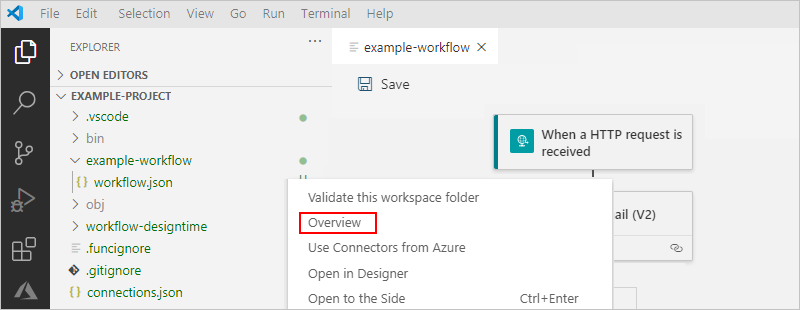

   1. Find the **Callback URL** value, which looks similar to this URL for the example Request trigger:

      `http://localhost:7071/api/<workflow-name>/triggers/manual/invoke?api-version=2020-05-01-preview&sp=%2Ftriggers%2Fmanual%2Frun&sv=1.0&sig=<shared-access-signature>`

      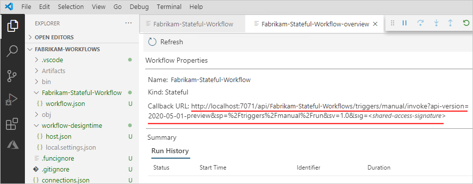

1. To test the callback URL by triggering the logic app workflow, open [Postman](https://www.postman.com/downloads/) or your preferred tool for creating and sending requests.

   This example continues by using Postman. For more information, see [Postman Getting Started](https://learning.postman.com/docs/getting-started/introduction/).

   1. On the Postman toolbar, select **New**.

      

   1. On the **Create New** pane, under **Building Blocks**, select **Request**.

   1. In the **Save Request** window, under **Request name**, provide a name for the request, for example, `Test workflow trigger`.

   1. Under **Select a collection or folder to save to**, select **Create Collection**.

   1. Under **All Collections**, provide a name for the collection to create for organizing your requests, press Enter, and select **Save to <*collection-name*>**. This example uses `Logic Apps requests` as the collection name.

      Postman's request pane opens so that you can send a request to the callback URL for the Request trigger.

      

   1. Return to Visual Studio Code. from the workflow's overview page, copy the **Callback URL** property value.

   1. Return to Postman. On the request pane, next the method list, which currently shows **GET** as the default request method, paste the callback URL that you previously copied in the address box, and select **Send**.

      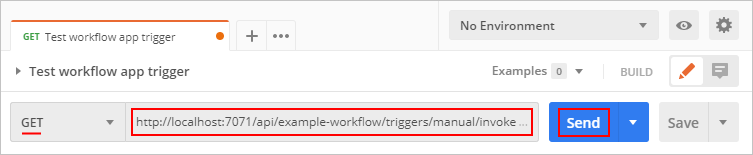

      The example logic app workflow sends an email that appears similar to this example:

      

1. In Visual Studio Code, return to your workflow's overview page.

   If you created a stateful workflow, after the request that you sent triggers the workflow, the overview page shows the workflow's run status and history.

   > [!TIP]
   > If the run status doesn't appear, try refreshing the overview page by selecting **Refresh**. 
   > No run happens for a trigger that's skipped due to unmet criteria or finding no data.

   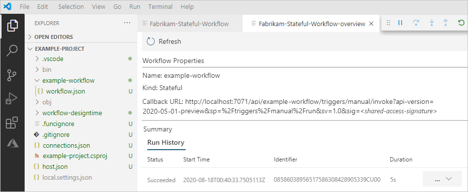

   | Run status | Description |
   |------------|-------------|
   | **Aborted** | The run stopped or didn't finish due to external problems, for example, a system outage or lapsed Azure subscription. |
   | **Cancelled** | The run was triggered and started but received a cancellation request. |
   | **Failed** | At least one action in the run failed. No subsequent actions in the workflow were set up to handle the failure. |
   | **Running** | The run was triggered and is in progress, but this status can also appear for a run that is throttled due to [action limits](logic-apps-limits-and-config.md) or the [current pricing plan](https://azure.microsoft.com/pricing/details/logic-apps/). <p><p>**Tip**: If you set up [diagnostics logging](monitor-logic-apps-log-analytics.md), you can get information about any throttle events that happen. |
   | **Succeeded** | The run succeeded. If any action failed, a subsequent action in the workflow handled that failure. |
   | **Timed out** | The run timed out because the current duration exceeded the run duration limit, which is controlled by the [**Run history retention in days** setting](logic-apps-limits-and-config.md#run-duration-retention-limits). A run's duration is calculated by using the run's start time and run duration limit at that start time. <p><p>**Note**: If the run's duration also exceeds the current *run history retention limit*, which is also controlled by the [**Run history retention in days** setting](logic-apps-limits-and-config.md#run-duration-retention-limits), the run is cleared from the runs history by a daily cleanup job. Whether the run times out or completes, the retention period is always calculated by using the run's start time and *current* retention limit. So, if you reduce the duration limit for an in-flight run, the run times out. However, the run either stays or is cleared from the runs history based on whether the run's duration exceeded the retention limit. |
   | **Waiting** | The run hasn't started or is paused, for example, due to an earlier workflow instance that's still running. |
   |||

1. To review the statuses for each step in a specific run and the step's inputs and outputs, select the ellipses (**...**) button for that run, and select **Show Run**.

   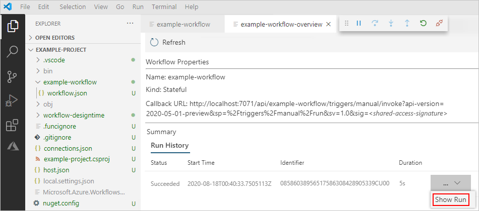

   Visual Studio Code opens the monitoring view and shows the status for each step in the run.

   

   > [!NOTE]
   > If a run failed and a step in monitoring view shows the `400 Bad Request` error, this problem might result 
   > from a longer trigger name or action name that causes the underlying Uniform Resource Identifier (URI) to exceed 
   > the default character limit. For more information, see ["400 Bad Request"](#400-bad-request).

   Here are the possible statuses that each step in the workflow can have:

   | Action status | Icon | Description |
   |---------------|------|-------------|
   | **Aborted** | ![Icon for "Aborted" action status][aborted-icon] | The action stopped or didn't finish due to external problems, for example, a system outage or lapsed Azure subscription. |
   | **Cancelled** | ![Icon for "Cancelled" action status][cancelled-icon] | The action was running but received a request to cancel. |
   | **Failed** | ![Icon for "Failed" action status][failed-icon] | The action failed. |
   | **Running** | ![Icon for "Running" action status][running-icon] | The action is currently running. |
   | **Skipped** | ![Icon for "Skipped" action status][skipped-icon] | The action was skipped because the immediately preceding action failed. An action has a `runAfter` condition that requires that the preceding action finishes successfully before the current action can run. |
   | **Succeeded** | ![Icon for "Succeeded" action status][succeeded-icon] | The action succeeded. |
   | **Succeeded with retries** | ![Icon for "Succeeded with retries" action status][succeeded-with-retries-icon] | The action succeeded but only after one or more retries. To review the retry history, in the run history details view, select that action so that you can view the inputs and outputs. |
   | **Timed out** | ![Icon for "Timed out" action status][timed-out-icon] | The action stopped due to the timeout limit specified by that action's settings. |
   | **Waiting** | ![Icon for "Waiting" action status][waiting-icon] | Applies to a webhook action that's waiting for an inbound request from a caller. |
   ||||

   [aborted-icon]: ./media/create-stateful-stateless-workflows-visual-studio-code/aborted.png
   [cancelled-icon]: ./media/create-stateful-stateless-workflows-visual-studio-code/cancelled.png
   [failed-icon]: ./media/create-stateful-stateless-workflows-visual-studio-code/failed.png
   [running-icon]: ./media/create-stateful-stateless-workflows-visual-studio-code/running.png
   [skipped-icon]: ./media/create-stateful-stateless-workflows-visual-studio-code/skipped.png
   [succeeded-icon]: ./media/create-stateful-stateless-workflows-visual-studio-code/succeeded.png
   [succeeded-with-retries-icon]: ./media/create-stateful-stateless-workflows-visual-studio-code/succeeded-with-retries.png
   [timed-out-icon]: ./media/create-stateful-stateless-workflows-visual-studio-code/timed-out.png
   [waiting-icon]: ./media/create-stateful-stateless-workflows-visual-studio-code/waiting.png

1. To review the inputs and outputs for each step, select the step that you want to inspect.

   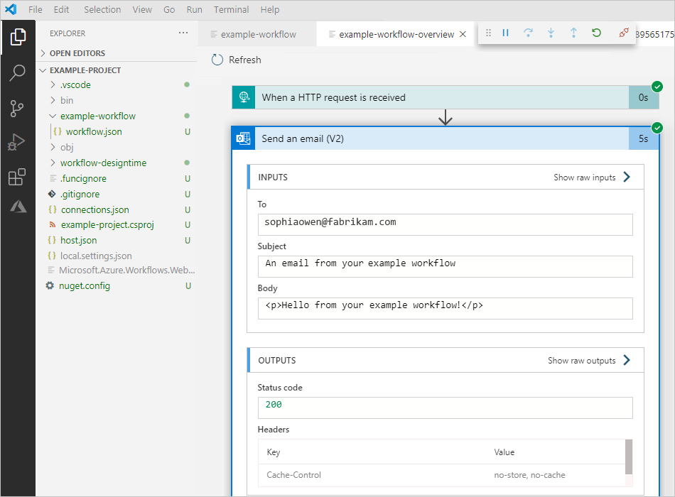

1. To further review the raw inputs and outputs for that step, select **Show raw inputs** or **Show raw outputs**.

1. To stop the debugging session, on the **Run** menu, select **Stop Debugging** (Shift + F5).

<a name="return-response"></a>

## Return a response

To return a response to the caller that sent a request to your logic app, you can use the built-in [Response action](../connectors/connectors-native-reqres.md) for a workflow that starts with the Request trigger.

1. On the workflow designer, under the **Send an email** action, select **New step**.

   The **Choose an operation** prompt appears on the designer, and the **Add an action pane** reopens so that you can select the next action.

1. On the **Add an action** pane, under the **Choose an action** search box, make sure that **Built-in** is selected. In the search box, enter `response`, and select the **Response** action.

   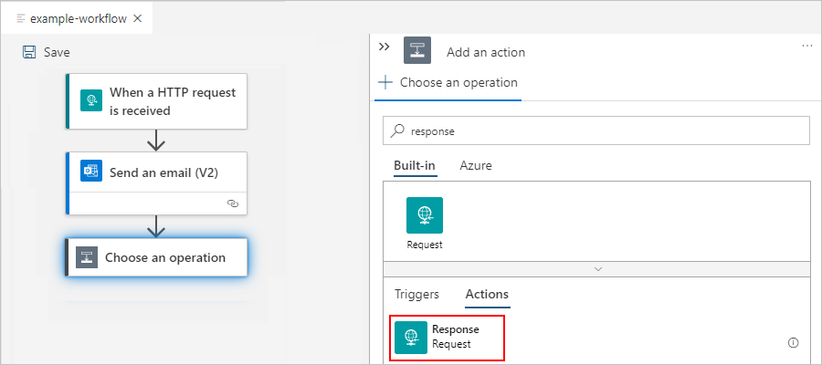

   When the **Response** action appears on the designer, the action's details pane automatically opens.

   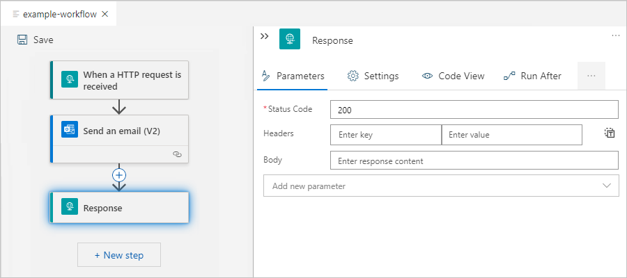

1. On the **Parameters** tab, provide the required information for the function that you want to call.

   This example returns the **Body** property value that's output from the **Send an email** action.

   1. Click inside the **Body** property box so that the dynamic content list appears and shows the available output values from the preceding trigger and actions in the workflow.

      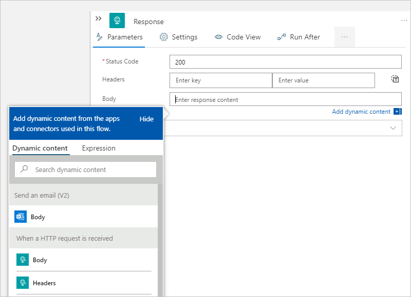

   1. In the dynamic content list, under **Send an email**, select **Body**.

      

      When you're done, the Response action's **Body** property is now set to the **Send an email** action's **Body** output value.

      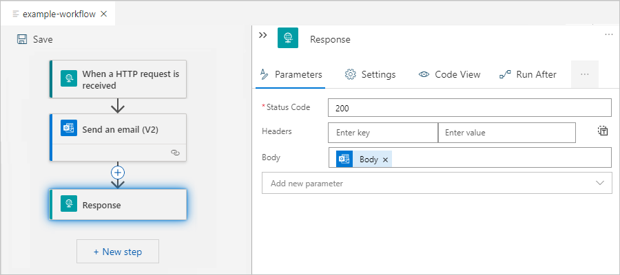

1. On the designer, select **Save**.

<a name="retest-workflow"></a>

## Retest your logic app

After you make updates to your logic app, you can run another test by rerunning the debugger in Visual Studio and sending another request to trigger your updated logic app, similar to the steps in [Run, test, and debug locally](#run-test-debug-locally).

1. On the Visual Studio Code Activity Bar, open the **Run** menu, and select **Start Debugging** (F5).

1. In Postman or your tool for creating and sending requests, send another request to trigger your workflow.

1. If you created a stateful workflow, on the workflow's overview page, check the status for the most recent run. To view the status, inputs, and outputs for each step in that run, select the ellipses (**...**) button for that run, and select **Show Run**.

   For example, here's the step-by-step status for a run after the sample workflow was updated with the Response action.

   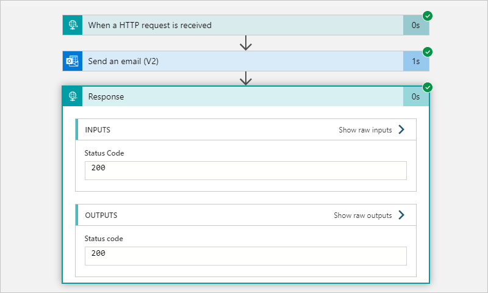

1. To stop the debugging session, on the **Run** menu, select **Stop Debugging** (Shift + F5).

<a name="firewall-setup"></a>

##  Find domain names for firewall access

Before you deploy and run your logic app workflow in the Azure portal, if your environment has strict network requirements or firewalls that limit traffic, you have to set up permissions for any trigger or action connections that exist in your workflow.

To find the fully qualified domain names (FQDNs) for these connections, follow these steps:

1. In your logic app project, open the **connections.json** file, which is created after you add the first connection-based trigger or action to your workflow, and find the `managedApiConnections` object.

1. For each connection that you created, find, copy, and save the `connectionRuntimeUrl` property value somewhere safe so that you can set up your firewall with this information.

   This example **connections.json** file contains two connections, an AS2 connection and an Office 365 connection with these `connectionRuntimeUrl` values:

   * AS2: `"connectionRuntimeUrl": https://9d51d1ffc9f77572.00.common.logic-{Azure-region}.azure-apihub.net/apim/as2/11d3fec26c87435a80737460c85f42ba`

   * Office 365: `"connectionRuntimeUrl": https://9d51d1ffc9f77572.00.common.logic-{Azure-region}.azure-apihub.net/apim/office365/668073340efe481192096ac27e7d467f`

   ```json
   {
      "managedApiConnections": {
         "as2": {
            "api": {
               "id": "/subscriptions/{Azure-subscription-ID}/providers/Microsoft.Web/locations/{Azure-region}/managedApis/as2"
            },
            "connection": {
               "id": "/subscriptions/{Azure-subscription-ID}/resourceGroups/{Azure-resource-group}/providers/Microsoft.Web/connections/{connection-resource-name}"
            },
            "connectionRuntimeUrl": https://9d51d1ffc9f77572.00.common.logic-{Azure-region}.azure-apihub.net/apim/as2/11d3fec26c87435a80737460c85f42ba,
            "authentication": {
               "type":"ManagedServiceIdentity"
            }
         },
         "office365": {
            "api": {
               "id": "/subscriptions/{Azure-subscription-ID}/providers/Microsoft.Web/locations/{Azure-region}/managedApis/office365"
            },
            "connection": {
               "id": "/subscriptions/{Azure-subscription-ID}/resourceGroups/{Azure-resource-group}/providers/Microsoft.Web/connections/{connection-resource-name}"
            },
            "connectionRuntimeUrl": https://9d51d1ffc9f77572.00.common.logic-{Azure-region}.azure-apihub.net/apim/office365/668073340efe481192096ac27e7d467f,
            "authentication": {
               "type":"ManagedServiceIdentity"
            }
         }
      }
   }
   ```

<a name="deploy-azure"></a>

## Deploy to Azure

From Visual Studio Code, you can directly publish your project to Azure, which deploys your logic app using the new **Logic App (Preview)** resource type. Similar to the function app resource in Azure Functions, deployment for this new resource type requires that you select a [hosting plan and pricing tier](../app-service/overview-hosting-plans.md), which you can set up during deployment. For more information about hosting plans and pricing, review these topics:

* [Scale up an in Azure App Service](../app-service/manage-scale-up.md)
* [Azure Functions scale and hosting](../azure-functions/functions-scale.md)

You can publish your logic app as a new resource, which automatically creates any necessary resources, such as an [Azure Storage account, similar to function app requirements](../azure-functions/storage-considerations.md). Or, you can publish your logic app to a previously deployed **Logic App (Preview)** resource, which overwrites that logic app.

### Publish to a new Logic App (Preview) resource

1. On the Visual Studio Code Activity Bar, select the Azure icon.

1. On the **Azure: Logic Apps (Preview)** pane toolbar, select **Deploy to Logic App**.

   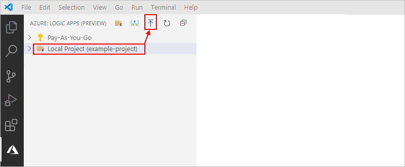

1. If prompted, select the Azure subscription to use for your logic app deployment.

1. From the list that Visual Studio Code opens, select from these options:

   * **Create new Logic App (Preview) in Azure** (quick)
   * **Create new Logic App (Preview) in Azure Advanced**
   * A previously deployed **Logic App (Preview)** resource, if any exist

   This example continues with **Create new Logic App (Preview) in Azure Advanced**.

   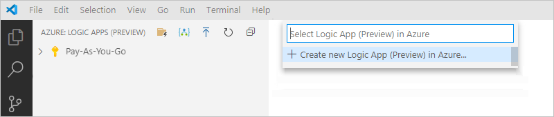

1. To create your new **Logic App (Preview)** resource, follow these steps:

   1. Provide a globally unique name for your new logic app, which is the name to use for the **Logic App (Preview)** resource. This example uses `Fabrikam-Workflows-App`.

      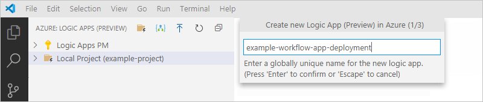

   1. Select a [hosting plan](../app-service/overview-hosting-plans.md) for your new logic app, either [**App Service Plan** (Dedicated)](../azure-functions/dedicated-plan.md) or [**Premium**](../azure-functions/functions-premium-plan.md).

      > [!IMPORTANT]
      > Consumption plans aren't supported nor available for this resource type. Your selected plan affects the 
      > capabilities and pricing tiers that are later available to you. For more information, review these topics: 
      >
      > * [Azure Functions scale and hosting](../azure-functions/functions-scale.md)
      > * [App Service pricing details](https://azure.microsoft.com/pricing/details/app-service/)
      >
      > For example, the Premium plan provides access to networking capabilities, such as connect and integrate 
      > privately with Azure virtual networks, similar to Azure Functions when you create and deploy your logic apps. 
      > For more information, review these topics:
      > 
      > * [Azure Functions networking options](../azure-functions/functions-networking-options.md)
      > * [Azure Logic Apps Running Anywhere - Networking possibilities with Azure Logic Apps Preview](https://techcommunity.microsoft.com/t5/integrations-on-azure/logic-apps-anywhere-networking-possibilities-with-logic-app/ba-p/2105047)

      This example uses the **App Service Plan**.

      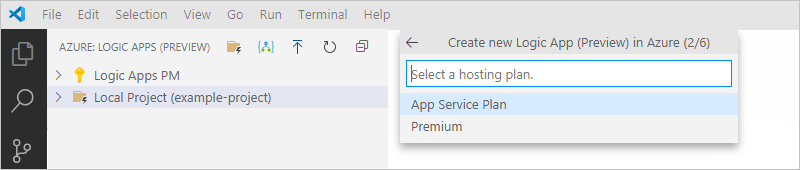

   1. Create a new App Service plan or select an existing plan. This example selects **Create new App Service Plan**.

      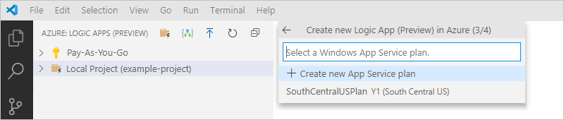

   1. Provide a name for your App Service plan, and then select a [pricing tier](../app-service/overview-hosting-plans.md) for the plan. This example selects the **F1 Free** plan.

      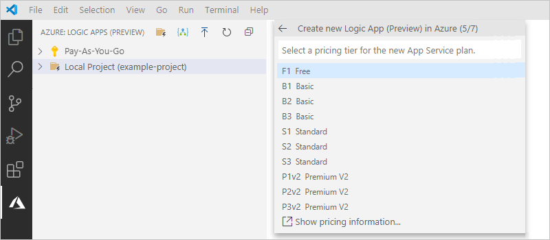

   1. For optimal performance, find and select the same resource group as your project for the deployment.

      > [!NOTE]
      > Although you can create or use a different resource group, doing so might affect performance. 
      > If you create or choose a different resource group, but cancel after the confirmation prompt appears, 
      > your deployment is also canceled.

   1. For stateful workflows, select **Create new storage account** or an existing storage account.

      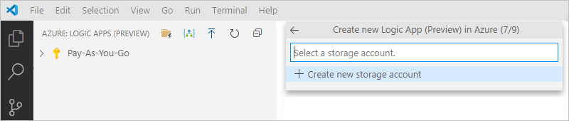

   1. If your logic app's creation and deployment settings support using [Application Insights](../azure-monitor/app/app-insights-overview.md), you can optionally enable diagnostics logging and tracing for your logic app. You can do so either when you deploy your logic app from Visual Studio Code or after deployment. You need to have an Application Insights instance, but you can create this resource either [in advance](../azure-monitor/app/create-workspace-resource.md), when you deploy your logic app, or after deployment.

      To enable logging and tracing now, follow these steps:

      1. Select either an existing Application Insights resource or **Create new Application Insights resource**.

      1. In the [Azure portal](https://portal.azure.com), go to your Application Insights resource.

      1. On the resource menu, select **Overview**. Find and copy the **Instrumentation Key** value.

      1. In Visual Studio Code, in your project's root folder, open the **local.settings.json** file.

      1. In the `Values` object, add the `APPINSIGHTS_INSTRUMENTATIONKEY` property, and set the value to the instrumentation key, for example:

         ```json
         {
            "IsEncrypted": false,
            "Values": {
               "AzureWebJobsStorage": "UseDevelopmentStorage=true",
               "FUNCTIONS_WORKER_RUNTIME": "dotnet",
               "APPINSIGHTS_INSTRUMENTATIONKEY": <instrumentation-key>
            }
         }
         ```

         > [!TIP]
         > You can check whether the trigger and action names correctly appear in your Application Insights instance.
         >
         > 1. In the Azure portal, go to your Application Insights resource.
         >
         > 2. On the resource resource menu, under **Investigate**, select **Application map**.
         >
         > 3. Review the operation names that appear in the map.
         >
         > Some inbound requests from built-in triggers might appear as duplicates in the Application Map. 
         > Rather than use the `WorkflowName.ActionName` format, these duplicates use the workflow name as 
         > the operation name and originate from the Azure Functions host.

      1. Next, you can optionally adjust the severity level for the tracing data that your logic app collects and sends to your Application Insights instance.

         Each time that a workflow-related event happens, such as when a workflow is triggered or when an action runs, the runtime emits various traces. These traces cover the workflow's lifetime and include, but aren't limited to, the following event types:

         * Service activity, such as start, stop, and errors.
         * Jobs and dispatcher activity.
         * Workflow activity, such as trigger, action, and run.
         * Storage request activity, such as success or failure.
         * HTTP request activity, such as inbound, outbound, success, and failure.
         * Any development traces, such as debug messages.

         Each event type is assigned to a severity level. For example, the `Trace` level captures the most detailed messages, while the `Information` level captures general activity in your workflow, such as when your logic app, workflow, trigger, and actions start and stop. This table describes the severity levels and their trace types:

         | Severity level | Trace type |
         |----------------|------------|
         | Critical | Logs that describe an unrecoverable failure in your logic app. |
         | Debug | Logs that you can use for investigation during development, for example, inbound and outbound HTTP calls. |
         | Error | Logs that indicate a failure in workflow execution, but not a general failure in your logic app. |
         | Information | Logs that track the general activity in your logic app or workflow, for example: <p><p>- When a trigger, action, or run starts and ends. <br>- When your logic app starts or ends. |
         | Trace | Logs that contain the most detailed messages, for example, storage requests or dispatcher activity, plus all the messages that are related to workflow execution activity. |
         | Warning | Logs that highlight an abnormal state in your logic app but doesn't prevent its running. |
         |||

         To set the severity level, at your project's root level, open the **host.json** file, and find the `logging` object. This object controls the log filtering for all the workflows in your logic app and follows the [ASP.NET Core layout for log type filtering](/aspnet/core/fundamentals/logging/?view=aspnetcore-2.1&preserve-view=true#log-filtering).

         ```json
         {
            "version": "2.0",
            "logging": {
               "applicationInsights": {
                  "samplingExcludedTypes": "Request",
                  "samplingSettings": {
                     "isEnabled": true
                  }
               }
            }
         }
         ```

         If the `logging` object doesn't contain a `logLevel` object that includes the `Host.Triggers.Workflow` property, add those items. Set the property to the severity level for the trace type that you want, for example:

         ```json
         {
            "version": "2.0",
            "logging": {
               "applicationInsights": {
                  "samplingExcludedTypes": "Request",
                  "samplingSettings": {
                     "isEnabled": true
                  }
               },
               "logLevel": {
                  "Host.Triggers.Workflow": "Information"
               }
            }
         }
         ```

   When you're done with the deployment steps, Visual Studio Code starts creating and deploying the resources necessary for publishing your logic app.

1. To review and monitor the deployment process, on the **View** menu, select **Output**. From the Output window toolbar list, select **Azure Logic Apps**.

   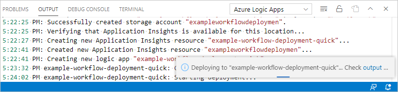

   When Visual Studio Code finishes deploying your logic app to Azure, the following message appears:

   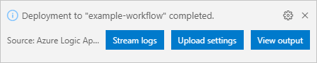

   Congratulations, your logic app is now live in Azure and enabled by default.

Next, you can learn how to perform these tasks:

* [Add a blank workflow to your project](#add-workflow-existing-project).

* [Manage deployed logic apps in Visual Studio Code](#manage-deployed-apps-vs-code) or by using the [Azure portal](#manage-deployed-apps-portal).

* [Enable run history on stateless workflows](#enable-run-history-stateless).

* [Enable monitoring view in the Azure portal for a deployed logic app](#enable-monitoring).

<a name="add-workflow-existing-project"></a>

## Add blank workflow to project

You can have multiple workflows in your logic app project. To add a blank workflow to your project, follow these steps:

1. On the Visual Studio Code Activity Bar, select the Azure icon.

1. In the Azure pane, next to **Azure: Logic Apps (Preview)**, select **Create Workflow** (icon for Azure Logic Apps).

1. Select the workflow type that you want to add: **Stateful** or **Stateless**

1. Provide a name for your workflow.

When you're done, a new workflow folder appears in your project along with a **workflow.json** file for the workflow definition.

<a name="manage-deployed-apps-vs-code"></a>

## Manage deployed logic apps in Visual Studio Code

In Visual Studio Code, you can view all the deployed logic apps in your Azure subscription, whether they are the original **Logic Apps** or the **Logic App (Preview)** resource type, and select tasks that help you manage those logic apps. However, to access both resource types, you need both the **Azure Logic Apps** and the **Azure Logic Apps (Preview)** extensions for Visual Studio Code.

1. On the left toolbar, select the Azure icon. In the **Azure: Logic Apps (Preview)** pane, expand your subscription, which shows all the deployed logic apps for that subscription.

1. Open the logic app that you want to manage. From the logic app's shortcut menu, select the task that you want to perform.

   For example, you can select tasks such as stopping, starting, restarting, or deleting your deployed logic app.

   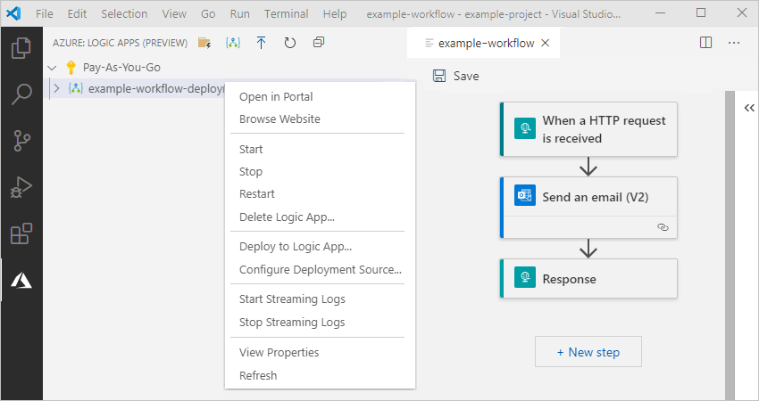

1. To view all the workflows in the logic app, expand your logic app, and then expand the **Workflows** node.

1. To view a specific workflow, open the workflow's shortcut menu, and select **Open in Designer**, which opens the workflow in read-only mode.

   To edit the workflow, you have these options:

   * In Visual Studio Code, open your project's **workflow.json** file in the workflow designer, make your edits, and redeploy your logic app to Azure.

   * In the Azure portal, [find and open your logic app](#manage-deployed-apps-portal). Find, edit, and save the workflow.

1. To open the deployed logic app in the Azure portal, open the logic app's shortcut menu, and select **Open in Portal**.

   The Azure portal opens in your browser, signs you in to the portal automatically if you're signed in to Visual Studio Code, and shows your logic app.

   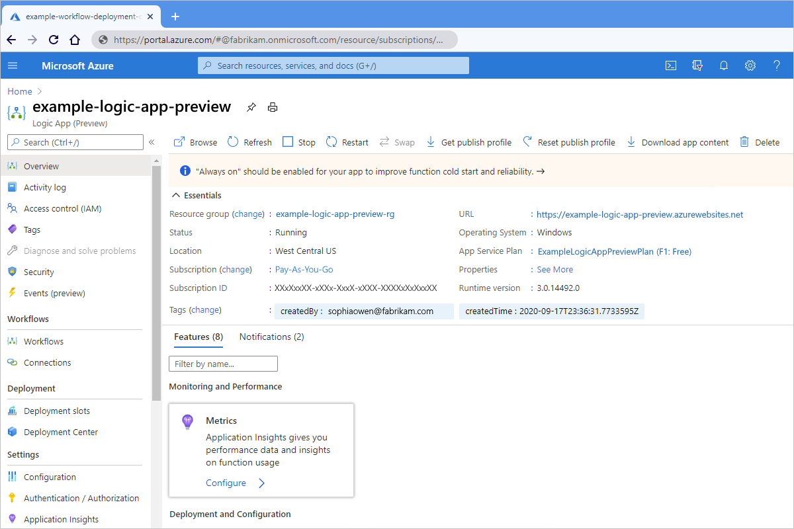

   You can also sign in separately to the Azure portal, use the portal search box to find your logic app, and then select your logic app from the results list.

   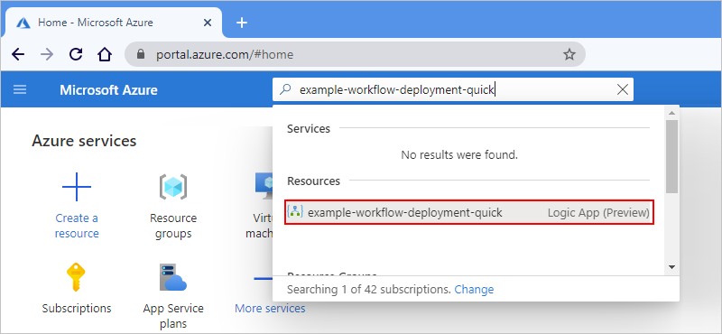

<a name="manage-deployed-apps-portal"></a>

## Manage deployed logic apps in the portal

In the Azure portal, you can view all the deployed logic apps that are in your Azure subscription, whether they are the original **Logic Apps** resource type or the **Logic App (Preview)** resource type. Currently, each resource type is organized and managed as separate categories in Azure. To find logic apps that have the **Logic App (Preview)** resource type, follow these steps:

1. In the Azure portal search box, enter `logic app preview`. When the results list appears, under **Services**, select **Logic App (Preview)**.

   

1. On the **Logic App (Preview)** pane, find and select the logic app that you deployed from Visual Studio Code.

   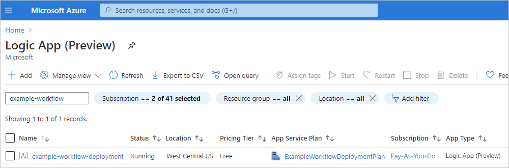

   The Azure portal opens the individual resource page for the selected logic app.

   

1. To view the workflows in this logic app, on the logic app's menu, select **Workflows**.

   The **Workflows** pane shows all the workflows in the current logic app. This example shows the workflow that you created in Visual Studio Code.

   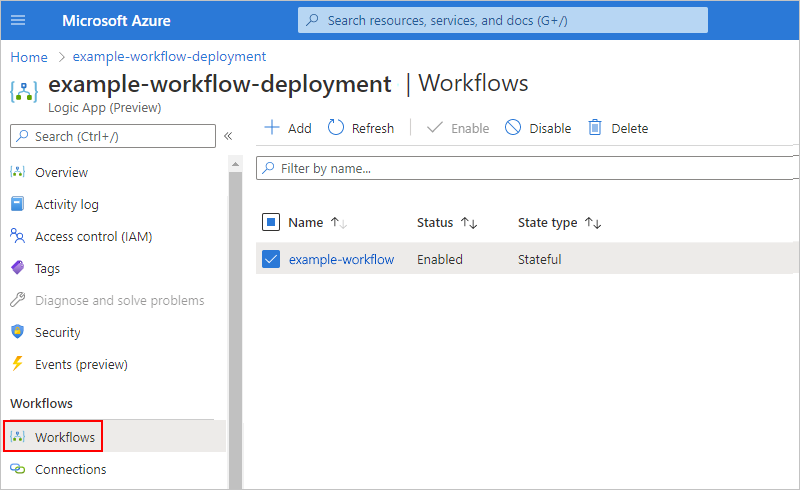

1. To view a workflow, on the **Workflows** pane, select that workflow.

   The workflow pane opens and shows more information and tasks that you can perform on that workflow.

   For example, to view the steps in the workflow, select **Designer**.

   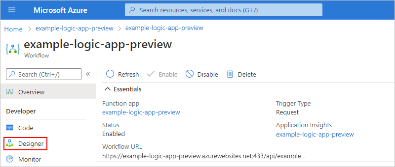

   The workflow designer opens and shows the workflow that you built in Visual Studio Code. You can now make changes to this workflow in the Azure portal.

   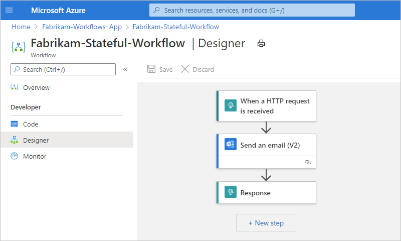

<a name="add-workflow-portal"></a>

## Add another workflow in the portal

Through the Azure portal, you can add blank workflows to a **Logic App (Preview)** resource that you deployed from Visual Studio Code and build those workflows in the Azure portal.

1. In the [Azure portal](https://portal.azure.com), find and select your deployed **Logic App (Preview)** resource.

1. On the logic app menu, select **Workflows**. On the **Workflows** pane, select **Add**.

   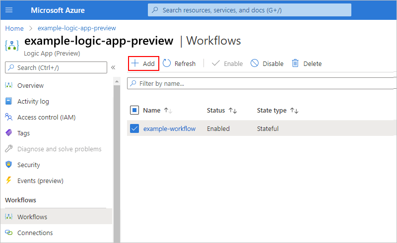

1. In the **New workflow** pane, provide name for the workflow. Select either **Stateful** or **Stateless** **>** **Create**.

   After Azure deploys your new workflow, which appears on the **Workflows** pane, select that workflow so that you can manage and perform other tasks, such as opening the designer or code view.

   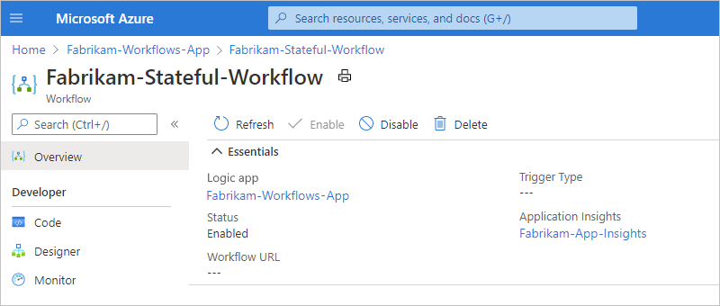

   For example, opening the designer for a new workflow shows a blank canvas. You can now build this workflow in the Azure portal.

   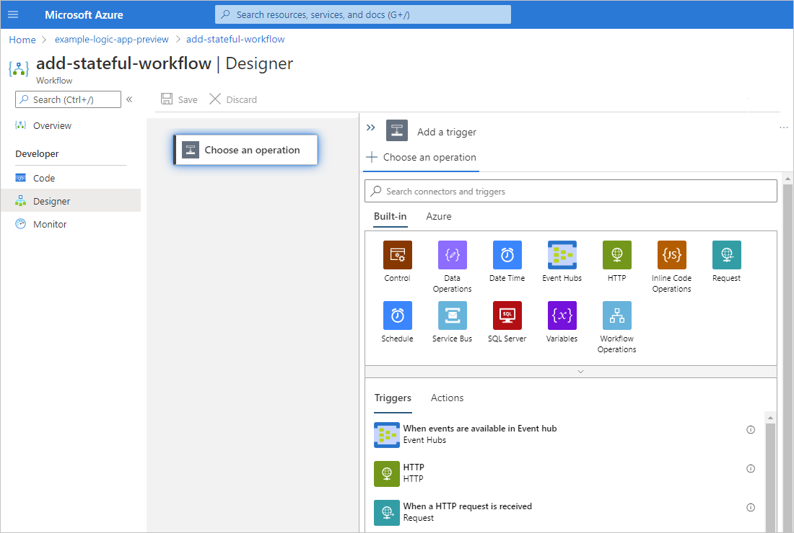

<a name="enable-run-history-stateless"></a>

## Enable run history for stateless workflows

To debug a stateless workflow more easily, you can enable the run history for that workflow, and then disable the run history when you're done. Follow these steps for Visual Studio Code, or if you're working in the Azure portal, see [Create stateful and stateless workflows in the Azure portal](create-stateful-stateless-workflows-azure-portal.md#enable-run-history-stateless).

1. In your Visual Studio Code project, expand the **workflow-designtime** folder, and open the **local.settings.json** file.

1. Add the `Workflows.{yourWorkflowName}.operationOptions` property and set the value to `WithStatelessRunHistory`, for example:

   **Windows**

   ```json
   {
      "IsEncrypted": false,
      "Values": {
         "AzureWebJobsStorage": "UseDevelopmentStorage=true",
         "FUNCTIONS_WORKER_RUNTIME": "dotnet",
         "Workflows.{yourWorkflowName}.OperationOptions": "WithStatelessRunHistory"
      }
   }
   ```

   **macOS or Linux**

   ```json
   {
      "IsEncrypted": false,
      "Values": {
         "AzureWebJobsStorage": "DefaultEndpointsProtocol=https;AccountName=fabrikamstorageacct; \
             AccountKey=<access-key>;EndpointSuffix=core.windows.net",
         "FUNCTIONS_WORKER_RUNTIME": "dotnet",
         "Workflows.{yourWorkflowName}.OperationOptions": "WithStatelessRunHistory"
      }
   }
   ```

1. To disable the run history when you're done, either set the `Workflows.{yourWorkflowName}.OperationOptions`property to `None`, or delete the property and its value.

<a name="enable-monitoring"></a>

## Enable monitoring view in the Azure portal

After you deploy a **Logic App (Preview)** resource from Visual Studio Code to Azure, you can review any available run history and details for a workflow in that resource by using the Azure portal and the **Monitor** experience for that workflow. However, you first have to enable the **Monitor** view capability on that logic app resource.

1. In the [Azure portal](https://portal.azure.com), find and select the deployed **Logic App (Preview)** resource.

1. On that resource's menu, under **API**, select **CORS**.

1. On the **CORS** pane, under **Allowed Origins**, add the wildcard character (*).

1. When you're done, on the **CORS** toolbar, select **Save**.

   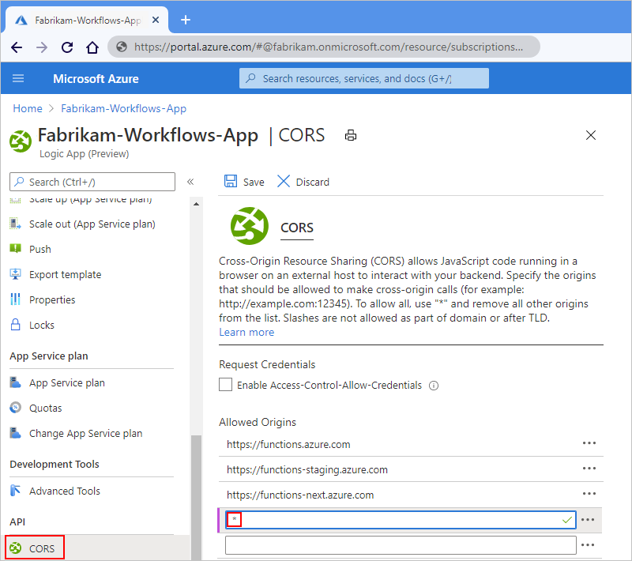

<a name="enable-open-application-insights"></a>

## Enable or open Application Insights after deployment

During workflow execution, your logic app emits telemetry along with other events. You can use this telemetry to get better visibility into how well your workflow runs and how the Logic Apps runtime works in various ways. You can monitor your workflow by using [Application Insights](../azure-monitor/app/app-insights-overview.md), which provides near real-time telemetry (live metrics). This capability can help you investigate failures and performance problems more easily when you use this data to diagnose issues, set up alerts, and build charts.

If your logic app's creation and deployment settings support using [Application Insights](../azure-monitor/app/app-insights-overview.md), you can optionally enable diagnostics logging and tracing for your logic app. You can do so either when you deploy your logic app from Visual Studio Code or after deployment. You need to have an Application Insights instance, but you can create this resource either [in advance](../azure-monitor/app/create-workspace-resource.md), when you deploy your logic app, or after deployment.

To enable Application Insights on a deployed logic app or to review Application Insights data when already enabled, follow these steps:

1. In the Azure portal, find your deployed logic app.

1. On the logic app menu, under **Settings**, select **Application Insights**.

1. If Application Insights isn't enabled, on the **Application Insights** pane, select **Turn on Application Insights**. After the pane updates, at the bottom, select **Apply**.

   If Application Insights is enabled, on the **Application Insights** pane, select **View Application Insights data**.

After Application Insights opens, you can review various metrics for your logic app. For more information, review these topics:

* [Azure Logic Apps Running Anywhere - Monitor with Application Insights - part 1](https://techcommunity.microsoft.com/t5/integrations-on-azure/azure-logic-apps-running-anywhere-monitor-with-application/ba-p/1877849)
* [Azure Logic Apps Running Anywhere - Monitor with Application Insights - part 2](https://techcommunity.microsoft.com/t5/integrations-on-azure/azure-logic-apps-running-anywhere-monitor-with-application/ba-p/2003332)

<a name="deploy-docker"></a>

## Deploy to Docker

You can deploy your logic app to a [Docker container](/visualstudio/docker/tutorials/docker-tutorial#what-is-a-container) as the hosting environment by using the [.NET CLI](/dotnet/core/tools/). With these commands, you can build and publish your logic app's project. You can then build and run your Docker container as the destination for deploying your logic app.

If you're not familiar with Docker, review these topics:

* [What is Docker?](/dotnet/architecture/microservices/container-docker-introduction/docker-defined)
* [Introduction to Containers and Docker](/dotnet/architecture/microservices/container-docker-introduction/)
* [Introduction to .NET and Docker](/dotnet/core/docker/introduction)
* [Docker containers, images, and registries](/dotnet/architecture/microservices/container-docker-introduction/docker-containers-images-registries)
* [Tutorial: Get started with Docker (Visual Studio Code)](/visualstudio/docker/tutorials/docker-tutorial)

### Requirements

* The Azure Storage account that your logic app uses for deployment

* A Docker file for the workflow that you use when building your Docker container

  For example, this sample Docker file deploys a logic app and specifies the connection string that contains the access key for the Azure Storage account that was used for publishing the logic app to the Azure portal. To find this string, see [Get storage account connection string](#find-storage-account-connection-string). For more information, review [Best practices for writing Docker files](https://docs.docker.com/develop/develop-images/dockerfile_best-practices/).
  
  > [!IMPORTANT]
  > For production scenarios, make sure that you protect and secure such secrets and sensitive information, for example, by using a key vault. 
  > For Docker files specifically, review [Build images with BuildKit](https://docs.docker.com/develop/develop-images/build_enhancements/) 
  > and [Manage sensitive data with Docker Secrets](https://docs.docker.com/engine/swarm/secrets/).

   ```text
   FROM mcr.microsoft.com/azure-functions/node:3.0

   ENV AzureWebJobsStorage <storage-account-connection-string>
   ENV AzureWebJobsScriptRoot=/home/site/wwwroot \
       AzureFunctionsJobHost__Logging__Console__IsEnabled=true \
       FUNCTIONS_V2_COMPATIBILITY_MODE=true

   COPY . /home/site/wwwroot

   RUN cd /home/site/wwwroot
   ```

<a name="find-storage-account-connection-string"></a>

### Get storage account connection string

Before you can build and run your Docker container image, you need to get the connection string that contains the access key to your storage account. Earlier, you created this storage account either as to use the extension on macOS or Linux, or when you deployed your logic app to the Azure portal.

To find and copy this connection string, follow these steps:

1. In the Azure portal, on the storage account menu, under **Settings**, select **Access keys**. 

1. On the **Access keys** pane, find and copy the storage account's connection string, which looks similar to this example:

   `DefaultEndpointsProtocol=https;AccountName=fabrikamstorageacct;AccountKey=<access-key>;EndpointSuffix=core.windows.net`

   

   For more information, review [Manage storage account keys](../storage/common/storage-account-keys-manage.md?tabs=azure-portal#view-account-access-keys).

1. Save the connection string somewhere safe so that you can add this string to the Docker file that you use for deployment. 

<a name="find-storage-account-master-key"></a>

### Find master key for storage account

When your workflow contains a Request trigger, you need to [get the trigger's callback URL](#get-callback-url-request-trigger) after you build and run your Docker container image. For this task, you also need to specify the master key value for the storage account that you use for deployment.

1. To find this master key, in your project, open the **azure-webjobs-secrets/{deployment-name}/host.json** file.

1. Find the `AzureWebJobsStorage` property, and copy the key value from this section:

   ```json
   {
      <...>
      "masterKey": {
         "name": "master",
         "value": "<master-key>",
         "encrypted": false
      },
      <...>
   }
   ```

1. Save this key value somewhere safe for you to use later.

<a name="build-run-docker-container-image"></a>

### Build and run your Docker container image

1. Build your Docker container image by using your Docker file and running this command:

   `docker build --tag local/workflowcontainer .`

   For more information, see [docker build](https://docs.docker.com/engine/reference/commandline/build/).

1. Run the container locally by using this command:

   `docker run -e WEBSITE_HOSTNAME=localhost -p 8080:80 local/workflowcontainer`

   For more information, see [docker run](https://docs.docker.com/engine/reference/commandline/run/).

<a name="get-callback-url-request-trigger"></a>

### Get callback URL for Request trigger

For a workflow that uses the Request trigger, get the trigger's callback URL by sending this request:

`POST /runtime/webhooks/workflow/api/management/workflows/{workflow-name}/triggers/{trigger-name}/listCallbackUrl?api-version=2020-05-01-preview&code={master-key}`

The `{trigger-name}` value is the name for the Request trigger that appears in the workflow's JSON definition. The `{master-key}` value is defined in the Azure Storage account that you set for the `AzureWebJobsStorage` property within the file, **azure-webjobs-secrets/{deployment-name}/host.json**. For more information, see [Find storage account master key](#find-storage-account-master-key).

<a name="delete-from-designer"></a>

## Delete items from the designer

To delete an item in your workflow from the designer, follow any of these steps:

* Select the item, open the item's shortcut menu (Shift+F10), and select **Delete**. To confirm, select **OK**.

* Select the item, and press the delete key. To confirm, select **OK**.

* Select the item so that details pane opens for that item. In the pane's upper right corner, open the ellipses (**...**) menu, and select **Delete**. To confirm, select **OK**.

  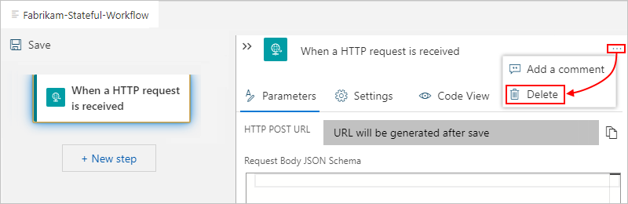

  > [!TIP]
  > If the ellipses menu isn't visible, expand Visual Studio Code window wide enough so that 
  > the details pane shows the ellipses (**...**) button in the upper right corner.

<a name="troubleshooting"></a>

## Troubleshoot errors and problems

<a name="designer-fails-to-open"></a>

### Designer fails to open

When you try to open the designer, you get this error, **"Workflow design time could not be started"**. If you previously tried to open the designer, and then discontinued or deleted your project, the extension bundle might not be downloading correctly. To check whether this cause is the problem, follow these steps:

  1. In Visual Studio Code, open the Output window. From the **View** menu, select **Output**.

  1. From the list in the Output window's title bar, select **Azure Logic Apps (Preview)** so that you can review output from the extension, for example:

     

  1. Review the output and check whether this error message appears:

     ```text
     A host error has occurred during startup operation '{operationID}'.
     System.Private.CoreLib: The file 'C:\Users\{userName}\AppData\Local\Temp\Functions\
     ExtensionBundles\Microsoft.Azure.Functions.ExtensionBundle.Workflows\1.1.7\bin\
     DurableTask.AzureStorage.dll' already exists.
     Value cannot be null. (Parameter 'provider')
     Application is shutting down...
     Initialization cancellation requested by runtime.
     Stopping host...
     Host shutdown completed.
     ```

   To resolve this error, delete the **ExtensionBundles** folder at this location **...\Users\{your-username}\AppData\Local\Temp\Functions\ExtensionBundles**, and retry opening the **workflow.json** file in the designer.

<a name="missing-triggers-actions"></a>

### New triggers and actions are missing from the designer picker for previously created workflows

Azure Logic Apps Preview supports built-in actions for Azure Function Operations, Liquid Operations, and XML Operations, such as **XML Validation** and **Transform XML**. However, for previously created logic apps, these actions might not appear in the designer picker for you to select if Visual Studio Code uses an outdated version of the extension bundle, `Microsoft.Azure.Functions.ExtensionBundle.Workflows`.

Also, the **Azure Function Operations** connector and actions don't appear in the designer picker unless you enabled or selected **Use connectors from Azure** when you created your logic app. If you didn't enable the Azure-deployed connectors at app creation time, you can enable them from your project in Visual Studio Code. Open the **workflow.json** shortcut menu, and select **Use Connectors from Azure**.

To fix the outdated bundle, follow these steps to delete the outdated bundle, which makes Visual Studio Code automatically update the extension bundle to the latest version.

> [!NOTE]
> This solution applies only to logic apps that you create and deploy using Visual Studio Code with 
> the Azure Logic Apps (Preview) extension, not the logic apps that you created using the Azure portal. 
> See [Supported triggers and actions are missing from the designer in the Azure portal](create-stateful-stateless-workflows-azure-portal.md#missing-triggers-actions).

1. Save any work that you don't want to lose, and close Visual Studio.

1. On your computer, browse to the following folder, which contains versioned folders for the existing bundle:

   `...\Users\{your-username}\.azure-functions-core-tools\Functions\ExtensionBundles\Microsoft.Azure.Functions.ExtensionBundle.Workflows`

1. Delete the version folder for the earlier bundle, for example, if you have a folder for version 1.1.3, delete that folder.

1. Now, browse to the following folder, which contains versioned folders for required NuGet package:

   `...\Users\{your-username}\.nuget\packages\microsoft.azure.workflows.webjobs.extension`

1. Delete the version folder for the earlier package, for example, if you have a folder for version 1.0.0.8-preview, delete that folder.

1. Reopen Visual Studio Code, your project, and the **workflow.json** file in the designer.

The missing triggers and actions now appear in the designer.

<a name="400-bad-request"></a>

### "400 Bad Request" appears on a trigger or action

When a run fails, and you inspect the run in monitoring view, this error might appear on a trigger or action that has a longer name, which causes the underlying Uniform Resource Identifier (URI) to exceed the default character limit.

To resolve this problem and adjust for the longer URI, edit the `UrlSegmentMaxCount` and `UrlSegmentMaxLength` registry keys on your computer by following the steps below. These key's default values are described in this topic, [Http.sys registry settings for Windows](/troubleshoot/iis/httpsys-registry-windows).

> [!IMPORTANT]
> Before you start, make sure that you save your work. This solution requires you 
> to restart your computer after you're done so that the changes can take effect.

1. On your computer, open the **Run** window, and run the `regedit` command, which opens the registry editor.

1. In the **User Account Control** box, select **Yes** to permit your changes to your computer.

1. In the left pane, under **Computer**, expand the nodes along the path, **HKEY_LOCAL_MACHINE\SYSTEM\CurrentControlSet\Services\HTTP\Parameters**, and then select **Parameters**.

1. In the right pane, find the `UrlSegmentMaxCount` and `UrlSegmentMaxLength` registry keys.

1. Increase these key values enough so that the URIs can accommodate the names that you want to use. If these keys don't exist, add them to the **Parameters** folder by following these steps:

   1. From the **Parameters** shortcut menu, select **New** > **DWORD (32-bit) Value**.

   1. In the edit box that appears, enter `UrlSegmentMaxCount` as the new key name.

   1. Open the new key's shortcut menu, and select **Modify**.

   1. In the **Edit String** box that appears, enter the **Value data** key value that you want in hexadecimal or decimal format. For example, `400` in hexadecimal is equivalent to `1024` in decimal.

   1. To add the `UrlSegmentMaxLength` key value, repeat these steps.

   After you increase or add these key values, the registry editor looks like this example:

   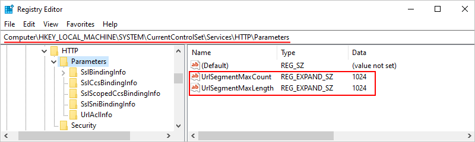

1. When you're ready, restart your computer so that the changes can take effect.

<a name="debugging-fails-to-start"></a>

### Debugging session fails to start

When you try to start a debugging session, you get the error, **"Error exists after running preLaunchTask 'generateDebugSymbols'"**. To resolve this problem, edit the **tasks.json** file in your project to skip symbol generation.

1. In your project, expand the **.vscode** folder, and open the **tasks.json** file.

1. In the following task, delete the line, `"dependsOn: "generateDebugSymbols"`, along with the comma that ends the preceding line, for example:

   Before:

   ```json
    {
      "type": "func",
      "command": "host start",
      "problemMatcher": "$func-watch",
      "isBackground": true,
      "dependsOn": "generateDebugSymbols"
    }
   ```

   After:

   ```json
    {
      "type": "func",
      "command": "host start",
      "problemMatcher": "$func-watch",
      "isBackground": true
    }
   ```

## Next steps

We'd like to hear from you about your experiences with the Azure Logic Apps (Preview) extension!

* For bugs or problems, [create your issues in GitHub](https://github.com/Azure/logicapps/issues).
* For questions, requests, comments, and other feedback, [use this feedback form](https://aka.ms/lafeedback).
