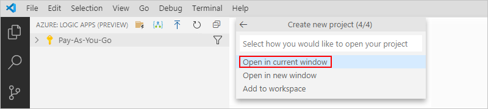

# Create stateful or stateless workflows in Visual Studio Code with the Azure Logic Apps (Preview) extension

> [!IMPORTANT]
> This capability is in public preview, is provided without a service level agreement, and 
> is not recommended for production workloads. Certain features might not be supported or might 
> have constrained capabilities. For more information, see 
> [Supplemental Terms of Use for Microsoft Azure Previews](https://azure.microsoft.com/support/legal/preview-supplemental-terms/).

To create logic app workflows that integrate across apps, data, cloud services, and systems, you can use Visual Studio Code and the Azure Logic Apps (Preview) extension to build and locally run [*stateful* and *stateless* logic app workflows](#stateful-stateless) in your development environment.


The logic apps that you create with the public preview extension use the new **Logic App (Preview)** resource type and are powered by the [Azure Functions](../azure-functions/functions-overview.md) runtime in your local environment. This new resource type can include multiple workflows and is similar in some ways to the **Function App** resource type, which can include multiple functions.

Meanwhile, the original **Logic Apps** resource type still exists for you to create and use in Visual Studio Code and in the Azure portal. However, the experiences for the original resource type are separate from the new resource type. At this time, both **Logic Apps** and **Logic App (Preview)** resource types can exist at the same time in Visual Studio Code and in the Azure portal. You can view and access all the deployed logic apps in your Azure subscription, but they appear and are kept separately in their own categories and sections.

This article provides a high-level [overview about this public preview](#whats-new), describes various aspects about the **Logic App (Preview)** resource type, and how to create this resource by using Visual Studio Code:

* How [stateful and stateless](#stateful-stateless) logic apps differ from each other.

* How to meet the [setup requirements](#prerequisites) and [set up Visual Studio Code](#set-up) for the public preview extension.

* How to build new **Logic App (Preview)** workflows by [creating a project and selecting a workflow template](#create-project).

* How to locally run and debug your new logic apps in Visual Studio Code.

* How to publish these new logic apps directly from Visual Studio Code [to Azure](#publish-azure) or [to a Docker container](#deploy-docker) that you can run anywhere. For more information about Docker, see [What is Docker](/dotnet/architecture/microservices/container-docker-introduction/docker-defined)?

<a name="whats-new"></a>

## What's in this public preview?

The Azure Logic Apps (Preview) extension brings many current and additional Logic Apps capabilities to your local development experience in Visual Studio Code, for example:

* Build logic apps for integration and automation workflows from [390+ connectors](/connectors/connector-reference/connector-reference-logicapps-connectors) for Software-as-a-Service (SaaS) and Platform-as-a-Service (PaaS) apps and services plus connectors for on-premises systems.

  * Some managed connectors such as Azure Service Bus, Azure Event Hubs, and SQL Server run similarly to built-in native triggers and actions such as the HTTP action.

  * Create and deploy logic apps that can run anywhere because the Azure Logic Apps service generates Shared Access Signature (SAS) connection strings that these logic apps can use for sending requests to the cloud connection runtime endpoint. The Logic Apps service saves these connection strings with other application settings so that you can easily store these values in Azure Key Vault when you deploy to Azure.

    > [!NOTE]
    > By default, a **Logic App (Preview)** resource has its 
    > [system-assigned managed identity](../logic-apps/create-managed-service-identity.md) 
    > automatically enabled to authenticate connections at runtime. 
    > This identity differs from the authentication credentials or connection string that you use 
    > when you create a connection. If you disable this identity, connections won't work at runtime.

* Create stateless logic apps that run only in memory so that they finish more quickly, respond faster, have higher throughput, and cost less to run because the run histories and data between actions don't persist in external storage. Optionally, you can enable run history for easier debugging. For more information, see [Stateful versus stateless logic apps](#stateful-stateless).

* Run and debug your logic apps locally in the Visual Studio Code development environment.

* Publish and deploy your logic apps from Visual Studio Code directly to various hosting environments, such as [Azure App Service](../app-service/environment/intro.md) and [Docker containers](/dotnet/core/docker/introduction).

> [!NOTE]
> For information about current known issues, review the preview extension's 
> [Known Issues GitHub page](https://github.com/Azure/logicapps/blob/master/articles/logic-apps-public-preview-known-issues.md).

<a name="stateful-stateless"></a>

## Stateful versus stateless logic apps

* *Stateful*

  Create stateful logic apps when you need to keep, review, or reference data from previous events. These logic apps keep the input and output for each action and their workflow states in external storage, which makes reviewing the run details and history possible after each run finishes. Stateful logic apps provide high resiliency if or when outages happen. After services and systems are restored, you can reconstruct interrupted logic app runs from the saved state and rerun the logic apps to completion. Stateful workflows can continue running for up to a year.

* *Stateless*

  Create stateless logic apps when you don't need to save, review, or reference data from previous events in external storage for later review. These logic apps keep the input and output for each action and their workflow states only in memory, rather than transfer this information to external storage. As a result, stateless logic apps have shorter runs that are usually no longer than 5 minutes, faster performance with quicker response times, higher throughput, and reduced running costs because the run details and history aren't kept in external storage. However, if or when outages happen, interrupted runs aren't automatically restored, so the caller needs to manually resubmit interrupted runs. These logic apps can only run synchronously and for easier debugging, you can [enable run history](#run-history), which has some impact on performance.

  Stateless workflows currently support only *actions* for [managed connectors](../connectors/apis-list.md#managed-api-connectors), which are deployed in Azure, and not triggers. To start your workflow, select the [built-in Request, Event Hubs, or Service Bus trigger](../connectors/apis-list.md#built-ins), which run natively with the Logic Apps runtime. For more information about unsupported triggers, actions, and connectors, see [Unsupported or unavailable capabilities](#unsupported).

For information about how nested logic apps behave differently between stateful and stateless logic apps, see [Nested behavior differences between stateful and stateless logic apps](#nested-behavior).

<a name="pricing-model"></a>

## Pricing model

When you deploy the new **Logic App (Preview)** resource type, you're prompted to select a hosting plan, specifically the [App Service plan or Premium plan](../azure-functions/functions-scale.md) to use as the pricing model. If you select the App Service plan, you're also prompted to select a [pricing tier](../app-service/overview-hosting-plans.md). During public preview, running logic apps on App Service doesn't incur *additional* charges on top of the selected plan.

Stateful logic apps use [external storage](../azure-functions/functions-scale.md#storage-account-requirements), so the Azure Storage pricing model applies to storage transactions that the Azure Logic Apps runtime performs. For example, queues are used for scheduling, while tables and blobs are used for storing workflow states.

For more information about the pricing models that apply to this new resource type, review these topics:

* [Azure Functions scale and hosting](../azure-functions/functions-scale.md)
* [Scale up an in Azure App Service](../app-service/manage-scale-up.md)
* [Azure Functions pricing details](https://azure.microsoft.com/pricing/details/functions/)
* [App Service pricing details](https://azure.microsoft.com/pricing/details/app-service/windows/)
* [Azure Storage pricing details](https://azure.microsoft.com/pricing/details/storage/)

<a name="unsupported"></a>

## Unavailable or unsupported capabilities

For this public preview, these capabilities are not available or not supported:

* Creating the new **Logic App (Preview)** resource is currently unavailable on macOS.

* Not all Azure regions are supported yet. For currently available regions, check the [regions list](https://github.com/Azure/logicapps/blob/master/articles/logic-apps-public-preview-known-issues.md#available-regions).

* To start your workflow, use the [built-in Request, HTTP, Event Hubs, or Service Bus trigger](../connectors/apis-list.md), which run natively with the Logic Apps runtime. Currently, [enterprise connectors](../connectors/apis-list.md#enterprise-connectors), [on-premises data gateway triggers](../connectors/apis-list.md#on-premises-connectors), webhook-based triggers, Sliding Window trigger, [custom connectors](../connectors/apis-list.md#custom-apis-and-connectors), integration accounts, their artifacts, and [their connectors](../connectors/apis-list.md#integration-account-connectors) aren't supported in this preview. The "call an Azure function" capability is unavailable, so for now, use the HTTP *action* to call the request URL for the Azure function.

  Except for the previously specified triggers, *stateful* workflows can use both triggers and actions for [managed connectors](../connectors/apis-list.md#managed-api-connectors), which are deployed in Azure. However, *stateless* workflows currently support only *actions* for managed connectors, not triggers. Although you have the option to enable connectors in Azure for your stateless workflow, the designer doesn't show any managed connector triggers for you to select.

* You can deploy the new **Logic App (Preview)** resource type only to a [Premium or App Service hosting plan in Azure](#publish-azure) or to a [Docker container](#deploy-docker), and not [integration service environments (ISEs)](../logic-apps/connect-virtual-network-vnet-isolated-environment-overview.md). **Consumption** hosting plans aren't supported nor available for deploying this resource type.

* In the Azure portal, you can't create new logic apps with the new **Logic App (Preview)** resource type. You can only create these logic apps in Visual Studio Code. However, after you deploy logic apps with this resource type from Visual Studio Code to Azure, you can [add new workflows to those logic apps](#add-workflows).

## Prerequisites

### Access and connectivity

* Access to the internet so that you can download the requirements, connect from Visual Studio Code to your Azure account, and publish from Visual Studio Code to Azure, a Docker container, or other environment.

* An Azure account and subscription. If you don't have a subscription, [sign up for a free Azure account](https://azure.microsoft.com/free/?WT.mc_id=A261C142F).

* To build the same example logic app in this article, you need an Office 365 Outlook email account that uses a Microsoft work or school account to sign in.

  If you choose to use a different [email connector that's supported by Azure Logic Apps](/connectors/), such as Outlook.com or [Gmail](../connectors/connectors-google-data-security-privacy-policy.md), you can still follow the example, and the general overall steps are the same, but your user interface and options might differ in some ways. For example, if you use the Outlook.com connector, use your personal Microsoft account instead to sign in.

### Storage requirements

1. Download and install [Azure Storage Emulator 5.10](https://go.microsoft.com/fwlink/p/?linkid=717179).

1. To run the emulator, you need to have a local SQL DB installation, such as the free [SQL Server 2019 Express Edition](https://go.microsoft.com/fwlink/p/?linkid=866658). For more information, see [Use the Azure Storage emulator for development and testing](../storage/common/storage-use-emulator.md).

   > [!IMPORTANT]
   > Before you open the Logic App Designer to create your logic app workflow, make sure that you start the emulator. 
   > Otherwise, you get a message that the `Workflow design time could not be started`.
   >
   > 

### Tools

* [Visual Studio Code 1.30.1 (January 2019) or higher](https://code.visualstudio.com/), which is free. Also, download and install these additional tools for Visual Studio Code, if you don't have them already:

  * [Azure Account extension](https://marketplace.visualstudio.com/items?itemName=ms-vscode.azure-account), which provides a single common Azure sign-in and subscription filtering experience for all other Azure extensions in Visual Studio Code.

  * [C# for Visual Studio Code extension](https://marketplace.visualstudio.com/items?itemName=ms-vscode.csharp), which enables F5 functionality to run your logic app.

  * [Azure Functions Core Tools](../azure-functions/functions-run-local.md), either version [3.0.2931](https://github.com/Azure/azure-functions-core-tools/releases/tag/3.0.2931) or [2.7.2936](https://github.com/Azure/azure-functions-core-tools/releases/tag/2.7.2936), through the Microsoft Installer (MSI). These tools includes a version of the same runtime that powers the Azure Functions runtime that runs in Visual Studio Code.

    > [!IMPORTANT]
    > If you have an installation that's earlier than these versions, uninstall that version first, 
    > or make sure that the PATH environment variable points at the version that you download and install.
    >
    > If you want to use the [**Inline Code** action](../logic-apps/logic-apps-add-run-inline-code.md) 
    > for running JavaScript code, you need to use the Azure Functions runtime version 3x because the 
    > action doesn't support version 2x. Also, this action currently isn't supported on Linux operating systems.

  * [Azure Logic Apps (Preview) extension for Visual Studio Code](https://go.microsoft.com/fwlink/p/?linkid=2143167). This public preview extension provides the capability for you to create stateful and stateless logic apps and run them locally in Visual Studio Code.

    Currently, you can have both the original **Azure Logic Apps** extension and the new **Azure Logic Apps (Preview)** extension installed at the same time in Visual Studio Code. By selecting the Azure icon on the Visual Studio Code toolbar, you can view all the logic apps deployed in Azure, but each resource type appears in their own extension sections, **Logic Apps** and **Azure Logic Apps (Preview)**.

    > [!IMPORTANT]
    > If you created logic apps by using the **Azure Logic Apps (Private Preview)** extension, 
    > these logic apps won't work with the public preview extension. However, you can migrate these 
    > logic apps by uninstalling the private preview extension, performing the required cleanup, and 
    > installing the public preview extension. You can then create your new project in Visual Studio Code, 
    > and copy your previously created logic app's **workflow.definition** file into your new project.
    >
    > So, before you install the public preview extension, make sure that you uninstall any 
    > earlier versions, and delete these artifacts:
    >
    > * The **Microsoft.Azure.Functions.ExtensionBundle.Workflows** folder, which contains 
    > previous extension bundles and is located along either path here:
    >
    >   * `C:\Users\{userName}\AppData\Local\Temp\Functions\ExtensionBundles`
    >
    >   * `C:\Users\{userName}.azure-functions-core-tools\Functions\ExtensionBundles`
    >
    > * The **microsoft.azure.workflows.webjobs.extension** folder, which is the [NuGet](/nuget/what-is-nuget) 
    > cache for the private preview extension and is located along this path:
    >
    >   `C:\Users\{userName}\.nuget\packages`

    To install the **Azure Logic Apps (Preview)** extension, follow these steps:

    1. In Visual Studio Code, on the left toolbar, select **Extensions**.

    1. In the extensions search box, enter `azure logic apps preview`. From the results list, select **Azure Logic Apps (Preview)** **>** **Install**.

       After the installation completes, the public preview extension appears in the **Extensions: Installed** list.

       

* To test the example logic app that you create in this article, you need a tool that can send calls to the Request trigger, which is the first step in example logic app. If you don't have such a tool, you can download, install, and use [Postman](https://www.postman.com/downloads/).

* For easier diagnostics logging and tracing capability, you can add and use an [Application Insights](../azure-monitor/app/app-insights-overview.md) resource. You can create this resource during logic app deployment, or in the Azure portal after you deploy your logic app.

<a name="set-up"></a>

## Set up Visual Studio Code

1. To make sure that all the extensions are correctly installed, reload or restart Visual Studio Code.

1. Enable or check that Visual Studio Code automatically finds and installs extension updates so that your public preview extension gets the latest updates.

   To check this setting, follow these steps:

   1. On the **File** menu, go to **Preferences** **>** **Settings**.

   1. On the **User** tab, go to **Features** **>** **Extensions**.

   1. Confirm that **Auto Check Updates** and **Auto Update** are selected.

1. Enable or check that these **Azure Logic Apps (Preview)** extension settings are set up in Visual Studio Code:

   * **Azure Logic Apps V2: Panel Mode**
   * **Azure Logic Apps V2: Project Runtime**

   1. On the **File** menu, go to **Preferences** **>** **Settings**.

   1. On the **User** tab, go to **>** **Extensions** **>** **Azure Logic Apps (Preview)**.

   1. Under **Azure Logic Apps V2: Panel Mode**, confirm that **Enable panel mode** is selected. Under **Azure Logic Apps V2: Project Runtime**, set the version to **~3** or **~2**, based on the [Azure Functions Core Tools version](#prerequisites) that you installed earlier.

      > [!IMPORTANT]
      > If you want to use the [**Inline Code** action](../logic-apps/logic-apps-add-run-inline-code.md) 
      > for running JavaScript code, make sure that you use Project Runtime version 3 because the action 
      > doesn't support version 2. Also, this action currently isn't supported on Linux operating systems.

      

<a name="connect-azure-account"></a>

## Connect to your Azure account

1. On the Visual Studio Code toolbar, select the Azure icon.

   

1. In the Azure pane, under **Azure: Logic Apps (Preview)**, select **Sign in to Azure**. When the Visual Studio Code authentication page appears, sign in with your Azure account.

   

   After you sign in, the Azure pane shows the subscriptions in your Azure account. If you have the publicly released Logic Apps extension, you can find any original Logic Apps resources that you created using the original extension in the released extension's **Logic Apps** section, not the preview extension's **Logic Apps (Preview)** section.
   
   If the expected subscriptions don't appear, or you want the pane to show only specific subscriptions, follow these steps:

   1. In the subscriptions list, move your pointer next to the first subscription until the **Select subscriptions** button (filter icon) appears. Select the filter icon.

      

      Or, in the Visual Studio Code status bar, select your Azure account. 

   1. When another subscriptions list appears, select the subscriptions that you want, and then make sure that you select **OK**.

<a name="create-project"></a>

## Create a local project

Before you can create your logic app, create a local project so that you can manage and deploy your logic app from Visual Studio Code. The underlying project is similar to an Azure Functions project, also known as a function app project. However, these project types are separate from each other, so logic app workflows and functions can't exist in the same project.

1. On your computer, create an *empty* local folder to use for the project that you'll later create in Visual Studio Code.

1. In Visual Studio Code, close any and all open folders.

1. In the Azure pane, next to **Azure: Logic Apps (Preview)**, select **Create New Project** (icon that shows a folder and lightning bolt).

   

1. If Windows Defender Firewall prompts you to grant network access for `Code.exe`, which is Visual Studio Code, and for `func.exe`, which is the Azure Functions Core Tools, select **Private networks, such as my home or work network** **>** **Allow access**.

1. Browse to the location where you created your project folder, select that folder and continue.

   

1. From the templates list that appears, select either **Stateful Workflow** or **Stateless Workflow**. This example selects **Stateful Workflow**.

   

1. Provide a name for your logic app workflow and press Enter. This example uses `example-workflow` as the name.

   

1. From the next list that appears, select **Open in current window**.

   

   Visual Studio Code reloads, opens the Explorer pane, and shows your project, which now includes automatically generated project files. For example, the project has a folder that shows your logic app workflow's name. Inside this folder, the **workflow.json** file contains your logic app workflow's underlying JSON definition.

   

<a name="open-workflow-definition-designer"></a>

## Open the workflow definition file in Logic App Designer

1. Check the versions that are installed on your computer by running the this command:

   `..\Users\{yourUserName}\dotnet --list-sdks`

   If you have .NET Core SDK 5.x, this version might prevent you from opening the logic app's underlying workflow definition in the designer. Rather than uninstall this version, in your project's root location, create a **global.json** file that references the .NET Core runtime 3.x version that you have that's later than 3.1.201, for example:

   ```json
   {
      "sdk": {
         "version": "3.1.8",
         "rollForward": "disable"
      }
   }
   ```

   Make sure that you explicitly add that **global.json** file to your project at the root location from inside Visual Studio Code. Otherwise, the designer won't open.

1. If Visual Studio Code is running on Windows or Linux, make sure that the Azure Storage Emulator is running. For more information, review the [Prerequisites](#prerequisites).

1. Expand the project folder for your workflow. Open the **workflow.json** file's shortcut menu, and select **Open in Designer**.

   

   If you get the error message that the `Workflow design time could not be started`, make sure that the Azure Storage Emulator is running. Otherwise, try these other troubleshooting suggestions:

   In Visual Studio Code, check the output from the preview extension.

   1. From the **View** menu, select **Output**.

   1. From the list on the **Output** title bar, select **Azure Logic Apps** so that you can view the output for the preview extension, for example:

      

   1. Review the output and check whether this error message appears:

      ```text
      A host error has occurred during startup operation '{operationID}'.
      System.Private.CoreLib: The file 'C:\Users\{userName}\AppData\Local\Temp\Functions\
      ExtensionBundles\Microsoft.Azure.Functions.ExtensionBundle.Workflows\1.1.1\bin\
      DurableTask.AzureStorage.dll' already exists.
      Value cannot be null. (Parameter 'provider')
      Application is shutting down...
      Initialization cancellation requested by runtime.
      Stopping host...
      Host shutdown completed.
      ```

      This error can happen if you previously tried to open the designer, and then discontinued or deleted your project. To resolve this error, delete the **ExtensionBundles** folder at this location **...\Users\\{your-username}\AppData\Local\Temp\Functions\ExtensionBundles**, and retry opening the **workflow.json** file in the designer.

1. From the **Enable connectors in Azure** list, select **Use connectors from Azure**, which applies to all managed connectors that are available and deployed in Azure, not just connectors for Azure services.

   

   > [!NOTE]
   > Stateless workflows currently support only *actions* for [managed connectors](../connectors/apis-list.md#managed-api-connectors), 
   > which are deployed in Azure, and not triggers. Although you have the option to enable connectors in Azure for your stateless workflow, 
   > the designer doesn't show any managed connector triggers for you to select.

1. From the resource groups list, select **Create new resource group**.

   

1. Provide a name for the resource group, and press Enter. This example uses `example-logic-app-preview-rg`.

   

1. From the locations list, find and select a [supported Azure region](https://github.com/Azure/logicapps/blob/master/articles/logic-apps-public-preview-known-issues.md#available-regions) to use for creating your resource group and resources. This example uses **West Central US**.

   > [!IMPORTANT]
   > Not all regions are currently supported, but updates to add more regions are underway. Selecting an unsupported region might result in problems, 
   > such as creating connections. For the currently supported regions, review the preview extension's 
   > [Known Issues GitHub page](https://github.com/Azure/logicapps/blob/master/articles/logic-apps-public-preview-known-issues.md#available-regions).

   

   After you perform this step, Visual Studio Code opens the Logic App Designer.

   > [!NOTE]
   > When Visual Studio Code starts the workflow design-time API, a message appears that 
   > startup might take a few seconds. You can ignore this message or select **OK**.

   After the Logic App Designer appears, the **Choose an operation** prompt appears on the designer and is selected by default, which shows the **Add an action** pane.

   

1. Next, [add a trigger and actions](#add-trigger-actions) to your workflow.

<a name="add-trigger-actions"></a>

## Add a trigger and actions

After you open the Logic App Designer from your **workflow.json** file's shortcut menu, the **Choose an operation** prompt appears on the designer and is selected by default. You can now start creating your workflow by adding a trigger and actions.

The logic app workflow in this example uses this trigger and these actions:

* The built-in [Request trigger](../connectors/connectors-native-reqres.md), **When a HTTP request is received**, which receives inbound calls or requests and creates an endpoint that other services or logic apps can call.

* The [Office 365 Outlook action](../connectors/connectors-create-api-office365-outlook.md), **Send an email**.

* The built-in [Response action](../connectors/connectors-native-reqres.md), which you use to send a reply and return data back to the caller.

### Add the Request trigger

1. Next to the designer, in the **Add a trigger** pane, under the **Choose an operation** search box, make sure that **Built-in** is selected so that you can select a trigger that runs natively.

1. In the **Choose an operation** search box, enter `when a http request`, and select the built-in Request trigger that's named **When a HTTP request is received**.

   

   When the trigger appears on the designer, the trigger's details pane opens to show the trigger's properties, settings, and other actions.

   

   > [!TIP]
   > If the details pane doesn't appear, makes sure that the trigger is selected on the designer.

1. If you have to delete an item on the designer, follow these steps:

   1. On the designer, select the item, which opens the item's details pane to the right side.

   1. Expand the Visual Studio Code window widely enough so that next to the trigger or action name, the ellipses (**...**) button appears in the uppermost right corner. 

   1. Open the ellipses (**...**) menu, and select **Delete**. To confirm the deletion, select **OK**.

      

### Add the Office 365 Outlook action

1. On the designer, under the trigger that you added, select **New step**.

   The **Choose an operation** prompt appears on the designer, and the **Add an action pane** reopens so that you can select the next action.

1. On the **Add an action** pane, under the **Choose an operation** search box, select **Azure** so that you can find and select an action for a managed connector that's deployed in Azure.

   This example selects and uses the Office 365 Outlook action, **Send an email (V2)**.

   

1. In the action's details pane, select **Sign in** so that you can create a connection to your email account.

   

   > [!NOTE]
   > If you get the error, `Failed to create connection...`, you might have chosen a currently unsupported region for your logic app. 
   > Updates to add more regions are underway. Meanwhile, for the currently supported regions, review the preview extension's 
   > [Known Issues GitHub page](https://github.com/Azure/logicapps/blob/master/articles/logic-apps-public-preview-known-issues.md#available-regions).

1. When Visual Studio Code prompts you for consent to access your email account, select **Open**.

   

   > [!TIP]
   > To prevent future prompts, select **Configure Trusted Domains** 
   > so that you can add the authentication page as a trusted domain.

1. Follow the subsequent prompts to sign in, allow access, and allow returning to Visual Studio Code.

   > [!NOTE]
   > If too much time passes before you complete the prompts, the authentication process times out and fails. 
   > In this case, return to the designer and retry signing in to create the connection.

1. When the Azure Logic Apps preview extension prompts you for consent to access your email account, select **Open**. Follow the subsequent prompt to allow access.

   

   > [!TIP]
   > To prevent future prompts, select **Don't ask again for this extension**.

   After Visual Studio Code creates your connection, some connectors show the message that `The connection will be valid for {n} days only.` This time limit applies only to the duration while you author your logic app in Visual Studio Code. After deployment, this limit no longer applies because your logic app can authenticate at runtime by using its automatically enabled [system-assigned managed identity](../logic-apps/create-managed-service-identity.md). This managed identity differs from the authentication credentials or connection string that you use when you create a connection. If you disable this system-assigned managed identity, connections won't work at runtime.

1. On the designer, if the **Send an email** action doesn't appear selected, select that action.

1. On the action's details pane, on the **Parameters** tab, provide the required information for the action, for example:

   

   | Property | Required | Value | Description |
   |----------|----------|-------|-------------|
   | **To** | Yes | <*your-email-address*> | The email recipient, which can be your email address for test purposes. This example uses the fictitious email, `sophiaowen@fabrikam.com`. |
   | **Subject** | Yes | `An email from your example workflow` | The email subject |
   | **Body** | Yes | `Hello from your example workflow!` | The email body content |
   ||||

   > [!NOTE]
   > If you want to make any changes in the details pane on the **Settings**, **Run After**, 
   > or **Static Result** tab, make sure that you select **Done** to commit those changes 
   > before you switch tabs or change focus to the designer. Otherwise, Visual Studio Code 
   > won't keep your changes. For more information, review the preview extension's 
   > [Known Issues GitHub page](https://github.com/Azure/logicapps/blob/master/articles/logic-apps-public-preview-known-issues.md).

1. On the designer, select **Save**.

Next, run and debug your workflow locally in Visual Studio Code.

<a name="debug-test-locally"></a>

## Run and debug locally

To test your logic app, follow these steps to start a debugging session and find the URL for the endpoint that's created by the Request trigger. You need this URL so that you can later send a request to that endpoint.

1. To help you more easily debug a stateless logic app workflow, you can [enable the run history for that workflow](#run-history).

1. On the Visual Studio Code toolbar, open the **Run** menu, and select **Start Debugging** (F5).

   The **Terminal** window opens so that you can review the debugging session.

1. Now, find the callback URL for the endpoint on the Request trigger.

   1. Reopen the Explorer pane so that you can view your project.

   1. From the **workflow.json** file's shortcut menu, select **Overview**.

      

   1. Find the **Callback URL** value, which looks similar to this URL for the example Request trigger:

      `http://localhost:7071/api/<workflow-name>/triggers/manual/invoke?api-version=2020-05-01-preview&sp=%2Ftriggers%2Fmanual%2Frun&sv=1.0&sig=<shared-access-signature>`

      

1. To test the callback URL by triggering the logic app workflow, open [Postman](https://www.postman.com/downloads/) or your preferred tool for creating and sending requests.

   This example continues by using Postman. For more information, see [Postman Getting Started](https://learning.postman.com/docs/getting-started/introduction/).

   1. On the Postman toolbar, select **New**.

      

   1. On the **Create New** pane, under **Building Blocks**, select **Request**.

   1. In the **Save Request** window, under **Request name**, provide a name for the request, for example, `Test workflow trigger`.

   1. Under **Select a collection or folder to save to**, select **Create Collection**.

   1. Under **All Collections**, provide a name for the collection to create for organizing your requests, press Enter, and select **Save to <*collection-name*>**. This example uses `Logic Apps requests` as the collection name.

      Postman's request pane opens so that you can send a request to the callback URL for the Request trigger.

      

   1. Return to Visual Studio Code. from the workflow's overview page, copy the **Callback URL** property value.

   1. Return to Postman. On the request pane, next the method list, which currently shows **GET** as the default request method, paste the callback URL that you previously copied in the address box, and select **Send**.

      

      The example logic app workflow sends an email that appears similar to this example:

      

1. In Visual Studio Code, return to your workflow's overview page.

   If you created a stateful workflow, after the request that you sent triggers the workflow, the overview page shows the workflow's run status and history.

   > [!TIP]
   > If the run status doesn't appear, try refreshing the overview page by selecting **Refresh**. 
   > No run happens for a trigger that's skipped due to unmet criteria or finding no data.

   

   | Run status | Description |
   |------------|-------------|
   | **Aborted** | The run stopped or didn't finish due to external problems, for example, a system outage or lapsed Azure subscription. |
   | **Cancelled** | The run was triggered and started but received a cancellation request. |
   | **Failed** | At least one action in the run failed. No subsequent actions in the workflow were set up to handle the failure. |
   | **Running** | The run was triggered and is in progress, but this status can also appear for a run that is throttled due to [action limits](logic-apps-limits-and-config.md) or the [current pricing plan](https://azure.microsoft.com/pricing/details/logic-apps/). <p><p>**Tip**: If you set up [diagnostics logging](monitor-logic-apps-log-analytics.md), you can get information about any throttle events that happen. |
   | **Succeeded** | The run succeeded. If any action failed, a subsequent action in the workflow handled that failure. |
   | **Timed out** | The run timed out because the current duration exceeded the run duration limit, which is controlled by the [**Run history retention in days** setting](logic-apps-limits-and-config.md#run-duration-retention-limits). A run's duration is calculated by using the run's start time and run duration limit at that start time. <p><p>**Note**: If the run's duration also exceeds the current *run history retention limit*, which is also controlled by the [**Run history retention in days** setting](logic-apps-limits-and-config.md#run-duration-retention-limits), the run is cleared from the runs history by a daily cleanup job. Whether the run times out or completes, the retention period is always calculated by using the run's start time and *current* retention limit. So, if you reduce the duration limit for an in-flight run, the run times out. However, the run either stays or is cleared from the runs history based on whether the run's duration exceeded the retention limit. |
   | **Waiting** | The run hasn't started or is paused, for example, due to an earlier workflow instance that's still running. |
   |||

1. To review the statuses for each step in a specific run and the step's inputs and outputs, select the ellipses (**...**) button for that run, and select **Show Run**.

   

   Visual Studio Code opens the monitoring view and shows the status for each step in the run.

   

   Here are the possible statuses that each step in the workflow can have:

   | Action status | Icon | Description |
   |---------------|------|-------------|
   | Aborted | ![Icon for "Aborted" action status][aborted-icon] | The action stopped or didn't finish due to external problems, for example, a system outage or lapsed Azure subscription. |
   | Cancelled | ![Icon for "Cancelled" action status][cancelled-icon] | The action was running but received a cancellation request. |
   | Failed | ![Icon for "Failed" action status][failed-icon] | The action failed. |
   | Running | ![Icon for "Running" action status][running-icon] | The action is currently running. |
   | Skipped | ![Icon for "Skipped" action status][skipped-icon] | The action was skipped because the immediately preceding action failed. An action has a `runAfter` condition that requires that the preceding action finishes successfully before the current action can run. |
   | Succeeded | ![Icon for "Succeeded" action status][succeeded-icon] | The action succeeded. |
   | Succeeded with retries | ![Icon for "Succeeded with retries" action status][succeeded-with-retries-icon] | The action succeeded but only after one or more retries. To review the retry history, in the run history details view, select that action so that you can view the inputs and outputs. |
   | Timed out | ![Icon for "Timed out" action status][timed-out-icon] | The action stopped due to the timeout limit specified by that action's settings. |
   | Waiting | ![Icon for "Waiting" action status][waiting-icon] | Applies to a webhook action that's waiting for an inbound request from a caller. |
   ||||

   [aborted-icon]: ./media/create-stateful-stateless-workflows-visual-studio-code/aborted.png
   [cancelled-icon]: ./media/create-stateful-stateless-workflows-visual-studio-code/cancelled.png
   [failed-icon]: ./media/create-stateful-stateless-workflows-visual-studio-code/failed.png
   [running-icon]: ./media/create-stateful-stateless-workflows-visual-studio-code/running.png
   [skipped-icon]: ./media/create-stateful-stateless-workflows-visual-studio-code/skipped.png
   [succeeded-icon]: ./media/create-stateful-stateless-workflows-visual-studio-code/succeeded.png
   [succeeded-with-retries-icon]: ./media/create-stateful-stateless-workflows-visual-studio-code/succeeded-with-retries.png
   [timed-out-icon]: ./media/create-stateful-stateless-workflows-visual-studio-code/timed-out.png
   [waiting-icon]: ./media/create-stateful-stateless-workflows-visual-studio-code/waiting.png

1. To review the inputs and outputs for each step, select the step that you want to inspect.

   

1. To further review the raw inputs and outputs for that step, select **Show raw inputs** or **Show raw outputs**.

1. To stop the debugging session, on the **Run** menu, select **Stop Debugging** (Shift + F5).

<a name="return-response"></a>

## Return a response to the caller

To return a response back to the caller that sent a request to your logic app, you can use the built-in [Response action](../connectors/connectors-native-reqres.md) for a workflow that starts with the Request trigger.

1. On the Logic App Designer, under the **Send an email** action, select **New step**.

   The **Choose an operation** prompt appears on the designer, and the **Add an action pane** reopens so that you can select the next action.

1. On the **Add an action** pane, under the **Choose an action** search box, make sure that **Built-in** is selected. In the search box, enter `response`, and select the **Response** action.

   

   When the **Response** action appears on the designer, the action's details pane automatically opens.

   

1. On the **Parameters** tab, provide the required information for the function that you want to call.

   This example returns the **Body** property value that's output from the **Send an email** action.

   1. Click inside the **Body** property box so that the dynamic content list appears and shows the available output values from the preceding trigger and actions in the workflow.

      

   1. In the dynamic content list, under **Send an email**, select **Body**.

      

      When you're done, the Response action's **Body** property is now set to the **Send an email** action's **Body** output value.

      

1. On the designer, select **Save**.

<a name="retest-workflow"></a>

## Retest your logic app

After you make updates to your logic app, you can run another test by rerunning the debugger in Visual Studio and sending another request to trigger your updated logic app, similar to the steps in [Debug and test your logic app](#debug-test-locally).

1. On the Visual Studio Code toolbar, open the **Run** menu, and select **Start Debugging** (F5).

1. In Postman or your tool for creating and sending requests, send another request to trigger your workflow.

1. If you created a stateful workflow, on the workflow's overview page, check the status for the most recent run. To view the status, inputs, and outputs for each step in that run, select the ellipses (**...**) button for that run, and select **Show Run**.

   For example, here's the step-by-step status for a run after the sample workflow was updated with the Response action.

   

1. To stop the debugging session, on the **Run** menu, select **Stop Debugging** (Shift + F5).

<a name="publish-azure"></a>

## Publish to Azure

From Visual Studio Code, you can deploy your project directly to Azure, which publishes your logic app using the new **Logic App (Preview)** resource type. Similar to the function app resource in Azure Functions, deployment for this new resource type requires that you select a [hosting plan and pricing tier](../app-service/overview-hosting-plans.md), which you can set up during deployment. For more information about hosting plans and pricing, review these topics:

* [Scale up an in Azure App Service](../app-service/manage-scale-up.md)
* [Azure Functions scale and hosting](../azure-functions/functions-scale.md)

You can publish your logic app as a new resource, which automatically creates any additional necessary resources, such as an [Azure Storage account, similar to function app requirements](../azure-functions/storage-considerations.md). Or, you can publish your logic app to a previously deployed **Logic App (Preview)** resource, which overwrites that logic app.

### Publish as a new Logic App (Preview) resource

1. On the Visual Studio Code toolbar, select the Azure icon.

1. On the **Azure: Logic Apps (Preview)** pane toolbar, select **Deploy to Logic App**.

   

1. From the list that Visual Studio Code opens, select from these options:

   * **Create new Logic App (Preview) in Azure** (quick)
   * **Create new Logic App (Preview) in Azure Advanced**
   * A previously deployed **Logic App (Preview)** resource, if any exist

   This example continues with **Create new Logic App (Preview) in Azure Advanced**.

   

1. To create your new **Logic App (Preview)** resource, follow these steps:

   1. Provide a globally unique name for your new logic app, which is the name to use for the **Logic App (Preview)** resource. This example uses `example-logic-app-preview`.

      

   1. Select a hosting plan for your new logic app, either [**App Service Plan**](../azure-functions/functions-scale.md#app-service-plan) or [**Premium**](../azure-functions/functions-scale.md#premium-plan). This example selects **App Service Plan**.

      

   1. Create a new App Service plan or select an existing plan. This example selects **Create new App Service Plan**.

      

   1. Provide a name for your App Service plan, and then select a [pricing tier](../app-service/overview-hosting-plans.md) for the plan. This example selects the **F1 Free** plan.

      

   1. For optimal performance, find and select the same resource group as your project for the deployment.

      > [!NOTE]
      > Although you can create or use a different resource group, doing so might affect performance. 
      > If you create or choose a different resource group, but cancel after the confirmation prompt appears, 
      > your deployment is also canceled.

   1. For stateful workflows, select **Create new storage account** or an existing storage account.

      

   1. For easier diagnostics logging and tracing capability, you can select an existing Application Insights resource. Otherwise, you can select **Create new Application Insights resource**, or set up Application Insights in the Azure portal after you deploy your app.

      Before you deploy, make sure that you add the `logLevel` object to the `logging` object in the **host.json** file that exists at your project's root level, and set the `Host.Triggers.Workflow` to `Information`, for example:

      ```json
      "logLevel": {
         "Host.Triggers.Workflow": "Information"
      },
      ```

      Here's how the **host.json** file might look:

      ```json
      {
         "version": "2.0",
         "logging": {
            "applicationInsights": {
               "samplingExcludedTypes": "Request",
               "samplingSettings": {
                  "isEnabled": true
               }
            },
            "logLevel": {
               "Host.Triggers.Workflow": "Information"
            }
         }
      }
      ``` 

   When you're done, Visual Studio Code starts creating and deploying the resources necessary for publishing your logic app.

1. To review and monitor the deployment process, on the **View** menu, select **Output**. From the Output window toolbar list, select **Azure Logic Apps**.

   

   When Visual Studio Code finishes deploying your logic app workflow to Azure, this message appears:

   

   Congratulations, your logic app is now live in Azure and enabled by default.

Next, you can learn how to perform these tasks:

* [Find your deployed logic app in the Azure portal](#find-manage-deployed-workflows-portal) or [in Visual Studio Code](#find-manage-deployed-workflows-vs-code).

* [Enable run history on stateless logic app workflows](#run-history).

* [Enable monitoring on a deployed **Logic App (Preview)** resource](#enable-monitoring).

<a name="find-manage-deployed-workflows-vs-code"></a>

## Find and manage deployed logic apps in Visual Studio Code

In Visual Studio Code, you can view all the deployed logic apps in your Azure subscription, whether they are the original **Logic Apps** or the **Logic App (Preview)** resource type, and select tasks that help you manage those logic apps. However, to access both resource types, you need both the **Azure Logic Apps** and the **Azure Logic Apps (Preview)** extensions for Visual Studio Code.

1. On the left toolbar, select the Azure icon. In the **Azure: Logic Apps (Preview)** pane, expand your subscription, which shows all the deployed logic apps for that subscription.

1. Find and select the logic app that you want to manage. Open the logic app's shortcut menu, and select the task that you want to perform.

   For example, you can select tasks such as stopping, starting, restarting, or deleting your deployed logic app.

   

1. To view all the workflows in the logic app, expand your logic app, and then expand the **Workflows** node.

1. To view a specific workflow, open the workflow's shortcut menu, and select **Open in Designer**, which opens the workflow in read-only mode.

   To edit the workflow, you have these options:

   * In Visual Studio Code, open your project's **workflow.json** file in the Logic App Designer, make your edits, and redeploy your logic app to Azure.

   * In the Azure portal, [find and open your logic app](#find-manage-deployed-workflows-portal). Find, edit, and save the workflow.

1. To open the deployed logic app in the Azure portal, open the logic app's shortcut menu, and select **Open in Portal**.

   The Azure portal opens in your browser, signs you in to the portal automatically if you're signed in to Visual Studio Code, and shows your logic app.

   

   You can also sign in separately to the Azure portal, use the portal search box to find your logic app, and then select your logic app from the results list.

   

<a name="find-manage-deployed-workflows-portal"></a>

## Find and manage deployed logic apps in the portal

In the Azure portal, you can view all the deployed logic apps that are in your Azure subscription, whether they are the original **Logic Apps** resource type or the **Logic App (Preview)** resource type. Currently, each resource type is organized and managed as separate categories in Azure.

> [!NOTE]
> For public preview, you can only view deployed **Logic App (Preview)** resources in the Azure portal, 
> not create new **Logic App (Preview)** resources. You can create these logic apps only in Visual Studio Code. 
> However, you can [add workflows](#add-workflows) to deployed logic apps with this resource type.

To find logic apps that have the **Logic App (Preview)** resource type, follow these steps:

1. In the Azure portal search box, enter `logic app preview`. When the results list appears, under **Services**, select **Logic App (Preview)**.

   

1. On the **Logic App (Preview)** pane, find and select the logic app that you deployed from Visual Studio Code.

   

   The Azure portal opens the individual resource page for the selected logic app.

   

1. To view the workflows in this logic app, on the logic app's menu, select **Workflows**.

   The **Workflows** pane shows all the workflows in the current logic app. This example shows the workflow that you created in Visual Studio Code.

   

1. To view a workflow, on the **Workflows** pane, select that workflow.

   The workflow pane opens and shows more information and tasks that you can perform on that workflow.

   For example, to view the steps in the workflow, select **Designer**.

   

   The Logic App Designer opens and shows the workflow that you built in Visual Studio Code. You can now make changes to this workflow in the Azure portal.

   

<a name="add-workflows"></a>

## Add a workflow to deployed logic apps

Through the Azure portal, you can add blank workflows to a **Logic App (Preview)** resource that you deployed from Visual Studio Code and build those workflows in the Azure portal.

1. In the [Azure portal](https://portal.azure.com), find and select your deployed **Logic App (Preview)** resource.

1. On the logic app's menu, select **Workflows**. On the **Workflows** pane, select **Add**.

   

1. In the **New workflow** pane, provide name for the workflow. Select either **Stateful** or **Stateless** **>** **Create**.

   After Azure deploys your new workflow, which appears on the **Workflows** pane, select that workflow to perform management and other tasks, such as opening the Logic App Designer or code view.

   

   For example, opening the designer for a new workflow shows a blank canvas. You can now build this workflow in the Azure portal.

   

<a name="run-history"></a>

## Run history for stateless logic app workflows

To more easily debug a stateless logic app workflow, you can enable the run history for that workflow in either Visual Studio Code or in the Azure portal, and then disable the run history when you're done.

### For a stateless logic app workflow in Visual Studio Code

If you are working on and running the stateless logic app workflow locally in Visual Studio Code, follow these steps:

1. In your project, find and expand the **workflow-designtime** folder. Find and open the **local.settings.json** file.

1. Add the `Workflows.{yourWorkflowName}.operationOptions` property and set the value to `WithStatelessRunHistory`, for example:

   ```json
   {
      "IsEncrypted": false,
      "Values": {
         "AzureWebJobsStorage": "UseDevelopmentStorage=true",
         "FUNCTIONS_WORKER_RUNTIME": "dotnet",
         "Workflows.{yourWorkflowName}.OperationOptions": "WithStatelessRunHistory"
      }
   }
   ```

1. To disable the run history when you're done, either delete the `Workflows.{yourWorkflowName}.OperationOptions` property and its value, or set the property to `None`.

### For a stateless logic app workflow in the Azure portal

If you already deployed your project to the Azure portal, follow these steps:

1. In the [Azure portal](https://portal.azure.com), find and open your **Logic App (Preview)** resource.

1. On the logic app's menu, under **Settings**, select **Configuration**.

1. On the **Application Settings** tab, select **New application setting**.

1. On the **Add/Edit application setting** pane, in the **Name** box, enter this operation option name: 

   `Workflows.{yourWorkflowName}.OperationOptions`

1. In the **Value** box, enter the following value: `WithStatelessRunHistory`

   For example:

   

1. When you're done, select **OK**. On the **Configuration** pane, select **Save**.

To enable monitoring on your deployed Logic App (Preview) resource, continue to the next section.

<a name="enable-monitoring"></a>

## Enable monitoring for deployed Logic App (Preview) resources

To enable monitoring on a deployed **Logic App (Preview)** resource, follow these steps:

1. In the [Azure portal](https://portal.azure.com), find and select the deployed **Logic App (Preview)** resource.

1. On that resource's menu, under **API**, select **CORS**.

1. On the **CORS** pane, under **Allowed Origins**, add the wildcard character (*).

1. When you're done, on the **CORS** toolbar, select **Save**.

   

<a name="deploy-docker"></a>

## Deploy to Docker container

By using the [.NET Core command-line interface (CLI) tool](/dotnet/core/tools/), you can build your project, and then publish your build. You can then build and use a [Docker container](/visualstudio/docker/tutorials/docker-tutorial#what-is-a-container) as the destination for deploying your logic app workflow. For more information, review these topics:

* [Introduction to Containers and Docker](/dotnet/architecture/microservices/container-docker-introduction/)
* [Introduction to .NET and Docker](/dotnet/core/docker/introduction)
* [Docker terminology](/dotnet/architecture/microservices/container-docker-introduction/docker-terminology)
* [Tutorial: Get started with Docker](/visualstudio/docker/tutorials/docker-tutorial)

1. To build your project, open a command-line prompt, and run this command:

   `dotnet build -c release`

   For more information, see the [dotnet build](/dotnet/core/tools/dotnet-build/) reference page.

1. Publish your build by running this command:

   `dotnet publish -c release`

   For more information, see the [dotnet publish](/dotnet/core/tools/dotnet-publish/) reference page.

1. Build a Docker container by using a Docker file for a .NET workflow and running this command:

   `docker build --tag local/workflowcontainer .`

   For example, here is a sample Docker file that deploys a stateful logic app and specifies the connection string for the Azure Storage account that was used to publish the logic app to the Azure portal. To find and copy the storage account's connection string in the Azure portal, review [Manage storage account keys](../storage/common/storage-account-keys-manage.md?tabs=azure-portal#view-account-access-keys).

   

   The connection string looks similar to this sample:

   `DefaultEndpointsProtocol=https;AccountName=fabrikamstorageaccount;AccountKey={access-key};EndpointSuffix=core.windows.net`

   Here's the format for the Docker file:


   ```text
   FROM mcr.microsoft.com/azure-functions/dotnet:3.0.14492-appservice

   ENV AzureWebJobsStorage <storage-account-connection-string>
   ENV AZURE_FUNCTIONS_ENVIRONMENT Development
   ENV AzureWebJobsScriptRoot=/home/site/wwwroot
   ENV AzureFunctionsJobHost__Logging__Console__IsEnabled=true
   ENV FUNCTIONS_V2_COMPATIBILITY_MODE=true

   COPY ./bin/Release/netcoreapp3.1/publish/ /home/site/wwwroot
   ```

   For more information, see [docker build](https://docs.docker.com/engine/reference/commandline/build/).

1. Save the string somewhere safe so that you can later add the string to the **local.settings.json** files in the project that you use for creating your logic app in Visual Studio Code.

1. Run the container locally by using this command:

   `docker run -e WEBSITE_HOSTNAME=localhost -p 8080:80 local/workflowcontainer`

   For more information, see [docker run](https://docs.docker.com/engine/reference/commandline/run/).

1. To get the callback URL for the Request trigger, send this request:

   `POST /runtime/webhooks/workflow/api/management/workflows/{workflow-name}/triggers/{trigger-name}/listCallbackUrl?api-version=2019-10-01-edge-preview&code={master-key}`

   The <*master-key*> value is defined in the Azure storage account that you set for `AzureWebJobsStorage` in the file, **azure-webjobs-secrets/{deployment-name}/host.json**, where you can find the value in this section:

   ```json
   {
     <...>
     "masterKey": {
        "name": "master",
        "value": "<master-key>",
        "encrypted": false
     },
     <...>
   }
   ```

<a name="nested-behavior"></a>

## Nested behavior differences between stateful and stateless logic apps

You can [make a logic app workflow callable](../logic-apps/logic-apps-http-endpoint.md) from other logic app workflows that exist in the same **Logic App (Preview)** resource by using the [Request](../connectors/connectors-native-reqres.md) trigger, [HTTP Webhook](../connectors/connectors-native-webhook.md) trigger, or managed connector triggers that have the [ApiConnectionWehook type](../logic-apps/logic-apps-workflow-actions-triggers.md#apiconnectionwebhook-trigger) and can receive HTTPS requests.

Here are the behavior patterns that nested logic app workflows can follow after a parent workflow calls a child workflow:

* Asynchronous polling pattern

  The parent doesn't wait for a response to their initial call, but continually checks the child's run history until the child finishes running. By default, stateful workflows follow this pattern, which is ideal for long-running child workflows that might exceed [request timeout limits](../logic-apps/logic-apps-limits-and-config.md).

* Synchronous pattern ("fire and forget")

  The child acknowledges the call by immediately returning a `202 ACCEPTED` response, and the parent continues to the next action without waiting for the results from the child. Instead, the parent receives the results when the child finishes running. Child stateful workflows that don't include a Response action always follow the synchronous pattern. For child stateful workflows, the run history is available for you to review.

  To enable this behavior, in the workflow's JSON definition, set the `operationOptions` property to `DisableAsyncPattern`. For more information, see [Trigger and action types - Operation options](../logic-apps/logic-apps-workflow-actions-triggers.md#operation-options).

* Trigger and wait

  For a child stateless workflow, the parent waits for a response that returns the results from the child. This pattern works similar to using the built-in [HTTP trigger or action](../connectors/connectors-native-http.md) to call a child workflow. Child stateless workflows that don't include a Response action immediately return a `202 ACCEPTED` response, but the parent waits for the child to finish before continuing to the next action. These behaviors apply only to child stateless workflows.

This table specifies the child workflow's behavior based on whether the parent and child are stateful, stateless, or are mixed workflow types:

| Parent workflow | Child workflow | Child behavior |
|-----------------|----------------|----------------|
| Stateful | Stateful | Asynchronous or synchronous with `"operationOptions": "DisableAsyncPattern"` setting |
| Stateful | Stateless | Trigger and wait |
| Stateless | Stateful | Synchronous |
| Stateless | Stateless | Trigger and wait |
||||

## Limits

Although many [existing limits for Azure Logic Apps](../logic-apps/logic-apps-limits-and-config.md) are the same for this resource type, here are the differences in this public preview extension:

* Managed connectors: 50 requests per minute per connection

* For the [Inline Code action for JavaScript](../logic-apps/logic-apps-add-run-inline-code.md) action, these limits have changed:

  * The limit on code characters increases from 1,024 characters to 100,000 characters.

  * The limit on time to run the code increases from five seconds to 15 seconds.

## Next steps

We'd like to hear from you about your experiences with this public preview extension!

* For bugs or problems, [create your issues in GitHub](https://github.com/Azure/logicapps/issues).
* For questions, requests, comments, and other feedback, [use this feedback form](https://aka.ms/lafeedback).
