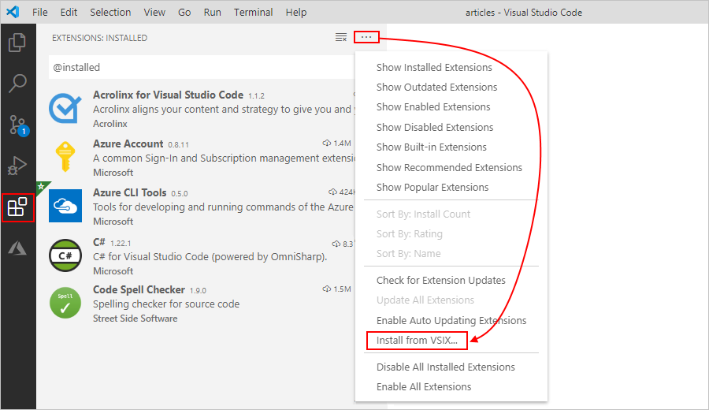
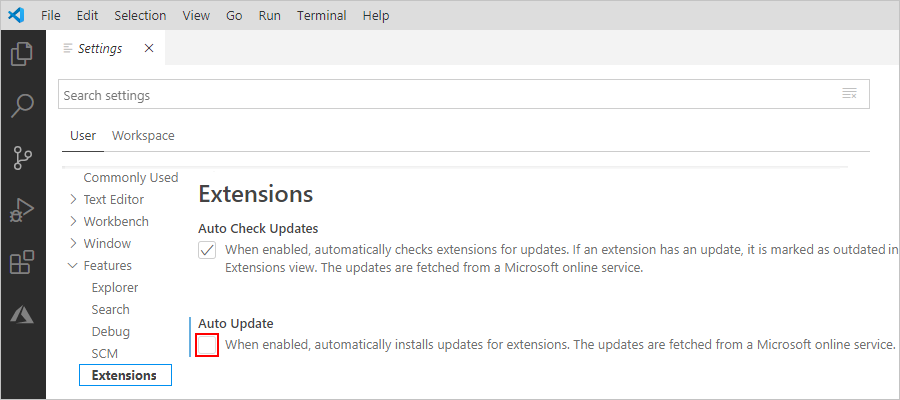
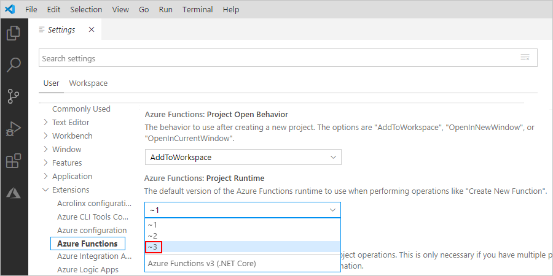

# Create stateless and stateful workflows in Azure Logic Apps


* *Stateful*

  These workflows save the input and output for each action in external storage, which makes detailed review possible after each run finishes. Also, stateful workflows provide high resiliency if interruptions, such as outages, happen. After systems are restored, you can reconstruct a workflow run from the saved state and rerun the workflow to completion. Create stateful workflows when you need to preserve and reference data from previous events.

* *Stateless*

  These workflows only save the input and output for each action in memory, rather than in external storage. Stateless workflows offer faster performance with decreased response times, high throughput, and decreased running costs due to not persisting data. However, if interruptions, such as outages, happen, in-progress runs aren't automatically restored, so the caller needs to manually resubmit the interrupted runs. Create stateless workflows when you don't need to preserve or reference data from previous events.

  > [!TIP]
  > For easier debugging or if necessary, you can enable run history capability for stateless workflows.

## Prerequisites

* An Azure account and subscription. If you don't have a subscription, [sign up for a free Azure account](https://azure.microsoft.com/free/?WT.mc_id=A261C142F).

* Visual Studio Code Extension for Azure Logic Apps

* Azure Functions Core Tools, which you can install from these locations:<p>

  > [!NOTE]
  > If you previously installed the Azure Functions Core Tools, 
  > uninstall them first, or make sure that the PATH environment variable 
  > points at the appropriate version specified here.

  * [Win x64 (MSI)](https://functionscdn.azureedge.net/public/3.0.2569/func-cli-3.0.2569-x64.msi)
  * [Win x86 (MSI)](https://functionscdn.azureedge.net/public/3.0.2569/func-cli-3.0.2569-x86.msi)

* [C# extension for Visual Studio Code](https://marketplace.visualstudio.com/items?itemName=ms-dotnettools.csharp), which enables F5 functionality to run your workflow

* If you don't have the standalone Azure Storage Emulator, download and install the latest version. Before you can start, if you never used the emulator before, you need to initialize the emulator. You also need to have a local SQL DB, such as SQL Express, installed for the storage emulator to use. For more information, see [Use the Azure Storage emulator for development and testing](../storage/common/storage-use-emulator.md).

   Or, use [Azurite](https://github.com/Azure/Azurite/blob/master/README.md) instead?


## Set up environment

1. To install the preview Azure Logic Apps Extension for Azure Functions, follow these steps:

   > [!NOTE]
   > This version replaces any currently installed Azure Functions extension but preserves the capability to author Azure Functions.

   1. Download the preview Azure Logic Apps Extension for Azure Functions runtime to your local computer from this location:

   1. On the Visual Studio Code left toolbar, select **Extensions**. From the **Extensions** menu, select the ellipses (**...**) button > **Install from VSIX**.

      

1. Disable automatic updates for extensions in Visual Studio Code so that the preview extension isn't overwritten by the public extension when you restart Visual Studio Code.

   1. On the **File** menu, select **Preferences** > **Settings**.

   1. Under **User**, expand **Features**, and select **Extensions**.

   1. Under **Auto Update**, clear **When enabled, automatically installs updates for extensions. The updates are fetched from a Microsoft online service**.

      

1. After you install all the requirements, reload Visual Studio Code so that the extensions are correctly installed. Or, you can close and reopen Visual Studio Code.

1. Set Visual Studio Code to use Azure Functions Project Runtime version 3.

   1. On the **File** menu, select **Preferences** > **Settings**.

   1. Under **User**, expand **Extensions**, and select **Azure Functions**.

   1. Under **Azure Functions Project Runtime**, select **~3**.

      

1. If you have a previous version of the extension bundle, clean up any existing bundle binaries in this location:

   `%TEMP%\Functions\ExtensionBundles\Microsoft.Azure.Functions.ExtensionBundle.Workflows*`

1. For deployment to Azure, check that you can browse your app in the Azure portal by using the [preview URL](https://portal.azure.com/?websitesextension_workflowspreview=true).

## Deploy to Docker container

1. Build your project by running this command:

   `dotnet build -c release`

1. Publish your build by running this command:

   `dotnet publish`

1. Build a Docker container with a workflow by running this command:

   `docker build --tag local/workflowcontainer .`

   For example, here's a sample Docker file for a .NET workflow, but replace the <*storage-connection-string*> value with your connection string to Azure Storage:

   ```text
   FROM mcr.microsoft.com/azure-functions/dotnet:3.0.13614-appservice
   ENV AzureWebJobsStorage <storage-connection-string>
   ENV AzureWebJobsScriptRoot=/home/site/wwwroot \ AzureFunctionsJobHost__Logging__Console__IsEnabled=true
   COPY ./bin/Release/netcoreapp3.1/publish/ /home/site/wwwroot
   ```

1. Start the container by locally running this command:

   `docker run -p 8080:80 local/workflowcontainer`

1. To get the callback URL for the Request triggers, send this request:

   `POST /runtime/webhooks/flow/api/management/workflows/<workflow-name>/triggers/<trigger-name>/listCallbackUrl?api-version=2019-10-01-edge-preview&code={master-key}`

   The <*master-key*> value is defined in the storage account that you set for `AzureWebJobsStorage` in the file, "azure-webjobs-secrets/{deployment-name}/host.json", where you can find the value in this section:

   ```json
   {
     <...>
     "masterKey": {
        "name": "master",
        "value": "{master-key}",
        "encrypted": false
     },
     <...>
   }
   ```

   For more information about the master key value, see [Using Docker Compose](https://github.com/Azure/azure-functions-docker/issues/84).

1. 
