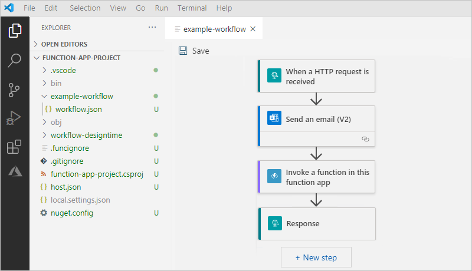
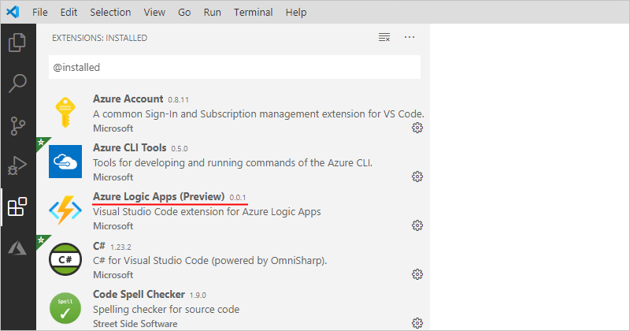
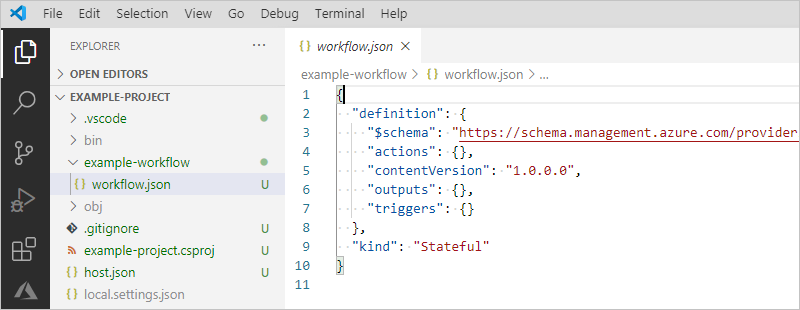
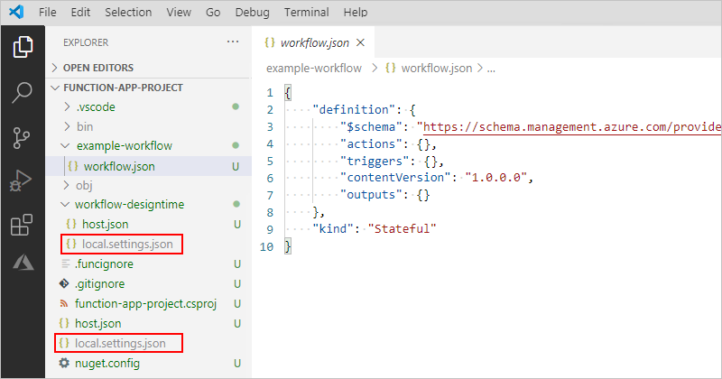
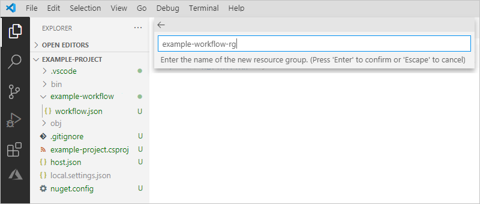
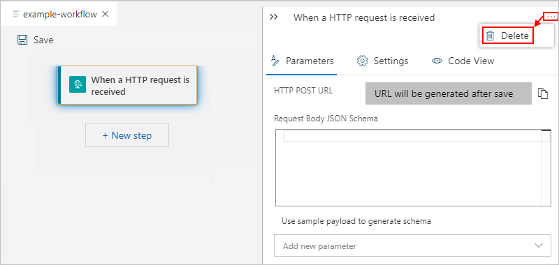
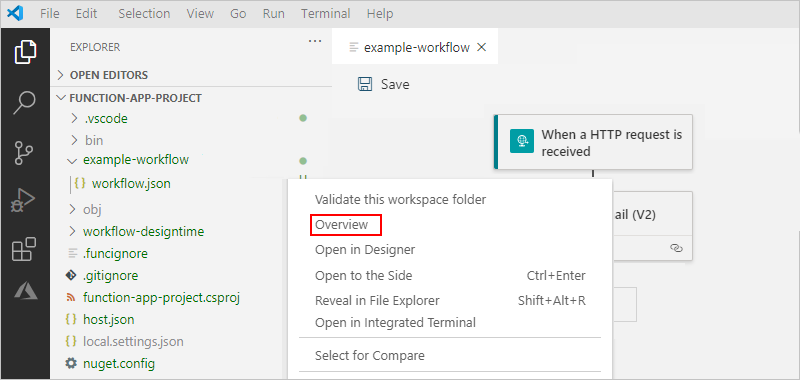
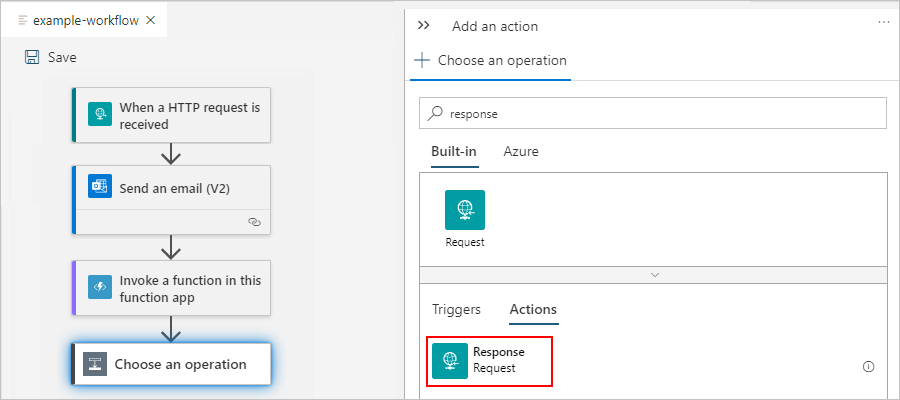
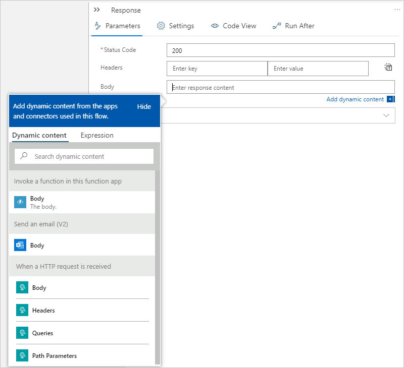
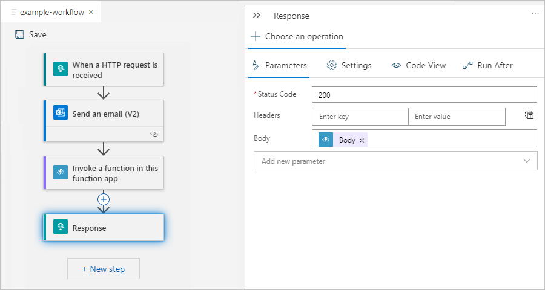

# Create stateful and stateless workflows by using Azure Logic Apps and Visual Studio Code (preview)

> [!IMPORTANT]
> This capability is currently in public preview. This preview version is provided without a service level agreement and 
> isn't recommended for production workloads. Certain features might not be supported or might have constrained capabilities. 
> For more information, see [Supplemental Terms of Use for Microsoft Azure Previews](https://azure.microsoft.com/support/legal/preview-supplemental-terms/).

When you use Visual Studio Code and the public preview Azure Logic Apps for Visual Studio Code extension, you can build [*stateful* and *stateless* Logic Apps workflows](#stateful-stateless) that are powered by the [Azure Functions](../azure-functions/functions-overview.md) runtime.



This article provides a high-level overview about stateful and stateless workflows, how to create workflows by using this public preview extension, and how to publish or deploy these workflows directly from Visual Studio Code.

> [!NOTE]
> If you created workflows using the earlier preview for the Azure Logic Apps extension, 
> these workflows no longer work with the public preview version. However, you can create a new 
> project using the public preview extension and copy the workflow definitions into your new project.

<a name="whats-new"></a>

## What's in this preview?

This preview extension brings many current and additional Logic Apps capabilities to your local development experience in Visual Studio Code, for example:

* Integrate your workflows by choosing from [hundreds of managed connectors](/connectors/connector-reference/connector-reference-logicapps-connectors.md) for Software-as-a-Service (SaaS) and Platform-as-a-Service (PaaS) apps and services along with managed connectors for on-premises systems.

  * Some managed connectors, such as Azure Service Bus, Azure Event Hubs, and SQL Server, run similarly to built-in native triggers and actions, for example, Azure Functions and Azure API Management.

  * Create and deploy workflows that can run anywhere because Azure Logic Apps generates Shared Access Signature (SAS) connection strings that these workflows can use for sending requests to the cloud connection runtime endpoint. Logic Apps saves these connection strings with other application settings so that you can easily store these values in Azure Key Vault when you deploy to Azure.

* Create stateless workflows that respond faster, have higher throughput, and cost less to run because run histories and data between actions don't persist in external storage. Optionally, you can enable run history for easier debugging. For more information, see [Stateful versus stateless workflows](#stateful-stateless).

* Test your workflows using your local development environment in Visual Studio Code.

* Publish and deploy your workflows directly from Visual Studio Code to multiple hosting environments, such as Azure App Service, Azure function apps, or as [Docker containers that you can run anywhere](/dotnet/architecture/microservices/container-docker-introduction/docker-defined).

<a name="stateful-stateless"></a>

## Stateful versus stateless workflows

* *Stateful*

  Create stateful workflows when you need to keep, review, or reference data from previous events. These workflows save the input and output for each action in external storage, which makes run details and history review possible after each run finishes. Stateful workflows provide high resiliency if or when outages happen. After services and systems are restored, you can reconstruct interrupted workflow runs from the saved state and rerun the workflows to completion.

* *Stateless*

  Create stateless workflows when you don't need to keep, review, or reference data from previous events. These workflows save the input and output for each action only in memory, rather than in external storage. Stateless workflows provide faster performance with quicker response times, higher throughput, and reduced running costs because run details and history aren't kept. However, if or when outages happen, interrupted runs aren't automatically restored, so the caller needs to manually resubmit interrupted runs. For easier debugging, you can [enable run history](#run-history) for stateless workflows.

  > [!NOTE]
  > Stateless workflows currently support only actions and not triggers for [managed connectors](../connectors/apis-list.md#connector-types). 
  > For more information, see [Azure Triggers - GitHub Issue #136](https://github.com/Azure/logicapps/issues/136).

For information about how nested workflows behave differently between stateful and stateless workflows, see [Nested workflow behavior differences between stateful and stateless workflows](#nested-workflow-behavior).

## Prerequisites

* An Azure account and subscription. If you don't have a subscription, [sign up for a free Azure account](https://azure.microsoft.com/free/?WT.mc_id=A261C142F).

* Access to the internet so that you can download the requirements and sign in to your Azure account.

* [Visual Studio Code 1.30.1 (January 2019) or higher](https://code.visualstudio.com/), which is free. Also, download and install these additional tools for Visual Studio Code:

  * [Azure Functions Core Tools 3.0.2569 or higher](../azure-functions/functions-run-local.md). If you have an earlier installation, uninstall that version first, or make sure that the PATH environment variable points at the appropriate version specified here after you download and install the core tools:

    * [Win x64 (MSI)](https://functionscdn.azureedge.net/public/3.0.2569/func-cli-3.0.2569-x64.msi)

    * [Win x86 (MSI)](https://functionscdn.azureedge.net/public/3.0.2569/func-cli-3.0.2569-x86.msi)

  * [C# for Visual Studio Code extension](https://marketplace.visualstudio.com/items?itemName=ms-vscode.csharp), which enables F5 functionality to run your workflow

  * [Azure Logic Apps (Preview) extension for Visual Studio Code](https://go.microsoft.com/fwlink/p/?linkid=2143167). This public preview extension provides the capability for you to create stateless and stateful workflows by using Visual Studio Code.

    > [!IMPORTANT]
    > If you installed or have the private preview extension, uninstall this version first and delete these related items:
    >
    > * The `Microsoft.Azure.Functions.ExtensionBundle.Workflows` folder, which contains previous extension bundles and is located in this folder:
    >
    >   `C:\Users\<username>\AppData\Local\Temp\Functions\ExtensionBundles`
    >
    > * The `microsoft.azure.workflows.webjobs.extension` folder, which is the [NuGet](/nuget/what-is-nuget) cache for the private preview extension and is located in this folder:
    >
    >   `C:\Users\<username>\.nuget\packages`

    You can install the extension either directly from the [Visual Studio Code Marketplace](https://go.microsoft.com/fwlink/p/?linkid=2143167), or you can follow these steps to install from within Visual Studio Code:

    <!---
    Need official download URL: (https://marketplace.visualstudio.com/items?itemName=ms-azuretools.vscode-azurelogicapps)
    --->

    1. In Visual Studio Code, on the left toolbar, select **Extensions**.

    1. In the **Extensions** pane's search box, enter `azure logic apps preview`. From the results, select **Azure Logic Apps (Preview)**.

       <!---
       
       --->

       After the installation completes, the preview extension appears in **Extensions: Installed** list.

       

* Based on the operating system where you are running Visual Studio Code, set up the corresponding storage requirement:

  **Mac OS**

  1. Sign in to the [Azure portal](https://portal.azure.com).
  
  1. [Create an Azure Storage account](../storage/common/storage-account-create.md?tabs=azure-portal), which is a [prerequisite for Azure Functions](../azure-functions/storage-considerations.md).

  1. [Find and copy the storage account's connection string](../storage/common/storage-account-keys-manage.md?tabs=azure-portal#view-account-access-keys), for example:

     `DefaultEndpointsProtocol=https;AccountName=fabrikamstorageaccount;AccountKey=<access-key>;EndpointSuffix=core.windows.net`

     

  1. Save the string somewhere safe so that you can later add the string to the `local.settings.json` files in the local project that you create for your workflow in Visual Studio Code.

     When you later try to open the Logic App Designer for your workflow, you get a message that the `Workflow design time could not be started`. After this message appears, you have to add the storage account's connection string to the two `local.settings.json` files in the project, and retry opening the designer again.

  **Windows or another OS**

  Download and install [Azure Storage Emulator 5.10](https://go.microsoft.com/fwlink/?LinkId=717179&clcid=0x409). To run the emulator, you also need to have a local SQL DB installation, such as the free [SQL Server 2019 Express Edition](https://go.microsoft.com/fwlink/?linkid=866658). For more information, see [Use the Azure Storage emulator for development and testing](../storage/common/storage-use-emulator.md).

  > [!IMPORTANT]
  > Before you create your workflow, make sure that you started and are running the emulator. 
  > Otherwise, when you try to open your workflow in the Logic App Designer, 
  > you get a message that the `Workflow design time could not be started`. For more 
  > information, see [Azure Storage Emulator Dependency - GitHub Issue #96](https://github.com/Azure/logicapps/issues/96).
  >
  > 

* Before you can connect to any services or systems in workflows that you build with Visual Studio Code, you have to first create these connections in the [Azure portal](https://portal.azure.com) by creating a logic app with the Logic App Designer.

  > [!IMPORTANT]
  > For these connections, make sure that you create a logic app that uses the same Azure subscription and 
  > region as the workflow that you plan to build in Visual Studio Code. After you create these connections, 
  > you can delete the logic app. Connections are Azure resources that exist separately from the logic app.

* To follow along with the example workflow that you create in this topic, you'll need an Office 365 Outlook email account where you sign in with a Microsoft work or school account.

  You can use a different [email service that's supported by Azure Logic Apps](/connectors/), such as Outlook.com or Gmail. If you use a different email service, the overall general steps are the same, but your user interface might differ slightly. For example, if you use Outlook.com, you'll use your personal Microsoft account to sign in.

  > [!IMPORTANT]
  > If you want to use the Gmail connector, only G-Suite business accounts can use this connector without restriction in Azure Logic Apps. 
  > If you have a Gmail consumer account, you can use this connector with only specific Google-approved services, or you can 
  > [create a Google client app to use for authentication with your Gmail connector](/connectors/gmail/#authentication-and-bring-your-own-application). 
  > For more information, see [Data security and privacy policies for Google connectors in Azure Logic Apps](../connectors/connectors-google-data-security-privacy-policy.md).

* To test the example workflow that you create in this doc, you need a tool that can send calls to the Request trigger that starts the example workflow. If you don't have such a tool, you can download and install [Postman](https://www.postman.com/downloads/).

## Set up your dev environment

After you install all the extensions, disable automatic extension updates for Visual Studio Code so that the preview extension isn't overwritten by the public extension when you restart Visual Studio Code.

1. In Visual Studio Code, on the **File** menu, select **Preferences** **>** **Settings**.

1. Under **User**, expand **Features**, and select **Extensions**.

1. Under **Auto Update**, clear **When enabled, automatically installs updates for extensions. The updates are fetched from a Microsoft online service**.

   

1. To make sure that all the extensions are correctly installed, reload or restart Visual Studio Code.

1. Set Visual Studio Code to use Azure Functions Project Runtime version 3.

   1. On the **File** menu, select **Preferences** **>** **Settings**.

   1. Under **User**, expand **Extensions**, and select **Azure Logic Apps**.

   1. Find the **Azurelogicappsv2: Project Runtime** setting, which specifies which [Azure Functions runtime](../azure-functions/functions-versions.md) to use. From the versions list, select **~3**.

      

1. For deployment to Azure, check that you can browse for your app in the Azure portal by using the [preview URL](https://portal.azure.com/?websitesextension_workflowspreview=true).

<a name="connect-azure-account"></a>

## Connect to your Azure account

1. On the Visual Studio Code toolbar, select the Azure icon.

   

1. In the Azure pane, under **Azure: Logic Apps (Preview)**, select **Sign in to Azure**. When the Microsoft sign-in page prompts you, sign in with your Azure account.

   

   After you sign in, the Azure pane shows your account's Azure subscriptions. If the expected subscriptions don't appear, or you want to view only specific subscriptions, follow these steps:

   1. Move your pointer over the first subscription in the list so that the **Select subscriptions** filter icon appears. Select the filter icon.

      

   1. From the list that appears, select the subscriptions that you want to appear, and select **OK**.

   > [!TIP]
   > Later, if Visual Studio Code signs you out from Azure, you're prompted to sign back in when necessary.

<a name="create-project"></a>

## Create a local project

Before you can create your workflow, create a local project in Visual Studio Code for deploying and managing your workflow.

1. Before you start, make sure that you close any open folders or files in Visual Studio Code.

1. In the Azure pane, next to **AZURE: LOGIC APPS (PREVIEW)**, select **Create New Project** (icon with folder and lightning bolt).

   

1. If Windows Defender Firewall prompts you to grant network access for `Code.exe`, which is Visual Studio Code, and `func.exe`, which is the Azure Functions Core Tools, select **Private networks, such as my home or work network** **>** **Allow access**.

1. Browse to the location where you want to save your project. Create a folder for your project, select that folder, and select **Select**.

   

1. From the templates list that appears, select either **Stateful Workflow** or **Stateless Workflow**. Provide a name for your workflow.

   This example selects **Stateful Workflow**.

   

1. Provide a name for your workflow and press Enter.

   This example uses `example-workflow` as the name.

   

1. From the next list that appears, select **Open in current window**.

   

   Visual Studio Code reloads, opens the Explorer pane, and shows your project, which includes automatically generated project files. For example, the project has a folder that's labeled with the workflow name. Inside this folder exists a `workflow.json` file, which stores your workflow's underlying JSON definition.

   

1. Download and add these NuGet files to your project's root folder:

     * `Microsoft.Azure.Workflows.WebJobs.Extension.1.0.0.1-preview.nupkg`
     * `nuget.config`

1. Expand the project folder for your workflow. Open the `workflow.json` file's shortcut menu, and select **Open in Designer**.

   

   If you get the error message that the `Workflow design time could not be started`, follow these steps based on the operating system that you use:

   **Mac OS**

   1. In your project, find and open the `local.settings.json` files, which are in your project's root folder and the `workflow-designtime` folder.

      

   1. In each file, find the `AzureWebJobsStorage` property, for example:

      ```json
      {
        "IsEncrypted": false,
        "Values": {
          "AzureWebJobsStorage": "UseDevelopmentStorage=true",
          "FUNCTIONS_WORKER_RUNTIME": "dotnet",
          "FUNCTIONS_EXTENSIONBUNDLE_SOURCE_URI": "https://workflowscdn.azureedge.net/2020-05-preview"
        }
      }
      ```

   1. Replace the `AzureWebJobsStorage` property value with the connection string that you saved earlier from your storage account, for example:

      ```json
      {
        "IsEncrypted": false,
        "Values": {
          "AzureWebJobsStorage": "DefaultEndpointsProtocol=https;AccountName=fabrikamstorageaccount;AccountKey=<access-key>;EndpointSuffix=core.windows.net",
          "FUNCTIONS_WORKER_RUNTIME": "dotnet",
          "FUNCTIONS_EXTENSIONBUNDLE_SOURCE_URI": "https://workflowscdn.azureedge.net/2020-05-preview"
        }
      }
      ```

   1. Save your changes, and try reopening the `workflow.json` file in the designer.

   **Windows or another OS**

   * Make sure that the Azure Storage Emulator is running. For more information, see 
   [Azure Storage Emulator Dependency - GitHub Issue #96](https://github.com/Azure/logicapps/issues/96).

   **Additional troubleshooting**

   In Visual Studio Code, check the output from the preview extension.

   1. From the **View** menu, select **Output**.

   1. From the list on the **Output** title bar, select **Azure Logic Apps** so that you can view the output for the preview extension, for example:

      

   1. Review the output and check whether this error message appears:

      ```text
      A host error has occurred during startup operation '<operation-ID>'.
      System.Private.CoreLib: The file 'C:\Users\<your-username>\AppData\Local\Temp\Functions\
      ExtensionBundles\Microsoft.Azure.Functions.ExtensionBundle.Workflows\1.1.1\bin\
      DurableTask.AzureStorage.dll' already exists.
      Value cannot be null. (Parameter 'provider')
      Application is shutting down...
      Initialization cancellation requested by runtime.
      Stopping host...
      Host shutdown completed.
      ```

      This error can happen if you previously tried to open the designer, and then discontinued or deleted your project. To resolve this error, delete the `ExtensionBundles` folder at this location `...\Users\<your-username>\AppData\Local\Temp\Functions\ExtensionBundles`, and retry opening the `workflow.json` file in the designer.

1. From the **Enable connectors in Azure** list, select **Use connectors from Azure**, which applies to all managed connectors that are available in the Azure portal, not only connectors for Azure services.

   

   > [!NOTE]
   > Stateless workflows currently support only actions and not triggers for [managed connectors](../connectors/apis-list.md#connector-types). 
   > For more information, see [Azure Triggers - GitHub Issue #136](https://github.com/Azure/logicapps/issues/136).

1. From the resource groups list, select **Create new resource group**.

   

1. Provide a name for the resource group, and press Enter. This example uses `example-workflow-rg`.

   

1. From the locations list, find and select the Azure region to use for your resource group and resources. This example uses **West Central US**.

   

   After you perform this step, Visual Studio Code opens the Logic App Designer.

   > [!NOTE]
   > When Visual Studio Code starts the workflow design-time API, a message appears that 
   > startup might take a few seconds. You can ignore this message or select **OK**.

   After the Logic App Designer appears, the **Choose an operation** prompt appears on the designer and is selected by default, which shows the **Add an action** pane.

   

1. Next, [add a trigger and actions](#add-trigger-actions) to your workflow.

<a name="add-trigger-actions"></a>

## Add a trigger and actions

After you open the Logic App Designer from your `workflow.json` file's shortcut menu, the **Choose an operation** prompt appears on the designer and is selected by default. You can now start creating your workflow by adding a trigger and actions.

The workflow in this example uses this trigger and these actions:

* The built-in [Request trigger](../connectors/connectors-native-reqres.md), **When a HTTP request is received**, which receives inbound calls or requests and creates an endpoint that other services or logic apps can call.

* The [Office 365 Outlook action](../connectors/connectors-create-api-office365-outlook.md), **Send an email**.

  > [!IMPORTANT]
  > For connections that you want to use in workflow built with Visual Studio Code, you have 
  > to first create these connections by using the Logic App Designer in Azure portal. Make sure that 
  > you create these connections in a logic app that uses the same Azure subscription and region as 
  > the workflow that you build in Visual Studio Code. After you create the connections, you can 
  > delete the logic app. Connections are Azure resources that exist separately from the logic app.

* The built-in [Response action](../connectors/connectors-native-reqres.md), which you use to send a reply and return data back to the caller.

### Add the Request trigger

1. Next to the designer, in the **Add a trigger** pane, under the **Choose an operation** search box, make sure that **Built-in** is selected so that you can select a trigger that runs natively.

1. In the **Choose an operation** search box, enter `when a http request`, and select the built-in Request trigger that's named **When a HTTP request is received**.

   

   When the trigger appears on the designer, the trigger's details pane opens to show the trigger's properties, settings, and other actions.

   

   > [!TIP]
   > If the details pane doesn't appear, makes sure that the trigger is selected on the designer.

1. If you have to delete an item on the designer, follow these steps:

   1. On the designer, select the item.

   1. In the item's details pane that opens to the right side, select the ellipses (**...**) button **>** **Delete**. To confirm the deletion, select **OK**.

      

### Add the Office 365 Outlook action

1. On the designer, under the trigger that you added, select **New step**.

   The **Choose an operation** prompt appears on the designer, and the **Add an action pane** reopens so that you can select the next action.

1. On the **Add an action** pane, under the **Choose an operation** search box, select **Azure** so that you can find and select an action for a managed connector that's deployed in Azure.

   This example selects and uses the Office 365 Outlook action, **Send an email (V2)**.

   

1. On the designer, if the Office 365 Outlook action doesn't appear selected, select that action.

1. On the action's details pane that appears, select **Sign in** so that you can create a connection to your email account.

   

1. When Visual Studio Code prompts you for consent to access your email account, select **Open**.

   

   > [!TIP]
   > To prevent future prompts, select **Configure Trusted Domains** 
   > so that you can add the authentication page as a trusted domain.

1. Follow the subsequent prompts to sign in, allow access, and allow returning to Visual Studio Code.

   > [!NOTE]
   > If too much time passes before you complete the prompts, the authentication process times out and fails. 
   > In this case, return to the designer and retry signing in to create the connection.

1. When the Azure Logic Apps preview extension prompts you for consent to access your email account, select **Open**. Follow the subsequent prompt to allow access.

   

   > [!TIP]
   > To prevent future prompts, select **Don't ask again for this extension**.

1. On the designer, if the **Send an email** action doesn't appear selected, select that action.

1. On the action's details pane, on the **Parameters** tab, provide the required information for the action, for example:

   

   | Property | Required | Value | Description |
   |----------|----------|-------|-------------|
   | **To** | Yes | <*your-email-address*> | The email recipient, which can be your email address for test purposes. This example uses the fictitious email, `sophiaowen@fabrikam.com`. |
   | **Subject** | Yes | `An email from your example workflow` | The email subject |
   | **Body** | Yes | `Hello from your example workflow!` | The email body content |
   ||||

1. On the designer, select **Save**.

Next, debug and test your workflow locally in Visual Studio Code.

<a name="debug-test-workflow-locally"></a>

## Debug and test your workflow

1. To help you more easily debug a stateless workflow, you can [enable the run history for that workflow](#run-history).

1. On the Visual Studio Code toolbar, on the **Run** menu, select **Start Debugging** (F5).

   The **Terminal** window opens so that you can review the debugging session.

1. Now, find the callback URL for the endpoint on the Request trigger.

   1. Reopen the Explorer pane so that you can view your project.

   1. From the `workflow.json` file's shortcut menu, select **Overview**.

      

   1. Find the **Callback URL** value, which looks similar to this URL for the example Request trigger:

      `http://localhost:7071/api/<workflow-name>/triggers/manual/invoke?api-version=2020-05-01-preview&sp=%2Ftriggers%2Fmanual%2Frun&sv=1.0&sig=<shared-access-signature>`

      

1. To test the callback URL by triggering the workflow, open [Postman](https://www.postman.com/downloads/) or your preferred tool for creating and sending requests.

   This example continues by using Postman. For more information, see [Postman Getting Started](https://learning.postman.com/docs/getting-started/introduction/).

   1. On the Postman toolbar, select **New**.

      

   1. On the **Create New** pane, under **Building Blocks**, select **Request**.

   1. In the **Save Request** window, under **Request name**, provide a name for the request, for example, `Test workflow trigger`.

   1. Under **Select a collection or folder to save to**, select **Create Collection**.

   1. Under **All Collections**, provide a name for the collection to create for organizing your requests, press Enter, and select **Save to <*collection-name*>**. This example uses `Logic Apps requests` as the collection name.

      Postman's request pane opens so that you can send a request to the callback URL for the Request trigger.

      

   1. Return to Visual Studio Code. from the workflow's overview page, copy the **Callback URL** property value.

   1. Return to Postman. On the request pane, next the method list, which currently shows **GET** as the default request method, paste the callback URL that you previously copied in the address box, and select **Send**.

      

      The example workflow sends an email that appears similar to this example:

      

1. In Visual Studio Code, return to your workflow's overview page.

   After the request that you sent triggers the workflow, the overview page shows the workflow's run history.

   

   > [!TIP]
   > If the run history doesn't appear, try refreshing the overview page by selecting **Refresh**.

1. To view details for a specific run, select the ellipses (**...**) button for that run, and select **Show Run**.

   

   Visual Studio Code shows the run history details for each action.

1. To view the raw inputs and outputs for a trigger or action, expand the step that you want to inspect, and select **Show raw inputs** or **Show raw outputs**.

   

1. To stop the debugging session, on the **Run** menu, select **Stop Debugging** (Shift + F5).

<a name="return-response"></a>

## Return a response to the caller

To send a response back to the caller of your workflow, add the built-in [Response action](../connectors/connectors-native-reqres.md).

1. On the Logic App Designer, under the **Send an email** action, select **New step**.

   The **Choose an operation** prompt appears on the designer, and the **Add an action pane** reopens so that you can select the next action.

1. On the **Add an action** pane, under the **Choose an action** search box, make sure that **Built-in** is selected. In the search box, enter `response`, and select the **Response** action.

   

1. On the designer, select the **Response** action so that the action's details pane appears.

   

1. On the **Parameters** tab, provide the required information for the function that you want to call.

   This example returns the **Body** property value that's output from the **Send an email** action.

   1. Click inside the **Body** property box so that the dynamic content list appears and shows the available output values from the preceding trigger and actions in the workflow.

      

   1. In the dynamic content list, under **Send an email**, select **Body**.

      

      When you're done, the Response action's **Body** property is now set to the **Send an email** action's **Body** output value.

      

1. On the designer, select **Save**.

<a name="publish-to-function-app"></a>

## Publish to function app in Azure

You can publish your project in Visual Studio Code directly to Azure. This process either creates a function app and the related resources, such as an Azure storage account, in your Azure subscription or deploys to an existing function app.

* If you publish to a new function app in Azure, you're offered both a quick creation path and an advanced creation path for your function app. This path automatically creates an Azure storage account for your function app.

* If you publish to an existing function app in Azure, you overwrite the contents for that app in Azure. To enable the workflow's run history when you deploy to a function app, follow these steps:

  1. In the [Azure portal](https://portal.azure.com), find and select your function app.

  1. On the function app's menu, under **API**, select **CORS**.

  1. On the **CORS** pane, under **Allowed Origins**, add the wildcard character (*).

  1. When you're done, on the **CORS** toolbar, select **Save**.

     For more information, see [Run history of function apps - GitHub Issue #104](https://github.com/Azure/logicapps/issues/104).

<a name="deploy-to-docker"></a>

## Deploy to Docker container

By using the .NET Core command-line interface (CLI), you can build a [Docker container](/visualstudio/docker/tutorials/docker-tutorial#what-is-a-container) for deploying your workflow.

1. To build your project, open a command-line prompt, and run this command:

   `dotnet build -c release`

1. Publish your build by running this command:

   `dotnet publish`

1. Build a Docker container with a workflow by running this command:

   `docker build --tag local/workflowcontainer .`

   For example, here's a sample Docker file for a .NET workflow, but replace the <*storage-account-connection-string*> value with your Azure storage account's connection string:

   ```text
   FROM mcr.microsoft.com/azure-functions/dotnet:3.0.13614-appservice
   ENV AzureWebJobsStorage <storage-account-connection-string>
   ENV AzureWebJobsScriptRoot=/home/site/wwwroot \ AzureFunctionsJobHost__Logging__Console__IsEnabled=true
   COPY ./bin/Release/netcoreapp3.1/publish/ /home/site/wwwroot
   ```

1. Start the container by locally running this command:

   `docker run -p 8080:80 local/workflowcontainer`

1. To get the callback URL for the Request trigger, send this request:

   `POST /runtime/webhooks/flow/api/management/workflows/<workflow-name>/triggers/<trigger-name>/listCallbackUrl?api-version=2019-10-01-edge-preview&code={master-key}`

   The <*master-key*> value is defined in the storage account that you set for `AzureWebJobsStorage` in the file, `azure-webjobs-secrets/<deployment-name>/host.json`, where you can find the value in this section:

   ```json
   {
     <...>
     "masterKey": {
        "name": "master",
        "value": "<master-key>",
        "encrypted": false
     },
     <...>
   }
   ```

   For more information about the master key value, see [Using Docker Compose - GitHub Issue #84](https://github.com/Azure/azure-functions-docker/issues/84).

For more information about creating and deploying Docker apps, see [Tutorial: Get started with Docker](/visualstudio/docker/tutorials/docker-tutorial).

<a name="run-history"></a>

## Run history for stateless workflows

To more easily debug a stateless workflow, you can enable the run history for that workflow, and then disable the run history when you're done.

### For a stateless workflow running in Visual Studio Code

If you are working on and running the stateless workflow locally in Visual Studio Code, follow these steps:

1. In your project, find and open the `workflow-designtime` folder.

1. In the `workflow-designtime` folder, open the `local.settings.json` file.

1. Add the `Workflow.<yourWorkflowName>.operationOptions` property and set the value to `WithStatelessRunHistory`, for example:

   **Mac OS**

   ```json
   {
      "IsEncrypted": false,
      "Values": {
         "AzureWebJobsStorage": "DefaultEndpointsProtocol=https;AccountName=fabrikamstorageaccount;AccountKey=<access-key>;EndpointSuffix=core.windows.net",
         "FUNCTIONS_WORKER_RUNTIME": "dotnet",
         "FUNCTIONS_EXTENSIONBUNDLE_SOURCE_URI": "https://workflowscdn.azureedge.net/2020-05-preview",
         "Workflow.<yourWorkflowName>.OperationOptions": "WithStatelessRunHistory"
      }
   }
   ```

   **Windows or other OS**

   ```json
   {
      "IsEncrypted": false,
      "Values": {
         "AzureWebJobsStorage": "UseDevelopmentStorage=true",
         "FUNCTIONS_WORKER_RUNTIME": "dotnet",
         "FUNCTIONS_EXTENSIONBUNDLE_SOURCE_URI": "https://workflowscdn.azureedge.net/2020-05-preview",
         "Workflow.<yourWorkflowName>.OperationOptions": "WithStatelessRunHistory"
      }
   }
   ```

1. To disable the run history when you're done, either delete the `Workflow.<yourWorkflowName>.OperationOptions` property and its value, or set the property to `None`.

### For a stateless workflow running in the Azure portal

If you already deployed your project to the Azure portal, follow these steps:

1. In the [Azure portal](https://portal.azure.com), find and open your function app.

1. On the function app menu, under **Settings**, select **Configuration**.

1. Under **Application Settings**, select **New application setting**.

1. On the **Add/Edit application setting** pane, in the **Name** box, enter this string, `Workflow.<yourWorkflowName>.OperationOptions`.

1. In the **Value** box, enter `WithStatelessRunHistory`. When you're done, select **OK**.

<a name="nested-workflow-behavior"></a>

## Nested workflow differences between stateful and stateless

You can [make a workflow callable](../logic-apps/logic-apps-http-endpoint.md) by other workflows by using the [Request](../connectors/connectors-native-reqres.md) trigger, [HTTP Webhook](../connectors/connectors-native-webhook.md) trigger, or managed connector triggers that have the [ApiConnectionWehook type](../logic-apps/logic-apps-workflow-actions-triggers.md#apiconnectionwebhook-trigger) and can receive HTTPS requests.

Here are the behavior patterns that nested workflows can follow after a parent workflow calls a child workflow:

* Asynchronous polling pattern

  The parent doesn't wait for a response to their initial call, but continually checks the child's run history until the child finishes running. By default, stateful workflows follow this pattern, which is ideal for long-running child workflows that might exceed [request timeout limits](../logic-apps/logic-apps-limits-and-config.md).

* Synchronous pattern ("fire and forget")

  The child acknowledges the call by immediately returning a `202 ACCEPTED` response, and the parent continues to the next action without waiting for the results from the child. Instead, the parent receives the results when the child finishes running. Child stateful workflows that don't include a Response action always follow the synchronous pattern. For child stateful workflows, the run history is available for you to review.

  To enable this behavior, in the workflow's JSON definition, set the `OperationOptions` property to `DisableAsyncPattern`. For more information, see [Trigger and action types - Operation options](../logic-apps/logic-apps-workflow-actions-triggers.md#operation-options).

* Trigger and wait

  For a child stateless workflow, the parent waits for a response that returns the results from the child. This pattern works similar to using the built-in [HTTP trigger or action](../connectors/connectors-native-http.md) to call a child workflow. Child stateless workflows that don't include a Response action immediately return a `202 ACCEPTED` response, but the parent waits for the child to finish before continuing to the next action. These behaviors apply only to child stateless workflows.

This table specifies the child workflow's behavior based on whether the parent and child are stateful, stateless, or are mixed workflow types:

| Parent workflow | Child workflow | Child behavior |
|-----------------|----------------|----------------|
| Stateful | Stateful | Asynchronous or synchronous with `operationOptions=DisableSynPattern` setting |
| Stateful | Stateless | Trigger and wait |
| Stateless | Stateful | Synchronous |
| Stateless | Stateless | Trigger and wait |
||||

## Known issues

* Stateless workflows currently support only actions and not triggers for [managed connectors](../connectors/apis-list.md#connector-types). For more information, see [Azure Triggers - GitHub Issue #136](https://github.com/Azure/logicapps/issues/136).

* In Visual Studio Code, no scrollbar appears when you try to zoom in or zoom out. (**View** menu **>** **Appearance** **>** **Zoom In** or **Zoom Out**. Or, press **Ctrl** + **=** or **Ctrl** + **-**). So, you can't view any content that appears off the screen.

  * To restore the original view on the designer, reset the zoom level. (**View** menu **>** **Appearance** **>** **Reset Zoom**. Or, press **Ctrl** + **NumPad0**)

  * To change the zoom level on the designer canvas alone, use the Logic App Designer's zoom controls instead. **+ 100% -** zoom control

* In Visual Studio Code, when you are working in the Logic App Designer, and you have the details pane open for a trigger or action, any changes that you make in the **Settings**, **Run After**, or **Static Result** tab don't persist if you don't select **Done** before you switch tabs or select another item on the designer.

  Make sure that you commit your changes before you switch tabs or focus on the designer. Otherwise, Visual Studio Code won't keep your changes.

## Next steps

For more information, bugs, questions, or suggestions about the preview extension, please [post them on the issues board in the GitHub repo for Logic Apps Preview](https://github.com/Azure/logicapps/issues) by using the `preview` label plus these labels as appropriate: `bug`, `question`, or `enhancement`