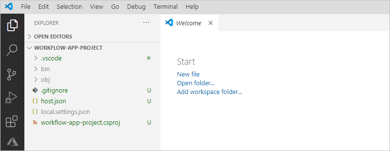
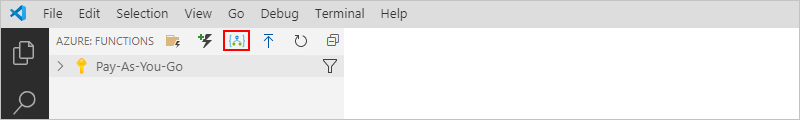

# Create stateful and stateless workflows by using Azure Logic Apps and Visual Studio Code


## What are stateful and stateless?

* *Stateful*

  These workflows save the input and output for each action in external storage, which makes detailed review possible after each run finishes. Also, stateful workflows provide high resiliency if interruptions, such as outages, happen. After systems are restored, you can reconstruct a workflow run from the saved state and rerun the workflow to completion. Create stateful workflows when you need to preserve and reference data from previous events.

* *Stateless*

  These workflows only save the input and output for each action in memory, rather than in external storage. Stateless workflows offer faster performance with decreased response times, high throughput, and decreased running costs due to not persisting data. However, if interruptions, such as outages, happen, in-progress runs aren't automatically restored, so the caller needs to manually resubmit the interrupted runs. Create stateless workflows when you don't need to preserve or reference data from previous events.

  > [!TIP]
  > For easier debugging or if necessary, you can enable run history capability for stateless workflows.

## Prerequisites

* An Azure account and subscription. If you don't have a subscription, [sign up for a free Azure account](https://azure.microsoft.com/free/?WT.mc_id=A261C142F).

* Access to the internet so that you can download the requirements and sign in to your Azure account

* Download and install these tools:

  * [Visual Studio Code version 1.25.1 or later](https://code.visualstudio.com/), which is free

  * [C# for Visual Studio Code extension](https://marketplace.visualstudio.com/items?itemName=ms-dotnettools.csharp), which enables F5 functionality to run your workflow

  * Azure Functions Core Tools 3.0.2569. If you have an earlier installation, uninstall that version first, or make sure that the PATH environment variable points at the appropriate version specified here after you download and install the tools:

    * [Win x64 (MSI)](https://functionscdn.azureedge.net/public/3.0.2569/func-cli-3.0.2569-x64.msi)

    * [Win x86 (MSI)](https://functionscdn.azureedge.net/public/3.0.2569/func-cli-3.0.2569-x86.msi)

  * [Azure Storage Emulator 5.10](https://go.microsoft.com/fwlink/?LinkId=717179&clcid=0x409). The emulator also requires that you have a local SQL DB installation, such as the free [SQL Server 2019 Express Edition](https://go.microsoft.com/fwlink/?linkid=866658), for the emulator to use. For more information, see [Use the Azure Storage emulator for development and testing](../storage/common/storage-use-emulator.md).

    > [!IMPORTANT]
    > Before you create your workflow, make sure that you start the emulator.
    >
    > 

  * [Azure Functions for Visual Studio Code 0.22.1-alpha (ZIP)](https://workflowscdn.azureedge.net/2020-05-preview/VsExtension/LogicAppsVSCodeExtension-0.22.1-alpha.zip)

    This public preview extension provides the capability for you to create stateless and stateful workflow apps and replaces any currently installed Azure Functions extension but preserves the capability to author Azure Functions.

    1. Download the ZIP file to your local computer and extract file.

    1. In Visual Studio Code, on the left toolbar, select **Extensions**. From the **Extensions** menu, select the ellipses (**...**) button > **Install from VSIX**.

       

After you install all the requirements, disable automatic extension updates for Visual Studio Code so that the preview extension isn't overwritten by the public extension when you restart Visual Studio Code.

1. In Visual Studio Code, on the **File** menu, select **Preferences** > **Settings**.

1. Under **User**, expand **Features**, and select **Extensions**.

1. Under **Auto Update**, clear **When enabled, automatically installs updates for extensions. The updates are fetched from a Microsoft online service**.

   

## Set up environment

1. To make sure that all the extensions are correctly installed, reload or restart Visual Studio Code.

1. Set Visual Studio Code to use Azure Functions Project Runtime version 3.

   1. On the **File** menu, select **Preferences** > **Settings**.

   1. Under **User**, expand **Extensions**, and select **Azure Functions**.

   1. Under **Azure Functions Project Runtime**, select **~3**.

      

1. If you have a previous version of the extension bundle, clean up any existing bundle binaries in this location:

   `%TEMP%\Functions\ExtensionBundles\Microsoft.Azure.Functions.ExtensionBundle.Workflows*`

1. For deployment to Azure, check that you can browse for your app in the Azure portal by using the [preview URL](https://portal.azure.com/?websitesextension_workflowspreview=true).

## Connect to your Azure account

1. On the Visual Studio Code toolbar, select the Azure icon.

   

1. In the Azure pane, under **Azure: Functions**, select **Sign in to Azure**. When the Microsoft sign-in page prompts you, sign in with your Azure account.

   

   After you sign in, the Azure pane shows the Azure subscriptions that are associated with your account. However, if the Azure pane doesn't show the subscriptions that you expect, or you want to view only specific subscriptions, follow these steps:

   1. Move your pointer over the first subscription in the list so that the **Select subscriptions** filter icon appears. Select the filter icon.

      

   1. From the list that appears, select the subscriptions that you want to appear, and select **OK**.

   > [!TIP]
   > Later, if Visual Studio Code signs you out from Azure, you're prompted to sign back in when necessary.

## Create workflow app project

1. Before you start, make sure that you close any open folders or files in Visual Studio Code.

1. In the Azure pane, next to **Azure: Functions**, select **Create new project**.

   

1. Browse to the location where you want to save your project. Create a folder for your project, select that folder, and select **Select**.

   

1. From the languages list that appears, select **C#**.

   

1. From the templates list that appears, select **Skip for now**.

   <!--
   
   -->

1. From the locations list, select **Open in current window**.

   <!--
   
   -->

   After Visual Studio Code reloads, the Explorer pane opens and shows your workflow app project.

   

Now, continue creating your workflow app.

## Create workflow app

1. On the Visual Studio Code toolbar, select the Azure icon to reopen the Azure pane.

1. In the Azure pane, next to **Azure: Functions**, select **Create workflow**.

   

1. From the templates list that appears, select either **Stateful Workflow** or **Stateless Workflow**. Provide a name for your workflow app. This example uses `example-workflow`.

   <!--
   
   -->

   In your project folder, Visual Studio Code adds a workflow app folder that has the specified name and a `workflow.json` file, which stores your workflow's JSON definition.

   

1. From the `workflow.json` file's shortcut menu, select **Open in Designer**.

   

   If Windows Defender Firewall prompts you to grant access for the `func.exe`, which is the Azure Functions Core Tools, select **Private networks, such as my home or work network** > **Allow access**.

   

   > [!NOTE]
   > If you get the message that `Workflow design time could not be started`, try these steps:
   >
   > * Make sure that Azure Storage Emulator is running.
   > * Close everything, restart your computer, reopen your workflow project, and reopen the `workflow.json` file in the designer.

1. From the **Enable connectors in Azure** list, select **Use connectors from Azure**.

   

1. From the resource groups list, select **Create new resource group**.

   

1. From the locations list, select the Azure region to use for your resource group and resources. This example uses **West Central US**.

   

   When Visual Studio Code starts the workflow design-time API, a message appears that startup might take a few seconds. You can ignore this message or select **OK**.

1. After the Logic App Designer appears, continue with the steps for either a stateful workflow or a [stateless workflow](#stateless-workflow).

   

<a name="stateful-workflow"></a>

## Create a stateful workflow

This example stateful workflow ...

1. In the designer search box, find and select this trigger: **When a HTTP request is received**

   

1. Under the trigger, select **Next step**.

1. Under the **Choose an action** search box, select **Azure**. Find and select the Office 365 Outlook action: **Send an email (V2)**

   

<a name="stateless-workflow"></a>

## Create a stateless workflow


### Enable run history for stateless workflows

In your workflow's JSON definition, set the `operationOptions` property inside the `runtimeConfiguration` object to `WithStatelessRunHistory`, for example:

```json
"runtimeConfiguration": {
   "operationOptions": "WithStatelessRunHistory"
}
```

## Test your workflow


## Deploy to Docker container

1. Build your project by running this command:

   `dotnet build -c release`

1. Publish your build by running this command:

   `dotnet publish`

1. Build a Docker container with a workflow by running this command:

   `docker build --tag local/workflowcontainer .`

   For example, here's a sample Docker file for a .NET workflow, but replace the <*storage-connection-string*> value with your connection string to Azure Storage:

   ```text
   FROM mcr.microsoft.com/azure-functions/dotnet:3.0.13614-appservice
   ENV AzureWebJobsStorage <storage-connection-string>
   ENV AzureWebJobsScriptRoot=/home/site/wwwroot \ AzureFunctionsJobHost__Logging__Console__IsEnabled=true
   COPY ./bin/Release/netcoreapp3.1/publish/ /home/site/wwwroot
   ```

1. Start the container by locally running this command:

   `docker run -p 8080:80 local/workflowcontainer`

1. To get the callback URL for the Request triggers, send this request:

   `POST /runtime/webhooks/flow/api/management/workflows/<workflow-name>/triggers/<trigger-name>/listCallbackUrl?api-version=2019-10-01-edge-preview&code={master-key}`

   The <*master-key*> value is defined in the storage account that you set for `AzureWebJobsStorage` in the file, "azure-webjobs-secrets/{deployment-name}/host.json", where you can find the value in this section:

   ```json
   {
     <...>
     "masterKey": {
        "name": "master",
        "value": "{master-key}",
        "encrypted": false
     },
     <...>
   }
   ```

   For more information about the master key value, see [Using Docker Compose](https://github.com/Azure/azure-functions-docker/issues/84).

1. 
