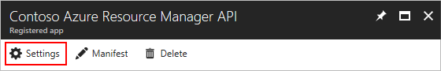
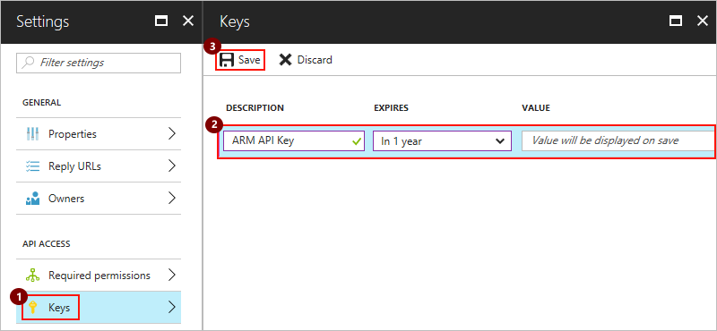
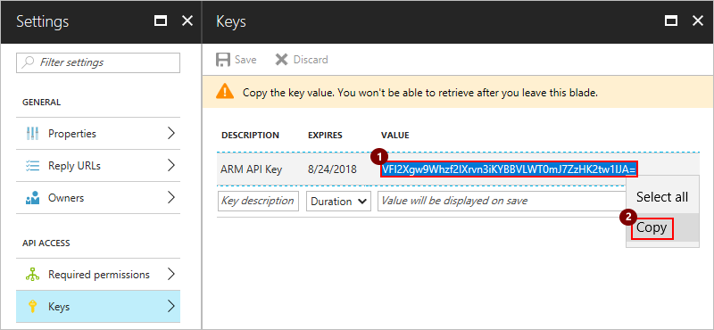

# Set up authentication for custom connectors with Azure Active Directory (Azure AD)

This tutorial shows how to add Azure AD authentication to custom connectors 
by using a Azure Resource Manager API as an example. 
Azure Resource Manager helps you manage the components for a solution 
that you've built in Azure, such as databases, virtual machines, and web apps. 
So, you might find a custom connector for Azure Resource Manager useful 
when you want to manage Azure resources from your logic app workflow. 
For more information, see [Azure Resource Manager Overview](../azure-resource-manager/resource-group-overview.md).

## Prerequisites

* An Azure subscription. If you don't have a subscription, 
you can start with a [free Azure account](https://azure.microsoft.com/free/). 
Otherwise, sign up for a [Pay-As-You-Go subscription](https://azure.microsoft.com/pricing/purchase-options/).

* For this tutorial, the [sample OpenAPI file for Azure Resource Manager](http://pwrappssamples.blob.core.windows.net/samples/AzureResourceManager.json)

  > [!NOTE] The sample OpenAPI file doesn't define all 
  > Azure Resource Manager operations and currently 
  > contains only the operation for [List all subscriptions](https://docs.microsoft.com/rest/api/resources/subscriptions#Subscriptions_List). 
  > You can edit this OpenAPI or create another OpenAPI file 
  > using the [online OpenAPI editor](http://editor.swagger.io/).
  >
  > You can apply this tutorial to any RESTful API 
  > where you want to use Azure AD authentication.

## Create your Azure AD app for authentication

First, create an Azure Active Directory (Azure AD) app that performs 
authentication when your custom connector calls the Azure Resource Manager API endpoint.

1. Sign in to the [Azure portal](https://portal.azure.com). 
If you have more than one Azure Active Directory tenant, 
confirm that you're signed in to the correct directory by 
checking the directory under your username. 

   

   > [!TIP]
   > To change directories, choose your user name so that you can 
   > select the directory that you want.

2. On the main Azure menu, choose **Azure Active Directory** 
so you can view your current directory.

   

   > [!TIP]
   > If the main Azure menu doesn't show **Azure Active Directory**, 
   > choose **More services**. In the **Filter** box, 
   > type "Azure Active Directory" as your filter, 
   > then choose **Azure Active Directory**.

3. On the directory menu, under **Manage**, choose **App registrations**. 
In the registered apps list, choose **+ New application registration**.

   

4. Under **Create**, provide a name for your Azure AD app, 
and keep **Application type** set to **Web app / API**. 
In the **Sign-on URL** box, type `https://login.windows.net`, 
and choose **Create**.  

   
 
   Now continue on so you can configure your Azure AD apps' settings. 

## Set up your Azure AD app's settings

1. In your directory's **App registrations** list, 
select your Azure AD app.

   

2. When the app's settings page appears, 
save the app's **Application ID** somewhere safe for later use.

   

3. Now provide a reply URL for the app. 
In the app's **Settings** menu, choose **Reply URLs**. 
Enter this URL, then choose **Save**: 

   `https://msmanaged-na.consent.azure-apim.net/redirect`

   

   > [!TIP]
   > If the **Settings** menu didn't previously appear, 
   > choose **Settings** here:
   >
   > 

4. Back in the **Settings** menu, choose **Required permissions** > **Add**.

   

5. When the **Add API access** menu opens, choose **Select an API** > 
**Azure Service Management API** > **Select**.

   

6. Back under **Add API access**, choose **Select permissions**. 
Under **Delegated permissions**, choose **Access Azure Service Management as organization users** > **Select**.

   

7. Back on the **Add API access** menu, choose **Done**.

   

8. Now add a *client key*, or "secret", for your Azure AD app. 

   1. Back on the **Settings** menu, choose **Keys**. 
   Provide a name for your key with 16 or fewer characters, 
   select an expiration period, and then choose **Save**.

      

   2. When your created key appears, immediately copy and save that key somewhere 
   safe for later use. *You can't retrieve the key after you close the **Keys** page.*
    
      

9. After saving your key, you can safely close the **Settings** menu.

## INTEGRATE CONTENT BELOW

## Set up authentication with Azure Active Directory

Now create two Azure Active Directory (Azure AD) apps in the Azure portal. 
One Azure AD app secures your Web API, while the other Azure AD app 
secures your custom connector registration and adds delegated access.
For more information, see [Authenticate custom connectors with Azure Active Directory](../logic-apps/logic-apps-custom-api-connector-azure-active-directory.md).

> [!IMPORTANT]
> Make sure both Azure AD apps exist in the same directory.

### First Azure AD app: Secure your Web API

Your first Azure AD app secures your Web API. 
With the specified settings in the table below, 
follow the steps for "Enable authentication in Azure Active Directory" 
in this tutorial: [Authenticate custom connectors](../logic-apps/logic-apps-custom-api-connector-azure-active-directory.md):

|Setting|Suggested value|Description| 
|:------|:--------------|:----------| 
|Azure AD app name|webAPI|The name for your first Azure AD app|
|**Sign-on URL**|`https://login.windows.net`|| 
|**Reply URLs**|`https://{your-web-app-root-URL}/.auth/login/aad/callback`||
|**Delegated permissions**|{not necessary}||  
|**Client key**|{not necessary}||
||||  

> [!IMPORTANT]
> Make sure that you copy and save the application ID safely for later use.

### Second Azure AD app: Secure custom connector registration and add delegated access

Your second Azure AD app secures your custom connector registration and 
adds delegated access to the Web API protected by the first Azure AD app. 

With the specified settings in the table below, 
repeat the steps for "Enable authentication in Azure Active Directory" 
in this tutorial: [Authenticate custom connectors](../logic-apps/logic-apps-custom-api-connector-azure-active-directory.md):

|Setting|Suggested value|Description| 
|:------|:--------------|:----------| 
|Azure AD app name|webAPI-customAPI|The name for your second Azure AD app|
|**Sign-on URL**|`https://login.windows.net`|| 
|**Reply URLs**|`https://msmanaged-na.consent.azure-apim.net/redirect`||
|**Delegated permissions**||Add permissions for delegated access to your Web API|  
|**Client key**|*generated-client-key*|Generate a client key, and store somewhere safe. You need this key for later.|
|||| 

> [!IMPORTANT]
> Make sure that you copy and save this application ID for later use too.

## Add authentication to your Web API app

Now turn on authentication for your Web API with your first Azure AD app.

1. Sign in to the [Azure portal](https://portal.azure.com), 
and find your Web API app that you deployed earlier in this tutorial.

2. Under **Settings**, choose **Authentication / Authorization**.

3. Turn on **App Service Authentication**, 
and select **Azure Active Directory**. 
On the next blade, choose **Express**.  

4. Now select the Azure AD app that your Web API app uses for authentication. 
Choose **Select Existing AD App** > **Azure AD App**. 

5. Under **Azure AD Applications**, select the **webAPI** Azure AD 
app that you created earlier. Choose **OK** until you return 
to the **Authentication / Authorization** page.

6. On the **Authentication / Authorization** page, 
choose **Save**.

Now your Web API app can use Azure AD for authentication.

4. Set up Azure AD authentication for the custom connector 
as described here:

   |Setting|Suggested value|Description| 
   |:------|:--------------|:----------| 
   |**Client ID**|*client-ID-for-webAPI-CustomAPI*|The client ID for your second Azure AD app| 
   |**Secret**|*client-key-for-webAPI-CustomAPI*|The client key for your second Azure AD app| 
   |**Login URL**|`https://login.windows.net`||
   |**ResourceUri**|*client-ID-for-webAPI*|The client ID for your first Azure AD app|  
   |||| 

## Set up your OpenAPI document to use Azure AD authentication

In your OpenAPI document, add the `securityDefintions` object and the 
Azure AD authentication for your Web API app to the **host** property: 
The **host** section should look like this example: 

``` json
// Your OpenAPI file header appears here...

"host": "{your-web-api-app-root-url}",
"schemes": [
    "https" // Make sure this is https!
],
"securityDefinitions": {
    "AAD": {
        "type": "oauth2",
        "flow": "accessCode",
        "authorizationUrl": "https://login.windows.net/common/oauth2/authorize",
        "tokenUrl": "https://login.windows.net/common/oauth2/token",
        "scopes": {}
    }
},

// Your OpenAPI document continues here...
```

## Next steps

* Register your connector in Azure Logic Apps