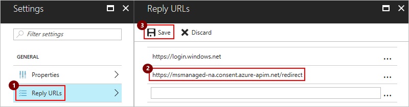

# Set up authentication for your connector with Azure Active Directory (Azure AD)

To secure calls between your API and custom connector, 
add Azure AD authentication to your Web API and your connector. 
For this scenario, you create two Azure Active Directory (Azure AD) apps - 
one Azure AD app secures your Web API, while the other Azure AD app 
secures your connector registration and adds delegated access. 

> [!IMPORTANT]
> Both Azure AD apps must exist in the same directory.

This tutorial uses an Azure Resource Manager API as an example. 
Azure Resource Manager helps you manage the components for a solution 
that you've built in Azure, such as databases, virtual machines, and web apps. 
A custom connector for Azure Resource Manager might be useful 
when you want to manage Azure resources from your workflows. 
For more information, see [Azure Resource Manager Overview](../azure-resource-manager/resource-group-overview.md).

## Prerequisites

* An Azure subscription. If you don't have a subscription, 
you can start with a [free Azure account](https://azure.microsoft.com/free/). 
Otherwise, sign up for a [Pay-As-You-Go subscription](https://azure.microsoft.com/pricing/purchase-options/).

* For this tutorial, the [sample OpenAPI file for Azure Resource Manager](https://pwrappssamples.blob.core.windows.net/samples/AzureResourceManager.json)

  > [!NOTE] The sample OpenAPI file doesn't define all 
  > Azure Resource Manager operations and currently 
  > contains only the operation for [List all subscriptions](https://docs.microsoft.com/rest/api/resources/subscriptions#Subscriptions_List). 
  > You can edit this OpenAPI or create another OpenAPI file 
  > using the [online OpenAPI editor](http://editor.swagger.io/).
  >
  > You can apply this tutorial to any RESTful API 
  > where you want to use Azure AD authentication.

## 1. Create your first Azure AD app for securing your Web API

Your first Azure AD app performs authentication when 
your custom connector calls your API, which is the 
Azure Resource Manager API in this example.

1. Sign in to the [Azure portal](https://portal.azure.com). 
If you have more than one Azure Active Directory tenant, 
confirm that you're signed in to the correct directory by 
checking the directory under your username. 

   

   > [!TIP]
   > To change directories, choose your user name so that you can 
   > select the directory that you want.

2. On the main Azure menu, choose **Azure Active Directory** 
so you can view your current directory.

   

   > [!TIP]
   > If the main Azure menu doesn't show **Azure Active Directory**, 
   > choose **More services**. In the **Filter** box, 
   > type "Azure Active Directory" as your filter, 
   > then choose **Azure Active Directory**.

3. On the directory menu, under **Manage**, choose **App registrations**. 
In the registered apps list, choose **+ New application registration**.

   

4. Under **Create**, provide the details for your Azure AD app 
as described in the table, then choose **Create**. 

   

   |Setting|Suggested value|Description| 
   |:------|:--------------|:----------| 
   |**Name**|webAPI|The name for your first Azure AD app|
   |**Application type**|**Web app / API**|Your app's type| 
   |**Sign-on URL**|`https://login.windows.net`|| 

5. When you return to your directory's **App registrations** list, 
select your Azure AD app.

   

6. When the app's details page appears, 
make sure that you **copy and save the app's *Application ID* somewhere safe**. 
You need this ID for later use.

   

7. Now provide a reply URL for your Azure AD app. 
In the app's **Settings** menu, choose **Reply URLs**. 
Enter this URL, then choose **Save**: 

   

   |Setting|Suggested value|Description| 
   |:------|:--------------|:----------| 
   |**Reply URLs**|For your own API, enter this URL: </br>`https://{your-web-app-root-URL}/.auth/login/aad/callback`||
   |**Delegated permissions**|{not necessary}||  
   |**Client key**|{not necessary}||
   ||||  

   > [!TIP]
   > If the **Settings** menu didn't previously appear, 
   > choose **Settings** here:
   >
   > 

## 2. Create your second Azure AD app for your custom connector

Your second Azure AD app secures your custom connector registration and 
adds delegated access to the Web API protected by the first Azure AD app. 

1. Return to the **App registrations** list, 
and choose **+ New application registration** again.

   

4. Under **Create**, provide the details for your second Azure AD app 
as described in the table, then choose **Create**. 

   

   |Setting|Suggested value|Description| 
   |:------|:--------------|:----------| 
   |**Name**|webAPI-custom-connector|The name for your second Azure AD app|
   |**Application type**|**Web app / API**|Your app's type| 
   |**Sign-on URL**|`https://login.windows.net`|| 
   ||||


   |**Reply URLs**|For the Azure Resource Manager, enter this URL: `https://msmanaged-na.consent.azure-apim.net/redirect`||
4. Back in the **Settings** menu, choose **Required permissions** > **Add**.

   

   |**Delegated permissions**||Add permissions for delegated access to your Web API|  
   |**Client key**|*generated-client-key*|Generate a client key, and store somewhere safe. You need this key for later.|
   |||| 


5. When you return to your directory's **App registrations** list, 
select your Azure AD app.

   


> [!IMPORTANT]
> Make sure that you copy and save this application ID for later use too.

## 3. Add authentication to your Web API app

Now turn on authentication for your Web API with your first Azure AD app.

1. Sign in to the [Azure portal](https://portal.azure.com), 
and find your Web API app that you deployed earlier in this tutorial.

2. Under **Settings**, choose **Authentication / Authorization**.

3. Turn on **App Service Authentication**, 
and select **Azure Active Directory**. 
On the next blade, choose **Express**.  

4. Now select the Azure AD app that your Web API app uses for authentication. 
Choose **Select Existing AD App** > **Azure AD App**. 

5. Under **Azure AD Applications**, select the **webAPI** Azure AD 
app that you created earlier. Choose **OK** until you return 
to the **Authentication / Authorization** page.

6. On the **Authentication / Authorization** page, 
choose **Save**.

Now your Web API app can use Azure AD for authentication.

4. Set up Azure AD authentication for the custom connector 
as described here:

   |Setting|Suggested value|Description| 
   |:------|:--------------|:----------| 
   |**Client ID**|*client-ID-for-webAPI-CustomAPI*|The client ID for your second Azure AD app| 
   |**Secret**|*client-key-for-webAPI-CustomAPI*|The client key for your second Azure AD app| 
   |**Login URL**|`https://login.windows.net`||
   |**ResourceUri**|*client-ID-for-webAPI*|The client ID for your first Azure AD app|  
   |||| 

## Set up your OpenAPI document to use Azure AD authentication

In your OpenAPI document, add the `securityDefintions` object and the 
Azure AD authentication for your Web API app to the **host** property: 
The **host** section should look like this example: 

``` json
// Your OpenAPI file header appears here...

"host": "{your-web-api-app-root-url}",
"schemes": [
    "https" // Make sure this is https!
],
"securityDefinitions": {
    "AAD": {
        "type": "oauth2",
        "flow": "accessCode",
        "authorizationUrl": "https://login.windows.net/common/oauth2/authorize",
        "tokenUrl": "https://login.windows.net/common/oauth2/token",
        "scopes": {}
    }
},

// Your OpenAPI document continues here...
```

## Next steps

* [Register your connector](../logic-apps/logic-apps-custom-connector-register.md)