# Add security to your API and connector with Azure Active Directory (Azure AD)

To secure calls between your API and custom connector, 
add Azure AD authentication to your Web API and your connector. 
For this scenario, you create two Azure Active Directory (Azure AD) apps - 
one Azure AD app secures your Web API, while the other Azure AD app 
secures your connector registration and adds delegated access. 

This tutorial uses the Azure Resource Manager API as an example. 
Azure Resource Manager helps you manage the components for a solution 
that you've built in Azure, such as databases, virtual machines, and web apps. 
A custom connector for Azure Resource Manager might be useful 
when you want to manage Azure resources from your workflows. 
For more information, see [Azure Resource Manager Overview](../azure-resource-manager/resource-group-overview.md).

## Prerequisites

* An Azure subscription. If you don't have a subscription, 
you can start with a [free Azure account](https://azure.microsoft.com/free/). 
Otherwise, sign up for a [Pay-As-You-Go subscription](https://azure.microsoft.com/pricing/purchase-options/).

* For this tutorial, the [sample OpenAPI file for Azure Resource Manager](https://pwrappssamples.blob.core.windows.net/samples/AzureResourceManager.json)

  > [!NOTE] 
  > The sample OpenAPI file doesn't define all 
  > Azure Resource Manager operations and currently 
  > contains only the operation for [List all subscriptions](https://docs.microsoft.com/rest/api/resources/subscriptions#Subscriptions_List). 
  > You can edit this OpenAPI or create another OpenAPI file 
  > using the [online OpenAPI editor](http://editor.swagger.io/).
  >
  > You can apply this tutorial to any RESTful API 
  > where you want to use Azure AD authentication.

## 1. Create your first Azure AD app for securing your Web API

Your first Azure AD app performs authentication when 
your custom connector calls your API, which is the 
Azure Resource Manager API in this example.

1. Sign in to the [Azure portal](https://portal.azure.com). 
If you have more than one Azure Active Directory tenant, 
confirm that you're signed in to the correct directory by 
checking the directory under your username. 

   

   > [!TIP]
   > To change directories, choose your user name, 
   > then select the directory that you want.

2. On the main Azure menu, choose **Azure Active Directory** 
so you can view your current directory.

   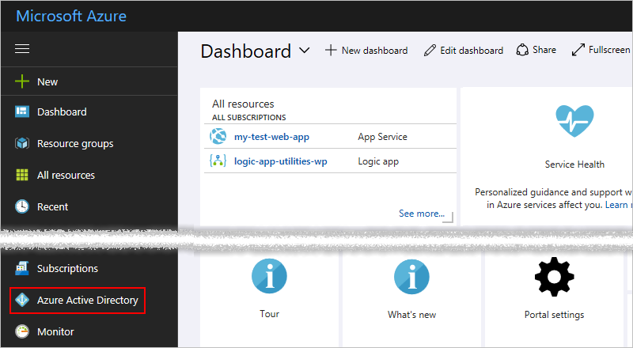

   > [!TIP]
   > If the main Azure menu doesn't show **Azure Active Directory**, 
   > choose **More services**. In the **Filter** box, 
   > type "Azure Active Directory" as your filter, 
   > then choose **Azure Active Directory**.

3. On the directory menu, under **Manage**, choose **App registrations**. 
In the registered apps list, choose **+ New application registration**.

   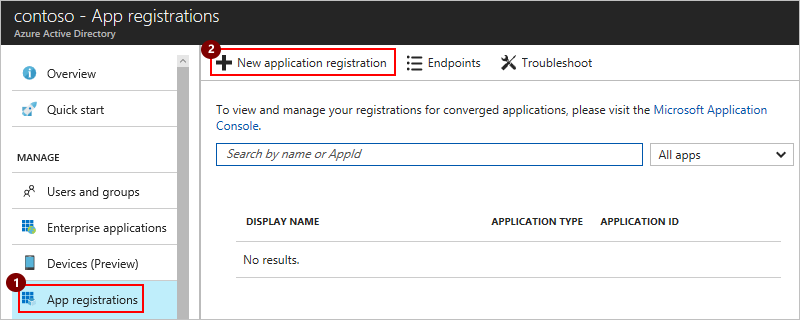

4. Under **Create**, provide the details for your Azure AD app 
as described in the table, then choose **Create**. 

   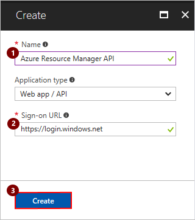

   | Setting | Suggested value | Description | 
   | ------- | --------------- | ----------- | 
   | **Name** | *web-api-app-name* | The name for your Web API's Azure AD app | 
   | **Application type** | **Web app / API** | Your app's type | 
   | **Sign-on URL** | `https://login.windows.net` | | 
   |||| 

5. When you return to your directory's **App registrations** list, 
select your Azure AD app.

   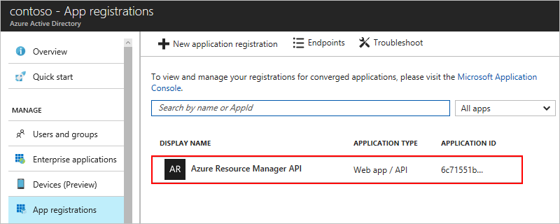

6. When the app's details page appears, 
make sure that you **copy and save the app's *Application ID* somewhere safe**. 
You need this ID for later use.

   

7. Now provide a reply URL for your Azure AD app. 
In the app's **Settings** menu, choose **Reply URLs**. 
Enter this URL, then choose **Save**.

   

   | Setting | Suggested value | Description | 
   | ------- | --------------- | ----------- | 
   | **Reply URLs** | For your own API, enter this URL: </br>`https://{your-web-app-root-URL}/.auth/login/aad/callback` | | 
   | **Delegated permissions** | {not necessary} | | 
   | **Client key** | {not necessary} | | 
   |||| 

   > [!TIP]
   > If the **Settings** menu didn't previously appear, 
   > choose **Settings** here:
   >
   > 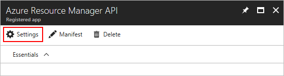

## 2. Create your second Azure AD app for your custom connector

Your second Azure AD app secures your custom connector registration and 
adds delegated access to the Web API protected by the first Azure AD app. 

> [!IMPORTANT]
> Make sure that both your Azure AD apps exist in the same directory.

1. Return to the **App registrations** list, 
and choose **+ New application registration** again.

   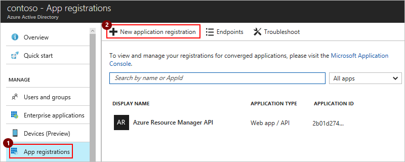

2. Under **Create**, provide the details for your second Azure AD app 
as described in the table, then choose **Create**. 

   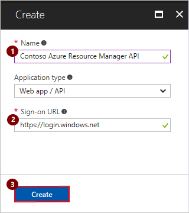

   | Setting | Suggested value | Description | 
   | ------- | --------------- | ----------- | 
   | **Name** | *your-connector-name* | The name for your connector's Azure AD app | 
   | **Application type** | **Web app / API** | Your app's type | 
   | **Sign-on URL** | `https://login.windows.net` | | 
   |||| 

3. When you return to your directory's **App registrations** list, 
select your second Azure AD app.

   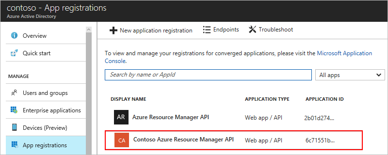

4. When the app's details page appears, 
make sure that you also **copy and save this app's *Application ID* somewhere safe too**. 
You need this ID for later use.

   

5. Now provide a reply URL for your Azure AD app. 
In the app's **Settings** menu, choose **Reply URLs**. 
Enter this URL, then choose **Save**.

   | Setting | Suggested value | Description | 
   | ------- | --------------- | ----------- | 
   | **Reply URLs** | For the Azure Resource Manager custom connector, enter this URL: `https://msmanaged-na.consent.azure-apim.net/redirect` | | 
   |||| 

   > [!TIP]
   > If the **Settings** menu didn't previously appear, 
   > choose **Settings** here:
   >
   > 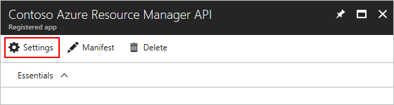

6. Back in the **Settings** menu, choose **Required permissions** > **Add**.

   

7. When the **Add API access** menu opens, choose **Select an API** > 
**Windows Azure Service Management API** > **Select**.

   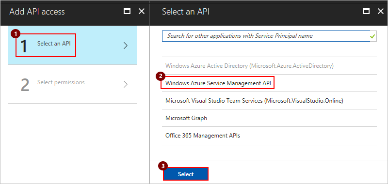

6. On the **Add API access** menu, choose **Select permissions**. 
Under **Delegated permissions**, choose **Access Azure Service Management as organization users** > **Select**.

   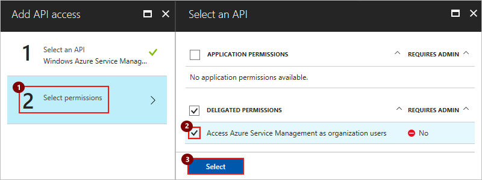

   Otherwise, for other options:

   | Option | Suggested value | Description | 
   | ------ | --------------- | ----------- | 
   | **Delegated permissions**| | Select permissions for delegated access to your Web API | 
   |||| 

7. Now on the **Add API access** menu, choose **Done**.

   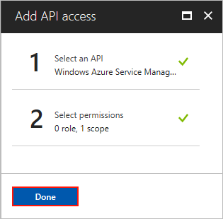

8. Now generate a *client key*, or "secret", for your connector's Azure AD app. 

   1. Back on the **Settings** menu, choose **Keys**. 
   Provide a name for your key with 16 or fewer characters, 
   select an expiration period, and then choose **Save**.

      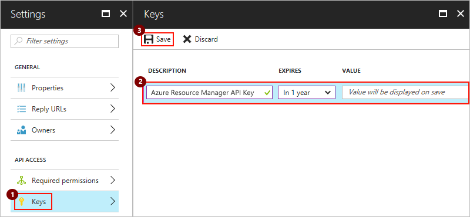

   2. When your generated key appears, **make sure that you copy 
   and save this key somewhere safe** before you leave the **Keys** page.
    
      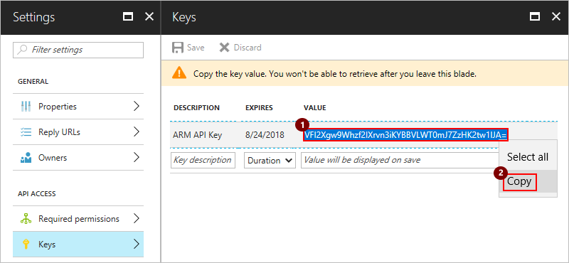

9. After saving your key, you can safely close the **Settings** menu.

## 3. Add Azure AD authentication to your Web API app

Now turn on authentication for your Web API with your first Azure AD app. 
For more information, learn [how to configure your App Service application to use Azure Active Directory login](../app-service-mobile/app-service-mobile-how-to-configure-active-directory-authentication.md).

1. In the [Azure portal](https://portal.azure.com), 
find your Web API app that you previously published in 
[Create custom connectors from Web APIs](../logic-apps/custom-connector-build-web-api-app-tutorial.md).

2. Under **Settings**, choose **Authentication / Authorization**. 

   1. Under **App Service Authentication**, choose **On**.
   2. For **Action to take when request is not authenticated**, 
   select **Log in with Azure Active Directory**.
   3. For **Authentication Providers**, select **Azure Active Directory**. 

   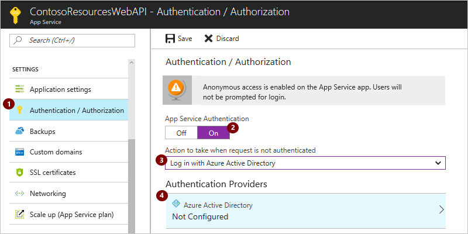

3. On the **Azure Active Directory Settings** page:

   1. Under **Management mode**, choose **Express**.

   2. Now select the Azure AD app that your Web API app uses for authentication. 
   Choose **Select Existing AD App** > **Azure AD App**.

   3. Under **Azure AD Applications**, select the Azure AD app 
   that you created earlier for your Web API app. 
   
   4. Choose **OK** until you return to the **Authentication / Authorization** page.

   For example:

   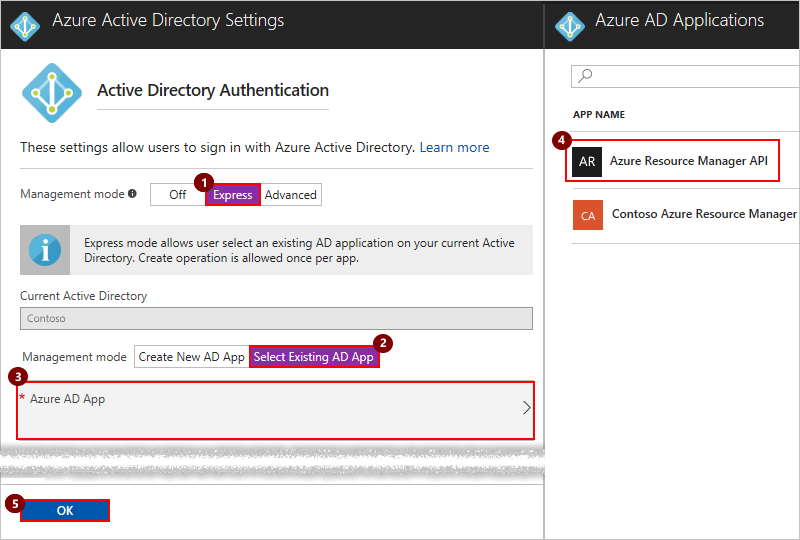

6. On the **Authentication / Authorization** page, 
choose **Save**.

   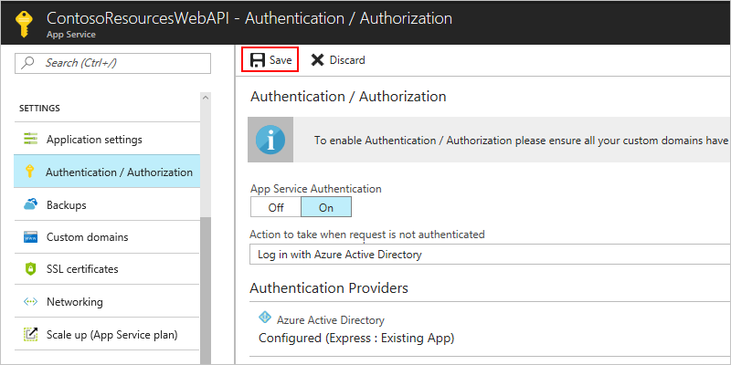

   Now your Web API app can use Azure AD for authentication.

## 4. Set up Azure AD authentication in your Web API's OpenAPI file

Open the OpenAPI file for your Web API app 
so that you can add the `securityDefintions` object and 
Azure AD authentication under the `host` property. 
Here's an example that shows the `host` property and `securityDefinitions` object:

``` json
// Your OpenAPI file header appears here...

"host": "{your-web-api-app-root-url}",
"schemes": [
    "https" // Make sure this is https!
],
"securityDefinitions": {
    "AAD": {
        "type": "oauth2",
        "flow": "accessCode",
        "authorizationUrl": "https://login.windows.net/common/oauth2/authorize",
        "tokenUrl": "https://login.windows.net/common/oauth2/token",
        "scopes": {}
    }
},

// Your OpenAPI document continues here...
```
Now you're ready to create and register your custom connector.

## Next steps

* [Register your connector](../logic-apps/logic-apps-custom-connector-register.md)
* [Custom connector FAQ](../logic-apps/custom-connector-faq.md)
