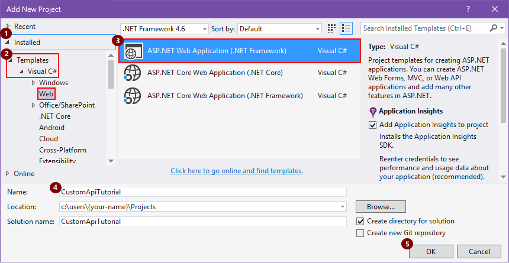
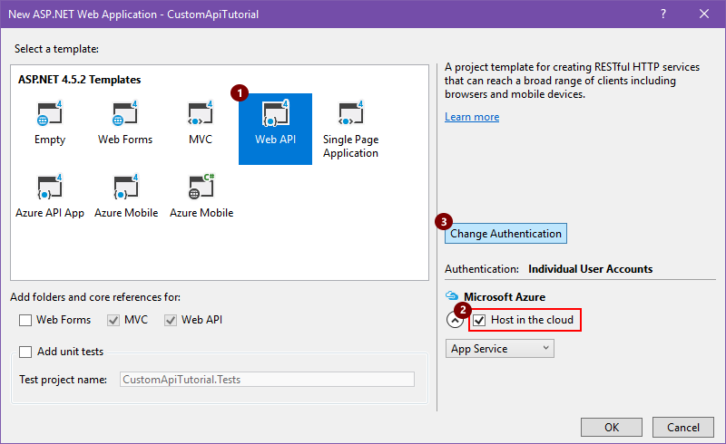
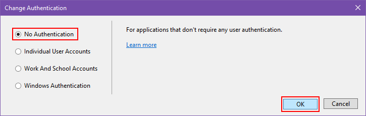
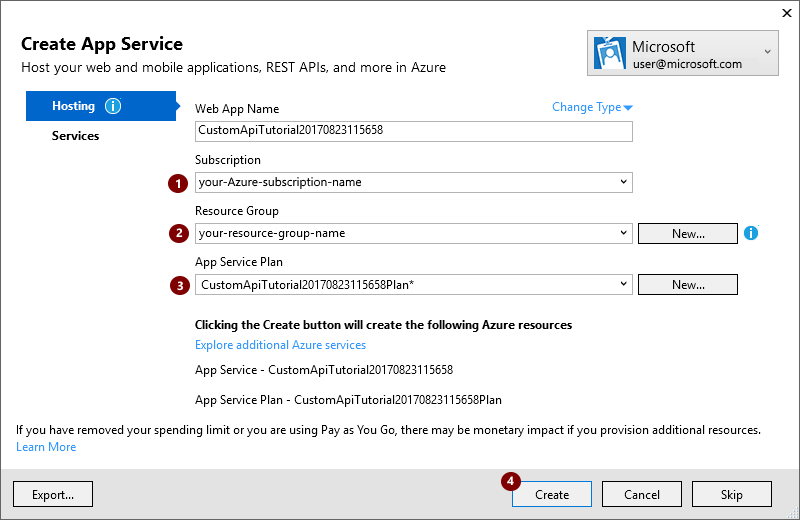
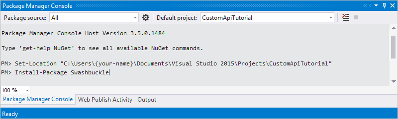

# Create custom connectors from Web APIs

To build a custom connector that you can use in Azure Logic Apps, 
Microsoft Flow, or Microsoft PowerApps, first create a Web API that 
you can host with Azure Web Apps, authenticate with Azure Active Directory, 
and register as a connector with Logic Apps, Flow, or PowerApps. 
This tutorial shows you how to perform these tasks 
by building an ASP.NET Web API app.

## Prerequisites

* [Visual Studio 2013 or later](https://www.visualstudio.com/vs/). 
This tutorial uses Visual Studio 2015.

* Code for your Web API. If you don't have any, try this tutorial: 
[Getting Started with ASP.NET Web API 2 (C#)](http://www.asp.net/web-api/overview/getting-started-with-aspnet-web-api/tutorial-your-first-web-api).

* An Azure subscription. If you don't have a subscription, 
you can start with a [free Azure account](https://azure.microsoft.com/free/). 
Otherwise, sign up for a [Pay-As-You-Go subscription](https://azure.microsoft.com/pricing/purchase-options/).

## Create and deploy an ASP.NET Web App to Azure

For this tutorial, create a Visual C# ASP.NET Web Application. 
For general information about how to create 

1. Open Visual Studio, then choose **File** > **New Project**.

   1. Expand **Installed**, go to **Templates** > **Visual C#** > **Web**, 
   and select **ASP.NET Web Application**.

   2. Provide a project name, location, and solution name for your app, 
   then choose **OK**.

   For example:

   

2. In the **New ASP.NET Web Application** box, 
select the **Web API** template. If not already selected, 
select **Host in the cloud**. Choose **Change Authentication**.

   

3. Select **No Authentication**, and choose **OK**. 
You can set up authentication later.

   

4. When the **New ASP.NET Web Application** box reappears, choose **OK**. 

5. In the **Create App Service** box, 
review the hosting settings described in the table, 
make the changes you want, and choose **Create**. 

   An [App Service plan](../app-service/azure-web-sites-web-hosting-plans-in-depth-overview.md) 
   represents a collection of physical resources used for hosting apps in your Azure subscription. Learn about [App Service](../app-service/app-service-value-prop-what-is.md).

   

   | Setting | Suggested value | Description | 
   | ------- | --------------- | ----------- | 
   | Your Azure work or school account, or your personal Microsoft account | | Select your user account. | 
   | **Web App Name** | *custom-web-api-app-name* or the default name | Enter the name for your Web API app, which is used in your app's URL, for example: http://*web-api-app-name*. | 
   | **Subscription** | *Azure-subscription-name* | Select the Azure subscription that you want to use. | 
   | **Resource Group** | *Azure-resource-group-name* | Select an existing Azure resource group, or if you haven't already, create a resource group. 
**Note**: An Azure resource group organizes Azure resources in your Azure subscription. | 
   | **App Service Plan** | *App-Service-plan-name* | Select an existing App Service plan, or if you haven't already, create a plan. | 
   |||| 

   If you create an App Service Plan, specify these settings:

   | Setting | Suggested value | Description | 
   | ------- | --------------- | ----------- | 
   | **Location** | *deployment-region* | Select the region for deploying your app. | 
   | **Size** | *app-service-plan-size* | Select your plan size, which determines the cost and computing resource capacity for your service plan. | 
   |||| 

   To set up any other resources required by your app, 
   choose **Explore additional Azure services**.

   | Setting | Suggested value | Description | 
   | ------- | --------------- | ----------- | 
   | **Resource Type** | *Azure-resource-type* |Select and set up any additional resources required by your app. | 
   |||| 

6. After Visual Studio deploys your project, 
build the code for your app.

## Create an OpenAPI (Swagger) file that describes your Web API

To connect your Web API app to Logic Apps, 
you need an [OpenAPI (formerly Swagger) file](http://swagger.io/) 
that describes your API's operations. 
You can write your own OpenAPI definition for your API with the 
[Swagger online editor](http://editor.swagger.io/), 
but this tutorial uses an open source tool named [Swashbuckle](https://github.com/domaindrivendev/Swashbuckle/blob/master/README.md).

1. If you haven't already, install the Swashbuckle Nuget 
package in your Visual Studio project.

   1. In Visual Studio, choose **Tools** > **NuGet Package Manager** > 
   **Package Manager Console**.

   2. In the **Package Manager Console**, go to your app's project directory if you're not there already (run `Set-Location "project-path"`), and run this PowerShell commandlet: 
   
      `Install-Package Swashbuckle`

      For example:

      

   > [!TIP]
   > If you run your app after installing Swashbuckle, 
   > Swashbuckle generates an OpenAPI file at this URL: 
   >
   > http://*{your-web-api-app-root-URL}*/swagger/docs/v1
   > 
   > Swashbuckle also generates a user interface at this URL: 
   > 
   > http://*{your-web-api-app-root-URL}*/swagger

3. When you're ready, publish your Web API app to Azure. 
To publish from Visual Studio, 
right-click your web project in Solution Explorer, 
choose **Publish...**, and follow the prompts.

   > [!IMPORTANT]
   > Duplicate operation IDs make an OpenAPI document invalid. 
   > If you used the sample C# template, 
   > the template *repeats this operation ID twice*: `Values_Get` 
   > 
   > To fix this problem, change one instance to `Value_Get` and republish.

4. Get the OpenAPI document by browsing to this location: 

   http://*{your-web-api-app-root-URL}*/swagger/docs/v1

   You can also download a [sample OpenAPI document](https://pwrappssamples.blob.core.windows.net/samples/webAPI.json) 
   from this tutorial. 
   Make sure that you remove the comments, which starting with "//", 
   before you use the document.

5. Save the content as a JSON file. Based on your browser, 
you might have to copy and paste the text into an empty text file.

## Next steps

* [Set up authentication for custom connectors](../logic-apps/custom-connector-azure-active-directory-authentication.md)

