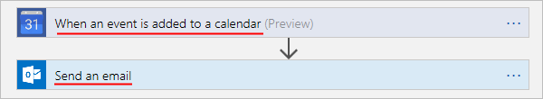
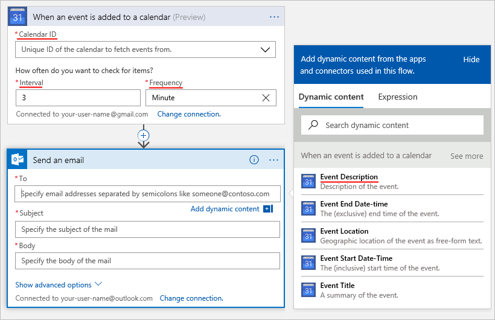
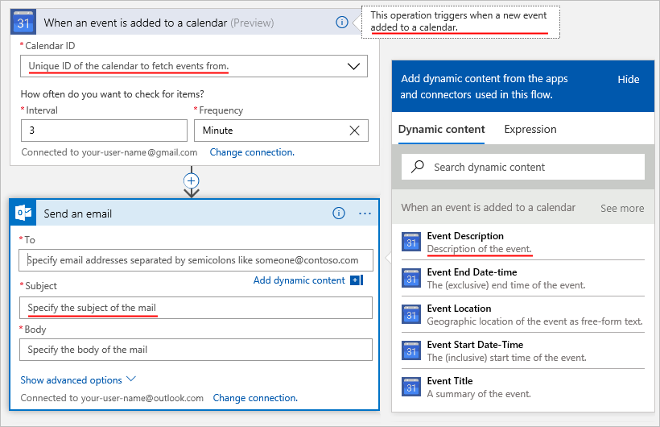
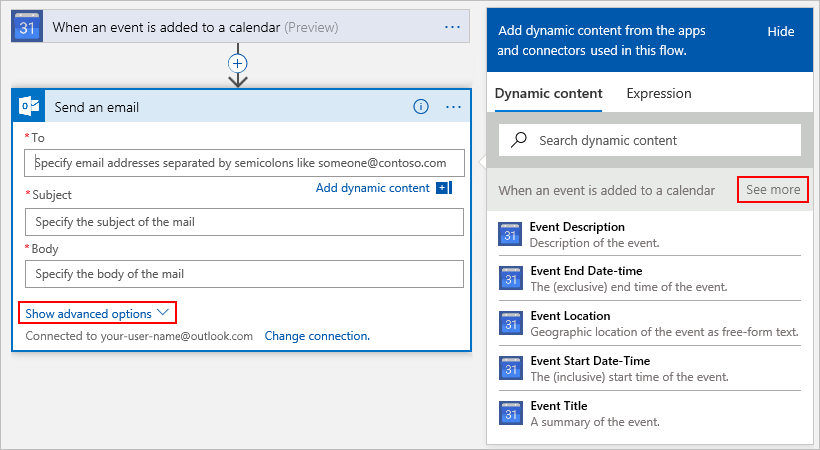
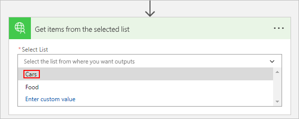
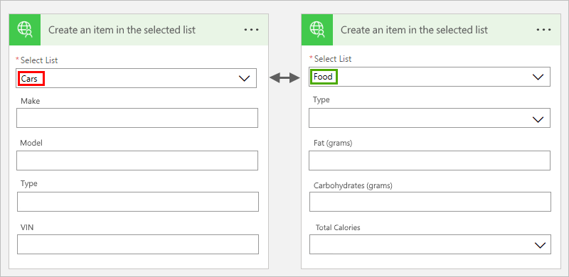
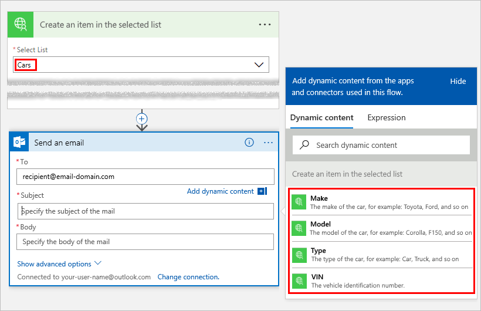
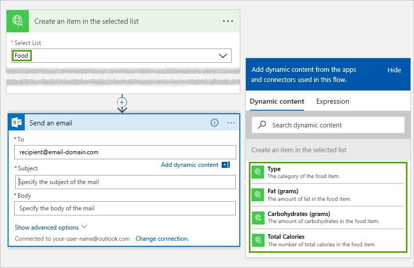

# Extend OpenAPI with advanced functionality for custom connectors

To create custom connectors for Azure Logic Apps, Microsoft Flow, 
or Microsoft PowerApps, you must provide an OpenAPI definition file, 
which is a language-agnostic machine-readable document that describes 
your API's operations and parameters. 
Along with OpenAPI's out-of-the-box functionality, you can also 
include these OpenAPI extensions when you create custom connectors 
for Logic Apps and Flow:

* `summary`
* `x-ms-summary`
* `description`
* `x-ms-visibility`
* `x-ms-dynamic-values`
* `x-ms-dynamic-schema`

Here are more details about these extensions:

## summary

Specifies the title for the action (operation). </br>
Applies to: Operations </br>
Recommended: Use *sentence case* for `summary`. </br>
Example: "When an event is added to calendar" or "Send an email"



``` json
"actions" {
  "Send_an_email": {
    /// Other action properties here...
    "summary": "Send an email",
    /// Other action properties here...
  }
},
```

## x-ms-summary

Specifies the title for an entity. </br>
Applies to: Parameters, Response Schema </br>
Recommended: Use *title case* for `x-ms-summary`. </br>
Example: "Calendar ID", "Subject", "Event Description", and so on



``` json
"actions" {
  "Send_an_email": {
    /// Other action properties here...
    "parameters": [ 
      {
        /// Other parameters here...
        "x-ms-summary": "Subject",
        /// Other parameters here...
      }
    ]
  }
},
```

## description

Specifies a verbose explanation about the operation's 
functionality or an entity's format and function. </br>
Applies to: Operations, Parameters, Response Schema </br>
Recommended: Use *sentence case* for `description`. </br>
Example: "This operation triggers when a new event is added to the calendar", 
"Specify the subject of the mail.", and so on



``` json
"actions" {
  "Send_an_email": {
     "description": "Specify the subject of the mail",
     /// Other action properties here...
  }
},
```

<a name="visibility"></a>

## x-ms-visibility

Specifies the user-facing visibility for an entity. </br>
Possible values: `important`, `advanced`, and `internal` </br>
Applies to: Operations, Parameters, Schemas

* `important` operations and parameters are always shown to the user first.
* `advanced` operations and parameters are hidden under an additional menu.
* `internal` operations and parameters are hidden from the user.

> [!NOTE] 
> For parameters that are `internal` and `required`, 
> you **must** provide default values for these parameters.

Example: The **See more** menu and **Show advanced options** menu 
are hiding `advanced` operations and parameters.



``` json
"actions" {
  "Send_an_email": {
     /// Other action properties here...
     "parameters:": [
         {
           "name": "Subject",
           "type": "string",
           "description": "Specify the subject of the mail",
           "x-ms-summary": "Subject",
           "x-ms-visibility": "important",
           /// Other parameter properties here
         }
     ]
     /// Other action properties here...
  }
},
```

## x-ms-dynamic-values

Shows a populated list for the user so they can 
select input parameters for an operation. </br>
Applies to: Parameters </br>
How to use: Add the `x-ms-dynamic-values` object 
to the parameter's definition. For example, see this [OpenAPI sample](https://procsi.blob.core.windows.net/blog-images/sampleDynamicSwagger.json).



### Properties for x-ms-dynamic-values

| Name | Required or optional | Description | 
| ---- | -------------------- | ----------- | 
| **operationID** | Required | The operation to call for populating the list | 
| **value-path** | Required | A path string in the object inside `value-collection` that refers to the parameter value. </br>If `value-collection` isn't specified, the response is evaluated as an array. | 
| **value-title** | Optional |A path string in the object inside `value-collection` that refers to the value's description. </br>If `value-collection` isn't specified, the response is evaluated as an array. | 
| **value-collection** | Optional | A path string that evaluates to an array of objects in the response payload | 
| **parameters** | Optional | An object whose properties specify the input parameters required to invoke a dynamic-values operation | 
|||| 

Here's an example that shows the properties in `x-ms-dynamic-values`:

``` json
"x-ms-dynamic-values": {
  "operationId": "PopulateDropdown",
  "value-path": "name",
  "value-title": "properties/displayName",
  "value-collection": "value",
  "parameters": {
     "staticParameter": "{value}",
     "dynamicParameter": {
        "parameter": "{value-to-pass-to-dynamicParameter}"
     }
  }
}
```

## Example: All the OpenAPI extensions up to this point

``` json
"/api/lists/{listID-dynamic}": {
    "get": {
        "description": "Get items from a single list - uses dynamic values and outputs dynamic schema",
        "summary": "Gets items from the selected list",
        "operationID": "GetListItems",
        "parameters": [
           {
             "name": "listID-dynamic",
             "type": "string",
             "in": "path",
             "description": "Select the list from where you want outputs",
             "required": true,
             "x-ms-summary": "Select List",
             "x-ms-dynamic-values": {
                "operationID": "GetLists",
                "value-path": "id",
                "value-title": "name"
             }
           }
        ]
    }
}
```

## x-ms-dynamic-schema

Indicates that the schema for the current parameter or response is dynamic. 
This object can invoke an operation that's defined by the value of this field, dynamically discover the schema, and display the appropriate UI 
for collecting user inputs or show available fields. 

Applies to: Parameters, Response

How to use: Add the `x-ms-dynamic-schema` object to a request parameter 
or response body definition. For an example, see this [OpenAPI sample](https://procsi.blob.core.windows.net/blog-images/sampleDynamicSwagger.json).

This example shows how the input form changes, 
based on the item that the user selects from the drop-down list:



And this example shows how the outputs change, 
based on the item that the user selects from the drop-down list. 
In this version, the user selects "Cars":



In this version, the user selects "Food":



### Properties for x-ms-dynamic-schema

| Name | Required or optional | Description | 
| ---- | -------------------- | ----------- | 
| **operationID** | Required | The operation to call for fetching the schema | 
| **parameters** | Required | An object whose properties specify the input parameters required to invoke a dynamic-schema operation | 
| **value-path** |Optional | A path string that refers to the property that has the schema. </br>If not specified, the response is assumed to contain the schema in the root object's properties. | 
|||| 

Here's an example for a dynamic parameter:

``` json
{
  "name": "dynamicListSchema",
  "in": "body",
  "description": "Dynamic schema for items in the selected list",
  "schema": {
    "type": "object",
    "x-ms-dynamic-schema": {
        "operationID": "GetListSchema",
        "parameters": {
          "listID": {
            "parameter": "listID-dynamic"
          }
        },
        "value-path": "items"
    }
  }
}
```

Here's an example for a dynamic response:

``` json
"DynamicResponseGetListSchema": {
   "type": "object",
   "x-ms-dynamic-schema": {
      "operationID": "GetListSchema",
      "parameters": {
         "listID": {
            "parameter": "listID-dynamic"
         }
      },
      "value-path": "items"
    }
}
```

## Next steps

* [Describe your custom APIs and connectors](../logic-apps/custom-connector-api-postman-collection.md)
* [Logic Apps: Register your connector](../logic-apps/logic-apps-custom-connector-register.md)
* [Flow: Register your connector](https://ms.flow.microsoft.com/documentation/register-custom-api/#register-your-custom-connector)