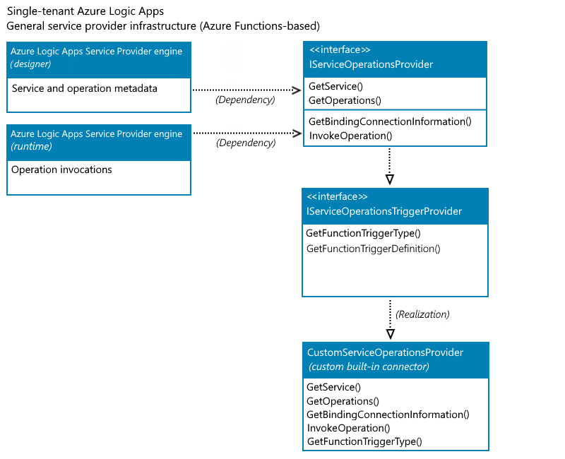

# Custom connectors in Azure Logic Apps

[!INCLUDE [logic-apps-sku-consumption-standard](../../includes/logic-apps-sku-consumption-standard.md)]

Without writing any code, you can quickly create automated integration workflows when you use the prebuilt connector operations in Azure Logic Apps. A connector helps your workflows connect and access data, events, and actions across other apps, services, systems, protocols, and platforms. Each connector offers operations as triggers, actions, or both that you can add to your workflows. By using these operations, you expand the capabilities for your cloud apps and on-premises apps to work with new and existing data.

Connectors in Azure Logic Apps are either *built in* or *managed*. A *built-in* connector runs natively on the Azure Logic Apps runtime, which means they're hosted in the same process as the runtime and provide higher throughput, low latency, and local connectivity. A *managed connector* is a proxy or a wrapper around an API, such as Office 365 or Salesforce, that helps the underlying service talk to Azure Logic Apps. Managed connectors are powered by the connector infrastructure in Azure and are deployed, hosted, run, and managed by Microsoft. You can choose from [hundreds of managed connectors](/connectors/connector-reference/connector-reference-logicapps-connectors) to use with your workflows in Azure Logic Apps.

When you use a connector operation for the first time in a workflow, some connectors don't require that you create a connection first, but many other connectors require this step. Each connection that you create is actually a separate Azure resource that provides access to the target app, service, system, protocol, or platform.

Sometimes though, you might want to call REST APIs that aren't available as prebuilt connectors. To support more tailored scenarios, you can create your own [*custom connectors*](/connectors/custom-connectors/) to offer triggers and actions that aren't available as prebuilt operations.

This article provides an overview about custom connectors for [Consumption logic app workflows and Standard logic app workflows](logic-apps-overview.md). Each logic app type is powered by a different Azure Logic Apps runtime, respectively hosted in multi-tenant Azure and single-tenant Azure. For more information about connectors in Azure Logic Apps, review the following documentation:

* [About connectors in Azure Logic Apps](../connectors/introduction.md)
* [Built-in connectors in Azure Logic Apps](../connectors/built-in.md)
* [Managed connectors in Azure Logic Apps](../connectors/managed.md)
* [Connector overview](/connectors/connectors)
* [Single-tenant versus multi-tenant and integration service environment for Azure Logic Apps](single-tenant-overview-compare.md)

<a name="custom-connector-consumption"></a>

## Consumption logic apps

In [multi-tenant Azure Logic Apps](logic-apps-overview.md), you can create [custom connectors from Swagger-based or SOAP-based APIs](/connectors/custom-connectors/) up to [specific limits](../logic-apps/logic-apps-limits-and-config.md#custom-connector-limits) for use in Consumption logic app workflows. The [Connectors documentation](/connectors/connectors) provides more overview information about how to create custom connectors for Consumption logic apps, including complete basic and advanced tutorials. The following list also provides direct links to information about custom connectors for Consumption logic apps:

  * [Create an Azure Logic Apps connector](/connectors/custom-connectors/create-logic-apps-connector)
  * [Create a custom connector from an OpenAPI definition](/connectors/custom-connectors/define-openapi-definition)
  * [Create a custom connector from a Postman collection](/connectors/custom-connectors/define-postman-collection)
  * [Use a custom connector from a logic app](/connectors/custom-connectors/use-custom-connector-logic-apps)
  * [Share custom connectors in your organization](/connectors/custom-connectors/share)
  * [Submit your connectors for Microsoft certification](/connectors/custom-connectors/submit-certification)
  * [Custom connector FAQ](/connectors/custom-connectors/faq)

<a name="custom-connector-standard"></a>

## Standard logic apps

In [single-tenant Azure Logic Apps](logic-apps-overview.md), the redesigned Azure Logic Apps runtime powers Standard logic app workflows. This runtime differs from the multi-tenant Azure Logic Apps runtime that powers Consumption logic app workflows. The single-tenant runtime uses the [Azure Functions extensibility model](../azure-functions/functions-bindings-register.md), which provides a key capability for you to create your own [built-in connectors](../connectors/built-in.md) for anyone to use in Standard workflows. In most cases, the built-in version provides better performance, capabilities, pricing, and so on.

When single-tenant Azure Logic Apps officially released, new built-in connectors included Azure Blob Storage, Azure Event Hubs, Azure Service Bus, and SQL Server. Over time, this list of built-in connectors continues to grow. However, if you need connectors that aren't available in Standard logic app workflows, you can [create your own built-in connectors](create-custom-built-in-connector-standard.md) using the same extensibility model that's used by *service provider-based* built-in connectors in Standard workflows.

<a name="service-provider-interface-implementation"></a>

### Service provider-based built-in connectors

In single-tenant Azure Logic Apps, a [built-in connector with specific attributes is informally known as a *service provider*](../connectors/built-in.md#service-provider-interface-implementation). For example, these connectors are based on the [Azure Functions extensibility model](../azure-functions/functions-bindings-register.md), which provide the capability for you to create your own custom built-in connectors to use in Standard logic app workflows.

In contrast, non-service provider built-in connectors have the following attributes:

* Isn't based on the Azure Functions extensibility model.

* Is directly implemented as a job within the Azure Logic Apps runtime, such as Schedule, HTTP, Request, and XML operations.

No capability is currently available to create a non-service provider built-in connector or a new job type that runs directly in the Azure Logic Apps runtime. However, you can create your own built-in connectors using the service provider infrastructure.

The following section provides more information about how the extensibility model works for custom built-in connectors.

<a name="built-in-connector-extensibility-model"></a>

### Built-in connector extensibility model

Based on the [Azure Functions extensibility model](../azure-functions/functions-bindings-register.md), the built-in connector extensibility model in single-tenant Azure Logic Apps has a service provider infrastructure that you can use to [create, package, register, and install your own built-in connectors](create-custom-built-in-connector-standard.md) as Azure Functions extensions that anyone can use in their Standard workflows. This model includes custom built-in trigger capabilities that support exposing an [Azure Functions trigger or action](../azure-functions/functions-bindings-example.md) as a service provider trigger in your custom built-in connector.

The following diagram shows the method implementations that the Azure Logic Apps designer and runtime expects for a custom built-in connector with an [Azure Functions-based trigger](../azure-functions/functions-bindings-example.md):



The following sections provide more information about the interfaces that your connector needs to implement.

#### IServiceOperationsProvider

This interface includes the methods that provide the operations manifest for your custom built-in connector.

* Operations manifest

  The operations manifest includes metadata about the implemented operations in your custom built-in connector. The Azure Logic Apps designer primarily uses this metadata to drive the authoring and monitoring experiences for your connector's operations. For example, the designer uses operation metadata to understand the input parameters required by a specific operation and to facilitate generating the outputs' property tokens, based on the schema for the operation's outputs.

  The designer requires and uses the [**GetService()**](#getservice) and [**GetOperations()**](#getoperations) methods to query the operations that your connector provides and shows on the designer surface. The **GetService()** method also specifies the connection's input parameters that are required by the designer.

  For more information about these methods and their implementation, review the [Methods to implement](#method-implementation) section later in this article.

* Operation invocations

  Operation invocations are the method implementations used during workflow execution by the Azure Logic Apps runtime to call the specified operations in the workflow definition.

  * If your trigger is an Azure Functions-based trigger type, the [**GetBindingConnectionInformation()**](#getbindingconnectioninformation) method is used by the runtime in Azure Logic Apps to provide the required connection parameters information to the Azure Functions trigger binding.

  * If your connector has actions, the [**InvokeOperation()**](#invokeoperation) method is used by the runtime to call each action in your connector that runs during workflow execution. Otherwise, you don't have to implement this method.

For more information about these methods and their implementation, review the [Methods to implement](#method-implementation) section later in this article.

#### IServiceOperationsTriggerProvider

Custom built-in trigger capabilities support adding or exposing an [Azure Functions trigger or action](../azure-functions/functions-bindings-example.md) as a service provider trigger in your custom built-in connector. To use the Azure Functions-based trigger type and the same Azure Functions binding as the Azure managed connector trigger, implement the following methods to provide the connection information and trigger bindings as required by Azure Functions.

* The [**GetFunctionTriggerType()**](#getfunctiontriggertype) method is required to return the string that's the same as the **type** parameter in the Azure Functions trigger binding.

* The [**GetFunctionTriggerDefinition()**](#getfunctiontriggerdefinition) has a default implementation, so you don't need to explicitly implement this method. However, if you want to update the trigger's default behavior, such as provide extra parameters that the designer doesn't expose, you can implement this method and override the default behavior.

<a name="method-implementation"></a>

### Methods to implement

The following sections provide more information about the methods that your connector needs to implement. For the complete sample, review [Sample CosmosDbServiceOperationProvider.cs](https://github.com/Azure/logicapps-connector-extensions/blob/CosmosDB/src/CosmosDB/Providers/CosmosDbServiceOperationProvider.cs) and [Create custom built-in connectors for Standard logic apps in single-tenant Azure Logic Apps](create-custom-built-in-connector-standard.md).

#### GetService()

The designer requires this method to get the high-level metadata for your service, including the service description, connection input parameters, capabilities, brand color, icon URL, and so on.

```csharp
public ServiceOperationApi GetService()
{
   return this.{custom-service-name-apis}.ServiceOperationServiceApi();
}
```

For more information, review [Sample CosmosDbServiceOperationProvider.cs](https://github.com/Azure/logicapps-connector-extensions/blob/CosmosDB/src/CosmosDB/Providers/CosmosDbServiceOperationProvider.cs).

#### GetOperations()

The designer requires this method to get the operations implemented by your service. The operations list is based on Swagger schema. The designer also uses the operation metadata to understand the input parameters for specific operations and generate the outputs as property tokens, based on the schema of the output for an operation.

```csharp
public IEnumerable<ServiceOperation> GetOperations(bool expandManifest)
{
   return expandManifest ? serviceOperationsList : GetApiOperations();
}
```

For more information, review [Sample CosmosDbServiceOperationProvider.cs](https://github.com/Azure/logicapps-connector-extensions/blob/CosmosDB/src/CosmosDB/Providers/CosmosDbServiceOperationProvider.cs).

#### GetBindingConnectionInformation()

If you want to use the Azure Functions-based trigger type, this method provides the required connection parameters information to the Azure Functions trigger binding.

```csharp
public string GetBindingConnectionInformation(string operationId, InsensitiveDictionary<JToken> connectionParameters)
{
   return ServiceOperationsProviderUtilities
      .GetRequiredParameterValue(
         serviceId: ServiceId,
         operationId: operationID,
         parameterName: "connectionString",
         parameters: connectionParameters)?
      .ToValue<string>();
}
```

For more information, review [Sample CosmosDbServiceOperationProvider.cs](https://github.com/Azure/logicapps-connector-extensions/blob/CosmosDB/src/CosmosDB/Providers/CosmosDbServiceOperationProvider.cs).

#### InvokeOperation()

If your custom built-in connector only has a trigger, you don't have to implement this method. However, if your connector has actions to implement, you have to implement the **InvokeOperation()** method, which is called for each action in your connector that runs during workflow execution. You can use any client, such as FTPClient, HTTPClient, and so on, as required by your connector's actions. This example uses HTTPClient.

```csharp
public Task<ServiceOperationResponse> InvokeOperation(string operationId, InsensitiveDictionary<JToken> connectionParameters, ServiceOperationRequest serviceOperationRequest)
{
   using (var client = new HttpClient())
   {
      response = client.SendAsync(httpRequestMessage).ConfigureAwait(false).ToJObject();
   }
   return new ServiceOperationResponse(body: response);
}
```

For more information, review [Sample CosmosDbServiceOperationProvider.cs](https://github.com/Azure/logicapps-connector-extensions/blob/CosmosDB/src/CosmosDB/Providers/CosmosDbServiceOperationProvider.cs).

#### GetFunctionTriggerType()

To use an Azure Functions-based trigger as a trigger in your connector, you have to return the string that's the same as the **type** parameter in the Azure Functions trigger binding.

The following example returns the string for the out-of-the-box built-in Azure Cosmos DB trigger, `"type": "cosmosDBTrigger"`:

```csharp
public string GetFunctionTriggerType()
{
   return "CosmosDBTrigger";
}
```

For more information, review [Sample CosmosDbServiceOperationProvider.cs](https://github.com/Azure/logicapps-connector-extensions/blob/CosmosDB/src/CosmosDB/Providers/CosmosDbServiceOperationProvider.cs).

#### GetFunctionTriggerDefinition()

This method has a default implementation, so you don't need to explicitly implement this method. However, if you want to update the trigger's default behavior, such as provide extra parameters that the designer doesn't expose, you can implement this method and override the default behavior.

## Next steps

When you're ready to start the implementation steps, continue to the following article:

* [Create custom built-in connectors for Standard logic apps in single-tenant Azure Logic Apps](create-custom-built-in-connector-standard.md)
