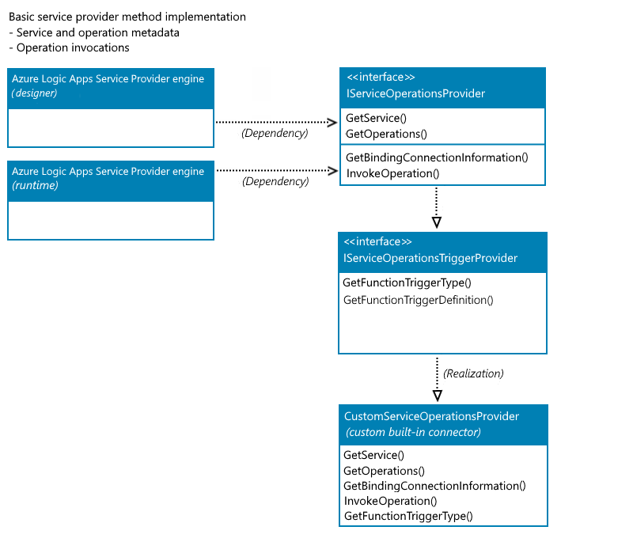

# Custom connectors in Azure Logic Apps

Without writing any code, you can quickly create automated integration workflows when you use the prebuilt connector operations in Azure Logic Apps. A connector helps your workflows connect and access data, events, and actions across other apps, services, systems, protocols, and platforms. Each connector offers operations as triggers, actions, or both that you can add to your workflows. By using these operations, you expand the capabilities for your cloud apps and on-premises apps to work with new and existing data.

Connectors in Azure Logic Apps are either *built in* or *managed*. A *built-in* connector runs natively on the Azure Logic Apps runtime, which means they're hosted in the same process as the runtime and provide higher throughput, low latency, and local connectivity. A *managed connector* is a proxy or a wrapper around an API, such as Office 365 or Salesforce, that helps the underlying service talk to Azure Logic Apps. Managed connectors are powered by the connector infrastructure in Azure and are deployed, hosted, run, and managed by Microsoft. You can choose from [hundreds of managed connectors](/connectors/connector-reference/connector-reference-logicapps-connectors) to use with your workflows in Azure Logic Apps.

When you use a connector operation for the first time in a workflow, some connectors don't require that you create a connection first, but many other connectors require this step. Each connection that you create is actually a separate Azure resource that provides access to the target app, service, system, protocol, or platform.

Sometimes though, you might want to call REST APIs that aren't available as prebuilt connectors. To support more tailored scenarios, you can create your own [*custom connectors*](/connectors/custom-connectors/) to offer triggers and actions that aren't available as prebuilt operations.

This article provides an overview about custom connectors for [Consumption logic app workflows and Standard logic app workflows](logic-apps-overview.md). Each logic app type is powered by a different Azure Logic Apps runtime, respectively hosted in multi-tenant Azure and single-tenant Azure. For more information about connectors in Azure Logic Apps, review the following documentation:

* [About connectors in Azure Logic Apps](../connectors/apis-list.md)
* [Built-in connectors in Azure Logic Apps](../connectors/built-in.md)
* [Managed connectors in Azure Logic Apps](../connectors/managed.md)
* [Connector overview](/connectors/connectors)
* [Single-tenant versus multi-tenant and integration service environment for Azure Logic Apps](single-tenant-overview-compare.md)

<a name="custom-connector-consumption"></a>

## Consumption logic apps

In [multi-tenant Azure Logic Apps](logic-apps-overview.md), you can create [custom connectors](/connectors/custom-connectors/) from REST APIs to use in Consumption logic app workflows. The [Connectors documentation](/connectors/connectors) provides more overview information about how to create custom connectors for Consumption logic apps, including complete basic and advanced tutorials. The following list also provides direct links to information about custom connectors for Consumption logic apps:

  * [Create an Azure Logic Apps connector](/connectors/custom-connectors/create-logic-apps-connector)
  * [Create a custom connector from an OpenAPI definition](/connectors/custom-connectors/define-openapi-definition)
  * [Create a custom connector from a Postman collection](/connectors/custom-connectors/define-postman-collection)
  * [Use a custom connector from a logic app](/connectors/custom-connectors/use-custom-connector-logic-apps)
  * [Share custom connectors in your organization](/connectors/custom-connectors/share)
  * [Submit your connectors for Microsoft certification](/connectors/custom-connectors/submit-certification)
  * [Custom connector FAQ](/connectors/custom-connectors/faq)

<a name="custom-connector-standard"></a>

## Standard logic apps

In [single-tenant Azure Logic Apps](logic-apps-overview.md), the redesigned Azure Logic Apps runtime powers Standard logic app workflows. This runtime differs from the multi-tenant Azure Logic Apps runtime that powers Consumption logic app workflows. The single-tenant runtime uses the [Azure Functions extensibility model](../azure-functions/functions-bindings-register.md), which provides a key capability for you to create and use your own [built-in connectors](../connectors/built-in.md) in Standard workflows. In most cases, the built-in version provides better performance, capabilities, pricing, and so on.

When single-tenant Azure Logic Apps officially released, new built-in connector operations included Azure Blob Storage, Azure Event Hubs, Azure Service Bus, and SQL Server. Over time, this list of built-in connectors continues to grow. However, if you need to use connectors that aren't available in Standard logic app workflows, you can [create your own built-in connectors with the Azure Functions extensibility framework](create-custom-built-in-connector-standard.md) that's used by the built-in connectors available for Standard workflows.

The following sections provide more information about how the extensibility model works for built-in connectors.

<a name="built-in-connector-extensibility-model"></a>

### Built-in connector extensibility model

In single-tenant Azure Logic Apps, the built-in connector extensibility model uses the Azure Functions extensibility model, which enables the capability for you to add implementations for custom built-in connectors, such as Azure Functions extensions. You can use this capability to develop and package your own built-in connectors as Azure Functions extensions that anyone can use for their Standard workflows.

In this built-in connector extensibility model, you have to implement the following operation components:

* Operation descriptions

  Operation descriptions are metadata about the operations implemented by your custom built-in connector. The workflow designer primarily uses these descriptions to drive the authoring and monitoring experiences for your connector's operations.

  For example, the designer uses operation descriptions to understand the input parameters required by a specific operation and to facilitate generating the outputs' property tokens, based on the schema for the operation's outputs.

* Operation invocations

  At runtime, the Azure Logic Apps runtime uses these implementations to call the specified operation in the workflow definition.

When you're done, you also have to register custom built-in connector with the [Azure Functions runtime extension](../azure-functions/functions-bindings-register.md). For the steps, review [Register your connector as an Azure Functions extension](create-custom-built-in-connector-standard.md#register-connector).

<a name="service-provider-interface-implementation"></a>

### Built-in connectors as service providers

In single-tenant Azure Logic Apps, a built-in connector that has the following attributes is also called a *service provider*:

* Is based on the Azure Functions extensibility model.

* Provides access from a Standard logic app workflow to a service, such as Azure Blob Storage, Azure Service Bus, Azure Event Hubs, SFTP, and SQL Server.

  Some might support only a single way to authenticate a connection to the underlying service. Others can offer a choice, such as using a connection string, Azure Active Directory (Azure AD), or a managed identity.

* Runs in the same process as the redesigned Azure Logic Apps runtime.

A built-in connector that's *not a service provider* has the following attributes:

* Isn't based on the Azure Functions extensibility model.

* Is directly implemented as a job within the Azure Logic Apps runtime, such as Schedule, HTTP, Request, and XML operations.

No capability is currently available to create a non-service provider built-in connector or a new job type that runs directly in the Azure Logic Apps runtime. However, you can create your own built-in connectors using the service provider infrastructure.

### Custom built-in connectors

Based on the service provider infrastructure, you [create your custom built-in connector](create-custom-built-in-connector-standard.md#example-custom-built-in-connector). To build your connector, you create a C# class library project, and add a NuGet package named **Microsoft.Azure.Workflows.WebJobs.Extension** as a NuGet reference to your class library project. To provide the operations and operation descriptions for your own built-in connector, you use this NuGet package to implement the service provider interface named **IServiceOperationsProvider**. In this package, you have to implement the [**GetService()**](#getservice) and [**GetOperations()**](#getoperations) methods, which are described later in this article. The Azure Logic Apps designer requires and uses these methods to query the operations that your connector provides and shows on the designer surface. The **GetService()** method also specifies the connection's input parameters that are required by the designer.

The following sections cover the trigger types supported by custom built-in connectors, Azure Functions-based triggers and recurring, polling triggers not based on Azure Functions triggers.

#### Azure Functions-based triggers

Custom built-in trigger capabilities currently support adding or exposing an [Azure Functions trigger or action](../azure-functions/functions-bindings-example.md) as a service provider trigger in your custom built-in connector. To use the same Azure Functions binding that's used by the Azure managed connector triggers, provide the connection information and trigger bindings as required by Azure Functions. To do so, your connector needs to implement the [**GetBindingConnectionInformation()**](#getbindingconnectioninformation) and [**GetFunctionTriggerType()**](#getfunctiontriggertype) methods, which the the Azure Logic Apps runtime requires and are described later in this article.

If your connector also has actions, your connector needs to implement the [**InvokeOperation()** method](#invokeoperation), which is called for each action that executes at runtime. Otherwise, you don't have to implement this method.

For Azure Functions-based triggers, the following diagram shows all the method implementations that the Azure Logic Apps designer and runtime expects from custom built-in connectors in Standard workflows:



> [!NOTE]
> The **GetFunctionTriggerDefinition()** method has a default implementation, 
> you don't need to explicitly implement this method.

#### Recurrence or polling triggers

Custom built-in trigger capabilities currently support triggers that check or *poll* an endpoint based on a specific recurrence schedule and that aren't based on Azure Functions triggers.


defining adding or exposing an [Azure Functions trigger or action](../azure-functions/functions-bindings-example.md) as a service provider trigger in your custom built-in connector.

### Methods to implement

For more information about the methods that your connector needs to implement, review the following sections and the documentation that shows how to create a sample custom built-in connector for Azure Cosmos DB, [Create custom built-in connectors for Standard logic apps in single-tenant Azure Logic Apps](create-custom-built-in-connector-standard.md).

#### GetService()

The designer requires this method to get the high-level description for your service, including the service description, connection input parameters, capabilities, brand color, icon URL, and so on.

```csharp
public ServiceOperationApi GetService()
{
   return this.{custom-service-name}Apis.ServiceOperationServiceApi;
}
```

#### GetOperations()

The designer requires this method to get the operations implemented by your service. The operations list is based on Swagger schema. The designer also uses operation descriptions to understand the input parameters for specific operations and generate the outputs as property tokens, based on the schema of the output for an operation.

```csharp
public IEnumerable<ServiceOperation> GetOperations(bool expandManifest)
{
   return expandManifest ? serviceOperationsList : GetApiOperations();
}
```

#### GetBindingConnectionInformation()

If you want to use the Azure Functions trigger type, this method provides the required connection parameters information to the Azure Functions trigger binding.

```csharp
return ServiceOperationsProviderUtilities
   .GetRequiredParameterValue(
      serviceId: ServiceId,
      operationId: operationID,
      parameterName: "connectionString",
      parameters: connectionParameters)?
   .ToValue<string>();
```

#### GetFunctionTriggerType()

If you want to use an Azure Functions built-in trigger as a trigger offered by your custom built-in connector, you have to return the string that's the same as the **type** parameter in the Azure Functions trigger binding.

The following example returns the string, `"type": "cosmosDBTrigger"`:

```csharp
public string GetFunctionTriggerType()
{
   return "CosmosDBTrigger";
}
```

#### InvokeOperation()

If your custom built-in connector only has a trigger, you don't have to implement this method. However, if your connector has actions to implement, you have to implement the **InvokeOperation()** method, which is called for each action that executes during runtime. You can use any client, such as FTPClient, HTTPClient, and so on, as required by your connector's actions.

```csharp
using (var client = new HttpClient())
{
   response = client.SendAsync(httpRequestMessage).ConfigureAwait(false).ToJObject();
}
return new ServiceOperationResponse(body: response);
```

## Next steps

When you're ready to start the implementation steps, continue to the following article:

* [Create custom built-in connectors for Standard logic apps in single-tenant Azure Logic Apps](create-custom-built-in-connector-standard.md)