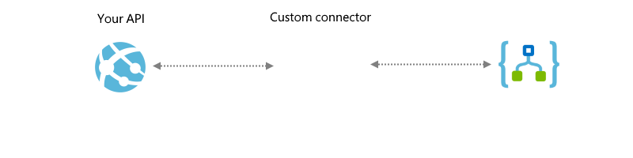
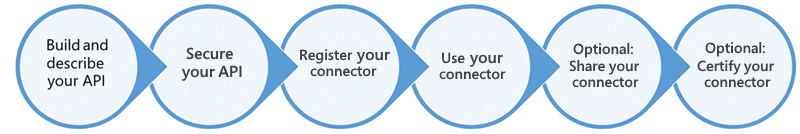
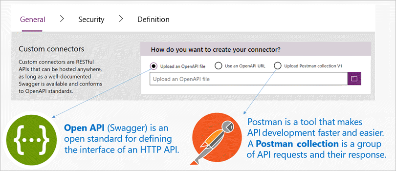

# Custom connectors overview

Without writing any code, you can build workflows or apps with 
[Azure Logic Apps](https://azure.microsoft.com/services/logic-apps/), 
[Microsoft Flow](https://flow.microsoft.com), 
or [Microsoft PowerApps](https://powerapps.microsoft.com). 
To help you integrate your data and business processes, 
these services offer [100+ connectors](../connectors/apis-list.md), 
not only for Microsoft services and products like Azure and SQL Server, 
but other services too, like GitHub, Salesforce, Twitter, and more. 

Sometimes though, you might want to call APIs, services, 
and systems that aren't available as prebuilt connectors. 
To support more tailored scenarios for your users' business and productivity needs, 
you can build *custom connectors* with their own triggers and actions.
Custom connectors expand the integrations, reach, discoverability, 
and use for your service or product, which can help increase and accelerate customer adoption.

For example, this diagram shows the interaction between a Web API, 
a custom Logic Apps connector created for that API, 
and a logic app that works with that API by using the custom connector:

This overview outlines the general high-level tasks for creating, securing, 
registering, and using plus optionally sharing or certifying your connectors:

## Prerequisites

To build your connector from start to finish, you need these items:

* An Azure subscription. If you don't have a subscription, 
you can start with a [free Azure account](https://azure.microsoft.com/free/). 
Otherwise, sign up for a [Pay-As-You-Go subscription](https://azure.microsoft.com/pricing/purchase-options/).

* A RESTful API with some type of authenticated access 

* Any item here:

  * An [OpenAPI 2.0 file](https://github.com/OAI/OpenAPI-Specification/blob/master/versions/2.0.md), 
  previously known as Swagger
  * A URL to an OpenAPI definition
  * A [Postman collection](../logic-apps/custom-connector-api-postman-collection.md) 
  for your API 

  If you don't have any of these items, 
  we provide guidance for you.

* Optional: An image to use as an icon for your custom connector

## 1. Build your RESTful API

Technically, a connector is a wrapper around a REST API 
that's based on an OpenAPI (formerly Swagger) specification 
and lets your underlying service talk to Logic Apps, Flow, or PowerApps. 
So first, you need a fully functioning API before you create your custom connector. 

You can use any language and platform for your API. For Microsoft technologies, 
we recommend one of these platforms:

* [Azure Functions](https://azure.microsoft.com/services/functions/)
* [Azure Web Apps](https://azure.microsoft.com/services/app-service/web/)
* [Azure API Apps](https://azure.microsoft.com/services/app-service/api/)

For example, this tutorial shows 
[how to build a custom connector from a Web API](../logic-apps/custom-connector-build-web-api-app-tutorial.md). 

## 2. Secure your API

You can use these authentication standards for your APIs and connectors:

   * [OAuth 2.0](https://oauth.net/2/), including 
   [Azure Active Directory](https://azure.microsoft.com/develop/identity/) 
   or specific services, such as Dropbox, GitHub, and SalesForce
   * Generic OAuth 2.0
   * [Basic authentication](https://swagger.io/docs/specification/authentication/basic-authentication/)
   * [API Key](https://swagger.io/docs/specification/authentication/api-keys/)

You can set up Azure Active Directory (Azure AD) authentication for your API 
in the Azure portal so you don't have to implement authentication through code. 
Or, you can require and enforce authentication through your API's code. 

For more information, follow the appropriate tutorials:

* [Logic Apps: Secure your custom connector](../logic-apps/custom-connector-azure-active-directory-authentication.md)
* [Flow: Secure your custom connector](https://ms.flow.microsoft.com/documentation/customapi-azure-resource-manager-tutorial/)
* [PowerApps: Secure your custom connector](https://powerapps.microsoft.com/tutorials/customapi-azure-resource-manager-tutorial/)

## 3. Describe your API 

Assuming that your API has some type of authenticated access, 
you need to describe your API's interface and operations so that 
Logic Apps, Flow, or PowerApps can communicate with your API.
Use one of these industry standard definitions:

* An [OpenAPI 2.0 file](https://swagger.io/) 
  You can start by building with an existing OpenAPI file.

  If you're new to OpenAPI, 
  visit [Getting started with Swagger](http://swagger.io/getting-started/) 
  on the swagger.io site.
  For an example OpenAPI file, see the 
  [Text Analytics API documentation](https://westus.dev.cognitive.microsoft.com/docs/services/TextAnalytics.V2.0/export?DocumentFormat=Swagger&ApiName=Azure). 

* A Postman collection, 
which automatically generates an OpenAPI file for you. 
When you don't already have an OpenAPI file 
and don't want to create one, you can still easily 
create a custom connector by using a Postman collection.

  If you're new to Postman, 
  [install the Postman app](https://www.getpostman.com/apps) 
  from their site. For more information, 
  see [Describe custom connectors with Postman](../logic-apps/custom-connector-api-postman-collection.md).

> [!IMPORTANT]
> Your file size must be less than 1 MB.

Behind the scenes, Logic Apps, Flow, and PowerApps ultimately use OpenAPI, 
parses a Postman collection, and translates the collection to an OpenAPI definition file. 
Although OpenAPI 2.0 and Postman collections use different formats, 
both are language-agnostic, machine-readable documents that 
describe your API's operations and parameters. 
You can generate these documents from various tools, 
based on the language and platform used your API. 
You can also build an OpenAPI file when you register your connector.

For example, you can create an OpenAPI file or a 
Postman collection from any REST API endpoint, including:

* Publicly available connectors, for example, 
[Spotify](https://developer.spotify.com/), 
[Slack](https://api.slack.com/), 
[Rackspace](http://docs.rackspace.com/), and so on

* An API that you created and deployed to any cloud hosting provider, 
such as Azure, Heroku, Google Cloud, and more

* A custom line-of-business API that's deployed to your network 
but only if that API is exposed on the public internet

## 4. Register your connector

The registration process helps Logic Apps, Flow, or PowerApps understand 
your API's characteristics, including the description, required authentication, 
and operations, including the parameters and outputs for each operation. 
When you start the registration process, you can provide either an 
OpenAPI file or a Postman collection, which automatically populates the 
metadata fields in the registration wizard. You can edit these fields' values at any time.

To register your connector, follow the appropriate tutorial:

* [Logic Apps: Register your connector](../logic-apps/logic-apps-custom-connector-register.md)
* [Flow: Register your connector](https://ms.flow.microsoft.com/documentation/register-custom-api/#register-your-custom-connector)
* [PowerApps: Register your connector](https://powerapps.microsoft.com/tutorials/register-custom-api/#register-your-custom-connector)

## 5. Use your connector in a logic app, flow, or app 

You can use your connector in the same way that you use Microsoft-managed connectors. 
For example, in a logic app workflow, add your custom connector so you can 
create a connection to your API, and call any operations that the API provides 
in the same way that you call operations for Microsoft-managed connectors.

## 6. Share your connector 

You can share your connector with users in your organization in the same way 
that you share resources in Logic Apps, Flow, or PowerApps. 
Although sharing is optional, you might have scenarios where 
you want to share your connectors with other users.

Registered but uncertified custom connectors work like 
Microsoft-managed connectors, but are visible and available 
*only* to the connector's author and users who have the same 
Azure Active Directory tenant and Azure subscription 
for logic apps in the region where those apps are deployed. 
The next step discusses how you can share your connector 
with external users outside these boundaries, 
for example, with all Logic Apps, Flow, and PowerApps users.

> [!IMPORTANT]
> If you share a connector, others might start to depend on that connector. 
> ***Deleting your connector deletes all connections to that connector.***

* [Logic Apps: Share your connector](../logic-apps/logic-apps-custom-connector-register.md)
* [Flow: Share your connector](https://ms.flow.microsoft.com/documentation/register-custom-api/#share-your-custom-connector)
* [PowerApps: Share your connector](https://powerapps.microsoft.com/tutorials/register-custom-api/#share-your-custom-connector)

## 7. Certify your connector

To optionally share your connector with all users in Logic Apps, Flow, 
and PowerApps, submit your connector for Microsoft certification. 
This process reviews your connector, checks for technical and content compliance, 
and validates functionality for Logic Apps, Flow, and PowerApps 
before Microsoft can publish your connector. Learn 
[how to submit your connector for Microsoft certification](../logic-apps/custom-connector-submit-certification.md).

## Get support

* For support with onboarding and development, email 
[condevhelp@microsoft.com](mailto:condevhelp@microsoft.com). 
Microsoft actively monitors this account for developer questions and problems, 
and routes them to the appropriate team. 

* For frequently asked questions, see the [Custom connector FAQ](../logic-apps/custom-connector-faq.md)

## Next steps

* [Build a custom connector from a Web API](../logic-apps/custom-connector-build-web-api-app-tutorial.md)
* [Set up authentication for custom connectors](../logic-apps/custom-connector-azure-active-directory-authentication.md)
* [Describe custom connectors with Postman collections](../logic-apps/custom-connector-api-postman-collection.md)
* [Submit custom connectors for Microsoft certification](../logic-apps/custom-connector-submit-certification.md)
