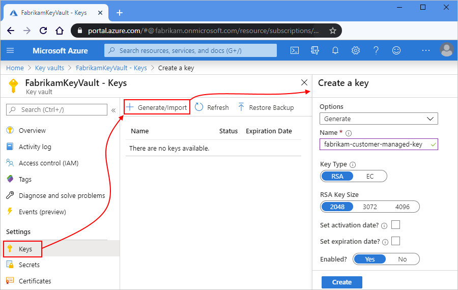
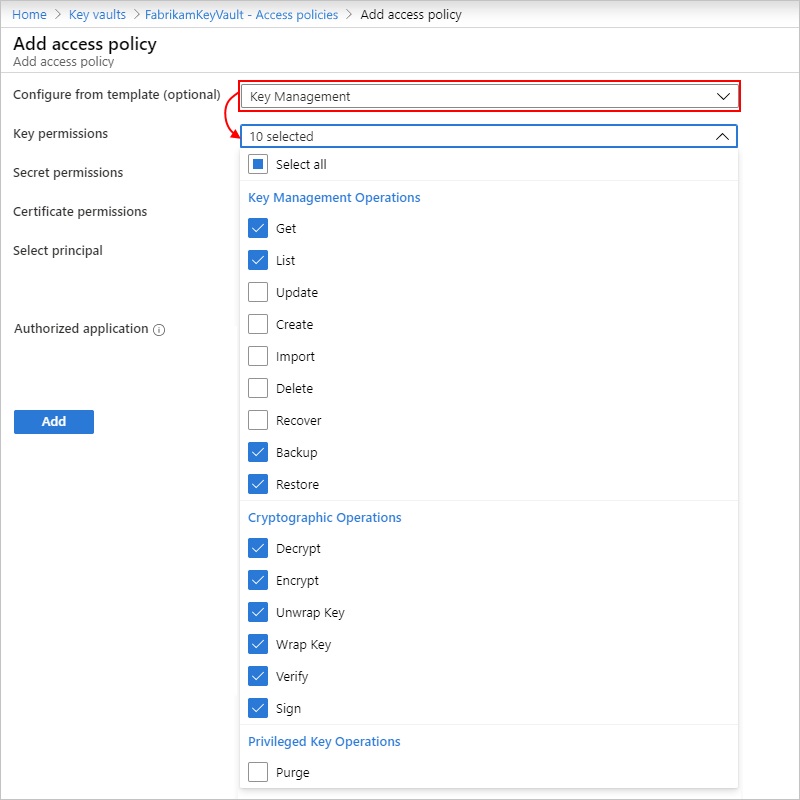
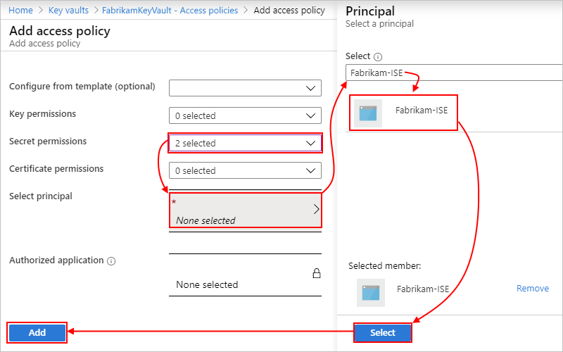

# Set up customer-managed keys to encrypt data at rest for integration service environments (ISEs) in Azure Logic Apps

Azure Logic Apps relies on Azure Storage to store and automatically [encrypt data at rest](../storage/common/storage-service-encryption.md). This encryption protects your data and helps you meet your organizational security and compliance commitments. By default, Azure Storage uses Microsoft-managed keys to encrypt your data. For more information about how Azure Storage encryption works, see [Azure Storage encryption for data at rest](../storage/common/storage-service-encryption.md) and [Azure Data Encryption-at-Rest](../security/fundamentals/encryption-atrest.md).

When you create an [integration service environment (ISE)](../logic-apps/connect-virtual-network-vnet-isolated-environment-overview.md) for hosting your logic apps, and you want more control over the encryption keys used by Azure Storage, you can set up, use, and manage your own key by using [Azure Key Vault](../key-vault/general/overview.md). This capability is known as "Bring Your Own Key" (BYOK), and your key is called a "customer-managed key". With this capability, Azure Storage automatically enables [double encryption or *infrastructure encryption* using platform-managed keys](../security/fundamentals/double-encryption.md) for your key. To learn more, see [Doubly encrypt data with infrastructure encryption](../storage/common/storage-service-encryption.md#doubly-encrypt-data-with-infrastructure-encryption).

This topic shows how to set up and specify your own encryption key to use when you create your ISE by using the Logic Apps REST API. For the general steps to create an ISE through Logic Apps REST API, see [Create an integration service environment (ISE) by using the Logic Apps REST API](../logic-apps/create-integration-service-environment-rest-api.md).

## Considerations

* At this time, customer-managed key support for an ISE is available only in the following regions:

  * Azure: West US 2, East US, and South Central US.

  * Azure Government: Arizona, Virginia, and Texas.

* You can specify a customer-managed key *only when you create your ISE*, not afterwards. You can't disable this key after your ISE is created. Currently, no support exists for rotating a customer-managed key for an ISE.

* The key vault that stores your customer-managed key must exist in the same Azure region as your ISE.

* To support customer-managed keys, your ISE requires that you enable either the [system-assigned or user-assigned managed identity](../active-directory/managed-identities-azure-resources/overview.md#managed-identity-types). This identity lets your ISE authenticate access to secured resources, such as virtual machines and other systems or services, that are in or connected to an Azure virtual network. That way, you don't have to sign in with your credentials.

* Currently, to create an ISE that supports customer-managed keys and has either managed identity type enabled, you have to call the Logic Apps REST API by using an HTTPS PUT request.

* You must [give key vault access to your ISE's managed identity](#identity-access-to-key-vault), but the timing depends on which managed identity that you use.

  * **System-assigned managed identity**: Within *30 minutes after* you send the HTTPS PUT request that creates your ISE, you must [give key vault access to your ISE's managed identity](#identity-access-to-key-vault). Otherwise, ISE creation fails, and you get a permissions error.

  * **User-assigned managed identity**: Before you send the HTTPS PUT request that creates your ISE, [give key vault access to your ISE's managed identity](#identity-access-to-key-vault).

## Prerequisites

* The same [prerequisites](../logic-apps/connect-virtual-network-vnet-isolated-environment.md#prerequisites) and [requirements to enable access for your ISE](../logic-apps/connect-virtual-network-vnet-isolated-environment.md#enable-access) as when you create an ISE in the Azure portal

* An Azure key vault that has the **Soft Delete** and **Do Not Purge** properties enabled

  For more information about enabling these properties, see [Azure Key Vault soft-delete overview](../key-vault/general/soft-delete-overview.md) and [Configure customer-managed keys with Azure Key Vault](../storage/common/customer-managed-keys-configure-key-vault.md). If you're new to [Azure Key Vault](../key-vault/general/overview.md), learn how to create a key vault using [Azure portal](../key-vault/general/quick-create-portal.md), [Azure CLI](../key-vault/general/quick-create-cli.md), or [Azure PowerShell](../key-vault/general/quick-create-powershell.md).

* In your key vault, a key that's created with these property values:

  | Property | Value |
  |----------|-------|
  | **Key Type** | RSA |
  | **RSA Key Size** | 2048 |
  | **Enabled** | Yes |
  |||

  

  For more information, see [Configure customer-managed keys with Azure Key Vault](../storage/common/customer-managed-keys-configure-key-vault.md) or the Azure PowerShell command, [Add-AzKeyVaultKey](/powershell/module/az.keyvault/add-azkeyvaultkey).

* A tool that you can use to create your ISE by calling the Logic Apps REST API with an HTTPS PUT request. For example, you can use [Postman](https://www.getpostman.com/downloads/), or you can build a logic app that performs this task.

<a name="enable-support-key-managed-identity"></a>

## Create ISE with key vault and managed identity support

To create your ISE by calling the Logic Apps REST API, make this HTTPS PUT request:

`PUT https://management.azure.com/subscriptions/{subscriptionId}/resourceGroups/{resourceGroupName}/providers/Microsoft.Logic/integrationServiceEnvironments/{integrationServiceEnvironmentName}?api-version=2019-05-01`

> [!IMPORTANT]
> The Logic Apps REST API 2019-05-01 version requires that you make your own HTTPS PUT request for ISE connectors.

Deployment usually takes within two hours to finish. Occasionally, deployment might take up to four hours. To check deployment status, in the [Azure portal](https://portal.azure.com), on your Azure toolbar, select the notifications icon, which opens the notifications pane.

> [!NOTE]
> If deployment fails or you delete your ISE, Azure might take up to an hour 
> before releasing your subnets. This delay means means you might have to wait 
> before reusing those subnets in another ISE.
>
> If you delete your virtual network, Azure generally takes up to two hours 
> before releasing up your subnets, but this operation might take longer. 
> When deleting virtual networks, make sure that no resources are still connected. 
> See [Delete virtual network](../virtual-network/manage-virtual-network.md#delete-a-virtual-network).

### Request header

In the request header, include these properties:

* `Content-type`: Set this property value to `application/json`.

* `Authorization`: Set this property value to the bearer token for the customer who has access to the Azure subscription or resource group that you want to use.

### Request body

In the request body, enable support for these additional items by providing their information in your ISE definition:

* The managed identity that your ISE uses to access your key vault
* Your key vault and the customer-managed key that you want to use

#### Request body syntax

Here is the request body syntax, which describes the properties to use when you create your ISE:

```json
{
   "id": "/subscriptions/{Azure-subscription-ID}/resourceGroups/{Azure-resource-group}/providers/Microsoft.Logic/integrationServiceEnvironments/{ISE-name}",
   "name": "{ISE-name}",
   "type": "Microsoft.Logic/integrationServiceEnvironments",
   "location": "{Azure-region}",
   "sku": {
      "name": "Premium",
      "capacity": 1
   },
   "identity": {
      "type": <"SystemAssigned" | "UserAssigned">,
      // When type is "UserAssigned", include the following "userAssignedIdentities" object:
      "userAssignedIdentities": {
         "/subscriptions/{Azure-subscription-ID}/resourceGroups/{Azure-resource-group}/providers/Microsoft.ManagedIdentity/userAssignedIdentities/{user-assigned-managed-identity-object-ID}": {
            "principalId": "{principal-ID}",
            "clientId": "{client-ID}"
         }
      }
   },
   "properties": {
      "networkConfiguration": {
         "accessEndpoint": {
            // Your ISE can use the "External" or "Internal" endpoint. This example uses "External".
            "type": "External"
         },
         "subnets": [
            {
               "id": "/subscriptions/{Azure-subscription-ID}/resourceGroups/{Azure-resource-group}/providers/Microsoft.Network/virtualNetworks/{virtual-network-name}/subnets/{subnet-1}",
            },
            {
               "id": "/subscriptions/{Azure-subscription-ID}/resourceGroups/{Azure-resource-group}/providers/Microsoft.Network/virtualNetworks/{virtual-network-name}/subnets/{subnet-2}",
            },
            {
               "id": "/subscriptions/{Azure-subscription-ID}/resourceGroups/{Azure-resource-group}/providers/Microsoft.Network/virtualNetworks/{virtual-network-name}/subnets/{subnet-3}",
            },
            {
               "id": "/subscriptions/{Azure-subscription-ID}/resourceGroups/{Azure-resource-group}/providers/Microsoft.Network/virtualNetworks/{virtual-network-name}/subnets/{subnet-4}",
            }
         ]
      },
      "encryptionConfiguration": {
         "encryptionKeyReference": {
            "keyVault": {
               "id": "subscriptions/{Azure-subscription-ID}/resourceGroups/{Azure-resource-group}/providers/Microsoft.KeyVault/vaults/{key-vault-name}",
            },
            "keyName": "{customer-managed-key-name}",
            "keyVersion": "{key-version-number}"
         }
      }
   }
}
```

#### Request body example

This example request body shows the sample values:

```json
{
   "id": "/subscriptions/********************/resourceGroups/Fabrikam-RG/providers/Microsoft.Logic/integrationServiceEnvironments/Fabrikam-ISE",
   "name": "Fabrikam-ISE",
   "type": "Microsoft.Logic/integrationServiceEnvironments",
   "location": "WestUS2",
   "identity": {
      "type": "UserAssigned",
      "userAssignedIdentities": {
         "/subscriptions/********************/resourceGroups/Fabrikam-RG/providers/Microsoft.ManagedIdentity/userAssignedIdentities/*********************************": {
            "principalId": "*********************************",
            "clientId": "*********************************"
         }
      }
   },
   "sku": {
      "name": "Premium",
      "capacity": 1
   },
   "properties": {
      "networkConfiguration": {
         "accessEndpoint": {
            // Your ISE can use the "External" or "Internal" endpoint. This example uses "External".
            "type": "External"
         },
         "subnets": [
            {
               "id": "/subscriptions/********************/resourceGroups/Fabrikam-RG/providers/Microsoft.Network/virtualNetworks/Fabrikam-VNET/subnets/subnet-1",
            },
            {
               "id": "/subscriptions/********************/resourceGroups/Fabrikam-RG/providers/Microsoft.Network/virtualNetworks/Fabrikam-VNET/subnets/subnet-2",
            },
            {
               "id": "/subscriptions/********************/resourceGroups/Fabrikam-RG/providers/Microsoft.Network/virtualNetworks/Fabrikam-VNET/subnets/subnet-3",
            },
            {
               "id": "/subscriptions/********************/resourceGroups/Fabrikam-RG/providers/Microsoft.Network/virtualNetworks/Fabrikam-VNET/subnets/subnet-4",
            }
         ]
      },
      "encryptionConfiguration": {
         "encryptionKeyReference": {
            "keyVault": {
               "id": "subscriptions/********************/resourceGroups/Fabrikam-RG/providers/Microsoft.KeyVault/vaults/FabrikamKeyVault",
            },
            "keyName": "Fabrikam-Encryption-Key",
            "keyVersion": "********************"
         }
      }
   }
}
```

<a name="identity-access-to-key-vault"></a>

## Grant access to your key vault

Although the timing differs based on the managed identity that you use, you must [give key vault access to your ISE's managed identity](#identity-access-to-key-vault).

* **System-assigned managed identity**: Within *30 minutes after* you send the HTTPS PUT request that creates your ISE, you must add an access policy to your key vault for your ISE's system-assigned managed identity. Otherwise, creation for your ISE fails, and you get a permissions error.

* **User-assigned managed identity**: Before you send the HTTPS PUT request that creates your ISE, add an access policy to your key vault for your ISE's user-assigned managed identity.

For this task, you can use either the Azure PowerShell [Set-AzKeyVaultAccessPolicy](/powershell/module/az.keyvault/set-azkeyvaultaccesspolicy) command, or you can follow these steps in the Azure portal:

1. In the [Azure portal](https://portal.azure.com), open your Azure key vault.

1. On your key vault menu, select **Access policies** > **Add Access Policy**, for example:

   

1. After the **Add access policy** pane opens, follow these steps:

   1. Select these options:

      | Setting | Values |
      |---------|--------|
      | **Configure from template (optional) list** | Key Management |
      | **Key permissions** | - **Key Management Operations**: Get, List <p><p>- **Cryptographic Operations**: Unwrap Key, Wrap Key |
      |||

      

   1. For **Select principal**, select **None selected**. After the **Principal** pane opens, in the search box, find and select your ISE. When you're done, choose **Select** > **Add**.

      

   1. When you're finished with the **Access policies** pane, select **Save**.

For more information, see [How to authenticate to Key Vault](../key-vault/general/authentication.md) and [Assign a Key Vault access policy](../key-vault/general/assign-access-policy-portal.md).

## Next steps

* Learn more about [Azure Key Vault](../key-vault/general/overview.md)
