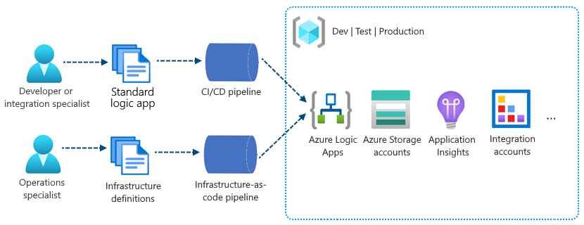

# DevOps deployment for single-tenant Azure Logic Apps

[!INCLUDE [logic-apps-sku-standard](../../includes/logic-apps-sku-standard.md)]

With the trend towards distributed and native cloud apps, organizations are dealing with more distributed components across more environments. To maintain control and consistency, you can automate your environments and deploy more components faster and more confidently by using DevOps tools and processes.

This article provides an introduction and overview about the current continuous integration and continuous deployment (CI/CD) experience for single-tenant Azure Logic Apps.

<a name="single-tenant-versus-multi-tenant"></a>

## Single-tenant versus multi-tenant

In the *multi-tenant* Azure Logic Apps, resource deployment is based on Azure Resource Manager templates (ARM templates), which combine and handle resource provisioning for both logic apps and infrastructure. In *single-tenant* Azure Logic Apps, deployment becomes easier because you can separate resource provisioning between apps and infrastructure.

When you create logic apps using the **Logic App (Standard)** resource type, your workflows are powered by the redesigned single-tenant Azure Logic Apps runtime. This runtime uses the [Azure Functions extensibility model](../azure-functions/functions-bindings-register.md) extensibility and is [hosted as an extension on the Azure Functions runtime](https://techcommunity.microsoft.com/t5/integrations-on-azure/azure-logic-apps-running-anywhere-runtime-deep-dive/ba-p/1835564). This design provides portability, flexibility, and more performance for your logic apps plus other capabilities and benefits inherited from the Azure Functions platform and Azure App Service ecosystem.

For example, you can package the redesigned containerized runtime and workflows together as part of your logic app. You can use generic steps or tasks that build, assemble, and zip your logic app resources into ready-to-deploy artifacts. To deploy your apps, copy the artifacts to the host environment and then start your apps to run your workflows. Or, integrate your artifacts into deployment pipelines using the tools and processes that you already know and use. For example, if your scenario requires containers, you can containerize your logic apps and integrate them into your existing pipelines.

To set up and deploy your infrastructure resources, such as virtual networks and connectivity, you can continue using ARM templates and separately provision those resources along with other processes and pipelines that you use for those purposes.

By using standard build and deploy options, you can focus on app development separately from infrastructure deployment. As a result, you get a more generic project model where you can apply many similar or the same deployment options that you use for a generic app. You also benefit from a more consistent experience for building deployment pipelines around your app projects and for running the required tests and validations before publishing to production. No matter which technology stack you use, you can deploy logic apps using your own chosen tools.

<a name="devops-deployment-features"></a>

## DevOps deployment capabilities

Single-tenant Azure Logic Apps inherits many capabilities and benefits from the Azure Functions platform and Azure App Service ecosystem. These updates include a whole new deployment model and more ways to use DevOps for your logic app workflows.

<a name="local-development-testing"></a>

### Local development and testing

When you use Visual Studio Code with the Azure Logic Apps (Standard) extension, you can locally develop, build, and run single-tenant based logic app workflows in your development environment without having to deploy to Azure. If your scenario requires containers, you can create and deploy through [Azure Arc enabled Logic Apps](azure-arc-enabled-logic-apps-overview.md).

This capability is a major improvement and provides a substantial benefit compared to the multi-tenant model, which requires you to develop against an existing and running resource in Azure.

<a name="separate-concerns"></a>

### Separate concerns

The single-tenant model gives you the capability to separate the concerns between app and the underlying infrastructure. For example, you can develop, build, zip, and deploy your app separately as an immutable artifact to different environments. Logic app workflows typically have "application code" that you update more often than the underlying infrastructure. By separating these layers, you can focus more on building out your logic app's workflow and spend less on your effort to deploy the required resources across multiple environments.



<a name="resource-structure"></a>

### Logic app resource structure

[!INCLUDE [Visual Studio Code - logic app resource structure](../../includes/logic-apps-single-tenant-resource-structure.md)]

### Logic app project structure

[!INCLUDE [Visual Studio Code - logic app project structure](../../includes/logic-apps-single-tenant-project-structure-visual-studio-code.md)]

<a name="deployment-containers"></a>

### Container deployment

Single-tenant Azure Logic Apps supports deployment to containers, which means that you can containerize your logic app workflows and run them where containers can run. After you containerize your app, deployment works mostly the same as any other container you deploy and manage.

For examples that include Azure DevOps, review [CI/CD for Containers](https://azure.microsoft.com/solutions/architecture/cicd-for-containers/).

<a name="app-settings-parameters"></a>

### App settings and parameters

In multi-tenant Azure Logic Apps, ARM templates pose a challenge when you have to maintain environment variables for logic apps across various dev, test, and production environments. Everything in an ARM template is defined at deployment. If you need to change just a single variable, you have to redeploy everything.

In single-tenant Azure Logic Apps, you can call and reference your environment variables at runtime by using app settings and parameters, so you don't have to redeploy as often.

<a name="managed-connectors-built-in-operations"></a>

## Managed connectors and built-in operations

The Azure Logic Apps ecosystem provides [hundreds of Microsoft-managed connectors](/connectors/connector-reference/connector-reference-logicapps-connectors) and built-in operations as part of a constantly growing collection that you can use in single-tenant Azure Logic Apps. The way that Microsoft maintains these connectors and built-in operations stays mostly the same in single-tenant Azure Logic Apps.

The most significant improvement is that the single-tenant service makes more popular managed connectors also available as built-in operations. For example, you can use built-in operations for Azure Service Bus, Azure Event Hubs, SQL, and others. Meanwhile, the managed connector versions are still available and continue to work.

The connections that you create using built-in operations are called built-in connections, or *service provider connections*. Built-in operations and their connections run locally in the same process that runs your workflows. Both are hosted on the redesigned Logic Apps runtime. In contrast, managed connections, or API connections, are created and run separately as Azure resources, which you deploy using ARM templates. As a result, built-in operations and their connections provide better performance due to their proximity to your workflows. This design also works well with deployment pipelines because the service provider connections are packaged into the same build artifact.

In Visual Studio Code, when you use the designer to develop or make changes to your workflows, the Logic Apps engine automatically generates any necessary connection metadata in your project's **connections.json** file. The following sections describe the three kinds of connections that you can create in your workflows. Each connection type has a different JSON structure, which is important to understand because endpoints change when you move between environments.

<a name="service-provider-connections"></a>

### Service provider connections

When you use a built-in operation for a service such as Azure Service Bus or Azure Event Hubs in single-tenant Azure Logic Apps, you create a service provider connection that runs in the same process as your workflow. This connection infrastructure is hosted and managed as part of your logic app resource, and your app settings store the connection strings for any service provider-based built-in operation that your workflows use.

In your logic app project, each workflow has a workflow.json file that contains the workflow's underlying JSON definition. This workflow definition then references the necessary connection strings in your project's connections.json file.

The following example shows how the service provider connection for a built-in Service Bus operation appears in your project's connections.json file:

```json
"serviceProviderConnections": {
   "{service-bus-connection-name}": {
      "parameterValues": {
         "connectionString": "@appsetting('servicebus_connectionString')"
      },
      "serviceProvider": {
         "id": "/serviceProviders/serviceBus"
      },
      "displayName": "{service-bus-connection-name}"
   },
   <...>
}
```

<a name="managed-connections"></a>

### Managed connections

When you use a managed connector for the first time in your workflow, you're prompted to create a managed API connection for the target service or system and authenticate your identity. These connectors are managed by the shared connectors ecosystem in Azure. The API connections exist and run as separate resources in Azure.

In Visual Studio Code, while you continue to create and develop your workflow using the designer, the Logic Apps engine automatically creates the necessary resources in Azure for the managed connectors in your workflow. The engine automatically adds these connection resources to the Azure resource group that you designed to contain your logic app.

The following example shows how an API connection for the managed Service Bus connector appears in your project's connections.json file:

```json
"managedApiConnections": {
   "{service-bus-connection-name}": { 
      "api": {
         "id": "/subscriptions/{subscription-ID}/providers/Microsoft.Web/locations/{region}/managedApis/servicebus"
      },
      "connection": { 
         "id": "/subscriptions/{subscription-ID}/resourcegroups/{resource-group-name}/providers/Microsoft.Web/connections/servicebus"
      }, 
      "connectionRuntimeUrl": "{connection-runtime-URL}",
      "authentication": { 
         "type": "Raw",
         "scheme": "Key",
         "parameter": "@appsetting('servicebus_1-connectionKey')"
      },
   },
   <...>
}
```

<a name="azure-functions-connections"></a>

### Azure Functions connections

To call functions created and hosted in Azure Functions, you use the built-in Azure Functions operation. Connection metadata for Azure Functions calls is different from other built-in-connections. This metadata is stored in your logic app project's connections.json file, but looks different:

```json
"functionConnections": {
   "{function-operation-name}": {
      "function": { 
         "id": "/subscriptions/{subscription-ID}/resourceGroups/{resource-group-name}/providers/Microsoft.Web/sites/{function-app-name}/functions/{function-name}"
      },
      "triggerUrl": "{function-url}",
      "authentication": {
        "type": "QueryString",
         "name": "Code",
         "value": "@appsetting('azureFunctionOperation_functionAppKey')"
      }, 
      "displayName": "{functions-connection-display-name}"
   },
   <...>
}
```

## Authentication

In single-tenant Azure Logic Apps, the hosting model for logic app workflows is a single tenant where your workloads benefit from more isolation than in the multi-tenant model. Plus, the single-tenant Azure Logic Apps runtime is portable, which means you can run your workflows in other environments, for example, locally in Visual Studio Code. Still, this design requires a way for logic apps to authenticate their identity so they can access the managed connector ecosystem in Azure. Your apps also need the correct permissions to run operations when using managed connections.

By default, each single-tenant based logic app has an automatically enabled system-assigned managed identity. This identity differs from the authentication credentials or connection string used for creating a connection. At runtime, your logic app uses this identity to authenticate its connections through Azure access policies. If you disable this identity, connections won't work at runtime.

The following sections provide more information about the authentication types that you can use to authenticate managed connections, based on where your logic app runs. For each managed connection, your logic app project's connections.json file has an `authentication` object that specifies the authentication type that your logic app can use to authenticate that managed connection.

### Managed identity

For a logic app that is hosted and run in Azure, a [managed identity](create-managed-service-identity.md) is the default and recommended authentication type to use for authenticating managed connections that are hosted and run in Azure. In your logic app project's connections.json file, the managed connection has an `authentication` object that specifies `ManagedServiceIdentity` as the authentication type:

```json
"authentication": {
   "type": "ManagedServiceIdentity"
}
```

### Raw

For logic apps that run in your local development environment using Visual Studio Code, raw authentication keys are used for authenticating managed connections that are hosted and run in Azure. These keys are designed for development use only, not production, and have a 7-day expiration. In your logic app project's connections.json file, the managed connection has an `authentication` object specifies the following the authentication information:

```json
"authentication": {
   "type": "Raw", 
   "scheme": "Key", 
   "parameter": "@appsetting('connectionKey')"
 }
```

## Next steps

- [Set up DevOps deployment for single-tenant Azure Logic Apps](set-up-devops-deployment-single-tenant-azure-logic-apps.md)
