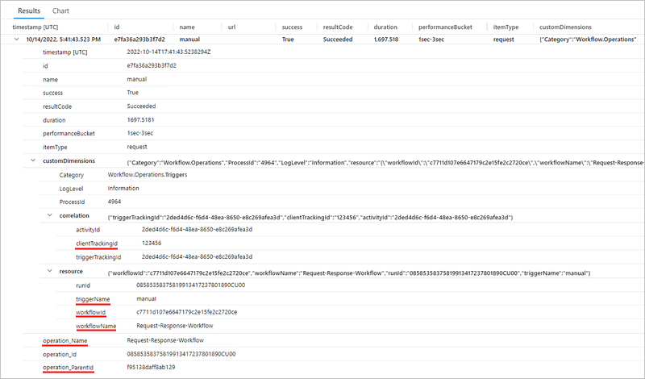
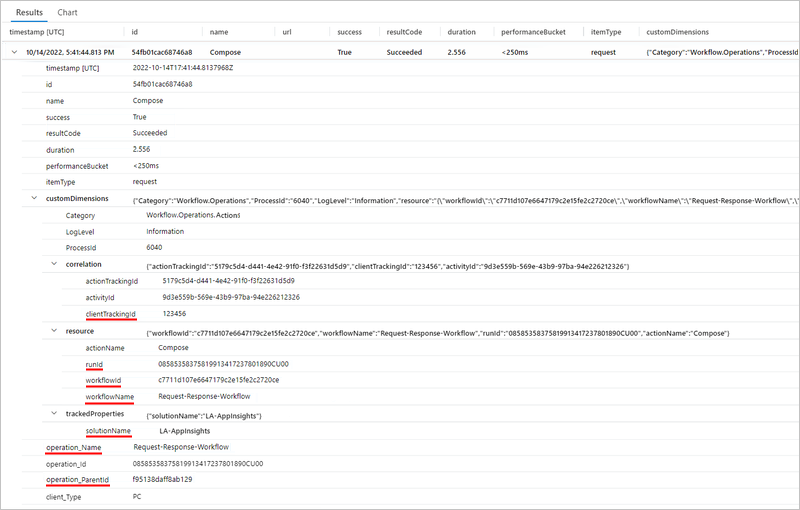

# Enable enhanced telemetry in Application Insights for Standard workflows in Azure Logic Apps

[!INCLUDE [logic-apps-sku-standard](../../includes/logic-apps-sku-standard.md)]


## Prerequisites

- An Azure account and subscription. If you don't have a subscription, [sign up for a free Azure account](https://azure.microsoft.com/free/?WT.mc_id=A261C142F).

- An [Application Insights](../azure-monitor/app/app-insights-overview.md) instance. You create this resource [in advance](../azure-monitor/app/create-workspace-resource.md), when you create your Standard logic app, or after logic app deployment.

- A Standard logic app and workflow, either in the Azure portal or in Visual Studio Code.

  - Your logic app resource or project must use the Azure Functions v4 runtime, which is enabled by default.

  - Your logic app must [have enabled Application Insights](create-single-tenant-workflows-azure-portal.md#enable-open-application-insights) for diagnostics logging and tracing. You can do so either when you create your logic app or after deployment.

## Enable enhanced metrics and insights

### [Portal](#tab/portal)

1. In the [Azure portal](https://portal.azure.com), open your Standard logic app resource.

1. On the logic app menu, under **Development Tools**, select **Advanced Tools**. On the **Advanced Tools** page, select **Go**, which opens the Kudu tools.

1. On the **Kudu** page, from the **Debug console** menu, select **CMD**. In the folder directory table, browse to the following file and select **Edit**: **site/wwwroot/host.json**

1. In the **host.json** file, add the following JSON code:

   ```json
   {
      "version": "2.0",
      "extensionBundle": {
         "id": "Microsoft.Azure.Functions.ExtensionBundle.Workflows",
         "version": "[1, 2.00]"
      },
      "extensions": {
         "workflow": {
            "Settings": {
               "Runtime.ApplicationInsightTelemetryVersion": "v2"
            }
         }
      }
   }
   ```

   This configuration enables the default level of verbosity. For other options, see [Filter events at the source](#filter-events-source).

### [Visual Studio Code](#tab/visual-studio-code)

1. In Visual Studio Code, open your logic app project, and then open the project's **host.json** file.

1. In the **host.json** file, add the following JSON code:

   ```json
   {
      "version": "2.0",
      "extensionBundle": {
         "id": "Microsoft.Azure.Functions.ExtensionBundle.Workflows",
         "version": "[1, 2.00]"
      },
      "extensions": {
         "workflow": {
            "Settings": {
               "Runtime.ApplicationInsightTelemetryVersion": "v2"
            }
         }
      }
   }
   ```

   This configuration enables the default level of verbosity. For other options, see [Filter events at the source](#filter-events-source).

---

## Events telemetry in Application Insights

The following sections describe the tables in Application Insights where you can find the enhanced telemetry emitted from your workflow run.

### Requests table - Events

In Application Insights, the **Requests** table contains operation events from a Standard workflow. This table tracks fields that contain data generated by a Standard workflow.

To show how this data gets into these tracked fields, the following example Standard workflow uses a **Request** trigger. The trigger settings has a parameter named **Custom Tracking Id**. The parameter value is set to an expression that pulls the **orderId** property value from the body of an incoming message:


Next, the workflow's **Compose** action settings has an added tracked property named **solutionName**. The property value is set to the name of the logic app resource.


To view the events in the Requests table, see [Query the Results table to view events](#requests-table-view-events).

### Requests table - Retries

The **Requests** table contains operation retries in a Standard workflow. To show how these retries get into the Requests table, the following example Standard workflow uses an **HTTP** action that calls a URL, which doesn't resolve. The workflow also has a retry policy that is set to a fixed interval that retries three times, once every 60 seconds.


To view the retries in the Requests table, see [Query the Results table to view retries](#requests-table-view-retries).

<a name="requests-table-view-events"></a>

### Query the Requests table to view events

1. To view the operation events log after the workflow runs and a few minutes pass, you can run the following query in Application Insights:

   ```kusto
   requests
   | sort by timestamp desc
   | take 10
   ```

   The following example shows the **Results** table with the noted columns and data in each row:

   

   | Column | Description | Example |
   |--------|-------------|---------|
   | **name** | Workflow operation name | For this example, the rows show **manual** (Request trigger), **Compose**, and **Response**. |
   | **success** | Operation execution status | For this example, all the rows show **True** for a successful execution. If an error happened, the value is **False**. |
   | **resultCode** | Operation execution status code | For this example, all the rows show **Succeeded** (200). |
   | **duration** | Operation execution duration | Varies for each operation. |

1. To view the details for a specific operation, expand the row for that operation.

   The following example shows the expanded details for the **Request** trigger:

   

   | Property | Description | Example |
   |----------|-------------|---------|
   | **clientTrackingId** | Custom tracking ID, if specified | **123456** |
   | **triggerName** | Trigger name | **manual** |
   | **workflowId** | ID for the workflow that ran the trigger | **c7711d107e6647179c2e15fe2c2720ce** |
   | **workflowName** | Name for the workflow that ran the trigger | **Request-Response-Workflow** |
   | **operation_Name** | Name for the operation that ran the trigger. In this case, this name is the same as the workflow name. | **Request-Response-Workflow** |
   | **operation_ParentId** | Linkable ID for the workflow that called the trigger | **f95138daff8ab129** |

   The following example shows the expanded details for the **Compose** action:

   

   | Property | Description | Example |
   |----------|-------------|---------|
   | **clientTrackingId** | Custom tracking ID, if specified | **123456** |
   | **actionName** | Action name | **Compose** |
   | **runId** | ID for the workflow run instance | **08585358375819913417237801890CU00** |
   | **workflowId** | ID for the workflow that ran the action | **c7711d107e6647179c2e15fe2c2720ce** |
   | **workflowName** | Name for the workflow that ran the action | **Request-Response-Workflow** |
   | **solutionName** | Tracked property name, if specified | **LA-AppInsights** |
   | **operation_Name** | Name for the operation that ran the action. In this case, this name is the same as the workflow name. | **Request-Response-Workflow** |
   | **operation_ParentId** | Linkable ID for the workflow that called the action | **f95138daff8ab129** |

   You might also noticed the following properties:

   | Property | Description |
   |----------|-------------|
   | **operation_Id** | ID for the component that just ran. If an exceptions or dependencies exist, this value transcends the tables so you can link to these executions. |
   | **Category** | For workflow executions, this value is always expected to be **Workflow.Operations.Triggers** or **Workflow.Operations.Actions**, which you can use to filter log verbosity. |

#### Query the Requests table using specific properties

For example, you can use the **clientTrackingId** value and the tracked property **operation_Name** value to filter your query results and show all requests with these specific values:

```kusto
requests
| where operation_Name == "Request-Response-Workflow"
| extend correlation = todynamic(tostring(customDimensions.correlation))
| where correlation.clientTrackingId == "123456"
```


The following example query uses the **operation_Name** and **solutionName** tracked property values:

```kusto
requests
| where operation_Name == "Request-Response-Workflow" and customDimensions has "trackedProperties"
| extend trackedProperties = todynamic(tostring(customDimensions.trackedProperties))
| where trackedProperties.solutionName == "LA-AppInsights"
```


<a name="requests-table-view-retries"></a>

### Query the Requests table to view retries

1. To view the retries after the workflow runs and a few minutes pass, you can run the following query in Application Insights:

   ```kusto
   requests
   | sort by timestamp desc
   | take 10
   ```

1. To view the retries for an operation with a retry policy, expand the row for that operation.

   The following example shows the expanded details for the **HTTP** action:

   

   | Property | Description | Example |
   |----------|-------------|---------|
   | **clientTrackingId** | Custom tracking ID, if specified | **123456** |
   | **triggerName** | Trigger name | **manual** |
   | **workflowId** | ID for the workflow that ran the trigger | **c7711d107e6647179c2e15fe2c2720ce** |
   | **workflowName** | Name for the workflow that ran the trigger | **Request-Response-Workflow** |
   | **operation_Name** | Name for the operation that ran the trigger. In this case, this name is the same as the workflow name. | **Request-Response-Workflow** |
   | **operation_ParentId** | Linkable ID for the workflow that called the trigger | **f95138daff8ab129** |


<a name="filter-events-source"></a>

## Filter events at the source

In Application Insights, you can filter events in the following ways:

- Write queries.
- Filter at the source by specifying criteria to evaluate before emitting events. By applying filters at the source, you can reduce the amount of necessary storage and as a result, operating costs.

