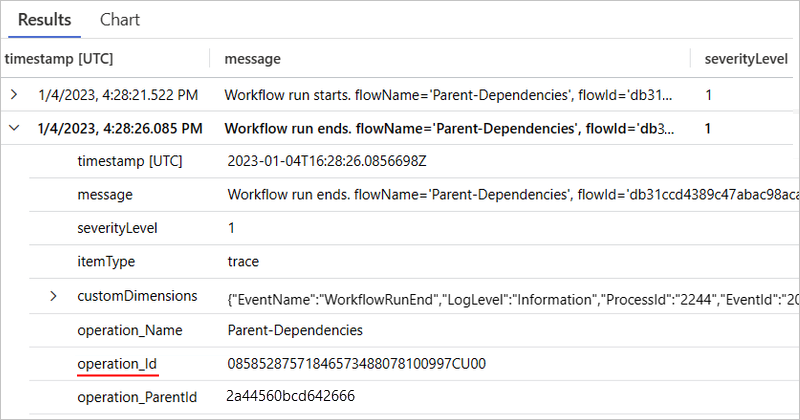

# Enable and view enhanced telemetry in Application Insights for Standard workflows in Azure Logic Apps

[!INCLUDE [logic-apps-sku-standard](../../includes/logic-apps-sku-standard.md)]

This how-to guide shows how to turn on enhanced telemetry collection in Application Insights for your Standard logic app resource and then view the collected data after your workflow finishes a run.

## Prerequisites

- An Azure account and subscription. If you don't have a subscription, [sign up for a free Azure account](https://azure.microsoft.com/free/?WT.mc_id=A261C142F).

- An [Application Insights](../azure-monitor/app/app-insights-overview.md) instance. You create this resource [in advance](../azure-monitor/app/create-workspace-resource.md), when you create your Standard logic app, or after logic app deployment.

- A Standard logic app and workflow, either in the Azure portal or in Visual Studio Code.

  - Your logic app resource or project must use the Azure Functions v4 runtime, which is enabled by default.

  - Your logic app must [have enabled Application Insights](create-single-tenant-workflows-azure-portal.md#enable-open-application-insights) for diagnostics logging and tracing. You can do so either when you create your logic app or after deployment.

## Enable enhanced telemetry in Application Insights

### [Portal](#tab/portal)

1. In the [Azure portal](https://portal.azure.com), open your Standard logic app resource.

1. On the logic app menu, under **Development Tools**, select **Advanced Tools**. On the **Advanced Tools** page, select **Go**, which opens the Kudu tools.

1. On the **Kudu** page, from the **Debug console** menu, select **CMD**. In the folder directory table, browse to the following file and select **Edit**: **site/wwwroot/host.json**

1. In the **host.json** file, add the following JSON code:

   ```json
   {
      "version": "2.0",
      "extensionBundle": {
         "id": "Microsoft.Azure.Functions.ExtensionBundle.Workflows",
         "version": "[1, 2.00]"
      },
      "extensions": {
         "workflow": {
            "Settings": {
               "Runtime.ApplicationInsightTelemetryVersion": "v2"
            }
         }
      }
   }
   ```

   This configuration enables the default level of verbosity. For other options, see [Apply filtering at the source](#filter-events-source).

### [Visual Studio Code](#tab/visual-studio-code)

1. In Visual Studio Code, open your logic app project, and then open the project's **host.json** file.

1. In the **host.json** file, add the following JSON code:

   ```json
   {
      "version": "2.0",
      "extensionBundle": {
         "id": "Microsoft.Azure.Functions.ExtensionBundle.Workflows",
         "version": "[1, 2.00]"
      },
      "extensions": {
         "workflow": {
            "Settings": {
               "Runtime.ApplicationInsightTelemetryVersion": "v2"
            }
         }
      }
   }
   ```

   This configuration enables the default level of verbosity. For other options, see [Apply filtering at the source](#filter-events-source).

---

<a name="open-application-insights"></a>

## Open Application Insights

After your workflow finishes a run and a few minutes pass, open your Application Insights resource.

1. In the [Azure portal](https://portal.azure.com), on your logic app menu, under **Settings**, select **Application Insights**.

1. On the Application Insights resource menu, under **Monitoring**, select **Logs**.

<a name="view-enhanced-logs"></a>

## View enhanced logs in Application Insights

The following sections describe the tables in Application Insights where you can find and view the enhanced telemetry generated from your workflow run.

| Table name | Description |
|------------|-------------|
| [Requests](#requests-table) | Details about the following events in workflow runs: <br><br>- Trigger and action events <br>- Retry attempts <br>- Connector usage |
| [Traces](#traces-table) | Details about the following events in workflow runs: <br><br>- Workflow start and end events <br>- Batch send and batch receive events |
| [Exceptions](#exceptions-table) | Details about exception events in workflow runs |
| [Dependencies](#dependencies-table) | Details about dependency events in workflow runs |

### Requests table

The Requests table contains fields that track data about the following events in Standard workflow runs:

- Trigger and action events
- Retry attempts
- Connector usage

To show how data gets into these fields, suppose you have the following example Standard workflow that starts with the **Request** trigger followed by the **Compose** action and the **Response** action.


The trigger's settings has a parameter named **Custom Tracking Id**. The parameter value is set to an expression that pulls the **orderId** property value from the body of an incoming message:


Next, the workflow's **Compose** action settings has an added tracked property named **solutionName**. The property value is set to the name of the logic app resource.


 The **Compose** action is followed by a **Response** action that returns a response to the caller.

The following list has example queries that you can create and run against the Requests table:

| Task | Steps |
|------|-------|
| View all trigger and action events | [Query for all trigger and action events](#requests-table-view-all-trigger-action-events) |
| View only trigger events or action events | [Query for only trigger or action events](#requests-table-view-trigger-or-action-events) |
| View trigger or action events with a specific operation type | [Query trigger or action events by operation type](#requests-table-view-trigger-action-events-type) |
| View trigger and action events with a specific workflow run ID | [Query trigger and action events by workflow run ID](#requests-table-view-trigger-action-events-workflow-id) |
| View trigger and action events with a specific client tracking ID | [Query trigger and action events by client tracking ID](#requests-table-view-events-client-tracking-id)
| View trigger and action events with a specific solution name | [Query trigger and action events by solution name](#requests-table-view-events-solution-name) |
| View trigger and action events with retry attempts | [Query trigger and action events for retry attempts](#requests-table-view-retries) |
| View trigger and action events with connector usage | [Query for trigger and action events for connector usage](#requests-table-view-connector-usage) |

<a name="requests-table-view-all-trigger-action-events"></a>

#### Query for all trigger and action events

After the workflow runs and a few minutes pass, you can create a query against the Requests table to view all the operation events.

1. If necessary, select the time range that you want to review. By default, this value is the last 24 hours.

1. To view all trigger and action events, create and run the following query:

   ```kusto
   requests
   | sort by timestamp desc
   | take 10
   ```

   The following example shows the **Results** tab with the noted columns and data in each row:

   :::image type="content" source="media/enable-enhanced-telemetry-standard-workflows/requests-table/results-table.png" alt-text="Screenshot shows Application Insights, query, Results tab, and operation events from workflow run." lightbox="media/enable-enhanced-telemetry-standard-workflows/requests-table/results-table.png":::

   | Column | Description | Example |
   |--------|-------------|---------|
   | **name** | Workflow operation name | For this example, the rows show **manual** (Request trigger), **Compose**, and **Response**. |
   | **success** | Operation execution status | For this example, all the rows show **True** for a successful execution. If an error happened, the value is **False**. |
   | **resultCode** | Operation execution status code | For this example, all the rows show **Succeeded** (200). |
   | **duration** | Operation execution duration | Varies for each operation. |

1. To view the details for a specific operation, expand the row for the trigger or action:

   The following example shows the expanded details for the **Request** trigger:

   :::image type="content" source="media/enable-enhanced-telemetry-standard-workflows/requests-table/request-trigger-details.png" alt-text="Screenshot shows Application Insights, Results tab for Request trigger, and details." lightbox="media/enable-enhanced-telemetry-standard-workflows/requests-table/request-trigger-details.png":::

   | Property | Description | Example |
   |----------|-------------|---------|
   | **Category** | Operation category, which is always either **Workflow.Operations.Triggers** or **Workflow.Operations.Actions**, based on the operation | **Workflow.Operations.Triggers**. |
   | **clientTrackingId** | Custom tracking ID, if specified | **123456** |
   | **runId** | ID for the workflow run instance | **08585358375819913417237801890CU00** |
   | **triggerName** | Trigger name | **manual** |
   | **workflowId** | ID for the workflow that ran the trigger | **c7711d107e6647179c2e15fe2c2720ce** |
   | **workflowName** | Name for the workflow that ran the trigger | **Request-Response-Workflow** |
   | **operation_Name** | Name for the operation that ran the trigger. In this case, this name is the same as the workflow name. | **Request-Response-Workflow** |
   | **operation_Id** | ID for the component or workflow that just ran. This ID is the same as the **runId** value for the workflow run instance. If exceptions or dependencies exist, this value transcends tables so you can link this trigger record to those exceptions or dependencies. | **08585358375819913417237801890CU00** |
   | **operation_ParentId** | Linkable ID for the workflow that called the trigger | **f95138daff8ab129** |

   The following example shows the expanded details for the **Compose** action:

   :::image type="content" source="media/enable-enhanced-telemetry-standard-workflows/requests-table/compose-action-details.png" alt-text="Screenshot shows Application Insights, Results tab for Compose action, and details." lightbox="media/enable-enhanced-telemetry-standard-workflows/requests-table/compose-action-details.png":::

   | Property | Description | Example |
   |----------|-------------|---------|
   | **Category** | Operation category, which is always either **Workflow.Operations.Triggers** or **Workflow.Operations.Actions**, based on the operation | **Workflow.Operations.Actions** |
   | **clientTrackingId** | Custom tracking ID, if specified | **123456** |
   | **actionName** | Action name | **Compose** |
   | **runId** | ID for the workflow run instance | **08585358375819913417237801890CU00** |
   | **workflowId** | ID for the workflow that ran the action | **c7711d107e6647179c2e15fe2c2720ce** |
   | **workflowName** | Name for the workflow that ran the action | **Request-Response-Workflow** |
   | **solutionName** | Tracked property name, if specified | **LA-AppInsights** |
   | **operation_Name** | Name for the operation that ran the action. In this case, this name is the same as the workflow name. | **Request-Response-Workflow** |
   | **operation_Id** | ID for the component or workflow that just ran. This ID is the same as the **runId** value for the workflow run instance. If exceptions or dependencies exist, this value transcends tables so you can link this action record to those exceptions or dependencies. | **08585358375819913417237801890CU00** |
   | **operation_ParentId** | Linkable ID for the workflow that called the action | **f95138daff8ab129** |

<a name="requests-table-view-trigger-or-action-events"></a>

#### Query for only trigger or action events

You can create a query against the Requests table to view a subset of operation events, based on operation category and the workflow name.

1. If necessary, select the time range that you want to review. By default, this value is the last 24 hours.

1. To view all trigger events in a specific workflow, create and run a query with the **customDimensions.Category** property value set to **Workflow.Operations.Triggers** and **operation_Name** set to the workflow name, for example:

   ```kusto
   requests
   | where customDimensions.Category == "Workflow.Operations.Triggers" and operation_Name == "Request-Response-Workflow"
   ```

   

1. To view all action events in a specific workflow, create a query with the **customDimensions.Category** property value set to **Workflow.Operations.Actions** and **operation_Name** set to the workflow name, for example:

   ```kusto
   requests
   | where customDimensions.Category == "Workflow.Operations.Actions" and operation_Name == "Request-Response-Workflow"
   ```

   

<a name="requests-table-view-trigger-action-events-type"></a>

#### Query trigger or action events by operation type

You can create a query against the Requests table to view events for a specific trigger or action type.

1. If necessary, select the time range that you want to review. By default, this value is the last 24 hours.

1. To view all operation events with a specific trigger type, create and run a query with the **customDimensions.triggerType** value set to the trigger type you want, for example:

   ```kusto
   requests
   | where customDimensions.triggerType == "Request"
   ```

   

1. To view all operation events with a specific action type, create and run a query with the **customDimensions.actionType** value set to the action type you want, for example:

   ```kusto
   requests
   | where customDimensions.actionType == "Compose"
   ```

   

<a name="requests-table-view-trigger-action-events-workflow-id"></a>

#### Query trigger and action events by workflow run ID

You can create a query against the Requests table to view a subset of operation events, based on the workflow run ID. This workflow run ID is the same ID that you can find in the workflow's run history.

1. If necessary, select the time range that you want to review. By default, this value is the last 24 hours.

1. To view all operation events with a specific workflow run ID, create and run a query with the **operation_Id** value set to the workflow run ID, for example:

   ```kusto
   requests
   | where operation_Id == "08585287554177334956853859655CU00"
   ```

   

<a name="requests-table-view-events-client-tracking-id"></a>

#### Query trigger and action events by client tracking ID

You can create a query against the Requests table to view a subset of operation events, based on the workflow name and client tracking ID.

1. If necessary, select the time range that you want to review. By default, this value is the last 24 hours.

1. To view all operation events with a specific client tracking ID in a specific workflow, create and run a query with the **operation_Name** value set to the workflow name and the **clientTrackingId** property value set to the value you want, for example:

   ```kusto
   requests
   | where operation_Name == "Request-Response-Workflow"
   | extend correlation = todynamic(tostring(customDimensions.correlation))
   | where correlation.clientTrackingId == "123456"
   ```

   

<a name="requests-table-view-events-solution-name"></a>

#### Query trigger and action events by solution name

You can create a query against the Requests table to view a subset of operation events, based on the workflow name and solution name.

1. If necessary, select the time range that you want to review. By default, this value is the last 24 hours.

1. To view all operation events with a specific client tracking ID in a specific workflow, create and run a query with the **operation_Name** value set to the workflow name and the **solutionName** property value set to the value you want, for example:

   ```kusto
   requests
   | where operation_Name == "Request-Response-Workflow" and customDimensions has "trackedProperties"
   | extend trackedProperties = todynamic(tostring(customDimensions.trackedProperties))
   | where trackedProperties.solutionName == "LA-AppInsights"
   ```

   

#### Retry attempts

To show how this data gets into the Requests table, the following example Standard workflow uses an **HTTP** action that calls a URL, which doesn't resolve. The workflow also has a retry policy that is set to a fixed interval that retries three times, once every 60 seconds.


<a name="requests-table-view-retries"></a>

#### Query trigger and action events for retry attempts

You can create a query against the Requests table to view a subset of operation events with retry attempts.

1. If necessary, select the time range that you want to review. By default, this value is the last 24 hours.

1. To view only trigger and action events with retry history, create and run the following query in Application Insights:

   ```kusto
   requests
   | extend retryHistory = tostring(tostring(customDimensions.retryHistory))
   | where isnotempty(retryHistory)
   ```

1. To view the retry attempts for a specific operation with a retry policy, expand the row for that operation.

   The following example shows the expanded details for the **HTTP** action:

   :::image type="content" source="media/enable-enhanced-telemetry-standard-workflows/requests-table/http-action-retry-details.png" alt-text="Screenshot shows Application Insights, Results tab for HTTP action, and details." lightbox="media/enable-enhanced-telemetry-standard-workflows/requests-table/http-action-retry-details.png":::

   The **success** and **resultCode** property values indicate that the **HTTP** action failed. Along with the properties described in [Query the Requests table for all trigger and action events](#requests-table-view-all-trigger-action-events), the record contains the following information, which include three retry attempts:

   | Property | Description | Example |
   |----------|-------------|---------|
   | **retryHistory** | History details for one or more retry attempts |
   | **code** | Error type for a specific retry attempt |
   | **error** | Details about the specific error that happened |

<a name="requests-table-view-connector-usage"></a>

#### Query trigger and action events for connector usage

You can create a query against the Requests table to view a subset of operation events, based on specific connector usage.

1. If necessary, select the time range that you want to review. By default, this value is the last 24 hours.

1. To view all trigger events using a specific connector type, create and run a query with the following properties and values:

   ```kusto
   requests
   | where customDimensions.Category == "Workflow.Operations.Triggers" and customDimensions.triggerType =="ApiConnectionWebhook" and customDimensions.apiName =="commondataservice"
   ```

   | Property | Example value |
   |----------|---------------|
   | **customDimensions.Category** | **Workflow.Operations.Triggers** |
   | **customDimensions.triggerType** | The operation type, for example, **ApiConnectionWebhook** |
   | **customDimensions.apiName** | The connector's API name in JSON format, for example, **commondataservice** for the Microsoft Dataverse connector |

   

1. To view all action events with specific connector usage, create and run a query with the **customDimensions.Category** value set to **Workflow.Operations.Actions**, the **customDimensions.triggerType** value set to the operation type, and the **customDimensions.apiName** set to the connector's API name in JSON format, for example:

   | Property | Example value |
   |----------|---------------|
   | **customDimensions.Category** | **Workflow.Operations.Actions** |
   | **customDimensions.triggerType** | The operation type, for example, **ApiConnection** |
   | **customDimensions.apiName** | The connector's API name in JSON format, for example, **office365** for the Microsoft Office 365 Outlook connector |

   ```kusto
   requests
   | where customDimensions.Category == "Workflow.Operations.Actions" and customDimensions.actionType == "ApiConnection" and customDimensions.apiName == "office365"
   ```

   

For both triggers and actions, Application Insights differentiates between the types of connections that exist. You might see different values in the **actionType** and **triggerType** fields based on whether the connection has **ApiConnection**, **ApiConnectionWebhook**, the built-in basic type such as **Request**, or the built-in service provider-based **ServiceProvider** type.

### Traces table

The Traces table contains fields that track data about the following events in Standard workflow runs:

- Workflow start and end events

  This information is represented as two distinct events due to the potential for long-running workflow executions.

- Batch send and receive events

  For more information, see [Using Built-In Batch Operations in Azure Logic Apps (Standard)](https://techcommunity.microsoft.com/t5/azure-integration-services-blog/using-built-in-batch-operations-in-azure-logic-apps-standard/ba-p/3650659)

The following list has example queries that you can create and run against the Traces table:

| Task | Steps |
|------|-------|
| View start and end events in all workflow runs | [Query for start and end events in all workflow runs](#traces-table-view-all-start-end-events) |
| View start and end events in a specific workflow run | [Query for start and end events in a workflow run](#traces-table-view-start-end-events-specific-run) |
| View batch send and receive events in all workflow runs | [Query for batch send and batch receive events in all workflow runs](#traces-table-view-all-batch-send-receive-events) |

<a name="traces-table-view-all-start-end-events"></a>

#### Query for start and end events in all workflow runs

You can create a query against the Traces table to view all the start and end events for all workflow runs.

1. If necessary, select the time range that you want to review. By default, this value is the last 24 hours.

1. Create and run a query with the **customDimensions.Category** value set to **Workflow.Operations.Runs**, for example:

   ```kusto
   traces
   | where customDimensions.Category == "Workflow.Operations.Runs"
   ```

   

<a name="traces-table-view-start-end-events-specific-run"></a>

#### Query for start and end events in a specific workflow run

You can create a query against the Traces table to view the start and end events for a specific workflow run.

1. If necessary, select the time range that you want to review. By default, this value is the last 24 hours.

1. Create and run a query with the **customDimensions.Category** value set to **Workflow.Operations.Runs** and the **operation_Id** value set to the workflow run ID, for example:

   ```kusto
   traces
   | where customDimensions.Category == "Workflow.Operations.Runs"
   | and operation_Id == "08585287571846573488078100997CU00"
   ```

   

<a name="traces-table-view-all-batch-send-receive-events"></a>

#### Query for batch send and batch receive events in all workflow runs

You can create a query against the Traces table to view the batch send and batch receive events in all workflow runs.

1. If necessary, select the time range that you want to review. By default, this value is the last 24 hours.

1. Create and run a query with the **customDimensions.Category** value set to **Workflow.Operations.Runs** and the **operation_Id** value set to the workflow run ID, for example:

   ```kusto
   traces
   | where customDimensions.Category == "Workflow.Operations.Batch"
   ```

   

### Exceptions table

The Exceptions table contains fields that track data about exception events in Standard workflow runs. To show how data gets into these fields, suppose you have the following example Standard workflow that starts with the **Request** trigger followed by the **Compose** action and the **Response** action. The **Compose** action uses an expression that divides a value by zero, which generates an exception:


<a name="exceptions-table-view-exception-events"></a>

#### Query for exception events in all workflow runs

You can create a query against the Exceptions table to view the exception events in all workflow runs.

1. If necessary, select the time range that you want to review. By default, this value is the last 24 hours.

1. To view all exception events, create and run the following query in Application Insights:

   ```kusto
   exceptions
   | sort by timestamp desc
   ```

1. To view the details for a specific exception, expand the row for that exception:

   The following example shows the expanded exception for the **Compose** action and details about the exception:

   :::image type="content" source="media/enable-enhanced-telemetry-standard-workflows/exceptions-table/exception-details.png" alt-text="Screenshot shows Application Insights, Results tab for exception events with the exception event for the Compose action expanded, and exception details." lightbox="media/enable-enhanced-telemetry-standard-workflows/exceptions-table/exception-details.png":::

   | Property | Description |
   |----------|-------------|
   | **problemId** | Exception type, or a short description about the exception that happened |
   | **outerMessage** | More detailed description about the exception |
   | **details** | Verbose and most complete information about the exception |
   | **clientTrackingId** | Client tracking ID, if specified |
   | **workflowId** | ID for the workflow that experienced the exception |
   | **workflowName** | Name for the workflow that experienced the exception |
   | **runId** | ID for the workflow run instance |
   | **actionName** | Name for the action that failed with the exception |
   | **operation_Name** | Name for the workflow that experienced the exception |
   | **operation_Id** | ID for the component or workflow that just ran. This ID is the same as the **runId** value for the workflow run instance. This value transcends tables so you can link this exception record with the workflow run instance. |
   | **operation_ParentId** | ID for the workflow that called the action, which you can link to the action's ID in the Requests table |

1. To view the exceptions for a specific workflow, create and run the following query:

   ```kusto
   exceptions
   | where operation_Name contains "Request-Response-Workflow-Exception"
   ```

### Dependencies table

The Dependencies table contains fields that track data about dependency events in Standard workflow runs. These events are emitted when one resource calls another resource and when both resources use Application Insights. Examples for Azure Logic Apps include a service calling another service over HTTP, a database, or file system. Application Insights measures the duration of dependency calls and whether those calls succeed or fail, along with information, such as the dependency name. You can investigate specific dependency calls and correlate them to requests and exceptions.

To show how data gets into these fields, suppose you have the following example Standard parent workflow that calls a child workflow over HTTP using the **HTTP** action:


<a name="dependencies-table-view-dependency-events"></a>

#### Query for dependency events in a specific workflow

You can create a query against the Dependencies table to view the dependency events in a specific workflow run.

1. If necessary, select the time range that you want to review. By default, this value is the last 24 hours.

1. To view dependency events between the parent workflow and the child workflow, create and run the following query:

   ```kusto
   union requests, dependencies
   | where operation_Id contains "<runId>"
   ```

   This query uses the [**union** operator](/azure/data-explorer/kusto/query/unionoperator) to return records from the Requests table and Dependencies table. The query also uses the **operation_Id** property value to provide the link between records by specifying the workflow **runId** value you want, for example:

   ```kusto
   union requests, dependencies
   | where operation_Id contains "08585355753671110236506928546CU00"
   ```

   The following example shows a dependency event for the specified workflow, including records for the operation events in the parent workflow from the Requests table and then a dependency record from the Dependencies table:

   :::image type="content" source="media/enable-enhanced-telemetry-standard-workflows/dependencies-table/dependency-details.png" alt-text="Screenshot shows Application Insights, Results tab with dependency events for a specific workflow." lightbox="media/enable-enhanced-telemetry-standard-workflows/dependencies-table/dependency-details.png":::

   For the operation event records, the **itemType** column shows their record types as **request**. For the dependency record, the **itemType** column indicates the record type as **dependency**.

   | Property | Description |
   |----------|-------------|
   | **runId** | ID for the workflow run instance |
   | **actionName** | Name for the action where the dependency event happens |
   | **operation_Id** | ID for the specified workflow. This ID is the same as the **runId** value for the workflow run instance. This value transcends tables so you can link this dependency record with the workflow run instance. |
   | **operation_ParentId** | ID for the action where the dependency event happens, which also links the operation event record and dependency event record together |

With your query, you can also visualize the dependency call from a parent workflow to a child workflow when you use the application map in Application Insights. The **operation_Id** value in your query provides the link that makes this visualization possible.

To open the application map, on the Application Insights resource menu, under **Investigate**, select **Application map**.


<a name="filter-events"></a>

## Filter events

In Application Insights, you can filter events in the following ways:

- Create and run queries as described in earlier sections.

- Filter at the source by specifying criteria to evaluate before emitting events.

  By applying filters at the source, you can reduce the amount of necessary storage and as a result, operating costs.

<a name="filter-events-source"></a>

### Apply filtering at the source

In the Requests table or Traces table, a record has a node named **customDimensions**, which contains a **Category** property. For example, in the Requests table, the request record for a Batch trigger event looks similar to the following sample:


In the Requests table, the following **Category** property values can help you differentiate and associate different verbosity levels:

| Category value | Description |
|----------------|-------------|
| **Workflow.Operations.Triggers** | Identifies a request record for a trigger event |
| **Workflow.Operations.Actions** | Identifies a request record for an action event |

For each **Category** value, you can independently set the verbosity level in the **host.json** file for your logic app resource or project. For example, to return only the records for trigger or action events that have errors, in the **host.json** file, you can add the following **logging** JSON object, which contains a **logLevel** JSON object with the verbosity levels you want:

```json
{
   "logging": {
      "logLevel": {
         "Workflow.Operations.Actions": "Error",
         "Workflow.Operations.Triggers": "Error"
      }
   }
}
```

For Traces table records, the following examples show ways that you can change the verbosity level for events:

```json
{
   "logging": {
      "logLevel": {
         "Workflow.Host": "Warning",
         "Workflow.Jobs": "Warning",
         "Workflow.Runtime": "Warning"
      }
   }
}
```

The following example sets the log's default verbosity level to **Warning**, but keeps the verbosity level at **Information** for trigger, action, and workflow run events: 

```json
{
   "logging": {
      "logLevel": {
         "default": "Warning",
         "Workflow.Operations.Actions": "Information",
         "Workflow.Operations.Runs": "Information",
         "Workflow.Operations.Triggers": "Information"
      }
   }
}
```

If you don't specify any **logLevel** values, the default verbosity level is **Information**. For more information, see [Configure log levels](../azure-functions/configure-monitoring.md#configure-log-levels).

### [Portal](#tab/portal)

1. In the [Azure portal](https://portal.azure.com), open your Standard logic app resource.

1. On the logic app menu, under **Development Tools**, select **Advanced Tools**. On the **Advanced Tools** page, select **Go**, which opens the Kudu tools.

1. On the **Kudu** page, from the **Debug console** menu, select **CMD**. In the folder directory table, browse to the following file and select **Edit**: **site/wwwroot/host.json**

1. In the **host.json** file, add the **logging** JSON object with the **logLevel** values set to the verbosity levels that you want:

   ```json
   {
      "logging": {
         "logLevel": {
            "Workflow.Operations.Actions": "<verbosity-level>",
            "Workflow.Operations.Triggers": "<verbosity-level>"
         }
      }
   }
   ```

### [Visual Studio Code](#tab/visual-studio-code)

1. In Visual Studio Code, open your logic app project, and then open the project's **host.json** file.

1. In the **host.json** file, add the **logging** JSON object with the **logLevel** values set to the verbosity levels that you want:

   ```json
   {
      "logging": {
         "logLevel": {
            "Workflow.Operations.Actions": "<verbosity-level>",
            "Workflow.Operations.Triggers": "<verbosity-level>"
         }
      }
   }
   ```

---

<a name="view-workflow-metrics"></a>

## View workflow metrics in Application Insights

With the telemetry enhancements in Application Insights, you also get workflow insights in the Metrics dashboard.

<a name="open-metrics-dashboard"></a>

### Open the Metrics dashboard and set up basic filters

1. In the Azure portal, open your Application Insights resource, if not opened already.

1. On your Application Insights resource menu, under **Monitoring**, select **Metrics**.

1. From the **Scope** list, select your Application Insights instance.

1. From the **Metric Namespace** list, select **workflow.operations**.

1. From the **Metric** list, select a metric, for example, **Runs Completed**.

1. From the **Aggregation** list, select a type, for example, **Count** or **Avg**.

   When you're done, the Metrics dashboard shows a chart with your finished workflow executions.

   :::image type="content" source="media/enable-enhanced-telemetry-standard-workflows/metrics-dashboard.png" alt-text="Screenshot shows Application Insights with Metrics dashboard and chart that shows number of finished workflow executions over time." lightbox="media/enable-enhanced-telemetry-standard-workflows/metrics-dashboard.png":::

<a name="filter-by-workflow"></a>

### Filter based on a specific workflow

When you enable multidimensional metrics in the Metrics dashboard, you can target a subset of the overall events captured in Application Insights and filter events based on a specific workflow.

1. On your Application Insights resource, [enable multidimensional metrics](../azure-monitor/app/get-metric.md#enable-multidimensional-metrics).

1. In Application Insights, [open the Metrics dashboard](#open-metrics-dashboard).

1. On the chart toolbar, select **Add filter**.

1. From the **Property** list, select **Workflow**.

1. From the **Operator** list, select the equal sign (**=**).

1. From the **Values** list, select the workflows you want.

   :::image type="content" source="media/enable-enhanced-telemetry-standard-workflows/multidimensional-metrics.png" alt-text="Screenshot shows Application Insights with Metrics dashboard and chart with multidimensional metrics." lightbox="media/enable-enhanced-telemetry-standard-workflows/multidimensional-metrics.png":::

<a name="view-live-metrics"></a>

## View "live" log data and metrics

With Application Insights enhanced telemetry enabled, you can view near real-time log data and other metrics from your Application Insights instance in the Azure portal. You can use this visualization to plot inbound requests, outbound requests, and overall health. You also get a table for trace level diagnostics.

1. In the Azure portal, open your Application Insights resource, if not opened already.

1. On your Application Insights resource menu, under **Investigate**, select **Live metrics**.

   The **Live metrics** page shows the log data and other metrics, for example:

   :::image type="content" source="media/enable-enhanced-telemetry-standard-workflows/live-metrics.png" alt-text="Screenshot shows Azure portal and Application Insights menu with selected item named Live metrics." lightbox="media/enable-enhanced-telemetry-standard-workflows/live-metrics.png":::

For more information, see [Live Metrics: Monitor and diagnose with 1-second latency](../azure-monitor/app/live-stream.md).

> [!NOTE]
>
> As Standard logic app workflows are based on Azure Functions, 
> **Live Metrics** supports these logic app workflows.

<a name="view-stream-application-logs"></a>

## Stream and view debug output from application log files

With Application Insights enhanced telemetry enabled, you can stream verbose debugging information in the Azure portal for your application's log files. This information is equivalent to the output generated from debugging your workflow in your local Visual Studio Code environment.

1. In the Azure portal, open your Standard logic app resource.

1. On your logic app resource menu, under **Monitoring**, select **Log stream**.

   The **Log stream** page connects to your Application Insights instance and shows the debugging output. For example, the following output includes request and response calls among other information:

   :::image type="content" source="media/enable-enhanced-telemetry-standard-workflows/log-stream.png" alt-text="Screenshot shows Azure portal and Standard logic app menu with selected item named Log stream." lightbox="media/enable-enhanced-telemetry-standard-workflows/log-stream.png":::

## Next steps

[Enable or open Application Insights](create-single-tenant-workflows-azure-portal.md#enable-open-application-insights)