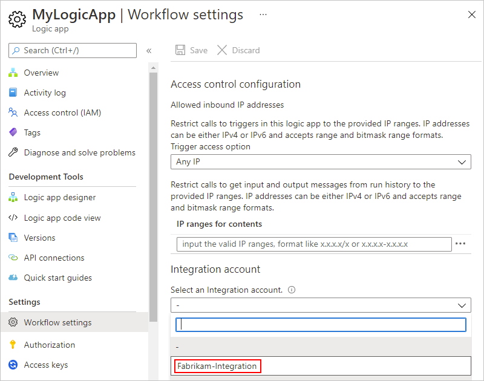
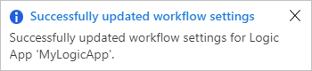
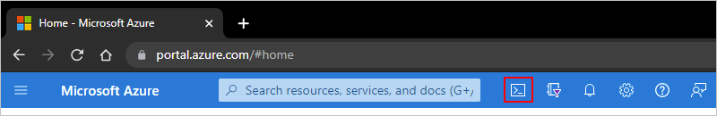
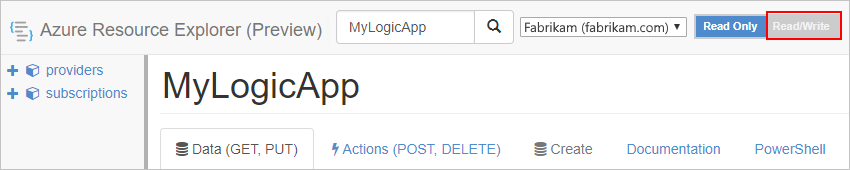
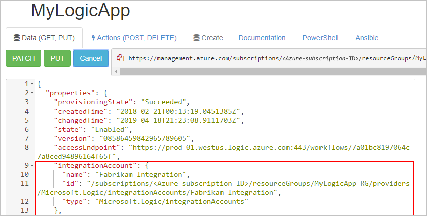
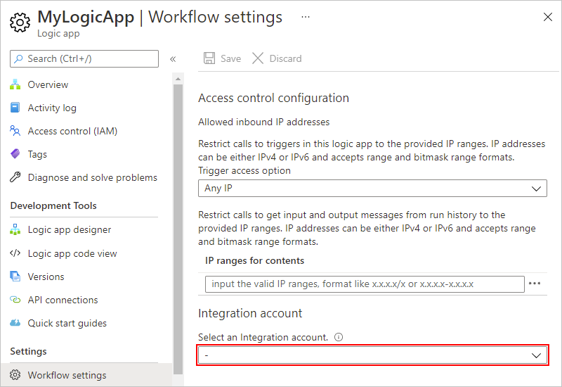
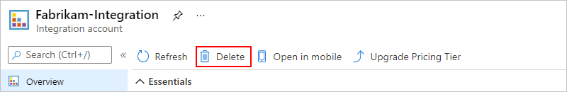

# Create and manage integration accounts for B2B workflows in Azure Logic Apps with the Enterprise Integration Pack

[!INCLUDE [logic-apps-sku-consumption-standard](../../../includes/logic-apps-sku-consumption-standard.md)]

Before you can build business-to-business (B2B) and enterprise integration workflows using Azure Logic Apps, you need to create an *integration account* resource. This account is a scalable cloud-based container in Azure that simplifies how you store and manage B2B artifacts that you define and use in your workflows for B2B scenarios, for example:

* [Trading partners](../logic-apps-enterprise-integration-partners.md)
* [Agreements](../logic-apps-enterprise-integration-agreements.md)
* [Maps](../logic-apps-enterprise-integration-maps.md)
* [Schemas](../logic-apps-enterprise-integration-schemas.md)
* [Certificates](../logic-apps-enterprise-integration-certificates.md)

You also need an integration account to electronically exchange B2B messages with other organizations. When other organizations use protocols and message formats different from your organization, you have to convert these formats so your organization's system can process those messages. With Azure Logic Apps, you can build workflows that support the following industry-standard protocols:

* [AS2](../logic-apps-enterprise-integration-as2.md)
* [EDIFACT](../logic-apps-enterprise-integration-edifact.md)
* [RosettaNet](../logic-apps-enterprise-integration-rosettanet.md)
* [X12](../logic-apps-enterprise-integration-x12.md)

This guide shows how to complete the following tasks:

* Create an integration account.
* Set up storage access for a Premium integration account.
* Link your integration account to a logic app resource.
* Change the pricing tier for your integration account.
* Unlink your integration account from a logic app resource.
* Move an integration account to another Azure resource group or subscription.
* Delete an integration account.

If you're new to creating B2B enterprise integration workflows in Azure Logic Apps, see [B2B enterprise integration workflows with Azure Logic Apps and Enterprise Integration Pack](../logic-apps-enterprise-integration-overview.md).

## Prerequisites

* An Azure account and subscription. If you don't have an Azure subscription, [sign up for a free Azure account](https://azure.microsoft.com/free/?WT.mc_id=A261C142F). Make sure that you use the same Azure subscription for both your integration account and logic app resource.

* Whether you're working on a Consumption or Standard logic app workflow, your logic app resource must already exist before you can link your integration account.

  * For Consumption logic app resources, this link is required before you can use the artifacts from your integration account with your workflow. Although you can create your artifacts without this link, the link is required when you're ready to use these artifacts.

  * For Standard logic app resources, this link is optional, based on your scenario:

    * If you have an integration account with the artifacts that you need or want to use, you can link the integration account to each Standard logic app resource where you want to use the artifacts.

    * Some Azure-hosted integration account connectors, such as **AS2**, **EDIFACT**, and **X12**, let you create a connection to your integration account. If you're just using these connectors, you don't need the link.

    * The built-in connectors named **Liquid** and **Flat File** let you select maps and schemas that you previously uploaded to your logic app resource or to a linked integration account.

      If you don't have or need an integration account, you can use the upload option. Otherwise, you can use the linking option, which also means you don't have to upload maps and schemas to each logic app resource. Either way, you can use these artifacts across all child workflows within the *same logic app resource*.

* Basic knowledge about how to create logic app workflows. For more information, see the following documentation:

  * [Quickstart: Create an example Consumption logic app workflow in multi-tenant Azure Logic Apps](../quickstart-create-example-consumption-workflow.md)

  * [Create an example Standard logic app workflow in single-tenant Azure Logic Apps](../create-single-tenant-workflows-azure-portal.md)

## Create integration account

Integration accounts are available in different tiers that [vary in pricing](https://azure.microsoft.com/pricing/details/logic-apps/). Based on the tier you choose, creating an integration account might incur costs. For more information, see [Azure Logic Apps pricing and billing models](../logic-apps-pricing.md#integration-accounts) and [Azure Logic Apps pricing](https://azure.microsoft.com/pricing/details/logic-apps/).

Based on your requirements and scenarios, determine the appropriate integration account tier to create. The following table describes the available tiers:

Your integration account uses an automatically created and enabled system-assigned managed identity to authenticate access.

| Tier | Description |
|------|-------------|
| **Premium** (preview) | **Note:** This capability is in preview and is subject to the [Supplemental Terms of Use for Microsoft Azure Previews](https://azure.microsoft.com/support/legal/preview-supplemental-terms/). <br><br>For scenarios with the following criteria: <br><br>- Store and use unlimited artifacts, such as partners, agreements, schemas, maps, certificates, and so on. <br><br>- Bring and use your own storage, which contains the relevant runtime states for specific B2B actions and EDI standards. For example, these states include the MIC number for AS2 actions and the control numbers for X12 actions, if configured on your agreements. <br><br>To access this storage, your integration account uses its system-assigned managed identity, which is automatically created and enabled for your integration account. <br><br>You can also apply more governance and policies to data, such as customer-managed ("Bring Your Own") keys for data encryption. To store these keys, you'll need a key vault. <br><br>- Set up and use a key vault to store private certificates or customer-managed keys. To access these keys, your Premium integration account uses its system-assigned managed identity, not an Azure Logic Apps shared service principal. <br><br>Pricing follows [Standard integration account pricing](https://azure.microsoft.com/pricing/details/logic-apps/). <br><br>**Note**: During preview, your Azure bill uses the same meter name and ID as a Standard integration account, but changes when the Premium level becomes generally available. <br><br>**Limitations and known issues**: <br><br>- Currently doesn't support virtual networks. <br><br>- If you use a key vault to store private certificates, your integration account's managed identity might not work. For now, use the linked logic app's managed identity instead. <br><br>- Currently doesn't support the [Azure CLI for Azure Logic Apps](/cli/azure/service-page/logic%20apps). |
| **Standard** | For scenarios where you have more complex B2B relationships and increased numbers of entities that you must manage. <br><br>Supported by the Azure Logic Apps SLA. |
| **Basic** | For scenarios where you want only message handling or to act as a small business partner that has a trading partner relationship with a larger business entity. <br><br>Supported by the Azure Logic Apps SLA. |
| **Free** | For exploratory scenarios, not production scenarios. This tier has limits on region availability, throughput, and usage. For example, the Free tier is available only for public regions in Azure, for example, West US or Southeast Asia, but not for [Microsoft Azure operated by 21Vianet](/azure/china/overview-operations) or [Azure Government](../../azure-government/documentation-government-welcome.md). <br><br>**Note**: Not supported by the Azure Logic Apps SLA. |

For this task, you can use the Azure portal, [Azure CLI](/cli/azure/resource#az-resource-create), or [Azure PowerShell](/powershell/module/Az.LogicApp/New-AzIntegrationAccount).

> [!IMPORTANT]
>
> For you to successfully link and use your integration account with your logic app, 
> make sure that both resources exist in the *same* Azure subscription and Azure region.

### [Portal](#tab/azure-portal)

1. In the [Azure portal](https://portal.azure.com) search box, enter **integration accounts**, and select **Integration accounts**.

1. Under **Integration accounts**, select **Create**.

1. On the **Create an integration account** pane, provide the following information about your integration account:

   | Property | Required | Value | Description |
   |----------|----------|-------|-------------|
   | **Subscription** | Yes | <*Azure-subscription-name*> | The name for your Azure subscription |
   | **Resource group** | Yes | <*Azure-resource-group-name*> | The name for the [Azure resource group](../../azure-resource-manager/management/overview.md) to use for organizing related resources. For this example, create a new resource group named **FabrikamIntegration-RG**. |
   | **Integration account name** | Yes | <*integration-account-name*> | Your integration account's name, which can contain only letters, numbers, hyphens (`-`), underscores (`_`), parentheses (`()`), and periods (`.`). This example uses **Fabrikam-Integration**. |
   | **Pricing Tier** | Yes | <*pricing-level*> | The pricing tier for the integration account, which you can change later. For this example, select **Free**. For more information, review the following documentation: <br><br>- [Logic Apps pricing model](../logic-apps-pricing.md#integration-accounts) <br>- [Logic Apps limits and configuration](../logic-apps-limits-and-config.md#integration-account-limits) <br>- [Logic Apps pricing](https://azure.microsoft.com/pricing/details/logic-apps/) |
   | **Storage account** | Available only for the Premium (preview) integration account | None | The name for an existing [Azure storage account](../../storage/common/storage-account-create.md). For the example in this guide, this option doesn't apply. |
   | **Region** | Yes | <*Azure-region*> | The Azure region where to store your integration account metadata. Either select the same location as your logic app resource, or create your logic apps in the same location as your integration account. For this example, use **West US**. <br><br>To use your integration account with an [integration service environment (ISE)](../connect-virtual-network-vnet-isolated-environment-overview.md), select **Associate with integration service environment**, and then select your ISE as the location. To create an integration account from inside an ISE, see [Create integration accounts from inside an ISE](../add-artifacts-integration-service-environment-ise.md#create-integration-account-environment). <br><br>**Note**: The ISE resource will retire on August 31, 2024, due to its dependency on Azure Cloud Services (classic), which retires at the same time. Currently in preview, the capability is available for you to [export a Standard integration account for an ISE to a Premium integration account](../ise-manage-integration-service-environment.md#export-integration-account). |
   | **Enable log analytics** | No | Unselected | For this example, don't select this option. |

1. When you're done, select **Review + create**.

   After deployment completes, Azure opens your integration account.

1. If you created a Premium integration account, make sure to [set up access to the associated Azure storage account](#set-up-access-storage-account).

### [Azure CLI](#tab/azure-cli)

[!INCLUDE [azure-cli-prepare-your-environment-h3.md](~/articles/reusable-content/azure-cli/azure-cli-prepare-your-environment-h3.md)]

1. To add the [az logic integration-account](/cli/azure/logic/integration-account) extension, use the [az extension add](/cli/azure/extension#az-extension-add) command:

   ```azurecli
   az extension add –-name logic
   ```

1. To create a resource group or use an existing resource group, run the [az group create](/cli/azure/group#az-group-create) command:

   ```azurecli
   az group create --name myresourcegroup --location westus
   ```

   To list the integration accounts for a resource group, use the [az logic integration-account list](/cli/azure/logic/integration-account#az-logic-integration-account-list) command:

   ```azurecli
   az logic integration-account list --resource-group myresourcegroup
   ```

1. To create an integration account, run the [az logic integration-account create](/cli/azure/logic/integration-account#az-logic-integration-account-create) command:

   ```azurecli
   az logic integration-account create --resource-group myresourcegroup \
       --name integration_account_01 --location westus --sku name=Standard
   ```

   Your integration account name can contain only letters, numbers, hyphens (-), underscores (_), parentheses (()), and periods (.).

   To view a specific integration account, use the [az logic integration-account show](/cli/azure/logic/integration-account#az-logic-integration-account-show) command:

   ```azurecli
   az logic integration-account show --name integration_account_01 --resource-group myresourcegroup
   ```

   You can change your SKU, or pricing tier, by using the [az logic integration-account update](/cli/azure/logic/integration-account#az-logic-integration-account-update) command:

   ```azurecli
   az logic integration-account update --sku name=Basic --name integration_account_01 \
       --resource-group myresourcegroup
   ```

   For more information about pricing, see these resources:

   * [Azure Logic Apps pricing model](../logic-apps-pricing.md#integration-accounts)
   * [Azure Logic Apps limits and configuration](../logic-apps-limits-and-config.md#integration-account-limits)
   * [Azure Logic Apps pricing](https://azure.microsoft.com/pricing/details/logic-apps/)

To import an integration account by using a JSON file, use the [az logic integration-account import](/cli/azure/logic/integration-account#az-logic-integration-account-import) command:

```azurecli
az logic integration-account import --name integration_account_01 \
    --resource-group myresourcegroup --input-path integration.json
```

---

<a name="set-up-access-storage-account"></a>

## Set up storage access for Premium integration account

To read artifacts and write any state information, your Premium integration account needs access to the selected and associated Azure storage account. Your integration account uses its automatically created and enabled system-assigned managed identity to authenticate access.

1. In the [Azure portal](https://portal.azure.com), open your Premium integration account.

1. On the integration account menu, under **Settings**, select **Identity**.

1. On the **System assigned** tab, which shows the enabled system-assigned managed identity, under **Permissions**, select **Azure role assignments**.

1. On the **Azure role assignments** toolbar, select **Add role assignment (preview)**, provide the following information, select **Save**, and then repeat for each required role:

   | Parameter | Value | Description |
   |-----------|-------|-------------|
   | **Scope** | **Storage** | For more information, see [Understand scope for Azure RBAC](../../role-based-access-control/scope-overview.md). |
   | **Subscription** | <*Azure-subscription*> | The Azure subscription for the resource to access. |
   | **Resource** | <*Azure-storage-account-name*> | The name for the Azure storage account to access. <br><br>**Note** If you get an error that you don't have permissions to add role assignments at this scope, you need to get those permissions. For more information, see [Microsoft Entra built-in roles](../../active-directory/roles/permissions-reference.md). |
   | **Role** | - **Storage Account Contributor** <br><br>- **Storage Blob Data Contributor** <br><br>- **Storage Table Data Contributor** | The roles that your Premium integration account requires to access your storage account. |

   For more information, see [Assign Azure role to system-assigned managed identity](../../role-based-access-control/role-assignments-portal-managed-identity.md)

1. Next, link your integration account to your logic app resource.

<a name="link-account"></a>

## Link to logic app

For you to successfully link your integration account to your logic app resource, make sure that both resources use the *same* Azure subscription and Azure region.

### [Consumption](#tab/consumption)

This section describes how to complete this task using the Azure portal. If you use Visual Studio and your logic app is in an [Azure Resource Group project](../../azure-resource-manager/templates/create-visual-studio-deployment-project.md), you can [link your logic app to an integration account by using Visual Studio](../manage-logic-apps-with-visual-studio.md#link-integration-account).

1. In the [Azure portal](https://portal.azure.com), open your logic app resource.

1. On your logic app's navigation menu, under **Settings**, select **Workflow settings**. Under **Integration account**, open the **Select an Integration account** list, and select the integration account you want.

   

1. To finish linking, select **Save**.

   

   After your integration account is successfully linked, Azure shows a confirmation message.

   

Now your logic app workflow can use the artifacts in your integration account plus the B2B connectors, such as XML validation and flat file encoding or decoding.

### [Standard](#tab/standard)

#### Find your integration account's callback URL

Before you can link your integration account to a Standard logic app resource, you need to have your integration account's **callback URL**.

1. In the [Azure portal](https://portal.azure.com) search box, enter **integration accounts**, and then select **Integration accounts**.

1. From the **Integration accounts** list, select your integration account.

1. On your selected integration account's navigation menu, under **Settings**, select **Callback URL**.

1. Find the **Generated Callback URL** property value, copy the value, and save the URL to use later for linking.

#### Link integration account to Standard logic app

##### Azure portal

1. In the [Azure portal](https://portal.azure.com), open your Standard logic app resource.

1. On your logic app's navigation menu, under **Settings**, select **Environment variables**.

1. On the **Environment variables** page, check whether the app setting named **WORKFLOW_INTEGRATION_ACCOUNT_CALLBACK_URL** exists.

1. If the app setting doesn't exist, at the end of the settings list, add a new app setting by entering the following:

   | Property | Value |
   |----------|-------|
   | **Name** | **WORKFLOW_INTEGRATION_ACCOUNT_CALLBACK_URL** |
   | **Value** | <*integration-account-callback-URL*> |

1. When you're done, select **Apply**.

##### Visual Studio Code

1. From your Standard logic app project in Visual Studio Code, open the **local.settings.json** file.

1. In the `Values` object, add an app setting that has the following properties and values, including the previously saved callback URL:

   | Property | Value |
   |----------|-------|
   | **Name** | **WORKFLOW_INTEGRATION_ACCOUNT_CALLBACK_URL** |
   | **Value** | <*integration-account-callback-URL*> |

   This example shows how a sample app setting might appear:

   ```json
   {
       "IsEncrypted": false,
       "Values": {
           "AzureWebJobStorage": "UseDevelopmentStorage=true",
           "FUNCTIONS_WORKER_RUNTIME": "node",
           "WORKFLOW_INTEGRATION_ACCOUNT_CALLBACK_URL": "https://prod-03.westus.logic.azure.com:443/integrationAccounts/...."
       }
   }
   ```

1. When you're done, save your changes.

---

<a name="change-pricing-tier"></a>

## Change pricing tier

To increase the [limits](../logic-apps-limits-and-config.md#integration-account-limits) for an integration account, you can [upgrade to a higher pricing tier](#upgrade-pricing-tier), if available. For example, you can upgrade from the Free tier to the Basic tier, Standard tier, or Premium tier. You can also [downgrade to a lower tier](#downgrade-pricing-tier), if available. For more information pricing information, review the following documentation:

* [Azure Logic Apps pricing](https://azure.microsoft.com/pricing/details/logic-apps/)
* [Azure Logic Apps pricing model](../logic-apps-pricing.md#integration-accounts)

<a name="upgrade-pricing-tier"></a>

### Upgrade pricing tier

To make this change, you can use either the Azure portal or the Azure CLI.

#### [Portal](#tab/azure-portal)

1. In the [Azure portal](https://portal.azure.com) search box, enter **integration accounts**, and select **Integration accounts**.

   Azure shows all the integration accounts in your Azure subscriptions.

1. Under **Integration accounts**, select the integration account that you want to move. On your integration account resource menu, select **Overview**.

   

1. On the **Overview** page, select **Upgrade Pricing Tier**, which lists any available higher tiers. When you select a tier, the change immediately takes effect.

   

<a name="upgrade-tier-azure-cli"></a>

#### [Azure CLI](#tab/azure-cli)

1. If you haven't done so already, [install the Azure CLI prerequisites](/cli/azure/get-started-with-azure-cli).

1. In the Azure portal, open the [Azure Cloud Shell](../../cloud-shell/overview.md) environment.

   

1. At the command prompt, enter the [**az resource** command](/cli/azure/resource#az-resource-update), and set `skuName` to the higher tier that you want.

   ```azurecli
   az resource update --resource-group {ResourceGroupName} --resource-type Microsoft.Logic/integrationAccounts --name {IntegrationAccountName} --subscription {AzureSubscriptionID} --set sku.name={SkuName}
   ```

   For example, if you have the Basic tier, you can set `skuName` to `Standard`:

   ```azurecli
   az resource update --resource-group FabrikamIntegration-RG --resource-type Microsoft.Logic/integrationAccounts --name Fabrikam-Integration --subscription XXXXXXXXXXXXXXXXX --set sku.name=Standard
   ```

---

<a name="downgrade-pricing-tier"></a>

### Downgrade pricing tier

To make this change, use the [Azure CLI](/cli/azure/get-started-with-azure-cli).

1. If you haven't done so already, [install the Azure CLI prerequisites](/cli/azure/get-started-with-azure-cli).

1. In the Azure portal, open the [Azure Cloud Shell](../../cloud-shell/overview.md) environment.

   

1. At the command prompt, enter the [**az resource** command](/cli/azure/resource#az-resource-update) and set `skuName` to the lower tier that you want.

   ```azurecli
   az resource update --resource-group <resourceGroupName> --resource-type Microsoft.Logic/integrationAccounts --name <integrationAccountName> --subscription <AzureSubscriptionID> --set sku.name=<skuName>
   ```
  
   For example, if you have the Standard tier, you can set `skuName` to `Basic`:

   ```azurecli
   az resource update --resource-group FabrikamIntegration-RG --resource-type Microsoft.Logic/integrationAccounts --name Fabrikam-Integration --subscription XXXXXXXXXXXXXXXXX --set sku.name=Basic
   ```

## Unlink from logic app

### [Consumption](#tab/consumption)

If you want to link your logic app to another integration account, or no longer use an integration account with your logic app, delete the link by using Azure Resource Explorer.

1. Open your browser window, and go to [Azure Resource Explorer (https://resources.azure.com)](https://resources.azure.com). Sign in with the same Azure account credentials.

   

1. In the search box, enter your logic app's name to find and open your logic app.

   

1. On the explorer title bar, select **Read/Write**.

   

1. On the **Data** tab, select **Edit**.

   

1. In the editor, find the **integrationAccount** object, which has the following format, and delete the object:

   ```json
   {
      // <other-attributes>
      "integrationAccount": {
         "name": "<integration-account-name>",
         "id": "<integration-account-resource-ID>",
         "type": "Microsoft.Logic/integrationAccounts"  
      },
   }
   ```

   For example:

   

1. On the **Data** tab, select **Put** to save your changes.

   

1. In the Azure portal, open your logic app. On your logic app menu, under **Workflow settings**, confirm that the **Integration account** property now appears empty.

   

### [Standard](#tab/standard)

#### Azure portal

1. In the [Azure portal](https://portal.azure.com), open your Standard logic app resource.

1. On your logic app menu, under **Settings**, select **Environment variables**.

1. On the **Environment variables** page, find the app setting named **WORKFLOW_INTEGRATION_ACCOUNT_CALLBACK_URL**.

1. Clear the app setting name and its value.

1. When you're done, select **Apply**.

#### Visual Studio Code

1. From your Standard logic app project in Visual Studio Code, open the **local.settings.json** file.

1. In the `Values` object, find and delete the app setting that has the following properties and values:

   | Property | Value |
   |----------|-------|
   | **Name** | **WORKFLOW_INTEGRATION_ACCOUNT_CALLBACK_URL** |
   | **Value** | <*integration-account-callback-URL*> |

1. When you're done, save your changes.

---

## Move integration account

You can move your integration account to another Azure resource group or Azure subscription. When you move resources, Azure creates new resource IDs, so make sure that you use the new IDs instead and update any scripts or tools associated with the moved resources. If you want to change the subscription, you must also specify an existing or new resource group.

For this task, you can use either the Azure portal by following the steps in this section or the [Azure CLI](/cli/azure/resource#az-resource-move).

1. In the [Azure portal](https://portal.azure.com) search box, enter **integration accounts**, and select **Integration accounts**.

   Azure shows all the integration accounts in your Azure subscriptions.

1. Under **Integration accounts**, select the integration account that you want to move. On your integration account menu, select **Overview**.

1. On the **Overview** page, next to either **Resource group** or **Subscription name**, select **change**.

   

1. Select any related resources that you also want to move.

1. Based on your selection, follow these steps to change the resource group or subscription:

   * Resource group: From the **Resource group** list, select the destination resource group. Or, to create a different resource group, select **Create a new resource group**.

   * Subscription: From the **Subscription** list, select the destination subscription. From the **Resource group** list, select the destination resource group. Or, to create a different resource group, select **Create a new resource group**.

1. To acknowledge your understanding that any scripts or tools associated with the moved resources won't work until you update them with the new resource IDs, select the confirmation box, and then select **OK**.

1. After you finish, make sure that you update all scripts with the new resource IDs for your moved resources.  

## Delete integration account

For this task, you can use either the Azure portal by following the steps in this section, [Azure CLI](/cli/azure/resource#az-resource-delete), or [Azure PowerShell](/powershell/module/az.logicapp/remove-azintegrationaccount).

### [Portal](#tab/azure-portal)

1. In to the [Azure portal](https://portal.azure.com) search box, enter **integration accounts**, and select **Integration accounts**.

   Azure shows all the integration accounts in your Azure subscriptions.

1. Under **Integration accounts**, select the integration account that you want to delete. On your integration account menu, select **Overview**.

   

1. On the **Overview** page, select **Delete**.

   

1. To confirm that you want to delete your integration account, select **Yes**.

   

<a name="delete-account-azure-cli"></a>

#### [Azure CLI](#tab/azure-cli)

You can delete an integration account by using the [az logic integration-account delete](/cli/azure/logic/integration-account#az-logic-integration-account-delete) command:

```azurecli
az logic integration-account delete --name integration_account_01 --resource-group myresourcegroup
```

---

## Next steps

* [Create trading partners in your integration account](../logic-apps-enterprise-integration-partners.md)
* [Create agreements between partners in your integration account](../logic-apps-enterprise-integration-agreements.md)
