# Export flows from Power Automate and deploy to Azure Logic Apps

[!INCLUDE [logic-apps-sku-consumption](../../includes/logic-apps-sku-consumption.md)]

To extend and expand your flow's capabilities, you can migrate that flow from [Power Automate](https://make.powerautomate.com) to a Consumption logic app workflow that runs in [multi-tenant Azure Logic Apps](logic-apps-overview.md). You can export your flow as an Azure Resource Manager template for a logic app, deploy that logic app template to an Azure resource group, and then open that logic app in the workflow designer.

> [!IMPORTANT]
> Export to Azure Logic Apps is unavailable for Power Automate flows created after August 2020. In October 2020, Power Automate 
> standardized new flow creation on the [OpenAPI 2.0 protocol](https://swagger.io/specification/v2/). New flows based on 
> this protocol are incompatible with Azure Logic Apps workflows, so exporting these flows to Azure Logic Apps was disabled. 
> Instead, you must manually [create a Consumption logic app workflow](quickstart-create-example-consumption-workflow.md) for these flows.

Not all Power Automate connectors are available in Azure Logic Apps. You can migrate only Power Automate flows that have the equivalent connectors in Azure Logic Apps. For example, the Button trigger, the Approval connector, and Notification connector are specific to Power Automate. 

* To find which Power Automate connectors don't have Azure Logic Apps equivalents, see [Power Automate connectors](/connectors/connector-reference/connector-reference-powerautomate-connectors).

* To find which Azure Logic Apps connectors don't have Power Automate equivalents, see [Managed connectors in Azure Logic Apps](/connectors/connector-reference/connector-reference-logicapps-connectors).

## Prerequisites

* An Azure account and subscription. If you don't have an Azure subscription, [sign up for a free Azure account](https://azure.microsoft.com/free/?WT.mc_id=A261C142F).

* The flow that you want to export from Power Automate

## Export your flow

1. Sign in to [Power Automate](https://make.powerautomate.com), and select **My flows**. Find and select your flow. On the toolbar, select the ellipses (**...**) button > **Export** > **Logic Apps template (.json)**.

   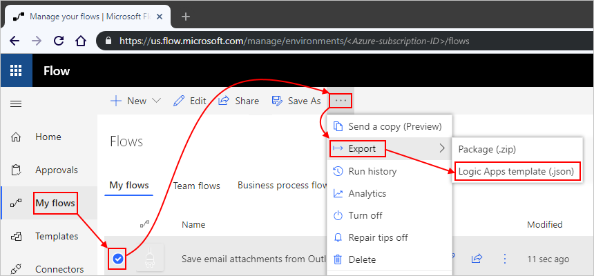

1. Save your template's .json file to the location that you want.

For more information, see [Grow up to Azure Logic Apps](https://flow.microsoft.com/blog/grow-up-to-logic-apps/).

## Deploy template by using the Azure portal

1. Sign in the [Azure portal](https://portal.azure.com) with your Azure account.

1. On the Azure home page, in the search box, enter `custom template`. From the results, select **Deploy a custom template** > **Create**.

   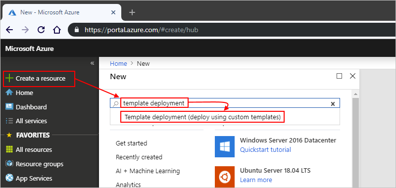

1. Under **Custom deployment**, select **Build your own template in the editor**.

   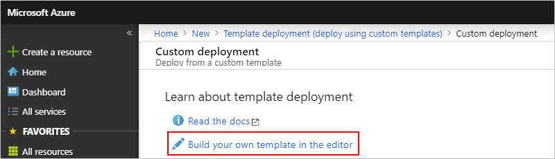

1. On the **Edit template** toolbar, select **Load file**.

   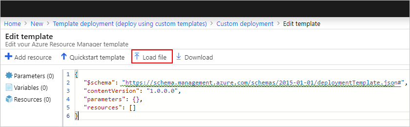

1. Browse to the location where you saved the JSON template file that you exported from Power Automate. Select the template file > **Open**.

1. After the editor shows the JSON, parameters, and resources in your template, select **Save**.

   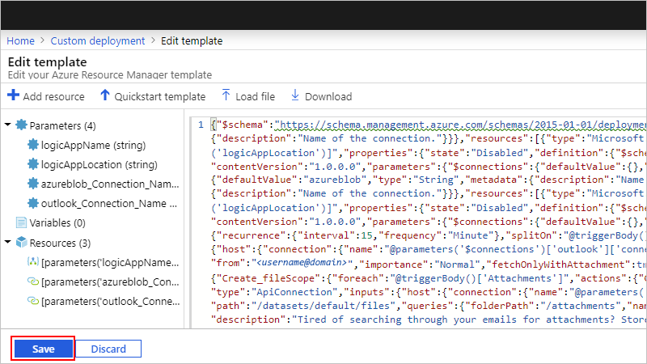

1. Now provide more information your logic app.

   1. Select or specify the input parameter values for your template.

      | Property | Description |
      |----------|-------------|
      | **Subscription** | The Azure subscription to use for billing |
      | **Resource group** | The Azure resource group to use for your logic app. You can use an existing group or create a new group. |
      | **Location** | The Azure region to use if you create a new resource group |
      | **Logic App Name** | The name to use for your logic app resource |
      | **Logic App Location** | The Azure region where you want to create the logic app resource, if different from the Azure resource group |
      | <*connection-name*> | One or multiple names for any previously created connections that the logic app can reuse 

**Note**: If this logic app is your first, all connections are created as new, so you can accept the default names. Otherwise, you can specify the names for previously created connections, which you can use across multiple logic apps. |
      |||

      For example:

      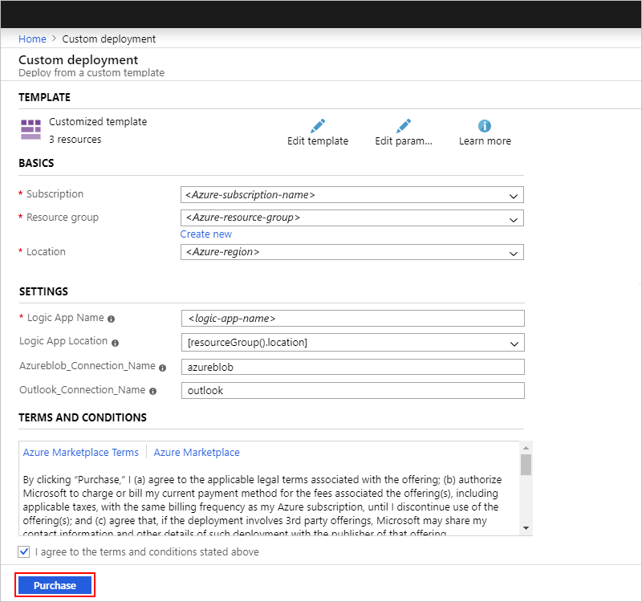

   1. When you're done, review the **Terms and Conditions** about creating the necessary Azure resources and billing your Azure subscription accordingly.

   1. When you're ready, select **I agree to the terms and conditions stated above** > **Purchase**.

      Azure deploys your template as a logic app to your specified resource group.

1. All logic apps that you migrate from Power Automate are deployed in a disabled state. Before you enable your logic app, authorize any new connections by following these steps:

   1. In the Azure portal, open the logic app that you created. On the logic app's menu, select **Logic app designer**.

      Each connection that requires authorization shows a warning icon:

      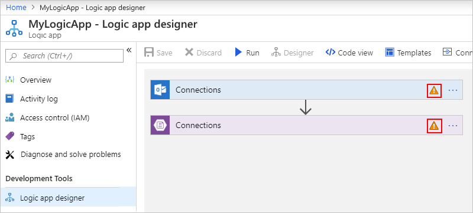

   1. For each step that requires an authorized connection, expand that step, and select **Add new**.

      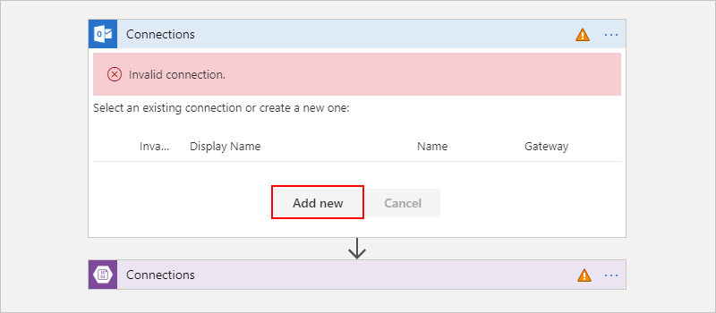

   1. Sign in to each service or provide the necessary credentials to authorize the connection.

   1. After you update your connections, on the designer toolbar, select **Save**.

1. When you're ready to activate your logic app, on the logic app's menu, select **Overview**, and then select **Enable**.

   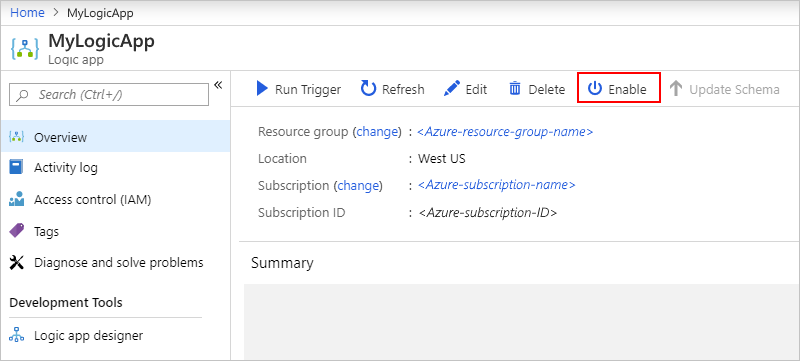

1. To avoid running duplicate workflows, make sure that you deactivate or delete your original flow.

## Deploy template by using Visual Studio

If you've set up Visual Studio with the [prerequisites](../logic-apps/quickstart-create-logic-apps-with-visual-studio.md#prerequisites) for creating logic apps, you can deploy your exported template to Azure Logic Apps by using Visual Studio.

1. In Visual Studio, browse to and open the .json file for the logic app template that you exported from Power Automate.

1. In Visual Studio, create an **Azure Resource Group** project that uses the **Logic App** template by following the steps in [Quickstart: Create automated tasks, processes, and workflows with Azure Logic Apps - Visual Studio](../logic-apps/quickstart-create-logic-apps-with-visual-studio.md).

   This example creates a Visual Studio solution named "ImportedLogicApp".

   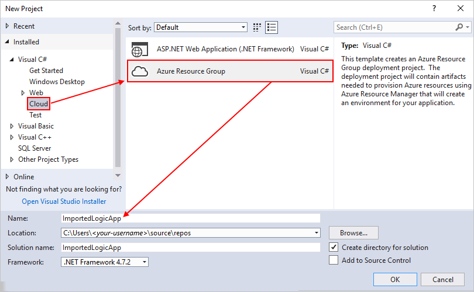

1. After the solution is created, in Solution Explorer, open the **LogicApp.json** file, if the file isn't already open.

1. Copy the contents from the exported template, and overwrite the contents in the **LogicApp.json** file.

1. Before you deploy your logic app, authorize any new connections by following these steps:

   1. Open the **LogicApp.json** shortcut menu, and then select **Open With Logic App Designer**.

      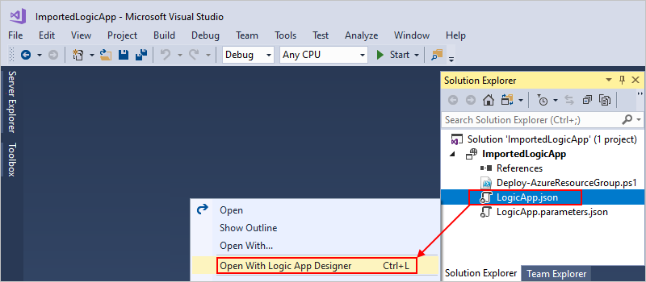

   1. If prompted, select the Azure subscription and resource group that you want to use for deploying your logic app.

      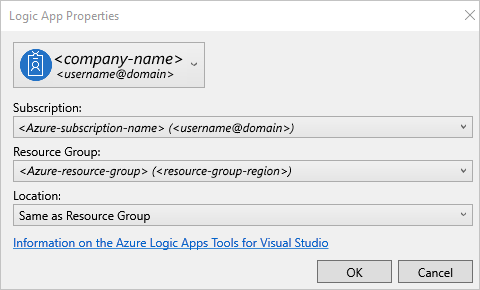

      After your logic app appears in the designer, any connections that require authorization show warning icons:

      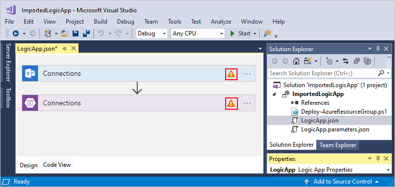

   1. For each step that requires an authorized connection, expand that step, and select **Add new**.

      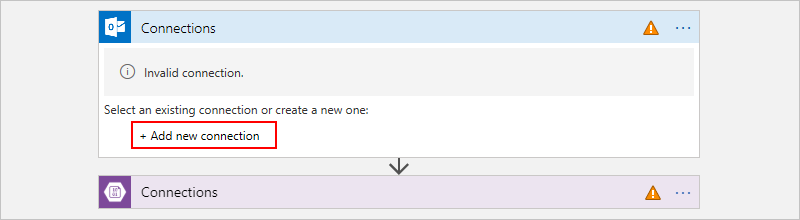

   1. Sign in to each service or provide the necessary credentials to authorize the connection.

   1. Save your solution before you deploy the logic app.

1. In Solution Explorer, open the project shortcut menu, and select **Deploy** > **New**. If prompted, sign in with your Azure account.

1. When prompted, confirm the Azure subscription, Azure resource group, and any other settings that you want to use for deployment, such as a [parameters file](../azure-resource-manager/templates/parameter-files.md) to use for passing template parameter values, and then select **Deploy**.

   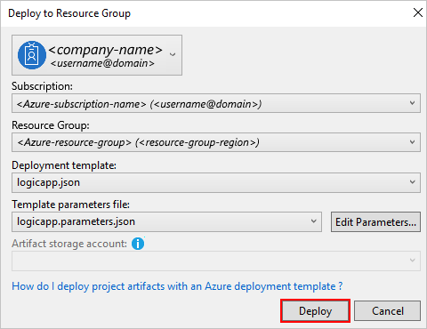

1. If the **Edit Parameters** box appears, provide the name for your logic app resource in Azure, and select **Save**.  

   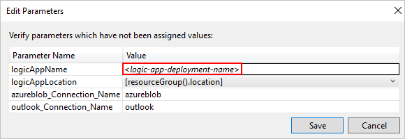

   When deployment starts, your app's deployment status appears in the Visual Studio **Output** window. If the status doesn't appear, open the **Show output from** list, and select your Azure resource group. For example:

   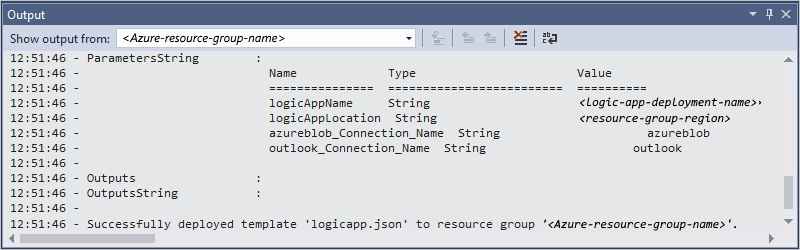

   If any connections in your logic app need input from you, a PowerShell window opens in the background and prompts for any necessary passwords or secret keys. After you enter this information, deployment continues.

   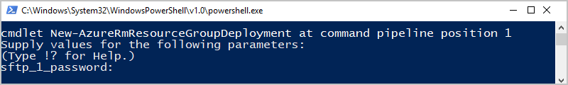

   After deployment finishes, your logic app is published but isn't activated in the Azure portal.

1. When you're ready to activate your logic app in the Azure portal, find and open your logic app in the workflow designer. On the logic app's menu, select **Overview**, and then select **Enable**.

1. To avoid running duplicate workflows, make sure that you deactivate or delete your original flow.

For more information about these deployment steps, see [Quickstart: Create automated tasks, processes, and workflows with Azure Logic Apps - Visual Studio](../logic-apps/quickstart-create-logic-apps-with-visual-studio.md#deploy-to-Azure)

## Next steps

* [Azure Logic Apps](logic-apps-overview.md)
