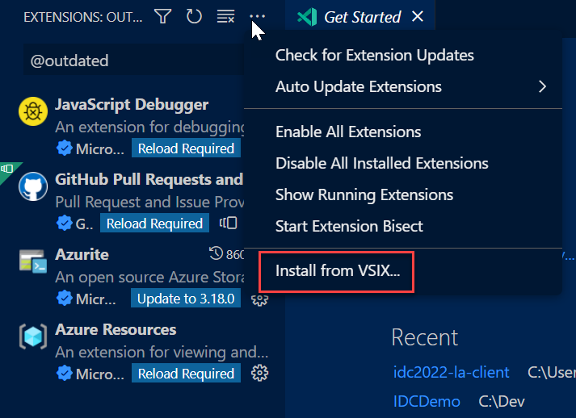
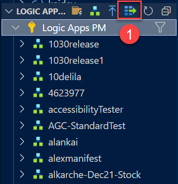
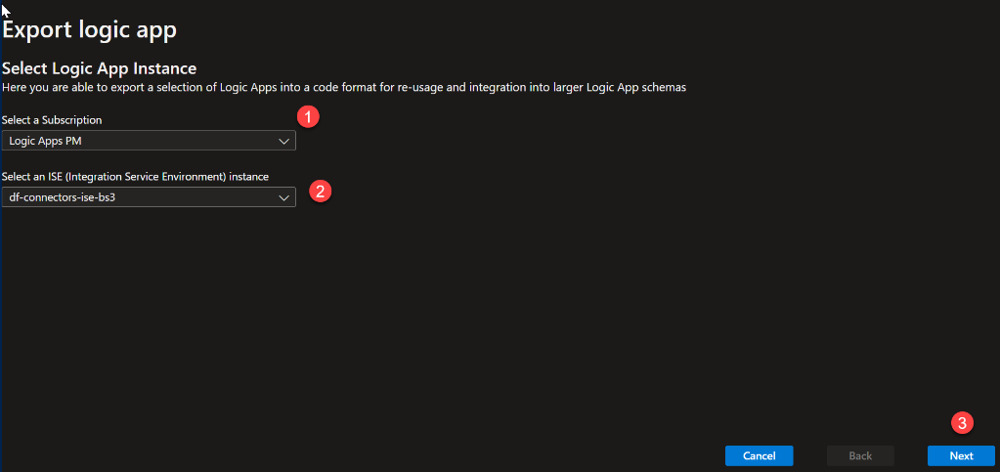
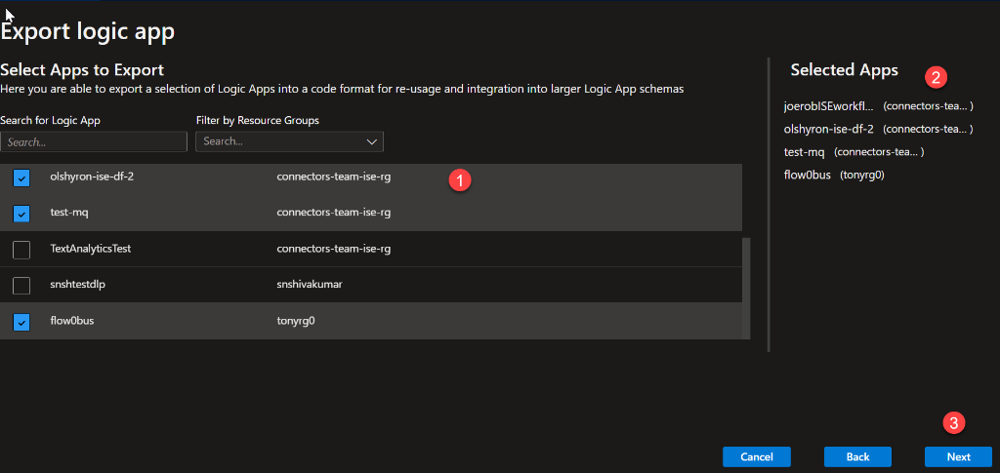
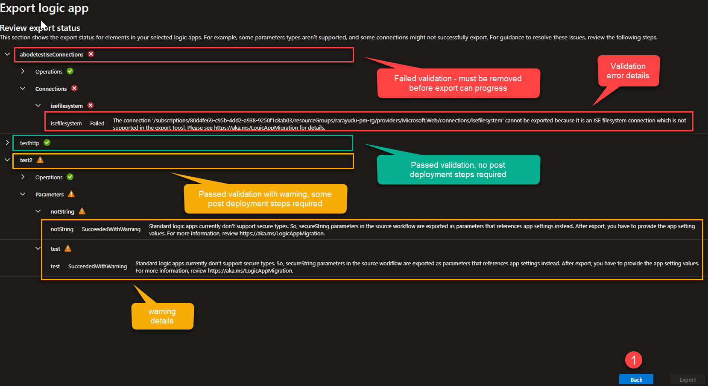
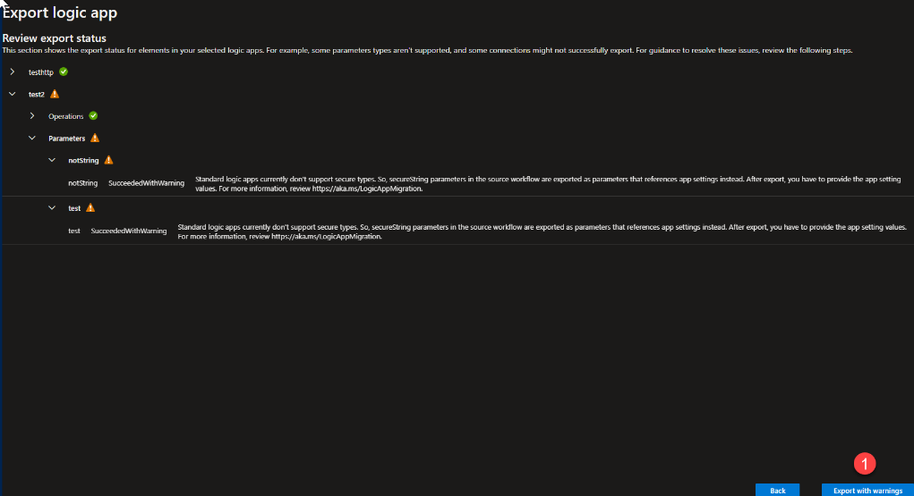
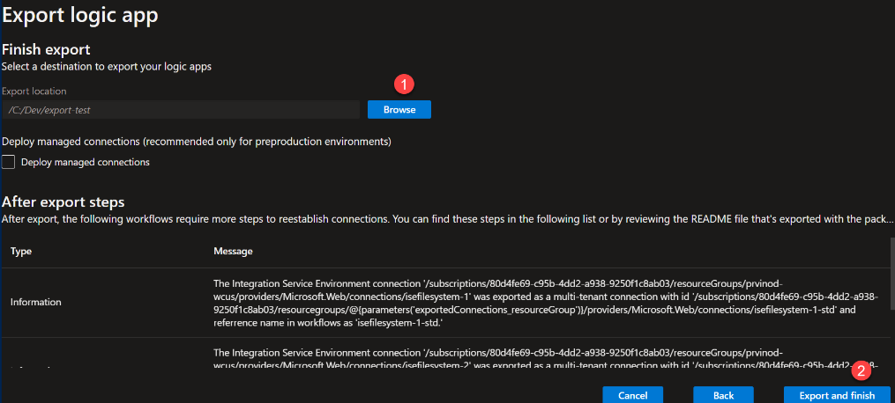
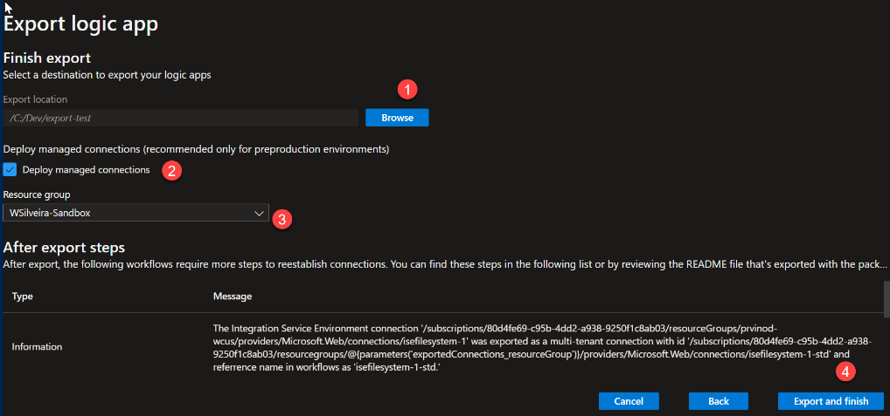
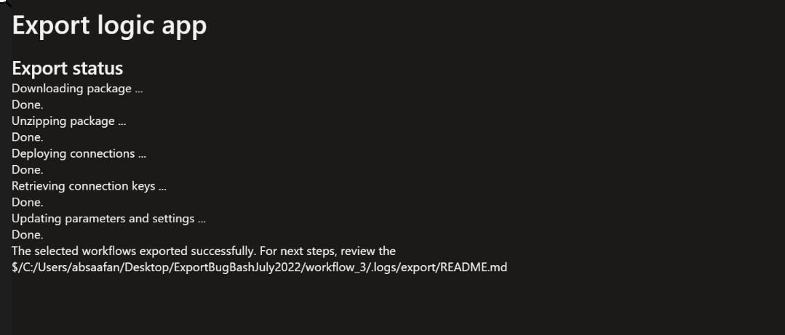

Logic Apps Extension - VS Code Export Tool

ISE to Logic Apps Standard

# Introduction

The Logic App Standard sku adds a sleuth of new or improved functionality to the Logic Apps ecosystem such as Virtual Network (VNET) integration, private endpoints, compute isolation – in combination with Application Services Environment, low latency – with stateless Logic Apps, local debugging and development, and more.

Logic Apps Standard can be used to replace Integration Services Environment (ISE), on most of the scenarios where ISE was initially required – network integration or isolation and compute isolation, for example. But moving from ISE to Logic Apps Standard requires moving workflows that are already implemented in that platform to a Logic App Standard Application. The Export feature on the VS Code Extension now provide you with the ability to export logic apps workflows from ISE to a local Logic App Standard project, where will be able to test locally, amend your workflows as required and get it ready to be deployed directly from VS Code or to plug it on your DevOps process.

*This is not a migration tool. Exporting will replicate the workflow definition, connections, and any integration artefacts into a Standard Logic App VS Code project. ISE Logic Apps being exported will not be deleted, meaning all run and trigger history will be preserved. As a user you are in complete control on when you complete a migration, opting to delete or disable your previous Logic App, once you have testing and validated your workflows on the new platform.*

## Scope

The export tool will allow you to combine a group of ISE Logic Apps into a Standard Logic Apps project, pre-validating your group of Logic Apps workflows so you don’t miss any dependencies when grouping workflows to export. It is recommended grouping workflows per logic app that share the same resources such as maps and schemas or are used in a chain of Logic App processes. Recommendations on how many workflows per logic app can be found here.

The export tool will not export infrastructure related information – e.g. Virtual Network configuration or Integration Account settings.

## Pre-requisites

The export tool is part of the Logic Apps Standard extension for VS Code. Follow the instructions [here](https://docs.microsoft.com/en-us/azure/logic-apps/create-single-tenant-workflows-visual-studio-code#prerequisites) to setup VSCode and all the pre-requisites required for the Logic Apps Standard Extension.

# Known Issue

Not all Logic Apps workflows are eligible for export. Please review the list of scenarios not able to be migrated now:

-   Consumption Logic Apps (with UX)
-   Logic Apps with Custom Connections
-   Logic Apps which include the API Management Connector action
-   Logic Apps which include the Function Connector action
-   User must be in the same network as the ISE in order to run the Export process.

## Concurrency Settings

Although Logic Apps with triggers containing concurrency settings will be exported, logic apps runtime will ignore these settings.

## Core Connectors Exported

ISE Core Connectors will be deployed as managed connectors. As new service provider connectors with the same level of functionality to core connectors are released in public preview or GA, the export tool will incorporate the ability to migrate them to service providers. When a core connector is available to be exported as service provider, the tool will make the conversion automatically

## Allowed action types for export

-   
-   Http,
-   Recurrence,
-   Wait,
-   ApiConnection,
-   ApiConnectionWebhook,
-   Response,
-   HttpWebhook,
-   Compose,
-   Scope,
-   Request,
-   If,
-   Foreach,
-   Until,
-   Terminate,
-   Switch,
-   ParseJson,
-   Table,
-   Join,
-   Select,
-   InitializeVariable,
-   IncrementVariable,
-   DecrementVariable,
-   SetVariable,
-   AppendToArrayVariable
-   AppendToStringVariabl
-   JavaScriptCode

## Allowed trigger types for export

-   Http,
-   HttpWebhook,
-   ApiConnection,
-   ApiConnectionWebhook,
-   Recurrence,
-   Request,
-   ApiConnectionNotification

**  
**

# **Extension Installation for Private Preview**

During Private Preview, the extension update will be distributed as a VISX file. You can find the VISX file [here](https://aka.ms/lastandard/export/visx).

Follow the instructions below to install the VISX file:

1.  Download the VSIX to your local machine
2.  under extensions:click on the elipsis (...) and select Install from VSIX, then select the file downloaded.

    

3.  Follow the VS Code instructions

## **Export Process Walkthrough**

Follow the steps below to export a group of logic apps workflows from ISE to a local project

1.  At the logic apps standard extension, click the export button

    

    1.  Select the correct subscription and ISE environment, then click next

        

    2.  Select the logic app that you want to export. Each logic app selected will be added to the selected list on the side. Once the logic app list is selected, then click next.

        

    3.  Review the validation results – logic apps that pass validation or present warnings are still eligible to be exported. Logic apps with validation exceptions can’t be exported and will need to be removed from the list.

        

        Logic Apps with exceptions must be fixed at the source before being exported. You must click back and remove any logic app that didn’t pass validation before continuing.

        In cases where all logic apps pass validation (with or without warnings) the export button will become available, like in the screenshot below. In this case, click on export (or export with warnings) to continue.

        

    4.  Once the logic apps are ready to be exported, you must provide a location for the new VS Code project folder and click on export (or export with warnings) to complete the export

        

        Alternatively, if your logic app have managed connections and you want to deploy it, you must also provide an existing resource group where the managed connections will be deployed. Notice that at this stage, connection credentials will not be cloned from the original logic app, so you will need to reauthenticate the connections after export, before your logic app workflows can work.

        

1.  The export will download and expand the project in the location you selected – it will also deploy connections if you selected that option.

    

    1.  After this is complete, a new workspace will be open. Start reviewing the README.md file for post deployment steps

## Post-deployment steps

### Extension Bundle

During the Private Preview, you need to use a custom bundle for LA standard. The reason for this is that the exported package uses parameterization in the connections.json file. The current bundle implementation has a bug associated to this component, and is not able to render it during runtime. This bundle has the fix for the bug, and the PR for this fix is currently being reviewed to be deployed across regions.

After the export package has been unzipped and opened by VSCode, Add an appsetting in the local.settings.json file in the values section with the other appsettings:

"FUNCTIONS_EXTENSIONBUNDLE_SOURCE_URI": "https://cdnforlogicappsv2.blob.core.windows.net/logicapps-parameterizationfix"

Then open the host.json file and adjust the version of the bundle to the following value:

"extensionBundle": {

"id": "Microsoft.Azure.Functions.ExtensionBundle.Workflows",

"version": "[1.\*, 1.1.58280138]"

}

## Integration Account actions and content

When exporting actions that are dependent on an Integration account will need to manually configure a reference to an integration account containing the required artefacts. Follow the instructions here to configure an integration account on Logic Apps Standard.

## Post-deployment remediation

Some Logic Apps will require remediation steps post export to run on the Standard platform. Take note of the remediation steps and make sure you test your new Standard resource before making any changes to your original Consumption Logic App. You will find all the necessary post deployment steps in the README.md file generated as part of the export.
