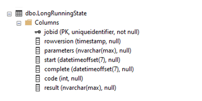
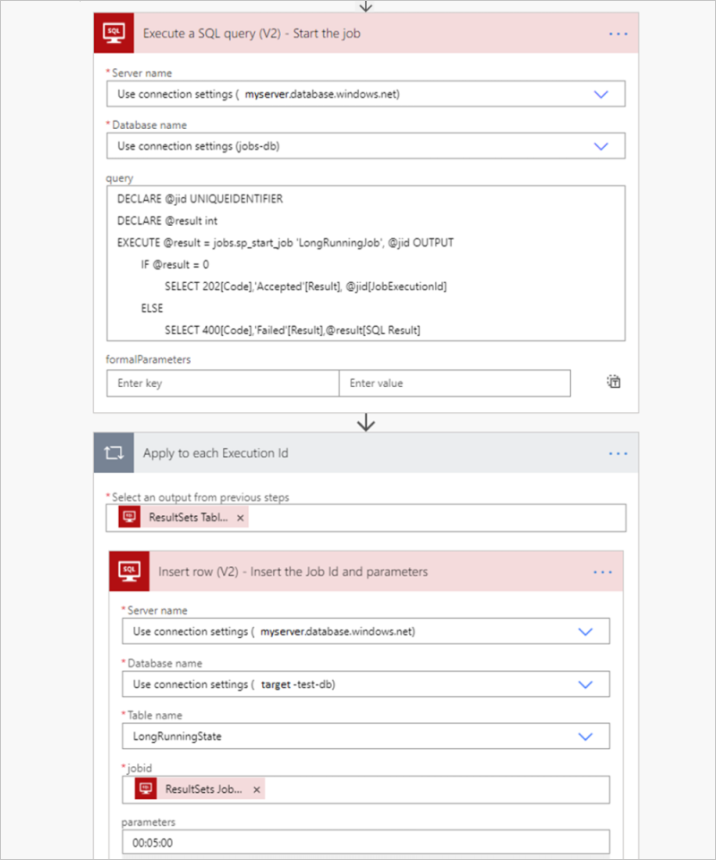
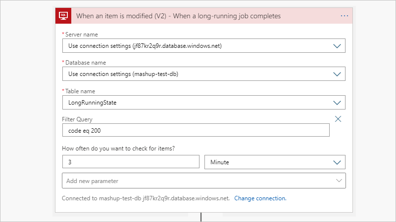

# Handle stored procedure timeouts in the SQL connector for Azure Logic Apps

[!INCLUDE [logic-apps-sku-consumption](../../includes/logic-apps-sku-consumption.md)]

When your logic app works with result sets so large that the [SQL connector](../connectors/connectors-create-api-sqlazure.md) doesn't return all the results at the same time, or if you want more control over the size and structure for your result sets, you can create a [stored procedure](/sql/relational-databases/stored-procedures/stored-procedures-database-engine) that organizes the results the way that you want. The SQL connector provides many backend features that you can access by using [Azure Logic Apps](../logic-apps/logic-apps-overview.md) so that you can more easily automate business tasks that work with SQL database tables.

For example, when getting or inserting multiple rows, your logic app can iterate through these rows by using an [**Until** loop](../logic-apps/logic-apps-control-flow-loops.md#until-loop) within these [limits](../logic-apps/logic-apps-limits-and-config.md). However, when your logic app has to work with thousands or millions of rows, you want to minimize the costs resulting from calls to the database. For more information, see [Handle bulk data using the SQL connector](../connectors/connectors-create-api-sqlazure.md#handle-bulk-data).

<a name="timeout-limit"></a>

## Timeout limit on stored procedure execution

The SQL connector has a stored procedure timeout limit that's [less than 2-minutes](/connectors/sql/#known-issues-and-limitations). Some stored procedures might take longer than this limit to complete, causing a `504 Timeout` error. Sometimes these long-running processes are coded as stored procedures explicitly for this purpose. Due to the timeout limit, calling these procedures from Azure Logic Apps might create problems. Although the SQL connector doesn't natively support an asynchronous mode, you can work around this problem and simulate this mode by using a SQL completion trigger, native SQL pass-through query, a state table, and server-side jobs. For this task, you can use the [Azure Elastic Job Agent](/azure/azure-sql/database/elastic-jobs-overview) for [Azure SQL Database](/azure/azure-sql/database/sql-database-paas-overview). For [SQL Server on premises](/sql/sql-server/sql-server-technical-documentation) and [Azure SQL Managed Instance](/azure/azure-sql/managed-instance/sql-managed-instance-paas-overview), you can use the [SQL Server Agent](/sql/ssms/agent/sql-server-agent).

For example, suppose that you have the following long-running stored procedure, which takes longer than the timeout limit to finish running. If you run this stored procedure from a logic app by using the SQL connector, you get an `HTTP 504 Gateway Timeout` error as the result.

```sql
CREATE PROCEDURE [dbo].[WaitForIt]
   @delay char(8) = '00:03:00'
AS
BEGIN
   SET NOCOUNT ON;
   WAITFOR DELAY @delay
END
```

Rather than directly call the stored procedure, you can asynchronously run the procedure in the background by using a *job agent*. You can store the inputs and outputs in a state table that you can then interact with through your logic app. If you don't need the inputs and outputs, or if you're already writing the results to a table in the stored procedure, you can simplify this approach.

> [!IMPORTANT]
> Make sure that your stored procedure and all jobs are *idempotent*, 
> which means that they can run multiple times without affecting the results. 
> If the asynchronous processing fails or times out, the job agent might retry the step, 
> and thus your stored procedure, multiple times. To avoid duplicating output, 
> before you create any objects, review these [best practices and approaches](/azure/azure-sql/database/elastic-jobs-overview#idempotent-scripts).

The next section describes how you can use the Azure Elastic Job Agent for Azure SQL Database. For SQL Server and Azure SQL Managed Instance, you can use the SQL Server Agent. Some management details will differ, but the fundamental steps remain the same as setting up a job agent for Azure SQL Database.

<a name="azure-sql-database"></a>

## Job agent for Azure SQL Database

To create a job that can run the stored procedure for [Azure SQL Database](/azure/azure-sql/database/sql-database-paas-overview), use the [Azure Elastic Job Agent](/azure/azure-sql/database/elastic-jobs-overview). Create your job agent in the Azure portal. This approach will add several stored procedures to the database that's used by the agent, also known as the *agent database*. You can then create a job that runs your stored procedure in the target database and captures the output when finished.

Before you can create the job, you need to set up permissions, groups, and targets as described by the [full documentation for the Azure Elastic Job Agent](/azure/azure-sql/database/elastic-jobs-overview). You also need to create a supporting table in the target database as described in the following sections.

<a name="create-state-table"></a>

### Create state table for registering parameters and storing inputs

SQL Agent Jobs don't accept input parameters. Instead, in the target database, create a state table where you register the parameters and store the inputs to use for calling your stored procedures. All of the agent job steps run against the target database, but the job's stored procedures run against the agent database. 

To create the state table, use this schema:

```sql
CREATE TABLE [dbo].[LongRunningState](
   [jobid] [uniqueidentifier] NOT NULL,
   [rowversion] [timestamp] NULL,
   [parameters] [nvarchar](max) NULL,
   [start] [datetimeoffset](7) NULL,
   [complete] [datetimeoffset](7) NULL,
   [code] [int] NULL,
   [result] [nvarchar](max) NULL,
   CONSTRAINT [PK_LongRunningState] PRIMARY KEY CLUSTERED
      (   [jobid] ASC
      )WITH (STATISTICS_NORECOMPUTE = OFF, IGNORE_DUP_KEY = OFF) ON [PRIMARY]
      ) ON [PRIMARY] TEXTIMAGE_ON [PRIMARY]
```

Here's how the resulting table looks in [SQL Server Management Studio (SMSS)](/sql/ssms/download-sql-server-management-studio-ssms):



To ensure good performance and make sure that the agent job can find the associated record, the table uses the job execution ID (`jobid`) as the primary key. If you want, you can also add individual columns for the input parameters. The previously described schema can more generally handle multiple parameters but is limited to the size calculated by `NVARCHAR(MAX)`.

<a name="create-top-level-job"></a>

### Create a top-level job to run the stored procedure

To execute the long-running stored procedure, create this top-level job agent in the agent database:

```sql
EXEC jobs.sp_add_job 
   @job_name='LongRunningJob',
   @description='Execute Long-Running Stored Proc',
   @enabled = 1
```

Now, add steps to the job that parameterize, run, and complete the stored procedure. By default, a job step times out after 12 hours. If your stored procedure needs more time, or if you want the procedure to time out earlier, you can change the `step_timeout_seconds` parameter to another value that's specified in seconds. By default, a step has 10 built-in retries with a backoff timeout between each retry, which you can use to your advantage.

Here are the steps to add:

1. Wait for the parameters to appear in the `LongRunningState` table.

   This first step waits for the parameters to get added in `LongRunningState` table, which happens soon after the job starts. If the job execution ID (`jobid`) doesn't get added to the `LongRunningState` table, the step merely fails, and the default retry or backoff timeout does the waiting:

   ```sql
   EXEC jobs.sp_add_jobstep
      @job_name='LongRunningJob',
      @step_name= 'Parameterize WaitForIt',
      @step_timeout_seconds = 30,
      @command= N'
         IF NOT EXISTS(SELECT [jobid] FROM [dbo].[LongRunningState]
            WHERE jobid = $(job_execution_id))
            THROW 50400, ''Failed to locate call parameters (Step1)'', 1',
      @credential_name='JobRun',
      @target_group_name='DatabaseGroupLongRunning'
   ```

1. Query the parameters from the state table and pass them to the stored procedure. This step also runs the procedure in the background. 

   If your stored procedure doesn't need parameters, just directly call the stored procedure. Otherwise, to pass the `@timespan` parameter, use the `@callparams`, which you can also extend to pass additional parameters.

   ```sql
   EXEC jobs.sp_add_jobstep
      @job_name='LongRunningJob',
      @step_name='Execute WaitForIt',
      @command=N'
         DECLARE @timespan char(8)
         DECLARE @callparams NVARCHAR(MAX)
         SELECT @callparams = [parameters] FROM [dbo].[LongRunningState]
            WHERE jobid = $(job_execution_id)
         SET @timespan = @callparams
         EXECUTE [dbo].[WaitForIt] @delay = @timespan', 
      @credential_name='JobRun',
      @target_group_name='DatabaseGroupLongRunning'
   ```

1. Complete the job and record the results.

   ```sql
   EXEC jobs.sp_add_jobstep
      @job_name='LongRunningJob',
      @step_name='Complete WaitForIt',
      @command=N'
         UPDATE [dbo].[LongRunningState]
            SET [complete] = GETUTCDATE(),
               [code] = 200,
               [result] = ''Success''
            WHERE jobid = $(job_execution_id)',
      @credential_name='JobRun',
      @target_group_name='DatabaseGroupLongRunning'
   ```

<a name="start-job-pass-parameters"></a>

### Start the job and pass the parameters

To start the job, use a passthrough native query with the [**Execute a SQL query** action](/connectors/sql/#execute-a-sql-query-(v2)) and immediately push the job's parameters into the state table. To provide input to the `jobid` attribute in the target table, Logic Apps adds a **For each** loop that iterates through the table output from the preceding action. For each job execution ID, run an **Insert row** action that uses the dynamic data output, `ResultSets JobExecutionId`, to add the parameters for the job to unpack and pass to the target stored procedure.



When the job completes, the job updates the `LongRunningState` table so that you can easily trigger on the result by using the [**When an item is modified** trigger](/connectors/sql/#when-an-item-is-modified-(v2)). If you don't need the output, or if you already have a trigger that monitors an output table, you can skip this part.



<a name="sql-on-premises-or-managed-instance"></a>

## Job agent for SQL Server or Azure SQL Managed Instance

For the same scenario, you can use the [SQL Server Agent](/sql/ssms/agent/sql-server-agent) for [SQL Server on premises](/sql/sql-server/sql-server-technical-documentation) and [Azure SQL Managed Instance](/azure/azure-sql/managed-instance/sql-managed-instance-paas-overview). Although some management details differ, the fundamental steps remain the same as the setting up a job agent for Azure SQL Database.

## Next steps

[Connect to SQL Server, Azure SQL Database, or Azure SQL Managed Instance](../connectors/connectors-create-api-sqlazure.md)

