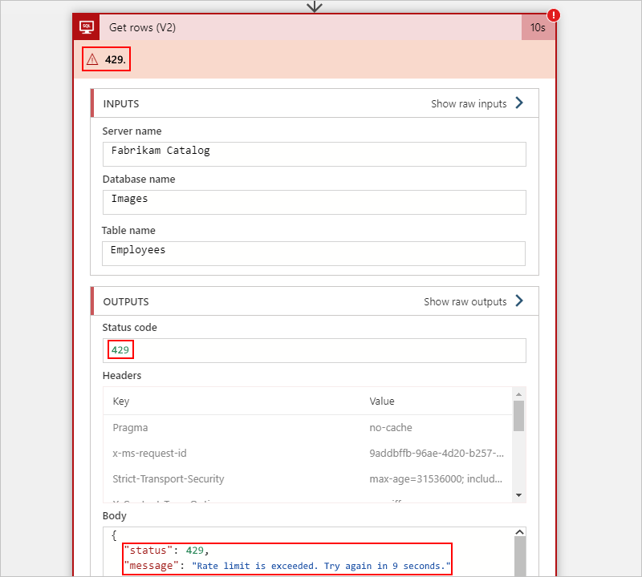
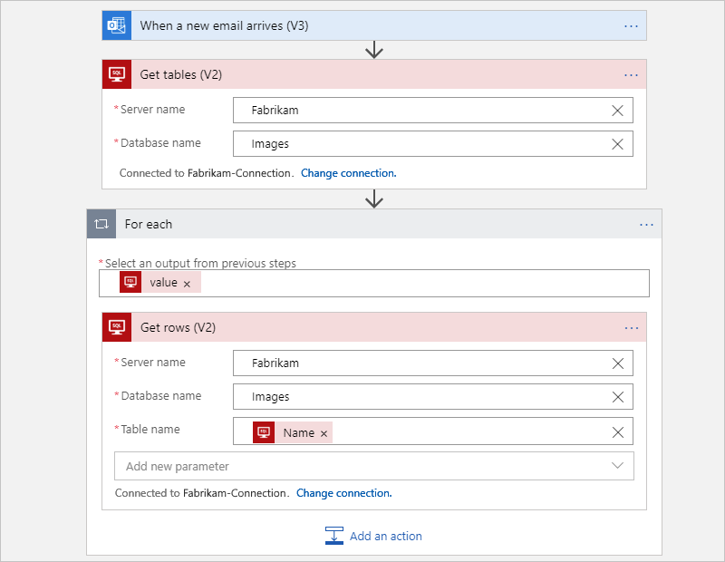
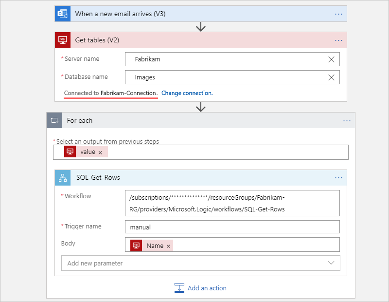
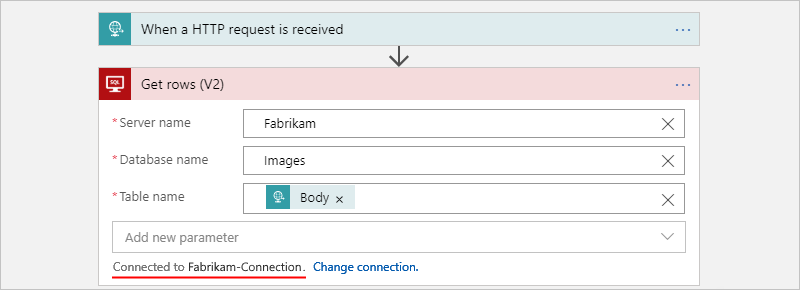
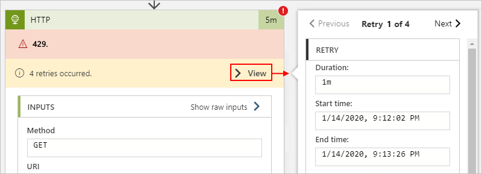
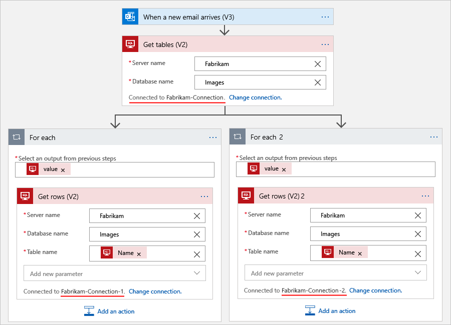
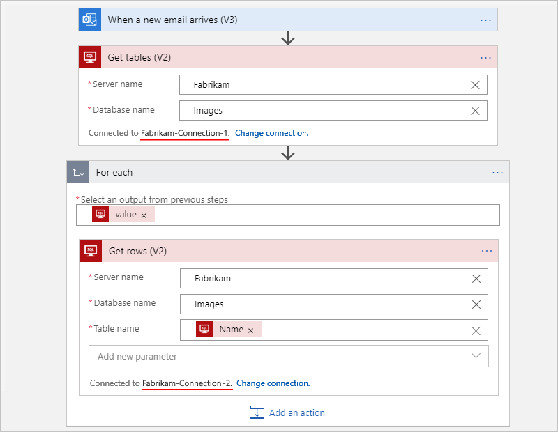

# Handle throttling problems (429 - "Too many requests" errors) in Azure Logic Apps

[!INCLUDE [logic-apps-sku-consumption-standard](../../includes/logic-apps-sku-consumption-standard.md)]

If your logic app workflow experiences throttling, which happens when the number of requests exceed the rate at which the destination can handle over a specific amount of time, you get the ["HTTP 429 Too many requests" error](https://developer.mozilla.org/docs/Web/HTTP/Status/429). Throttling can create problems such as delayed data processing, reduced performance speed, and errors such as exceeding the specified retry policy.

For example, the following SQL Server action in a Consumption workflow shows a 429 error, which reports a throttling problem:

The following sections describe the common levels at which your workflow might experience throttling:

* [Logic app resource](#logic-app-throttling)
* [Connector](#connector-throttling)
* [Destination service or system](#destination-throttling)

## Logic app resource throttling

Azure Logic Apps has its own [throughput limits](logic-apps-limits-and-config.md#throughput-limits). If your logic app resource exceeds these limits, your logic app resource gets throttled, not just a specific workflow instance or run.

To find throttling events at this level, follow these steps:

### [Consumption](#tab/consumption)

1. In the [Azure portal](https://portal.azure.com), open your logic app resource.

1. On the logic app resource menu, under **Monitoring**, select **Metrics**.

1. Under **Chart Title**, select **Add metric**, which adds another metric bar to the chart.

1. In the first metric bar, from the **Metric** list, select **Action Throttled Events**. From the **Aggregation** list, select **Count**.

1. In the second metric bar, from the **Metric** list, select **Trigger Throttled Events**. From the **Aggregation** list, select **Count**.

The chart now shows throttled events for both actions and triggers in your logic app workflow. For more information, see [View metrics for workflow health and performance in Azure Logic Apps](../logic-apps/view-workflow-metrics.md?tabs=consumption).

### [Standard](#tab/standard)

1. In the [Azure portal](https://portal.azure.com), open your logic app resource.

1. On the logic app resource menu, under **Monitoring**, select **Metrics**.

1. Under **Chart Title**, from the **Metric** list, select **Http 4xx**. From the **Aggregation** list, select **Count**.

The chart now shows throttled events for both actions and triggers in your logic app workflow. For more information, see [View metrics for workflow health and performance in Azure Logic Apps](../logic-apps/view-workflow-metrics.md?tabs=standard).

---

To handle throttling at this level, you have the following options:

* Limit the number of workflow instances that can run at the same time.

  By default, if your workflow's trigger condition is met more than once at the same time, then multiple instances of that trigger fire and run concurrently or *in parallel*. Each trigger instance fires before the previous workflow instance finishes running.

  Although the default number of trigger instances that can concurrently run is [unlimited](logic-apps-limits-and-config.md#concurrency-looping-and-debatching-limits), you can limit this number by [turning on the trigger's concurrency setting](logic-apps-workflow-actions-triggers.md#change-trigger-concurrency), and if necessary, select a limit other than the default value.

* Enable high throughput mode.

  * A Consumption workflow has a [default limit for the number of actions that can run over a 5-minute rolling interval](logic-apps-limits-and-config.md#throughput-limits). To raise this limit to the maximum number of actions, turn on [high throughput mode](logic-apps-limits-and-config.md#run-high-throughput-mode) on your logic app resource.

  * A Standard workflow has no limit on the number of actions that can run during any interval.

* Disable array debatching or "Split On" behavior in triggers.

  If a trigger returns an array for the remaining workflow actions to process, the trigger's [**Split On** setting](logic-apps-workflow-actions-triggers.md#split-on-debatch) divides up the array items and starts a workflow instance for each array item. This behavior effectively triggers multiple concurrent runs up to the [**Split On** limit](logic-apps-limits-and-config.md#concurrency-looping-and-debatching-limits).

  To control throttling, turn off the trigger's **Split On** behavior and have your workflow process the entire array with a single call, rather than handle a single item per call.

* Refactor actions into multiple, smaller workflows.

  As mentioned earlier, a Consumption logic app workflow is limited to a [default number of actions that can run over a 5-minute period](logic-apps-limits-and-config.md#throughput-limits). Although you can increase this limit by enabling [high throughput mode](logic-apps-limits-and-config.md#run-high-throughput-mode), you might also consider whether you want to break down your workflow's actions into smaller workflows so that the number of actions that run in each workflow stays under the limit. That way, you reduce the burden on a single workflow and distribute the load across multiple workflows. This solution works better for actions that handle large data sets or spin up so many concurrently running actions, loop iterations, or actions inside each loop iteration that they exceed action execution limit.

  For example, the following Consumption workflow does all the work to get tables from a SQL Server database and gets the rows from each table. The **For each** loop concurrently iterates through each table so that the **Get rows** action returns the rows for each table. Based on the amounts of data in those tables, these actions might exceed the limit on action executions.

  

  After refactoring, the original workflow is split into a parent workflow and a child workflow.

  The following parent workflow gets the tables from SQL Server and then calls the child workflow for each table to get the rows:

  

  The following child workflow is called by the parent workflow to get the rows for each table:

  

## Connector throttling

Each connector has its own throttling limits, which you can find on [each connector's technical reference page](/connectors/connector-reference/connector-reference-logicapps-connectors). For example, the [Azure Service Bus connector](/connectors/servicebus/) has a throttling limit that permits up to 6,000 calls per minute, while the SQL Server connector has [throttling limits that vary based on the operation type](/connectors/sql/).

Some triggers and actions, such as HTTP, have a ["retry policy"](logic-apps-exception-handling.md#retry-policies) that you can customize based on the [retry policy limits](logic-apps-limits-and-config.md#retry-policy-limits) to implement exception handling. This policy specifies whether and how often a trigger or action retries a request when the original request fails or times out and results in a 408, 429, or 5xx response. So, when throttling starts and returns a 429 error, Logic Apps follows the retry policy where supported.

To learn whether a trigger or action supports retry policies, check the trigger or action's settings. To view a trigger or action's retry attempts, go to your logic app's runs history, select the run that you want to review, and expand that trigger or action to view details about inputs, outputs, and any retries.

The following Consumption workflow example shows where you can find this information for an HTTP action:

Although the retry history provides error information, you might have trouble differentiating between connector throttling and [destination throttling](#destination-throttling). In this case, you might have to review the response's details or perform some throttling interval calculations to identify the source.

For Consumption logic app workflows in multi-tenant Azure Logic Apps, throttling happens at the *connection* level. For logic app workflows that run in an [integration service environment (ISE)](connect-virtual-network-vnet-isolated-environment-overview.md), throttling still happens for non-ISE connections because they run in the multi-tenant Azure Logic Apps. However, ISE connections, which are created by ISE connectors, aren't throttled because they run in your ISE.

To handle throttling at this level, you have the following options:

* Set up multiple connections for a single action so that the workflow can partition the data for processing.

  Consider whether you can distribute the workload by dividing an action's requests across multiple connections to the same destination using the same credentials.

  For example, suppose that your workflow gets tables from a SQL Server database and then gets the rows from each table. Based on the number of rows that you have to process, you can use multiple connections and multiple **For each** loops to divide the total number of rows into smaller sets for processing. This scenario uses two **For each** loops to split the total number of rows in half. The first **For each** loop uses an expression that gets the first half. The other **For each** loop uses a different expression that gets the second half, for example:

  * Expression 1: The `take()` function gets the front of a collection. For more information, see the [**`take()`** function](workflow-definition-language-functions-reference.md#take).

    `@take(collection-or-array-name, div(length(collection-or-array-name), 2))`

  * Expression 2: The `skip()` function removes the front of a collection and returns all the other items. For more information, see the [**`skip()`** function](workflow-definition-language-functions-reference.md#skip).

    `@skip(collection-or-array-name, div(length(collection-or-array-name), 2))`

    The following Consumption workflow example shows how you can use these expressions:

    

* Set up a different connection for each action.

  Consider whether you can distribute the workload by spreading each action's requests over their own connection, even when actions connect to the same service or system and use the same credentials.

  For example, suppose that your workflow gets the tables from a SQL Server database and gets each row in each table. You can use separate connections so that the getting the tables use one connection, while the getting each row uses another connection.

  The following example shows a Consumption workflow that creates and uses a different connection for each action:

  

* Change the concurrency or parallelism on a ["For each" loop](logic-apps-control-flow-loops.md#foreach-loop).

  By default, "For each" loop iterations run at the same time up to the [concurrency limit](logic-apps-limits-and-config.md#looping-debatching-limits). If you have a connection that's getting throttled inside a "For each" loop, you can reduce the number of loop iterations that run in parallel. For more information, see the following documentation:
  
  * ["For each" loops - change concurrency or run sequentially](logic-apps-control-flow-loops.md#sequential-foreach-loop)

  * [Workflow Definition Language schema - For each loops](logic-apps-workflow-actions-triggers.md#foreach-action)

  * [Workflow Definition Language schema - Change "For each" loop concurrency](logic-apps-workflow-actions-triggers.md#change-for-each-concurrency)

  * [Workflow Definition Language schema - Run "For each" loops sequentially](logic-apps-workflow-actions-triggers.md#sequential-for-each)

## Destination service or system throttling

While a connector has its own throttling limits, the destination service or system that's called by the connector might also have throttling limits. For example, some APIs in Microsoft Exchange Server have stricter throttling limits than the Office 365 Outlook connector.

By default, a logic app's workflow instances and any loops or branches inside those instances, run *in parallel*. This behavior means that multiple instances can call the same endpoint at the same time. Each instance doesn't know about the other's existence, so attempts to retry failed actions can create [race conditions](https://en.wikipedia.org/wiki/Race_condition) where multiple calls try to run at same time, but to succeed, those calls must arrive at the destination service or system before throttling starts to happen.

For example, suppose you have an array that has 100 items. You use a "For each" loop to iterate through the array and turn on the loop's concurrency control so that you can restrict the number of parallel iterations to 20 or the [current default limit](logic-apps-limits-and-config.md#concurrency-looping-and-debatching-limits). Inside that loop, an action inserts an item from the array into a SQL Server database, which permits only 15 calls per second. This scenario results in a throttling problem because a backlog of retries builds up and never gets to run.

The following table describes the timeline for what happens in the loop when the action's retry interval is 1 second:

| Point in time | Number of actions that run | Number of actions that fail | Number of retries waiting |
|---------------|----------------------------|-----------------------------|---------------------------|
| T + 0 seconds | 20 inserts | 5 fail, due to SQL limit | 5 retries |
| T + 0.5 seconds | 15 inserts, due to previous 5 retries waiting | All 15 fail, due to previous SQL limit still in effect for another 0.5 seconds | 20 retries  (previous 5 + 15 new) |
| T + 1 second | 20 inserts | 5 fail plus previous 20 retries, due to SQL limit | 25 retries (previous 20 + 5 new)

To handle throttling at this level, you have the following options:

* Create individual workflows so that each handles a single operation.

  * Continuing with the example SQL Server scenario in this section, you can create a workflow that puts array items into a queue, such as an [Azure Service Bus queue](../connectors/connectors-create-api-servicebus.md). You then create another workflow that performs only the insert operation for each item in that queue. That way, only one workflow instance runs at any specific time, which either completes the insert operation and moves on to the next item in the queue, or the instance gets 429 errors but doesn't attempt unproductive retries.

  * Create a parent workflow that calls a child or nested workflow for each action. If the parent needs to call different child workflows based on the parent's outcome, you can use a condition action or switch action that determines which child workflow to call. This pattern can help you reduce the number of calls or operations.

    For example, suppose that you have two workflows, each with a polling trigger that checks your email account every minute for a specific subject, such as "Success" or "Failure". This setup results in 120 calls per hour. Instead, if you create a single parent workflow that polls every minute but calls a child workflow that runs based whether the subject is "Success" or "Failure", you cut the number of polling checks to half, or 60 in this case.

* Set up batch processing. (Consumption workflows only)

  If the destination service supports batch operations, you can address throttling by processing items in groups or batches, rather than individually. To implement the batch processing solution, you create a "batch receiver" logic app workflow and a "batch sender" logic app workflow. The batch sender collects messages or items until your specified criteria is met, and then sends those messages or items in a single group. The batch receiver accepts that group and processes those messages or items. For more information, see [Batch process messages in groups](logic-apps-batch-process-send-receive-messages.md).

* Use the webhook versions for triggers and actions, rather than the polling versions.

  Why? A polling trigger continues to check the destination service or system at specific intervals. A very frequent interval, such as every second, can create throttling problems. However, a webhook trigger or action, such as [HTTP Webhook](../connectors/connectors-native-webhook.md), creates only a single call to the destination service or system, which happens at subscription time and requests that the destination notifies the trigger or action only when an event happens. That way, the trigger or action doesn't have to continually check the destination.
  
  So, if the destination service or system supports webhooks or provides a connector that has a webhook version, this option is better than using the polling version. To identify webhook triggers and actions, confirm that they have the `ApiConnectionWebhook` type or that they don't require that you specify a recurrence. For more information, see [APIConnectionWebhook trigger](logic-apps-workflow-actions-triggers.md#apiconnectionwebhook-trigger) and [APIConnectionWebhook action](logic-apps-workflow-actions-triggers.md#apiconnectionwebhook-action).

## Next steps

* [Limits and configuration in Azure Logic Apps](logic-apps-limits-and-config.md)
