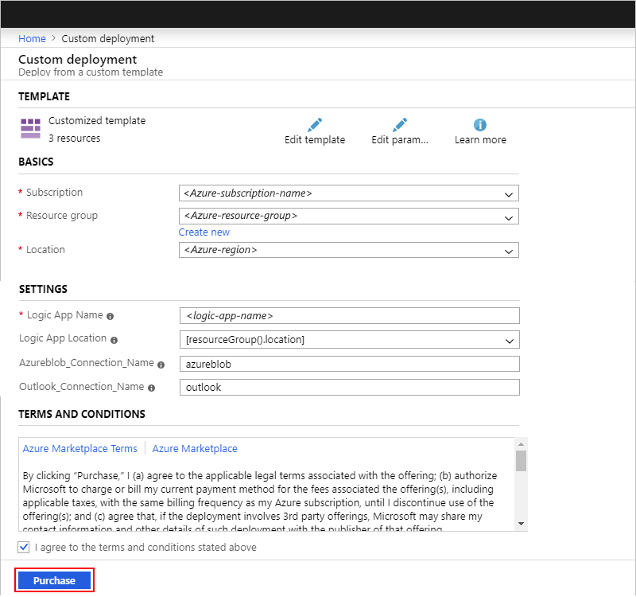

# Export flows from Microsoft Flow and deploy to Azure Logic Apps

To extend and expand your flow's capabilities, you can migrate that flow from [Microsoft Flow](https://flow.microsoft.com) to [Azure Logic Apps](../logic-apps/logic-apps-overview.md). You can export your flow as an Azure Resource Manager template for a logic app, deploy that logic app template to an Azure resource group, and then open that logic app in the Logic App Designer.

> [!NOTE]
> Not all Microsoft Flow connectors are available in Azure Logic Apps. 
> You can import flows that have [equivalent connectors](../connectors/apis-list.md) 
> in Azure Logic Apps. For example, the Button trigger, the Approval connector, 
> and Notification connector are specific to Microsoft Flow.

## Prerequisites

* An Azure subscription. If you don't have an Azure subscription, [sign up for a free Azure account](https://azure.microsoft.com/free/).

* The flow that you want to export from Microsoft Flow

## Export a flow

1. Sign in to [Microsoft Flow](https://flow.microsoft.com), and select **My flows**. Find and select your flow. On the toolbar, select the ellipses (**...**) button. Select **Export** > **Logic Apps template (.json)**.

   

1. Save your template to the location that you want.

For more information, see [Grow up to Azure Logic Apps](https://flow.microsoft.com/blog/grow-up-to-logic-apps/).

## Deploy template to Azure

1. Sign in the [Azure portal](https://portal.azure.com) with your Azure account.

1. On the main Azure menu, select **Create a resource**. In the search box, enter "template deployment". Select **Template deployment (deploy using custom templates)**, and then select **Create**.

   

1. Under **Custom deployment**, select **Build your own template in the editor**.

   

1. From the **Edit template** toolbar, select **Load file**. Find and select the JSON template that you exported from Microsoft Flow, and select **Open**.

   

1. Edit the template so that you can deploy the flow as a logic app. In the template editor, after your template's contents appear, remove *only* the `template` attribute and enclosing curly braces, but keep the content within that attribute.

   

1. After the template editor correctly shows the parameters and resources in your template, select **Save**.
  
   

1. Now specify these input parameters for the template:

   * Azure subscription to use for billing
   * Azure resource group
   * Location for the Azure resource group
   * Name for the logic app resource
   * Location for the logic app resource, if different from the Azure resource group
   * The name for any previously created connections that the logic app can reuse

      If you're creating your first logic app, all connections are created as new, so you can accept the default names. Otherwise, you can specify the names for previously created connections, which you can use across multiple logic apps.

   After you provide this information for the template, review and agree to the Azure Marketplace Terms and Conditions for creating the necessary Azure resources and billing your Azure subscription accordingly, and then select **Purchase**.
  
   

   Azure deploys your template as a logic app to your specified resource group. All logic apps that you migrate from Microsoft Flow are deployed in a disabled state.

1. Before you activate your logic app, authorize any new connections by following these steps:

   1. Open the logic app that you created. On the logic app's menu, select **Logic app designer**.

      Each connection that requires authorization shows a warning icon:

      

   1. For each step that requires an authorized connection, expand that step, and select **Add new**.

      

   1. Sign in to each service or provide the necessary credentials to authorize the connection.

1. Save your logic app. When you're ready to activate your logic app, on the logic app's menu, select **Overview**, and then select **Enable**.

   

1. To avoid running duplicate workflows, make sure that you delete your original flow.

## Next steps

* Learn more about [Connectors for Azure Logic Apps](../connectors/apis-list.md)
* Learn more about [Azure Logic Apps](../logic-apps/logic-apps-overview.md)