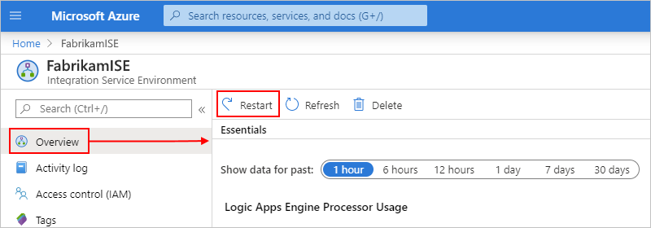

# Manage your integration service environment (ISE) in Azure Logic Apps

This article shows how to perform management tasks for your [integration service environment (ISE)](../logic-apps/connect-virtual-network-vnet-isolated-environment-overview.md), for example:

* Manage the resources such as logic apps, connections, integration accounts, and connectors in your ISE.
* Check your ISE's network health.
* Add capacity, restart your ISE, or delete your ISE, follow the steps in this topic. To add these artifacts to your ISE, see [Add artifacts to your integration service environment](../logic-apps/add-artifacts-integration-service-environment-ise.md).

## View your ISE

1. Sign in to the [Azure portal](https://portal.azure.com).

1. In the portal's search box, enter "integration service environments", and then select **Integration Service Environments**.

   

1. From the results list, select your integration service environment.

   

1. Continue to the next sections to find logic apps, connections, connectors, or integration accounts in your ISE.

## Check network health

On your ISE menu, under **Settings**, select **Network health**. This pane shows the health status for your subnets and outbound dependencies on other services.

## Manage your logic apps

You can view and manage the logic apps that are in your ISE.

1. On your ISE menu, under **Settings**, select **Logic apps**.

   

1. To remove logic apps that you no longer need in your ISE, select those logic apps, and then select **Delete**. To confirm that you want to delete, select **Yes**.

> [!NOTE]
> If you delete and recreate a child logic app, you must resave the parent logic app. The recreated child app will have different metadata.
> If you don't resave the parent logic app after recreating its child, your calls to the child logic app will fail with an error of "unauthorized." This behavior applies to parent-child logic apps, for example, those that use artifacts in integration accounts or call Azure functions.

## Manage API connections

You can view and manage the connections that were created by the logic apps running in your ISE.

1. On your ISE menu, under **Settings**, select **API connections**.

   

1. To remove connections that you no longer need in your ISE, select those connections, and then select **Delete**. To confirm that you want to delete, select **Yes**.

## Manage ISE connectors

You can view and manage the API connectors that are deployed to your ISE.

1. On your ISE menu, under **Settings**, select **Managed connectors**.

   

1. To remove connectors that you don't want available in your ISE, select those connectors, and then select **Delete**. To confirm that you want to delete, select **Yes**.

## Manage custom connectors

You can view and manage the custom connectors that you deployed to your ISE.

1. On your ISE menu, under **Settings**, select **Custom connectors**.

   

1. To remove custom connectors that you no longer need in your ISE, select those connectors, and then select **Delete**. To confirm that you want to delete, select **Yes**.

## Manage integration accounts

1. On your ISE menu, under **Settings**, select **Integration accounts**.

   

1. To remove integration accounts from your ISE when no longer needed, select those integration accounts, and then select **Delete**.

## Add ISE capacity

The Premium ISE base unit has fixed capacity, so if you need more throughput, you can add more scale units, either during creation or afterwards. The Developer SKU doesn't include the capability to add scale units.

1. In the [Azure portal](https://portal.azure.com), go to your ISE.

1. To review usage and performance metrics for your ISE, on your ISE menu, select **Overview**.

   

1. Under **Settings**, select **Scale out**. On the **Configure** pane, select from these options:

   * [**Manual scale**](#manual-scale): Scale based on the number of processing units that you want to use.
   * [**Custom autoscale**](#custom-autoscale): Scale based on performance metrics by selecting from various criteria and specifying the threshold conditions for meeting that criteria.

   

### Manual scale

1. After you select **Manual scale**, for **Additional capacity**, select the number of scaling units that you want to use.

   

1. When you're done, select **Save**.

### Custom autoscale

1. After you select **Custom autoscale**, for **Autoscale setting name**, provide a name for your setting and optionally, select the Azure resource group where the setting belongs.

   

1. For the **Default** condition, select either **Scale based on a metric** or **Scale to a specific instance count**.

   * If you choose instance-based, enter the number for the processing units, which is a value from 0 to 10.

   * If you choose metric-based, follow these steps:

     1. In the **Rules** section, select **Add a rule**.

     1. On the **Scale rule** pane, set up your criteria and action to take when the rule triggers.

     1. For **Instance limits**, specify these values:

        * **Minimum**: The minimum number of processing units to use
        * **Maximum**: The maximum number of processing units to use
        * **Default**: If any problems happen while reading the resource metrics, and the current capacity is below the default capacity, autoscaling scales out to the default number of processing units. However, if the current capacity exceeds the default capacity, autoscaling doesn't scale in.

1. To add another condition, select **Add scale condition**.

1. When you're finished with your autoscale settings, save your changes.

## Restart ISE

If you change your DNS server or DNS server settings, you have to restart your ISE so that the ISE can pick up those changes. Restarting a Premium SKU ISE doesn't result in downtime due to redundancy and components that restart one at a time during recycling. However, a Developer SKU ISE experiences downtime because no redundancy exists. For more information, see [ISE SKUs](../logic-apps/connect-virtual-network-vnet-isolated-environment-overview.md#ise-level).

1. In the [Azure portal](https://portal.azure.com), go to your ISE.

1. On the ISE menu, select **Overview**. On the Overview toolbar, **Restart**.

   

## Delete ISE

Before you delete an ISE that you no longer need or an Azure resource group that contains an ISE, check that you have no policies or locks on the Azure resource group that contains these resources or on your Azure virtual network because these items can block deletion.

After you delete your ISE, you might have to wait up to 9 hours before you try to delete your Azure virtual network or subnets.

## Next steps

* [Add resources to integration service environments](../logic-apps/add-artifacts-integration-service-environment-ise.md)