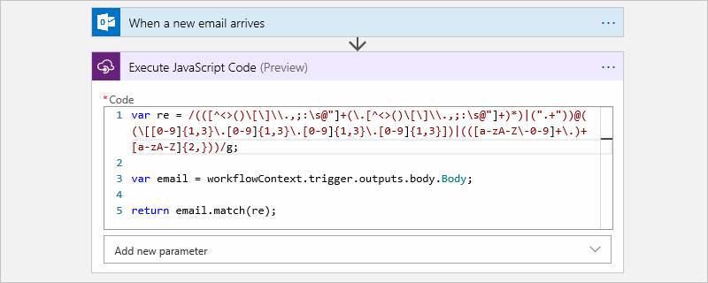
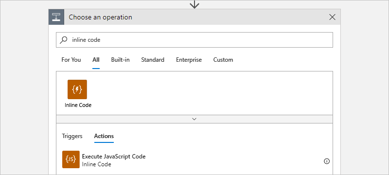
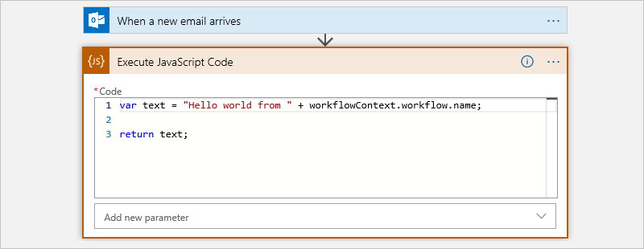
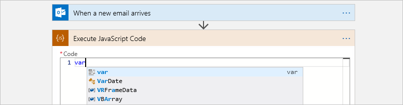
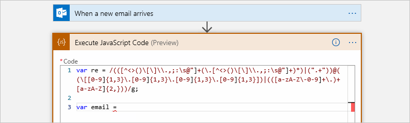
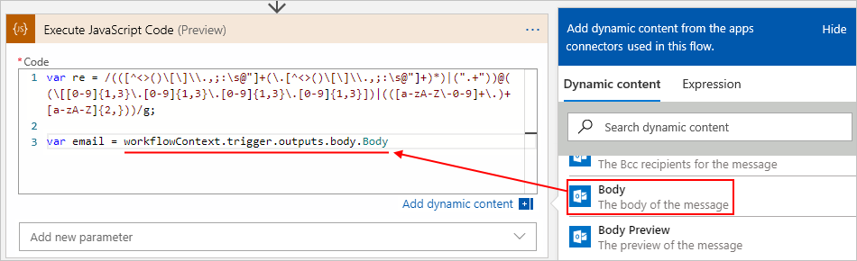
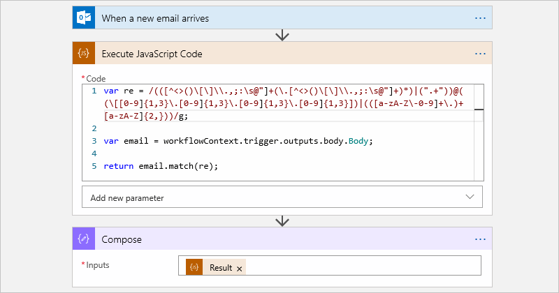
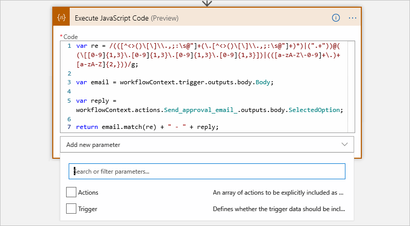
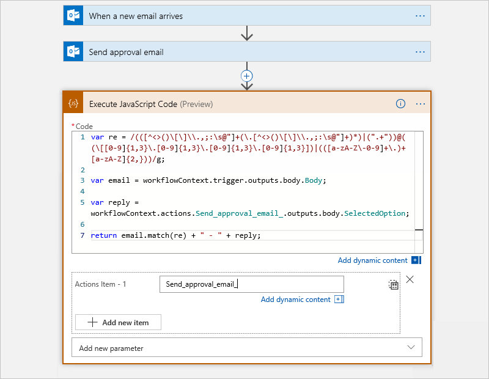

# Add and run code snippets by using inline code in Azure Logic Apps

When you want to run a piece of code inside your logic app workflow, you can add the built-in Inline Code action as a step in your logic app's workflow. This action works best when you want to run code that fits this scenario:

* Runs in JavaScript. More languages are in development.

* Finishes running in five seconds or fewer.

* Handles data up to 50 MB in size.

* Doesn't require working with the [**Variables** actions](../logic-apps/logic-apps-create-variables-store-values.md), which are not yet supported.

* Uses Node.js version 8.11.1 for [multi-tenant based logic apps](logic-apps-overview.md) or [Node.js versions 10.x.x, 11.x.x, or 12.x.x](https://nodejs.org/en/download/releases/) for [single-tenant based logic apps](single-tenant-overview-compare.md).

  For more information, see [Standard built-in objects](https://developer.mozilla.org/docs/Web/JavaScript/Reference/Global_Objects).

  > [!NOTE]
  > The `require()` function isn't supported by the Inline Code action for running JavaScript.

This action runs the code snippet and returns the output from that snippet as a token that's named `Result`. You can use this token with subsequent actions in your logic app's workflow. For other scenarios where you want to create a function for your code, try [creating and calling a function through Azure Functions instead](../logic-apps/logic-apps-azure-functions.md) in your logic app.

In this article, the example logic app triggers when a new email arrives in a work or school account. The code snippet extracts and returns any email addresses that appear in the email body.



## Prerequisites

* An Azure account and subscription. If you don't have an Azure subscription, [sign up for a free Azure account](https://azure.microsoft.com/free/).

* The logic app workflow where you want to add your code snippet, including a trigger. The example in this topic uses the Office 365 Outlook trigger that's named **When a new email arrives**.

  If you don't have a logic app, review the following documentation:

  * Multi-tenant: [Quickstart: Create your first logic app](../logic-apps/quickstart-create-first-logic-app-workflow.md)
  * Single-tenant: [Create single-tenant based logic app workflows](create-single-tenant-workflows-azure-portal.md)

* Based on whether your logic app is multi-tenant or single-tenant, review the following information.

  * Multi-tenant: Requires Node.js version 8.11.1. You also need an empty [integration account](../logic-apps/logic-apps-enterprise-integration-create-integration-account.md) that's linked to your logic app. Make sure that you use an integration account that's appropriate for your use case or scenario.

    For example, [Free-tier](../logic-apps/logic-apps-pricing.md#integration-accounts) integration accounts are meant only for exploratory scenarios and workloads, not production scenarios, are limited in usage and throughput, and aren't supported by a service-level agreement (SLA).

    Other integration account tiers incur costs, but include SLA support, offer more throughput, and have higher limits. Learn more about integration account [tiers](../logic-apps/logic-apps-pricing.md#integration-accounts), [pricing](https://azure.microsoft.com/pricing/details/logic-apps/), and [limits](../logic-apps/logic-apps-limits-and-config.md#integration-account-limits).

  * Single-tenant: Requires [Node.js versions 10.x.x, 11.x.x, or 12.x.x](https://nodejs.org/en/download/releases/). However, you don't need an integration account, but the Inline Code action is renamed **Inline Code Operations** and has [updated limits](logic-apps-limits-and-config.md).

## Add inline code

1. If you haven't already, in the [Azure portal](https://portal.azure.com), open your logic app workflow in the designer.

1. In your workflow, choose where to add the Inline Code action, either as a new step at the end of your workflow or between steps.

   To add the action between steps, move your mouse pointer over the arrow that connects those steps. Select the plus sign (**+**) that appears, and select **Add an action**.

   This example adds the action under the Office 365 Outlook trigger.

   

1. In the action search box, enter `inline code`. From the actions list, select the action named **Execute JavaScript Code**.

   

   The action appears in the designer and by default, contains some sample code, including a `return` statement.

   

1. In the **Code** box, delete the sample code, and enter your code. Write the code that you'd put inside a method, but without the method signature.

   If you start typing a recognized keyword, the autocomplete list appears so that you can select from available keywords, for example:

   

   This example code snippet first creates a variable that stores a *regular expression*, which specifies a pattern to match in input text. The code then creates a variable that stores the email body data from the trigger.

   

   To make the results from the trigger and previous actions easier to reference, the dynamic content list appears when your cursor is inside the **Code** box. For this example, the list shows available results from the trigger, including the **Body** token, which you can now select.

   After you select the **Body** token, the inline code action resolves the token to a `workflowContext` object that references the email's `Body` property value:

   

   In the **Code** box, your snippet can use the read-only `workflowContext` object as input. This object includes properties that give your code access to the results from the trigger and previous actions in your workflow. For more information, see [Reference trigger and action results in your code](#workflowcontext) later in this topic.

   > [!NOTE]
   > If your code snippet references action names that use the dot (.) operator, you must add those 
   > action names to the [**Actions** parameter](#add-parameters). Those references must also enclose 
   > the action names with square brackets ([]) and quotation marks, for example:
   >
   > `// Correct`</br> 
   > `workflowContext.actions["my.action.name"].body`</br>
   >
   > `// Incorrect`</br>
   > `workflowContext.actions.my.action.name.body`

   The Inline Code action doesn't require a `return` statement, but the results from a `return` statement are available for reference in later actions through the **Result** token. For example, the code snippet returns the result by calling the `match()` function, which finds matches in the email body against the regular expression. The **Compose** action uses the **Result** token to reference the results from the inline code action and creates a single result.

   

1. When you're done, save your logic app.

<a name="workflowcontext"></a>

### Reference trigger and action results in your code

The `workflowContext` object has this structure, which includes the `actions`, `trigger`, and `workflow` subproperties:

```json
{
   "workflowContext": {
      "actions": {
         "<action-name-1>": @actions('<action-name-1>'),
         "<action-name-2>": @actions('<action-name-2>')
      },
      "trigger": {
         @trigger()
      },
      "workflow": {
         @workflow()
      }
   }
}
```

This table contains more information about these subproperties:

| Property | Type | Description |
|----------|------|-------|
| `actions` | Object collection | Result objects from actions that run before your code snippet runs. Each object has a *key-value* pair where the key is the name of an action, and the value is equivalent to calling the [actions() function](../logic-apps/workflow-definition-language-functions-reference.md#actions) with `@actions('<action-name>')`. The action's name uses the same action name that's used in the underlying workflow definition, which replaces spaces (" ") in the action name with underscores (_). This object provides access to action property values from the current workflow instance run. |
| `trigger` | Object | Result object from the trigger and equivalent to calling the [trigger() function](../logic-apps/workflow-definition-language-functions-reference.md#trigger). This object provides access to trigger property values from the current workflow instance run. |
| `workflow` | Object | The workflow object and equivalent to calling the [workflow() function](../logic-apps/workflow-definition-language-functions-reference.md#workflow). This object provides access to workflow property values, such as the workflow name, run ID, and so on, from the current workflow instance run. |
|||

In this topic's example, the `workflowContext` object has these properties that your code can access:

```json
{
   "workflowContext": {
      "trigger": {
         "name": "When_a_new_email_arrives",
         "inputs": {
            "host": {
               "connection": {
                  "name": "/subscriptions/<Azure-subscription-ID>/resourceGroups/<Azure-resource-group-name>/providers/Microsoft.Web/connections/office365"
               }
            },
            "method": "get",
            "path": "/Mail/OnNewEmail",
            "queries": {
               "includeAttachments": "False"
            }
         },
         "outputs": {
            "headers": {
               "Pragma": "no-cache",
               "Content-Type": "application/json; charset=utf-8",
               "Expires": "-1",
               "Content-Length": "962095"
            },
            "body": {
               "Id": "AAMkADY0NGZhNjdhLTRmZTQtNGFhOC1iYjFlLTk0MjZlZjczMWRhNgBGAAAAAABmZwxUQtCGTqSPpjjMQeD",
               "DateTimeReceived": "2019-03-28T19:42:16+00:00",
               "HasAttachment": false,
               "Subject": "Hello World",
               "BodyPreview": "Hello World",
               "Importance": 1,
               "ConversationId": "AAQkADY0NGZhNjdhLTRmZTQtNGFhOC1iYjFlLTk0MjZlZjczMWRhNgAQ",
               "IsRead": false,
               "IsHtml": true,
               "Body": "Hello World",
               "From": "<sender>@<domain>.com",
               "To": "<recipient-2>@<domain>.com;<recipient-2>@<domain>.com",
               "Cc": null,
               "Bcc": null,
               "Attachments": []
            }
         },
         "startTime": "2019-05-03T14:30:45.971564Z",
         "endTime": "2019-05-03T14:30:50.1746874Z",
         "scheduledTime": "2019-05-03T14:30:45.8778117Z",
         "trackingId": "1cd5ffbd-f989-4df5-a96a-6e9ce31d03c5",
         "clientTrackingId": "08586447130394969981639729333CU06",
         "originHistoryName": "08586447130394969981639729333CU06",
         "code": "OK",
         "status": "Succeeded"
      },
      "workflow": {
         "id": "/subscriptions/<Azure-subscription-ID>/resourceGroups/<Azure-resource-group-name>/providers/Microsoft.Logic/workflows/<logic-app-workflow-name>",
         "name": "<logic-app-workflow-name>",
         "type": "Microsoft.Logic/workflows",
         "location": "<Azure-region>",
         "run": {
            "id": "/subscriptions/<Azure-subscription-ID>/resourceGroups/<Azure-resource-group-name>/providers/Microsoft.Logic/workflows/<logic-app-workflow-name>/runs/08586453954668694173655267965CU00",
            "name": "08586453954668694173655267965CU00",
            "type": "Microsoft.Logic/workflows/runs"
         }
      }
   }
}
```

<a name="add-parameters"></a>

## Add parameters

In some cases, you might have to explicitly require that the Inline Code action includes results from the trigger or specific actions that your code references as dependencies by adding the **Trigger** or **Actions** parameters. This option is useful for scenarios where the referenced results aren't found at run time.

> [!TIP]
> If you plan to reuse your code, add references to properties by using the **Code** box so that your code 
> includes the resolved token references, rather than adding the trigger or actions as explicit dependencies.

For example, suppose you have code that references the **SelectedOption** result from the **Send approval email** action for the Office 365 Outlook connector. At create time, the Logic Apps engine analyzes your code to determine whether you've referenced any trigger or action results and includes those results automatically. At run time, should you get an error that the referenced trigger or action result isn't available in the specified `workflowContext` object, you can add that trigger or action as an explicit dependency. In this example, you add the **Actions** parameter and specify that the Inline Code action explicitly include the result from the **Send approval email** action.

To add these parameters, open the **Add new parameter** list, and select the parameters you want:

   

   | Parameter | Description |
   |-----------|-------------|
   | **Actions** | Include results from previous actions. See [Include action results](#action-results). |
   | **Trigger** | Include results from the trigger. See [Include trigger results](#trigger-results). |
   |||

<a name="trigger-results"></a>

### Include trigger results

If you select **Triggers**, you're prompted whether to include trigger results.

* From the **Trigger** list, select **Yes**.

<a name="action-results"></a>

### Include action results

If you select **Actions**, you're prompted for the actions that you want to add. However, before you start adding actions, you need the version of the action name that appears in the logic app's underlying workflow definition.

* This capability doesn't support variables, loops, and iteration indexes.

* Names in your logic app's workflow definition use an underscore (_), not a space.

* For action names that use the dot operator (.), include those operators, for example:

  `My.Action.Name`

1. On the designer toolbar, select **Code view**, and search inside the `actions` attribute for the action name.

   For example, `Send_approval_email_` is the JSON name for the **Send approval email** action.

   

1. To return to designer view, on the code view toolbar, select **Designer**.

1. To add the first action, in the **Actions Item - 1** box, enter the action's JSON name.

   

1. To add another action, select **Add new item**.

## Reference

For more information about the **Execute JavaScript Code** action's structure and syntax in your logic app's underlying workflow definition using the Workflow Definition Language, see this action's [reference section](../logic-apps/logic-apps-workflow-actions-triggers.md#run-javascript-code).

## Next steps

Learn more about [Connectors for Azure Logic Apps](../connectors/apis-list.md)
