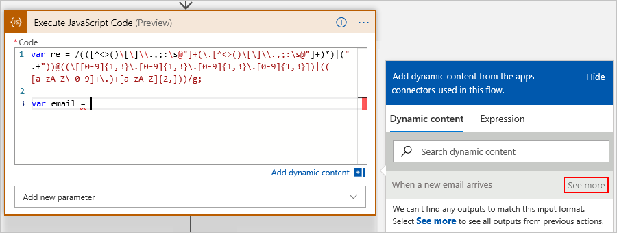

# Add and run code snippets by using inline code in Azure Logic Apps

When you want to run a piece of code inside your logic app, 
you can add the built-in **Inline Code** action as a step in 
your logic app's workflow. This action works best when you want 
to run code that fits this scenario:

* Runs in JavaScript.
* Finishes running in five seconds or fewer.
* Handles data within a specific limit.
* Uses the same libraries that Azure Functions supports.

  For example, with JavaScript, this action uses these 
  <a href="https://www.w3schools.com/nodejs/ref_modules.asp">Node.js modules</a>. For more information, see 
  [Azure Functions JavaScript developer guide](../azure-functions/functions-reference-node.md).

This action returns just one output named **Result**, 
which you can use in subsequent actions in your logic app. 
For other scenarios where you want to create a function for your code, try 
[creating and calling an Azure function](../logic-apps/logic-apps-azure-functions.md) 
in your logic app. If you're new to Azure Logic Apps, see 
[What is Azure Logic Apps?](../logic-apps/logic-apps-overview.md)

In this article, the example logic app triggers when 
a new email arrives in an Office 365 Outlook account. 
The code snippet extracts and returns any email addresses 
that appear in the email body.

## Prerequisites

* An Azure subscription. If you don't have an Azure subscription, 
<a href="https://azure.microsoft.com/free/" target="_blank">sign up for a free Azure account</a>.

* The logic app where you want add your code snippet, 
including a trigger. If you don't have a logic app, see 
[Quickstart: Create your first logic app](../logic-apps/quickstart-create-first-logic-app-workflow.md).

   The example logic app in this topic uses the Office 365 
   Outlook trigger **When a new email arrives**. 

* An [integration account](../logic-apps/logic-apps-enterprise-integration-create-integration-account.md) 
that's linked to your logic app

## Add inline code

1. If you haven't already, in the [Azure portal](https://portal.azure.com), 
open your logic app in the Logic App Designer.

1. In the designer, add the **Inline Code** action at the 
location that you want in your logic app's workflow.

   * To add the action at the end of your workflow, choose **Next step**.

   * To add the action between existing steps, move your mouse pointer over 
   the arrow that connects those steps. Choose the plus sign (**+**), 
   and select **Add an action**.

   This example adds the **Inline Code action** 
   under the Office 365 Outlook trigger.

   

1. Under **Choose an action**, in the search box, 
enter "inline code" as your filter. From the actions list, 
select this action: **Execute JavaScript Code**

   

1. In the **Code** box, enter the code that you want to run.

   When you click in the **Code** box, the dynamic content list 
   opens and shows any outputs from previous steps that match 
   the current action's expected input format. To reference 
   these outputs in your code, select the outputs that you want.
   To view all outputs from previous steps, choose **See more** 
   in the dynamic content list.

   

   In this example, the code snippet first creates a variable that stores 
   a *regular expression*, which specifies a pattern to match in input text. 
   The code then creates a variable that stores the email body. Rather than 
   appear as the **Body** field, the email body resolves to a `workflowContext` 
   object that references the email's `Body` property value.

   

   The code snippet then returns the result by calling the `match()` function, 
   which finds matches in the email body against the regular expression. 
   The **Compose** action takes the **Result** output from inline code action 
   result and creates a single output.

   

1. When you're done, save your logic app.

## Add parameters

Optionally, you can reference outputs from the trigger 
and previous actions in your code by adding parameters. 
To add parameters, open the **Add new parameter** list, 
and select the parameters you want. For example:

   

   | Parameter | Description |
   |-----------|-------------|
   | **Actions** | Include an array with outputs from previous actions. See [Include action outputs](#action-outputs). |
   | **Trigger** | Include outputs from the trigger. See [Include trigger outputs](#trigger-outputs). |
   |||

### Include action outputs

If you select **Actions**, you're prompted for the action outputs that you want.

1. To add the first action, click in the **Actions Item - 1** box.

1. From the dynamic content list that opens, select the output you want.

1. To add another output, choose **Add new item**.

### Include trigger outputs

When you select **Triggers**, you're prompted whether to include trigger outputs.

1. From the **Trigger** list, select **Yes**.

## Next steps

Learn more about [Connectors for Azure Logic Apps](../connectors/apis-list.md)