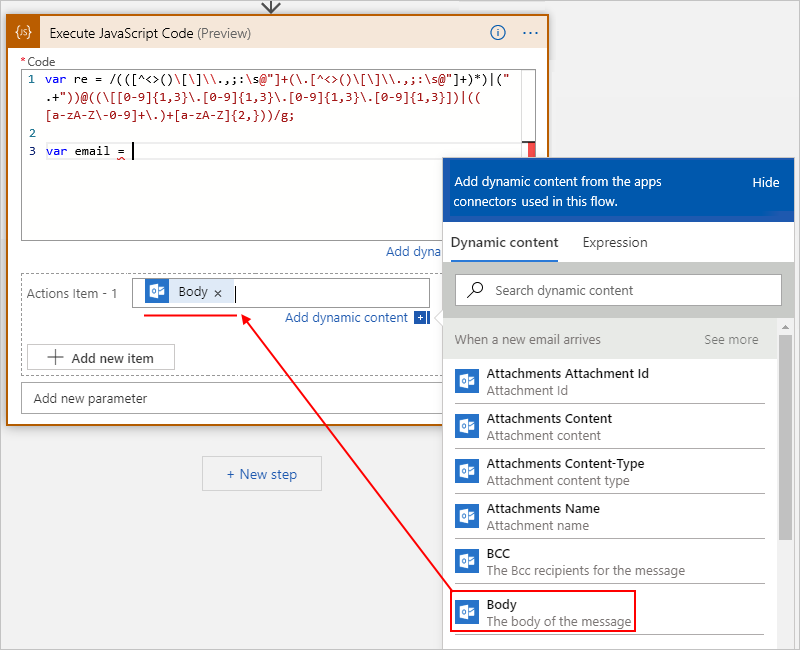

# Add and run code snippets by using inline code in Azure Logic Apps

When you want to run a piece of code inside your logic app, 
you can add the built-in **Inline Code** action as a step in 
your logic app's workflow. This action works best when you want 
to run code that fits this scenario:

* Runs in JavaScript. More languages to follow.
* Finishes running in five seconds or fewer.
* Handles data up to 50 MB in size.
* Uses these [Node.js modules](https://www.w3schools.com/nodejs/ref_modules.asp). 

This action returns a single output named **Result**, 
which you can use in subsequent actions in your logic app. 
For other scenarios where you want to create a function for your code, try 
[creating and calling an Azure function](../logic-apps/logic-apps-azure-functions.md) 
in your logic app.

In this article, the example logic app triggers when 
a new email arrives in an Office 365 Outlook account. 
The code snippet extracts and returns any email addresses 
that appear in the email body.

## Prerequisites

* An Azure subscription. If you don't have an Azure subscription, 
[sign up for a free Azure account](https://azure.microsoft.com/free/).

* The logic app where you want to add your code snippet, 
including a trigger. If you don't have a logic app, see 
[Quickstart: Create your first logic app](../logic-apps/quickstart-create-first-logic-app-workflow.md).

   The example logic app in this topic uses this Office 365 
   Outlook trigger: **When a new email arrives**

* An [integration account](../logic-apps/logic-apps-enterprise-integration-create-integration-account.md) 
that's linked to your logic app

## Add inline code

1. If you haven't already, in the [Azure portal](https://portal.azure.com), 
open your logic app in the Logic App Designer.

1. In the designer, add the **Inline Code** action at the 
location that you want in your logic app's workflow.

   * To add the action at the end of your workflow, choose **New step**.

   * To add the action between existing steps, move your mouse pointer over 
   the arrow that connects those steps. Choose the plus sign (**+**), 
   and select **Add an action**.

   This example adds the **Inline Code** action 
   under the Office 365 Outlook trigger.

   

1. Under **Choose an action**, in the search box, 
enter "inline code" as your filter. From the actions list, 
select this action: **Execute JavaScript Code**

   

   The action appears in the designer and contains 
   some default example code, including a return statement.

   

1. In the **Code** box, delete the sample code, and enter the 
code that you want to run. Write code that you'd put inside 
a method, but without defining the method signature. 

   When you type a recognized keyword, the autocomplete list appears 
   so that you can select from available keywords, for example:

   

   In this example, the code snippet first creates a variable 
   that stores a *regular expression*, which specifies a pattern 
   to match in input text. The code then creates a variable that 
   stores the email body output from the trigger.

   

   To make outputs from the trigger and previous actions 
   easier to reference, the dynamic content list appears 
   while your cursor is inside the **Code** box. By default, 
   this list shows only those outputs that match the current 
   action's expected input format. To view all the available 
   outputs from previous steps, choose **See more** in the 
   dynamic content list.

   

   The list now shows the outputs from the trigger, 
   including the **Body** token, which you can now select. 
   With the inline code action, the **Body** token resolves 
   to a `workflowContext` object that references the email's 
   `Body` property value:

   

   The `workflowContext` object provides access to these subproperties: 
   `workflow`, `trigger`, and `actions`. The `workflow` property also 
   provides access to properties that contain information such as the 
   workflow name, run ID, and so on. The outputs from `trigger` are 
   values based the current run. The properties available through 
   `actions` use the same names as the actions on the designer.

   The inline code action doesn't require a `return` statement, 
   but the value output from a `return` statement is available 
   for later actions through the **Result** token. For example, 
   the code snippet then returns the result by calling the 
   `match()` function, which finds matches in the email body 
   against the regular expression. The **Compose** action uses 
   the **Result** token to reference the output from the inline 
   code action and creates a single output.

   

1. When you're done, save your logic app.

## Add parameters

Optionally, you can require that the **Inline Code** action 
includes outputs from the trigger or specific actions that 
your code references by adding the **Trigger** or **Actions** 
parameters. This option is useful for scenarios where the 
referenced outputs might not be available.

> [!TIP]
> If you plan to reuse your code, select your outputs 
> from inside the **Code** box so that your code 
> includes the resolved token references.

For example, suppose you have code that references the **To** 
and **Subject** outputs from the **Send an email** action for 
the Office 365 Outlook connector. At run time, the Logic Apps 
engine analyzes your code to determine whether you've referenced 
any trigger or action outputs and includes those outputs automatically. 
However, should you get an error that a referenced output isn't available, 
you can add the **Actions** parameter and specify that the **Inline Code** 
action include the **To** and **Subject** outputs.

To add these parameters, open the **Add new parameter** list, 
and select the parameters you want:

   

   | Parameter | Description |
   |-----------|-------------|
   | **Actions** | Include an array with outputs from previous actions. See [Include action outputs](#action-outputs). |
   | **Trigger** | Include outputs from the trigger. See [Include trigger outputs](#trigger-outputs). |
   |||

### Include trigger outputs

If you select **Triggers**, you're prompted whether to include trigger outputs.

* From the **Trigger** list, select **Yes**.

### Include action outputs

If you select **Actions**, you're prompted for the action outputs that you want.

1. To add the first action, click inside the **Actions Item - 1** box.

1. From the dynamic content list that appears, select the output you want.

   

1. To add another output, choose **Add new item**.

## Next steps

Learn more about [Connectors for Azure Logic Apps](../connectors/apis-list.md)
