# Run code snippets in workflows with Inline Code operations in Azure Logic Apps

[!INCLUDE [logic-apps-sku-consumption-standard](../../includes/logic-apps-sku-consumption-standard.md)]

To create and run a code snippet in your logic app workflow without much setup, you can use the **Inline Code** built-in connector. This connector has an action that returns the result from the code snippet so that you can use that output in your workflow's subsequent actions.

Currently, the connector only has a single action, which works best for a code snippet with the following attributes, but more actions are in development. The **Inline Code** built-in connector also has 
[different limits](logic-apps-limits-and-config.md#inline-code-action-limits), based on whether your logic app workflow is [Consumption or Standard](logic-apps-overview.md#resource-environment-differences).

| Action | Language | Language version | Run duration | Data size | Other notes |
|--------|----------|------------------|--------------|-----------|-------------|
| **Execute JavaScript Code** | JavaScript | **Standard**: <br>Node.js 16.x.x <br><br>**Consumption**: <br>Node.js 8.11.1 <br><br>For more information, review [Standard built-in objects](https://developer.mozilla.org/docs/Web/JavaScript/Reference/Global_Objects). | Finishes in 5 seconds or fewer. | Handles data up to 50 MB. | - Doesn't require working with the [**Variables** actions](logic-apps-create-variables-store-values.md), which are unsupported by the action. <br><br>- Doesn't support the `require()` function for running JavaScript. |

To run code that doesn't fit these attributes, you can [create and call a function through Azure Functions](logic-apps-azure-functions.md) instead.

This article shows how the action works in an example workflow that starts with an Office 365 Outlook trigger. The workflow runs when a new email arrives in the associated Outlook email account. The sample code snippet extracts any email addresses that exist the email body and returns those addresses as output that you can use in a subsequent action.

The following diagram shows the highlights from example workflow:

### [Consumption](#tab/consumption)

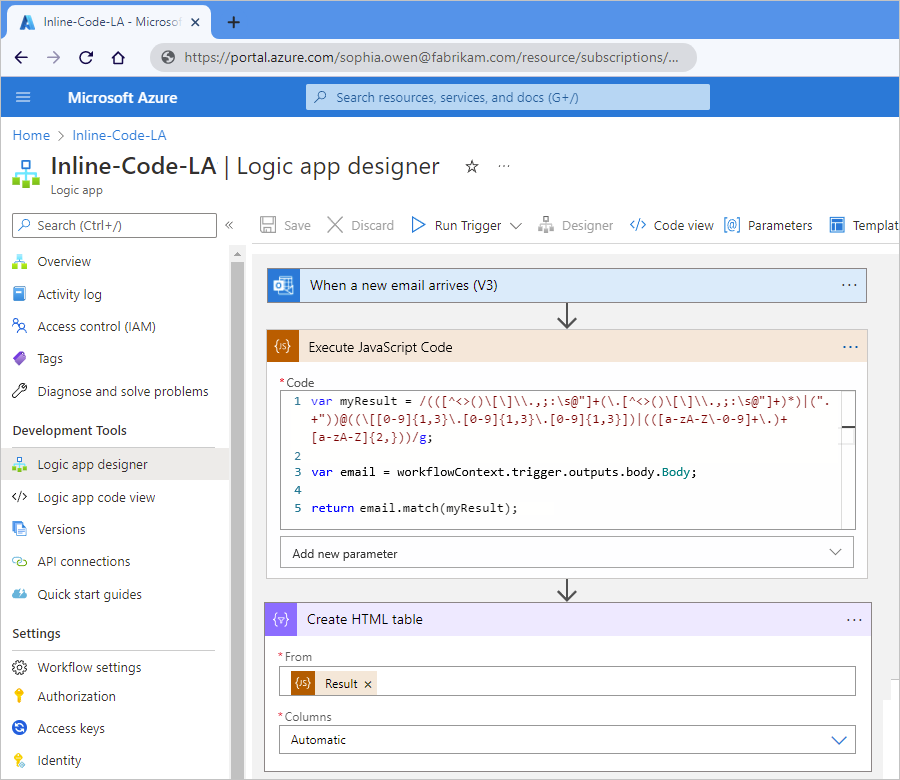

### [Standard](#tab/standard)

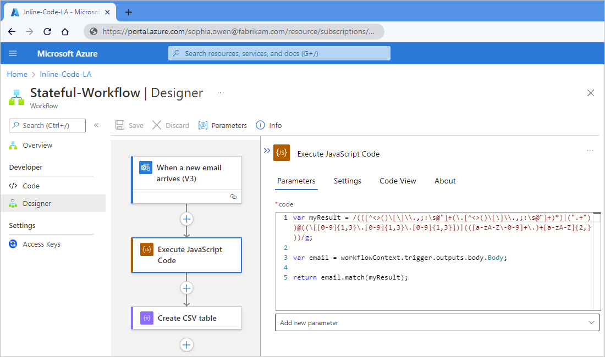

---

## Prerequisites

* An Azure account and subscription. If you don't have a subscription, [sign up for a free Azure account](https://azure.microsoft.com/free/?WT.mc_id=A261C142F).

* The logic app workflow where you want to add your code snippet. The workflow must already start with a trigger.

  This article's example uses the Office 365 Outlook trigger that's named **When a new email arrives**.

  If you don't have a workflow, see the following documentation:

  * Consumption: [Create example Consumption logic app workflow](quickstart-create-example-consumption-workflow.md)

  * Standard: [Create example Standard logic app workflows](create-single-tenant-workflows-azure-portal.md)

* Based on whether you have a Consumption or Standard logic app workflow, review the following requirements:

  * Consumption workflow

    * [Node.js version 8.11.10](https://nodejs.org/en/download/releases/)

    * [Link to an integration account](logic-apps-enterprise-integration-create-integration-account.md), empty or otherwise, from your logic app resource.

      > [!IMPORTANT]
      >
      > Make sure that you use an integration account that's appropriate for your use case or scenario.
      >
      > For example, [Free-tier](logic-apps-pricing.md#integration-accounts) integration accounts are meant only 
      > for exploratory scenarios and workloads, not production scenarios, are limited in usage and throughput, 
      > and aren't supported by a service-level agreement (SLA).
      >
      > Other integration account tiers incur costs, but include SLA support, offer more throughput, and have higher limits. 
      > Learn more about [integration account tiers](logic-apps-pricing.md#integration-accounts), 
      > [limits](logic-apps-limits-and-config.md#integration-account-limits), and 
      > [pricing](https://azure.microsoft.com/pricing/details/logic-apps/).

  * Standard workflow

    * [Node.js versions 16.x.x](https://nodejs.org/en/download/releases/)

    * No integration account required.

## Add the Execute JavaScript Code action

### [Consumption](#tab/consumption)

1. In the [Azure portal](https://portal.azure.com), open your Consumption logic app workflow in the designer.

1. In the designer, [follow these general steps to add the **Inline Code** action named **Execute JavaScript Code** to your workflow](../logic-apps/create-workflow-with-trigger-or-action.md?tabs=consumption#add-action).

   This example adds the action under the Office 365 Outlook trigger. By default, the action contains some sample code, including a `return` statement.

   

1. In the **Code** box, delete the sample code, and enter your code. Write the code that you'd put inside a method, but without the method signature.

   > [!TIP]
   >
   > When your cursor is in the **Code** box, the dynamic content list appears. Although you'll 
   > use this list later, you can ignore and leave the list open for now. Don't select **Hide**.

   If you start typing a recognized keyword, the autocomplete list appears so that you can select from available keywords, for example:

   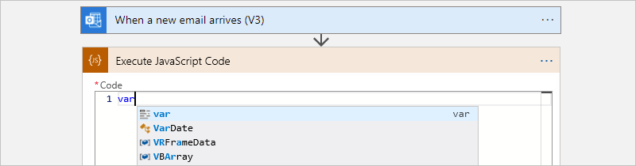

   The following example code snippet first creates a variable named **myResult** that stores a *regular expression*, which specifies a pattern to match in input text. The code then creates a variable named **email** that stores the email message's body content from the trigger outputs.

   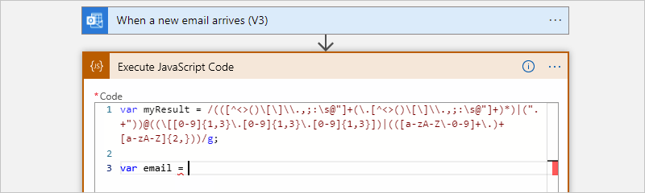

1. With your cursor still in the **Code** box, from the open dynamic content list, find the **When a new email arrives** section, and select the **Body** property, which references the email message's body.

   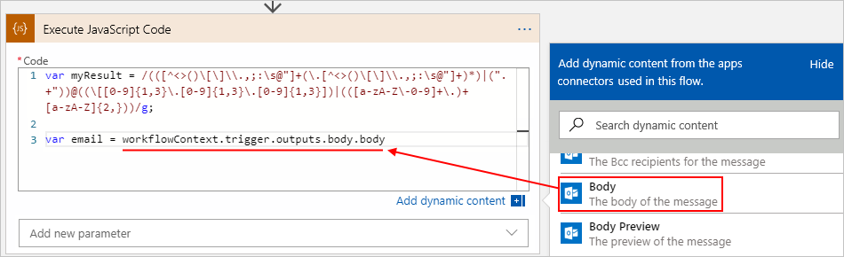

   The dynamic content list shows the outputs from the trigger and any preceding actions when those outputs match the input format for the edit box that's currently in focus. This list makes these outputs easier to use and reference from your workflow. For this example, the list shows the outputs from the Outlook trigger, including the email message's **Body** property.

   After you select the **Body** property, the **Execute JavaScript Code** action resolves the token to a read-only `workflowContext` JSON object, which your snippet can use as input. The `workflowContext` object includes properties that give your code access to the outputs from the trigger and preceding actions in your workflow, such as the trigger's `body` property, which differs from the email message's **Body** property. For more information about the `workflowContext` object, see [Reference trigger and action outputs using the workflowContext object](#workflowcontext) later in this article.

   > [!IMPORTANT]
   >
   > If your code snippet references action names that include the dot (**.**) operator, 
   > those references have to enclose these action names with square brackets (**[]**) 
   > and quotation marks (**""**), for example:
   >
   > `// Correct`</br>
   > `workflowContext.actions["my.action.name"].body`
   >
   > `// Incorrect`</br>
   > `workflowContext.actions.my.action.name.body`
   >
   > Also, in the **Execute JavaScript Code** action, you have to add the [**Actions** parameter](#add-parameters) 
   > and then add these action names to that parameter. For more information, see 
   > [Add dependencies as parameters to an Execute JavaScript Code action](#add-parameters) later in this article.

1. To differentiate the email message's **Body** property that you selected from the trigger's `body` property, rename the second `body` property to `Body` instead. Add the closing semicolon (**;**) at the end to finish the code statement.

   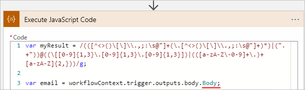

   The **Execute JavaScript Code** action doesn't syntactically require a `return` statement. However, by including the `return` statement, you can more easily reference the action results later in your workflow by using the **Result** token in later actions.

   In this example, the code snippet returns the result by calling the `match()` function, which finds any matches in the email message body to the specified regular expression. The **Create HTML table** action then uses the **Result** token to reference the results from the **Execute JavaScript Code** action and creates a single result.

   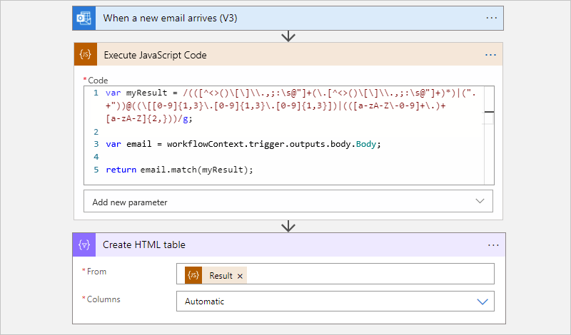

1. When you're done, save your workflow.

### [Standard](#tab/standard)

1. In the [Azure portal](https://portal.azure.com), open your Standard logic app workflow in the designer.

1. In the designer, [follow these general steps to add the **Inline Code** action named **Execute JavaScript Code** to your workflow](../logic-apps/create-workflow-with-trigger-or-action.md?tabs=standard#add-action).

1. In the **Code** box, enter your code. Write the code that you'd put inside a method, but without the method signature.

   If you start typing a recognized keyword, the autocomplete list appears so that you can select from available keywords, for example:

   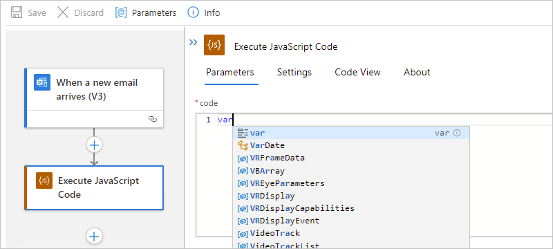

   The following example code snippet first creates a variable named **myResult** that stores a *regular expression*, which specifies a pattern to match in input text. The code then creates a variable named **email** that stores the email message's body content from the trigger outputs.

   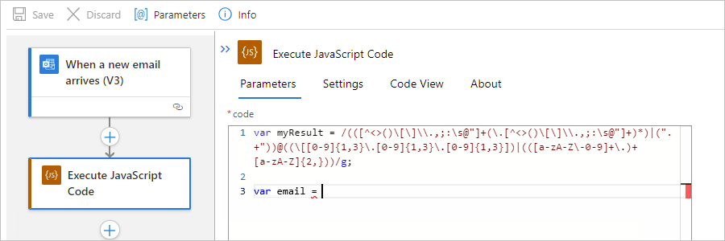

1. With your cursor still in the **Code** box, follow these steps:

   1. In the **Code** box's lower right corner, select **Dynamic content** to open the dynamic content list.

   1. From the opened list, find the **When a new email arrives** section, and select the **Body** token, which references the email's message body.

   

   The dynamic content list shows the outputs from the trigger and any preceding actions where those outputs match the input format for the edit box that's currently in focus. This list makes these outputs easier to use and reference from your workflow. For this example, the list shows the outputs from the Outlook trigger, including the email message's **Body** property.

   After you select the **Body** property, the **Execute JavaScript Code** action resolves the token to a read-only `workflowContext` JSON object, which your snippet can use as input. The `workflowContext` object includes properties that give your code access to the outputs from the trigger and preceding actions in your workflow, such as the trigger's `body` property, which differs from the email message's **Body** property. For more information about the `workflowContext` object, see [Reference trigger and action outputs using the workflowContext object](#workflowcontext) later in this article.

   > [!IMPORTANT]
   >
   > If your code snippet references action names that include the dot (**.**) operator, 
   > those references have to enclose these action names with square brackets (**[]**) 
   > and quotation marks (**""**), for example:
   >
   > `// Correct`</br>
   > `workflowContext.actions["my.action.name"].body`
   >
   > `// Incorrect`</br>
   > `workflowContext.actions.my.action.name.body`
   >
   > Also, in the **Execute JavaScript Code** action, you have to add the **Actions** parameter 
   > and then add these action names to that parameter. For more information, see 
   > [Add dependencies as parameters to an Execute JavaScript Code action](#add-parameters) later in this article.

1. To differentiate the email message's **Body** property that you selected from the trigger's `body` property, rename the second `body` property to `Body` instead. Add the closing semicolon (**;**) at the end to finish the code statement.

   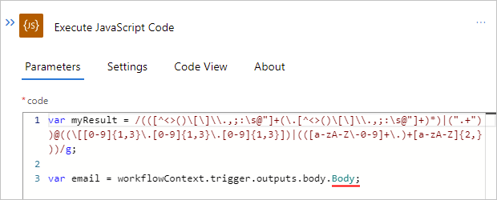

   The **Execute JavaScript Code** doesn't syntactically require a `return` statement. However, by including the `return` statement, you can reference the action results later in your workflow by using the **Outputs** token in later actions.

   In this example, the code snippet returns the result by calling the `match()` function, which finds any matches in the email message body to the specified regular expression.

   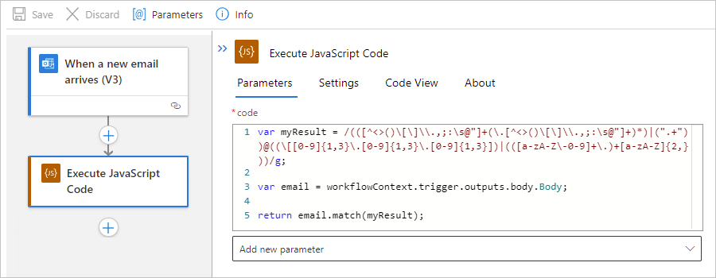

   The **Create HTML table** action then uses the **Outputs** token to reference the results from the **Execute JavaScript Code** action and creates a single result.

   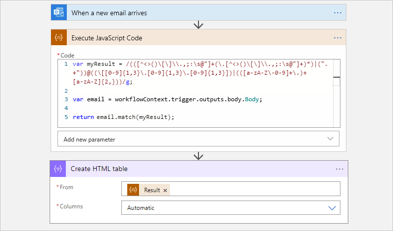

1. When you're done, save your workflow.

---

<a name="workflowcontext"></a>

### Reference trigger and action outputs using the workflowContext object

From inside your code snippet on the designer, you can use the dynamic content list to select a token that references the output from the trigger or any preceding action. When you select the token, the **Execute JavaScript Code** action resolves that token to a read-only `workflowContext` JSON object. This object gives your code access to the outputs from the trigger, any preceding actions, and the workflow. The object uses the following structure and includes the `actions`, `trigger`, and `workflow` properties, which are also objects:

```json
{
   "workflowContext": {
      "actions": {
         "<action-name-1>": @actions('<action-name-1>'),
         "<action-name-2>": @actions('<action-name-2>')
      },
      "trigger": {
         @trigger()
      },
      "workflow": {
         @workflow()
      }
   }
}
```

The following table has more information about these properties:

| Property | Type | Description |
|----------|------|-------------|
| `actions` | Object collection | The result objects from any preceding actions that run before your code snippet runs. Each object has a *key-value* pair where the key is the action name, and the value is equivalent to the result from calling the [actions() function](workflow-definition-language-functions-reference.md#actions) with the `@actions('<action-name>')` expression. <br><br>The action's name uses the same action name that appears in the underlying workflow definition, which replaces spaces (**" "**) in the action name with underscores (**\_**). This object collection provides access to the action's property values from the current workflow instance run. |
| `trigger` | Object | The result object from the trigger where the result is the equivalent to calling the [trigger() function](workflow-definition-language-functions-reference.md#trigger). This object provides access to trigger's property values from the current workflow instance run. |
| `workflow` | Object | The workflow object that is the equivalent to calling the [workflow() function](workflow-definition-language-functions-reference.md#workflow). This object provides access to the property values, such as the workflow name, run ID, and so on, from the current workflow instance run. |
||||

In this article's example, the `workflowContext` JSON object might have the following sample properties and values from the Outlook trigger:

```json
{
   "workflowContext": {
      "trigger": {
         "name": "When_a_new_email_arrives",
         "inputs": {
            "host": {
               "connection": {
                  "name": "/subscriptions/<Azure-subscription-ID>/resourceGroups/<Azure-resource-group-name>/providers/Microsoft.Web/connections/office365"
               }
            },
            "method": "get",
            "path": "/Mail/OnNewEmail",
            "queries": {
               "includeAttachments": "False"
            }
         },
         "outputs": {
            "headers": {
               "Pragma": "no-cache",
               "Content-Type": "application/json; charset=utf-8",
               "Expires": "-1",
               "Content-Length": "962095"
            },
            "body": {
               "Id": "AAMkADY0NGZhNjdhLTRmZTQtNGFhOC1iYjFlLTk0MjZlZjczMWRhNgBGAAAAAABmZwxUQtCGTqSPpjjMQeD",
               "DateTimeReceived": "2019-03-28T19:42:16+00:00",
               "HasAttachment": false,
               "Subject": "Hello World",
               "BodyPreview": "Hello World",
               "Importance": 1,
               "ConversationId": "AAQkADY0NGZhNjdhLTRmZTQtNGFhOC1iYjFlLTk0MjZlZjczMWRhNgAQ",
               "IsRead": false,
               "IsHtml": true,
               "Body": "Hello World",
               "From": "<sender>@<domain>.com",
               "To": "<recipient-2>@<domain>.com;<recipient-2>@<domain>.com",
               "Cc": null,
               "Bcc": null,
               "Attachments": []
            }
         },
         "startTime": "2019-05-03T14:30:45.971564Z",
         "endTime": "2019-05-03T14:30:50.1746874Z",
         "scheduledTime": "2019-05-03T14:30:45.8778117Z",
         "trackingId": "1cd5ffbd-f989-4df5-a96a-6e9ce31d03c5",
         "clientTrackingId": "08586447130394969981639729333CU06",
         "originHistoryName": "08586447130394969981639729333CU06",
         "code": "OK",
         "status": "Succeeded"
      },
      "workflow": {
         "id": "/subscriptions/<Azure-subscription-ID>/resourceGroups/<Azure-resource-group-name>/providers/Microsoft.Logic/workflows/<logic-app-workflow-name>",
         "name": "<logic-app-workflow-name>",
         "type": "Microsoft.Logic/workflows",
         "location": "<Azure-region>",
         "run": {
            "id": "/subscriptions/<Azure-subscription-ID>/resourceGroups/<Azure-resource-group-name>/providers/Microsoft.Logic/workflows/<logic-app-workflow-name>/runs/08586453954668694173655267965CU00",
            "name": "08586453954668694173655267965CU00",
            "type": "Microsoft.Logic/workflows/runs"
         }
      }
   }
}
```

<a name="add-parameters"></a>

## Add dependencies as parameters to an Execute JavaScript Code action

In some scenarios, you might have to explicitly require that the **Execute JavaScript Code** action includes outputs from the trigger or actions that your code references as dependencies. For example, you have to take this extra step when your code references outputs that aren't available at workflow run time. During workflow creation time, the Azure Logic Apps engine analyzes the code snippet to determine whether the code references any trigger or action outputs. If those references exist, the engine includes those outputs automatically. At workflow run time, if the referenced trigger or action output isn't found in the `workflowContext` object, the engine generates an error. To resolve this error, you have to add that trigger or action as an explicit dependency for the **Execute JavaScript Code** action. Another scenario that requires you to take this step is when the `workflowContext` object references a trigger or action name that uses the dot operator (**.**). 

To add a trigger or action as a dependency, you add the **Trigger** or **Actions** parameters as applicable to the **Execute JavaScript Code** action. You then add the trigger or action names as they appear in your workflow's underlying JSON definition.

> [!NOTE]
>
> You can't add **Variables** operations, loops such as **For each** or **Until**, and iteration 
> indexes as explicit dependencies.
>
> If you plan to reuse your code, make sure to always use the code snippet edit box to reference 
> trigger and action outputs. That way, your code includes the resolved token references, rather than 
> just add the trigger or action outputs as explicit dependencies.

For example, suppose the Office 365 Outlook connector's **Send approval email** action precedes the code snippet in the sample workflow. The following example code snippet includes a reference to the **SelectedOption** output from this action.

### [Consumption](#tab/consumption)


### [Standard](#tab/standard)


---

For this example, you have to add only the **Actions** parameter, and then add the action's JSON name, `Send_approval_email`, to the parameter. That way, you specify that the **Execute JavaScript Code** action explicitly includes the output from the **Send approval email** action.

### Find the trigger or action's JSON name

Before you start, you need the JSON name for the trigger or action in the underlying workflow definition.

* Names in your workflow definition use an underscore (_), not a space.

* If an action name uses the dot operator (.), include that operator, for example:

  `My.Action.Name`

### [Consumption](#tab/consumption)

1. On the workflow designer toolbar, select **Code view**. In the `actions` object, find the action's name.

   For example, `Send_approval_email` is the JSON name for the **Send approval email** action.

   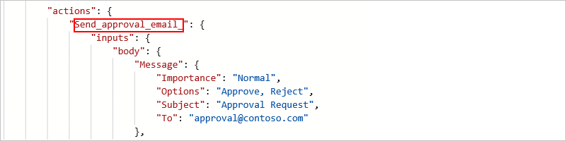

1. To return to designer view, on the code view toolbar, select **Designer**.

1. Now add the JSON name to the **Execute JavaScript Code** action.

### [Standard](#tab/standard)

1. On the workflow menu, select **Code**. In the `actions` object, find the action's name.

   For example, `Send_approval_email` is the JSON name for the **Send approval email** action.

   

1. To return to designer view, on the workflow menu, select **Designer**.

1. Now add the JSON name to the **Execute JavaScript Code** action.

---

### Add the trigger or action name to the Execute JavaScript Code action

1. In the **Execute JavaScript Code** action, open the **Add new parameter** list.

1. From the parameters list, select the following parameters as your scenario requires.

   | Parameter | Description |
   |-----------|-------------|
   | **Actions** | Include outputs from preceding actions as dependencies. When you select this parameter, you're prompted for the actions that you want to add. |
   | **Trigger** | Include outputs from the trigger as dependencies. When you select this parameter, you're prompted whether to include trigger results. So, from the **Trigger** list, select **Yes**. |
   |||

1. For this example, select the **Actions** parameter.

   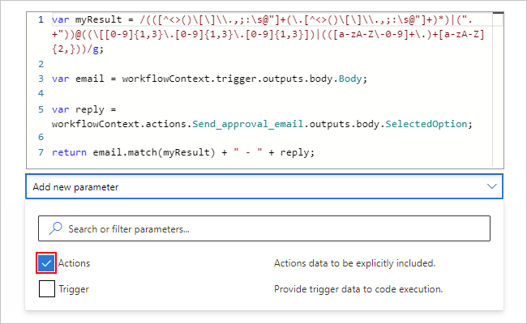

1. In the **Actions Item - 1** box, enter the action's JSON name.

   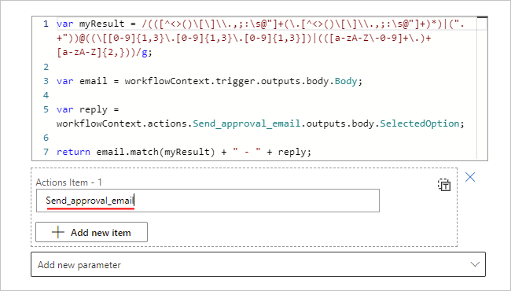

1. To add another action name, select **Add new item**.

1. When you're done, save your workflow.

## Action reference

For more information about the **Execute JavaScript Code** action's structure and syntax in your underlying workflow definition using the Workflow Definition Language, see this action's [reference section](logic-apps-workflow-actions-triggers.md#run-javascript-code).

## Next steps

* [Managed connectors for Azure Logic Apps](/connectors/connector-reference/connector-reference-logicapps-connectors)
* [Built-in connectors for Azure Logic Apps](../connectors/built-in.md)
