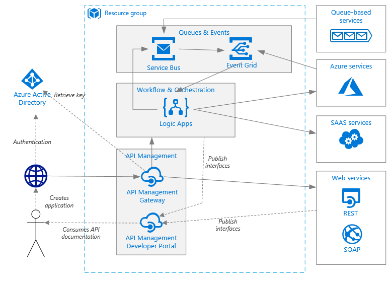

# Enterprise integration architecture with queues and events

This article describes an enterprise integration architecture that 
uses proven practices you can apply to an integration application 
when using Azure Integration Services. You can use this architecture 
as the basis for many different application patterns that require 
HTTP APIs, workflow, and orchestration.

This series describes the reusable component parts that 
might apply to building a generic integration application. 
Because integration technology has many possible applications, 
ranging from simple point-to-point apps to full enterprise 
Azure Service Bus apps, consider which components you 
need to implement for your apps and infrastructure.

## Architecture components

This architecture builds on the architecture described in the article, 
[Architecture reference: Simple enterprise integration](../logic-apps/logic-apps-architectures-simple-enterprise-integration.md). 
That architecture's [recommendations](../logic-apps/logic-apps-architectures-simple-enterprise-integration.md#recommendations) 
also apply here, but for brevity, this article omits those 
recommendations from the [Recommendations](#recommendations) section. 
This enterprise integration architecture includes these components:

- **Resource group**: A [resource group](../azure-resource-manager/resource-group-overview.md) 
is a logical container for Azure resources.

- **Azure API Management**: The [API Management](https://docs.microsoft.com/azure/api-management/) 
service is a fully managed platform for publishing, securing, and transforming HTTP APIs.

- **Azure API Management Developer portal**: Each instance of Azure API Management provides 
access to the [Developer portal](../api-management/api-management-customize-styles.md). 
This portal gives you access to documentation and code samples. 
You can also test APIs in the Developer portal.

- **Azure Logic Apps**: [Logic Apps](../logic-apps/logic-apps-overview.md) 
is a serverless platform for building enterprise workflows and integrations.

- **Connectors**: Logic Apps uses [connectors](../connectors/apis-list.md) 
for connecting to commonly used services. Logic Apps offers hundreds of connectors, 
but you can also create a custom connector.

- **Azure Service Bus**: [Service Bus](../service-bus-messaging/service-bus-messaging-overview.md) 
provides secure and reliable messaging. You can use messaging for decoupling applications 
and integrating with other message-based systems.

- **Azure Event Grid**: [Event Grid](../event-grid/overview.md) 
is a serverless platform for publishing and delivering application events.

- **IP address**: The Azure API Management service has a fixed public 
[IP address](../virtual-network/virtual-network-ip-addresses-overview-arm.md) and a domain name. 
The default domain name is a subdomain of azure-api.net, for example, contoso.azure-api.net, 
but you can also configure [custom domains](../api-management/configure-custom-domain.md). 
Logic Apps and Service Bus also have a public IP address. However, for security, this architecture 
restricts access for calling Logic Apps endpoints to only the IP address of API Management. 
Calls to Service Bus are secured by a shared access signature (SAS).

- **Azure DNS**: [Azure DNS](https://docs.microsoft.com/azure/dns/) 
is a hosting service for DNS domains. Azure DNS provides name resolution 
by using the Microsoft Azure infrastructure. By hosting your domains in Azure, 
you can manage your DNS records by using the same credentials, APIs, tools, 
and billing that you use for your other Azure services. To use a custom 
domain name, such as contoso.com, create DNS records that map the custom 
domain name to the IP address. For more information, see 
[Configure a custom domain name in API Management](../api-management/configure-custom-domain.md).

- **Azure Active Directory (Azure AD)**: You can use 
[Azure AD](https://docs.microsoft.com/azure/active-directory/) 
or another identity provider for authentication. Azure AD provides 
authentication for accessing API endpoints by passing a 
[JSON Web Token for API Management](../api-management/policies/authorize-request-based-on-jwt-claims.md) 
to validate. For Standard and Premium tiers, Azure AD can secure access to the API Management Developer portal.

## Patterns 

This architecture uses some patterns that are fundamental to operation:

* Existing back-end HTTP APIs are published 
through the API Management Developer portal. 
In the portal, developers, who are either 
internal to your organization, external, or both,  
can integrate calls to these APIs into applications.

* Composite APIs are built by using logic apps, 
which orchestrate calls to software as a service (SaaS) systems, 
Azure services, and any APIs that are published to API Management. 
Logic apps are also [published through the API Management Developer portal](../api-management/import-logic-app-as-api.md).

* Applications use Azure AD for 
[acquiring an OAuth 2.0 security token](../api-management/api-management-howto-protect-backend-with-aad.md) 
that's required to gain access to an API.

* Azure API Management [validates the security token](../api-management/api-management-howto-protect-backend-with-aad.md) 
and then passes the request to the back-end API or logic app.

* Azure Service Bus queues are used for [decoupling](../service-bus-messaging/service-bus-messaging-overview.md) 
application activity and for [smoothing spikes in load](https://docs.microsoft.com/azure/architecture/patterns/queue-based-load-leveling). 
Messages are added to queues by logic apps, third-party apps, 
or (not shown) by publishing the queue as an HTTP API through API Management.

* When messages are added to a Service Bus queue, an event fires. 
The event triggers a logic app, which then processes the message.

* Other Azure services, such as Azure Blob Storage and Azure Event Hubs, 
also publish events to Event Grid. These services trigger logic apps 
to receive the event and then perform subsequent actions.

## Recommendations

Your specific requirements might differ from the generic 
architecture that's described by this article. 
Use the recommendations in this section as a starting point.

### Service Bus tier

Use the Service Bus Premium tier, which supports Event Grid notifications. 
For more information, see [Service Bus pricing](https://azure.microsoft.com/pricing/details/service-bus/).

### Event Grid pricing

Event Grid uses a serverless model. Billing is calculated 
based on the number of operations (event executions). 
For more information, see [Event Grid pricing](https://azure.microsoft.com/pricing/details/event-grid/). 
Currently, there are no tier considerations for Event Grid.

### Use PeekLock to consume Service Bus messages

When you create a logic app to consume Service Bus messages, have your logic app use 
[PeekLock](../service-bus-messaging/service-bus-messaging-overview.md#queues) 
for accessing a group of messages. When you use PeekLock, the logic app can perform steps 
to validate each message before completing or abandoning the message. 
This approach protects against accidental message loss.

### Check for multiple objects when an Event Grid trigger fires

When an Event Grid trigger fires, this action simply 
means that "at least one of these things happened." 
For example, when Event Grid triggers a logic app 
on a message that appears in a Service Bus queue, 
the logic app should always assume that there might 
be one or more messages available to process.

### Region

To minimize network latency, choose the same region for 
API Management, Logic Apps, and Service Bus. In general, 
choose the region that's closest to your users.

The resource group also has a region. This region specifies where to 
store deployment metadata and where to execute the deployment template. 
To improve availability during deployment, put the resource group and 
resources in the same region.

## Scalability

To achieve higher scalability, the Service Bus Premium 
tier can scale out the number of messaging units. 
Premium tier configurations can have one, two, or four messaging units. 
For more information about scaling Service Bus, see 
[Best practices for performance improvements by using Service Bus Messaging](../service-bus-messaging/service-bus-performance-improvements.md).

## Availability

* For Basic, Standard, and Premium tiers, the service level 
agreement (SLA) for Azure API Management is currently 99.9%. 
For premium tier configurations with a deployment that has 
least one unit in two or more regions, the SLA is 99.95%.

* The SLA for Azure Logic Apps is currently 99.9%.

### Disaster recovery

To enable failover if a serious outage occurs, 
consider implementing geo-disaster recovery in Service Bus Premium. 
For more information, see [Azure Service Bus geo-disaster recovery](../service-bus-messaging/service-bus-geo-dr.md).

## Manageability

Create separate resource groups for production, development, 
and test environments. Separate resource groups make it easier 
to manage deployments, delete test deployments, and assign access rights.

When you assign resources to resource groups, 
consider these factors:

* **Lifecycle**: In general, put resources that have the same lifecycle in the same resource group.

* **Access**: To apply access policies to the resources in a group, 
you can use [role-based access control (RBAC)](../role-based-access-control/overview.md).

* **Billing**: You can view rollup costs for the resource group.

* **Pricing tier for API Management**: Use the Developer tier for your 
development and test environments. To minimize costs during preproduction, 
deploy a replica of your production environment, run your tests, and then shut down.

For more information, see [Azure Resource Manager overview](../azure-resource-manager/resource-group-overview.md).

## Deployment

* To deploy API Management, Logic Apps, Event Grid, and Service Bus, 
use the [Azure Resource Manager templates](../azure-resource-manager/resource-group-authoring-templates.md). 
Templates make automating deployments easier by using PowerShell or the Azure CLI.

* Put API Management, any individual logic apps, Event Grid topics, 
and Service Bus namespaces in their own separate Resource Manager templates. 
By using separate templates, you can store the resources in source control systems. 
You can then deploy these templates together or individually as part of a 
continuous integration/continuous deployment (CI/CD) process.

## Diagnostics and monitoring

Like API Management and Logic Apps, you can monitor Service Bus by using Azure Monitor, 
which is enabled by default. Azure Monitor provides information based on the metrics 
that are configured for each service. 

## Security

To secure Service Bus, use shared access signature (SAS). 
For example, you can grant a user access to Service Bus 
resources with specific rights by using [SAS authentication](../service-bus-messaging/service-bus-sas.md). 
For more information, see [Service Bus authentication and authorization](../service-bus-messaging/service-bus-authentication-and-authorization.md).

If you need to expose a Service Bus queue as an HTTP endpoint, 
for example, to post new messages, use API Management to secure 
the queue by fronting the endpoint. You can then secure the 
endpoint with certificates or OAuth authentication as appropriate. 
The easiest way you can secure an endpoint is using a logic app 
with an HTTP request/response trigger as an intermediary.

The Event Grid service secures event delivery through a validation code. 
If you use Logic Apps to consume the event, validation is automatically performed. 
For more information, see [Event Grid security and authentication](../event-grid/security-authentication.md).

## Next steps

* Learn about [simple enterprise integration](logic-apps-architectures-simple-enterprise-integration.md)
