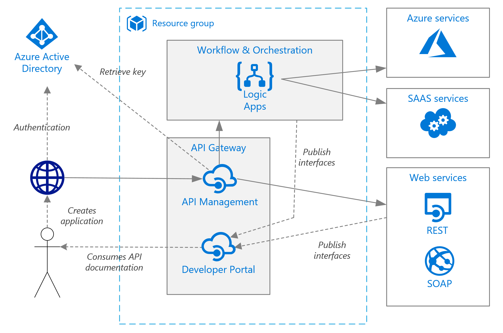

# Reference architecture: Simple enterprise integration

The following reference architecture shows a set of proven practices that you can apply to an integration application that uses Azure Integration Services. The architecture can serve as the basis for many different application patterns that require HTTP APIs, workflow, and orchestration.

*There are many possible applications for integration technology. They range from a simple point-to-point application to a full enterprise Azure Service Bus application. The architecture series describes the reusable component parts that might apply to building a generic integration application. Architects should consider which components they need to implement for their application and infrastructure.*

## Architecture

The architecture has the following components:

- **Resource group**. A [resource group](https://docs.microsoft.com/azure/azure-resource-manager/resource-group-overview) is a logical container for Azure resources.
- **Azure API Management**. [API Management](https://docs.microsoft.com/azure/api-management/) is a fully managed platform that's used to publish, secure, and transform HTTP APIs.
- **Azure API Management Developer portal**. Each instance of Azure API Management comes with access to the [Developer portal](https://docs.microsoft.com/azure/api-management/api-management-customize-styles). The API Management Developer portal gives you access to documentation and code samples. You can test APIs in the Developer portal.
- **Azure Logic Apps**. [Logic Apps](https://docs.microsoft.com/azure/logic-apps/logic-apps-overview) is a serverless platform that's used to build enterprise workflow and integration.
- **Connectors**. Logic Apps uses [connectors](https://docs.microsoft.com/azure/connectors/apis-list) to connect to commonly used services. Logic Apps already has hundreds of different connectors, but you can also create a custom connector.
- **IP address**. The Azure API Management service has a fixed public [IP address](https://docs.microsoft.com/azure/virtual-network/virtual-network-ip-addresses-overview-arm) and a domain name. The domain name is a subdomain of azure-api.net, such as contoso.azure-api.net. Logic Apps and Service Bus also have a public IP address. However, in this architecture, we restrict access for calling Logic Apps endpoints to only the IP address of API Management (for security). Calls to Service Bus are secured by a shared access signature (SAS).
- **Azure DNS**. [Azure DNS](https://docs.microsoft.com/azure/dns/) is a hosting service for DNS domains. Azure DNS provides name resolution by using the Microsoft Azure infrastructure. By hosting your domains in Azure, you can manage your DNS records by using the same credentials, APIs, tools, and billing that you use for your other Azure services. To use a custom domain name like contoso.com, create DNS records that map the custom domain name to the IP address. For more information, see [Configure a custom domain name in API Management](https://docs.microsoft.com/en-us/azure/api-management/configure-custom-domain).
- **Azure Active Directory (Azure AD)**. Use [Azure AD](https://docs.microsoft.com/azure/active-directory/) or another identity provider for authentication. Azure AD provides authentication for accessing API endpoints by passing a [JSON Web Token for API Management](https://docs.microsoft.com/azure/api-management/policies/authorize-request-based-on-jwt-claims) to validate. Azure AD can secure access to the API Management Developer portal (Standard and Premium tiers only).

The architecture has some patterns that are fundamental to its operation:

- Composite APIs are built by using logic apps. They orchestrate calls to software as a service (SaaS) systems, to Azure services, and to any APIs that are published to API Management. [Logic apps are also published](https://docs.microsoft.com/azure/api-management/import-logic-app-as-api) through the API Management Developer portal.
- Applications use Azure AD to [acquire an OAuth 2.0 security token](https://docs.microsoft.com/azure/api-management/api-management-howto-protect-backend-with-aad) that's required to gain access to an API.
- Azure API Management [validates the security token](https://docs.microsoft.com/azure/api-management/api-management-howto-protect-backend-with-aad) and then passes the request to the back-end API or logic app.

## Recommendations

Your specific requirements might differ from the generic architecture described in this article. Use the recommendations in this section as a starting point.

### Azure API Management tier

Use the API Management Basic, Standard, or Premium tiers. The tiers offer a production service level agreement (SLA) and support scale-out within the Azure region (the number of units varies by tier). The Premium tier also supports scale-out across multiple Azure regions. Base the tier you choose on the level of throughput required and your feature set. For more information, see [API Management pricing](https://azure.microsoft.com/pricing/details/api-management/).

You are charged for all API Management instances when they are running. If you have scaled up and don’t need that level of performance all the time, consider taking advantage of the API Management hourly billing and scale down.

### Logic Apps pricing

Logic Apps uses a [serverless](logic-apps-serverless-overview.md) model. Billing is calculated based on action and connector execution. For more information, see [Logic Apps pricing](https://azure.microsoft.com/pricing/details/logic-apps/). Currently, there are no tier considerations for Logic Apps.

### Logic Apps for asynchronous API calls

Logic Apps works best in scenarios that don’t require low latency. For example, it works best for asynchronous or semi long-running API calls. If low latency is required (for example, a call that blocks a user interface), we recommend implementing that API or operation by using a different technology. For example, use Azure Functions or a Web API that you deploy by using Azure App Service. We still recommend that you front the API to API consumers by using API Management.

### Region

Provision API Management and Logic Apps in the same region to minimize network latency. Generally, choose the region that's closest to your users.

The resource group also has a region. The region specifies where deployment metadata is stored and where the deployment template executes from. Put the resource group and its resources in the same region to improve availability during deployment.

## Scalability

API Management administrators should add [caching policies](../api-management/api-management-howto-cache.md) where appropriate to increase the scalability of the service. Caching also helps reduce the load on back-end services.

Azure API Management Basic, Standard, and Premium tiers can be scaled out in an Azure region to offer greater capacity. Administrators can use the **Capacity Metric** option in the **Metrics** menu to analyze the usage of their service and then scale up or scale down as appropriate.

Recommendations for scaling an API Management service:

- Scaling needs to take account of traffic patterns. Customers with more volatile traffic patterns have greater need for increased capacity.
- Consistent capacity above 66% might indicate a need to scale up.
- Consistent capacity below 20% might indicate an opportunity to scale down.
- It's always recommended to load-test your API Management service with a representative load before enabling the load in production.

Premium tier services can be scaled out across multiple Azure regions. Customers who deploy by scaling services across multiple Azure regions gain a higher SLA (99.95% versus 99.9%) and can provision services near users in multiple regions.

The Logic Apps serverless model means administrators don't need to plan for service scalability. The service automatically scales to meet demand.

## Availability

Currently, the SLA for Azure API Management is 99.9% for Basic, Standard, and Premium tiers. Premium tier configurations with deployment of at least one unit in two or more regions have an SLA of 99.95%.

Currently, the SLA for Azure Logic Apps is 99.9%.

### Backups

Your Azure API Management configuration should be [backed up regularly](../api-management/api-management-howto-disaster-recovery-backup-restore.md) (based on regularity of change). Backup files should be stored in a location or Azure region that is different from where the service resides. Customers can then choose one of two options for their disaster recovery strategy:

- In a disaster recovery event, a new API Management instance is provisioned, the backup is restored to the new instance, and DNS records are repointed.
- Customers keep a passive copy of their service in another Azure region (incurring additional cost). Backups are regularly restored to the copy. In a disaster recovery event, only DNS records need be repointed to restore the service.

Because logic apps can be re-created quickly and are serverless, they are backed up by saving a copy of the associated Azure Resource Manager template. Templates can be saved to source control, and they can be integrated with a customer's continuous integration/continuous deployment (CI/CD) process.

If a logic app that was published through API Management moves to a different datacenter, update the app's location. To update the app's location, use a basic PowerShell script to update the **Backend** property of the API.

## Manageability

Create separate resource groups for production, development, and test environments. Using separate resource groups makes it easier to manage deployments, delete test deployments, and assign access rights.

When you assign resources to resource groups, consider the following factors:

- **Lifecycle**. In general, put resources that have the same lifecycle in the same resource group.
- **Access**. You can use [role-based access control](../role-based-access-control/overview.md) (RBAC) to apply access policies to the resources in a group.
- **Billing**. You can view rollup costs for the resource group.
- **Pricing tier for API Management**. We recommend using the Developer tier for development and test environments. For preproduction, we recommend deploying a replica of your production environment, running tests, and then shutting down to minimize cost.

For more information, see [Azure Resource Manager overview](../azure-resource-manager/resource-group-overview.md).

### Deployment

We recommend that you use [Azure Resource Manager templates](../azure-resource-manager/resource-group-authoring-templates.md) to deploy API Management and Logic Apps. Templates make it easier to automate deployments via PowerShell or the Azure CLI.

We recommend putting Azure API Management and any individual logic apps in their own, separate Resource Manager templates. When you use separate templates, you can store the resources in source control systems. You can also deploy the resources together or individually as part of a CI/CD deployment process.

### Versions

Each time you make a configuration change to a logic app (or deploy an update through a Resource Manager template), a copy of that version is kept for your convenience (all versions that have a run history are kept). You can use these versions to track historical changes and to promote a version to be the current configuration of the logic app. For example, you can effectively roll back a logic app.

API Management has two distinct (but complimentary) [versioning concepts](https://blogs.msdn.microsoft.com/apimanagement/2018/01/11/versions-revisions-general-availibility/):

- Versions that are used to provide your API consumers with a choice of the API they can consume based on their needs (for example, v1, v2 or beta, production).
- Revisions that allow API administrators to safely make changes to an API and then deploy the changes to users with optional commentary.

In the context of deployment, it's a good idea to consider API Management revisions as a way to make changes safely, keep a change history, and make API consumers aware of those changes. A revision can be created in a development environment and be deployed between other environments by using Resource Manager templates.

Although you can use revisions to test an API before you make it "current" and accessible to users, we don't recommend using this mechanism for load or integration testing. Instead, use separate test or preproduction environments.

### Configuration

Never check in passwords, access keys, or connection strings to source control. If these values are required, use the appropriate technique to deploy and secure these values. 

In Logic Apps, any sensitive values needed in the logic app (that can't be created in the form of a connection) should be stored in Azure Key Vault and referred to from a Resource Manager template. We also suggest using deployment template parameters and parameter files for each environment. For more information, see [Securing parameters and inputs within a workflow](logic-apps-securing-a-logic-app.md#secure-parameters-and-inputs-within-a-workflow).

In API Management, secrets are managed by using objects called *named values* or *properties*. The objects securely store values that can be accessed in API Management policies. For more information, see [Manage secrets in API Management](../api-management/api-management-howto-properties.md).

### Diagnostics and monitoring

[API Management](../api-management/api-management-howto-use-azure-monitor.md) and [Logic Apps](logic-apps-monitor-your-logic-apps.md) both support operational monitoring through [Azure Monitor](../monitoring-and-diagnostics/monitoring-overview-azure-monitor.md). Azure Monitor provides information based on the metrics that are configured for each service. Azure Monitor is enabled by default.

These options are also available for each service:

- Logic Apps logs can be sent to [Azure Log Analytics](logic-apps-monitor-your-logic-apps-oms.md) for deeper analysis and dashboarding.
- API Management supports configuring Azure Application Insights for DevOps monitoring.
- API Management supports the [Power BI solution template for custom API analytics](http://aka.ms/apimpbi). Customers can use the solution template to create their own custom analytics solution. Reports are available in Power BI for business users.

## Security

This section lists security considerations that are specific to the Azure services that are described in this article, and which are deployed in the architecture as described. It's not a complete list of security best practices.

- Use role-based access control (RBAC) to ensure appropriate levels of access for users.
- Secure public API endpoints in API Management by using OAuth/OpenID Connect. To secure public API endpoints, configure an identity provider and add a JSON Web Token (JWT) validation policy.
- Connect to back-end services from API Management by using mutual certificates.
- Secure HTTP trigger-based logic apps by creating an IP address whitelist that points to the API Management IP address. A whitelisted IP address prevents calling the logic app from the public internet without first going through API Management.

## Next steps

- Learn about [enterprise integration with queues and events](logic-apps-architectures-enterprise-integration-with-queues-events.md).
