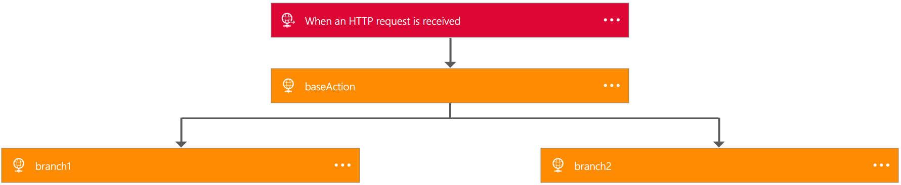
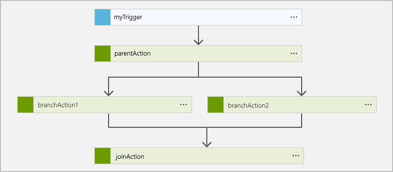

# Create workflow definitions for logic apps using JSON

You can create workflow definitions for [Azure Logic Apps](logic-apps-what-are-logic-apps.md) 
with simple, declarative JSON language. If you haven't already, first review 
[how to create your first logic app with Logic App Designer](logic-apps-create-a-logic-app.md). 
Also, see the [full reference for the Workflow Definition Language](http://aka.ms/logicappsdocs).

## Repeat steps over a list

To iterate through an array that has up to 10,000 items and perform an action for each item, 
use the [foreach type](logic-apps-loops-and-scopes.md).

## Handle failures if something goes wrong

Usually, you want to include a *remediation step* — some logic that executes 
*if and only if* one or more of your calls fail. This example gets data 
from various places, but if the call fails, we want to POST a message 
somewhere so we can track down that failure later:  

```
{
  "$schema": "https://schema.management.azure.com/providers/Microsoft.Logic/schemas/2016-06-01/workflowdefinition.json#",
  "contentVersion": "1.0.0.0",
  "parameters": {},
  "triggers": {
    "Request": {
      "type": "request",
      "kind": "http"
    }
  },
  "actions": {
    "readData": {
      "type": "Http",
      "inputs": {
        "method": "GET",
        "uri": "http://myurl"
      }
    },
    "postToErrorMessageQueue": {
      "type": "ApiConnection",
      "inputs": "...",
      "runAfter": {
        "readData": [
          "Failed"
        ]
      }
    }
  },
  "outputs": {}
}
```

To specify that `postToErrorMessageQueue` only runs after `readData` has `Failed`,
use the `runAfter` property, for example, to specify a list of possible values, 
so that `runAfter` could be `["Succeeded", "Failed"]`.

Finally, because this example now handles the error, 
we no longer mark the run as `Failed`. 
Because we added the step for handling this failure in this example, 
the run has `Succeeded` although one step `Failed`.

## Execute two or more steps in parallel

To run multiple actions in parallel, the `runAfter` property must be equivalent at runtime. 

```
{
  "$schema": "https://schema.management.azure.com/providers/Microsoft.Logic/schemas/2016-06-01/workflowdefinition.json#",
  "contentVersion": "1.0.0.0",
  "parameters": {},
  "triggers": {
    "Request": {
      "kind": "http",
      "type": "Request"
    }
  },
  "actions": {
    "readData": {
      "type": "Http",
      "inputs": {
        "method": "GET",
        "uri": "http://myurl"
      }
    },
    "branch1": {
      "type": "Http",
      "inputs": {
        "method": "GET",
        "uri": "http://myurl"
      },
      "runAfter": {
        "readData": [
          "Succeeded"
        ]
      }
    },
    "branch2": {
      "type": "Http",
      "inputs": {
        "method": "GET",
        "uri": "http://myurl"
      },
      "runAfter": {
        "readData": [
          "Succeeded"
        ]
      }
    }
  },
  "outputs": {}
}
```

In this example, both `branch1` and `branch2` are set to run after `readData`. 
As a result, both branches run in parallel. The timestamp for both branches is identical.



## Join two parallel branches

You can join two actions that are set to run in parallel 
by adding items to the `runAfter` property as in the previous example.

```
{
  "$schema": "https://schema.management.azure.com/providers/Microsoft.Logic/schemas/2016-04-01-preview/workflowdefinition.json#",
  "actions": {
    "readData": {
      "type": "Http",
      "inputs": {
        "method": "GET",
        "uri": "http://myurl"
      },
      "runAfter": {}
    },
    "branch1": {
      "type": "Http",
      "inputs": {
        "method": "GET",
        "uri": "http://myurl"
      },
      "runAfter": {
        "readData": [
          "Succeeded"
        ]
      }
    },
    "branch2": {
      "type": "Http",
      "inputs": {
        "method": "GET",
        "uri": "http://myurl"
      },
      "runAfter": {
        "readData": [
          "Succeeded"
        ]
      }
    },
    "join": {
      "type": "Http",
      "inputs": {
        "method": "GET",
        "uri": "http://myurl"
      },
      "runAfter": {
        "branch1": [
          "Succeeded"
        ],
        "branch2": [
          "Succeeded"
        ]
      }
    }
  },
  "parameters": {},
  "triggers": {
    "Request": {
      "type": "Request",
      "kind": "Http",
      "inputs": {
        "schema": {}
      }
    }
  },
  "contentVersion": "1.0.0.0",
  "outputs": {}
}
```



## Map list items to a different configuration

Next, let's say that we want to get different content based on the value of a property. 
We can create a map of values to destinations as a parameter:  

```
{
  "$schema": "https://schema.management.azure.com/providers/Microsoft.Logic/schemas/2016-06-01/workflowdefinition.json#",
  "contentVersion": "1.0.0.0",
  "parameters": {
    "specialCategories": {
      "defaultValue": [
        "science",
        "google",
        "microsoft",
        "robots",
        "NSA"
      ],
      "type": "Array"
    },
    "destinationMap": {
      "defaultValue": {
        "science": "http://www.nasa.gov",
        "microsoft": "https://www.microsoft.com/en-us/default.aspx",
        "google": "https://www.google.com",
        "robots": "https://en.wikipedia.org/wiki/Robot",
        "NSA": "https://www.nsa.gov/"
      },
      "type": "Object"
    }
  },
  "triggers": {
    "Request": {
      "type": "Request",
      "kind": "http"
    }
  },
  "actions": {
    "getArticles": {
      "type": "Http",
      "inputs": {
        "method": "GET",
        "uri": "https://ajax.googleapis.com/ajax/services/feed/load?v=1.0&q=http://feeds.wired.com/wired/index"
      }
    },
    "forEachArticle": {
      "type": "foreach",
      "foreach": "@body('getArticles').responseData.feed.entries",
      "actions": {
        "ifGreater": {
          "type": "if",
          "expression": "@greater(length(intersection(item().categories, parameters('specialCategories'))), 0)",
          "actions": {
            "getSpecialPage": {
              "type": "Http",
              "inputs": {
                "method": "GET",
                "uri": "@parameters('destinationMap')[first(intersection(item().categories, parameters('specialCategories')))]"
              }
            }
          }
        }
      },
      "runAfter": {
        "getArticles": [
          "Succeeded"
        ]
      }
    }
  }
}
```

In this case, we first get a list of articles. 
Based on the category that was defined as a parameter, 
the second step uses a map to look up the URL for getting the content.

Some times to note here: 

*	The [`intersection()`](https://msdn.microsoft.com/library/azure/mt643789.aspx#intersection) function 
checks whether the category matches one of the known defined categories.

*	After we get the category, we can pull the item from the map using square brackets: `parameters[...]`

## Process strings

You can use various functions to manipulate strings. 
For example, suppose we have a string that we want to pass to a system, 
but we aren't confident about proper handling for character encoding. 
One option is to base64 encode this string. However, 
to avoid escaping in a URL, we are going to replace a few characters. 

We also want a substring of the order's name because 
the first five characters are not used.

```
{
  "$schema": "https://schema.management.azure.com/providers/Microsoft.Logic/schemas/2016-06-01/workflowdefinition.json#",
  "contentVersion": "1.0.0.0",
  "parameters": {
    "order": {
      "defaultValue": {
        "quantity": 10,
        "id": "myorder1",
        "orderer": "NAME=Contoso"
      },
      "type": "Object"
    }
  },
  "triggers": {
    "request": {
      "type": "request",
      "kind": "http"
    }
  },
  "actions": {
    "order": {
      "type": "Http",
      "inputs": {
        "method": "GET",
        "uri": "http://www.example.com/?id=@{replace(replace(base64(substring(parameters('order').orderer,5,sub(length(parameters('order').orderer), 5) )),'+','-') ,'/' ,'_' )}"
      }
    }
  },
  "outputs": {}
}
```

Working from inside to outside:

1. Get the [`length()`](https://msdn.microsoft.com/library/azure/mt643789.aspx#length) 
for the orderer's name, so we get back the total number of characters.

2. Subtract 5 because we want a shorter string.

3. Actually, take the [`substring()`](https://msdn.microsoft.com/library/azure/mt643789.aspx#substring). 
We start at index `5` and go the remainder of the string.

4. Convert this substring to a [`base64()`](https://msdn.microsoft.com/library/azure/mt643789.aspx#base64) string.

5. [`replace()`](https://msdn.microsoft.com/library/azure/mt643789.aspx#replace) all the `+` characters with `-` characters.

6. [`replace()`](https://msdn.microsoft.com/library/azure/mt643789.aspx#replace) all the `/` characters with `_` characters.

## Work with Date Times

Date Times can be useful, particularly when you are trying to pull 
data from a data source that doesn't naturally support *triggers*. 
You can also use Date Times for finding how long various steps are taking.

```
{
  "$schema": "https://schema.management.azure.com/providers/Microsoft.Logic/schemas/2016-06-01/workflowdefinition.json#",
  "contentVersion": "1.0.0.0",
  "parameters": {
    "order": {
      "defaultValue": {
        "quantity": 10,
        "id": "myorder1"
      },
      "type": "Object"
    }
  },
  "triggers": {
    "Request": {
      "type": "request",
      "kind": "http"
    }
  },
  "actions": {
    "order": {
      "type": "Http",
      "inputs": {
        "method": "GET",
        "uri": "http://www.example.com/?id=@{parameters('order').id}"
      }
    },
    "ifTimingWarning": {
      "type": "If",
      "expression": "@less(actions('order').startTime,addseconds(utcNow(),-1))",
      "actions": {
        "timingWarning": {
          "type": "Http",
          "inputs": {
            "method": "GET",
            "uri": "http://www.example.com/?recordLongOrderTime=@{parameters('order').id}&currentTime=@{utcNow('r')}"
          }
        }
      },
      "runAfter": {
        "order": [
          "Succeeded"
        ]
      }
    }
  },
  "outputs": {}
}
```

In this example, we extract the `startTime` from the previous step. 
Then we get the current time, and subtract one second:

[`addseconds(..., -1)`](https://msdn.microsoft.com/library/azure/mt643789.aspx#addseconds) 

You can use other units of time, like `minutes` or `hours`. 
Finally, we can compare these two values. 
If the first value is less than the second value, 
then more than one second has passed since the order was first placed.

To format dates, we can use string formatters. For example, 
to get the RFC1123, we use [`utcnow('r')`](https://msdn.microsoft.com/library/azure/mt643789.aspx#utcnow). 
To learn about date formatting, see [Workflow Definition Language](https://msdn.microsoft.com/library/azure/mt643789.aspx#utcnow).

## Deployment parameters for different environments

Commonly, deployment lifecycles have a development environment, a staging environment, 
and a production environment. For example, you might use the same definition in all these environments
but use different databases. Likewise, you might want to use the same definition across different 
regions for high availability but want each logic app instance to talk to that region's database.
This scenario differs from taking parameters at *runtime* 
where instead, you should use the `trigger()` function as in the previous example.

You can start with a basic definition like this example:

```
{
    "$schema": "https://schema.management.azure.com/providers/Microsoft.Logic/schemas/2016-06-01/workflowdefinition.json#",
    "contentVersion": "1.0.0.0",
    "parameters": {
        "uri": {
            "type": "string"
        }
    },
    "triggers": {
        "request": {
          "type": "request",
          "kind": "http"
        }
    },
    "actions": {
        "readData": {
            "type": "Http",
            "inputs": {
                "method": "GET",
                "uri": "@parameters('uri')"
            }
        }
    },
    "outputs": {}
}
```

In the actual `PUT` request for the logic apps, you can provide the parameter `uri`. 
Because a default value no longer exists, the logic app payload requires this parameter:

```
{
    "properties": {},
        "definition": {
          // Use the definition from above here
        },
        "parameters": {
            "connection": {
                "value": "https://my.connection.that.is.per.enviornment"
            }
        }
    },
    "location": "westus"
}
``` 

In each environment, you can provide a different value for the `connection` parameter. 

For all the options that you have for creating and managing logic apps, 
see the [REST API documentation](https://msdn.microsoft.com/library/azure/mt643787.aspx). 
