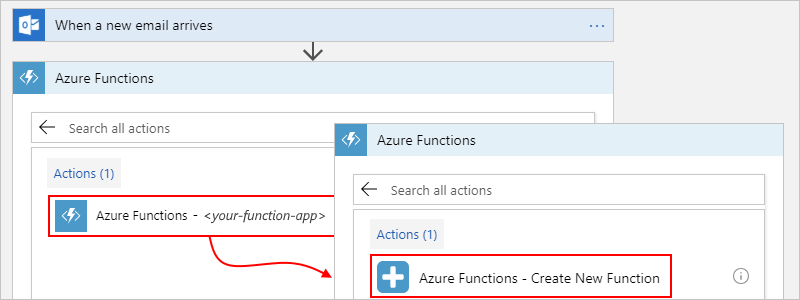

---
# required metadata
title: Add and run your own custom code in Azure Logic Apps with Azure Functions | Microsoft Docs
description: Learn how you can add and run your own custom code snippets in Azure Logic Apps with Azure Functions
services: logic-apps
ms.service: logic-apps
author: jeffhollan
ms.author: jehollan
manager: jeconnoc
ms.date: 10/18/2016

# optional metatada
ms.reviewer: klam, LADocs
ms.suite: integration
ms.custom: H1Hack27Feb2017
---

# Add and run your own custom code snippets in Azure Logic Apps with Azure Functions

When you want to create and run just enough code 
that addresses a specific problem in your logic apps, 
you can create your own functions by using 
[Azure Functions](../azure-functions/functions-overview.md). 
This service provides the capability for creating and running 
custom code snippets written with Node.js or C# in your logic 
apps without worrying about creating an entire app or the 
infrastructure for running your code. Azure Functions provides 
serverless computing in the cloud and is useful for 
performing tasks such as these examples:

* Extend your logic app's behavior with functions supported by Node.js or C#.
* Perform calculations in your logic app workflow.
* Apply advanced formatting or compute fields in your logic apps.

You can also [call logic apps from inside an Azure function](#call-logic-app).

If you don't have an Azure subscription yet, 
<a href="https://azure.microsoft.com/free/" target="_blank">sign up for a free Azure account</a>. 

## Prerequisites

To follow this article, here are the items you need:

* The logic app where you want to add the function

  If you're new to logic apps, review 
  [What is Azure Logic Apps](../logic-apps/logic-apps-overview.md) 
  and [Quickstart: Create your first logic app](../logic-apps/quickstart-create-first-logic-app-workflow.md).

* A [trigger](../logic-apps/logic-apps-overview.md#logic-app-concepts) 
as the first step in your logic app 

  Before you can add actions for running functions, 
  your logic app must start with a trigger.

* An Azure function app, which is a container for Azure functions, 
and your Azure function. Your function app must belong to the same 
Azure subscription as your logic app. 

  If you don't have a function app, you must 
  [create your function app first](../azure-functions/functions-create-first-azure-function.md). 
  You can then create your function either 
  [separately outside your logic app](#create-function-external), 
  or [from inside your logic app](#create-function-designer) 
  in the Logic App Designer. 

<a name="create-function-external"></a>

## Create functions separately

In the <a href="https://portal.azure.com" target="_blank">Azure portal</a>, 
create your Azure function app, and then create your Azure function. 
If you're new to Azure Functions, see 
[Create your first function in the Azure portal](../azure-functions/functions-create-first-azure-function.md), 
but note these requirements for creating Azure functions 
that you can add and call from logic apps.

* Make sure you select either template: 

  * **Generic webhook - JavaScript** 
  * **Generic webhook - C#**

  These templates can accept content that has 
  `application/json` type from your logic app. 
  Also, these templates help the Logic App Designer 
  find and show the functions you create from these 
  templates when you go to add them to your logic apps.

  

* After you create your function, check these properties. 

  1. In the **Function Apps** list under your function's name, 
  select **Integrate**. 

  2. Check that your template has the **Mode** property 
  set to **Webhook** and the **Webhook type** property 
  set to **Generic JSON**. 

     

  Webhook functions accept HTTP requests and pass those 
  requests into your function as a `data` variable. 
  For example, suppose you have this basic JavaScript 
  function that converts a DateTime value into a date string:

  ```javascript
  function start(req, res){
     var data = req.body;
     res = {
        body: data.date.ToDateString();
     }
  }
  ```

  To access the payload's properties, you can use dot notation, 
  for example: 

  `data.function-name` 

When you're ready, follow the steps for 
[Add functions to logic apps](#add-function-logic-app).

<a name="create-function-designer"></a>

## Create functions from inside logic apps

Before you create an Azure function starting from 
inside your logic app in the Logic App Designer, 
you must have an existing function app, 
which works as a container for your functions. 
If you don't have a function app, 
create that function app first by using the 
<a href="https://functions.azure.com/" target="_blank">Azure Functions portal</a>. 

1. In the <a href="https://portal.azure.com" target="_blank">Azure portal</a>, 
open your logic app in the Logic App Designer. 

2. Under the step where you want to create and add the function, 
choose **New step** > **Add an action**. 

3. In the search box, enter "azure functions" as your filter.
From the actions list, select this action: 
**Azure Functions - Choose an Azure function** 

   

4. Select your function app, and then select this action: 
**Azure Functions - Create New Function**

   

5. Now define your function. 

   1. In the **Function name** box, provide a name for your function. 

   2. In the **Code** box, enter your function's code, 
   including the response and payload you want returned 
   to your logic app after your function finishes running. 
   
   3. When you're done, choose **Create**. 

      

6. Now provide any other relevant information. 

   For example, to generate a template based on the data that the function processes, 
   in the **Request Body** box, specify the context object that you want passed into 
   your function as the input payload. This object is the message your logic app sends 
   to the function and must be formatted as a JavaScript Object Notation (JSON) object. 
   The Logic App Designer generates a function template that you can then create inline. 
   Also, variables are created based on the context object you pass into the function.

   Here is a sample that passes in the body content from the 
   previous email action as the context payload:

   

   In this example, the context object isn't cast as a string, 
   so the content gets directly added to the JSON payload. 
   If the object isn't a JSON token, that is, 
   a string, a JSON object, or a JSON array, you get an error. 
   To cast the object as a string, add double-quotation marks, 
   for example:

   

<a name="add-function-logic-app"></a>

## Add existing functions to logic apps

For existing Azure functions that you want to call from your logic apps, 
you can add them like any other action in the Logic App Designer.

1. In the <a href="https://portal.azure.com" target="_blank">Azure portal</a>, 
open your logic app in the Logic App Designer. 

2. Under the step where you want to add the function, 
choose **New step** > **Add an action**. 

3. In the search box, enter "azure functions" as your filter.
From the actions list, select this action: 
**Azure Functions - Choose an Azure function** 

   

4. From the function apps list, select your function app. 
Then, from the functions list, select your function: 

   


5. After you select the function, you are asked to specify an input payload object. 
For example, if you want to pass in the **Last Modified** date from a Salesforce trigger, 
the function payload might look like this example:

![Last modified date][1]

<a name="call-logic-app"></a>

## Call logic apps from functions

To trigger a logic app from inside an Azure function, 
that logic app must have a callable endpoint, 
or more specifically, a **Request** trigger. 
Then, from inside your function, send an HTTP POST 
request to the URL for that **Request** trigger and 
include the payload you want that logic app to process. 
For more information, see [Logic apps as callable endpoints](../logic-apps/logic-apps-http-endpoint.md). 

<!--Image references-->
[1]: ./media/logic-apps-azure-functions/callfunction.png
[2]: ./media/logic-apps-azure-functions/createfunction.png
