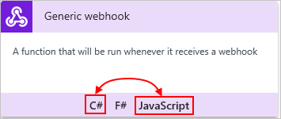
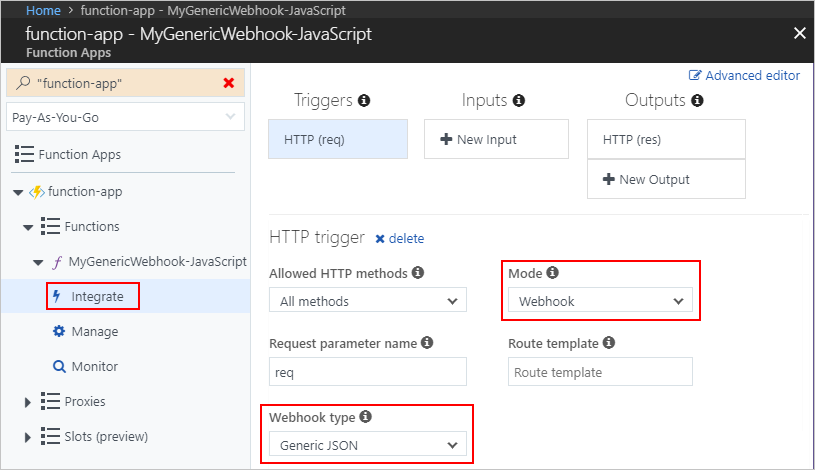

# Add and run custom code snippets in Azure Logic Apps with Azure Functions

When you want to create and run only enough code 
that addresses a specific problem in your logic apps, 
you can create your own functions by using 
[Azure Functions](../azure-functions/functions-overview.md). 
This service provides the capability for creating and running 
custom code snippets written with Node.js or C# in your logic 
apps without worrying about creating an entire app or the 
infrastructure for running your code. Azure Functions 
provides serverless computing in the cloud and is useful 
for performing tasks, such as these examples:

* Extend your logic app's behavior with functions supported by Node.js or C#.
* Perform calculations in your logic app workflow.
* Apply advanced formatting or compute fields in your logic apps.

You can also [call logic apps from inside Azure functions](#call-logic-app).

## Prerequisites

To follow this article, here are the items you need:

* If you don't have an Azure subscription yet, 
<a href="https://azure.microsoft.com/free/" target="_blank">sign up for a free Azure account</a>. 

* The logic app where you want to add the function

  If you're new to logic apps, review 
  [What is Azure Logic Apps](../logic-apps/logic-apps-overview.md) 
  and [Quickstart: Create your first logic app](../logic-apps/quickstart-create-first-logic-app-workflow.md).

* A [trigger](../logic-apps/logic-apps-overview.md#logic-app-concepts) 
as the first step in your logic app 

  Before you can add actions for running functions, 
  your logic app must start with a trigger.

* An Azure function app, which is a container for Azure functions, 
and your Azure function. If you don't have a function app, you must 
[create your function app first](../azure-functions/functions-create-first-azure-function.md). 
You can then create your function either 
[separately outside your logic app](#create-function-external), 
or [from inside your logic app](#create-function-designer) 
in the Logic App Designer.

  Both new and existing Azure function apps and functions 
  have the same requirements for working with your logic apps:

  * Your function app must belong to the same Azure subscription as your logic app.

  * Your function must use the **Generic webhook** function template for 
  either **JavaScript** or **C#**. This template can accept content that has 
  `application/json` type from your logic app. These templates also help the 
  Logic App Designer find and show the custom functions that you create with 
  these templates when you add those functions to your logic apps.

  * Check that your function template's **Mode** property is set to 
  **Webhook** and the **Webhook type** property is set to **Generic JSON**.

    1. Sign in to the <a href="https://portal.azure.com" target="_blank">Azure portal</a>.
    2. On the main Azure menu, select **Function Apps**. 
    3. In the **Function Apps** list, select your function app, 
    expand your function, and select **Integrate**. 
    4. Check your template's **Mode** property 
    is set to **Webhook** and that the **Webhook type** 
    property is set to **Generic JSON**. 

  * If your function has an 
  [API definition](../azure-functions/functions-openapi-definition.md), 
  formerly known as a [Swagger file](http://swagger.io/), the Logic Apps Designer 
  offers a richer experience for work with function parameters. 
  Before your logic app can find and access functions that have Swagger descriptions, 
  [set up your function app by following these steps](#function-swagger).

<a name="create-function-external"></a>

## Create functions outside logic apps

In the <a href="https://portal.azure.com" target="_blank">Azure portal</a>, 
create your Azure function app, which must have the same Azure subscription 
as your logic app, and then create your Azure function. 
If you're new to Azure Functions, learn how to 
[create your first function in the Azure portal](../azure-functions/functions-create-first-azure-function.md), 
but note these requirements for creating Azure functions 
that you can add and call from logic apps.

* Make sure you select the **Generic webhook** 
function template for either **JavaScript** or **C#**.

  

* After you create your Azure function, check that the template's 
**Mode** and **Webhook type** properties are set correctly.

  1. In the **Function Apps** list, expand your function, 
  and select **Integrate**. 

  2. Check that your template's **Mode** property is set to **Webhook** 
  and that the **Webhook type** property is set to **Generic JSON**. 

     

<a name="function-swagger"></a>

* Optionally, if you [generate an API definition](../azure-functions/functions-openapi-definition.md), 
formerly known as a [Swagger file](http://swagger.io/), for your function, 
you can get a richer experience when you work with function parameters 
in the Logic Apps Designer. To set up your function app so your logic 
app can find and access functions that have Swagger descriptions:

  * Make sure your function app is actively running.

  * In your function app, set up [Cross-Origin Resource Sharing (CORS)](https://en.wikipedia.org/wiki/Cross-origin_resource_sharing) so all 
  origins are permitted:

    1. Starting from the **Function Apps** list, 
    select your function app > **Platform features** > **CORS**.

       

    2. Under **CORS**, add the `*` wildcard character, 
    but remove all the other origins in the list, 
    and choose **Save**.

       

### Access property values inside HTTP requests

Webhook functions can accept HTTP requests as inputs and pass those 
requests to other functions. For example, although Logic Apps has 
[functions that convert DateTime values](../logic-apps/workflow-definition-language-functions-reference.md), 
this basic sample JavaScript function shows how you can access a property 
inside a request object that's passed to the function and perform operations 
on that property value. To access properties inside objects, this example uses the 
[dot (.) operator](https://developer.mozilla.org/docs/Web/JavaScript/Reference/Operators/Property_accessors): 

```javascript
function convertToDateString(request, response){
   var data = request.body;
   response = {
      body: data.date.ToDateString();
   }
}
```

Here's what happens inside this function:

1. The function creates a `data` variable and assigns the 
`body` object inside the `request` object to that variable. 
The function uses the dot (.) operator to reference the 
`body` object inside the `request` object: 

   ```javascript
   var data = request.body;
   ```

2. The function can now access the `date` property 
through the `data` variable, and convert that property 
value from DateTime type to DateString type by calling 
the `ToDateString()` function. The function also returns 
the result through the `body` property in the function's response: 

   ```javascript
   body: data.date.ToDateString();
   ```

Now that you've created your Azure function, 
follow the steps for how to 
[add functions to logic apps](#add-function-logic-app).

<a name="create-function-designer"></a>

## Create functions inside logic apps

Before you can create an Azure function starting 
from inside your logic app in the Logic App Designer, 
you must first have an Azure function app, 
which is a container for your functions. 
If you don't have a function app, 
create that function app first. See 
[Create your first function in the Azure portal](../azure-functions/functions-create-first-azure-function.md). 

1. In the <a href="https://portal.azure.com" target="_blank">Azure portal</a>, 
open your logic app in the Logic App Designer. 

2. Under the step where you want to create and add the function, 
choose **New step** > **Add an action**. 

3. In the search box, enter "azure functions" as your filter.
From the actions list, select this action: 
**Choose an Azure function - Azure Functions** 

   

4. From the function apps list, select your function app. 
After the actions list opens, select this action: 
**Azure Functions - Create New Function**

   

5. In the function definition editor, define your function:

   1. In the **Function name** box, 
   provide a name for your function. 

   2. In the **Code** box, add your function 
   code to the template, including the response 
   and payload you want returned to your logic 
   app after your function finishes running. 
   The context object in the template code 
   describes the message and content that your 
   logic app passes to your function, for example:

      

      Inside your function, you can reference the properties 
      in the context object by using this syntax:

      ```text
      context.<token-name>.<property-name>
      ```
      For this example, here is the syntax you'd use:

      ```text
      context.body.content
      ```

   3. When you're done, choose **Create**.

6. In the **Request Body** box, specify the context object 
to pass as your function's input, which must be formatted 
in JavaScript Object Notation (JSON). 
When you click in the **Request Body** box, 
the dynamic content list opens so you can select 
tokens for properties available from previous steps. 

   This example passes the object in the 
   **Body** token from the email trigger:  

   

   Based on the content in the context object, 
   the Logic App Designer generates a function 
   template that you can then edit inline. 
   Logic Apps also creates variables based on 
   the input context object.

   In this example, the context object isn't cast as a string, 
   so the content gets directly added to the JSON payload. 
   However, if the object isn't a JSON token, which must be 
   either a string, a JSON object, or a JSON array, you get an error. 
   To cast the context object as a string, add double-quotation marks, 
   for example:

   

7. To specify other details such as the method to use, 
request headers, or query parameters, choose **Show advanced options**.

<a name="add-function-logic-app"></a>

## Add existing functions to logic apps

To call existing Azure functions from your logic apps, 
you can add Azure functions like any other action 
in the Logic App Designer. 

1. In the <a href="https://portal.azure.com" target="_blank">Azure portal</a>, 
open your logic app in the Logic App Designer. 

2. Under the step where you want to add the function, 
choose **New step** > **Add an action**. 

3. In the search box, enter "azure functions" as your filter.
From the actions list, select this action: 
**Choose an Azure function - Azure Functions** 

   

4. From the function apps list, select your function app. 
After the functions list appears, select your function. 

   

   For functions that have API definitions (Swagger descriptions) 
   and that are [set up so your logic app can find and access those functions](#function-swagger), you can select **Swagger actions**:

   

5. In the **Request Body** box, specify the context object 
to pass as your function's input, which must be formatted 
in JavaScript Object Notation (JSON). This context object 
describes the message and content that your logic app 
sends to your function. 

   When you click in the **Request Body** box, 
   the dynamic content list opens so you can select 
   tokens for properties available from previous steps. 
   This example passes the object in the 
   **Body** token from the email trigger:

   

   In this example, the context object isn't cast as a string, 
   so the content gets directly added to the JSON payload. 
   However, if the object isn't a JSON token, which must be 
   either a string, a JSON object, or a JSON array, you get an error. 
   To cast the context object as a string, add double-quotation marks, 
   for example:

   

6. To specify other details such as the method to use, 
request headers, or query parameters, choose **Show advanced options**.

<a name="call-logic-app"></a>

## Call logic apps from functions

To trigger a logic app from inside an Azure function, 
that logic app must have a callable endpoint, 
or more specifically, a **Request** trigger. 
Then, from inside your function, send an HTTP POST 
request to the URL for that **Request** trigger and 
include the payload you want that logic app to process. 
For more information, see [Call, trigger, or nest logic apps](../logic-apps/logic-apps-http-endpoint.md). 

## Get support

* For questions, visit the [Azure Logic Apps forum](https://social.msdn.microsoft.com/Forums/en-US/home?forum=azurelogicapps).
* To submit or vote on feature ideas, visit the [Logic Apps user feedback site](http://aka.ms/logicapps-wish).

## Next steps

* Learn about [Logic Apps connectors](../connectors/apis-list.md)
