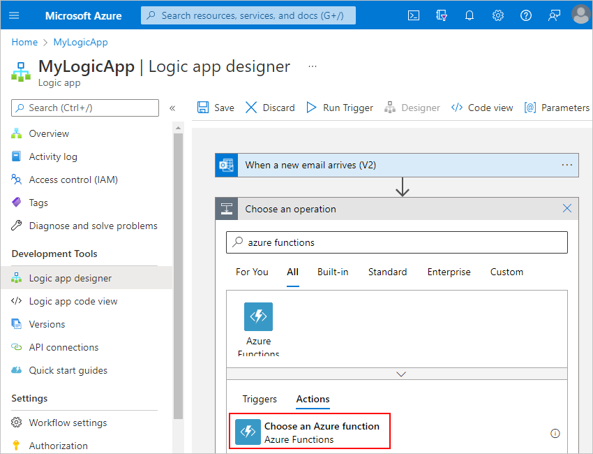
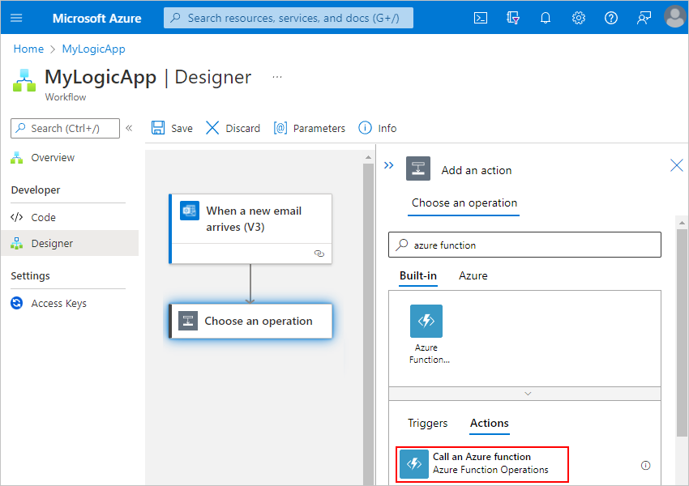
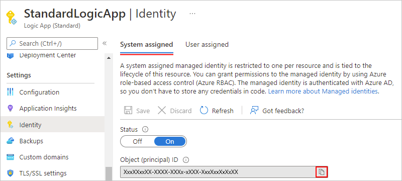
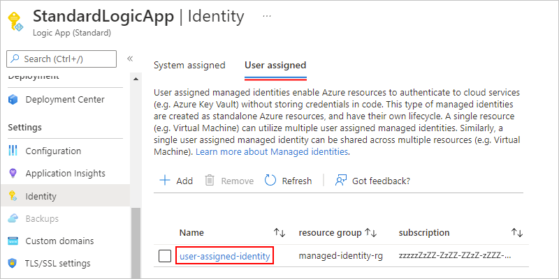

# Create and run code from workflows in Azure Logic Apps using Azure Functions

When you want to run code that performs a specific job in your logic app workflow, you can create a function by using [Azure Functions](../azure-functions/functions-overview.md). This service helps you create Node.js, C#, and F# functions so you don't have to build a complete app or infrastructure to run code. You can also [call logic app workflows from inside an Azure function](#call-logic-app). Azure Functions provides serverless computing in the cloud and is useful for performing certain tasks, for example:

* Extend your logic app's behavior with functions in Node.js or C#.
* Perform calculations in your logic app workflow.
* Apply advanced formatting or compute fields in your logic app workflows.

> [!NOTE]
> Azure Logic Apps doesn't support using Azure Functions with deployment slots enabled. Although this scenario might sometimes work, 
> this behavior is unpredictable and might result in authorization problems when your workflow tries call the Azure function.

You can also run code snippets without using Azure Functions. For more information, review [Add and run inline code](logic-apps-add-run-inline-code.md).

## Prerequisites

* Azure account and subscription. If you don't have a subscription, [sign up for a free Azure account](https://azure.microsoft.com/free/?WT.mc_id=A261C142F).

* An Azure function app resource, which is a container for a function that you can create using Azure Functions, along with the function that you want to use.

  If you don't have a function app, [create your function app first](../azure-functions/functions-get-started.md). You can then create your function either outside your logic app in the Azure portal or [from inside your logic app](#create-function-designer) in the workflow designer.

* When working with logic app resources, the same requirements apply to both function apps and functions, existing or new:

  * Your function app resource and logic app resource must use the same Azure subscription.

  * New function apps must use either the .NET or JavaScript as the runtime stack. When you add a new function to existing function apps, you can select either C# or JavaScript.

  * Your function uses the **HTTP trigger** template.

    The HTTP trigger template can accept content that has `application/json` type from your logic app workflow. When you add a function to your workflow, the designer shows custom functions that are created from this template within your Azure subscription.

  * Your function doesn't use custom routes unless you've defined an [OpenAPI definition](../azure-functions/functions-openapi-definition.md) ([Swagger file](https://swagger.io/)).

  * If you have an OpenAPI definition for your function, the workflow designer gives you a richer experience when your work with function parameters. Before your logic app workflow can find and access functions that have OpenAPI definitions, [set up your function app by following these later steps](#function-swagger).

* Either a [Consumption or Standard](logic-apps-overview.md#resource-type-and-host-environment-differences) logic app resource and workflow where you want to use the function.

  Before you can add an action that runs a function in your workflow, the workflow must start with a trigger as the first step. If you're new to logic app workflows, review [What is Azure Logic Apps](logic-apps-overview.md) and [Quickstart: Create your first logic app workflow](quickstart-create-first-logic-app-workflow.md).

<a name="function-swagger"></a>

## Find functions that have OpenAPI descriptions

For a richer experience when you work with function parameters in the workflow designer, [generate an OpenAPI definition](../azure-functions/functions-openapi-definition.md) or [Swagger file](https://swagger.io/) for your function. To set up your function app so your logic app can find and use functions that have Swagger descriptions, follow these steps:

1. In the [Azure portal](https://portal.azure.com), open your function app. Make sure that the function app is actively running.

1. Set up [Cross-Origin Resource Sharing (CORS)](https://en.wikipedia.org/wiki/Cross-origin_resource_sharing) for your function app so that all origins are permitted by following these steps:

   1. In the function app resource menu, under **API**, select **CORS**.

      

   1. Under **CORS**, add the asterisk (**`*`**) wildcard character, but remove all the other origins in the list, and select **Save**.

      

## Access property values inside HTTP requests

Webhook functions can accept HTTP requests as inputs and pass those requests to other functions. For example, although Azure Logic Apps has [functions that convert DateTime values](workflow-definition-language-functions-reference.md), this basic sample JavaScript function shows how you can access a property inside a request object that's passed to the function and perform operations on that property value. To access properties inside objects, this example uses the [dot (.) operator](https://developer.mozilla.org/docs/Web/JavaScript/Reference/Operators/Property_accessors):

```javascript
function convertToDateString(request, response){
   var data = request.body;
   response = {
      body: data.date.ToDateString();
   }
}
```

Here's what happens inside this function:

1. The function creates a `data` variable and assigns the `body` object inside the `request` object to that variable. The function uses the dot (.) operator to reference the `body` object inside the `request` object:

   ```javascript
   var data = request.body;
   ```

1. The function can now access the `date` property through the `data` variable, and convert that property value from DateTime type to DateString type by calling the `ToDateString()` function. The function also returns the result through the `body` property in the function's response:

   ```javascript
   body: data.date.ToDateString();
   ```

Now that you've created your function in Azure, follow the steps to [add functions to logic apps](#add-function-logic-app).

<a name="create-function-designer"></a>

## Create functions from inside logic app workflows

You can create functions directly from your logic app's workflow by using the built-in Azure Functions action in the workflow designer, but you can use this method only for functions written in JavaScript. For other languages, you can create functions through the Azure Functions experience in the Azure portal. However, before you can create your function in Azure, you must already have a function app resource, which is a container for your functions. If you don't have a function app, create that function app first. For more information, review [Create your first function in the Azure portal](../azure-functions/functions-get-started.md).

> [!NOTE]
> Currently, you can only create a function directly from a Consumption logic app workflow, not a Standard logic app workflow. 
> However, you can create the function in other ways using the [Azure portal](../azure-functions/functions-create-function-app-portal.md), 
> [Visual Studio](../azure-functions/functions-create-your-first-function-visual-studio.md), [Visual Studio Code](../azure-functions/create-first-function-vs-code-csharp.md), 
> [Azure CLI](/cli/azure/functionapp/app), [Azure PowerShell](/powershell/module/az.functions), or [ARM template](/templates/microsoft.web/sites/functions). 
> You can then call that function from your Standard logic app workflow using the Azure Functions operation named **Call an Azure function**.

1. In the [Azure portal](https://portal.azure.com), open your Consumption logic app workflow in the designer.

1. To create and add your function, follow the step that applies to your scenario:

   * Under the last step in your workflow, select **New step**.

   * Between existing steps in your workflow, move your mouse over the arrow, select the plus (+) sign, and then select **Add an action**.

1. In the designer search box, enter `azure functions`. From the actions list, select the action named **Choose an Azure function**, for example:

   

1. From the function apps list, select your function app. After the actions list opens, select the action named **Create New Function**.

   

1. In the function definition editor, define your function:

   1. In the **Function name** box, provide a name for your function.

   1. In the **Code** box, add your code to the function template, including the response and payload that you want returned to your logic app after your function finishes running. When you're done, select **Create**, for example:

   

   In the template's code, the *`context` object* refers to the message that your workflow sends through the **Request Body** property in a later step. To access the `context` object's properties from inside your function, use the following syntax:

   `context.body.<property-name>`

   For example, to reference the `content` property inside the `context` object, use the following syntax:

   `context.body.content`

   The template code also includes an `input` variable, which stores the value from the `data` parameter so your function can perform operations on that value. Inside JavaScript functions, the `data` variable is also a shortcut for `context.body`.

   > [!NOTE]
   > The `body` property here applies to the `context` object and isn't the same as the 
   > **Body** token from an action's output, which you might also pass to your function.

1. In the **Request Body** box, provide your function's input, which must be formatted as a JavaScript Object Notation (JSON) object.

   This input is the *context object* or message that your logic app sends to your function. When you click in the **Request Body** field, the dynamic content list appears so you can select tokens for outputs from previous steps. This example specifies that the context payload contains a property named `content` that has the **From** token's value from the email trigger.

   

   Here, the context object isn't cast as a string, so the object's content gets added directly to the JSON payload. However, when the context object isn't a JSON token that passes a string, a JSON object, or a JSON array, you get an error. So, if this example used the **Received Time** token instead, you can cast the context object as a string by adding double-quotation marks, for example:

   

1. To specify other details such as the method to use, request headers, or query parameters, or authentication, open the **Add new parameter** list, and select the options that you want. For authentication, your options differ based on your selected function. Review [Enable authentication for functions](#enable-authentication-functions).

<a name="add-function-logic-app"></a>

## Add existing functions to logic app workflows

To call existing functions from your logic app workflow, you can add functions like any other action in the workflow designer.

### [Consumption](#tab/consumption)

1. In the [Azure portal](https://portal.azure.com), open your Consumption logic app workflow in the designer.

1. Under the step where you want to add the function, select **New step**.

1. Under **Choose an action**, in the search box, enter `azure functions`. From the actions list, select the action named **Choose an Azure function**, for example:

   

1. From the function apps list, select your function app. After the functions list appears, select your function.

   

   For functions that have API definitions (Swagger descriptions) and are [set up so your logic app can find and access those functions](#function-swagger), you can select **Swagger actions**.

   

1. In the **Request Body** box, provide your function's input, which must be formatted as a JavaScript Object Notation (JSON) object.

   This input is the *context object* or message that your logic app sends to your function. When you click in the **Request Body** field, the dynamic content list appears so that you can select tokens for outputs from previous steps. This example specifies that the context payload contains a property named `content` that has the **From** token's value from the email trigger.

   

   Here, the context object isn't cast as a string, so the object's content gets added directly to the JSON payload. However, when the context object isn't a JSON token that passes a string, a JSON object, or a JSON array, you get an error. So, if this example used the **Received Time** token instead, you can cast the context object as a string by adding double-quotation marks:

   

1. To specify other details such as the method to use, request headers, query parameters, or authentication, open the **Add new parameter** list, and select the options that you want. For authentication, your options differ based on your selected function. Review [Enable authentication in functions](#enable-authentication-functions).

### [Standard](#tab/standard)

1. In the [Azure portal](https://portal.azure.com), open your Standard logic app workflow in the designer.

1. On the designer, either under the last step or between existing steps in your workflow, select the plus (**+**) sign for **Insert a new step**, and then select **Add an action**.

1. Under the **Choose an operation** search box, select **Built-in** if not selected.

1. In the **Choose an operation** search box, enter `azure function`. From the actions list, select the action named **Call an Azure function**, for example:

   

1. For the **Connection name** property, provide a name for your connection to your function app. From the function apps list, select the function app you want. From the functions list, select the function, and then select **Create**, for example:

   

1. For the **Method** property, select the HTTP method required to call the selected function. For the **Request body** property, provide your function's input, which must be formatted as a JavaScript Object Notation (JSON) object.

   This input is the *context object* or message that your logic app workflow sends to your function. When you click inside the **Request body** box, the dynamic content list appears so that you can select tokens for outputs from previous steps. This example specifies that the context payload contains a property named `content` that has the **From** token's value from the email trigger.

   

   Here, the context object isn't cast as a string, so the object's content gets added directly to the JSON payload. However, when the context object isn't a JSON token that passes a string, a JSON object, or a JSON array, you get an error. So, if this example used the **Received Time** token instead, you can cast the context object as a string by adding double-quotation marks:

   

1. To specify other details such as the method to use, request headers, query parameters, or authentication, open the **Add new parameter** list, and select the options that you want. For authentication, your options differ based on your selected function. Review [Enable authentication in functions](#enable-authentication-functions).

---

<a name="call-logic-app"></a>

## Call workflows from functions

When you want to trigger a logic app workflow from inside a function, the workflow must start with a trigger that provides a callable endpoint. For example, you can start the workflow with the **HTTP**, **Request**, **Azure Queues**, or **Event Grid** trigger. Inside your function, send an HTTP POST request to the trigger's URL, and include the payload you want that workflow to process. For more information, review [Call, trigger, or nest logic app workflows](logic-apps-http-endpoint.md).

<a name="enable-authentication-functions"></a>

## Enable authentication for function calls

Your logic app resource can use a [managed identity](../active-directory/managed-identities-azure-resources/overview.md) (formerly known as Managed Service Identity or MSI) for authentication. A managed identity helps you authenticate access to resources protected by Azure Active Directory (Azure AD) without having to sign in and provide credentials or secrets. Azure manages this identity for you and helps secure your credentials because you don't have to provide or rotate secrets. Learn more about [Azure services that support managed identities for Azure AD authentication](../active-directory/managed-identities-azure-resources/services-support-managed-identities.md#azure-services-that-support-azure-ad-authentication).

If you set up your logic app to use the system-assigned identity or a manually created, user-assigned identity, your logic app can use that identity to authenticate access to your function. For more information about authentication support for Azure function calls in logic app workflows, review [Add authentication to outbound calls](logic-apps-securing-a-logic-app.md#add-authentication-outbound).

To set up and use your logic app's managed identity to call your function, follow these steps:

1. Enable the managed identity on your logic app resource, and set up that identity's access to the target resource. For more information, review [Authenticate access to Azure resources by using managed identities in Azure Logic Apps](create-managed-service-identity.md).

1. Enable authentication for your function app and function by following these steps:

   1. [Set up anonymous authentication for your function](#set-authentication-function-app).

   1. [Set up Azure AD authentication for your function app](#set-azure-ad-authentication).

1. [Create an app registration for your function app](#create-app-registration).

1. [Get the application ID (resource ID) from your app registration](#find-application-id) to later use in the **Audience** property in your workflow.

<a name="set-authentication-function-app"></a>

## Set up anonymous authentication for your function

To set up and use your logic app's managed identity to authenticate function calls, you must set your function's authentication level to anonymous. Otherwise, your logic app workflow throws a **BadRequest** error.

1. In the [Azure portal](https://portal.azure.com), find and select your function app.

   The following steps use an example function app named **FabrikamFunctionApp**.

1. On the function app resource menu, under **Development tools**, select **Advanced Tools** > **Go**.

   

1. After the **Kudu Services** page opens, on the Kudu website's title bar, from the **Debug Console** menu, select **CMD**.

   

1. After the next page appears, from the folder list, select **site** > **wwwroot** > *your-function*.

   The following steps use an example function named **FabrikamAzureFunction**.

   

1. Open the **function.json** file for editing.

   

1. In the **bindings** object, check whether the **authLevel** property exists. If the property exists, set the property value to **anonymous**. Otherwise, add that property and set the value.

   

1. When you're done, save your settings, and then continue to the next section.

<a name="set-azure-ad-authentication"></a>

## Set up Azure AD authentication for your function app

Before you start this task, find and save the following values so that you can set up Azure AD authentication on your function app. The following steps show how to find these values.

1. [Find the object (principal) ID for your logic app's managed identity](#find-object-id).

1. [Find the tenant ID for your Azure Active Directory (Azure AD)](#find-tenant-id).

<a name="find-object-id"></a>

### Step 1 - Find the object ID for your logic app's managed identity

If your logic app doesn't have a managed identity set up yet, [enable the managed identity for your logic app](create-managed-service-identity.md). Based on the whether you have a Consumption or Standard logic app resource, follow the respective steps:

#### [Consumption](#tab/consumption)

1. After your logic app has its managed identity enabled, on the logic app menu, under **Settings**, select **Identity**, and then select either **System assigned** or **User assigned**.

   * **System assigned**

     For the system-assigned identity, copy the identity's object ID, for example:

     

   * **User assigned**

     1. For the user-assigned identity, select the identity to find the object ID, for example:

        

     1. On the managed identity's **Overview** pane, you can find the identity's object ID, for example:

        

#### [Standard](#tab/standard)

1. After your logic app has its managed identity enabled, on the logic app menu, under **Settings**, select **Identity**, and then select either **System assigned** or **User assigned**.

   * **System assigned**

     For the system-assigned identity, copy the identity's object ID, for example:

     

   * **User assigned**

     1. For the user-assigned identity, select the identity to find the object ID, for example:

        

     1. On the managed identity's **Overview** pane, you can find the identity's object ID, for example:

        

---

<a name="find-tenant-id"></a>

### Step 2 - Find the tenant ID for your Azure AD

For your Azure Active Directory (Azure AD), find the tenant ID. You can either run the PowerShell command named [**Get-AzureAccount**](/powershell/module/servicemanagement/azure.service/get-azureaccount), or in the Azure portal, follow these steps:

1. In the [Azure portal](https://portal.azure.com), open your Azure AD tenant. These steps use **Fabrikam** as the example tenant.

1. On the Azure AD tenant menu, under **Manage**, select **Properties**.

1. Copy and save your tenant ID for later use, for example:

   

<a name="create-app-registration"></a>

### Step 3 - Create an app registration for your function app

Now you're ready to set up Azure AD authentication for your function app by creating an app registration. For more information, review [Configure your App Service or Azure Functions app to use Azure AD login](../app-service/configure-authentication-provider-aad.md#-enable-azure-active-directory-in-your-app-service-app).

1. In the [Azure portal](https://portal.azure.com), open your function app.

1. On the function app menu, under **Settings**, select **Authentication**, and then select **Add identity provider**.

   

1. On the **Add an identity provider** pane, under **Basics**, from the **Identity provider** list, select **Microsoft**.

   By default, under **App registration**, the option to create a new app registration is selected. You can change the name of the registration or the supported account types.

1. For **App registration type**, select **Provide the details of an existing app registration**, and provide the previously saved information:

   | Property | Required | Value | Description |
   |----------|----------|-------|-------------|
   | **Application (client) ID** | Yes | <*object-ID*> | The object ID for your logic app's managed identity. |
   | **Client secret** | <*client-secret*> | No, but recommended | The secret value that the app uses to prove its identity when requesting a token. The client secret is created and stored as a slot-sticky [app setting](../app-service/configure-common.md#configure-app-settings) named `MICROSOFT_PROVIDER_AUTHENTICATION_SECRET`. If you want to manage the secret in Azure Key Vault, you can update this setting later to use Key Vault references. |
   | **Issuer URL** | No | `https://sts.windows.net/<Azure-AD-tenant-ID>` | The issuer URL appended with your Azure AD tenant ID |
   | **Allowed token audiences** | No | <*application-ID-URI*> | The application ID URI (resource ID) for the function app. In this example, the value is **https://management.azure.com**. Later, you can use the same URI in the **Audience** property when you [set up your function action in your workflow to use the managed identity for authentication](create-managed-service-identity.md#authenticate-access-with-identity). <p><p>**Important**: The application ID URI (resource ID) must exactly match the value that Azure AD expects, including any required trailing slashes. |
   ||||

   At this point, your version looks similar to this example:

   

   If you're setting up your function app with an identity provider for the first time, the App Service authentication settings section also appears. These options determine how your function app responds to unauthenticated requests. The default selection redirects all requests to log in with the new identity provider. You can customize this behavior now or adjust these settings later from the main **Authentication** page by selecting **Edit** next to **Authentication settings**. To learn more about these options, review [Authentication flow - Authentication and authorization in Azure App Service and Azure Functions](../app-service/overview-authentication-authorization.md#authentication-flow).

   Otherwise, you can continue with the next step.

1. To finish creating the app registration, select **Add**.

   When you're done, the **Authentication** page now lists the identity provider and app ID (client ID) for the app registration. You're can now use this app registration for authentication in your function app.

1. Copy the app ID (client ID) for the app registration to later use in your workflow.

1. Return to the designer and follow the [steps to authenticate access with the managed identity](create-managed-service-identity.md#authenticate-access-with-identity) by using the built-in Azure Functions action.

## Next steps

* [Authentication access to Azure resources with managed identities in Azure Logic Apps](create-managed-service-identity.md#authentication-access-with-identity)