# Create and run code from workflows in Azure Logic Apps using Azure Functions

[!INCLUDE [logic-apps-sku-consumption-standard](../../includes/logic-apps-sku-consumption-standard.md)]

When you want to run code that performs a specific job in your logic app workflow, you can create a function by using [Azure Functions](../azure-functions/functions-overview.md). This service helps you create Node.js, C#, and F# functions so you don't have to build a complete app or infrastructure to run code. Azure Functions provides serverless computing in the cloud and is useful for performing certain tasks, for example:

* Extend your logic app's behavior with functions in Node.js or C#.
* Perform calculations in your logic app workflow.
* Apply advanced formatting or compute fields in your logic app workflows.

This how-to guide shows how to call an Azure function from a logic app workflow. To run code snippets without using Azure Functions, review [Add and run inline code](logic-apps-add-run-inline-code.md). To call and trigger a logic app workflow from inside a function, the workflow must start with a trigger that provides a callable endpoint. For example, you can start the workflow with the **HTTP**, **Request**, **Azure Queues**, or **Event Grid** trigger. Inside your function, send an HTTP POST request to the trigger's URL and include the payload you want that workflow to process. For more information, review [Call, trigger, or nest logic app workflows](logic-apps-http-endpoint.md).

## Limitations

* You can create a function directly from inside a Consumption logic app workflow, but not from a Standard logic app workflow. However, you can create functions in other ways. For more information, see [Create functions from inside logic app workflows](#create-function-designer).

* Only Consumption workflows support authenticating Azure function calls using a managed identity with Microsoft Entra authentication. Standard workflows aren't currently supported in the section about [how to enable authentication for function calls](#enable-authentication-functions).

* Azure Logic Apps doesn't support using Azure Functions with deployment slots enabled. Although this scenario might sometimes work, this behavior is unpredictable and might result in authorization problems when your workflow tries call the Azure function.

## Prerequisites

* Azure account and subscription. If you don't have a subscription, [sign up for a free Azure account](https://azure.microsoft.com/free/?WT.mc_id=A261C142F).

* An Azure function app resource, which is a container for a function that you can create using Azure Functions, along with the function that you want to use.

  If you don't have a function app, [create your function app first](../azure-functions/functions-get-started.md). You can then create your function either outside your logic app workflow by using Azure Functions in the Azure portal or [from inside your logic app workflow](#create-function-designer) in the designer.

* When you work with logic app resources, the same requirements apply to both function apps and functions, existing or new:

  * Your function app resource and logic app resource must use the same Azure subscription.

  * New function apps must use either the .NET or JavaScript as the runtime stack. When you add a new function to existing function apps, you can select either C# or JavaScript.

  * Your function uses the **HTTP trigger** template.

    The HTTP trigger template can accept content that has `application/json` type from your logic app workflow. When you add a function to your workflow, the designer shows custom functions that are created from this template within your Azure subscription.

  * Your function doesn't use custom routes unless you've defined an [OpenAPI definition](../azure-functions/functions-openapi-definition.md) ([Swagger file](https://swagger.io/)).

  * If you have an OpenAPI definition for your function, the workflow designer gives you a richer experience when your work with function parameters. Before your logic app workflow can find and access functions that have OpenAPI definitions, [set up your function app by following these later steps](#function-swagger).

* To follow the example in this how-to guide, you'll need a [Consumption logic app resource](logic-apps-overview.md#resource-environment-differences) and workflow that has a trigger as the first step. Although you can use any trigger for your scenario, this example uses the Office 365 Outlook trigger named **When a new email arrives**.

<a name="function-swagger"></a>

## Find functions that have OpenAPI descriptions

For a richer experience when you work with function parameters in the workflow designer, [generate an OpenAPI definition](../azure-functions/functions-openapi-definition.md) or [Swagger file](https://swagger.io/) for your function. To set up your function app so your logic app can find and use functions that have Swagger descriptions, follow these steps:

1. In the [Azure portal](https://portal.azure.com), open your function app. Make sure that the function app is actively running.

1. Set up [Cross-Origin Resource Sharing (CORS)](https://en.wikipedia.org/wiki/Cross-origin_resource_sharing) for your function app so that all origins are permitted by following these steps:

   1. In the function app resource menu, under **API**, select **CORS**.

      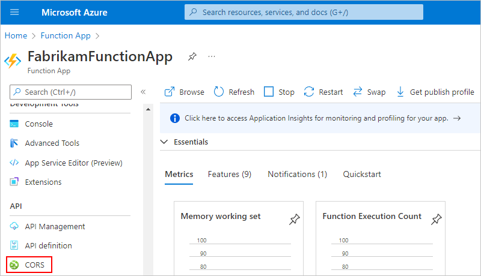

   1. Under **CORS**, add the asterisk (**`*`**) wildcard character, but remove all the other origins in the list, and select **Save**.

      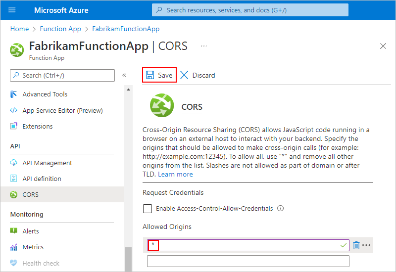

## Access property values inside HTTP requests

Webhook functions can accept HTTP requests as inputs and pass those requests to other functions. For example, although Azure Logic Apps has [functions that convert DateTime values](workflow-definition-language-functions-reference.md), this basic sample JavaScript function shows how you can access a property inside a request object that's passed to the function and perform operations on that property value. To access properties inside objects, this example uses the [dot (.) operator](https://developer.mozilla.org/docs/Web/JavaScript/Reference/Operators/Property_accessors):

```javascript
function convertToDateString(request, response){
   var data = request.body;
   response = {
      body: data.date.ToDateString();
   }
}
```

Here's what happens inside this function:

1. The function creates a `data` variable and assigns the `body` object inside the `request` object to that variable. The function uses the dot (.) operator to reference the `body` object inside the `request` object:

   ```javascript
   var data = request.body;
   ```

1. The function can now access the `date` property through the `data` variable, and convert that property value from DateTime type to DateString type by calling the `ToDateString()` function. The function also returns the result through the `body` property in the function's response:

   ```javascript
   body: data.date.ToDateString();
   ```

Now that you've created your function in Azure, follow the steps to [add functions to logic apps](#add-function-logic-app).

<a name="create-function-designer"></a>

## Create functions from inside logic app workflows (Consumption workflows only)

You can create functions directly from inside your Consumption workflow by using the built-in Azure Functions action in the workflow designer, but you can use this method only for functions written in JavaScript. For other languages, you can create functions through the Azure Functions experience in the Azure portal. However, before you can create your function in Azure, you must already have a function app resource, which is a container for your functions. If you don't have a function app, create that function app first. For more information, review [Create your first function in the Azure portal](../azure-functions/functions-get-started.md).

Standard workflows currently don't support this option for creating a function from within a workflow, but you can create the function in the following ways and then [call that function from your Standard logic app workflow using the Azure Functions operation named **Call an Azure function**](#add-function-logic-app).

  * [Azure portal](../azure-functions/functions-create-function-app-portal.md)
  * [Visual Studio](../azure-functions/functions-create-your-first-function-visual-studio.md)
  * [Visual Studio Code](../azure-functions/create-first-function-vs-code-csharp.md)
  * [Azure CLI](/cli/azure/functionapp/app)
  * [Azure PowerShell](/powershell/module/az.functions)
  * [ARM template](/azure/templates/microsoft.web/sites/functions)

1. In the [Azure portal](https://portal.azure.com), open your Consumption logic app and workflow in the designer.

1. In the designer, [follow these general steps to add the **Azure Functions** action named **Choose an Azure function**](../logic-apps/create-workflow-with-trigger-or-action.md?tabs=consumption#add-action).

1. From the function apps list that appears, select your function app. From the actions list that appears, select the action named **Create New Function**.

   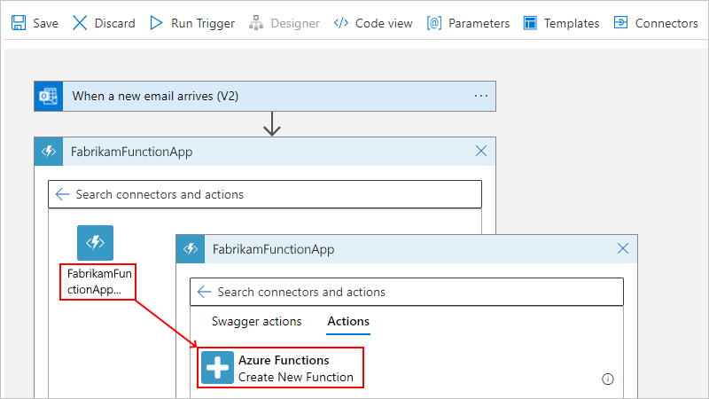

1. In the function definition editor, define your function:

   1. In the **Function name** box, provide a name for your function.

   1. In the **Code** box, add your code to the function template, including the response and payload that you want returned to your logic app after your function finishes running. When you're done, select **Create**, for example:

   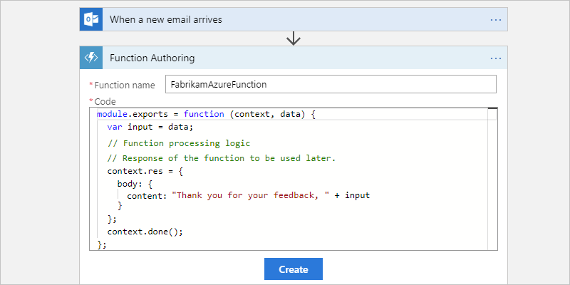

   In the template's code, the *`context` object* refers to the message that your workflow sends through the **Request Body** property in a later step. To access the `context` object's properties from inside your function, use the following syntax:

   `context.body.<property-name>`

   For example, to reference the `content` property inside the `context` object, use the following syntax:

   `context.body.content`

   The template code also includes an `input` variable, which stores the value from the `data` parameter so your function can perform operations on that value. Inside JavaScript functions, the `data` variable is also a shortcut for `context.body`.

   > [!NOTE]
   > The `body` property here applies to the `context` object and isn't the same as the 
   > **Body** token from an action's output, which you might also pass to your function.

1. In the **Request Body** box, provide your function's input, which must be formatted as a JavaScript Object Notation (JSON) object.

   This input is the *context object* or message that your logic app sends to your function. When you click in the **Request Body** field, the dynamic content list appears so you can select tokens for outputs from previous steps. This example specifies that the context payload contains a property named `content` that has the **From** token's value from the email trigger.

   

   Here, the context object isn't cast as a string, so the object's content gets added directly to the JSON payload. However, when the context object isn't a JSON token that passes a string, a JSON object, or a JSON array, you get an error. So, if this example used the **Received Time** token instead, you can cast the context object as a string by adding double-quotation marks, for example:

   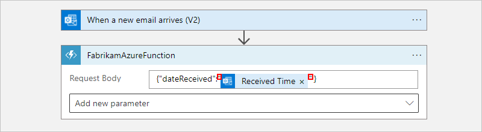

1. To specify other details such as the method to use, request headers, or query parameters, or authentication, open the **Add new parameter** list, and select the options that you want. For authentication, your options differ based on your selected function. For more information, review [Enable authentication for functions](#enable-authentication-functions).

<a name="add-function-logic-app"></a>

## Add existing functions to logic app workflows (Consumption + Standard workflows)

To call existing functions from your logic app workflow, you can add functions like any other action in the designer.

### [Consumption](#tab/consumption)

1. In the [Azure portal](https://portal.azure.com), open your Consumption logic app workflow in the designer.

1. In the designer, [follow these general steps to add the **Azure Functions** action named **Choose an Azure function**](../logic-apps/create-workflow-with-trigger-or-action.md?tabs=consumption#add-action).

1. From the function apps list, select your function app. From the functions list that appears, select your function.

   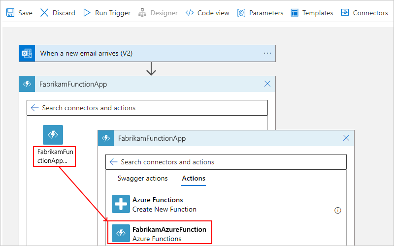

   For functions that have API definitions (Swagger descriptions) and are [set up so your logic app can find and access those functions](#function-swagger), you can select **Swagger actions**.

   

1. In the **Request Body** box, provide your function's input, which must be formatted as a JavaScript Object Notation (JSON) object.

   This input is the *context object* or message that your logic app sends to your function. When you click in the **Request Body** field, the dynamic content list appears so that you can select tokens for outputs from previous steps. This example specifies that the context payload contains a property named `content` that has the **From** token's value from the email trigger.

   

   Here, the context object isn't cast as a string, so the object's content gets added directly to the JSON payload. However, when the context object isn't a JSON token that passes a string, a JSON object, or a JSON array, you get an error. So, if this example used the **Received Time** token instead, you can cast the context object as a string by adding double-quotation marks:

   

1. To specify other details such as the method to use, request headers, query parameters, or authentication, open the **Add new parameter** list, and select the options that you want. For authentication, your options differ based on your selected function. For more information, review [Enable authentication for functions](#enable-authentication-functions).

### [Standard](#tab/standard)

1. In the [Azure portal](https://portal.azure.com), open your Standard logic app workflow in the designer.

1. In the designer, [follow these general steps to add the **Azure Functions** action named **Call an Azure function**](../logic-apps/create-workflow-with-trigger-or-action.md?tabs=standard#add-action).

1. For the **Connection name** property, provide a name for your connection to your function app. From the function apps list, select the function app you want. From the functions list, select the function, and then select **Create**, for example:

   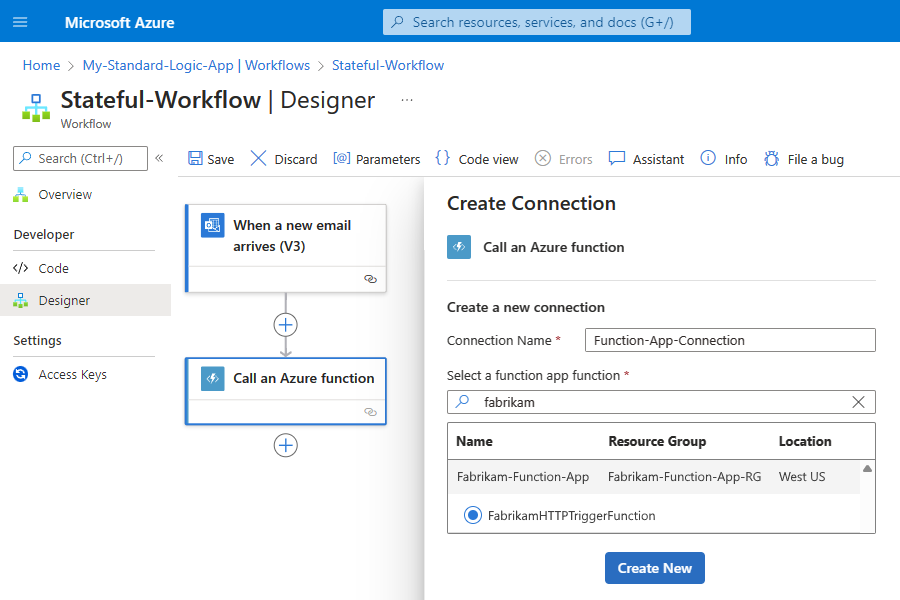

1. For the **Method** property, select the HTTP method required to call the selected function. For the **Request body** property, provide your function's input, which must be formatted as a JavaScript Object Notation (JSON) object.

   This input is the *context object* or message that your logic app workflow sends to your function. When you click inside the **Request body** box, the dynamic content list appears so that you can select tokens for outputs from previous steps. This example specifies that the context payload contains a property named `content` that has the **From** token's value from the email trigger.

   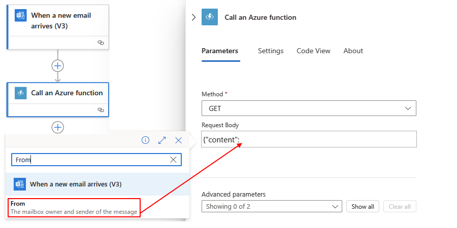

   Here, the context object isn't cast as a string, so the object's content gets added directly to the JSON payload. However, when the context object isn't a JSON token that passes a string, a JSON object, or a JSON array, you get an error. So, if this example used the **Received Time** token instead, you can cast the context object as a string by adding double-quotation marks:

   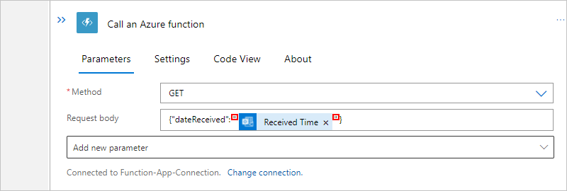

1. To specify other details such as the method to use, request headers, query parameters, or authentication, open the **Add new parameter** list, and select the options that you want. For authentication, your options differ based on your selected function. For more information, review [Enable authentication for functions](#enable-authentication-functions).

---

<a name="enable-authentication-functions"></a>

## Enable authentication for function calls (Consumption workflows only)

Your Consumption workflow can authenticate function calls and access to resources protected by Microsoft Entra ID by using a [managed identity](../active-directory/managed-identities-azure-resources/overview.md) (formerly known as Managed Service Identity or MSI). This managed identity can authenticate access without having to sign in and provide credentials or secrets. Azure manages this identity for you and helps secure your credentials because you don't have to provide or rotate secrets. You can set up the system-assigned identity or a manually created, user-assigned identity at the logic app resource level. The function that's called from your workflow can use the same identity for authentication.

> [!NOTE]
> 
> Currently, only Consumption workflows support authentication for Azure function calls using a managed identity and Microsoft Entra authentication. Standard workflows currently don't include this support when using the Azure Functions connector.

For more information, review the following documentation:

* [Authenticate access with managed identities](create-managed-service-identity.md)
* [Add authentication to outbound calls](logic-apps-securing-a-logic-app.md#add-authentication-outbound)

To set up your function app and function so they can use your Consumption logic app's managed identity, follow these high-level steps:

1. [Enable and set up your logic app's managed identity](create-managed-service-identity.md).

1. [Set up your function for anonymous authentication](#set-authentication-function-app).

1. [Find the required values to set up Microsoft Entra authentication](#find-required-values).

1. [Create an app registration for your function app](#create-app-registration).

<a name="set-authentication-function-app"></a>

### Set up your function for anonymous authentication (Consumption workflows only)

For your function to use your Consumption logic app's managed identity, you must set your function's authentication level to anonymous. Otherwise, your workflow throws a **BadRequest** error.

1. In the [Azure portal](https://portal.azure.com), find and select your function app.

   The following steps use an example function app named **FabrikamFunctionApp**.

1. On the function app resource menu, under **Development tools**, select **Advanced Tools** > **Go**.

   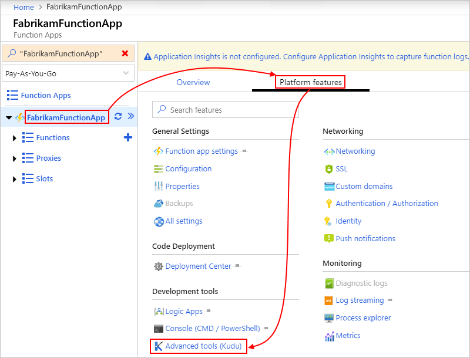

1. After the **Kudu Services** page opens, on the Kudu website's title bar, from the **Debug Console** menu, select **CMD**.

   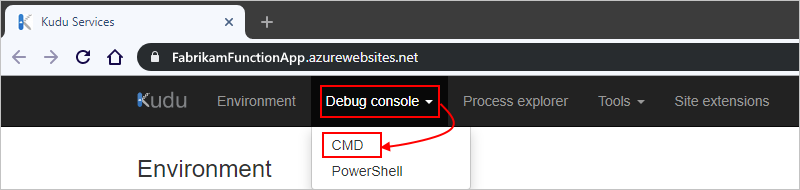

1. After the next page appears, from the folder list, select **site** > **wwwroot** > *your-function*.

   The following steps use an example function named **FabrikamAzureFunction**.

   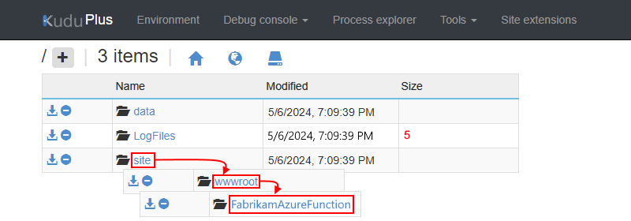

1. Open the **function.json** file for editing.

   

1. In the **bindings** object, check whether the **authLevel** property exists. If the property exists, set the property value to **anonymous**. Otherwise, add that property and set the value.

   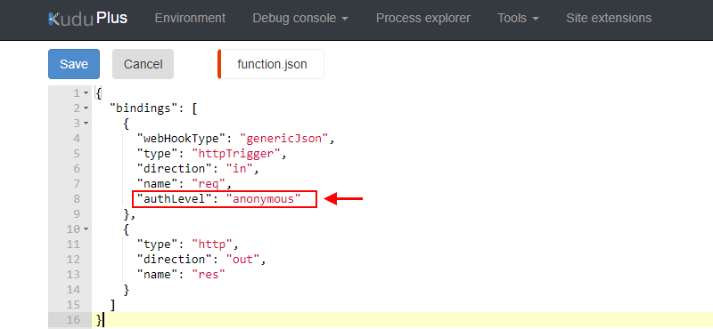

1. When you're done, save your settings. Continue to the next section.

<a name="find-required-values"></a>

<a name='find-the-required-values-to-set-up-azure-ad-authentication-consumption-workflows-only'></a>

### Find the required values to set up Microsoft Entra authentication (Consumption workflows only)

Before you can set up your function app to use Microsoft Entra authentication, you need to find and save the following values by following the steps in this section.

1. [Find the object (principal) ID for your logic app's managed identity](#find-object-id).
1. [Find the tenant ID for your Microsoft Entra ID](#find-tenant-id).

<a name="find-object-id"></a>

#### Find the object ID for your logic app's managed identity

1. After your Consumption logic app has its managed identity enabled, on the logic app menu, under **Settings**, select **Identity**, and then select either **System assigned** or **User assigned**.

   * **System assigned**

     For the system-assigned identity, copy the identity's object ID, for example:

     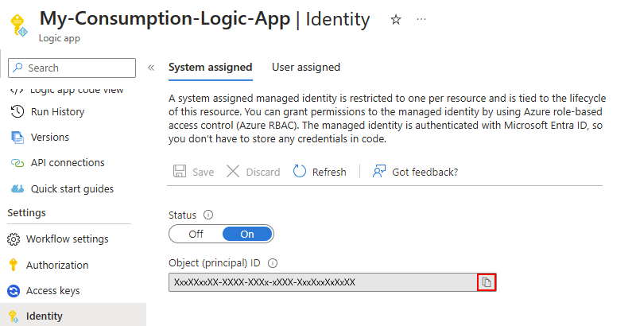

   * **User assigned**

     1. For the user-assigned identity, select the identity to find the object ID, for example:

        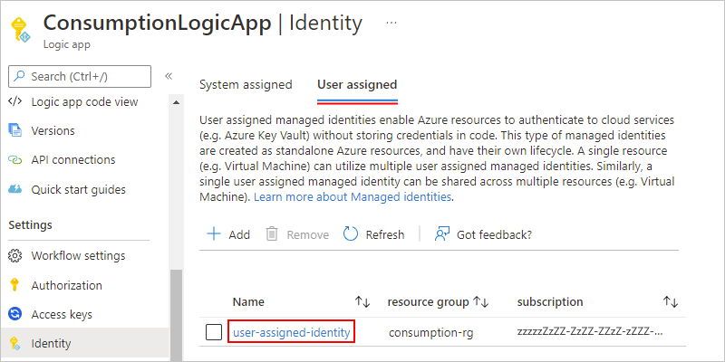

     1. On the managed identity's **Overview** pane, you can find the identity's object ID, for example:

        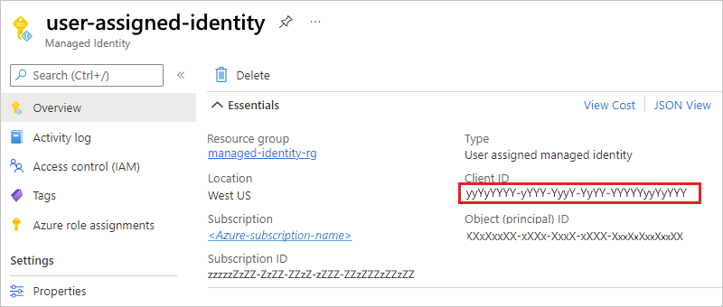

<a name="find-tenant-id"></a>

<a name='find-the-tenant-id-for-your-azure-ad'></a>

#### Find the tenant ID for your Microsoft Entra ID

To find your Microsoft Entra tenant ID, either run the PowerShell command named [**Get-AzureAccount**](/powershell/module/servicemanagement/azure/get-azureaccount), or in the Azure portal, follow these steps:

1. In the [Azure portal](https://portal.azure.com), open your Microsoft Entra tenant. These steps use **Fabrikam** as the example tenant.

1. On the Microsoft Entra tenant menu, under **Manage**, select **Properties**.

1. Copy and save your tenant ID for later use, for example:

   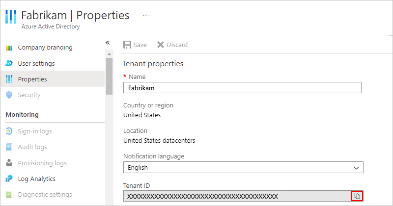

<a name="create-app-registration"></a>

### Create app registration for your function app (Consumption workflows only)

After you find the object ID for your Consumption logic app's managed identity and tenant ID for your Microsoft Entra ID, you can set up your function app to use Microsoft Entra authentication by creating an app registration.

1. In the [Azure portal](https://portal.azure.com), open your function app.

1. On the function app menu, under **Settings**, select **Authentication**, and then select **Add identity provider**.

   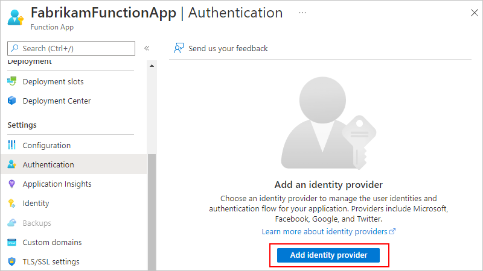

1. On the **Add an identity provider** pane, under **Basics**, from the **Identity provider** list, select **Microsoft**.

1. Under **App registration**, for **App registration type**, select **Provide the details of an existing app registration**, and enter the values that you previously saved.

   | Property | Required | Value | Description |
   |----------|----------|-------|-------------|
   | **Application (client) ID** | Yes | <*object-ID*> | The unique identifier to use for this app registration. For this scenario, use the object ID from your logic app's managed identity. |
   | **Client secret** | Optional, but recommended | <*client-secret*> | The secret value that the app uses to prove its identity when requesting a token. The client secret is created and stored in your app's configuration as a slot-sticky [application setting](../app-service/configure-common.md#configure-app-settings) named **MICROSOFT_PROVIDER_AUTHENTICATION_SECRET**. To manage the secret in Azure Key Vault instead, you can update this setting later to use [Key Vault references](../app-service/app-service-key-vault-references.md). <br><br>- If you provide a client secret value, sign-in operations use the hybrid flow, returning both access and refresh tokens. <br><br>- If you don't provide a client secret, sign-in operations use the OAuth 2.0 implicit grant flow, returning only an ID token. <br><br>These tokens are sent by the provider and stored in the EasyAuth token store. |
   | **Issuer URL** | No | **<*authentication-endpoint-URL*>/<*Azure-AD-tenant-ID*>/v2.0** | This URL redirects users to the correct Microsoft Entra tenant and downloads the appropriate metadata to determine the appropriate token signing keys and token issuer claim value. For apps that use Azure AD v1, omit **/v2.0** from the URL. <br><br>For this scenario, use the following URL: **`https://sts.windows.net/`<*Azure-AD-tenant-ID*>** |
   | **Allowed token audiences** | No | <*application-ID-URI*> | The application ID URI (resource ID) for the function app. For a cloud or server app where you want to allow authentication tokens from a web app, add the application ID URI for the web app. The configured client ID is always implicitly considered as an allowed audience. <br><br>For this scenario, the value is **`https://management.azure.com`**. Later, you can use the same URI in the **Audience** property when you [set up your function action in your workflow to use the managed identity](create-managed-service-identity.md#authenticate-access-with-identity). <p><p>**Important**: The application ID URI (resource ID) must exactly match the value that Microsoft Entra ID expects, including any required trailing slashes. |
   |||||

   At this point, your version looks similar to this example:

   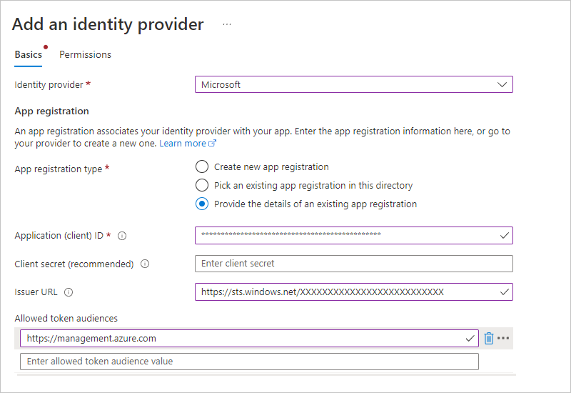

   If you're setting up your function app with an identity provider for the first time, the App Service authentication settings section also appears. These options determine how your function app responds to unauthenticated requests. The default selection redirects all requests to log in with the new identity provider. You can customize this behavior now or adjust these settings later from the main **Authentication** page by selecting **Edit** next to **Authentication settings**. To learn more about these options, review [Authentication flow - Authentication and authorization in Azure App Service and Azure Functions](../app-service/overview-authentication-authorization.md#authentication-flow).

   Otherwise, you can continue with the next step.

1. To finish creating the app registration, select **Add**.

   When you're done, the **Authentication** page now lists the identity provider and app ID (client ID) for the app registration. Your function app can now use this app registration for authentication.

1. Copy the app ID (client ID) for your function to use in the **Audience** property later in your workflow.

1. Return to the designer and follow the [steps to authenticate access with the managed identity](create-managed-service-identity.md#authenticate-access-with-identity) by using the built-in Azure Functions action.

## Next steps

* [Authentication access to Azure resources with managed identities in Azure Logic Apps](create-managed-service-identity.md#authenticate-access-with-identity)
