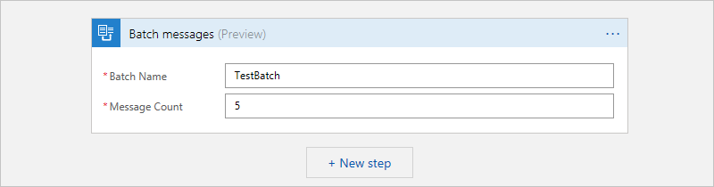
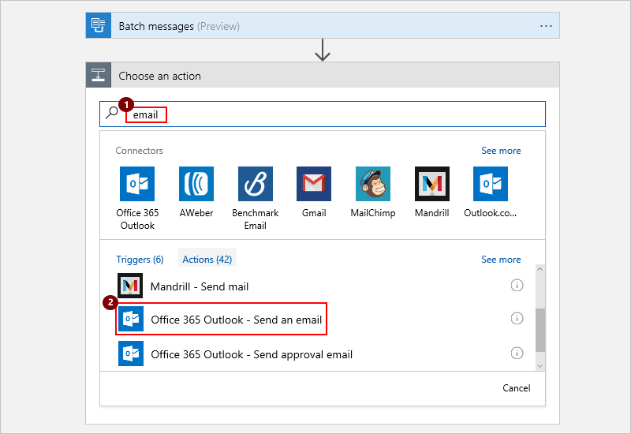
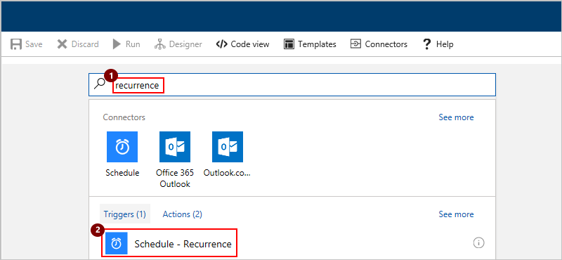
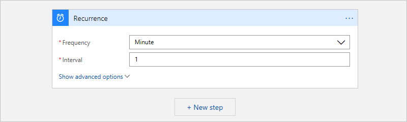
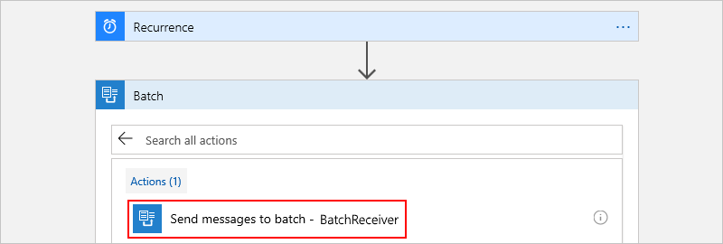
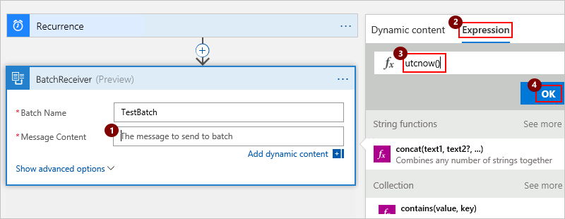
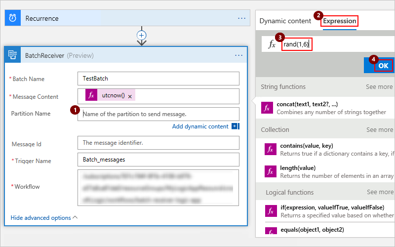

# Send, receive, and batch process messages in logic apps

To process messages together in groups, you can send data items, 
or messages, to a *batch*, and then process those items as a batch. 
This approach is useful when you want to make sure data items 
are grouped in a specific way and are processed together. 

You can create logic apps that receive items 
as a batch by using the **Batch** trigger. 
You can then create logic apps that send items 
to a batch by using the **Batch** action.

This topic shows how you can build a batching solution by performing these tasks: 

* [Create a logic app that receives and collects items as a batch](#batch-receiver). 
This "batch receiver" logic app specifies the batch name and release criteria 
to meet before the receiver logic app releases and processes items. 

* [Create a logic app that sends items to a batch](#batch-sender). 
This "batch sender" logic app specifies where to send items, 
which must be an existing batch receiver logic app. 
You can also specify a unique key, like a customer number, 
to "partition", or divide, the target batch into subsets based on that key. 
That way, all items with that key are collected and processed together. 

## Requirements

To follow this example, you need these items:

* An Azure subscription. If you don't have a subscription, you can 
[start with a free Azure account](https://azure.microsoft.com/free/). 
Otherwise, you can [sign up for a Pay-As-You-Go subscription](https://azure.microsoft.com/pricing/purchase-options/).

* Basic knowledge about 
[how to create logic apps](../logic-apps/logic-apps-create-a-logic-app.md) 

* An email account with any 
[email provider supported by Azure Logic Apps](../connectors/apis-list.md)

## Create logic apps that receive messages as a batch

Before you can send messages to a batch, you must first create a 
"batch receiver" logic app with the **Batch** trigger. 
That way, you can select this receiver logic app 
when you create the sender logic app. 
For the receiver, you specify the batch name, release criteria, 
and other settings. 

Sender logic apps need know where to send items, 
while receiver logic apps don't need to know anything about the senders.

1. In the [Azure portal](https://portal.azure.com), 
create a logic app with this name: "BatchReceiver" 

2. In Logic Apps Designer, add the **Batch** trigger, 
which starts your logic app workflow. 
In the search box, enter "batch" as your filter. 
Select this trigger: **Batch – Batch messages**

   

3. Provide a name for the batch, 
and specify criteria for releasing the batch, for example:

   * **Batch Name**: The name used to identify the batch, 
   which is "TestBatch" in this example.
   * **Message Count**: The number of messages to hold as a batch 
   before releasing for processing, which is "5" in this example.

   

4. Add another action that sends an email when the batch trigger fires. 
Each time the batch has five items, the logic app sends an email.

   1. Under the batch trigger, choose **+ New Step** > **Add an action**.

   2. In the search box, enter "email" as your filter.
   Based on your email provider, select an email connector.
   
      For example, if you have a work or school account, 
      select the Office 365 Outlook connector. 
      If you have a Gmail account, select the Gmail connector.

   3. Select this action for your connector: **{*email provider*} - Send an email**

      For example:

      

5. If you didn't previously create a connection for your email provider, 
provide your email credentials for authentication when prompted. 
Learn more about [authenticating your email credentials](../logic-apps/logic-apps-create-a-logic-app.md).

6. Set the properties for the action you just added.

   * In the **To** box, enter the recipient's email address. 
   For testing purposes, you can use your own email address.

   * In the **Subject** box, when the **Dynamic content** list appears, 
   select the **Partition Name** field.

     

     In a later section, you can specify a unique partition key that divides 
     the target batch into logical sets to where you can send messages. 
     Each set has a unique number that's generated by the sender logic app. 
     This capability lets you use a single batch with multiple subsets and 
     define each subset with the name that you provide.

   * In the **Body** box, when the **Dynamic content** list appears, 
   select the **Message Id** field.

     

     Because the input for the send email action is an array, 
     the designer automatically adds a **For each** loop 
     around the **Send an email** action. 
     This loop performs the inner action on each item in the batch. 
     So, with the batch trigger set to five items, 
     you get five emails each time the trigger fires.

7.  Now that you created a batch receiver logic app, save your logic app.

    

## Create logic apps that send messages to a batch

Now create one or more logic apps that send items to the 
batch defined by the receiver logic app. For the sender, 
you specify the receiver logic app and batch name, message content, 
and any other settings. You can optionally provide a unique partition
key to divide the batch into subsets to collect items with that key.

Sender logic apps need know where to send items, 
while receiver logic apps don't need to know anything about the senders.

1. Create another logic app with this name: "BatchSender"

   1. In the search box, enter "recurrence" as your filter. 
   Select this trigger: **Schedule - Recurrence**

      

   2. Set the frequency and interval to run the sender logic app every minute.

      

2. Add a new step for sending messages to a batch.

   1. Under the recurrence trigger, choose **+ New Step** > **Add an action**.

   2. In the search box, enter "batch" as your filter. 

   3. Select this action: 
   **Send messages to batch – Choose a Logic Apps workflow with batch trigger**

      

   4. Now select your "BatchReceiver" logic app that you previously created, 
   which now appears as an action.

      

      > [!NOTE]
      > The list also shows any other logic apps that have batch triggers.

3. Set the batch properties.

   * **Batch Name**: The batch name defined by the receiver logic app, 
   which is "TestBatch" in this example and is validated at runtime.

     > [!IMPORTANT]
     > Make sure that you don't change the batch name, 
     > which must match the batch name that's specified by the receiver logic app.
     > Changing the batch name causes the sender logic app to fail.

   * **Message Content**: The message content that you want to send. 
   For this example, add this expression that inserts the current 
   date and time into the message content that you send to the batch:

     1. When the **Dynamic content** list appears, choose **Expression**. 
     2. Enter the expression **utcnow()**, and choose **OK**. 

        

4. Now set up a partition for the batch. In the "BatchReceiver" action, 
choose **Show advanced options**.

   * **Partition Name**: An optional unique partition key to use for dividing the target batch. For this example, add an expression that generates a random number between one and five.
   
     1. When the **Dynamic content** list appears, choose **Expression**.
     2. Enter this expression: **rand(1,6)**

        

        This **rand** function generates a number between one and five. 
        So you are dividing this batch into five numbered partitions, 
        which this expression dynamically sets.

   * **Message Id**: An optional message identifier 
   and is a generated GUID when empty. 
   For this example, leave this box blank.

5. Save your logic app. Your sender logic app now looks similar to this example:

   

## Test your logic apps

To test your batching solution, 
leave your logic apps running for a few minutes. 
Soon, you start getting emails in groups of five, 
all with the same partition key.

Your BatchSender logic app runs every minute, 
generates a random number between one and five, 
and uses this generated number as the partition key 
for the target batch where messages are sent. 
Each time the batch has five items with the same partition key, 
your BatchReceiver logic app fires and sends mail for each message.

> [!IMPORTANT]
> When you're done testing, make sure that you disable the 
> BatchSender logic app to stop sending messages 
> and avoid overloading your inbox.

## Next steps

* [Build on logic app definitions by using JSON](../logic-apps/logic-apps-author-definitions.md)
* [Build a serverless app in Visual Studio with Azure Logic Apps and Functions](../logic-apps/logic-apps-serverless-get-started-vs.md)
* [Exception handling and error logging for logic apps](../logic-apps/logic-apps-scenario-error-and-exception-handling.md)
