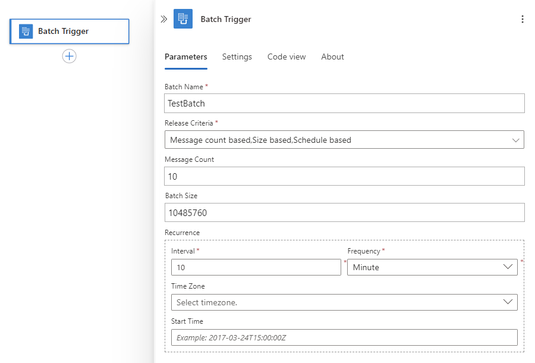

# Send, receive, and batch process messages in Azure Logic Apps

To send and process messages together in a specific way as groups, 
you can create a batching solution that collects messages into a 
*batch* until your specified criteria are met for releasing and 
processing the batched messages. Batching can reduce how often 
your logic app processes messages. This article shows how to build 
a batching solution by creating two logic apps within the same 
Azure subscription, Azure region, and following this specific order: 

* The ["batch receiver"](#batch-receiver) logic app, 
which accepts and collects messages into a batch 
until your specified criteria is met for releasing 
and processing those messages.

  Make sure you first create the batch receiver so 
  you can later select the batch destination when 
  you create the batch sender.

* One or more ["batch sender"](#batch-sender) logic apps, 
which send the messages to the previously created batch receiver. 

   You can also specify a unique key, such as a customer number, 
   that *partitions* or divides the target batch into logical 
   subsets based on that key. That way, the receiver app can 
   collect all items with the same key and process them together.

Make sure your batch receiver and batch sender share the 
same Azure subscription *and* Azure region. If they don't, 
you can't select the batch receiver when you create the 
batch sender because they're not visible to each other.

## Prerequisites

* An Azure subscription. If you don't have a subscription, you can [start with a free Azure account](https://azure.microsoft.com/free/).
Or, [sign up for a Pay-As-You-Go subscription](https://azure.microsoft.com/pricing/purchase-options/).

* An email account with any [email provider supported by Azure Logic Apps](../connectors/apis-list.md)

  > [!IMPORTANT]
  > If you want to use the Gmail connector, only G-Suite business accounts can use this connector without restriction in logic apps. 
  > If you have a Gmail consumer account, you can use this connector with only specific Google-approved services, or you can 
  > [create a Google client app to use for authentication with your Gmail connector](https://docs.microsoft.com/connectors/gmail/#authentication-and-bring-your-own-application). 
  > For more information, see [Data security and privacy policies for Google connectors in Azure Logic Apps](../connectors/connectors-google-data-security-privacy-policy.md).

* Basic knowledge about [how to create logic apps](../logic-apps/quickstart-create-first-logic-app-workflow.md)

* To use Visual Studio rather than the Azure portal, make sure you [set up Visual Studio for working with Logic Apps](../logic-apps/quickstart-create-logic-apps-with-visual-studio.md).

## Create batch receiver

Before you can send messages to a batch, that batch must 
first exist as the destination where you send those messages. 
So first, you must create the "batch receiver" logic app, 
which starts with the **Batch** trigger. That way, 
when you create the "batch sender" logic app, 
you can select the batch receiver logic app. The batch 
receiver continues collecting messages until your specified 
criteria is met for releasing and processing those messages. 
While batch receivers don't need to know anything about batch senders, 
batch senders must know the destination where they send the messages. 

1. In the [Azure portal](https://portal.azure.com) or Visual Studio, 
create a logic app with this name: "BatchReceiver" 

2. In Logic Apps Designer, add the **Batch** trigger, 
which starts your logic app workflow. 
In the search box, enter "batch" as your filter. 
Select this trigger: **Batch messages**

   

3. Set these properties for the batch receiver: 

   | Property | Description | 
   |----------|-------------|
   | **Batch Mode** | - **Inline**: For defining release criteria inside the batch trigger  - **Integration Account**: For defining multiple release criteria configurations through an [integration account](../logic-apps/logic-apps-enterprise-integration-create-integration-account.md). With an integration account, you can maintain these configurations all in one place rather than in separate logic apps. | 
   | **Batch Name** | The name for your batch, which is "TestBatch" in this example, and applies only to **Inline** batch mode |  
   | **Release Criteria** | Applies only to **Inline** batch mode and selects the criteria to meet before processing each batch: 
- **Message count based**: Release the batch based on the number of messages collected by the batch.  - **Size based**: Release the batch based on the total size in bytes for all messages collected by that batch.  - **Schedule**: Release the batch based on a recurrence schedule, which specifies an interval and frequency. In the advanced options, you can also select a time zone and provide a start date and time.  - **Select all**: Use all the specified criteria. | 
   | **Message Count** | The number of messages to collect in the batch, for example, 10 messages. A batch's limit is 8,000 messages. | 
   | **Batch Size** | The total size in bytes to collect in the batch, for example, 10 MB. A batch's size limit is 80 MB. | 
   | **Schedule** | The interval and frequency between batch releases, for example, 10 minutes. The minimum recurrence is 60 seconds or 1 minute. Fractional minutes are effectively rounded up to 1 minute. To specify a time zone or a start date and time, choose **Show advanced options**. | 
   ||| 

   > [!NOTE]
   > 
   > If you change the release criteria while the 
   > trigger still has batched but unsent messages, 
   > the trigger uses the updated release criteria 
   > for handling the unsent messages. 

   This example shows all the criteria, 
   but for your own testing, try just one criterion:

   

4. Now add one or more actions that process each batch. 

   For this example, add an action that sends an email when the batch trigger fires. 
   The trigger runs and sends an email when the batch either has 10 messages, 
   reaches 10 MB, or after 10 minutes pass.

   1. Under the batch trigger, choose **New step**.

   2. In the search box, enter "send email" as your filter.
   Based on your email provider, select an email connector.

      For example, if you have a personal account, such as @outlook.com or @hotmail.com, select the Outlook.com connector. This example uses the Office 365 Outlook connector.

   3. Select this action: **Send an email - <*email provider*>**

      For example:

      

5. If prompted, sign in to your email account. 

6. Set the properties for the action you added.

   * In the **To** box, enter the recipient's email address. 
   For testing purposes, you can use your own email address.

   * In the **Subject** box, when the dynamic content list appears, 
   select the **Partition Name** field.

     

     Later, in the batch sender, you can specify a unique partition key that 
     divides the target batch into logical subsets where you can send messages. 
     Each set has a unique number that's generated by the batch sender logic app. 
     This capability lets you use a single batch with multiple subsets and 
     define each subset with the name that you provide.

     > [!IMPORTANT]
     > A partition has a limit of 5,000 messages or 80 MB. 
     > If either condition is met, Logic Apps might release the batch, 
     > even when your defined release condition isn't met.

   * In the **Body** box, when the dynamic content list appears, 
   select the **Message Id** field. 

     The Logic Apps Designer automatically adds a "For each" loop 
     around the send email action because that action treats the output 
     from the previous action as a collection, rather than a batch. 

     

7.  Save your logic app. You've now created a batch receiver.

    

8. If you're using Visual Studio, make sure you 
[deploy your batch receiver logic app to Azure](../logic-apps/quickstart-create-logic-apps-with-visual-studio.md#deploy-logic-app-to-azure). 
Otherwise, you can't select the batch receiver when you create the batch sender.

## Create batch sender

Now create one or more batch sender logic apps that send 
messages to the batch receiver logic app. In each batch sender, 
you specify the batch receiver and batch name, message content, 
and any other settings. You can optionally provide a unique 
partition key to divide the batch into logical subsets 
for collecting messages with that key. 

* Make sure you've already [created your batch receiver](#batch-receiver) 
so when you create your batch sender, you can select the existing 
batch receiver as the destination batch. While batch receivers 
don't need to know anything about batch senders, 
batch senders must know where to send messages. 

* Make sure your batch receiver and batch sender share the 
same Azure region *and* Azure subscription. If they don't, 
you can't select the batch receiver when you create the 
batch sender because they're not visible to each other.

1. Create another logic app with this name: "BatchSender"

   1. In the search box, enter "recurrence" as your filter. 
   Select this trigger: **Recurrence - Schedule**

      

   2. Set the frequency and interval to run the sender logic app every minute.

      

2. Add a new action for sending messages to a batch.

   1. Under the recurrence trigger, choose **New step**.

   2. In the search box, enter "batch" as your filter. 
   Select the **Actions** list, and then select this action: 
   **Choose a Logic Apps workflow with batch trigger - Send messages to batch**

      

   3. Select your batch receiver logic app that you previously created.

      

      > [!NOTE]
      > The list also shows any other logic apps that have batch triggers. 
      > 
      > If you're using Visual Studio, and you don't see any batch receivers to select, 
      > check that you deployed your batch receiver to Azure. If you haven't, 
      > learn how to [deploy your batch receiver logic app to Azure](../logic-apps/quickstart-create-logic-apps-with-visual-studio.md#deploy-logic-app-to-azure). 

   4. Select this action: **Batch_messages - <*your-batch-receiver*>**

      

3. Set the batch sender's properties:

   | Property | Description | 
   |----------|-------------| 
   | **Batch Name** | The batch name defined by the receiver logic app, which is "TestBatch" in this example 
**Important**: The batch name gets validated at runtime and must match the name specified by the receiver logic app. Changing the batch name causes the batch sender to fail. | 
   | **Message Content** | The content for the message you want to send | 
   ||| 

   For this example, add this expression, which inserts the current 
   date and time into the message content that you send to the batch:

   1. Click inside the **Message Content** box. 

   2. When the dynamic content list appears, choose **Expression**. 

   3. Enter the expression `utcnow()`, and then choose **OK**. 

      

4. Now set up a partition for the batch. In the "BatchReceiver" action, 
choose **Show advanced options** and set these properties:

   | Property | Description | 
   |----------|-------------| 
   | **Partition Name** | An optional unique partition key to use for dividing the target batch into logical subsets and collect messages based on that key | 
   | **Message Id** | An optional message identifier that is a generated globally unique identifier (GUID) when empty | 
   ||| 

   For this example, in the **Partition Name** box, 
   add an expression that generates a random number 
   between one and five. Leave the **Message Id** box empty.
   
   1. Click inside the **Partition Name** box 
   so that the dynamic content list appears. 

   2. In the dynamic content list, choose **Expression**.
   
   3. Enter the expression `rand(1,6)`, and then choose **OK**.

      

      This **rand** function generates a number between one and five. 
      So you are dividing this batch into five numbered partitions, 
      which this expression dynamically sets.

5. Save your logic app. Your sender logic app now looks similar to this example:

   

## Test your logic apps

To test your batching solution, leave your logic apps running for a few minutes. 
Soon, you start getting emails in groups of five, all with the same partition key.

Your batch sender logic app runs every minute, 
generates a random number between one and five, 
and uses this generated number as the partition key 
for the target batch where messages are sent. 
Each time the batch has five items with the same partition key, 
your batch receiver logic app fires and sends mail for each message.

> [!IMPORTANT]
> When you're done testing, make sure that you disable the 
> BatchSender logic app to stop sending messages 
> and avoid overloading your inbox.

## Next steps

* [Batch and send EDI messages](../logic-apps/logic-apps-scenario-edi-send-batch-messages.md)
* [Build on logic app definitions by using JSON](../logic-apps/logic-apps-author-definitions.md)
* [Build a serverless app in Visual Studio with Azure Logic Apps and Functions](../logic-apps/logic-apps-serverless-get-started-vs.md)
* [Exception handling and error logging for logic apps](../logic-apps/logic-apps-scenario-error-and-exception-handling.md)
