---
# required metadata
title: Change or manage data outputs and formats - Azure Logic Apps | Microsoft Docs
description: Convert, transform, and manage data outputs and formats in Azure Logic Apps
services: logic-apps
ms.service: logic-apps
author: ecfan
ms.author: estfan
manager: jeconnoc
ms.topic: article
ms.date: 06/22/2018

# optional metadata
ms.reviewer: klam, LADocs
ms.suite: integration
---

# Change or manage data outputs and formats in Azure Logic Apps

This article shows how you can perform various operations on data 
outputs from the triggers and actions in your logic apps. 
Azure Logic Apps provides these operations as built-in actions 
that you can use in your logic apps.

**Array actions** 

These actions help you work with data in arrays.

| Action | Description | 
|--------|-------------| 
| [**Create CSV table**](#create-csv-table-action) | Create a comma-separated value (CSV) table from an array or output from an expression. | 
| [**Create HTML table**](#create-html-table-action) | Create an HTML table with output from an array or output from an expression. | 
| [**Filter array**](#filter-array-action) | Get the items from an array based on the specified filter or condition. | 
| [**Join**](#join-action) | Create a string from all the items in an array and separate each item with the specified character. | 
| [**Select**](#select-action) | Create an array from the specified properties for all the items in a different array. | 
||| 

**JSON actions**

These actions help you work with data in JavaScript Object Notation (JSON) format.

| Action | Description | 
|--------|-------------| 
| [**Compose**](#compose-action) | Create a single output from inputs with varying data types. | 
| [**Parse JSON**](#parse-json-action) | Create user-friendly data tokens, which you can use in logic apps, from JSON content by providing or generating a JSON schema.  | 
||| 

To create more complex JSON transformations, see 
[Perform advanced JSON transformations with Liquid templates](../logic-apps/logic-apps-enterprise-integration-liquid-transform.md).

## Prerequisites

To follow the examples in this article, you need these items:

* An Azure subscription. If you don't have an Azure subscription yet, 
<a href="https://azure.microsoft.com/free/" target="_blank">sign up for a free Azure account</a>.

* The logic app where you need the operation for working with data 

  If you're new to logic apps, review 
  [What is Azure Logic Apps](../logic-apps/logic-apps-overview.md) 
  and [Quickstart: Create your first logic app](../logic-apps/quickstart-create-first-logic-app-workflow.md).

* A [trigger](../logic-apps/logic-apps-overview.md#logic-app-concepts) 
as the first step in your logic app 

  Data operations are currently available only as actions. 
  Before you can use these actions, your logic app 
  must start with a trigger and include any other actions 
  required for creating the outputs you want.

## Compose action

You can create a single output from more than one input, 
including expressions, by using the **Data Operations - Compose** action. 
These inputs can have varying types, such as arrays, 
JSON objects, and any other native type that Azure 
Logic Apps supports, for example, binary and XML. 
You can then use this output in actions that follow 
the **Compose** action.

1. In the <a href="https://portal.azure.com" target="_blank">Azure portal</a> 
or Visual Studio, open your logic app in Logic App Designer. 

   This example uses the Azure portal and a logic app with a 
   **Recurrence** trigger and two **Initialize variable** actions. 
   These actions are set up for creating a string variable 
   and an integer variable. When you test your logic app later, 
   you can manually run your app without waiting for the trigger to fire.

   

2. In your logic app where you want to create the output, 
follow one of these steps: 

   * To add an action under the last step, 
   choose **New step** > **Add an action**.

     

   * To add an action between steps, move your mouse 
   over the connecting arrow so the plus sign (+) appears. 
   Choose the plus sign, and then select **Add an action**.

3. In the search box, enter "compose" as your filter. 
From the actions list, select this action: **Data Operations - Compose**

   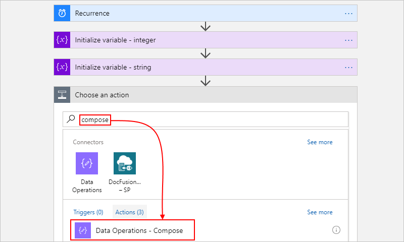

4. In the **Inputs** box, provide the inputs you want for creating the output. 

   For this example, when you click inside the **Inputs** box, 
   the dynamic content list appears so you can select 
   the previously created variables:

   

   Here is the finished example **Compose** action: 

   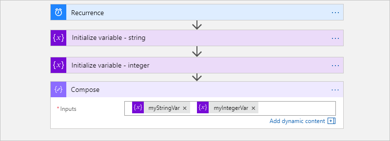

5. Save your logic app. On the designer toolbar, choose **Save**.

For more information about this action in 
your underlying workflow definition, see the 
[Compose action](../logic-apps/logic-apps-workflow-actions-triggers.md#compose-action).

### Test your logic app

To check that the **Compose** action creates the expected results, 
send yourself a notification that includes output from the **Compose** action.

1. In your logic app, add an action that can send you 
the results from the **Compose** action.

2. In that action, click anywhere you want the results to appear. 
When the dynamic content list opens, under the **Compose** action, 
select **Output**. 

   This example uses the **Office 365 Outlook - Send an email** action 
   and includes **Output** fields in the email's body and subject:

   

3. Now, manually run your logic app. On the designer toolbar, choose **Run**. 

   Based on the email connector you used, here the results that you get:

   

## Create CSV table action

You can create a CSV table from array items or expression outputs 
by using the **Data Operations - Create CSV table** action. 
You can then use this table in actions that follow the **Create CSV table** action.

1. In the <a href="https://portal.azure.com" target="_blank">Azure portal</a> 
or Visual Studio, open your logic app in Logic App Designer. 

   This example uses the Azure portal and a logic app with a 
   **Recurrence** trigger and an **Initialize variable** action. 
   The action is set up for creating a variable whose initial 
   value is an array that has some properties and values in 
   JavaScript Object Notation (JSON) format. When you test 
   your logic app later, you can manually run your app 
   without waiting for the trigger to fire.

   

2. In your logic app where you want to create the CSV table, 
follow one of these steps: 

   * To add an action under the last step, 
   choose **New step** > **Add an action**.

     

   * To add an action between steps, move your mouse 
   over the connecting arrow so the plus sign (+) appears. 
   Choose the plus sign, and then select **Add an action**.

3. In the search box, enter "create csv table" as your filter. 
From the actions list, select this action: **Data Operations - Create CSV table**

   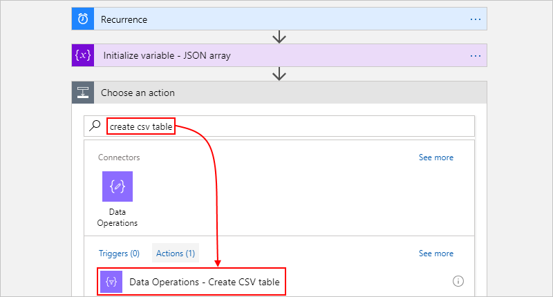

4. In the **From** box, provide the array or expression you want for creating the table. 

   For this example, when you click inside the **From** box, 
   the dynamic content list appears so you can select 
   the previously created variable:

   

   Here is the finished example **Create CSV table** action: 

   

   By default, this action automatically creates the columns based on the array items. 
   To manually create the column headers and values, choose **Show advanced options**. 
   To provide only custom values, change **Columns** to **Custom**. 
   To provide custom column headers too, change **Include headers** to **Yes**. 
   
5. Save your logic app. On the designer toolbar, choose **Save**.

For more information about this action in your underlying workflow definition, 
see the [Table action](../logic-apps/logic-apps-workflow-actions-triggers.md#table-action).

### Test your logic app

To check that the **Create CSV table** action creates the expected results, 
send yourself a notification that includes output from the **Create CSV table** action.

1. In your logic app, add an action that can send you 
the results from the **Create CSV table** action.

2. In that action, click anywhere you want the results to appear. 
When the dynamic content list opens, under the **Create CSV table** action, 
select **Output**. 

   This example uses the **Office 365 Outlook - Send an email** action 
   and includes **Output** fields in the email's body and subject:

   

3. Now, manually run your logic app. On the designer toolbar, choose **Run**. 

   Based on the email connector you used, here the results that you get:

   

## Create HTML table action

You can create an HTML table from array items or expression outputs 
by using the **Data Operations - Create HTML table** action. 
You can then use this table in actions that follow the **Create HTML table** action.

1. In the <a href="https://portal.azure.com" target="_blank">Azure portal</a> 
or Visual Studio, open your logic app in Logic App Designer. 

   This example uses the Azure portal and a logic app with a 
   **Recurrence** trigger and an **Initialize variable** action. 
   The action is set up for creating a variable whose initial 
   value is an array that has some properties and values in 
   JavaScript Object Notation (JSON) format. When you test 
   your logic app later, you can manually run your app 
   without waiting for the trigger to fire.

   

2. In your logic app where you want to create an HTML table, 
follow one of these steps: 

   * To add an action under the last step, 
   choose **New step** > **Add an action**.

     

   * To add an action between steps, move your mouse 
   over the connecting arrow so the plus sign (+) appears. 
   Choose the plus sign, and then select **Add an action**.

3. In the search box, enter "create html table" as your filter. 
From the actions list, select this action: **Data Operations - Create HTML table**

   

4. In the **From** box, provide the array or expression you want for creating the table. 

   For this example, when you click inside the **From** box, 
   the dynamic content list appears so you can select 
   the previously created variable:

   

   Here is the finished example **Create HTML table** action: 

   

   By default, this action automatically creates the columns based on the array items. 
   To manually create the column headers and values, choose **Show advanced options**. 
   To provide only custom values, change **Columns** to **Custom**. 
   To provide custom column headers too, change **Include headers** to **Yes**. 

5. Save your logic app. On the designer toolbar, choose **Save**.

For more information about this action in your underlying workflow definition, 
see the [Table action](../logic-apps/logic-apps-workflow-actions-triggers.md#table-action).

### Test your logic app

To check that the **Create HTML table** action creates the expected results, 
send yourself a notification that includes output from the **Create HTML table** action.

1. In your logic app, add an action that can send you 
the results from the **Create HTML table** action.

2. In that action, click anywhere you want the results to appear. 
When the dynamic content list opens, under the **Create HTML table** action, 
select **Output**. 

   This example uses the **Office 365 Outlook - Send an email** action 
   and includes **Output** fields in the email's body and subject:

   

3. Now, manually run your logic app. On the designer toolbar, choose **Run**. 

   Based on the email connector you used, here the results that you get:

   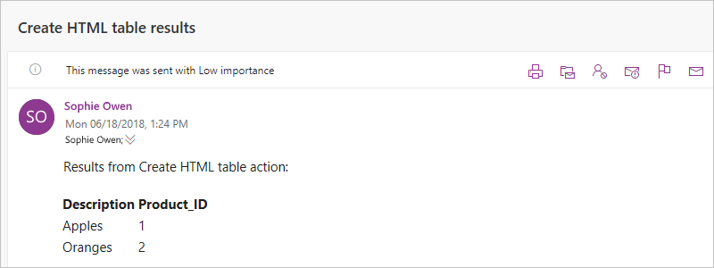

## Filter array action

You can create a smaller array from an existing array based on a 
specified condition by using the **Data Operations - Filter array** action. 
You can then use the filtered array in actions that follow the **Filter array** action.

> [!NOTE]
> This action can't change the format or shape of items in the array.
> Also, any filter text that you use in your condition is case sensitive.

1. In the <a href="https://portal.azure.com" target="_blank">Azure portal</a> 
or Visual Studio, open your logic app in Logic App Designer. 

   This example uses the Azure portal and a logic app with a 
   **Recurrence** trigger and an **Initialize variable** action. 
   The action is set up for creating a variable whose initial 
   value is an array that contains integers. When you test 
   your logic app later, you can manually run your app 
   without waiting for the trigger to fire.

   

2. In your logic app where you want to create the filtered array, 
follow one of these steps: 

   * To add an action under the last step, 
   choose **New step** > **Add an action**.

     

   * To add an action between steps, move your mouse 
   over the connecting arrow so the plus sign (+) appears. 
   Choose the plus sign, and then select **Add an action**.

3. In the search box, enter "filter array" as your filter. 
From the actions list, select this action: **Data Operations - Filter array**

   

4. In the **From** box, provide the array or expression you want to filter. 

   For this example, when you click inside the **From** box, 
   the dynamic content list appears so you can select 
   the previously created variable:

   

5. For the condition, specify the array items to compare, 
select the comparsion operator, and specify the comparison value.

   This example finds array items whose value is greater than 2:
   
   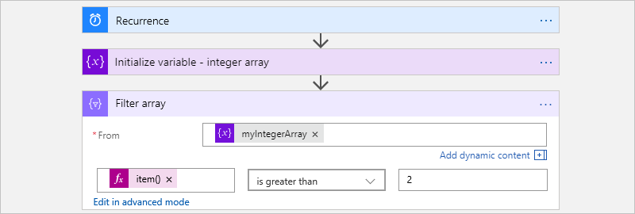

6. Save your logic app. On the designer toolbar, choose **Save**.

For more information about this action in your underlying workflow definition, 
see [Query action](../logic-apps/logic-apps-workflow-actions-triggers.md#query-action).

## Join action

To create a string that has all the items from an array and separates 
those items with a specified delimiter character, follow these steps:

1. In the <a href="https://portal.azure.com" target="_blank">Azure portal</a> 
or Visual Studio, open your logic app in Logic App Designer. 

   This example uses the Azure portal and a logic app with a 
   **Recurrence** trigger and an **Initialize variable** action. 
   This action is set up for creating a variable whose initial 
   value is an array that has some sample integers. 
   When you test your logic app later, you can manually 
   run your app without waiting for the trigger to fire.

   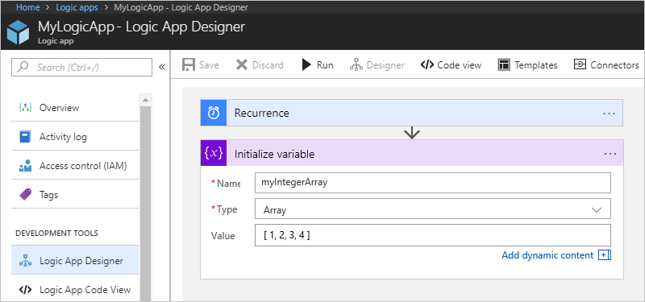

2. In your logic app where you want to create the string from an array, 
follow one of these steps: 

   * To add an action under the last step, 
   choose **New step** > **Add an action**.

     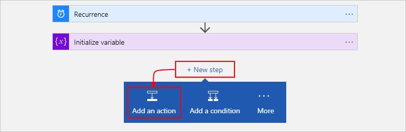

   * To add an action between steps, move your mouse 
   over the connecting arrow so the plus sign (+) appears. 
   Choose the plus sign, and then select **Add an action**.

3. In the search box, enter "join" as your filter. 
From the actions list, select this action: 
**Data Operations - Join**

   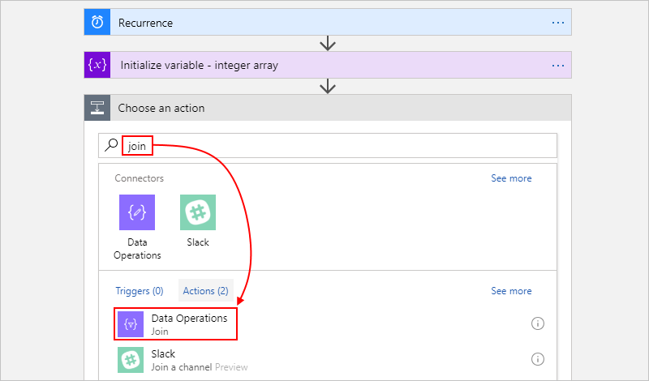

4. In the **From** box, provide the array that has the items you want to join as a string. 

   For this example, from the dynamic content list that appears, 
   you can select the previously created **myIntegerArray** variable: 

   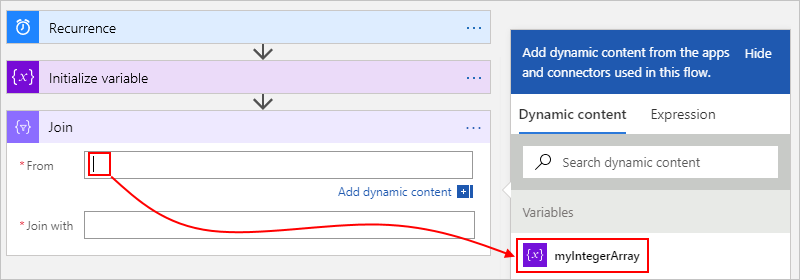

5. In the **Join with** box, enter the character 
you want for separating each array item. 

   This example uses a colon (:) as the separator.

   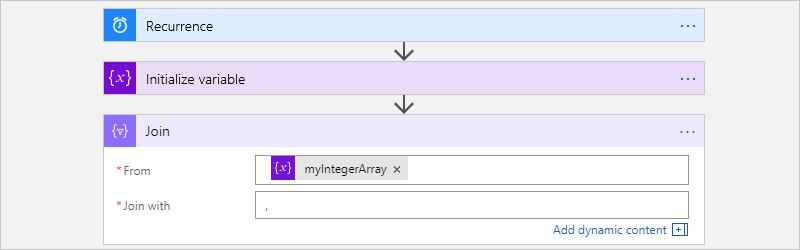

6. Save your logic app. On the designer toolbar, choose **Save**.

For more information about this action in your underlying workflow definition, 
see the [Join action](../logic-apps/logic-apps-workflow-actions-triggers.md#join-action).

### Test your logic app

To check that the **Join** action creates the expected results, 
send yourself a notification that includes output from the **Join** action. 

1. In your logic app, add an action that can send you 
the results from the **Join** action.

2. In that action, click anywhere you want the results to appear. 
When the dynamic content list opens, under the **Join** action, 
select **Output**. 

   This example uses the **Office 365 Outlook - Send an email** action 
   and includes **Output** fields in the email's body and subject:

   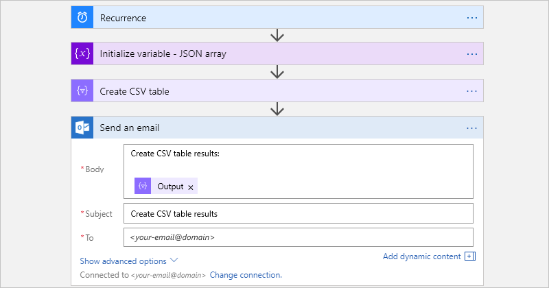

3. Now, manually run your logic app. On the designer toolbar, choose **Run**. 

   Based on the email connector you used, here the results that you get:

   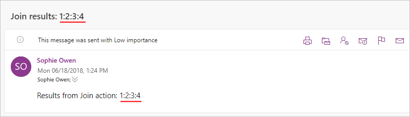

## Parse JSON action

To use properties from JSON content in your logic app, 
you can create fields or tokens for those properties. 
That way, you can select those fields from the dynamic 
content list when providing input for your logic app. 
For this action, you can either provide a JSON schema 
or generate a JSON schema from your sample JSON content or payload.

## Select action

## Get support

* For questions, visit the [Azure Logic Apps forum](https://social.msdn.microsoft.com/Forums/en-US/home?forum=azurelogicapps).
* To submit or vote on feature ideas, visit the [Logic Apps user feedback site](http://aka.ms/logicapps-wish).

## Next steps

* Learn about [Logic Apps connectors](../connectors/apis-list.md)