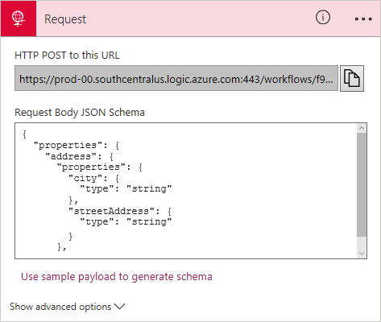
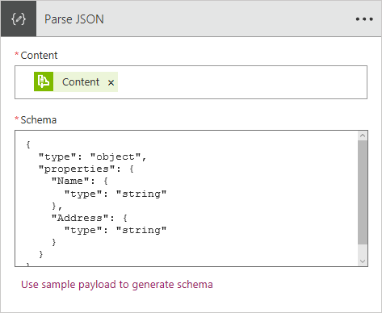

# Handle content types in logic apps

Many different types of content can flow through a logic app, including JSON, XML, flat files, and binary data. 
While the Logic Apps Engine supports all content types, some are natively understood by the Logic Apps Engine. 
Others might require casting or conversions as necessary. 
This article describes how the engine handles different content types and how to correctly handle these types when necessary.

## Content-Type Header

To start basically, let's look at the two `Content-Types` that don't require conversion or casting 
that you can use in a logic app: `application/json` and `text/plain`.

## Application/JSON

The workflow engine relies on the `Content-Type` header from HTTP calls to determine the appropriate handling. 
Any request with the content type `application/json` is stored and handled as a JSON Object. 
Also, JSON content can be parsed by default without needing any casting. 

For example, you could parse a request that has the content type header `application/json ` in a workflow 
by using an expression like `@body('myAction')['foo'][0]` to get the value `bar` in this case:

```
{
    "data": "a",
    "foo": [
        "bar"
    ]
}
```

No additional casting is needed. If you are working with data that is JSON but didn't have a header specified, 
you can manually cast it to JSON using the `@json()` function, for example: `@json(triggerBody())['foo']`.

### Schema and schema generator

The Request trigger lets you to enter a JSON schema for the payload you expect to receive. 
This schema lets the designer generate tokens so you can consume the content of the request. 
If you don't have a schema ready, select **Use sample payload to generate schema**, 
so you can generate a JSON schema from a sample payload.



### 'Parse JSON' action

The `Parse JSON` action lets you parse JSON content into friendly tokens 
for logic app consumption. Similar to the Request trigger, this action 
lets you enter or generate a JSON schema for the content you want to parse. 
This tool makes consuming data from Service Bus, Azure Cosmos DB, and so on, much easier.



## Text/plain

Similar to `application/json`, HTTP messages received with the `Content-Type` header 
of `text/plain` are stored in raw form. Also, if those messages are included in subsequent actions without casting, 
those requests go out with  `Content-Type`: `text/plain` header. 
For example, when working with a flat file, you might get this HTTP content as `text/plain`:

```
Date,Name,Address
Oct-1,Frank,123 Ave.
```

If in the next action, you send the request as the body of another request (`@body('flatfile')`), 
the request would have a `text/plain` Content-Type header. 
If you are working with data that is plain text but didn't have a header specified, 
you can manually cast the data to text using the `@string()` function, for example: `@string(triggerBody())`.

## Application/xml and Application/octet-stream and converter functions

The Logic Apps Engine always preserves the `Content-Type` that was received on the HTTP request or response. 
So if the engine receives content with the `Content-Type` of `application/octet-stream`, 
and you include that content in a subsequent action without casting, 
the outgoing request has `Content-Type`: `application/octet-stream`. 
This way, the engine can guarantee data isn't lost while moving through the workflow. 
However, the action state (inputs and outputs) is stored in a JSON object as the state moves through the workflow. 
So to preserve some data types, the engine converts the content 
to a binary base64 encoded string with appropriate metadata that preserves 
both `$content` and `$content-type`, which are automatically be converted. 

* `@json()` - casts data to `application/json`
* `@xml()` - casts data to `application/xml`
* `@binary()` - casts data to `application/octet-stream`
* `@string()` - casts data to `text/plain`
* `@base64()` - converts content to a base64 string
* `@base64toString()` - converts a base64 encoded string to `text/plain`
* `@base64toBinary()` - converts a base64 encoded string to `application/octet-stream`
* `@encodeDataUri()` - encodes a string as a dataUri byte array
* `@decodeDataUri()` - decodes a dataUri into a byte array

For example, if you received an HTTP request with `Content-Type`: `application/xml`:

```
<?xml version="1.0" encoding="UTF-8" ?>
<CustomerName>Frank</CustomerName>
```

You could cast and use later with something like `@xml(triggerBody())`, 
or in a function like `@xpath(xml(triggerBody()), '/CustomerName')`.

## Other content types

Other content types are supported and work with logic apps, 
but might require manually retrieving the message body by decoding the `$content`. 
For example, suppose you trigger an `application/x-www-url-formencoded` request 
where `$content` is the payload encoded as a base64 string to preserve all data:

```
CustomerName=Frank&Address=123+Avenue
```

Because the request isn't plain text or JSON, 
the request is stored in the action as follows:

```
...
"body": {
    "$content-type": "application/x-www-url-formencoded",
    "$content": "AAB1241BACDFA=="
}
```

Currently, there isn't a native function for form data, 
so you could still use this data in a workflow by manually accessing the data 
with a function like `@string(body('formdataAction'))`. 
If you wanted the outgoing request to also have 
the `application/x-www-url-formencoded` content type header, 
you could add the request to the action body without any casting like `@body('formdataAction')`. 
However, this method only works if the body is the only parameter in the `body` input. 
If you try to use `@body('formdataAction')` in an `application/json` request, 
you get a runtime error because the encoded body is sent.

