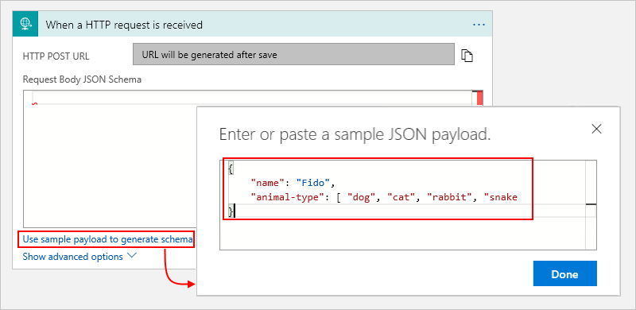
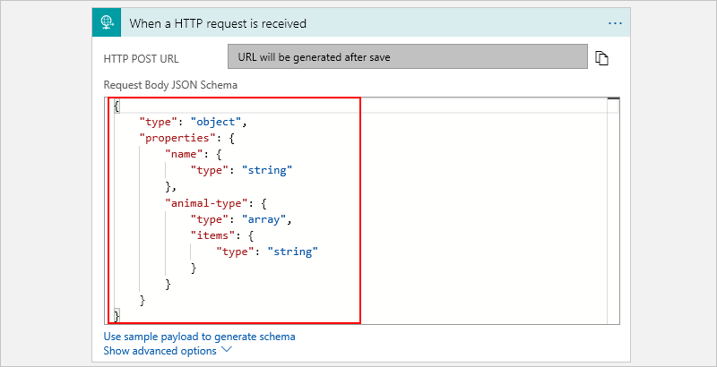

---
# required metadata
title: Handle content types - Azure Logic Apps | Microsoft Docs
description: Learn how Logic Apps handles content types at design time and run time
services: logic-apps
ms.service: logic-apps
author: kevinlam1
ms.author: klam
manager: jeconnoc
ms.topic: article
ms.date: 10/18/2016

# optional metadata
ms.reviewer: klam, LADocs
ms.suite: integration
---

# Handle content types in Azure Logic Apps

Various content types can flow through a logic app, 
for example, JSON, XML, flat files, and binary data. 
While Logic Apps supports all content types, some have native 
support and don't require casting or conversion in your logic apps. 
Other types might require casting or conversion as necessary. 
This article describes how Logic Apps handles content types and 
how you can correctly cast or convert these types when necessary.

To determine the appropriate way for handling content types, 
Logic Apps relies on the `Content-Type` header in HTTP calls 
and can specify content types such as these examples:

* [application/json](#application-json) (native content type)
* [text/plain](#text-plain) (native content type)
* [application/xml and application/octet-stream]
* [Other content types](#other-content-types)

<a name="application-json"></a>

## "application/json" content type

Logic Apps stores and handles any request with the *application/json* 
content type as a JavaScript Notation (JSON) object. 
By default, you can parse JSON content without any casting. 
To parse a request that has a header with the "application/json" content type, 
you can use an expression. This example returns the value `dog` from the 
`animal-type` array without casting: 
 
`@body('myAction')['animal-type'][0]` 
  
  ```json
  {
    "name": "Fido",
    "animal-type": [ "dog", "cat", "rabbit", "snake" ]
  }
  ```

If you're working with JSON data that doesn't specify a header, 
you can manually cast that data to JSON by using the 
[json() function](../logic-apps/workflow-definition-language-functions-reference.md#json), 
for example: 
  
`@json(triggerBody())['animal-type']`

### Create tokens for JSON properties

Logic Apps provides the capability for you to generate user-friendly 
tokens that represent the properties in JSON content so you can 
reference and use those properties more easily in your logic app's workflow.

* **Request trigger**

  When you use this trigger in the Logic App Designer, you can provide 
  a JSON schema that describes the payload you expect to receive. 
  The designer parses JSON content by using this schema and generates 
  user-friendly tokens that represent the properties in your JSON content. 
  You can then easily reference and use those properties throughout your 
  logic app's workflow. 
  
  If you don't have a schema, you can generate the schema. 
  
  1. In the Request trigger, select **Use sample payload to generate schema**.  
  
  2. Under **Enter or paste a sample JSON payload**, provide a sample payload 
  and then choose **Done**. For example: 

     

     The generated schema now appears in your trigger.

     

     Here is the underlying definition for your Request trigger in the code view editor:

     ```json
     "triggers": { 
        "manual": {
           "type": "Request",
           "kind": "Http",
           "inputs": { 
              "schema": {
                 "type": "object",
                 "properties": {
                    "animal-type": {
                       "type": "array",
                       "items": {
                          "type": "string"
                       },
                    },
                    "name": {
                       "type": "string"
                    }
                 }
              }
           }
        }
     }
     ```

  3. In your request, make sure you include a `Content-Type` header 
  and set the header's value to `application/json`.

* **Parse JSON action**

  When you use this action in the Logic App Designer, 
  you can parse JSON output and generate user-friendly tokens 
  that represent the properties in your JSON content. 
  You can then easily reference and use those properties 
  throughout your logic app's workflow. Similar to the Request trigger, 
  you can provide or generate a JSON schema that describes the JSON content you want to parse. 
  This capability makes consuming data from Azure Service Bus, Azure Cosmos DB, and so on, much easier.

  

<a name="application-json"></a>

## text/plain content type

Similar to `application/json`, HTTP messages received with the `Content-Type` header 
of `text/plain` are stored in raw form. Also, if those messages are included in subsequent actions without casting, 
those requests go out with  `Content-Type`: `text/plain` header. 
For example, when working with a flat file, you might get this HTTP content as `text/plain`:

`
Date,Name,Address
Oct-1,Frank,123 Ave.
`

If in the next action, you send the request as the body of another request (`@body('flatfile')`), 
the request would have a `text/plain` Content-Type header. 
If you are working with data that is plain text but didn't have a header specified, 
you can manually cast the data to text using the `@string()` function, for example: `@string(triggerBody())`.

## application/xml, application/octet-stream, and converter functions

Logic Apps always preserves the `Content-Type` in the received HTTP request or response. 
So if your logic app receives content with `Content-Type` set to `application/octet-stream`, 
and you include that content in a later action without casting, 
the outgoing request also has `Content-Type` set to `application/octet-stream`. 
That way, Logic Apps can guarantee that data doesn't get lost while moving through the workflow. 
However, the action state, or inputs and outputs, is stored in a JSON object 
while the state moves through the workflow. 

To preserve some data types, Logic Apps converts the content to a binary 
base64-encoded string with the appropriate metadata that preserves both 
the `$content` payload and the `$content-type`, which are automatically converted. 

* `@json()` - casts data to `application/json`
* `@xml()` - casts data to `application/xml`
* `@binary()` - casts data to `application/octet-stream`
* `@string()` - casts data to `text/plain`
* `@base64()` - converts content to a base64 string
* `@base64toString()` - converts a base64 encoded string to `text/plain`
* `@base64toBinary()` - converts a base64 encoded string to `application/octet-stream`
* `@encodeDataUri()` - encodes a string as a dataUri byte array
* `@decodeDataUri()` - decodes a dataUri into a byte array

For example, if you received an HTTP request 
where `Content-Type` set to `application/xml`:

```html
<?xml version="1.0" encoding="UTF-8" ?>
<CustomerName>Frank</CustomerName>
```

You could cast this content by the `@xml(triggerBody())` expression, 
which uses the `xml()` and triggerBody() functions and then use the content later, 
or by using an expression such as `@xpath(xml(triggerBody()), '/CustomerName')`, 
which uses both the `xpath()` and `xml()` functions.

## Other content types

Logic Apps works with and supports other content types, 
but might require that you manually get the message body 
body by decoding the `$content` variable.

For example, suppose your logic app gets triggered by a request 
with the `application/x-www-url-formencoded` content type. 
To preserve all the data, the `$content` variable in the 
request body has a payload that's encoded as a base64 string:

`CustomerName=Frank&Address=123+Avenue`

Because the request isn't plain text or JSON, 
the request is stored in the action as follows:

```json
"body": {
   "$content-type": "application/x-www-url-formencoded",
   "$content": "AAB1241BACDFA=="
}
```

Logic Apps provides native functions for handling form data, for example: 

* [triggerFormDataValue()](../logic-apps/workflow-definition-language-functions-reference.md#triggerFormDataValue)
* [triggerFormDataMultiValues()](../logic-apps/workflow-definition-language-functions-reference.md#triggerFormDataMultiValues)
* [formDataValue()](../logic-apps/workflow-definition-language-functions-reference.md#formDataValue) 
* [formDataMultiValues()](../logic-apps/workflow-definition-language-functions-reference.md#formDataMultiValues)

Or, you could manually access the data by using an expression such as this example:

`@string(body('formdataAction'))` 

If you wanted the outgoing request to have the same 
`application/x-www-url-formencoded` content type header, 
you could add the request to the action's body without 
any casting by using an expression such as `@body('formdataAction')`. 
However, this method only works when the body is the only 
parameter in the `body` input. If you try to use the 
`@body('formdataAction')` expression in an `application/json` request, 
you get a runtime error because the body is sent encoded.
