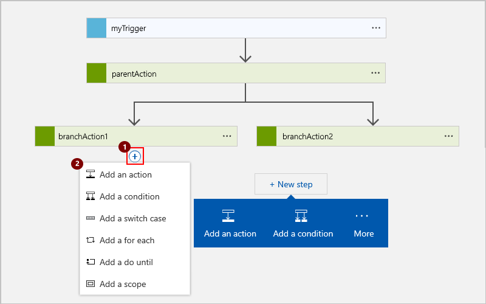

---
# required metadata
title: Create or join parallel branches - Azure Logic Apps | Microsoft Docs
description: How to create or join parallel branches for workflows in Azure Logic Apps
services: logic-apps
ms.service: logic-apps
author: ecfan
ms.author: estfan
manager: jeconnoc
ms.date: 03/05/2018
ms.topic: article

# optional metadata
ms.reviewer: klam, LADocs
ms.suite: integration
---

# Create or join parallel branches for workflow actions in Azure Logic Apps

By default, your actions in logic app workflows run sequentially. 
To perform independent actions at the same time, 
you can create [parallel branches](#parallel-branches), 
and then [join those branches](#join-branches) later in your flow. 

> [!TIP] 
> If you have a trigger that receives an array 
> and want to run a workflow for each array item, 
> you can *debatch* that array with the 
> [**SplitOn** trigger property](../logic-apps/logic-apps-workflow-actions-triggers.md#split-on-debatch).

## Prerequisites

* An Azure subscription. If you don't have a subscription, 
[sign up for a free Azure account](https://azure.microsoft.com/free/). 

* Basic knowledge about [how to create logic apps](../logic-apps/quickstart-create-first-logic-app-workflow.md)

<a name="parallel-branches"></a>

## Add a parallel branch

To run independent steps at the same time, 
you can add parallel branches next to an existing step. 


Your logic app waits for all branches to finish before continuing workflow.
Parallel branches run only when their `runAfter` property 
values match the finished parent step's status. 
For example, both `branchAction1` and `branchAction2` are set to 
run only when the `parentAction` completes with `Succeded` status.

> [!NOTE]
> Before you start, your logic app must already 
> have a step where you can add parallel branches.

1. In the <a href="https://portal.azure.com" target="_blank">Azure portal</a>, 
open your logic app in Logic App Designer.

2. Move your mouse over the arrow above the step where you want to add parallel branches.

3. Choose the **plus** sign (**+**), choose **Add a parallel branch**, 
and select the item that you want to add.

   

   Your selected item now appears in a parallel branch.

4. For each parallel branch, add the steps that you want. 
To add a sequential action to a parallel branch, 
move your mouse under the action where you want to add the sequential action. Choose the **plus** (**+**) sign and the step that you want to add.

   

5. To merge branches back together, 
[join your parallel branches](#join-branches). 

<a name="parallel-json"></a>

## Parallel branch definition (JSON)

If you're working in code view, you can define the parallel 
structure in your logic app's JSON definition instead, for example:

``` json
{
  "triggers": {
    "myTrigger": { }
  },
  "actions": {
    "parentAction": {
      "type": "<action-type>",
      "inputs": { },
      "runAfter": {}
    },
    "branchAction1": {
      "type": "<action-type>",
      "inputs": { },
      "runAfter": {
        "parentAction": [
          "Succeeded"
        ]
      }
    },
    "branchAction2": {
      "type": "<action-type>",
      "inputs": { },
      "runAfter": {
        "parentAction": [
          "Succeeded"
        ]
      }
    }
  },
  "outputs": {}
}
```

<a name="join-branches"></a>

## Join parallel branches

To merge parallel branches together, 
just add a step at the bottom under all the branches. 
This step runs after all the parallel branches finish running.


1. In the [Azure portal](https://portal.azure.com), 
find and open your logic app in Logic App Designer. 

2. Under the parallel branches that you want to join, 
add the step that you want to perform.

   

   Your parallel branches are now merged.

<a name="join-json"></a>

## Join definition (JSON)

If you're working in code view, you can define the join 
structure in your logic app's JSON definition instead, for example:

``` json
{
  "triggers": {
    "myTrigger": { }
  },
  "actions": {
    "parentAction": {
      "type": "<action-type>",
      "inputs": { },
      "runAfter": {}
    },
    "branchAction1": {
      "type": "<action-type>",
      "inputs": { },
      "runAfter": {
        "parentAction": [
          "Succeeded"
        ]
      }
    },
    "branchAction2": {
      "type": "<action-type>",
      "inputs": { },
      "runAfter": {
        "parentAction": [
          "Succeeded"
        ]
      }
    },
    "joinAction": {
      "type": "<action-type>",
      "inputs": { },
      "runAfter": {
        "branchAction1": [
          "Succeeded"
        ],
        "branchAction2": [
          "Succeeded"
        ]
      }
    }
  },
  "outputs": {}
}
```

## Get support

* For questions, visit the [Azure Logic Apps forum](https://social.msdn.microsoft.com/Forums/en-US/home?forum=azurelogicapps).
* To submit or vote on features and suggestions, visit the 
[Azure Logic Apps user feedback site](http://aka.ms/logicapps-wish).

## Next steps

* [Run steps based on a condition (conditional statements)](../logic-apps/logic-apps-control-flow-conditional-statement.md)
* [Run steps based on different values (switch statements)](../logic-apps/logic-apps-control-flow-switch-statement.md)
* [Run and repeat steps (loops)](../logic-apps/logic-apps-control-flow-loops.md)
* [Run steps based on grouped action status (scopes)](../logic-apps/logic-apps-control-flow-run-steps-group-scopes.md)
