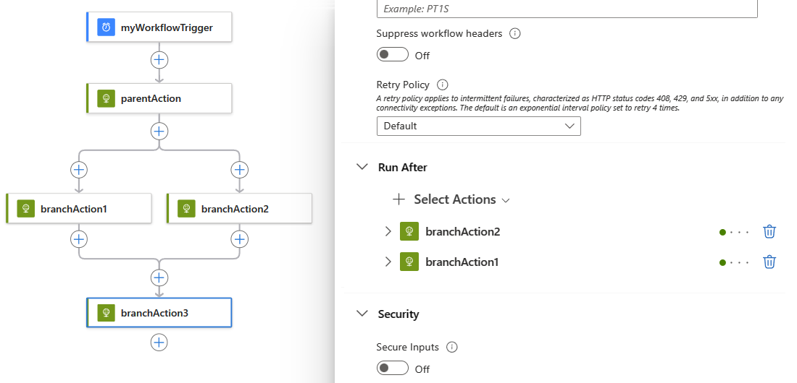

# Create or join parallel branches with workflow actions in Azure Logic Apps

[!INCLUDE [logic-apps-sku-consumption-standard](../../includes/logic-apps-sku-consumption-standard.md)]

By default, your actions in a logic app workflow run sequentially. To organize actions into separate branches and run those branches at the same time, you can create [parallel branches](#parallel-branches), and then [join those branches](#join-branches) later in your workflow.

> [!TIP]
>
> If you have a trigger that receives an array and want to run an individual workflow run instance for each array item, 
> you can *debatch* that array with the [**SplitOn** trigger property](logic-apps-workflow-actions-triggers.md#split-on-debatch).

This guide shows how to create parallel branches in a workflow and rejoin those branches, as shown in this high-level diagram:

:::image type="content" source="media/logic-apps-control-flow-branches/branch-join-overview.png" alt-text="Screenshot shows high-level conceptual diagram with parallel branches that later join in workflow." lightbox="media/logic-apps-control-flow-branches/branch-join-overview.png":::

## Prerequisites

* An Azure subscription. If you don't have a subscription, [sign up for a free Azure account](https://azure.microsoft.com/free/?WT.mc_id=A261C142F).

* A logic app workflow that starts with a trigger and the actions that you want. Make sure that your workflow includes the actions between where you want to add a parallel branch.

## Limitations

Parallel branches run only when their `runAfter` property values match the finished parent step's status. For example, both `branchAction1` and `branchAction2` are set to run only when the `parentAction` completes with `Succeeded` status.

Your workflow waits for all branches to finish before continuing the next action in the workflow.


<a name="parallel-branches"></a>

## Add a parallel branch action

### [Standard](#tab/standard)

1. In the [Azure portal](https://portal.azure.com), open your Standard logic app and workflow in the designer.

1. Between the actions where you want to add a parallel branch, move your pointer over the connecting arrow.

1. Select the **plus** sign (**+**) that appears, and then select **Add a parallel branch**.

   :::image type="content" source="media/logic-apps-control-flow-branches/add-parallel-branch-standard.png" alt-text="Screenshot shows Standard workflow with selected plus sign and selected option, Add a parallel branch." lightbox="media/logic-apps-control-flow-branches/add-parallel-branch-standard.png":::

1. Now, add the action that you want to run in the parallel branch. In the **Add an action** pane and search box, find and select the action that you want.

   :::image type="content" source="media/logic-apps-control-flow-branches/select-action-standard.png" alt-text="Screenshot shows Standard workflow with search box named Choose an operation." lightbox="media/logic-apps-control-flow-branches/select-action-standard.png":::

   The selected action now appears in the parallel branch, for example:

   :::image type="content" source="media/logic-apps-control-flow-branches/added-parallel-branch-standard.png" alt-text="Screenshot shows Standard workflow, parallel branch, and previously selected action." lightbox="media/logic-apps-control-flow-branches/added-parallel-branch-standard.png":::

1. To add another action to the parallel branch, under the action where you want to add a new action, select the **plus** (**+**) sign, and then select **Add an action**.

   :::image type="content" source="media/logic-apps-control-flow-branches/add-sequential-action-standard.png" alt-text="Screenshot shows Standard workflow and how to add another action to the same parallel branch." lightbox="media/logic-apps-control-flow-branches/add-sequential-action-standard.png":::

1. In the **Choose an operation** search box, find and select the action that you want.

   Your selected action now appears within the current branch, for example:

   :::image type="content" source="media/logic-apps-control-flow-branches/added-sequential-action-standard.png" alt-text="Screenshot shows Standard workflow with added sequential action." lightbox="media/logic-apps-control-flow-branches/added-sequential-action-standard.png":::

To merge branches back together, [join your parallel branches](#join-branches).

### [Consumption](#tab/consumption)

1. In the [Azure portal](https://portal.azure.com), open your Consumption logic app and workflow in the designer.

1. Between the actions where you want to add a parallel branch, move your pointer over the connecting arrow.

1. Select the **plus** sign (**+**) that appears, and then select **Add a parallel branch**.

   :::image type="content" source="media/logic-apps-control-flow-branches/add-parallel-branch-consumption.png" alt-text="Screenshot shows Consumption workflow with selected plus sign and selected option, Add a parallel branch." lightbox="media/logic-apps-control-flow-branches/add-parallel-branch-consumption.png":::

1. Now, add the action that you want to run in the parallel branch. In the **Choose an operation** search box, find and select the action that you want.

   :::image type="content" source="media/logic-apps-control-flow-branches/select-action-consumption.png" alt-text="Screenshot shows Consumption workflow with search box named Choose an operation." lightbox="media/logic-apps-control-flow-branches/select-action-consumption.png":::

   The selected action now appears in the parallel branch, for example:

   :::image type="content" source="media/logic-apps-control-flow-branches/added-parallel-branch-consumption.png" alt-text="Screenshot shows Consumption workflow, parallel branch, and previously selected action." lightbox="media/logic-apps-control-flow-branches/added-parallel-branch-consumption.png":::

1. To add another action to the parallel branch, under the action where you want to add a new action, move your pointer around, select the **plus** (**+**) sign that appears, and then select **Add an action**.

   :::image type="content" source="media/logic-apps-control-flow-branches/add-sequential-action-consumption.png" alt-text="Screenshot shows Consumption workflow and how to add another action to the same parallel branch." lightbox="media/logic-apps-control-flow-branches/add-sequential-action-consumption.png":::

1. In the **Choose an operation** search box, find and select the action that you want.

   Your selected action now appears within the current branch, for example:

   :::image type="content" source="media/logic-apps-control-flow-branches/added-sequential-action-consumption.png" alt-text="Screenshot shows Consumption workflow with added sequential action." lightbox="media/logic-apps-control-flow-branches/added-sequential-action-consumption.png":::

To merge branches back together, [join your parallel branches](#join-branches).

---

<a name="parallel-json"></a>

## Parallel branch definition (JSON)

If you're working in code view, you can define the parallel structure in your logic app workflow's JSON definition instead, for example:

``` json
{
  "triggers": {
    "myTrigger": {}
  },
  "actions": {
    "parentAction": {
      "type": "<action-type>",
      "inputs": {},
      "runAfter": {}
    },
    "branchAction1": {
      "type": "<action-type>",
      "inputs": {},
      "runAfter": {
        "parentAction": [
          "Succeeded"
        ]
      }
    },
    "branchAction2": {
      "type": "<action-type>",
      "inputs": {},
      "runAfter": {
        "parentAction": [
          "Succeeded"
        ]
      }
    }
  },
  "outputs": {}
}
```

<a name="join-branches"></a>

## Join parallel branches

To merge parallel branches together, just add a step at the bottom under all the branches. This step runs after all the parallel branches finish running.


1. In the [Azure portal](https://portal.azure.com), find and open your logic app in Logic App Designer.

1. Under the parallel branches you want to join, choose **New step**.

   

1. In the search box, find and select the action you want as the step that joins the branches.

   

   Your parallel branches are now merged.

   

<a name="join-json"></a>

## Join definition (JSON)

If you're working in code view, you can define the join 
structure in your logic app's JSON definition instead, for example:

``` json
{
  "triggers": {
    "myTrigger": { }
  },
  "actions": {
    "parentAction": {
      "type": "<action-type>",
      "inputs": { },
      "runAfter": {}
    },
    "branchAction1": {
      "type": "<action-type>",
      "inputs": { },
      "runAfter": {
        "parentAction": [
          "Succeeded"
        ]
      }
    },
    "branchAction2": {
      "type": "<action-type>",
      "inputs": { },
      "runAfter": {
        "parentAction": [
          "Succeeded"
        ]
      }
    },
    "joinAction": {
      "type": "<action-type>",
      "inputs": { },
      "runAfter": {
        "branchAction1": [
          "Succeeded"
        ],
        "branchAction2": [
          "Succeeded"
        ]
      }
    }
  },
  "outputs": {}
}
```

## Get support

* For questions, visit the [Microsoft Q&A question page for Azure Logic Apps](/answers/topics/azure-logic-apps.html).
* To submit or vote on features and suggestions, visit the 
[Azure Logic Apps user feedback site](https://aka.ms/logicapps-wish).

## Next steps

* [Run steps based on a condition (condition action)](../logic-apps/logic-apps-control-flow-conditional-statement.md)
* [Run steps based on different values (switch action)](../logic-apps/logic-apps-control-flow-switch-statement.md)
* [Run and repeat steps (loops)](../logic-apps/logic-apps-control-flow-loops.md)
* [Run steps based on grouped action status (scopes)](../logic-apps/logic-apps-control-flow-run-steps-group-scopes.md)
