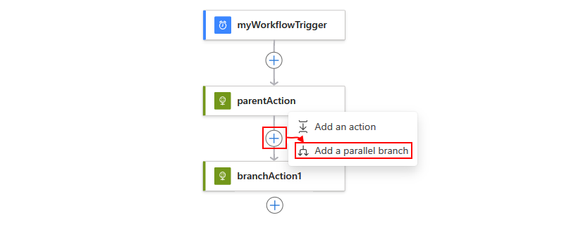
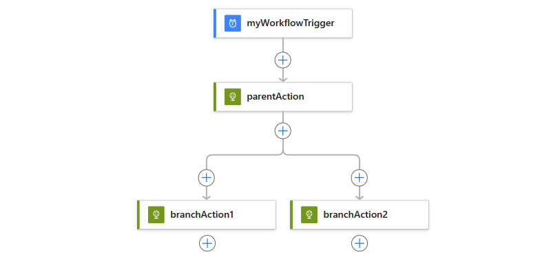
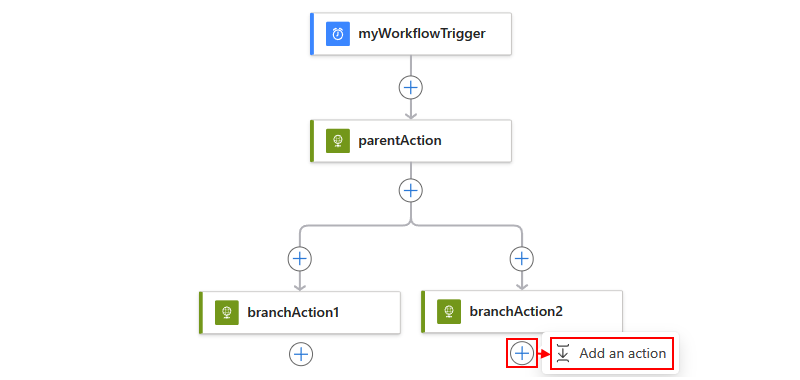
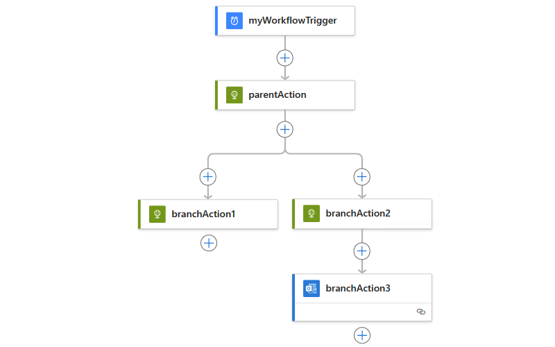

# Create or join parallel branches for workflow actions in Azure Logic Apps

By default, your actions in logic app workflows run sequentially. 
To perform independent actions at the same time, 
you can create [parallel branches](#parallel-branches), 
and then [join those branches](#join-branches) later in your flow. 

> [!TIP] 
> If you have a trigger that receives an array 
> and want to run a workflow for each array item, 
> you can *debatch* that array with the 
> [**SplitOn** trigger property](../logic-apps/logic-apps-workflow-actions-triggers.md#split-on-debatch).

## Prerequisites

* An Azure subscription. If you don't have a subscription, 
[sign up for a free Azure account](https://azure.microsoft.com/free/). 

* Basic knowledge about [how to create logic apps](../logic-apps/quickstart-create-first-logic-app-workflow.md)

<a name="parallel-branches"></a>

## Add parallel branch

To run independent steps at the same time, 
you can add parallel branches next to an existing step. 


Your logic app waits for all branches to finish before continuing workflow. 
Parallel branches run only when their `runAfter` property 
values match the finished parent step's status. 
For example, both `branchAction1` and `branchAction2` are set to 
run only when the `parentAction` completes with `Succeeded` status.

> [!NOTE]
> Before you start, your logic app must already 
> have a step where you can add parallel branches.

1. In the <a href="https://portal.azure.com" target="_blank">Azure portal</a>, 
open your logic app in Logic App Designer.

1. Move your pointer over the arrow above the 
step where you want to add parallel branches. 
Choose the **plus** sign (**+**) that appears, 
and then choose **Add a parallel branch**. 

   

1. In the search box, find and select the action you want.

   

   Your selected action now appears in the parallel branch, for example:

   

1. Now, in each parallel branch, add the steps you want. 
To add another action to a branch, move your pointer under 
the action where you want to add a sequential action. 
Choose the **plus** (**+**) sign that appears, 
and then select **Add an action**.

   

1. In the search box, find and select the action you want.

   

   Your selected action now appears within the current branch, for example:

   

To merge branches back together, 
[join your parallel branches](#join-branches). 

<a name="parallel-json"></a>

## Parallel branch definition (JSON)

If you're working in code view, you can define the parallel 
structure in your logic app's JSON definition instead, for example:

``` json
{
  "triggers": {
    "myTrigger": {}
  },
  "actions": {
    "parentAction": {
      "type": "<action-type>",
      "inputs": {},
      "runAfter": {}
    },
    "branchAction1": {
      "type": "<action-type>",
      "inputs": {},
      "runAfter": {
        "parentAction": [
          "Succeeded"
        ]
      }
    },
    "branchAction2": {
      "type": "<action-type>",
      "inputs": {},
      "runAfter": {
        "parentAction": [
          "Succeeded"
        ]
      }
    }
  },
  "outputs": {}
}
```

<a name="join-branches"></a>

## Join parallel branches

To merge parallel branches together, 
just add a step at the bottom under all the branches. 
This step runs after all the parallel branches finish running.


1. In the [Azure portal](https://portal.azure.com), 
find and open your logic app in Logic App Designer. 

1. Under the parallel branches you want to join, choose **New step**. 

   

1. In the search box, find and select the action 
you want as the step that joins the branches.

   

   Your parallel branches are now merged.

   

<a name="join-json"></a>

## Join definition (JSON)

If you're working in code view, you can define the join 
structure in your logic app's JSON definition instead, for example:

``` json
{
  "triggers": {
    "myTrigger": { }
  },
  "actions": {
    "parentAction": {
      "type": "<action-type>",
      "inputs": { },
      "runAfter": {}
    },
    "branchAction1": {
      "type": "<action-type>",
      "inputs": { },
      "runAfter": {
        "parentAction": [
          "Succeeded"
        ]
      }
    },
    "branchAction2": {
      "type": "<action-type>",
      "inputs": { },
      "runAfter": {
        "parentAction": [
          "Succeeded"
        ]
      }
    },
    "joinAction": {
      "type": "<action-type>",
      "inputs": { },
      "runAfter": {
        "branchAction1": [
          "Succeeded"
        ],
        "branchAction2": [
          "Succeeded"
        ]
      }
    }
  },
  "outputs": {}
}
```

## Get support

* For questions, visit the [Microsoft Q&A question page for Azure Logic Apps](https://docs.microsoft.com/answers/topics/azure-logic-apps.html).
* To submit or vote on features and suggestions, visit the 
[Azure Logic Apps user feedback site](https://aka.ms/logicapps-wish).

## Next steps

* [Run steps based on a condition (conditional statements)](../logic-apps/logic-apps-control-flow-conditional-statement.md)
* [Run steps based on different values (switch statements)](../logic-apps/logic-apps-control-flow-switch-statement.md)
* [Run and repeat steps (loops)](../logic-apps/logic-apps-control-flow-loops.md)
* [Run steps based on grouped action status (scopes)](../logic-apps/logic-apps-control-flow-run-steps-group-scopes.md)
