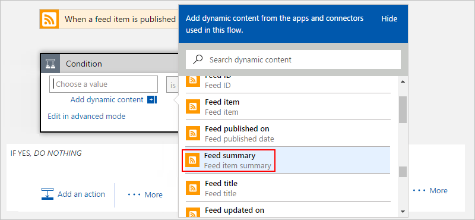
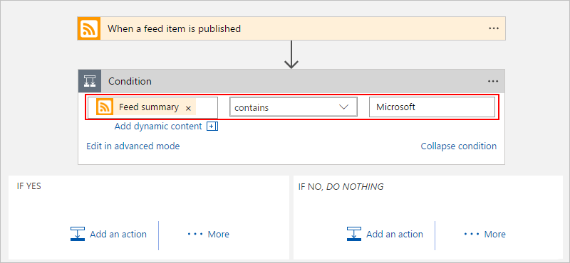

# Conditional statements: Run steps based on a condition in logic apps

To perform steps only after passing a specified condition, 
use a *conditional statement*. This structure compares data 
in your workflow against specific values or fields. 
You can then define different steps to run based on 
whether or not the data meets the condition. 
You can nest conditions inside each other.

For example, suppose you have a logic app that sends too 
many emails when new items appear on a website's RSS feed. 
You can add a conditional statement to send email only 
when the new item includes a specific string. 

> [!TIP]
> To run different steps based on different specific values, 
> use a [*switch statement*](../logic-apps/logic-apps-control-flow-switch-statement.md) instead.

## Prerequisites

* An Azure subscription. If you don't have a subscription, 
[sign up for a free Azure account](https://azure.microsoft.com/free/).

* Basic knowledge about [how to create logic apps](../logic-apps/quickstart-create-first-logic-app-workflow.md)

* To follow the example in this article, 
[create this sample logic app](../logic-apps/quickstart-create-first-logic-app-workflow.md) 
with an Outlook.com or Office 365 Outlook account.

## Add a condition

1. In the <a href="https://portal.azure.com" target="_blank">Azure portal</a>, 
open your logic app in Logic App Designer.

2. Add a condition at the location that you want. 

   To add a condition between steps, move the pointer over the arrow where 
   you want to add the condition. Choose the **plus sign** (**+**) that appears, 
   then choose **Add a condition**. For example:

   

   When you want to add a condition at the end of your workflow, 
   at the bottom of your logic app, 
   choose  **+ New step** > **Add a condition**.

3. Under **Condition**, create your condition. 

   1. In the left box, specify the data or field that you want to compare.

      From the **Add dynamic content** list, 
      you can select existing fields from your logic app.

   2. In the middle list, select the operation to perform. 
   3. In the right box, specify a value or field as your criteria.

   For example:

   

   Here's the complete condition:

   

   > [!TIP]
   > To create a more advanced condition or use expressions, 
   > choose **Edit in advanced mode**. You can use 
   > expressions defined by the [Workflow Definition Language](../logic-apps/logic-apps-workflow-definition-language.md).
   > 
   > For example:
   >
   > 

5. Under **IF YES** and **IF NO**, add the steps to perform 
based on whether the condition is met. For example:

   

   > [!TIP]
   > You can drag existing actions into the **IF YES** and **IF NO** paths.

6. Save your logic app.

Now this logic app only sends mail when the new 
items in the RSS feed meet your condition.

## JSON definition

Now that you created a logic app using a conditional statement, 
let's look at the high-level code definition behind the conditional statement.

``` json
"actions": {
  "myConditionName": {
    "type": "If",
    "expression": "@contains(triggerBody()?['summary'], 'Microsoft')",
    "actions": {
      "Send_an_email": {
        "inputs": { },
        "runAfter": {}
      }
    },
    "runAfter": {}
  }
},
```

## Get support

* For questions, visit the [Azure Logic Apps forum](https://social.msdn.microsoft.com/Forums/en-US/home?forum=azurelogicapps).
* To submit or vote on features and suggestions, visit the 
[Azure Logic Apps user feedback site](http://aka.ms/logicapps-wish).

## Next steps

* [Run steps based on different values (switch statements)](../logic-apps/logic-apps-control-flow-switch-statement.md)
* [Run and repeat steps (loops)](../logic-apps/logic-apps-control-flow-loops.md)
* [Run or merge parallel steps (branches)](../logic-apps/logic-apps-control-flow-branches.md)
* [Run steps based on grouped action status (scopes)](../logic-apps/logic-apps-control-flow-run-steps-group-scopes.md)