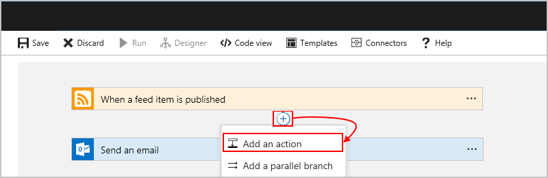
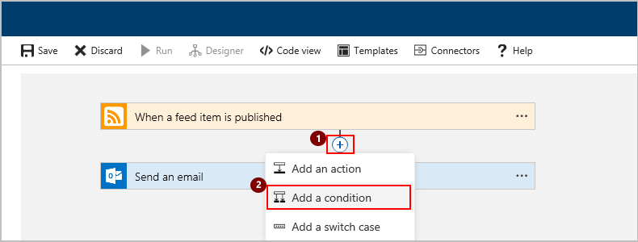
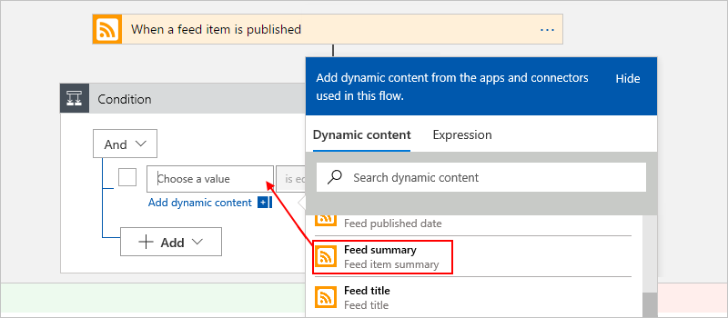
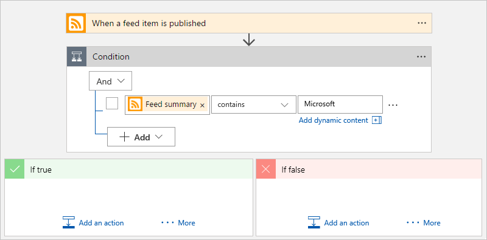
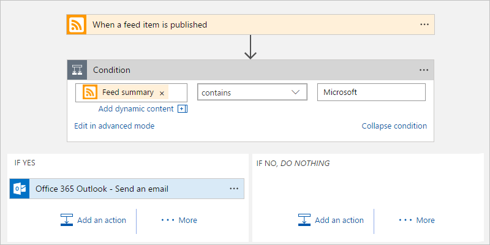

# Add conditions to control workflow actions in Azure Logic Apps

[!INCLUDE [logic-apps-sku-consumption](../../includes/logic-apps-sku-consumption.md)]

To run specific actions in your logic app workflow only after passing a specified condition, 
add a *condition action*. This control structure compares the data in your 
workflow against specific values or fields. You can then specify different actions 
that run based on whether or not the data meets the condition. 
You can nest conditions inside each other.

For example, suppose you have a logic app workflow that sends too 
many emails when new items appear on a website's RSS feed. 
You can add a condition action to send email only 
when the new item includes a specific string. 

> [!TIP]
> To run different steps based on different specific values, 
> use a [*switch statement*](../logic-apps/logic-apps-control-flow-switch-statement.md) instead.

## Prerequisites

* An Azure account and subscription. If you don't have a subscription, [sign up for a free Azure account](https://azure.microsoft.com/free/).

* Basic knowledge about [logic app workflows](../logic-apps/logic-apps-overview.md)

* To follow the example in this article, [create an example Consumption logic app workflow](../logic-apps/quickstart-create-example-consumption-workflow.md) with either an Outlook.com account or a Microsoft work or school account.

## Add condition

1. In the [Azure portal](https://portal.azure.com), open your logic app workflow in the designer.

1. Add a condition at the location that you want.

   To add a condition between steps, move the pointer over the arrow where 
   you want to add the condition. Choose the **plus sign** (**+**) that appears, 
   then choose **Add an action**. For example:

   

   When you want to add a condition at the end of your workflow, 
   under the last step in your workflow, choose  **New step** > **Add an action**.

1. In the search box, enter "condition" as your filter. 
Select this action: **Condition - Control**

   

1. In the **Condition** box, build your condition. 

   1. In the left box, specify the data or field that you want to compare.

      When you click inside the left box, the dynamic content list appears 
      so you can select outputs from previous steps in your logic app. 
      For this example, select the RSS feed summary.

      

   1. In the middle box, select the operation to perform. 
   For this example, select "**contains**". 

   1. In the right box, specify a value or field as your criteria. 
   For this example, specify this string: **Microsoft**

   Here's the complete condition:

   

   To add another row to your condition, choose **Add** > **Add row**. 
   To add a group with subconditions, choose **Add** > **Add group**. 
   To group existing rows, select the checkboxes for those rows, 
   choose the ellipses (...) button for any row, and then choose **Make group**.

1. Under **If true** and **If false**, add the steps to perform 
based on whether the condition is met. For example:

   

   > [!TIP]
   > You can drag existing actions into the **If true** and **If false** paths.

1. Save your logic app.

This logic app now sends mail only when the new items in the RSS feed meet your condition.

## JSON definition

The following shows the high-level code definition behind the **Condition** action, but for the find full definition, see [If action - Schema reference guide for trigger and action types in Azure Logic Apps](logic-apps-workflow-actions-triggers.md#if-action).

``` json
"actions": {
  "Condition": {
    "type": "If",
    "actions": {
      "Send_an_email": {
        "inputs": {},
        "runAfter": {}
    },
    "expression": {
      "and": [ 
        { 
          "contains": [ 
            "@triggerBody()?['summary']", 
            "Microsoft"
          ]
        } 
      ]
    },
    "runAfter": {}
  }
},
```

## Next steps

* [Run steps based on different values (switch actions)](../logic-apps/logic-apps-control-flow-switch-statement.md)
* [Run and repeat steps (loops)](../logic-apps/logic-apps-control-flow-loops.md)
* [Run or merge parallel steps (branches)](../logic-apps/logic-apps-control-flow-branches.md)
* [Run steps based on grouped action status (scopes)](../logic-apps/logic-apps-control-flow-run-steps-group-scopes.md)
