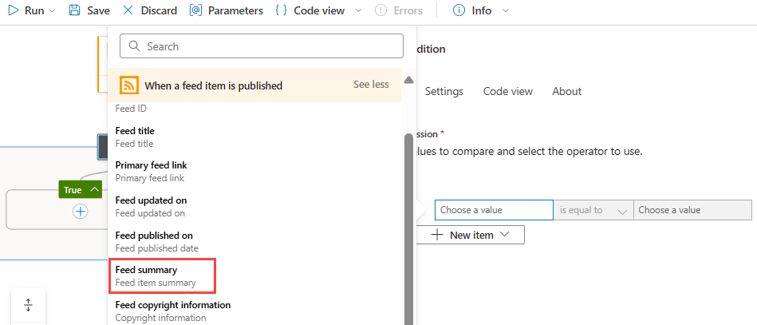
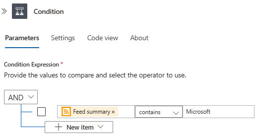
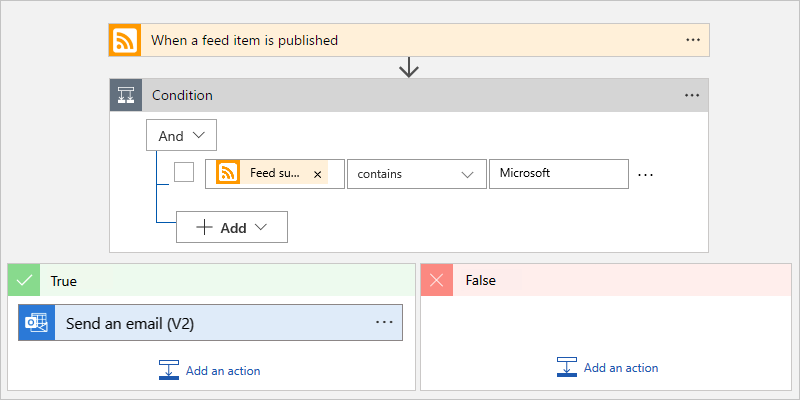
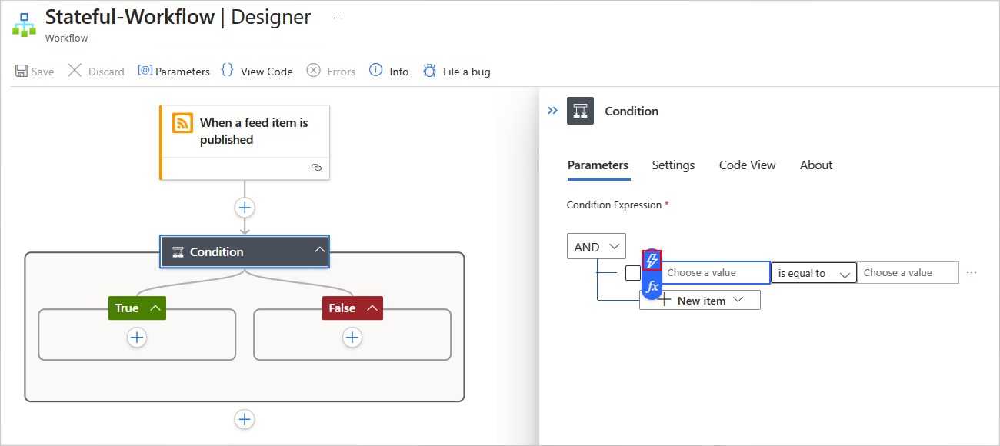
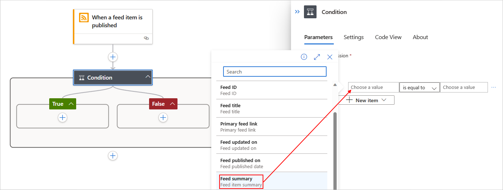
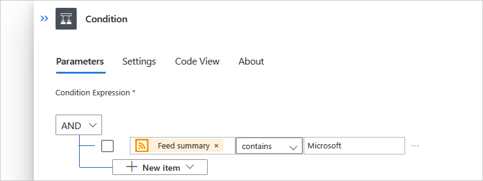
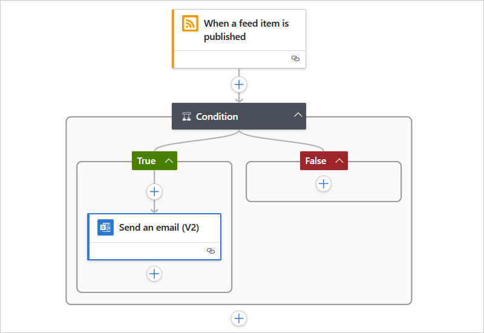

# Add conditions to control workflow actions in Azure Logic Apps

[!INCLUDE [logic-apps-sku-consumption-standard](../../includes/logic-apps-sku-consumption-standard.md)]

When you want to set up a condition that returns true or false and have the result determine whether your workflow runs one path of actions or another, add the **Control** action named **Condition** to your workflow. You can also nest conditions inside each other.

For example, suppose you have a workflow that sends too many emails when new items appear on a website's RSS feed. 
You can add the **Condition** action to send email only when the new item includes a specific word.

> [!NOTE]
>
> If you want to specify more than two paths from which your workflow can choose
> or condition criteria that's not restricted to only true or false, use a
> [*switch action* instead](logic-apps-control-flow-switch-statement.md).

This guide shows how to add a condition to your workflow and use the result to help your workflow choose between two action paths.

## Prerequisites

* An Azure account and subscription. If you don't have a subscription, [sign up for a free Azure account](https://azure.microsoft.com/free/?WT.mc_id=A261C142F).

* Basic knowledge about [logic app workflows](logic-apps-overview.md)

* To follow the example in this how-to guide, create either an [example Consumption logic app workflow](quickstart-create-example-consumption-workflow.md) or an [example Standard logic app workflow](create-single-tenant-workflows-azure-portal.md) and use either an Outlook.com account or a Microsoft work or school account.

## Add a condition

### [Consumption](#tab/consumption)

1. In the [Azure portal](https://portal.azure.com), open your logic app workflow in the designer.

1. [Follow these general steps to add the **Condition** action to your workflow](create-workflow-with-trigger-or-action.md?tabs=consumption#add-action).

1. In the **Condition** action, follow these steps to build your condition:

   1. In the left-side box named **Choose a value**, enter the first value or field that you want to compare.

      When you select inside the **Choose a value** box, the dynamic content list opens automatically. From this list, you can select outputs from previous steps in your workflow.

      This example selects the RSS trigger output named **Feed summary**.

      

   1. Open the middle list, select the operation to perform.
   
      This example selects **contains**.

   1. In the right-side box named **Choose a value**, enter the value or field that you want to compare with the first.
   
      This example specifies the following string: **Microsoft**

   The complete condition now looks like the following example:

   

   - To add another row to your condition, from the **Add** menu, select **Add row**.

   - To add a group with subconditions, from the **Add** menu, select **Add group**.

   - To group existing rows, select the checkboxes for those rows, select the ellipses (...) button for any row, and then select **Make group**.

1. In the **True** and **False** action paths, add the actions that you want to run, based on whether the condition is true or false respectively, for example:

   

   > [!TIP]
   >
   > You can drag existing actions into the **True** and **False** paths.

1. Save your workflow. On the designer toolbar, select **Save**.

### [Standard](#tab/standard)

1. In the [Azure portal](https://portal.azure.com), open your logic app workflow in the designer.

1. [Follow these general steps to add the **Condition** action to your workflow](create-workflow-with-trigger-or-action.md?tabs=standard#add-action).

1. On the designer, select the **Condition** action to open the information pane. Follow these steps to build your condition:

   1. In the left-side box named **Choose a value**, enter the first value or field that you want to compare.

      After you select inside the **Choose a value** box, the options to open the dynamic content list (lightning icon) or expression editor (formula icon) appear.

   1. Select the lightning icon to open the dynamic content list.

      From this list, you can select outputs from previous steps in your workflow.

      

      This example selects the RSS trigger output named **Feed summary**.

      

   1. From the middle list, select the operation to perform.
   
      This example selects **contains**.

   1. In the right-side box named **Choose a value**, enter the value or field that you want to compare with the first.
   
      This example specifies the following string: **Microsoft**

   The following example shows the complete condition:

   

   - To add another row to your condition, from the **New item** menu, select **Add Row**.

   - To add a group with subconditions, from the **New item** menu, select **Add Group**.

   - To group existing rows, select the checkboxes for those rows, select the ellipses (...) button for any row, and then select **Make Group**.

1. In the **True** and **False** action paths, add the actions to run, based on whether the condition is true or false respectively, for example:

   

   > [!TIP]
   >
   > You can drag existing actions into the **True** and **False** paths.

1. Save your workflow. On the designer toolbar, select **Save**.

---

This workflow now sends mail only when the new items in the RSS feed meet your condition.

## JSON definition

The following code shows the high-level JSON definition for the **Condition** action. For the full definition, see [If action - Schema reference guide for trigger and action types in Azure Logic Apps](logic-apps-workflow-actions-triggers.md#if-action).

``` json
"actions": {
   "Condition": {
      "type": "If",
      "actions": {
         "Send_an_email_(V2)": {
            "inputs": {},
            "runAfter": {},
            "type": "ApiConnection"
         },
      },
      "expression": {
         "and": [ 
            {
               "contains": [ 
                  "@triggerBody()?['summary']",
                  "Microsoft"
               ]
            }
         ]
      },
      "runAfter": {
         "Condition": [
            "Succeeded"
         ]
      },
   }
},
```

## Next steps

* [Run steps based on different values (switch actions)](logic-apps-control-flow-switch-statement.md)
* [Run and repeat steps (loops)](logic-apps-control-flow-loops.md)
* [Run or merge parallel steps (branches)](logic-apps-control-flow-branches.md)
* [Run steps based on grouped action status (scopes)](logic-apps-control-flow-run-steps-group-scopes.md)
